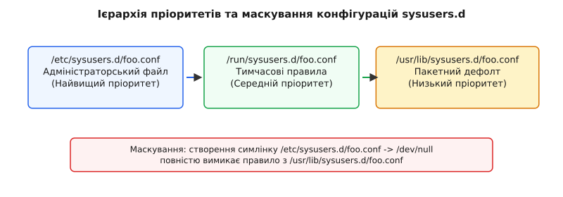
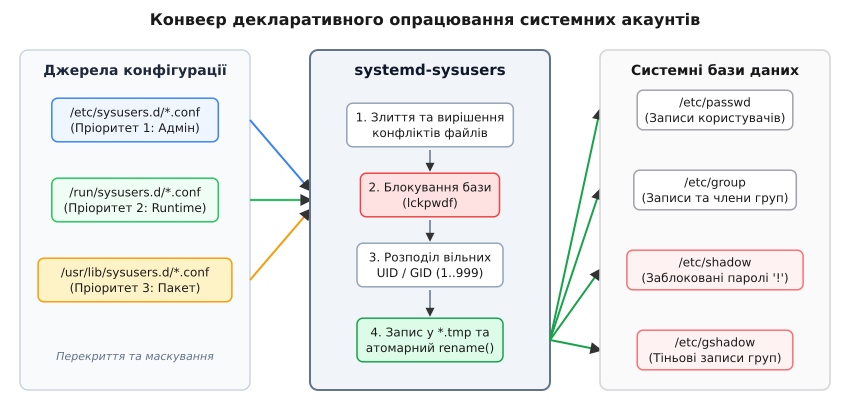

# systemd-sysusers: облікові записи, описані декларативно

<preknowlist>
- [Ініціалізація та PID 1](root:sys-unix/init-and-pid1) — порядок завантаження системи та роль фонових служб.
- [Управління тимчасовими та емульованими файлами через tmpfiles.d](root:sys-unix/tmpfiles-d-runtime-volatile-files) — створення структур у файловій системі під час завантаження.
- [Динамічні користувачі служб у systemd](root:sys-unix/dynamic-service-users) — ізоляція сервісів без створення постійних записів у `/etc/passwd`.
</preknowlist>

Коли на два сервери у кластері розгортаються суміжні бази даних PostgreSQL та Redis, імперативні інсталяційні скрипти пакетного менеджера викликають `useradd -r`. Якщо на першому сервері спочатку встановлюється PostgreSQL, службовий користувач `postgres` отримує перший вільний системний ідентифікатор UID 998, а `redis` — UID 997. Якщо на другому сервері черговість встановлення з будь-яких причин змінюється (наприклад, через відмінності у залежностях або ручне розгортання), `redis` здобуває UID 998, а `postgres` — UID 997. У результаті списки доступу на спільній мережевій файловій системі (NFS або Ceph) розходяться: файли бази даних `postgres` з першого сервера на другому сприймаються як належні демону `redis`, що призводить до негайної відмови у доступі або до критичного витоку даних між ізольованими службами.

Додаткова фундаментальна проблема виникає у сучасних операційних системах із незмінним кореневим розділом (Immutable OS, OSTree, ChromeOS, Flatpak-контейнери, SteamOS). Системний каталог `/usr` монтується у режимі лише для читання, а каталог конфігурацій `/etc` при першому завантаженні системи або після процедури скидання до заводських налаштувань (Factory Reset) є абсолютно порожнім. У цій моделі традиційні командні утиліти `useradd` та `groupadd` не можуть функціонувати: вони розраховані на наявність уже згенерованого файлу `/etc/passwd` та виконання оболоночних скриптів під час розпакування пакунків пакетним менеджером.

Для вирішення цих системних суперечностей у рамках екосистеми systemd було розроблено підхід декларативного опису системних облікових записів. Детальний аналіз історичного переходу від shell-скриптів до декларативних маніфестів наведено у вставці [Історія еволюції управління системними акаунтами](root:sys-unix/sysusers-declarative-accounts/hist-declarative-users.md).

## Декларативна модель опису стану замість дій

Фундаментальна відмінність утиліти `systemd-sysusers` полягає у зміні парадигми: замість виконання послідовних дій ("запустити командну утиліту, перевірити статус повернення, додати рядок у файл") пакет або адміністратор визначає бажаний кінцевий стан системи за допомогою статичних конфігураційних маніфестів.

Маніфести розгортаються у вигляді текстових файлів із розширенням `.conf` у трьох системних каталогах, які утворюють сувору ієрархію пріоритетів:

1. **/etc/sysusers.d/*.conf** — конфігурації локального системного адміністратора (найвищий пріоритет).
2. **/run/sysusers.d/*.conf** — тимчасові конфігурації, згенеровані під час роботи системи підсистемами volatile runtime (середній пріоритет).
3. **/usr/lib/sysusers.d/*.conf** — конфігурації за замовчуванням, що постачаються розробниками дистрибутива та пакетними менеджерами (найнижчий пріоритет).


*Принцип перекриття пріоритетів між каталогами /etc, /run та /usr/lib з маскуванням через /dev/null*

Якщо файл із однаковим іменем (наприклад, `nginx.conf`) присутній і в `/usr/lib/sysusers.d/`, і в `/etc/sysusers.d/`, утиліта повністю ігнорує пакетний файл і застосовує версію адміністратора із `/etc/sysusers.d/`.

Для повного вимкнення правил, які постачаються з пакетом, адміністратору достатньо створити символічне посилання з такою самою назвою у каталозі `/etc/sysusers.d/`, яке вказує на `/dev/null` (або створити порожній файл). Під час сканування `systemd-sysusers` виявляє маскування і не створює відповідних користувачів та груп.

Повний технічний довідник полів та командних прапорців утиліти деталізовано у вставці [Специфікація синтаксису файлів sysusers.d](root:sys-unix/sysusers-declarative-accounts/api-sysusers-format.md).

## Внутрішній механізм опрацювання та розподілу UID/GID

За запуск утиліти відповідає системна служба `systemd-sysusers.service`. Вона активується на найранішому етапі завантаження операційної системи (Early Boot Stage), до того як стартують фонові мережеві сервіси та призначені для них користувачі.


*Схема зчитування маніфестів sysusers.d, блокування баз даних та атомарного оновлення системних файлів*

Процес обробки та створення облікових записів відбувається у шість послідовних кроків:

### Крок 1. Зчитування та впорядкування маніфестів

Утиліта сканує всі три каталоги, будує єдиний список файлів `.conf` та впорядковує їх за лексикографічним порядком імен файлів. Це дозволяє контролювати черговість виконання за допомогою числових префіксів (наприклад, `00-system.conf` буде опрацьовано раніше за `50-apps.conf`).

### Крок 2. Побудова графа залежностей у пам'яті

Кожен рядок конфігурації розбирається на окремі поля:
* `u` (User) — створення користувача та його первинної групи.
* `g` (Group) — створення додаткової системи груп.
* `m` (Member) — прив'язка користувача до вторинної групи.
* `r` (Range) — резервування діапазону ідентифікаторів.

Утиліта аналізує залежності між запитами. Якщо директива `m john docker` додає користувача `john` до групи `docker`, але група ще не створена, `systemd-sysusers` відкладає виконання операції членства до моменту створення запису групи через директиву `g` або `u`.

### Крок 3. Перевірка наявних баз даних

Утиліта відкриває файли `/etc/passwd` та `/etc/group` у режимі читання та завантажує існуючі записи в оперативну пам'ять. Якщо користувач чи група із вказаним іменем вже існують у системі, `systemd-sysusers` перевіряє відповідність їхніх числових ідентифікаторів UID/GID:

* Якщо наявний запис повністю відповідає опису в маніфесті, створення повторно не виконується (операція є строго ідемпотентною).
* Якщо наявний користувач має інший UID, ніж той, що явно вимагається у конфігураційному файлі (наприклад, у конфігурації вказано `u postgres 450`, а у файлі `/etc/passwd` вже є `postgres` з UID 998), утиліта генерує попередження у системний журнал journald і залишає існуючий UID без змін, щоб не порушити права доступу на наявних файлах дискової системи.

### Крок 4. Алгоритм розподілу вільних ідентифікаторів

Якщо у конфігураційному рядку вказано дефіс `-` замість конкретного числового ідентифікатора (наприклад, `u nginx - "Nginx Web Server"`), `systemd-sysusers` виконує динамічний пошук вільного системного UID:

1. Визначається межа системних ідентифікаторів. За замовчуванням це діапазон від 1 до `SYS_UID_MAX` (зазвичай 999), або значення, зчитані з файлу `/etc/login.defs` (параметри `SYS_UID_MIN` та `SYS_UID_MAX`).
2. Пошук вільного UID здійснюється у зворотному або прямому порядку, скануючи зайняті номери у пам'яті. Перший числовий ідентифікатор у системному діапазоні, який не використовується жодним користувачем у `/etc/passwd`, призначається новому акаунту.
3. Для створеної первинної групи вибирається тотожний GID, рівний вибраному UID. Якщо відповідний GID уже зайнятий іншою групою, шукається перший вільний системний GID.

### Крок 5. Взаємодія з системним файлом /etc/login.defs

Утиліта `systemd-sysusers` поважає налаштування діапазонів ідентифікаторів, задані в конфігураційному файлі `/etc/login.defs`. Параметри `SYS_UID_MIN` та `SYS_UID_MAX` визначають межі для системних користувачів, тоді як `UID_MIN` та `UID_MAX` задають межі для звичайних інтерактивних користувачів (зазвичай 1000..60000).

Цей поділ має принципове значення для безпеки: `systemd-sysusers` ніколи не виділить числовий UID з діапазону інтерактивних користувачів (>1000), навіть якщо системний діапазон (1..999) буде повністю вичерпано. Якщо всі системні UID зайняті, утиліта завершується з помилкою і реєструє повідомлення в журналі.

### Крок 6. Забезпечення безпеки: блокування паролів

Для всіх створених системних користувачів `systemd-sysusers` створює записи у тіньових файлах `/etc/shadow` та `/etc/gshadow`. У полі хешу пароля записується символ `!` (або `!*`).

На рівні підсистеми автентифікації Linux (PAM) це означає, що заблокований обліковий запис не може бути використаний для інтерактивного входу через консоль, SSH або дисплейний менеджер за паролем. Сервіс може виконуватися під цим UID лише шляхом прямого системного виклику `setuid()` під час старту PID 1 або за допомогою утиліти `su` / `sudo` від імені адміністратора `root`.

## Межі відповідальності: локальні файли проти мережевих служб імен (NSS/LDAP)

Важливо підкреслити межу застосування `systemd-sysusers`: ця утиліта працює **виключно з локальними файлами** `/etc/passwd`, `/etc/group`, `/etc/shadow` та `/etc/gshadow`. Вона навмисно не використовує підсистему Name Service Switch (NSS) та зовнішні мережеві служби каталогу (LDAP, Active Directory, FreeIPA, SSSD).

Цей архітектурний вибір зумовлений двома причинами:
1. **Залежність від мережі.** Під час раннього завантаження операційної системи (Early Boot Stage) мережеві інтерфейси ще не ініціалізовано, а демони `sssd` або `winbindd` ще не запущені. Спроба звернення до LDAP на цьому етапі спричинила б мертве блокування (deadlock) системи завантаження.
2. **Гарантія завантажуваності (Bootability).** Системні користувачі (такі як `systemd-journal`, `systemd-network`, `dbus`) повинні існувати локально на диску навіть у разі повної відсутності мережевого з'єднання або пошкодження централізованого сервера автентифікації.

## Атомарність та транзакційність оновлення записів

Критичною вимогою до системних утилит управління обліковими записами є стійкість до збоїв живлення та запобігання стану гонки (Race Condition). Модифікація файлів `/etc/passwd` або `/etc/group` "на місці" (відкриття файлу у режимі запису `w`) є неприпустимою: у разі аварійного вимкнення живлення посеред запису файл виявиться обрізаним до нульової довжини, що призведе до повної непрацездатності системи при наступному завантаженні (неможливість автентифікації навіть для `root`).

Для забезпечення атомарності `systemd-sysusers` дотримується наступного транзакційного протоколу:

1. **Глобальне файлове блокування.** Викликом POSIX-функції `lckpwdf()` створюється спеціальний файл блокування `/etc/.pwd.lock`. Якщо інша утиліта тримає блокування, виклик затримується або повертає помилку.
2. **Запис у тимчасовий буфер.** Модифікована база даних пишеться у новий тимчасовий файл у тому ж самому каталозі — `/etc/passwd.tmp`. Оскільки новий і старий файли знаходяться в межах однієї файлової системи, для них гарантується спільний інодний простір.
3. **Синхронізація з фізичним носієм.** Після завершення формування тексту утиліта викликає системний виклик `fsync()` для файлового дескриптора тимчасового файлу. Це гарантує, що всі буфери ядра та кеш дискового контролера фізично записані на енергонезалежний носій.
4. **Атомарне перейменування.** Виконується системний виклик `rename("/etc/passwd.tmp", "/etc/passwd")` (або `renameat2`). У файлових системах POSIX операція заміни елемента каталогу в межах однієї файлової системи є строго атомарною: для сторонніх процесів файл `/etc/passwd` або містить старий повний вміст, або новий повний вміст, але ніколи не проміжний чи пошкоджений стан.
5. **Зняття блокування.** Викликом `ulckpwdf()` видаляється блокування `/etc/.pwd.lock`.

Низькорівневу реалізацію цього алгоритму мовами C та C++ з використанням шаблону RAII наведено у вставці [Практична реалізація парсера та атомарного оновлення баз даних](root:sys-unix/sysusers-declarative-accounts/proj-sysusers-parser.md).

Розглянемо практичну реалізацію перевірки існування користувача та атомарного читання системної бази даних:

:::tabs
```c
#define _GNU_SOURCE
#include <stdio.h>
#include <stdlib.h>
#include <pwd.h>
#include <shadow.h>
#include <errno.h>

/* Перевірка стану системного користувача за допомогою стандартного C API */
int check_system_user(const char *username, uid_t *out_uid) {
    struct passwd *pw = getpwnam(username);
    if (pw == NULL) {
        if (errno == 0) {
            /* Користувача не знайдено */
            return 0;
        }
        perror("Помилка при виклику getpwnam");
        return -1;
    }
    
    if (out_uid != NULL) {
        *out_uid = pw->pw_uid;
    }
    return 1;
}
```
```cpp
#include <iostream>
#include <string>
#include <optional>
#include <system_error>
#include <cerrno>
#include <pwd.h>

// Ідіоматична C++ обгортка над системним викликом POSIX getpwnam
class UserDatabaseReader {
public:
    struct UserInfo {
        std::string name;
        uid_t uid;
        gid_t gid;
        std::string home;
        std::string shell;
    };

    static std::optional<UserInfo> find_user(const std::string& username) {
        errno = 0;
        struct passwd* pw = ::getpwnam(username.c_str());
        if (pw == nullptr) {
            if (errno != 0) {
                throw std::system_error(errno, std::generic_category(), "Помилка getpwnam для " + username);
            }
            return std::nullopt;
        }

        return UserInfo{
            .name = pw->pw_name,
            .uid = pw->pw_uid,
            .gid = pw->pw_gid,
            .home = pw->pw_dir,
            .shell = pw->pw_shell
        };
    }
};
```
:::

## Інтеграція з пакетними менеджерами та генерацією образів

Впровадження `systemd-sysusers` кардинально спростило створення пакетів програмного забезпечення для дистрибутивів Linux (RPM, DEB, Pacman, PKGBUILD).

### Сценарій 1. Збирання дистрибутивного пакунка

Замість написання складних оболоночних скриптів у секціях `%pre` або `postinst` розробник пакету просто додає конфігураційний файл у каталог `/usr/lib/sysusers.d/`.

Наприклад, пакунок для СУБД PostgreSQL поставляє файл `/usr/lib/sysusers.d/postgresql.conf`:

```text
# Створення користувача postgres для СУБД PostgreSQL
u postgres - "PostgreSQL Database Server" /var/lib/postgres /bin/sh
m postgres daemon
```

Під час інсталяції пакунка через `pacman -S postgresql` або `dnf install postgresql` пакетний менеджер розпаковує цей файл у `/usr/lib/sysusers.d/postgresql.conf` і викликає утиліту:

```bash
systemd-sysusers postgresql.conf
```

Це гарантує створення необхідного користувача та груп без запуску сторонніх скриптів оболонки.

### Сценарій 2. Створення образів систем без стану (Offline Provisioning)

Під час підготовки дистрибутивних образів операційної системи (наприклад, хмарних AMI-образів AWS, ISO-образів або образів Docker/Containerd) утиліта дозволяє проводити ініціалізацію користувачів на змонтованій каталожній структурі без використання `chroot`:

```bash
systemd-sysusers --root=/mnt/target_rootfs
```

Утиліта зчитує конфігураційні правила з `/mnt/target_rootfs/usr/lib/sysusers.d/*.conf` та генерує первинні файли `/mnt/target_rootfs/etc/passwd` та `/mnt/target_rootfs/etc/group`.

### Сценарій 3. Відновлення після скидання до заводських налаштувань (Factory Reset)

Якщо системний адміністратор виконує очищення конфігураційного каталогу `/etc` (наприклад, через `systemd-firstboot` або вилучення файлу `/etc/passwd`), під час наступного завантаження PID 1 виявляє відсутність основної бази даних користувачів.

Юніт `systemd-sysusers.service` стартує до запуску основних служб, переглядає всі базові конфігураційні маніфести у `/usr/lib/sysusers.d/` і повністю відновлює критично важливі системні акаунти (`root`, `systemd-journal`, `systemd-network`, `nobody`).

## Адміністрування, налагодження та аналіз конфліктів

Системний адміністратор має у своєму розпорядженні зручний інструментарій для перевірки підсумкової конфігурації та пошуку конфліктів між правилами пакетів та локальними налаштуваннями.

### Перегляд підсумкового стану конфігурацій

Оскільки маніфести розподілені по різних каталогах (`/etc`, `/run`, `/usr/lib`), команда `--cat-config` виводить повний злитий конфігураційний потік із розкриттям усіх файлів у порядку їхнього опрацювання:

```bash
systemd-sysusers --cat-config
```

Вивід команди демонструє коментарі з назвами файлів-джерел, що дозволяє миттєво визначити, який саме файл створив конкретного користувача:

```text
# /usr/lib/sysusers.d/systemd.conf
u systemd-journal-remote - "systemd Journal Remote Service" /var/log/journal/remote
u systemd-journal-upload - "systemd Journal Upload Service" /var/log/journal/upload
u systemd-network - "systemd Network Management" /

# /etc/sysusers.d/custom-app.conf
u myapp 450 "Custom Business Service" /var/lib/myapp
```

### Аналіз журналів роботи та статусу служби

Статус виконання службового юніта під час завантаження системи можна перевірити через `systemctl` та `journalctl`:

```bash
systemctl status systemd-sysusers.service
journalctl -u systemd-sysusers.service
```

Якщо під час завантаження виникає конфлікт ідентифікаторів (наприклад, два різних маніфести вимагають той самий статичний UID 450 для різних імен користувачів), `systemd-sysusers` реєструє деталізований запис помилки в журналі systemd:

```text
sysusers[320]: Failed to add user myapp: UID 450 is already allocated to user postgres
```

Завдяки цьому адміністратор може легко виявити суперечність та внести корективи у перекриваючий файл у `/etc/sysusers.d/myapp.conf`.

## Порівняльний аналіз механізмів створення облікових записів

Для вибору оптимального інструменту в архітектурі Linux-систем нижче наведено порівняльну характеристику трьох підходів до управління користувачами:

| Критерій | `useradd` (Shadow Utilities) | `systemd-sysusers` | `DynamicUser=` у systemd |
| :--- | :--- | :--- | :--- |
| **Парадигма** | Імперативна (команда-дія) | Декларативна (опис стану) | Динамічна (ефемерна) |
| **Місце збереження** | Постійні записи у `/etc/passwd` | Постійні записи у `/etc/passwd` | Тимчасово в пам'яті PID 1 (без запису в `/etc`) |
| **Час створення** | Під час інсталяції пакунка | Під час раннього завантаження ОС | Під час старту конкретної служби |
| **Життєвий цикл** | Персистентний (постійний) | Персистентний (постійний) | Ефемерний (видаляється при зупинці служби) |
| **Призначення** | Традиційні скрипти адміністрування | Системні сервіси та демони пакетів | Ізольовані пісочниці та вебсервіси |

Декларативний механізм `systemd-sysusers` усуває детерміновані та системні недоліки імперативного підходу `useradd`, надаючи стандартизовану, прозору та безпечну платформу для управління службовими обліковими записами у сучасних операційних системах Linux.
