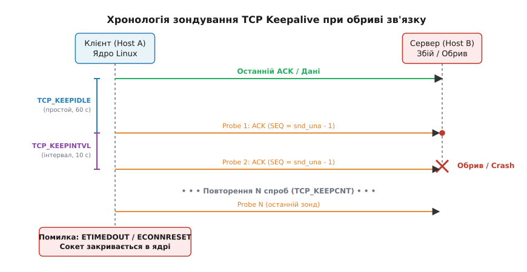
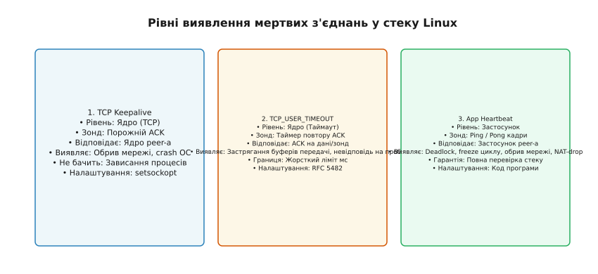

# Виявлення мертвого TCP-з'єднання: keepalive, TCP_USER_TIMEOUT і прикладна перевірка

<preknowlist>
- [Ядро й простір користувача](root:sys-unix/kernel-and-userspace) — системні виклики, межа між ядром та користувацькими процесами, робота сокетних файлових дескрипторів.
- [Параметри ядра sysctl](root:sys-unix/sysctl-tunables) — механізм динамічного налаштування мережевого стека Linux через віртуальну файлову систему /proc/sys/.
</preknowlist>

Коли серверну програму запроектовано на обслуговування десятків тисяч паралельних TCP-з'єднань, несподівана втрата мережевого зв'язку з віддаленими клієнтами створює одну з найпідступніших системних проблем. Протокол TCP розроблявся із розрахунком на високу стійкість до тимчасових збоїв у мережевій маршрутизації: якщо між двома вузлами тимчасово припиняється обмін даними, операційна система за замовчуванням не надсилає жодних службових пакетів у мережу. Якщо в цей момент віддалений клієнт втрачає живлення, його мережевий кабель від'єднується або проміжний NAT-маршрутизатор перезавантажується, серверне ядро продовжує вважати сокет повністю справним і перебуває у стані `TCP_ESTABLISHED` нескінченно довго.

Таке мовчазне ("мертве") з'єднання утримує оперативну пам'ять для системних буферів сокета, займає слот у таблиці файлових дескрипторів процесу і блокує потоки виконання, які очікують на виклик `read()`. Без спеціальних механізмів виявлення неактивності сервер швидко вичерпує ліміти ресурсів і втрачає здатність приймати нові підключення. Для розв'язання цієї проблеми в ОС Linux та мережевих протоколах застосовується багаторівнева система перевірки життєздатності (liveness): від базових зондів ядра TCP Keepalive до системних таймаутів RFC 5482 та прикладного протоколу Heartbeat.

---

## 1. Анатомія мовчазного обриву: чому TCP не бачитиме смерті peer-а

Щоб зрозуміти причину виникнення мертвих з'єднань, необхідно розділити поняття мережевого пакету на дроті та внутрішнього стану TCP-стека у пам'яті операційної системи. Стан TCP-з'єднання не існує в мережі як окремий фізичний об'єкт. Мережеві маршрутизатори та комутатори передають окремі IP-пакети і не зберігають інформації про те, чи належать вони до відкритої сесії. Стан з'єднання (`TCP_ESTABLISHED`, `TCP_CLOSE_WAIT` тощо) — це виключно структури даних у пам'яті ядра двох конкретних хостів: `struct sock`, `struct tcp_sock` та `struct inet_connection_sock`.

### Зберігання сокета в оперативній пам'яті ядра Linux

У ядрі Linux кожен мережевий сокет виділяється у спеціальних ядерних слаб-кешах (Slab Allocator) `tcp_sock`. Буфери передачі та прийому даних формуються із мережевих структур `sk_buff` (socket buffer). Кожен відкритий сокет, навіть той, що перебуває в абсолютному спокої, споживає від 2 до 4 кілобайтів системної пам'яті ядра лише на власні метадані, а при наявності буферизованих даних — десятки й сотні кілобайтів (згідно з налаштуваннями `net.ipv4.tcp_wmem` та `net.ipv4.tcp_rmem`).

Перевірити поточне використання пам'яті TCP-сокетами в системі можна через аналіз файлу `/proc/net/protocols` та слаб-кешу `/proc/slabinfo`. Якщо у висококонкурентному сервері накопичується 50,000 "зомбі-сокетів", вони вилучають із системного обігу сотні мегабайтів неповернюваної пам'яті ядра (Slab Unreclaimable), підвищують тиск на розподільник пам'яті і створюють ризик виклику винищувача пам'яті OOM Killer (Out Of Memory Killer).

Кожен сокет у ядрі Linux також закріплює за собою системний файловий дескриптор у таблиці процесів. Оскільки кожен процес у Linux обмежений лімітом `RLIMIT_NOFILE` (перевірити який можна через `ulimit -n`), накопичення мертвих з'єднань призводить до того, що виклик `accept()` або `socket()` повертає помилку `EMFILE` (Too many open files), унеможливлюючи прийом нових клієнтів.

### Три фундаментальні сценарії припинення зв'язку

При штатному закритті з'єднання процес викликає `close()`, і ядро генерує пакет із прапорцем FIN. Друга сторона відповідає пакетом ACK і надсилає власний FIN, завершуючи чотиристоронній процес закриття (Four-Way Wavehand). Якщо процес на віддаленому хості аварійно завершується (наприклад, через помилку сегментації SIGSEGV або примусове знищення SIGKILL), ядро Linux самостійно закриває всі відкриті файлові дескриптори цього процесу і також надсилає FIN або RST-пакет. У цих сценаріях локальний сокет миттєво дізнається про завершення сесії.

Діра в логіці виникає тоді, коли віддалений вузол втрачає здатність надсилати пакети взагалі. Розглянемо три фундаментальні сценарії припинення зв'язку:

1. **Аварійне вимкнення живлення або паніка ядра (Kernel Panic).** Віддалена система зупиняється миттєво. Вона не має можливості сформувати та надіслати FIN або RST.
2. **Фізичний обрив лінії або зміна маршруту.** Мережевий кабель від'єднано, або проміжний маршрутизатор втратив маршрут. Пакети від локального хоста відкидаються або зникають безвідповідально.
3. **Мовчазне видалення сесії у NAT або Firewall (State Table Eviction).** Брандмауер між клієнтом і сервером вилучає запис про TCP-сесію зі своєї внутрішньої таблиці через відсутність трафіку. Будь-які наступні пакети просто відкидаються (Drop).

Якщо в момент виникнення збою з'єднання простоювало — тобто жодна зі сторін не надсилала даних — TCP-стек ядра не має жодних підстав запускати повторну передачу пакетів. Немає передачі даних — немає очікування ACK — немає таймерів RTO (Retransmission Timeout). Локальне ядро перебуває у стані спокою, а системний виклик `read(fd, buf, len)` у прикладному коді заблокований на невизначений термін.

```text
Host A (Локальне ядро)                                    Host B (Віддалений хост)
      │                                                         │
      │ ── ── ── ── ───  TCP_ESTABLISHED  ── ── ── ── ── ────── │
      │                                                         │
      │                                                [Раптове вимкнення]
      │                                                [живлення / Обрив]
      │                                                         X
      │ (Жодних пакетів не надходить)                           
      │ (Жодних пакетів не відправляється)                      
      │                                                         
      ▼                                                         
 [Чекає read() нескінченно]                                    
```

Ситуація змінюється, якщо локальний застосунок намагається виконувати запис `write()`. У цьому разі ядро розміщує дані у буфері відправки (`sk_wmem_alloc`) і запускає таймер повторної передачі. Якщо підтвердження ACK не надходить, ядро виконує повторні спроби з експоненційним збільшенням затримки (RTO backoff). Кількість спроб обмежена системним параметром `net.ipv4.tcp_retries2` (за замовчуванням 15 спроб). Однак цей процес виявлення збою при активному записі займає від 13 до 30 хвилин, що є неприпустимо довгим інтервалом для сучасних сервісів.

---

## 2. Механізм TCP Keepalive на рівні ядра Linux

Для автоматичного виявлення неактивних мертвих з'єднань без участі прикладної логіки у протокол TCP було впроваджено механізм Keepalive. Історія розробки цього стандарту та гострі дискусії 1980-х років щодо доцільності фонового зондування детально описані у вставці [📜 Історія появи та суперечок навколо TCP Keepalive і TCP User Timeout](root:sys-unix/tcp-connection-liveness/hist-tcp-keepalive.md).

Суть механізму полягає у тому, що ядро операційної системи після певного періоду простою сокета самостійно генерує та надсилає спеціальний зондувальний пакет (Keepalive Probe).

### Анатомія зондувального пакета

Зондувальний пакет TCP Keepalive є стандартним ACK-пакетом, який має дві специфічні особливості:

1. **Порядковий номер (Sequence Number):** Задається як `snd_una - 1`, тобто на один байт менше за поточний очікуваний номер незатвердженого байта. Це навмисна провокація порушення послідовності.
2. **Корисне навантаження (Payload):** Містить 0 байтів (у деяких реалізаціях — 1 байт-фантом із застарілими даними).

Коли ядро віддаленого хоста отримує пакет із порядковим номером `snd_una - 1`, воно бачить, що цей байт уже був успішно отриманий раніше. Згідно зі стандартом TCP, у відповідь на дубльований або застарілий Sequence Number ядро зобов'язане **негайно надіслати підтвердження (Pure ACK)** із вказівкою поточного значення `rcv_nxt` (наступного очікуваного байта) та поточного розміру вікна прийому (Window Size).

```text
Host A (Локальне ядро)                                   Host B (Віддалене ядро)
      │                                                         │
      │ ── ── ── ── ──  Простой > TCP_KEEPIDLE  ── ── ── ── ── │
      │                                                         │
      │ ──── Probe 1: ACK (SEQ = snd_una - 1) ────────────────> │
      │ <─── ACK (SEQ = rcv_nxt, Win = ...) ─────────────────── │  [Оброблено ядром!]
      │                                                         │
      │ ── ── ── ── ──  Скидання таймера простою  ── ── ── ── ─ │
```

Головна архітектурна особливість TCP Keepalive полягає у тому, що **обробка зонда здійснюється виключно в середовищі ядра віддаленого хоста**. Повідомлення не піднімається у користувацький простір (Userspace) і не обробляється прикладною програмою. Це має як переваги, так і фундаментальні обмеження:

- **Перевага:** Зонд не створює навантаження на прикладений процес і працює прозоро для розробника.
- **Обмеження:** Якщо віддалений процес завис у нескінченному циклі, заблокувався на м'ютексі чи перебуває у стані непробудного сну (`D` state), ядро Linux на тому боці все одно справно відповідатиме на Keepalive-зонди. Таким чином, Keepalive підтверджує лише те, що **живі мережевий стек та ядро ОС на тому боці**, але не гарантує працездатності самого сервісу.

### Внутрішній цикл обробки в ядрі Linux (`net/ipv4/tcp_timer.c`)

У вихідному коді ядра Linux за обробку таймерів зондування відповідає функція `tcp_keepalive_timer()`. Сценарій її виконання складається з наступних кроків:

1. **Перевірка наявності активних даних:** Якщо буфер відправки `sk_send_head` не порожній, ядро виходить із функції keepalive і залишає активованим таймер повторної передачі (Retransmit Timer).
2. **Обчислення інтервалу простою:** Якщо від моменту останньої мережевої активності пройшло менше за `TCP_KEEPIDLE` секунд, таймер просто переставляється на залишок часу.
3. **Генерація зонда:** Якщо час простою перевищено, ядро викликає функцію `tcp_write_wakeup()`, яка формує пакет із застарілим `Sequence Number` і надсилає його в мережу.
4. **Інкремент лічильника спроб:** Значення `icsk_probes_out` збільшується на 1.
5. **Остаточна ліквідація:** Якщо `icsk_probes_out` перевищує `TCP_KEEPCNT`, ядро викликає `tcp_done()`, переводить сокет у стан `TCP_CLOSE`, звільняє буфери пам'яті і сигналізує процесу через системні виклики про розрив з'єднання з помилкою `ETIMEDOUT`.

Слід відрізняти зонди TCP Keepalive від зондів нульового вікна (Zero Window Probes, `tcp_send_probe0()`). Зонди нульового вікна надсилаються тоді, коли віддалений хост сповістив про повне заповнення свого буфера прийому (`win = 0`), і локальне ядро періодично опитує стан вікна для відновлення відправки даних.

### Три параметри конфігурації

Робота Keepalive у Linux керується трьома основними часовими параметрами:

1. **`TCP_KEEPIDLE` (`net.ipv4.tcp_keepalive_time`):** Час у секундах, протягом якого з'єднання має перебувати у стані цілковитого спокою (без надсилання та отримання даних), перш ніж ядро надішле перший зонд.
2. **`TCP_KEEPINTVL` (`net.ipv4.tcp_keepalive_intvl`):** Інтервал у секундах між повторними зондами, якщо на попередній зонд не було отримано відповіді ACK.
3. **`TCP_KEEPCNT` (`net.ipv4.tcp_keepalive_probes`):** Кількість послідовних непідтверджених зондів, після яких ядро визнає з'єднання остаточно втраченим.

Наочну часову діаграму надсилання зондів та обробки часових інтервалів наведено на фігурі нижче.


*Послідовність обміну keepalive-пакетами між ядрами та поведінка при втраті мережевого зв'язку*

Розрахунок загального часу виявлення мертвого з'єднання (`T_total`) при використанні Keepalive виконується за формулою:

```
T_total = t_idle + (n_probes · t_intvl)
```

Приклад обчислення часового інтервалу виявлення для стандартних системних параметрів Linux:

```
T_total
= 7200 + (9 · 75)       [підстановка t_idle = 7200c, n_probes = 9, t_intvl = 75c]
= 7200 + 675            [обчислення часу повторних спроб]
= 7875 секунд           [приблизно 2 години 11 хвилин]
```

Очевидно, що значення за замовчуванням у 2 години 11 хвилин є надто великим для реальних серверних систем. Тому застосунки перевизначають ці параметри для кожного сокета індивідуально за допомогою `setsockopt()`.

Повний перелік параметрів `sysctl`, сигнатури системних викликів та таблицю кодів помилок зведено у довіднику [📋 Довідник опцій сокета та параметрів ядра для виявлення TCP-liveness](root:sys-unix/tcp-connection-liveness/api-tcp-liveness.md).

### Програмне вмикання Keepalive у коді

Для увімкнення та швидкого налаштування зондування на сокеті використовується наступний підхід мовами C та C++:

:::tabs
```c
#include <sys/socket.h>
#include <netinet/in.h>
#include <netinet/tcp.h>

int enable_keepalive(int fd) {
    int optval = 1;
    int idle = 30;   /* Почати зондування після 30с простою */
    int intvl = 5;   /* Повторювати зонди кожні 5с */
    int cnt = 3;     /* 3 невдалі спроби -> розрив */

    if (setsockopt(fd, SOL_SOCKET, SO_KEEPALIVE, &optval, sizeof(optval)) < 0)
        return -1;
    if (setsockopt(fd, IPPROTO_TCP, TCP_KEEPIDLE, &idle, sizeof(idle)) < 0)
        return -1;
    if (setsockopt(fd, IPPROTO_TCP, TCP_KEEPINTVL, &intvl, sizeof(intvl)) < 0)
        return -1;
    if (setsockopt(fd, IPPROTO_TCP, TCP_KEEPCNT, &cnt, sizeof(cnt)) < 0)
        return -1;

    return 0;
}
```
```cpp
#include <system_error>
#include <chrono>
#include <sys/socket.h>
#include <netinet/in.h>
#include <netinet/tcp.h>

void setup_tcp_keepalive(int fd, std::chrono::seconds idle, std::chrono::seconds intvl, int cnt) {
    int optval = 1;
    if (::setsockopt(fd, SOL_SOCKET, SO_KEEPALIVE, &optval, sizeof(optval)) < 0) {
        throw std::system_error(errno, std::generic_category(), "Failed to enable SO_KEEPALIVE");
    }

    int idle_sec = static_cast<int>(idle.count());
    if (::setsockopt(fd, IPPROTO_TCP, TCP_KEEPIDLE, &idle_sec, sizeof(idle_sec)) < 0) {
        throw std::system_error(errno, std::generic_category(), "Failed to set TCP_KEEPIDLE");
    }

    int intvl_sec = static_cast<int>(intvl.count());
    if (::setsockopt(fd, IPPROTO_TCP, TCP_KEEPINTVL, &intvl_sec, sizeof(intvl_sec)) < 0) {
        throw std::system_error(errno, std::generic_category(), "Failed to set TCP_KEEPINTVL");
    }

    if (::setsockopt(fd, IPPROTO_TCP, TCP_KEEPCNT, &cnt, sizeof(cnt)) < 0) {
        throw std::system_error(errno, std::generic_category(), "Failed to set TCP_KEEPCNT");
    }
}
```
:::

З параметрами `idle = 30`, `intvl = 5`, `cnt = 3` мертве з'єднання буде виявлено за `30 + (3 · 5) = 45` секунд. Після цього ядро знищить сокет, а заблокований виклик `read()` або `epoll_wait()` миттєво поверне помилку `ETIMEDOUT` або `ECONNRESET`.

---

## 3. Гарантія виявлення застряглих даних та TCP_USER_TIMEOUT (RFC 5482)

Хоча налаштування TCP Keepalive чудово вирішує проблему простою сокета, існує небезпечний крайній випадок (edge case), при якому класичний Keepalive **не працює взагалі**.

### Конфлікт між непідтвердженими даними та Keepalive

Згідно зі специфікацією TCP, таймер Keepalive запускається **лише тоді, коли буфер відправки сокета порожній**, і віддалена сторона підтвердила всі надіслані байти. 

Якщо ж застосунок викликав `write()`, і ці дані потрапили до буфера відправки, але мережевий кабель було витягнуто, ядро Linux перемикає сокет із таймера Keepalive на **таймер повторної передачі (Retransmission Timer / RTO)**. У цьому стані ядро не надсилає Keepalive-зондів! Замість них воно повторно надсилає пакети з даними, застосовуючи експоненційну затримку (RTO doubling).

Математичний розрахунок затримки RTO при повторній передачі здійснюється за алгоритмом Якобсона/Карна (RFC 6298):

```
RTO = SRTT + 4 · RTTVAR
```

При кожній наступній невдалій спробі значення RTO подвоюється: `RTO_next = min(RTO_current · 2, RTO_max)`.

Оскільки параметром `net.ipv4.tcp_retries2` за замовчуванням задано 15 спроб, процес повторної відправки розтягується на 15–30 хвилин. Навіть якщо ви налаштували агресивний `TCP_KEEPIDLE = 5`, у разі наявності хоча б одного непідтвердженого байта у буфері запису система чекатиме пів години!

### Механіка опції TCP_USER_TIMEOUT

Щоб усунути цю невизначеність і надати розробнику жорсткий, детермінований ліміт часу на відсутність підтверджень, у RFC 5482 було описано опцію `TCP_USER_TIMEOUT`. У ядрі Linux вона задається в **мілісекундах** через `setsockopt()` на рівні `IPPROTO_TCP`.

`TCP_USER_TIMEOUT` визначає **максимальний обсяг часу, протягом якого надіслані дані або зонди можуть залишатися без підтвердження ACK від віддаленого вузла**.

```text
Час від останньої активності (ACK)
  │
  ├─── Передано дані або Keepalive Probe
  │    │
  │    ├── Повторні спроби RTO / Зонди...
  │    │
  ▼    ▼
 [Перевищено TCP_USER_TIMEOUT (напр. 10000 мс)] ──> Негайна ліквідація сокета!
                                                    (errno = ETIMEDOUT)
```

Взаємодія `TCP_USER_TIMEOUT` з іншими таймерами ядра відбувається за наступними правилами:

1. **При активній передачі даних:** Якщо непідтверджені дані знаходяться в мережі довше за значення `TCP_USER_TIMEOUT`, ядро перериває повторні спроби RTO раніше, ніж буде вичерпано `tcp_retries2`, негайно закриваючи сокет.
2. **При простої з увімкненим Keepalive:** Якщо увімкнено `SO_KEEPALIVE`, значення `TCP_USER_TIMEOUT` перевизначає сумарний таймаут зондування. З'єднання буде розірвано тоді, коли час з моменту останнього отриманого ACK перевищить `TCP_USER_TIMEOUT`, навіть якщо ядро ще не встигло відправити всі `TCP_KEEPCNT` зондів.

:::tabs
```c
/* Встановлення жорсткого таймауту виявлення у 10 секунд (10000 мс) у C */
unsigned int timeout_ms = 10000;
setsockopt(fd, IPPROTO_TCP, TCP_USER_TIMEOUT, &timeout_ms, sizeof(timeout_ms));
```
```cpp
/* Встановлення жорсткого таймауту виявлення у 10 секунд у C++ з chrono */
#include <chrono>
#include <sys/socket.h>
#include <netinet/tcp.h>

void set_user_timeout(int fd, std::chrono::milliseconds timeout) {
    auto ms = static_cast<unsigned int>(timeout.count());
    ::setsockopt(fd, IPPROTO_TCP, TCP_USER_TIMEOUT, &ms, sizeof(ms));
}
```
:::

Взаємодія `TCP_USER_TIMEOUT` з опцією `TCP_DEFER_ACCEPT` та розширенням `TCP_FASTOPEN` дозволяє прискорити виявлення недійсних вхідних підключень під час трикрокового рукопожимання, звільняючи SYN-чергу сервера від неактивних клієнтів.

Комбінація `SO_KEEPALIVE` та `TCP_USER_TIMEOUT` є золотим стандартом конфігурації мережевих сокетів у ядрі Linux для систем із підвищеними вимогами до швидкості виявлення збоїв.

---

## 4. Прикладна перевірка життєздатності: Heartbeat та Ping-Pong

Незважаючи на потужність інструментів ядра, існує клас збоїв, проти яких і TCP Keepalive, і `TCP_USER_TIMEOUT` виявляються безсилими. Наочне порівняння рівнів обробки та охоплення збоїв наведено на фігурі нижче.


*Рівні обробки та охоплення збоїв: від мережевого стека ядра до прикладної логіки застосунку*

### Чому системних зондів недостатньо

Розглянемо дві поширені ситуації у розподілених архітектурах:

1. **Зависання прикладного процесу (Application Freeze / Deadlock).** Процес на віддаленому сервері заблокувався при спробі захоплення взаємного м'ютекса (Deadlock), потрапив у нескінченний цикл або застряг у блокуючому виклику до бази даних. Його мережевий стек у ядрі Linux продовжує працювати і справно відповідає на всі TCP Keepalive зонди. Для локального клієнта з'єднання здається ідеально живим, хоча серверний застосунок фактично "мертвий".
2. **Таймаути проміжних Layer-7 проксі та балансувальників.** Проміжні прикладні балансувальники (NGINX, HAProxy, AWS ALB) або маршрутизатори з відстеженням стану можуть закривати неактивні сесії на своєму рівні, якщо в рамках протоколу (наприклад, WebSockets або gRPC) не передається жодних прикладних кадрів.

Для розв'язання цих проблем на рівні прикладних протоколів реалізується механізм **Heartbeat (Ping-Pong)**.

### Протокольні реалізації у промислових стандартах

Сучасні мережеві протоколи містять вбудовані засоби прикладного зондування:

- **WebSockets (RFC 6455):** Визначає службові кадри `Ping` (Opcode `0x09`) та `Pong` (Opcode `0x0A`). Кадр `Pong` мусить дзеркально повертати корисне навантаження кадру `Ping`.
- **HTTP/2 (RFC 7540) & HTTP/3:** Використовує кадри `PING` (Type `0x06`). Прапорець `ACK` задає відповідь на отриманий запит.
- **gRPC:** Підтримує параметри `grpc.keepalive_time_ms` та `grpc.keepalive_timeout_ms` для надсилання HTTP/2 PING-кадрів при відсутності активних RPC-викликів.
- **Redis & PostgreSQL:** Клієнтські бібліотеки реалізують команду `PING` / `PONG` або регулярні сервісні виклики `SELECT 1;`.

### Принцип роботи Ping-Pong Heartbeat

Прикладна перевірка базується на тому, що зондувальні повідомлення надсилаються та обробляються безпосередньо **кодом користувацького простору (Userspace)**. 

1. **Періодичний Ping:** Застосунок кожні N секунд надсилає спеціальне службове повідомлення (кадр `PING`).
2. **Обов'язковий Pong:** Отримувач, провівши кадр через свій подійний цикл (Event Loop), мусить негайно згенерувати та надіслати відповідь (`PONG`).
3. **Таймаут очікування:** Якщо відповідь `PONG` не надходить протягом заданого вікна (наприклад, 3 секунди), ініціатор закриває сокет на прикладному рівні.

Детальну реалізацію неблокуючого трекера життєздатності мовами C та C++ з підтримкою монотонних годинників та захистом від штормів повторних підключень винесено у практичний проект [⚙️ Реалізація прикладного трекера життєздатності з'єднання (Ping-Pong Heartbeat)](root:sys-unix/tcp-connection-liveness/proj-liveness-tracker.md).

### Запобігання штормам перепідключення (Reconnection Storms)

У разі масового обриву мережі тисячі клієнтських процесів можуть одночасно виявити втрату `PONG` і почати перепідключення до сервера. Щоб уникнути каскадного падіння сервера під час повторної авторизації, інтервали перепідключення обов'язково розраховують за алгоритмом **експоненційного відступу з випадковим тремтінням (Exponential Backoff with Full Jitter)**:

```
t_sleep = random(0, min(t_max, t_base · 2ᵃᵗᵗᵉᵐᵖᵗ))
```

Такий підхід розмазує пікове навантаження на сервер у часі, забезпечуючи плавне та стійке відновлення системи.

---

## 5. Спостереження, діагностика та внутрішній устрій ядра Linux

Для діагностики станів liveness-таймерів у працюючій операційній системі Linux розробники та системні адміністратори використовують інструменти інтроспекції ядра.

### Перевірка таймерів через утиліту `ss`

Утиліта `ss` (Socket Statistics) з прапорцем `-o` (options) або `-i` (internal tcp info) дозволяє побачити стан внутрішніх таймерів ядра для кожного сокета:

```bash
# Перегляд сокетів із відображенням таймерів
ss -tno state established '( dport = :8080 or sport = :8080 )'
```

Приклад виводу утиліти `ss`:

```text
ESTAB  0  0  192.168.1.15:43122  192.168.1.50:8080  timer:(keepalive,25sec,0)
```

Запис `timer:(keepalive,25sec,0)` означає:
- Сокет використовує таймер **keepalive**.
- До надсилання наступного зонда залишилося **25 секунд**.
- Кількість уже надісланих непідтверджених зондів дорівнює **0**.

Якщо з'єднання втрачено і ядро починає повторні спроби відправки даних, формат зміниться на `timer:(retrans,200ms,2)`, що вказує на активний таймер RTO та 2 виконані спроби повторної передачі.

### Внутрішні структури ядра: `struct inet_connection_sock`

У вихідному коді ядра Linux (файли `net/ipv4/tcp_timer.c` та `include/net/inet_connection_sock.h`) керування таймерами здійснюється через структуру `struct inet_connection_sock`. Ключовими полями цієї структури є:

- `icsk_pending`: поточний активний таймер сокета (enum значення: `ICSK_TIME_RETRANS`, `ICSK_TIME_DACK`, `ICSK_TIME_KEEPOPEN`).
- `icsk_timeout`: момент часу (в системних тіках `jiffies`), коли має спрацювати таймер.
- `icsk_user_timeout`: збережене значення таймауту `TCP_USER_TIMEOUT` у мілісекундах.
- `icsk_probes_out`: лічильник уже надісланих keepalive-зондів без відповіді.

Функція ядра `tcp_keepalive_timer()` викликається системним таймером при закінченні інтервалу `TCP_KEEPIDLE`. Вона перевіряє стан сокета, генерує зондувальний пакет через `tcp_write_wakeup()` і переставить таймер на значення `TCP_KEEPINTVL`. Якщо лічильник `icsk_probes_out` перевищує `TCP_KEEPCNT`, ядро викликає `tcp_done()`, переводить сокет у стан `TCP_CLOSE` і надсилає сигнал пробудження для заблокованих сокетних операцій.

### Простеження через eBPF / bpftrace

Для глибокого моніторингу затримки спрацювання таймерів виявлення мертвих сокетів використовується інструментарій eBPF. Скрипт `bpftrace` дозволяє перехоплювати події знищення сокетів через таймаут:

```tracepoint
# bpftrace -e 'kprobe:tcp_write_timeout { @timeouts[kstack] = count(); }'
```

Цей однорядковик фіксує всі випадки, коли ядро примусово закриває TCP-сокети через перевищення RTO або Keepalive-таймаутів, збираючи стеки викликів функції `tcp_write_timeout()`.

Трасування стану сокетних переходів також підтримується універсальною підсистемою `ftrace` через точки простеження `events/sock/inet_sock_set_state` та `events/tcp/tcp_probe`.

---

## 6. Порівняльний аналіз та зведена стратегія Liveness

Для вибору оптимального інструменту виявлення мертвих з'єднань необхідно зіставити можливі сценарії аварійних відмов із мережевими механізмами перевірки.

### Порівняльна матриця механізмів виявлення

| Сценарій відмови / Аварія | TCP Keepalive | TCP_USER_TIMEOUT | Application Heartbeat |
| :--- | :--- | :--- | :--- |
| **Фізичний обрив кабелю (простой сокет)** | **Виявляє** (після T_total) | Не діє самостійно | **Виявляє** (після t_ping + t_pong) |
| **Фізичний обрив кабелю (активний write)** | Не діє (працює RTO) | **Виявляє** (негайно по таймауту) | **Виявляє** (по відсутності Pong) |
| **Аварійне вимкнення живлення peer-а** | **Виявляє** | **Виявляє** (при спробі запису) | **Виявляє** |
| **Зависання прикладного процесу (Deadlock)** | ❌ Не бачить | ❌ Не бачить | **Виявляє** (процес не відповість) |
| **Мовчазне видалення сесії в NAT / Firewall** | **Запобігає** (підтримує стейт) | ❌ Не запобігає | **Запобігає** (генерує трафік) |

### Чеклист конфігурації високонавантаженої системи

При розгортанні відповідальних серверних систем у Linux рекомендується дотримуватися наступного чеклиста конфігурації мережевого liveness:

1. **Глобальні налаштування sysctl (`/etc/sysctl.d/99-liveness.conf`):**
   - Зменшити `net.ipv4.tcp_keepalive_time` до 300–600 секунд для прискореної очистки мовчазних клієнтських сесій.
   - Зменшити `net.ipv4.tcp_keepalive_intvl` до 10–15 секунд та `net.ipv4.tcp_keepalive_probes` до 3–5 спроб.
2. **Конфігурація сокетів у коді програми (`setsockopt`):**
   - Завжди вмикати `SO_KEEPALIVE` для довгоживучих з'єднань.
   - Завжди виставляти `TCP_USER_TIMEOUT` у діапазоні 10000–30000 мілісекунд (залежно від SLA сервісу) для запобігання застряганню буферів відправки.
   - Використовувати `MSG_NOSIGNAL` або пригнічувати `SIGPIPE` для захисту від аварійного завершення процесу.
3. **На прикладному рівні:**
   - Впровадити бінарні або текстові кадри Ping/Pong (або спиратися на стандарти WebSockets/HTTP2 PING).
   - Застосовувати Full Jitter для випадкового розподілу часу повторного підключення клієнтів після обриву мережі.

Така комбінація гарантує миттєве виявлення як мережевих обривів, так і внутрішніх збоїв у прикладних процесах, забезпечуючи високу стійкість мережевої інфраструктури Linux.
