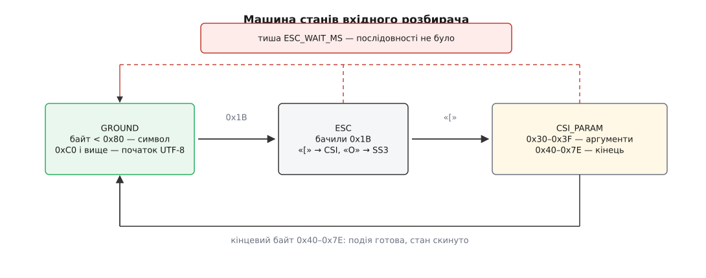

# ⚙️ Розбирач вхідного потоку термінала: клавіші, паузи й відповіді в одному дескрипторі

Робоча програма мовою C, яка читає дескриптор 0 у сирому режимі й віддає нагору впорядкований потік подій — символ, спеціальна клавіша, відповідь термінала на запит. Усе це приходить одним потоком байтів, і розділяє його прикладна сторона: ядро цю суміш не розбирає, воно лише передає байти.

## Що треба зробити

У сирому режимі `read(0, …)` віддає рівно те, що надійшло від термінала, без жодної обробки ([TTY і termios](root:sys-unix/tty-and-termios) — лінійна дисципліна між пристроєм і читачем; у сирому режимі вимкнено складання рядка, відлуння й перетворення `0x03` на сигнал, тож байти доходять такими, якими прийшли). Літера «ж» — це два байти. Стрілка вгору — три: `1B 5B 41`. Клавіша F5 — шість. Відповідь на запит `ESC[6n` — ще одна послідовність, яка приходить упереміш із натисненнями. А клавіша Esc — один байт `1B`, той самий, з якого починаються всі попередні.

Кожна вимога до читача має причину, і жодна з них не косметична.

Віддавати цілі одиниці: символ UTF-8 не розрізаний навпіл, послідовність не порізана на «Esc, дужка, літера». Одне натиснення легко приїжджає двома викликами `read` — між байтами стоїть мережа, планувальник і буфер драйвера, — тож припущення «один `read` = одна клавіша» хибне з першого дня.

Не зависати. Термінал, який запиту не знає, не відповість **нічого**: ні помилки, ні відмови. Програма, що чекає на відповідь звичайним `read`, зупиниться назавжди.

Не губити натиснень, поки триває запит: людина не перестає друкувати на час, поки програма з'ясовує позицію курсора.

Дочитувати незнайомі послідовності до кінця, а не вивалювати їхні хвости на екран.

І повернути термінал у застаний стан на **кожному** шляху виходу, зокрема аварійному.

## Ідея: діапазони байтів, а не перелік команд

Спокуса — тримати таблицю відомих послідовностей і звіряти з нею вхід. Такий розбирач ламається на першій же незнайомій команді: він не знає, де вона закінчується, тож решта її байтів піде далі як текст, а на екрані з'явиться сміття.

Опертися треба на інше: межі послідовності задано **діапазонами кодів**. Після `ESC [` можуть іти лише байти `0x30`–`0x3F`, а завершує перший же байт із `0x40`–`0x7E`. Кінець знаходить арифметика, а не словник — тож незнайома команда буде зібрана цілком і віддана нагору як «невідома клавіша з таким кінцевим байтом». Звідси й будова: машина станів, де кожен перехід — перевірка діапазону, а весь стан між байтами вміщається у кілька полів ([розбір потоку](root:com-protocol/stream-parser) — читач, що працює байт за байтом і тримає власний стан, не залежить від того, як потік порізали на порції).



*Пунктиром — єдиний перехід, який спрацьовує не від байта, а від його відсутності.*

Лишається те, чого діапазонами не розв'язати. Самотній `1B` — це або клавіша Esc, або початок стрілки, і в самому потоці різниці немає. Ознака одна: час. Байти однієї послідовності приходять упритул, між двома натисненнями людини є пауза. Тому чекання розділене надвоє. У стані `GROUND` розбирач чекає без ліміту — поспішати нема куди. Щойно він увійшов у `ESC` чи `CSI`, ліміт стає `ESC_WAIT_MS`, і тиша означає, що послідовності не було: накопичене віддається як Esc плюс окремі символи. Сорок мілісекунд — не магія, а верхня оцінка часу, за який три байти долають дріт.

Таймер при цьому потрібен власний. Той, що вбудований у драйвер, не годиться: `VTIME` у `termios` міряє десятими частками секунди, тож найкоротша пауза, яку ним можна задати, — 100 мс, і вона відчутна на дотик. Тому чекання віддано `poll` ([select, poll і epoll](root:sys-unix/select-poll-epoll) — виклики, які сплять, доки дескриптор не стане готовим, і вміють прокинутися за таймером із точністю до мілісекунди).

## Програма

```c
/* tinput.c — упорядкований потік подій з дескриптора 0.
 * gcc -O2 -Wall -o tinput tinput.c        запуск: ./tinput
 */
#define _POSIX_C_SOURCE 200809L
#include <termios.h>
#include <unistd.h>
#include <poll.h>
#include <time.h>
#include <errno.h>
#include <signal.h>
#include <string.h>
#include <stdio.h>
#include <stdlib.h>

#define ESC_WAIT_MS 40      /* пауза, після якої самотній 0x1B — клавіша Esc  */
#define MAXPARAM    16      /* стеля на КІЛЬКІСТЬ аргументів CSI              */
#define MAXRAW      32      /* стеля на сиру послідовність (для відкату)      */
#define QCAP        64      /* черга готових подій                            */

enum { EV_CHAR, EV_KEY, EV_REPLY };
enum { K_UP = 1, K_DOWN, K_RIGHT, K_LEFT, K_HOME, K_END,
       K_PGUP, K_PGDN, K_INS, K_DEL, K_ESC, K_OTHER };

struct event {
    int  kind;
    char text[8];             /* EV_CHAR: символ UTF-8 з нулем у кінці  */
    int  key;                 /* EV_KEY                                 */
    int  param[MAXPARAM];     /* аргументи CSI; -1 — «пропущений»       */
    int  nparam;
    char intro, final;        /* «?» у ESC[?…   ·   кінцевий байт       */
};

static struct event queue[QCAP];
static int qn;

static void push(const struct event *e)
{
    if (qn < QCAP) queue[qn++] = *e;   /* переповнення = загублена подія */
}

/* ---------- 1. Сирий режим і повернення на всіх шляхах виходу ---------- */

static struct termios saved_tio;
static int tio_saved;
static volatile sig_atomic_t stop;

static void raw_off(void)
{
    if (tio_saved) tcsetattr(STDIN_FILENO, TCSAFLUSH, &saved_tio);
}

static int raw_on(void)
{
    struct termios tio;

    if (tcgetattr(STDIN_FILENO, &saved_tio) < 0) return -1;   /* знімок ДО змін */
    tio_saved = 1;
    tio = saved_tio;
    tio.c_iflag &= ~(IXON | ICRNL | INLCR | ISTRIP | BRKINT);
    tio.c_lflag &= ~(ICANON | ECHO | IEXTEN | ISIG);
    /* OPOST лишаємо ввімкненим: ми читач, а не малювальник, і хочемо, щоб «\n»
       у printf і далі означав перехід на початок наступного рядка. */
    tio.c_cc[VMIN]  = 1;      /* read повертається з першим же байтом      */
    tio.c_cc[VTIME] = 0;      /* чекати вміє poll — дублювати таймер зайве */
    return tcsetattr(STDIN_FILENO, TCSAFLUSH, &tio);
}

static void on_stop(int sig)  { (void) sig; stop = 1; }

static void on_fatal(int sig)                /* падіння не має лишати сирий режим */
{
    raw_off();                               /* tcsetattr — async-signal-safe */
    signal(sig, SIG_DFL);
    raise(sig);                              /* і далі падаємо, як мали б */
}

static void catch_signals(void)
{
    struct sigaction sa;
    int soft[] = { SIGTERM, SIGHUP, SIGINT };
    int hard[] = { SIGSEGV, SIGBUS, SIGABRT };
    size_t i;

    memset(&sa, 0, sizeof sa);
    sa.sa_handler = on_stop;
    for (i = 0; i < sizeof soft / sizeof soft[0]; i++) sigaction(soft[i], &sa, NULL);
    sa.sa_handler = on_fatal;
    for (i = 0; i < sizeof hard / sizeof hard[0]; i++) sigaction(hard[i], &sa, NULL);
}

/* ---------- 2. Машина станів ---------- */

enum { S_GROUND, S_ESC, S_CSI, S_SS3, S_UTF8 };

static struct {
    int st;
    int param[MAXPARAM], nparam, trunc, intro;
    unsigned char raw[MAXRAW]; int nraw;
    unsigned char u[4]; int ulen, uneed;
} P;

static void feed(unsigned char b);

static void emit_char(const unsigned char *s, int n)
{
    struct event e;
    memset(&e, 0, sizeof e);
    e.kind = EV_CHAR;
    memcpy(e.text, s, (size_t) n);
    push(&e);
}

static void emit_key(int key, char final, int with_params)
{
    struct event e;
    memset(&e, 0, sizeof e);
    e.kind = EV_KEY; e.key = key; e.final = final;
    if (with_params) {
        memcpy(e.param, P.param, sizeof e.param);
        e.nparam = P.nparam; e.intro = (char) P.intro;
    }
    push(&e);
}

static void emit_reply(char final)
{
    struct event e;
    memset(&e, 0, sizeof e);
    e.kind = EV_REPLY; e.final = final; e.intro = (char) P.intro;
    memcpy(e.param, P.param, sizeof e.param);
    e.nparam = P.nparam;
    push(&e);
}

static void csi_reset(void)
{
    int i;
    for (i = 0; i < MAXPARAM; i++) P.param[i] = -1;   /* -1 = аргумент пропущено */
    P.nparam = 1; P.trunc = 0; P.intro = 0;
}

static void param_digit(int d)
{
    int *v;
    if (P.trunc) return;
    v = &P.param[P.nparam - 1];
    if (*v < 0) *v = 0;
    if (*v < 6553) *v = *v * 10 + d;      /* стеля ЗНАЧЕННЯ: далі цифри відкидаємо */
}

static void param_sep(void)
{
    if (P.nparam < MAXPARAM) P.nparam++;
    else P.trunc = 1;                     /* аргументів більше за стелю — не віримо всій команді */
}

static int csi_key(char final, int p0)
{
    switch (final) {
    case 'A': return K_UP;
    case 'B': return K_DOWN;
    case 'C': return K_RIGHT;
    case 'D': return K_LEFT;
    case 'H': return K_HOME;
    case 'F': return K_END;
    case '~':
        switch (p0) {
        case 1: case 7: return K_HOME;
        case 2:         return K_INS;
        case 3:         return K_DEL;
        case 4: case 8: return K_END;
        case 5:         return K_PGUP;
        case 6:         return K_PGDN;
        }
    }
    return K_OTHER;
}

static void feed(unsigned char b)
{
    if (P.st == S_ESC || P.st == S_CSI || P.st == S_SS3)
        if (P.nraw < MAXRAW) P.raw[P.nraw++] = b;      /* сира копія — на відкат за паузою */

    switch (P.st) {

    case S_GROUND:
        if (b == 0x1B) { P.st = S_ESC; P.nraw = 0; P.raw[P.nraw++] = b; return; }
        if (b < 0x80)  { emit_char(&b, 1); return; }
        if      ((b & 0xE0) == 0xC0) P.uneed = 2;      /* довжину каже перший байт */
        else if ((b & 0xF0) == 0xE0) P.uneed = 3;
        else if ((b & 0xF8) == 0xF0) P.uneed = 4;
        else return;                                   /* самотній продовжувач — сміття */
        P.u[0] = b; P.ulen = 1; P.st = S_UTF8;
        return;

    case S_UTF8:
        if ((b & 0xC0) != 0x80) {                      /* символ обірвано */
            P.st = S_GROUND; feed(b);                  /* байт починає щось нове */
            return;
        }
        P.u[P.ulen++] = b;
        if (P.ulen == P.uneed) { emit_char(P.u, P.ulen); P.st = S_GROUND; }
        return;

    case S_ESC:
        if (b == '[')  { csi_reset(); P.st = S_CSI; return; }
        if (b == 'O')  { csi_reset(); P.st = S_SS3; return; }
        if (b == 0x1B) { emit_key(K_ESC, 0, 0); P.nraw = 1; return; }  /* перший Esc справжній */
        emit_key(K_OTHER, (char) b, 0);                /* сюди ж падає Alt+клавіша */
        P.st = S_GROUND; P.nraw = 0;
        return;

    case S_SS3:                                        /* ESC O A — режим прикладного курсора */
        if (b >= 0x40 && b <= 0x7E) emit_key(csi_key((char) b, -1), (char) b, 0);
        P.st = S_GROUND; P.nraw = 0;
        return;

    case S_CSI:
        if (b >= '0' && b <= '9')   { param_digit(b - '0'); return; }
        if (b == ';')               { param_sep(); return; }
        if (b >= 0x3A && b <= 0x3F) { P.intro = b; return; }   /* «:» і приватні «<»…«?» */
        if (b >= 0x20 && b <= 0x2F) { return; }                /* проміжні байти */
        if (b >= 0x40 && b <= 0x7E) {                          /* кінцевий байт */
            if (P.trunc)                       emit_key(K_OTHER, (char) b, 0);
            else if (b == 'R' && P.intro == 0) emit_reply((char) b);
            else emit_key(csi_key((char) b, P.param[0]), (char) b, 1);
            P.st = S_GROUND; P.nraw = 0;
            return;
        }
        if (b == 0x1B) { P.st = S_ESC; P.nraw = 0; P.raw[P.nraw++] = b; return; }
        emit_char(&b, 1);              /* решта C0 виконується на місці (ECMA-48) */
        return;
    }
}

static void on_pause(void)
{
    unsigned char tail[MAXRAW];
    int n, i;

    if (P.st == S_GROUND || P.st == S_UTF8) return;    /* нема чого розв'язувати */

    /* Паузи ПОСЕРЕД послідовності не буває — отже, її й не було: перший байт
       був клавішею Esc, решта — звичайними символами. */
    n = P.nraw > 1 ? P.nraw - 1 : 0;
    memcpy(tail, P.raw + 1, (size_t) n);
    P.st = S_GROUND; P.nraw = 0;
    emit_key(K_ESC, 0, 0);
    for (i = 0; i < n; i++) feed(tail[i]);
}

/* ---------- 3. Читання з таймаутом ---------- */

static long ms_since(const struct timespec *t0)
{
    struct timespec t;
    clock_gettime(CLOCK_MONOTONIC, &t);
    return (t.tv_sec - t0->tv_sec) * 1000 + (t.tv_nsec - t0->tv_nsec) / 1000000;
}

/* 1 — є байти, 0 — вичерпано час, -1 — час завершуватися. */
static int wait_ready(int ms)
{
    struct pollfd pfd;
    struct timespec t0;
    int left = ms;

    pfd.fd = STDIN_FILENO; pfd.events = POLLIN; pfd.revents = 0;
    clock_gettime(CLOCK_MONOTONIC, &t0);
    for (;;) {
        int r = poll(&pfd, 1, left);
        if (r > 0)  return 1;
        if (r == 0) return 0;
        if (errno != EINTR) return -1;
        if (stop) return -1;
        if (ms < 0) continue;                   /* чекали без ліміту — просто наново */
        left = ms - (int) ms_since(&t0);        /* НЕ ms: інакше сигнали продовжують паузу */
        if (left <= 0) return 0;
    }
}

static int pump(int ms)                /* прогнати чергову порцію крізь машину станів */
{
    unsigned char buf[64];
    int r = wait_ready(ms);

    if (r <= 0) {
        if (r == 0) on_pause();
        return r;
    }
    for (;;) {
        ssize_t n = read(STDIN_FILENO, buf, sizeof buf), i;
        if (n > 0) { for (i = 0; i < n; i++) feed(buf[i]); return 1; }
        if (n == 0) return -1;                          /* той бік закрився */
        if (errno == EINTR && !stop) continue;
        return -1;
    }
}

/* ---------- 4. Запит, відповідь на який приходить серед натиснень ---------- */

static int query_cursor(int *row, int *col, int budget_ms)
{
    struct timespec t0;
    long spent = 0;

    if (write(STDOUT_FILENO, "\033[6n", 4) != 4) return -1;
    clock_gettime(CLOCK_MONOTONIC, &t0);

    while (spent < budget_ms) {
        int i;
        if (pump((int) (budget_ms - spent)) < 0) return -1;
        for (i = 0; i < qn; i++) {
            if (queue[i].kind != EV_REPLY || queue[i].final != 'R') continue;
            *row = queue[i].param[0] > 0 ? queue[i].param[0] : 1;
            *col = queue[i].param[1] > 0 ? queue[i].param[1] : 1;
            memmove(queue + i, queue + i + 1, (size_t) (qn - i - 1) * sizeof queue[0]);
            qn--;
            return 0;              /* натиснення, що прийшли поруч, лишились у черзі */
        }
        spent = ms_since(&t0);
    }
    return -1;                     /* мовчання — єдина форма «не розумію», яку має протокол */
}

/* ---------- 5. Демонстрація ---------- */

static const char *keyname(int k)
{
    switch (k) {
    case K_UP:    return "↑";      case K_DOWN: return "↓";
    case K_RIGHT: return "→";      case K_LEFT: return "←";
    case K_HOME:  return "Home";   case K_END:  return "End";
    case K_PGUP:  return "PgUp";   case K_PGDN: return "PgDn";
    case K_INS:   return "Insert"; case K_DEL:  return "Delete";
    case K_ESC:   return "Esc";
    }
    return "невідома";
}

static void report(const struct event *e)
{
    switch (e->kind) {
    case EV_CHAR:
        if ((unsigned char) e->text[0] < 0x20)
            printf("керуючий байт 0x%02X\n", (unsigned char) e->text[0]);
        else
            printf("символ «%s»\n", e->text);
        break;
    case EV_KEY:
        printf("клавіша %s", keyname(e->key));
        if (e->nparam > 1 && e->param[1] > 1)
            printf(" з модифікаторами (маска %d)", e->param[1] - 1);
        printf("\n");
        break;
    case EV_REPLY:
        printf("відповідь термінала: %d;%d%c\n", e->param[0], e->param[1], e->final);
        break;
    }
    fflush(stdout);
}

int main(void)
{
    if (raw_on() < 0) { perror("termios"); return 1; }
    atexit(raw_off);
    catch_signals();

    printf("натискайте клавіші · «p» — спитати позицію курсора · «q» — вихід\n");
    fflush(stdout);

    while (!stop) {
        /* Без ліміту, поки нічого не почато; з лімітом — щойно ввійшли в ESC. */
        if (pump(P.st == S_GROUND ? -1 : ESC_WAIT_MS) < 0) break;

        while (qn > 0) {
            struct event e = queue[0];
            memmove(queue, queue + 1, (size_t) (--qn) * sizeof queue[0]);

            if (e.kind == EV_CHAR && e.text[0] == 'q') { stop = 1; break; }
            if (e.kind == EV_CHAR && e.text[0] == 'p') {
                int r, c;
                if (query_cursor(&r, &c, 200) == 0) printf("курсор у %d;%d\n", r, c);
                else                                printf("термінал не відповів\n");
                fflush(stdout);
                continue;
            }
            report(&e);
        }
    }
    return 0;                       /* сирий режим зніме raw_off через atexit */
}
```

## Ціна

Один прохід по байту, жодного повернення назад, жодного виділення пам'яті. Уся пам'ять розбирача — три сталі: `MAXPARAM`, `MAXRAW` і `QCAP`; на кожен байт припадає кілька порівнянь. Єдина відчутна ціна — затримка `ESC_WAIT_MS` на клавіші Esc, і вона неусувна: іншої ознаки, крім паузи, у потоці немає.

## Де такий розбирач звичайно спотикається

**Чекання, яке продовжують сигнали.** `poll` перерваний сигналом завжди повертає `EINTR` — і це не залежить від `SA_RESTART`, бо виклики-мультиплексори ядро не перезапускає ніколи ([EINTR і перезапуск викликів](root:sys-unix/eintr-and-restart) — перерваний повільний виклик або віддає помилку, або мовчки починається наново, і для `poll` вибір зроблено за вас). Наївне `continue` з тим самим `left` починає відлік наново: під частими сигналами пауза після Esc розтягується, і клавіша не спрацьовує зовсім. Тому час, що лишився, перераховують від монотонного годинника ([час у ядрі](root:sys-unix/kernel-timekeeping) — `CLOCK_MONOTONIC` не стрибає від переводу системного часу, тому тільки він годиться для вимірювання проміжків).

**Аргументи, яким довіряють.** `param[i] = param[i] * 10 + d` без стелі — це переповнення знакового цілого від рядка `ESC[99999999999m`, тобто невизначена поведінка від чужих байтів. А чужі байти сюди справді доходять: рядок із журналу, ім'я файлу, вміст двійкового файла, вивернутого в термінал. Обмежувати треба обидва боки — і кількість аргументів, і значення кожного; послідовність, що не влізла, чесніше віддати як «невідома», ніж як напівпрочитана.

**Термінал, що лишився сирим.** Найпомітніша поломка. Програма падає — і оболонка далі без відлуння, без Enter, без `Ctrl+C`. Тому відновлення прив'язують одразу до трьох шляхів: `atexit` на звичайний вихід, прапорець із обробника `SIGTERM`/`SIGHUP` на зупинку ззовні, і обробник `SIGSEGV`/`SIGABRT`, який відновлює стан і повторює сигнал уже з типовою дією — щоб і термінал ожив, і дамп пам'яті лишився. Викликати `tcsetattr` з обробника законно: POSIX тримає його в переліку функцій, безпечних у обробнику сигналу ([безпечність у обробнику](root:sys-unix/async-signal-safety) — обробник виконується посеред будь-якого рядка головної програми, тож має право чіпати лише те, що витримає таку перерву).

**Відповідь, яку неможливо відрізнити від клавіші.** Найпідступніше. Відповідь на `ESC[6n` має форму `ESC [ рядок ; стовпець R`, а модифіковані функційні клавіші в тому самому `xterm` шлють `CSI 1 ; 5 R` для Ctrl+F3 і `CSI 1 ; 2 R` для Shift+F3 — та сама CSI з тим самим кінцевим байтом. Документація `xterm` цю колізію визнає прямо. Розрізнити їх у потоці нема як; єдиний захист — часове вікно: за відповідь вважати лише те, що прийшло невдовзі після власного запиту, а поза вікном `R` тлумачити як клавішу. У коді вище це вікно — 200 мс аргументом `query_cursor`.

**Сорок мілісекунд, яких не вистачило.** `ESC_WAIT_MS` — не властивість програми, а припущення про лінію. Локально байти однієї послідовності приходять з інтервалом у мікросекунди, і сорок мілісекунд — величезний запас. Крізь `ssh` на інший континент та сама послідовність легко приїжджає двома пакетами з розривом у сотню мілісекунд: `poll` устигає вичерпати час на середині, `on_pause` вирішує, що послідовності не було, і стрілка перетворюється на три події — Esc, «[», «A». Симптом характерний: у редакторі стрілки «друкують букви», причому лише на віддаленій машині й лише коли мережа гикає. Ліки — не одне «правильне» число, а вибір, який доведеться зробити свідомо: більший ліміт робить Esc млявішою, менший робить стрілки ненадійними, і саме тому обидва кінці цієї шкали винесено в налаштування редакторів і мультиплексорів.

**Черга, яку переповнює вставка.** Довгий текст, вкинутий у термінал мишею, приїжджає тисячами байтів за один `read`. Черга на 64 події переповнюється мовчки, а мовчазна втрата вводу — найгірший різновид помилки. У справжній програмі чергу роблять кільцевою й читають її в тому самому циклі, або взагалі не буферизують: віддають подію обробникові одразу з `feed`.
