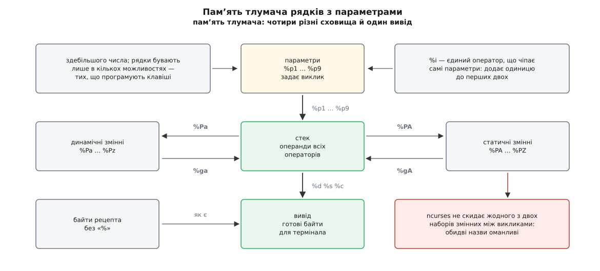
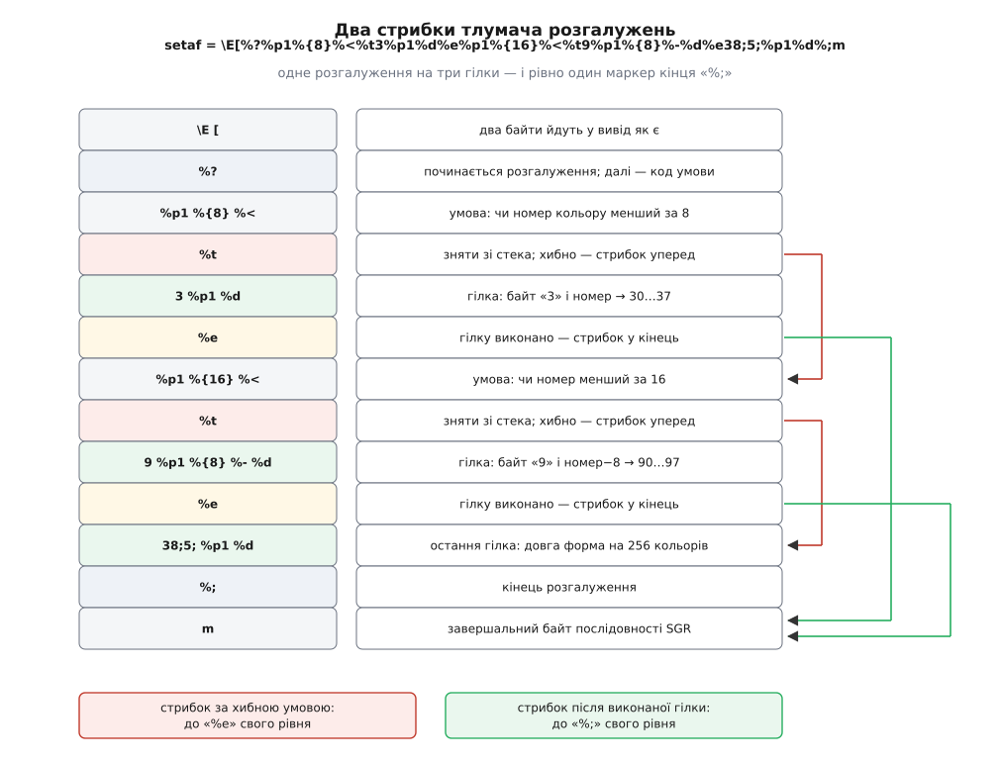

# ⚙️ Тлумач рядків з параметрами: стекова машина на сто рядків C

Дано рецепт із бази — скажімо, `\E[%i%p1%d;%p2%dH` — і до девʼяти параметрів. Треба віддати точну низку байтів, яку впізнає термінал. Напишімо цей тлумач цілком: він короткий, а кожна його частина відповідає на питання «чому не можна простіше».

## Чому підстановки не досить

Спокуса очевидна: віддати рецепт функції `printf`, замінивши `%p1%d` на звичайне `%d`. Ламається вона в чотирьох різних місцях, і жодне з них не екзотика.

Оператор `%i` додає одиницю до перших двох параметрів **перед** тим, як їх надрукують. `printf` своїх аргументів не змінює ніколи — а тут зміна є, і стосується вона саме параметрів, а не виводу.

Порядок теж не сталий. Рецепт вільно бере `%p2` раніше за `%p1`, вживає той самий параметр двічі або не вживає зовсім. `printf` іде списком аргументів підряд і назад не вертається.

Далі — арифметика. Далеко не кожен термінал друкує координату десятковими цифрами: чимало старих чекали на один байт, у якому до координати додано код пробілу, тобто `%p1%{32}%+%c`. Ні додавати, ні ділити `printf` не вміє, а вбудувати таку здатність у формат — це вже й є вигадування нової мови.

І головне — вибір. Рецепт `setaf` для `xterm-256color` залежно від номера кольору друкує три різні **літеральні** тексти: `3`, `9` або `38;5;`. Шаблон із дірками вибирати не вміє; вибирати вміє лише програма.

Тож значення рядкової можливості — це код, а `tparm()` — його тлумач. Машина під ним найпростіша з можливих: [стекова](root:sf-lang/bytecode-vm), без регістрів і без переходів назад. Циклів у мові немає взагалі, тому тлумач гарантовано зупиняється — довжина рецепта і є межа його роботи.

## Що тлумач памʼятає



*Оператори говорять зі стеком; параметрів торкається лише `%i`, і лише перших двох.*

Три дрібниці визначають форму коду.

Перша: комірка стека не завжди число. Кілька можливостей — ті, що програмують функційні клавіші, — беруть рядковий параметр, і `%s` мусить його надрукувати. Тому комірка — пара «число **або** вказівник на рядок», а кожен арифметичний оператор мусить чесно відмовитися, коли на верхівці лежить рядок.

Друга: у двомісних операторів є правильний бік. Довідник terminfo задає це прикладом: щоб дістати `x−5`, пишуть `%gx%{5}%-`. Тобто **перший знятий зі стека — правий операнд**, а не лівий. Переплутайте — і `%p1%{8}%-` для дев'ятки дасть не `1`, а `−1`, після чого рецепт `setaf 9` виплюне `ESC [ 9 -1 m`: послідовність із мінусом посеред числа, яку термінал відкине мовчки. Тому в коді нижче кожен двомісний оператор знімає `x`, потім `y` і рахує `y ⊙ x`.

Третя: статичні змінні `%PA`…`%PZ` не належать викликові. Документація [ncurses](root:sys-unix/ncurses) — бібліотеки, у якій `tparm` живе на кожній машині з Linux, — каже прямо, що обидві назви оманливі: жоден із двох наборів між викликами не скидається. У нашому коді ця пастка навмисно видима: масив `dyn` лежить усередині структури машини, а `svar` — поза нею, файловою статикою.

## Розгалуження — місце, де ламаються прості тлумачі

`%?` умова `%t` гілка `%e` гілка `%;` виглядає звичайним «якщо — інакше». Але подивіться на справжній `setaf`: після першого `%e` там стоїть **нова умова** і новий `%t`, а закриває всю споруду один-єдиний `%;`. Це форма «інакше-якщо» в дусі Алгола-68 — саме так її й описує довідник terminfo.

Отже, `%e` — не «початок гілки else», а маркер межі. Тлумач мусить уміти два різні стрибки:

- **умова хибна** → пропустити все до найближчого `%e` свого рівня (а якщо його немає — до `%;`) і виконувати далі: там може стояти наступна умова;
- **гілку виконано**, дійшли до `%e` → пропустити все до `%;` свого рівня.

«Свого рівня» — бо розгалуження бувають вкладені, і пропускаючи текст, тлумач рахує глибину: `%?` углиб, `%;` назовні. Обидва стрибки робить та сама функція, різниця між ними — один прапорець.



*Три гілки, два `%e` і один `%;` — тому «пропустити до кінця» й «пропустити до наступної умови» мусять бути різними діями.*

Пропуск — не просто пошук двох байтів. Усередині ділянки, яку ми перестрибуємо, трапляються `%{16}` і `%'x'`, а всередині них може стояти будь-що, зокрема `}` і лапка. Тому функція пропуску знає ті самі дужки, що й головний цикл: інакше рецепт із `%'%'` — сталою «код відсотка» — зіб'є їй лічильник.

## Код

```c
/* tparm-mini.c — тлумач рядків terminfo з параметрами.
   Складання:  cc -std=c11 -O2 -Wall -o tparm-mini tparm-mini.c        */

#include <ctype.h>
#include <stdio.h>
#include <string.h>

#define NPARM   9
#define STACKN  64
#define OUTN    1024

typedef struct { long num; const char *str; } Val;  /* str != NULL → рядок */

typedef struct {
    Val         parm[NPARM];
    Val         stack[STACKN];
    int         sp;
    long        dyn[26];               /* %Pa … %Pz                        */
    char        out[OUTN];
    size_t      olen;
    const char *err;
} Vm;

static long svar[26];                  /* %PA … %PZ — поза машиною навмисно */

static Val N(long n)        { Val v = { n, NULL }; return v; }
static Val S(const char *s) { Val v = { 0,  s   }; return v; }

/* ── дрібні дії ─────────────────────────────────────────────────────── */

static void push(Vm *m, Val v)
{
    if (m->sp < STACKN) m->stack[m->sp++] = v;
    else                m->err = "переповнення стека";
}

static void push_num(Vm *m, long n) { push(m, N(n)); }

static Val pop(Vm *m)
{
    if (m->sp > 0) return m->stack[--m->sp];
    m->err = "стек порожній";
    return N(0);                       /* хибний рецепт не валить програму */
}

static long pop_num(Vm *m)
{
    Val v = pop(m);
    if (v.str) { m->err = "потрібне число, а на стеку рядок"; return 0; }
    return v.num;
}

static void emit(Vm *m, int byte)
{
    if (m->olen + 1 < OUTN) m->out[m->olen++] = (char) byte;
    else                    m->err = "переповнення виводу";
}

static void emit_str(Vm *m, const char *s)
{
    while (*s) emit(m, (unsigned char) *s++);
}

/* ── пропуск гілки ──────────────────────────────────────────────────────
   Іде рецептом до межі гілки СВОЄГО рівня вкладеності й повертає позицію
   відразу за нею. want_else — зупинятися і на «%e», а не лише на «%;».   */

static const char *skip_to(const char *p, int want_else)
{
    int depth = 0;

    while (*p) {
        if (*p++ != '%') continue;
        if (!*p) break;
        switch (*p++) {
        case '?':  depth++;                                        break;
        case ';':  if (depth == 0) return p;  depth--;             break;
        case 'e':  if (depth == 0 && want_else) return p;          break;
        case '{':  while (*p && *p != '}') p++;  if (*p) p++;      break;
        case '\'': if (*p) p++;  if (*p == '\'') p++;              break;
        case 'p': case 'P': case 'g': if (*p) p++;                 break;
        }
    }
    return p;                                   /* рецепт обірвався — стоп */
}

/* ── сама машина ────────────────────────────────────────────────────── */

static const char *expand(Vm *m, const char *recipe, int argc, const Val *argv)
{
    const char *p = recipe;
    int i;

    memset(m, 0, sizeof *m);
    for (i = 0; i < argc && i < NPARM; i++) m->parm[i] = argv[i];

    while (!m->err && *p) {
        long x, y;
        Val  v;
        char buf[24];
        int  c;

        if (*p != '%') { emit(m, (unsigned char) *p++); continue; }
        p++;                                        /* пропустити сам «%» */

        switch (c = (unsigned char) *p++) {

        case '%': emit(m, '%');                                       break;
        case 'i': m->parm[0].num++; m->parm[1].num++;                 break;

        case 'p': c = *p++ - '1';
                  if (c < 0 || c >= NPARM) m->err = "хибний номер параметра";
                  else push(m, m->parm[c]);                           break;

        case 'P': c = (unsigned char) *p++;
                  if      (islower(c)) m->dyn[c - 'a'] = pop_num(m);
                  else if (isupper(c)) svar[c - 'A']   = pop_num(m);
                  else m->err = "хибне ім'я змінної";                 break;

        case 'g': c = (unsigned char) *p++;
                  if      (islower(c)) push_num(m, m->dyn[c - 'a']);
                  else if (isupper(c)) push_num(m, svar[c - 'A']);
                  else m->err = "хибне ім'я змінної";                 break;

        case '{': x = 0;
                  while (isdigit((unsigned char) *p)) x = x * 10 + (*p++ - '0');
                  if (*p == '}') p++; else m->err = "не закрито «}»";
                  push_num(m, x);                                     break;

        case '\'': if (!*p) { m->err = "обірваний рецепт"; break; }
                   push_num(m, (unsigned char) *p++);
                   if (*p == '\'') p++; else m->err = "не закрито лапку";
                                                                      break;

        case 'l': v = pop(m); push_num(m, v.str ? (long) strlen(v.str) : 0);
                                                                      break;

        /* друк: знімає верхівку */
        case 'd': snprintf(buf, sizeof buf, "%ld", pop_num(m));
                  emit_str(m, buf);                                   break;
        case 's': v = pop(m); emit_str(m, v.str ? v.str : "");        break;
        case 'c': emit(m, (int) (pop_num(m) & 0xff));                 break;

        /* двомісні: ПЕРШИЙ знятий — правий операнд («%gx%{5}%-» = x−5) */
        case '+': x = pop_num(m); y = pop_num(m); push_num(m, y +  x); break;
        case '-': x = pop_num(m); y = pop_num(m); push_num(m, y -  x); break;
        case '*': x = pop_num(m); y = pop_num(m); push_num(m, y *  x); break;
        case '/': x = pop_num(m); y = pop_num(m); push_num(m, x ? y / x : 0);
                                                                       break;
        case 'm': x = pop_num(m); y = pop_num(m); push_num(m, x ? y % x : 0);
                                                                       break;
        case '&': x = pop_num(m); y = pop_num(m); push_num(m, y &  x); break;
        case '|': x = pop_num(m); y = pop_num(m); push_num(m, y |  x); break;
        case '^': x = pop_num(m); y = pop_num(m); push_num(m, y ^  x); break;
        case '=': x = pop_num(m); y = pop_num(m); push_num(m, y == x); break;
        case '<': x = pop_num(m); y = pop_num(m); push_num(m, y <  x); break;
        case '>': x = pop_num(m); y = pop_num(m); push_num(m, y >  x); break;
        case 'A': x = pop_num(m); y = pop_num(m); push_num(m, y && x); break;
        case 'O': x = pop_num(m); y = pop_num(m); push_num(m, y || x); break;
        case '!': push_num(m, !pop_num(m));                            break;
        case '~': push_num(m, ~pop_num(m));                            break;

        case '?':                     /* лише позначка: код умови йде далі */
                                                                       break;
        case 't': if (!pop_num(m)) p = skip_to(p, 1);                  break;
        case 'e': p = skip_to(p, 0);  /* сюди доходять по виконаній гілці */
                                                                       break;
        case ';':                                                      break;

        default:  m->err = "невідомий оператор";                       break;
        }
    }

    m->out[m->olen] = '\0';
    return m->err ? NULL : m->out;      /* довжина — в m->olen, не strlen */
}

/* ── перевірка ──────────────────────────────────────────────────────── */

static void show(const char *label, const char *bytes)
{
    const unsigned char *b;

    printf("%-12s", label);
    if (!bytes) { printf("(помилка розбору)\n"); return; }
    for (b = (const unsigned char *) bytes; *b; b++) printf("%02x ", *b);
    printf(" | ");
    for (b = (const unsigned char *) bytes; *b; b++)
        putchar(*b == 0x1b ? '^' : *b);
    putchar('\n');
}

int main(void)
{
    static const char cup[]   = "\033[%i%p1%d;%p2%dH";
    static const char setaf[] = "\033[%?%p1%{8}%<%t3%p1%d"
                                "%e%p1%{16}%<%t9%p1%{8}%-%d"
                                "%e38;5;%p1%d%;m";
    /* вигаданий рецепт у дусі pfx: номер клавіші байтом, тоді довжина
       й сам рядок — щоб перевірити рядковий параметр і «%l»            */
    static const char pfx[]   = "\033Z%p1%'0'%+%c%p2%l%d;%p2%s";
    Vm  m;
    Val a[2];

    a[0] = N(9); a[1] = N(2);
    show("cup 9 2",   expand(&m, cup,   2, a));

    a[0] = N(1);   show("setaf 1",   expand(&m, setaf, 1, a));
    a[0] = N(9);   show("setaf 9",   expand(&m, setaf, 1, a));
    a[0] = N(200); show("setaf 200", expand(&m, setaf, 1, a));

    a[0] = N(3); a[1] = S("ls");
    show("pfx 3 ls",  expand(&m, pfx,   2, a));
    return 0;
}
```

## Звірка з базою

Перші два рецепти взяті не з голови — їх видно командою `infocmp -1 xterm-256color`; третій вигаданий, бо справжні `pfx` різняться від термінала до термінала, а нам треба лише перевірити рядкову комірку стека. Очікуваний вивід (`^` замість байта ESC):

```
cup 9 2     1b 5b 31 30 3b 33 48  | ^[10;3H
setaf 1     1b 5b 33 31 6d  | ^[31m
setaf 9     1b 5b 39 31 6d  | ^[91m
setaf 200   1b 5b 33 38 3b 35 3b 32 30 30 6d  | ^[38;5;200m
pfx 3 ls    1b 5a 33 32 3b 6c 73  | ^Z32;ls
```

Ті самі байти дає `tput`, який усередині кличе справжній `tparm`:

```
$ tput -T xterm-256color cup 9 2   | xxd -g1
00000000: 1b 5b 31 30 3b 33 48                             .[10;3H
$ tput -T xterm-256color setaf 200 | xxd -g1
00000000: 1b 5b 33 38 3b 35 3b 32 30 30 6d                 .[38;5;200m
```

Збіг байт-у-байт — і найцінніший тут рядок `setaf 9`: тільки він проходить обидва стрибки одразу (хибна перша умова жене нас до першого `%e`, а виконана друга гілка — від другого `%e` до `%;`) і по дорозі рахує `9−8`. Ті вісім кольорів, які зазвичай пробують першими, не перевіряють у тлумачі майже нічого. Що означають самі отримані байти, розказано в темі про [керуючі послідовності](root:sys-unix/terminal-escape-sequences).

> 🔧 **Навіщо це.** Помилку в пропуску гілок ви не побачите на перших восьми кольорах: там перша умова істинна, і жоден стрибок не робиться. Тлумач, що плутає `%e` з `%;`, роками працюватиме «правильно» й зламається рівно тоді, коли програма вперше попросить `setaf 9`. Тому перевіряти такий код треба з кінця списку, а не з початку.

## Пастки

**Статичні змінні переживають виклик.** Наш `svar` навмисно файловий: рецепт, що написав `%PA`, лишає значення наступному викликові — хоч би й для іншої можливості. У ncurses так само поводяться й «динамічні»; ми їх скидаємо, бо це чесніше щодо назви. Висновок для того, хто пише **записи**: спиратися не можна ні на те, ні на те.

**Рядковий параметр не можна вгадати з `...`.** Функція `tparm` змінноаргументна, і зі списку аргументів ніяк не видно, чи третій із них `int`, чи `char *` — а прочитати не той тип означає взяти чуже сміття за вказівник. Справжній ncurses виводить це з рецепта: `%p2%s` каже, що другий параметр рядковий. Здогадка ця крихка, і саме через неї зʼявився `tiparm_s`, якому кількість параметрів і бітову маску «які з них рядкові» повідомляють явно.

**`%e` може не бути зовсім.** Тоді хибна умова мусить привести до `%;`, а не пробігти рецепт до кінця. Через це прапорець `want_else` **додає** `%e` до цілей пропуску, а не переставляє мішень із `%;` на `%e`.

**Друк багатший, ніж `%d`.** Мова допускає повну форму `%[[:]прапорці][ширина[.точність]][doxXs]` — наприклад `%02x` у записі `initc` консолі Linux. Двокрапка тут не окраса: без неї `%-16s` починалося б із оператора віднімання. Наш тлумач цю форму не знає — доточити її означає зібрати специфікатор і віддати `snprintf`.

**Нуль-байт.** `%c`, що зняв зі стека нуль, надрукує байт `00` — а буфер у нас звичайний C-рядок. Тому `expand` веде `olen`, і брати вивід треба саме по ній. Із того самого кореня росте давня домовленість самої бази: `\0` у джерельному записі компілюється в байт `\200`, який рядка не рве, а термінал із семибітовими даними бачить як нуль.

**Параметрів може прийти менше, ніж рецепт просить.** `memset` на початку `expand` дає нулі, тож `cup` без аргументів тихо розгорнеться в `ESC [ 1 ; 1 H` — цілком коректну послідовність, яка просто робить не те. Помилки тут не буде ніде: ні рецепт, ні база не кажуть, скільки параметрів очікує можливість, — це знання лежить у голові того, хто пише виклик.

**Буфер живе до наступного виклику.** Вивід у нас усередині `Vm`, тому результат чинний рівно до того, як ту саму машину попросять розгорнути щось іще. Через це в `main` кожен `expand` одразу віддається в `show`, а не збирається до масиву: два виклики, складені в один `printf`, показали б двічі те саме. Хочете тримати кілька рядків одночасно — або копіюйте вивід, або заведіть окрему `Vm` на кожен.

**Рецепт — це чужий код.** База знаходиться в тому числі через змінну `TERMINFO` й теку `~/.terminfo`, тобто підсунути свій запис може будь-хто, хто керує оточенням процесу. Тому порожній стек, ділення на нуль і `%p0` тут не «не станеться ніколи», а звичайні вхідні дані: кожен із них у нашому коді веде до `err` і чесного `NULL`, а не до аварії.
