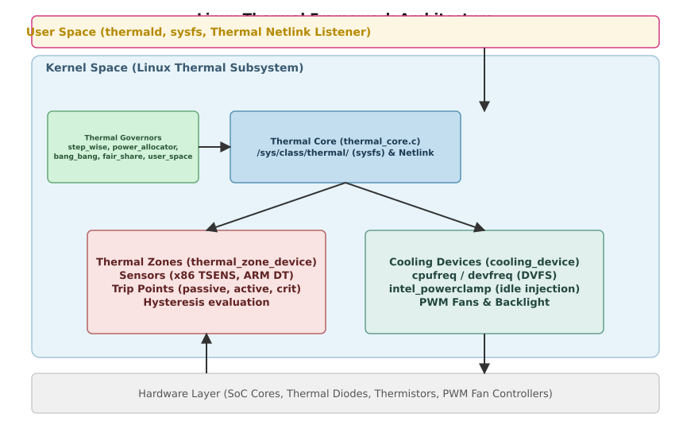
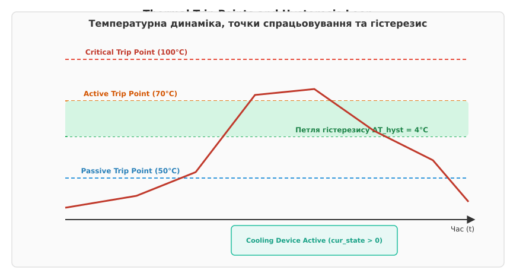
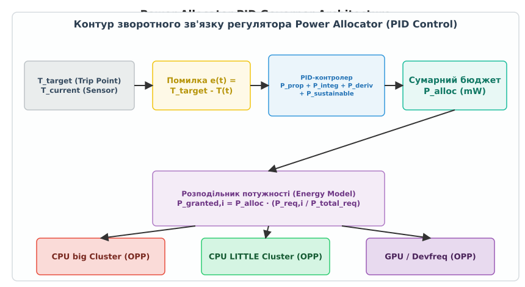

# Термальний фреймворк ядра

<preknowlist>
- [Модель пристроїв у sysfs](topic:sys-unix/sysfs-device-model) — механізм розкриття атрибутів ядра через віртуальну файлову систему /sys.
- [Зміна частоти й станів простою (cpufreq та cpuidle)](topic:sys-unix/cpufreq-and-cpuidle) — керування робочими точками P-states та C-states процесора.
- [Опис апаратного забезпечення через Device Tree](topic:sys-unix/device-tree) — структура та синтаксис вузлів DTB для представлення периферії.
</preknowlist>

Сучасні напівпровідникові кристали процесорів та систем на кристалі (SoC) виділяють колосальну кількість тепла: щільність потужності у гарячих точках (hotspots) мікросхеми досягає сотень ватт на квадратний сантиметр. Коли робоча температура кремнію перетинає граничне значення кристала (зазвичай 100–105 °C), різко пришвидшуються механізми зношування — деградація підзатворних діелектриків та електроміграція атомів металізації, — а разом із ними наростає струм витоку, який гріє кристал ще дужче. Саме цей додатний зворотний зв'язок (тепловий розгін) здатен за секунди довести чип до збою чи незворотного пошкодження. Щоб запобігти катастрофі, операційна система мусить не лише безперервно стежити за показниками багатьох термісторів і термодіодів, а й узгоджено реагувати за мілісекунди: знижувати тактові частоти й напруги, вмикати вентилятори чи впорскувати примусові цикли простою.

У ядрі Linux за це відповідає уніфікована підсистема — **Linux Thermal Framework** (термальний фреймворк ядра). Вона зв'язує різнорідні апаратні датчики, алгоритми керування теплом та механізмів охолодження в єдиний керований контур зворотного зв'язку.

## Архітектурний трикутник термального фреймворку

До появи єдиного фреймворку кожен драйвер платформи намагався самотужки опитувати свої датчики й знижувати частоту. Це призводило до хаосу: драйвер процесора не знав про перегрів GPU на тому ж кристалі, активні вентилятори вмикалися із запізненням, а аварійні сигнали тривоги гальмували роботу системних служб.

Фреймворк розв'язав цю проблему шляхом строгого розділення відповідальності між трьома базовими абстракціями:

1. **Термальна зона (`thermal_zone_device`)** — логічна або фізична область системи (ядро CPU, відеочип, акумулятор, корпус пристрою), температура якої контролюється одним чи кількома датчиками.
2. **Точка спрацьовування (`thermal_trip`)** — заздалегідь визначений температурний поріг усередині зони, під час перетину якого виникає умова для виконання певної дії.
3. **Пристрій охолодження (`thermal_cooling_device`)** — компонент ядра чи апаратного забезпечення, здатний активним або пасивним чином зменшувати тепловиділення чи відводити тепло з кристала.

Взаємодією цих трьох елементів керує **термальний регулятор (thermal governor)** — алгоритм, який отримує від термальної зони її поточний температурний стан та обчислює, які саме рівні впливу слід прикласти до пристроїв охолодження.


*Архітектура Linux Thermal Framework: взаємодія датчиків, термального ядра, регуляторів, пристроїв охолодження та простору користувача.*

Еволюційний шлях від розрізнених скриптів опитування ACPI до сучасного фреймворку описує [історія розвитку термального управління в Linux](topic:sys-unix/thermal-management-framework/hist-thermal-evolution.md).

---

## Термальні зони та точки спрацьовування

Термальна зона уособлює джерело тепла. У файловій системі sysfs кожна зона представлена окремою директорією `/sys/class/thermal/thermal_zoneN/`. Драйвер датчика під час ініціалізації викликає функцію `thermal_zone_device_register_with_trips()`, вказуючи назву зони, масив температурних порогів, інтервали опитування та покажчики на методи драйвера.

### Механіка зчитування температури: Polling vs Interrupts

Датчики температури діляться на два класи за способом інформування ядра:

- **Періодичне опитування (Polling):** Прості датчики не вміють генерувати апаратні переривання під час зміни температури. Ядро створює відкладену роботу в черзі системних подій (`system_freezable_power_efficient_wq`), яка через кожні `polling_delay` мілісекунд викликає функцію драйвера `get_temp()`. Якщо температура перетинає пасивний поріг, ядро переключається на прискорений інтервал `passive_delay` (наприклад, 250 мс замість 1000 мс), щоб чутливо відстежувати динаміку нагріву.
- **Події за перериваннями (Interrupt-driven):** Сучасні контролери (наприклад, Intel Digital Thermal Sensors або ARM Thermal Sensor Controller) дозволяють програмувати пороги переривань прямо в регістрах SoC. Коли кристал нагрівається до порога, генерується апаратне переривання (IRQ), і ядро викликає `thermal_zone_device_update()` негайно, не витрачаючи енергію процесора на періодичні опитування у стані простою.

### Типи точок спрацьовування (Trip Points)

Точки спрацьовування декларують межі, при переході через які змінюється режим експлуатації обладнання. Кожна точка спрацьовування має точне значення температури (у міліградусах Цельсія, m°C) та належить до одного з чотирьох стандартизованих типів:

| Тип точки спрацьовування | Опис та характер реакції ядра |
| :--- | :--- |
| **`passive`** | Поріг пасивного охолодження. Ядро знижує тепловиділення без залучення активних механізмів (зниження частоти, впорскування простою). |
| **`active`** | Поріг активного охолодження. Ініціює роботу пристроїв споживання енергії для відведення тепла (увімкнення вентиляторів, рідинних помп). |
| **`hot`** | Межа критичного нагріву. Ядро надсилає сповіщення простору користувача для термінового збереження даних та зниження навантаження. |
| **`critical`** | Показник фізичної загрози чипу. Ядро не звертається до регулятора, а негайно й примусово вимикає живлення системи (`thermal_zone_device_critical()`). |

### Фізична роль гістерезису (Hysteresis)

Аналогова температура реального кристала не є статичною — вона піддається високочастотним флуктуаціям через точкові сплески обчислювального навантаження. Якщо точка спрацьовування `active` встановлена на 70.0 °C, а гістерезис відсутній (0 °C), вентилятор системи охолодження переключатиметься між увімкненим та вимкненим станом сотні разів на хвилину під час коливання температури у діапазоні 69.9–70.1 °C. Цей процес (релейний брязкіт або chattering) спричиняє швидкий механічний знос вентиляторів та створює дратівливий акустичний шум.

Для нейтралізації цього ефекту кожна точка спрацьовування містить параметр гістерезису `hysteresis` (також у m°C).


*Динаміка зміни температури та робота гістерезису: активне охолодження вмикається при досягненні 70°C і вимикається лише після падіння температури нижче 66°C (гістерезис 4°C).*

Дія гістерезису визначає несиметричні пороги увімкнення та вимкнення:
- **Увімкнення охолодження:** Температура зростає і перевищує `T_trip` (70000 m°C).
- **Вимкнення охолодження:** Температура падає і перетинає нижню межу `T_trip - T_hyst` (70000 - 4000 = 66000 m°C).

Зона між 66 °C та 70 °C утворює петлю гістерезису, в якій стан пристрою охолодження зберігає своє попереднє значення, гарантуючи стабільність системи керування.

---

## Пристрої охолодження (Cooling Devices)

Пристрій охолодження у Linux Thermal Framework — це абстракція над виконавчим механізмом, який вміє послаблювати температурний напір. У sysfs вони реєструються за шляхом `/sys/class/thermal/cooling_deviceY/`.

Кожен пристрій охолодження характеризується цілочисельним станом керування:
- `max_state` — максимально можливий рівень охолодження (наприклад, 10 для вентилятора або 15 для тактової сітки CPU).
- `cur_state` — поточний активований рівень (від `0` — охолодження вимкнено / повна продуктивність, до `max_state` — максимальне охолодження / максимальний тротлінг).

### Класифікація пристроїв охолодження

#### 1. Пасивні пристрої (Passive Cooling)
Пасивне охолодження знижує швидкість генерації тепла безпосередньо у джерелі. Воно не вимагає додаткових витрат енергії, але знижує обчислювальну потужність системи.

- **`cpufreq-cooling`:** Найпоширеніший пасивний механізм. Драйвер обмежує максимальну дозволену частоту процесора для підсистеми `cpufreq`. Стан `0` відповідає максимальній частоті SoC, а стан `max_state` обмежує частоту до найнижчого доступного значення OPP (Operating Performance Point).
- **`intel_powerclamp`:** Використовується на архітектурах x86, коли подальше зниження частоти неможливе або неефективне. Драйвер примусово впорскує синхронні цикли простою (idle injection) через підсистему `cpuidle`. Процесор періодично вводиться у глибокі C-стани на заданий відсоток часу (наприклад, 25% чи 50%), навіть якщо у системі є активні задачі.
- **`devfreq-cooling`:** Обмежує частоти й напруги графічних процесорів (GPU), шин пам'яті (DDR) та спеціалізованих NPU-прискорювачів.
- **Охолодження підсвічуванням:** Знижує яскравість підсвічування дисплея у мобільних пристроях — на максимальній яскравості екран дає помітну частку всього тепловиділення смартфона. У головній гілці ядра окремого універсального драйвера для цього немає, механізм живе у вендорських деревах Android-платформ.

#### 2. Активні пристрої (Active Cooling)
Active Cooling відводить тепло від кристала у навколишнє середовище шляхом примусового конвективного обміну.
- **`fan` (PWM Fan):** Керування швидкістю обертання лопатей вентилятора за допомогою широтно-імпульсної модуляції (ШІМ/PWM). Стан охолодження — це не сира шпаруватість ШІМ, а індекс у переліку рівнів, оголошених для вентилятора (у Device Tree — властивість `cooling-levels`): стан `0` відповідає зупиненому кулеру, `max_state` — останньому рівню, тобто повній швидкості обертання.
- **Рідинні помпи та термоелектричні модулі (Пельтьє):** Керування продуктивністю помп рідинного охолодження у високопродуктивних серверах та робочих станціях.

### Обмеження потужності RAPL та Powercap

На сучасних серверах та ноутбуках архітектури Intel/AMD пасивне охолодження реалізується також через технологію Intel RAPL (Running Average Power Limit) та підсистему ядра Powercap. 

Вона дозволяє задавати апаратні ліміти споживання потужності в міліватах у часових вікнах:
- **PL1 (Long Term Power Limit):** Тривалий ліміт потужності, що відповідає розрахунковій тепловій потужності (TDP) системи охолодження.
- **PL2 (Short Term Power Limit):** Короткочасний ліміт для коротких сплесків турбо-частоти (наприклад, до 28 секунд).
- **PL4 (Peak Power Limit):** Миттєвий абсолютний поріг пікової потужності для захисту схем живлення VRM.

Термальний фреймворк може динамічно змінювати атрибути `power_limit` у підсистемі powercap при перевищенні пасивних точок спрацьовування, примушуючи процесор самостійно знижувати напругу й частоту ядер на рівні мікрокоду.

### Прив'язка (Thermal Binding) та Вага (Weight)

Для того щоб регулятор знав, яким саме пристроєм охолодження гасити нагрів конкретної зони, створюється об'єкт прив'язки — `thermal_instance`. У зв'язці визначаються:
- Термальна зона (`thermal_zone_device`).
- Пристрій охолодження (`thermal_cooling_device`).
- Пов'язана точка спрацьовування (`trip`).
- Діапазон станів охолодження (`lower` та `upper`), які дозволено використовувати для цієї точки.
- Ваговий коефіцієнт (`weight`) — відносна частка участі цього пристрою у придушенні нагріву порівняно з іншими пристроями зони.

---

## Термальні регулятори (Governors)

Регулятор (Thermal Governor) реалізує конкретний алгоритм керування зворотним зв'язком. Він аналізує поточну температуру, динаміку її зміни, пороги точок спрацьовування й обчислює нові значення `cur_state` для пристроїв охолодження.

Ядро Linux містить п'ять основних регуляторів, які вибираються реєстрацією або через sysfs-атрибут `policy`:

### 1. `step_wise` (Покроковий трендовий регулятор)
Це універсальний алгоритм за замовчуванням для більшості Linux-систем. Його логіка опирається на оцінку температурного тренду (`THERMAL_TREND_RAISING`, `THERMAL_TREND_FALLING`, `THERMAL_TREND_STABLE`):

- Якщо температура перебуває вище точки спрацьовування і **зростає** (`RAISING`), `step_wise` збільшує стан охолодження прив'язаного пристрою на `1` крок (`cur_state++`).
- Якщо температура перебуває вище точки спрацьовування, але **падає** (`FALLING`), регулятор залишає поточний стан охолодження без змін, даючи системі можливість охолонути природним шляхом.
- Якщо температура впала нижче порога з урахуванням гістерезису, регулятор поступово зменшує стан охолодження на `1` крок під час кожного циклу опитування (`cur_state--`).

Покрокова зміна запобігає різким скачкам частоти та шуму вентиляторів, забезпечуючи плавну адаптацію.

### 2. `power_allocator` (Розподільник потужності на основі PID)
Сучасний алгоритм, розроблений компаніями ARM та Linaro для складних гетерогенних SoC (наприклад, ARM big.LITTLE / DynamIQ). Замість умовної шкали «кроків» `power_allocator` оперує фізичною величиною — **бюджетом теплової потужності у міліватах (mW)**.


*Контур зворотного зв'язку регулятора Power Allocator: PID-контролер обчислює загальний бюджет потужності, який розподіляється між акторами на основі Energy Model.*

Регулятор використовує класичний PID-контролер (Proportional-Integral-Derivative):
1. Обчислюється помилка температури: `e(t) = T_target - T_current`.
2. PID-контролер розраховує сумарну дозволену потужність розсіювання `P_alloc`, яку кристал може виділити без перевищення ліміту нагріву.
3. Отримана потужність розподіляється між "акторами" (CPU big-ядра, LITTLE-ядра, GPU) пропорційно до їхніх запитів та поточного навантаження з використанням моделі енергоспоживання (Energy Model, EM).
4. Виділена кожному акторові потужність перекладається у граничну частоту OPP для його компонента.

Детальний аналіз дифрівнянь та дискретизації цього алгоритму містить [математичне виведення PID-контролера регулятора Power Allocator](topic:sys-unix/thermal-management-framework/math-power-allocator-pid.md).

### 3. `fair_share` (Справедливий розподіл)
Використовується у системах, де кілька пристроїв охолодження впливають на одну термальну зону. На основі приписаної ваги (`weight`) регулятор пропорційно збільшує стани охолодження для всіх пристроїв одночасно, не дозволяючи системі "душити" лише один процесорний блок, якщо інші також роблять внесок у нагрів.

### 4. `bang_bang` (Релейний двопозиційний регулятор)
Призначений виключно для активних пристроїв охолодження з двома станами (увімкнено/вимкнено) або дводіапазонних вентиляторів. Він не використовує плавних проміжних кроків: при перетині порога прив'язаний пристрій охолодження одразу переводиться у стан `max_state`, а при падінні температури нижче межі гістерезису — скидається в `0`.

### 5. `user_space` (Делегування у простір користувача)
Регулятор відключає внутрішньоядерний алгоритм прийняття рішень. При зміні температури ядро надсилає події у простір користувача через механізми uevent або Thermal Netlink. Притисненням пристроїв охолодження керує зовнішній демон (наприклад, `thermald` від Intel), який записує бажані стани безпосередньо в атрибути `cur_state`.

Перелік цих п'яти закритий не випадково. Регулятор — не сторонній модуль, який можна донести збоку: функція реєстрації назовні не експортується, а самі регулятори потрапляють у список через таблицю в окремій секції компонувальника, яку заповнює макрос під час збирання ядра. Тож власний алгоритм — це файл поруч із `gov_step_wise.c` плюс рядок у `Kconfig` і `Makefile`, а не `insmod`; набір колбеків при цьому залежить від версії — у 6.10 єдиний `.throttle()` замінили на пару `.trip_crossed()` і `.manage()`. Найменший робочий регулятор під сучасний інтерфейс розібрано в [власний тепловий регулятор](topic:sys-unix/thermal-management-framework/proj-thermal-governor.md).

---

## Внутрішньоядерний ланцюг виконання та Thermal Pressure

Усі компоненти термального фреймворку реалізовані в підсистемі ядра `drivers/thermal/`. Серцем фреймворку є файл `thermal_core.c`.

### Головний ланцюг оновлення температури

Коли датчик фіксує зміну температури (або коли спрацьовує таймер опитування `thermal_zone_device_check`), викликається центральна функція ядра `thermal_zone_device_update()`:

```
thermal_zone_device_check()
  └── thermal_zone_device_update()
        ├── zone->ops->get_temp(zone, &temp)   [зчитування температури з драйвера]
        ├── handle_thermal_trip(zone, trip)    [перевірка перетину точок спрацьовування]
        │     ├── thermal_notify_tz_trip_up()   [подія Netlink «поріг перетнуто вгору»]
        │     └── thermal_notify_tz_trip_down() [подія Netlink «температура впала»]
        └── zone->governor->throttle(zone)     [викликає розрахунок регулятора]
              └── cdev->ops->set_cur_state()   [притискає cpufreq / вмикає fan]
```

1. **Зчитування:** Ядро запитує актуальну температуру через покажчик на функцію драйвера `zone->ops->get_temp()`.
2. **Оцінка точок спрацьовування:** У циклі по всіх `trips` зона порівнює `temp` із порогами. Якщо виявлено перетин критичної точки (`THERMAL_TRIP_CRITICAL`), ядро не чекає на регулятор, а негайно викликає `thermal_zone_device_critical()`, ініціюючи аварійне вимкнення живлення.
3. **Виклик регулятора:** Якщо критичні пороги не досягнуті, викликається метод `governor->throttle(zone)`.
4. **Застосування впливу:** Регулятор розраховує нові стани і через `cdev->ops->set_cur_state()` оновлює параметри виконавчих пристроїв.

### Інтеграція з планувальником задач (Thermal Pressure & EEVDF Scheduler)

Зниження тактової частоти процесора під час тротлінгу зменшує його максимальну продуктивність. Якщо ядро CPU здатне працювати на 3.0 ГГц, а термальний тротлінг затискає його частоту до 1.5 ГГц, реальна обчислювальна спроможність ядра падає приблизно удвічі.

Якщо планувальник задач ядра (EEVDF / CFS) не знає про це обмеження, він продовжуватиме відправляти важкі обчислювальні потоки на затиснуте ядро, вважаючи його рівноцінним іншим холодним ядрам. 

Щоб запобігти цьому, термальний фреймворк підключений до підсистеми `sched/pelt.c` через механізм **Thermal Pressure**:

```
thermal_pressure
= max_capacity - current_capped_capacity  [обчислення втраченої продуктивності ядра]
```

Планувальник EEVDF враховує `thermal_pressure` під час обчислення `capacity_of(cpu)` і переносить CPU-bound процеси на інші, менш нагріті ядра або кластери SoC.

---

## Звідки беруться зони й пороги

Спосіб опису термальної топології залежить від архітектури апаратного забезпечення — а подекуди опису й зовсім немає, і пороги драйвер рахує собі сам.

### Опис у Device Tree (ARM / RISC-V / MIPS)

В ARM-системах на кристалі термальна конфігурація описується у вузлі `thermal-zones` файлів `.dtsi`:

```dts
thermal-zones {
    cpu_thermal: cpu-thermal {
        polling-delay-passive = <250>;  /* мс під час пасивного охолодження */
        polling-delay = <1000>;         /* мс у штатному режимі */
        thermal-sensors = <&tsens 0>;   /* посилання на phandle датчика */

        trips {
            cpu_alert: cpu-alert {
                temperature = <75000>;  /* 75.0°C */
                hysteresis = <2000>;   /* 2.0°C */
                type = "passive";
            };
            cpu_crit: cpu-crit {
                temperature = <100000>; /* 100.0°C */
                hysteresis = <0>;
                type = "critical";
            };
        };

        cooling-maps {
            map0 {
                trip = <&cpu_alert>;
                cooling-device = <&cpu0 THERMAL_NO_LIMIT THERMAL_NO_LIMIT>,
                                 <&cpu1 THERMAL_NO_LIMIT THERMAL_NO_LIMIT>;
            };
        };
    };
};
```

Секція `cooling-maps` описує автоматичну прив'язку: при перетині точки `cpu_alert` (75 °C) регулятор почне керувати частотами ядер `cpu0` та `cpu1`. Тонкість тут у тому, що `&cpu0` — вузол самого процесорного ядра, а не якогось окремого охолоджувача: пристрій охолодження для нього реєструє драйвер `cpufreq`, побачивши у вузлі властивість `#cooling-cells = <2>`. Двійка каже, скільки комірок читати після phandle, а самі комірки задають нижню й верхню межі станів охолодження, дозволених на цій точці; `THERMAL_NO_LIMIT` в обох означає «не обмежувати ні знизу, ні згори», тобто віддати регуляторові весь діапазон OPP. У критичного порога гістерезис стоїть нулем не з недогляду: з порога, за яким машина вимикається, не повертаються, і нижньої межі для нього просто немає.

### Інтеграція з ACPI (x86 Architecture)

На платформах x86 термальні зони визначаються прошивкою BIOS/UEFI у таблицях ACPI DSDT/SSDT. Драйвер `acpi_thermal` транслює ACPI-об'єкти у термальний фреймворк ядра:
- `_TMP` (Temperature) → транслюється у виклик `get_temp()`.
- `_CRT` (Critical Temperature) → перетворюється на точку спрацьовування `critical`.
- `_PSV` (Passive Temperature) → перетворюється на точку спрацьовування `passive`.
- `_AC0` ... `_AC9` (Active Cooling) → перетворюються на точки спрацьовування `active` для керування вентиляторами.
- `_PSL` (Passive List) → список процесорів, які підлягають тротлінгу при пасивному охолодженні.

### Пороги, яких ніхто не оголошував: пакетний датчик x86

Поруч із зоною від ACPI на тій самій машині Intel живе ще одна, і приходить вона нізвідки. Драйвер сумарного датчика процесорного пакета (`drivers/thermal/intel/x86_pkg_temp_thermal.c`) не читає ні дерева пристроїв, ні таблиць прошивки: він заводить щонайбільше два пороги (`#define MAX_NUMBER_OF_TRIPS 2`), і обидва — пасивними (`trips[i].type = THERMAL_TRIP_PASSIVE`). Температури для них теж ніде не записані наперед — вони відраховуються вниз від межі кристала, на зсув, що лежить у регістрі порогів:

```
trips[i].temperature = tj_max - thres_reg_value · 1000   [m°C]
```

Тому `80000` у `trip_point_0_temp` на такій машині — це не власне число драйвера, а `Tj_max` у 100 °C мінус запрограмовані 20 °C. Поки зсув нульовий, поріг вважається незаданим, і ядро тримає в ньому `THERMAL_TEMP_INVALID` (−274000). Записавши туди нове значення з простору користувача, ви переставляєте не рядок у пам'яті ядра, а той самий регістровий зсув — і датчик почне сповіщати ядро з нової температури.

Звідси загальніше правило: числа й типи порогів — властивість платформи, а не каркаса, тож однакова температура в різних зонах означає різні дії. Оголошені критичними в дереві пристроїв 100 °C вимкнуть машину; ті самі 100 °C, пораховані пакетним датчиком як пасивний поріг, лише притиснуть частоту.

---

## Інтерфейси простору користувача: Sysfs та Thermal Netlink

Простір користувача має два канали зв'язку з термальним фреймворком: файловий інтерфейс sysfs для інспекції/конфігурації та асинхронний сокетний інтерфейс Thermal Netlink для відстеження подій у реальному часі.

### Файлова структура Sysfs (`/sys/class/thermal/`)

Усі об'єкти експортуються у віртуальну файлову систему:

- `/sys/class/thermal/thermal_zoneX/temp` — поточна температура у m°C.
- `/sys/class/thermal/thermal_zoneX/type` — текстова назва зони: `cpu-thermal` на ARM-платформі, `x86_pkg_temp` для пакета Intel, `battery`, `acpitz`. Номер `X` дає порядок реєстрації драйверів і від завантаження до завантаження може переставитися, тож потрібну зону шукають саме за `type`, а не за номером.
- `/sys/class/thermal/thermal_zoneX/policy` — поточний регулятор (можна змінити через `echo step_wise > policy`).
- `/sys/class/thermal/thermal_zoneX/trip_point_Y_temp` — температура точки спрацьовування.
- `/sys/class/thermal/thermal_zoneX/trip_point_Y_hyst` — гістерезис точки спрацьовування.
- `/sys/class/thermal/cooling_deviceY/cur_state` — поточний стан пристрою охолодження.
- `/sys/class/thermal/cooling_deviceY/max_state` — максимальний стан пристрою.

Структуру двійкових атрибутів, прапори доступу та формати даних підсистеми деталізує [детальний довідник sysfs-атрибутів та Netlink-структур](topic:sys-unix/thermal-management-framework/api-sysfs-and-netlink.md).

### Thermal Generic Netlink Family

Постійне опитування файлів sysfs з простору користувача створює небажане навантаження на систему. Тому ядро надає сімейство [Generic Netlink](topic:sys-unix/netlink-protocol) `thermal` (`THERMAL_GENL_FAMILY_NAME`). 

Через Netlink-сокет демони користувача можуть:
1. Підписуватися на мультикаст-групи подій (`THERMAL_GENL_EVENT_GROUP`).
2. Отримувати миттєві сповіщення при перетині точок спрацьовування (`THERMAL_GENL_EVENT_TZ_TRIP_UP`, `THERMAL_GENL_EVENT_TZ_TRIP_DOWN`).
3. Моніторити зміну теплової спроможності процесорів (`THERMAL_GENL_EVENT_CPU_CAPABILITY_CHANGE`).

Повноцінний вихідний код демона моніторингу мовами C та C++ з використанням Netlink містить [практична програма моніторингу та обробки подій](topic:sys-unix/thermal-management-framework/proj-thermal-monitor.md).

---

> 🔧 **Навіщо це.**
> Розуміння роботи термального фреймворку є критичним під час розробки пристроїв на базі Linux, діагностики просідання продуктивності та налаштування серверів:
> 1. **Діагностика тротлінгу:** Якщо сервер або мобільний пристрій раптово скидає продуктивність у важких задачах, першим кроком є перевірка `/sys/class/thermal/cooling_device*/cur_state`. Зростання значення від `0` свідчить про те, що ядро активувало захисний тротлінг через досягнення температурного порога.
> 2. **Тестування систем охолодження:** Під час налагодження нової плати інженер може примусово записати максимальне значення в `cur_state` вентилятора через sysfs, щоб перевірити справність ШІМ-контролера та виміряти максимальний повітряний потік до запуску стрес-тестів CPU.
> 3. **Захист обладнання у критичних умовах:** У системному програмуванні для вбудованих Linux-пристроїв (дрони, автомобільні бортові комп'ютери) правильне визначення точок `hot` та `critical` гарантує, що пристрій коректно збереже логи та вимкне периферію до того, як температура довкілля зруйнує кремнієві кристали.
