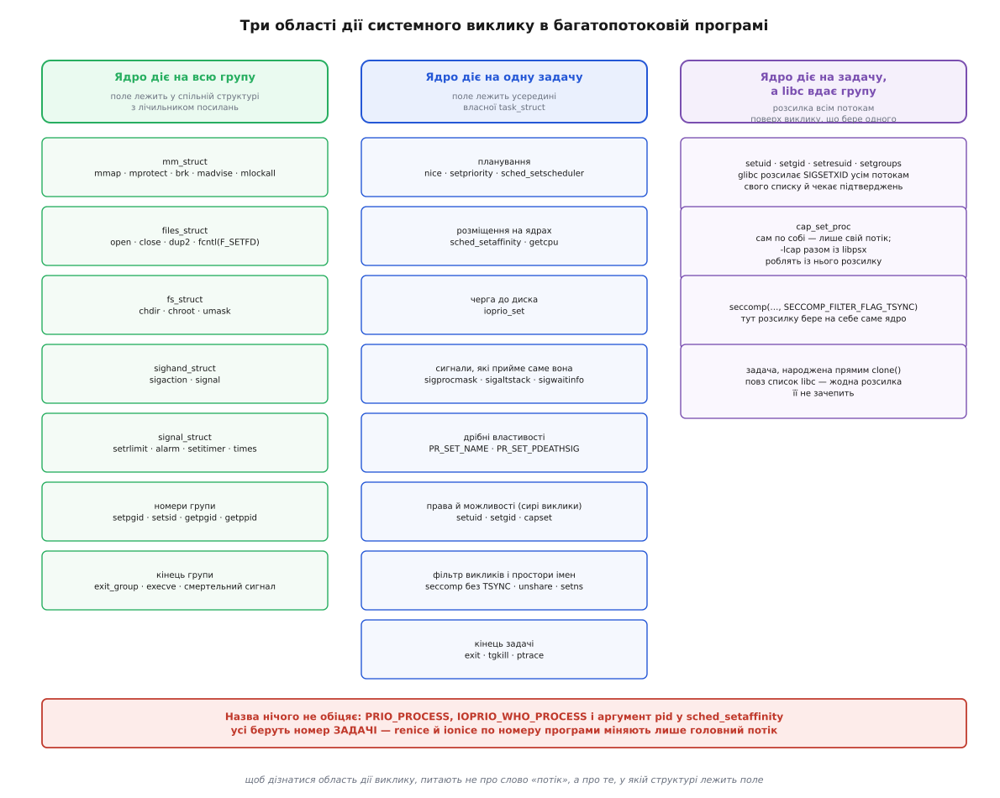

# 📋 Область дії виклику: задача чи вся програма

Це перелік того, що саме кожен системний виклик зачіпає в багатопотоковій програмі — одну задачу чи всю групу задач, — разом із парами, де назва виклику каже «process», а діє він на окрему нитку виконання. Довідка потрібна тому, що назва не є документацією: `setpriority(PRIO_PROCESS, …)`, `ioprio_set(IOPRIO_WHO_PROCESS, …)` і аргумент `pid` у `sched_setaffinity()` — усі троє беруть номер задачі, а не номер програми.

Правило читання таблиць одне й механічне. Область дії виклику визначає не його назва, а те, **у якій структурі ядра лежить поле, яке він міняє**. Поле в структурі зі спільним лічильником посилань (`mm_struct`, `files_struct`, `fs_struct`, `sighand_struct`, `signal_struct`) — виклик діє на всю групу, бо структура одна на всіх. Поле всередині `task_struct` — виклик діє на ту задачу, номер якої йому передали. Третій випадок трапляється рідше й тому найнебезпечніший: ядро діє на задачу, а бібліотека поверх нього робить розсилку всім потокам і створює **видимість** групової дії — така дія працює лише для потоків, які бібліотека створила сама.



*Ліва колонка — виклики, що міняють поле спільної структури, тож діють на всю програму незалежно від того, який потік їх зробив. Середня — виклики, що міняють поле в `task_struct` названої задачі й більше нічиє. Права — виклики, у яких групову семантику дописує libc чи прапорець ядра, і тільки для тих потоків, про які вона знає.*

## Найкоротша перевірка на живій програмі

Перед таблицями — короткий дослід, що показує обидві поведінки одразу. Потік міняє собі `nice`, прив'язується до одного ядра процесора й переходить в інший каталог; після цього обидві задачі звітують про своє.

:::tabs
```c
#define _GNU_SOURCE
#include <pthread.h>
#include <sched.h>
#include <stdio.h>
#include <sys/resource.h>
#include <sys/syscall.h>
#include <unistd.h>
#include <limits.h>

static void report(const char *tag)
{
    char cwd[PATH_MAX];
    cpu_set_t set;

    CPU_ZERO(&set);
    sched_getaffinity(0, sizeof set, &set);   /* 0 = ця задача */
    printf("%-11s tid=%-6ld nice=%-3d ядер=%-2d cwd=%s\n",
           tag, (long)syscall(SYS_gettid),
           getpriority(PRIO_PROCESS, 0), CPU_COUNT(&set),
           getcwd(cwd, sizeof cwd));
}

static void *worker(void *arg)
{
    cpu_set_t one;

    (void)arg;
    report("потік");
    setpriority(PRIO_PROCESS, 0, 5);          /* своє */
    CPU_ZERO(&one); CPU_SET(0, &one);
    sched_setaffinity(0, sizeof one, &one);   /* своє */
    chdir("/tmp");                            /* спільне! */
    report("потік*");
    return NULL;
}

int main(void)
{
    pthread_t t;

    report("головний");
    pthread_create(&t, NULL, worker, NULL);
    pthread_join(t, NULL);
    report("головний*");
    return 0;
}
```
```cpp
#include <iostream>
#include <thread>
#include <filesystem>
#include <sched.h>
#include <sys/resource.h>
#include <sys/syscall.h>
#include <unistd.h>

static void report(const char *tag)
{
    cpu_set_t set;
    CPU_ZERO(&set);
    sched_getaffinity(0, sizeof set, &set);
    std::cout << tag << " tid=" << syscall(SYS_gettid)
              << " nice=" << getpriority(PRIO_PROCESS, 0)
              << " ядер=" << CPU_COUNT(&set)
              << " cwd=" << std::filesystem::current_path().string() << '\n';
}

int main()
{
    report("головний");
    std::thread t([]() {
        report("потік");
        setpriority(PRIO_PROCESS, 0, 5);          // своє для задачі
        cpu_set_t one;
        CPU_ZERO(&one); CPU_SET(0, &one);
        sched_setaffinity(0, sizeof one, &one);   // своє для задачі
        std::filesystem::current_path("/tmp");    // спільне для всієї програми!
        report("потік*");
    });
    t.join();
    report("головний*");
}
```
:::

```
cc -O2 -pthread scope.c -o scope && ./scope

головний    tid=4210  nice=0   ядер=8  cwd=/home/u
потік       tid=4211  nice=0   ядер=8  cwd=/home/u
потік*      tid=4211  nice=5   ядер=1  cwd=/tmp
головний*   tid=4210  nice=0   ядер=8  cwd=/tmp
```

Два рядки зі зірочкою — увесь зміст цієї довідки. `nice` і маска ядер лишилися в тій задачі, що їх виставила. Поточний каталог поїхав на всю програму, хоч `chdir()` зробив один потік і нікого не питав.

## Ідентичність і номери

| Виклик | Область дії | Де лежить / чому |
|---|---|---|
| `getpid()` | група | повертає TGID — номер групи задач |
| `gettid()` | задача | власний номер; обгортка в glibc з версії 2.30, доти лише через `syscall()` |
| `getppid()` | група | батько групи, а не тієї задачі, що питає |
| `setpgid()`, `getpgid()`, `setsid()`, `getsid()` | група | групи процесів і сеанси прив'язані до групи задач, не до нитки |
| `pthread_self()` | задача | не номер, який розуміє ядро, а адреса службової структури libc; у `kill` його передавати не можна |
| `prctl(PR_SET_NAME, …)` | задача | ім'я довжиною до 16 байтів разом із нулем, видиме як `/proc/<tgid>/task/<tid>/comm` |

Останній рядок пояснює, чому `htop` із увімкненим показом потоків малює вісім різних імен в одній програмі, а `ps` без ключів — одне: `pthread_setname_np()` пише `comm` окремої задачі.

## Пам'ять, дескриптори й контекст файлової системи

Тут усе спільне, і саме через це багатопотокова програма поводиться не так, як звикли ті, хто працював із процесами.

| Виклик | Область дії | Де лежить / чому |
|---|---|---|
| `mmap()`, `munmap()`, `mprotect()`, `mremap()`, `brk()` | група | одна `mm_struct` на всіх |
| `madvise()`, `mlock()`, `mlockall()`, `msync()` | група | те саме відображення |
| `open()`, `close()`, `dup2()`, `pipe()`, `socket()` | група | одна `files_struct`; дескриптор, відкритий у потоці, миттю видно всім |
| `fcntl(fd, F_SETFD, FD_CLOEXEC)` | група | прапорець дескриптора живе в таблиці, а таблиця спільна |
| `chdir()`, `fchdir()`, `chroot()` | група | одна `fs_struct`: поточний каталог у програми один |
| `umask()` | група | там само — і це найтихіша з пасток, бо `umask()` ще й повертає старе значення, тобто читання є зміною ([umask і типові права](topic:sys-unix/umask-and-defaults)) |
| `unshare(CLONE_FILES)`, `unshare(CLONE_FS)` | **задача** | навпаки: дає **тому, хто викликав**, власну копію таблиці чи контексту й відв'язує його від решти |

Останній рядок — приклад того, як одна підсистема тримає обидві області дії одночасно. Змінити спільну річ може будь-хто й одразу на всіх; вийти зі спільної речі можна тільки самому й тільки за себе.

## Сигнали

Диспозиція спільна, а те, які сигнали задача зараз готова прийняти, — її особиста справа ([диспозиція сигналу](topic:sys-unix/signal-disposition)).

| Виклик | Область дії | Де лежить / чому |
|---|---|---|
| `sigaction()`, `signal()` | група | одна `sighand_struct`: обробник у програми один |
| `sigprocmask()`, `pthread_sigmask()` | задача | маска в `task_struct`; POSIX узагалі не визначає `sigprocmask()` у багатопотоковій програмі, Linux трактує його як «маска того, хто викликав» |
| `sigaltstack()` | задача | альтернативний стек обробника не успадковується новим потоком |
| `sigpending()` | обидві | повертає об'єднання власної черги задачі й спільної черги групи |
| `sigwait()`, `sigwaitinfo()`, `sigtimedwait()` | задача | чекає той, хто викликав; може забрати й сигнал, адресований програмі |
| `signalfd()` | обидві | читання віддає сигнали, адресовані цій задачі, **і** адресовані програмі; сигнали інших потоків через нього не видно |
| `kill(pid, sig)` | група | у спільну чергу; ядро віддасть одній із задач, що не тримають сигнал заблокованим |
| `tgkill(tgid, tid, sig)`, `pthread_kill()` | задача | у власну чергу названої задачі |
| `tkill(tid, sig)` | задача | застаріле: без TGID номер задачі міг перевикористатися, і сигнал полетів би чужому |
| `raise()` | задача | у багатопотоковій програмі рівносильне `pthread_kill(pthread_self(), sig)` |
| `abort()` | формально задача | `SIGABRT` доправляють тому, хто викликав, але типова дія смертельна — гине вся група |
| `alarm()`, `setitimer()`, `getitimer()` | група | інтервальні таймери лежать у `signal_struct` |
| `timer_create()` з `SIGEV_SIGNAL` | група | сповіщення адресоване програмі |
| `timer_create()` з `SIGEV_THREAD_ID` | задача | у поле `sigev_notify_thread_id` кладуть значення `gettid()`; призначено для бібліотек потоків |

Практичний висновок з цієї таблиці той самий, що і в будь-якій довідці про сигнали: єдиний передбачуваний спосіб — заблокувати потрібні сигнали в усіх потоках до створення робочих і читати їх з одного місця ([маскування сигналів і signalfd](topic:sys-unix/signal-mask-signalfd)).

## Планування, пріоритет і розміщення на ядрах

Усе, що описує «як саме планувати», у Linux належить задачі — бо саме задача є одиницею планування ([планувальник](topic:sys-unix/scheduler-model)). Тут же зібрано найбільше пасток у назвах.

| Виклик | Область дії | Де лежить / чому |
|---|---|---|
| `nice()` | задача | glibc зводить його до `setpriority(PRIO_PROCESS, 0, …)` |
| `setpriority(PRIO_PROCESS, who, …)` | **задача** | man прямо каже: за POSIX `nice` — властивість процесу, у Linux/NPTL — властивість потоку |
| `setpriority(PRIO_PGRP, …)`, `setpriority(PRIO_USER, …)` | усі задачі | ядро обходить кожен потік кожної програми групи чи користувача |
| `sched_setscheduler()`, `sched_setparam()`, `sched_setattr()` | задача | політика й пріоритет у `task_struct` ([пріоритети, nice і реальночасові класи](topic:sys-unix/priority-nice-realtime)) |
| `sched_setaffinity(pid, …)` | **задача** | `pid` тут — TID; `0` означає «ця задача», а `getpid()` влучає лише в головну |
| `sched_yield()`, `sched_getcpu()` | задача | стосується того, хто виконується |
| `ioprio_set(IOPRIO_WHO_PROCESS, who, …)` | **задача** | у man: «*who* is a process ID or thread ID»; `0` — та, що викликала |
| `prctl(PR_SET_TIMERSLACK, …)` | задача | допуск на точність таймерів — властивість нитки |

Асиметрія в другому й третьому рядках — не примха, а прямий наслідок обходу: за номером окремої задачі ядро змінює рівно її, а за номером групи процесів чи користувача — обходить усі потоки всіх програм. Звідси два практичні факти, які легко переплутати:

```
renice -n 5 -p 1200     → setpriority(PRIO_PROCESS, 1200, 5)
                          змінить лише задачу 1200 — головний потік;
                          решта потоків програми лишиться з nice = 0

renice -n 5 -g 1200     → setpriority(PRIO_PGRP, 1200, 5)
                          обійде кожен потік кожної програми
                          цієї групи процесів

ionice -c 3 -p 1200     → ioprio_set(IOPRIO_WHO_PROCESS, 1200, …)
                          так само: один потік, не програма
```

Щоб понизити пріоритет усієї багатопотокової програми одним рухом, ідуть не через `renice -p`, а через перелік задач або через контрольну групу з обмеженням процесорного часу ([cgroups](topic:sys-unix/cgroups-resource-model)):

```sh
for t in /proc/1200/task/*; do renice -n 5 -p "${t##*/}"; done
```

## Ліміти й облік ресурсів

| Виклик | Область дії | Де лежить / чому |
|---|---|---|
| `getrlimit()`, `setrlimit()`, `prlimit()` | група | man: «resource limits are per-process attributes that are shared by all of the threads» ([ліміти ресурсів](topic:sys-unix/resource-limits)) |
| `getrusage(RUSAGE_SELF, …)` | група | сума по всіх задачах |
| `getrusage(RUSAGE_THREAD, …)` | задача | з ядра 2.6.26, потребує `_GNU_SOURCE` |
| `getrusage(RUSAGE_CHILDREN, …)` | група | зібрані діти всієї групи |
| `times()` | група | сума по задачах |
| `clock_gettime(CLOCK_PROCESS_CPUTIME_ID, …)` | група | годинник процесорного часу програми |
| `clock_gettime(CLOCK_THREAD_CPUTIME_ID, …)` | задача | годинник процесорного часу нитки |
| `/proc/<tgid>/stat` | група | поля `utime`/`stime` тут — суми ([облік процесорного часу](topic:sys-unix/cpu-time-accounting)) |
| `/proc/<tgid>/task/<tid>/stat` | задача | ті самі поля, пораховані для однієї нитки |
| `/proc/<tgid>/oom_score_adj` | група | поправка до оцінки OOM лежить у `signal_struct` |

Оскільки `RLIMIT_NOFILE` лежить у спільній структурі, межа на відкриті файли вичерпується на всю програму: тисяча потоків по десять дескрипторів кожен упреться в неї так само, як один потік із десятьма тисячами ([файловий дескриптор](topic:sys-unix/file-descriptor)).

## Права, можливості й фільтри

Тут проходить головний розлам між моделлю ядра й тим, що обіцяє стандарт.

| Виклик | Область дії в ядрі | Що з цим робить бібліотека |
|---|---|---|
| `setuid()`, `setgid()`, `setresuid()`, `setgroups()` | **задача** — `cred` належить `task_struct` | glibc розсилає внутрішній сигнал `SIGSETXID` усім потокам зі свого списку, кожен робить виклик для себе; так відновлюється вимога POSIX ([setuid і підвищення прав](topic:sys-unix/setuid-and-privilege)) |
| `syscall(SYS_setuid, …)` напряму | **задача** | нічого: розсилки немає, змінить права лише того, хто викликав |
| `capset()`, `capget()` | **задача** — man: «raw kernel interface for getting and setting **thread** capabilities» | нічого; для іншого потоку потрібен його TID, а не PID ([можливості замість всесильного root](topic:sys-unix/capabilities)) |
| `cap_set_proc()` із libcap | задача | сам по собі — лише свій потік; групову семантику дає складання з `libpsx` (`gcc … -lcap $(pkg-config --libs --cflags libpsx)` — саме звідти беруться `-lpsx` і `-Wl,-wrap,pthread_create`), після чого libcap робить виклики через `psx_syscall()` в усіх потоках |
| `seccomp(SECCOMP_SET_MODE_FILTER, 0, …)` | задача | фільтр вішається на того, хто викликав ([seccomp](topic:sys-unix/seccomp-filter-mechanism)) |
| `seccomp(…, SECCOMP_FILTER_FLAG_TSYNC, …)` | група | розсилку робить саме ядро: усі потоки переводять на те саме дерево фільтрів; не вдасться, якщо чийсь фільтр розійшовся |
| `prctl(PR_SET_NO_NEW_PRIVS, 1, …)` | задача | успадковується новими потоками й дітьми, але вже наявних сусідів не зачіпає |
| `prctl(PR_SET_KEEPCAPS, …)` | задача | securebits лежать у `cred` тієї самої задачі |
| `prctl(PR_SET_DUMPABLE, …)` | група | ознака належить відображенню пам'яті, а воно спільне ([аварійний дамп](topic:sys-unix/core-dump)) |

Рядок про `libpsx` варто прочитати двічі. Без нього безпекове міркування «ми скинули можливості» просто хибне: потоки не ізольовані одне від одного пам'яттю, тож потік, який лишився з повним набором можливостей, знецінює скидання в усіх інших.

## Простори імен

| Виклик | Область дії | Обмеження |
|---|---|---|
| `unshare(CLONE_NEWNS \| CLONE_NEWNET \| CLONE_NEWUTS \| CLONE_NEWIPC)` | **задача** | нову приналежність дістає лише той потік, що викликав; сусіди лишаються де були |
| `setns(fd, …)` | **задача** | «allows the calling **thread** to move into different namespaces», по одному простору за виклик |
| `unshare(CLONE_NEWUSER)`, `setns()` у простір користувачів | заборонено | багатопотокова програма не може змінити простір користувачів: `EINVAL` |
| `setns()` у простір часу | заборонено | те саме обмеження |
| `clone(CLONE_THREAD \| CLONE_NEWPID)`, `clone(CLONE_THREAD \| CLONE_NEWUSER)` | заборонено | потік не має права піти у власний простір номерів чи користувачів ([простори імен](topic:sys-unix/namespaces)) |

Перший рядок — джерело найвідомішої практичної біди цієї моделі. Мова зі своїм планувальником потоків (Go, будь-яке середовище із зеленими нитками) не гарантує, що наступний рядок коду виконає та сама задача, — тож `unshare(CLONE_NEWNS)` може змінити простір монтувань одному потоку, а наступний виклик поїде іншим, який лишився у старому ([монтування й дерево монтувань](topic:sys-unix/mount-model)). Тому інструменти контейнерів або прибивають задачу до потоку на весь час перемикання, або роблять усю послідовність окремою маленькою програмою на C, яка виконується до старту багатопотокового рушія.

## Народження, смерть і трасування

| Виклик | Область дії | Де лежить / чому |
|---|---|---|
| `fork()`, `vfork()` | задача | копіюється лише та задача, що викликала; решта потоків у дитині не існує |
| `clone()`, `clone3()` | задає прапорцями | `CLONE_THREAD` заносить нову задачу в наявну групу |
| `execve()` | група | усі задачі, крім тієї, що викликала, завершуються; вона стає лідером групи ([exec: заміна образу](topic:sys-unix/exec-semantics)) |
| `syscall(SYS_exit, …)`, `pthread_exit()` | задача | гине одна нитка |
| `exit()`, `_exit()`, повернення з `main()` | група | зводяться до `exit_group` ([завершення, wait і зомбі](topic:sys-unix/exit-wait-zombies)) |
| `wait()`, `waitpid()`, `waitid()` | група | з ядра 2.4 будь-яка задача групи може зібрати дитину, створену іншою; старий поділ повертає прапорець `__WNOTHREAD` |
| `prctl(PR_SET_PDEATHSIG, …)` | задача | налаштування живе в задачі, а спрацьовує воно, коли гине **та задача**, що створила цю програму, — а не коли завершиться вся батьківська програма |
| `ptrace(PTRACE_ATTACH, …)` | задача | причепитися можна до однієї нитки; налагоджувач бере кожну окремо ([ptrace](topic:sys-unix/ptrace-model)) |

Рядок про `PR_SET_PDEATHSIG` — та сама пастка, що й решта, лише вивернута навиворіт: тут не назва обманює, а слово «батько». Якщо робочий потік сервера запустив дитину й попросив собі сигнал на смерть батька, дитина дістане цей сигнал, щойно закінчиться **той потік**, — навіть якщо сервер працює далі.

## Поверхня спостереження

| Шлях | Що показує |
|---|---|
| `/proc/<tgid>/` | погляд на групу: сумарний час, спільні відображення, спільні ліміти ([/proc](topic:sys-unix/proc-reading-process-and-kernel-state)) |
| `/proc/<tgid>/task/<tid>/` | окрема задача: свій `stat`, `status`, `comm`, `wchan`, своя маска ядер |
| `/proc/self/` | каталог **групи** того, хто читає |
| `/proc/thread-self/` | каталог **задачі** того, хто читає; з ядра 3.17 |
| `/proc/<tgid>/status`, рядки `Tgid`, `Pid`, `Threads` | номер групи, номер задачі й кількість задач у групі поруч |
| `cgroup.procs` у cgroup v2 | приписує до групи всю програму — усі її задачі разом |
| `cgroup.threads` у cgroup v2 | приписує окремі задачі; працює лише в піддереві, переведеному в нитковий режим |

Два останні рядки повторюють ту саму двоїстість уже на рівні цілої підсистеми: пам'ять неможливо ділити між потоками, які й так її ділять, а процесорний час — цілком можливо.

## Нитковий режим cgroup v2 та контролери

У cgroup v2 за замовчуванням усі контролери працюють на рівні процесів (домену). Проте Linux підтримує переведення піддерева cgroup у **нитковий режим** (англ. *threaded mode*), для чого у файл `cgroup.type` цього каталогу записують слово `threaded`. Перелік ниткових контролерів залежить від версії ядра, і вгадувати його не треба: у піддереві, переведеному в нитковий режим, `cat cgroup.controllers` показує саме ті, що там працюють.

| Контролер | Область дії у нитковому режимі | Механізм і причина |
|---|---|---|
| `cpu` | **задача** | розподіл квантів процесорного часу між окремими потоками (`cpu.max`, `cpu.weight`) |
| `cpuset` | **задача** | прив'язка конкретних потоків до ядер (`cpuset.cpus`) та вузлів NUMA |
| `perf_event` | **задача** | збір лічильників продуктивності для окремих ниток |
| `memory` | **група** (домен) | неможливо розподіляти між нитками, бо адресний простір `mm_struct` єдиний |
| `io` | **група** (домен) | операції введення-виведення належать домену та описувачам файлів |
| `pids` | **задача** | нитковий контролер: у `pids.current` рахується кожна задача, бо ядро питає його на кожному `fork()` і `clone()`, у тому числі при створенні потоку |

Це означає, що програма може призначити обчислювальні потоки у cgroup із високим пріоритетом `cpu.weight`, а фонові потоки обслуговування — у cgroup із низьким пріоритетом, зберігаючи при цьому спільний ліміт пам'яті `memory.max` на весь домен.

## Підсистеми трасування, підключення й безпеки

| Виклик / Підсистема | Область дії | Де лежить / чому |
|---|---|---|
| `perf_event_open(attr, pid, cpu, …)` | **задача** або система | приймає TID у полі `pid`; `pid > 0` і `cpu = -1` підключає лічильник до однієї задачі на будь-якому ядрі |
| `ptrace(PTRACE_SEIZE, tid, …)` | **задача** | зупинка за `PTRACE_INTERRUPT` стосується лише названого TID; трасувальник бачить події створення потоків при `PTRACE_O_TRACECLONE` |
| `/proc/<tgid>/task/<tid>/attr/current` | **задача** | контекст модулів безпеки Linux (SELinux, AppArmor); але змінити його собі через `setcon()` потік у багатопотоковій програмі може лише як **bounded transition** — новий контекст мусить мати підмножину прав старого за `typebounds` у політиці (так з ядра 2.6.28; доти будь-яка зміна в багатопотоковій програмі відмовлялася) |
| `rseq()` (restartable sequences) | **задача** | структура `rseq` реєструється для кожної задачі окремо для критичних секцій без блокувань |

## Асинхронне введення-виведення та мультиплексування

| Виклик / Механізм | Область дії | Де лежить / чому |
|---|---|---|
| `epoll_create1()`, `epoll_ctl()` | група | дескриптор `epoll` лежить у спільній таблиці `files_struct`; будь-який потік може додавати чи вилучати файлові дескриптори |
| `epoll_wait()` | задача | чекає той потік, що зробив виклик; кілька потоків можуть паралельно викликати `epoll_wait()` на тому самому `epoll_fd` (захищено внутрішнім замком ядра) |
| `io_uring_setup()` | група | екземпляр `io_uring` та його кільцеві буфери (`submission`/`completion`) розміщуються в спільній віртуальній пам'яті |
| `io_uring_enter()` | задача | виклик робить конкретна задача; при прапорці `IORING_SETUP_SQPOLL` ядро додатково створює власний потік ядра, який опитує чергу подань |

## Динамічний TLS та синхронізація

| Виклик | Область дії | Механізм |
|---|---|---|
| `pthread_key_create()` | група | створює ключ у глобальному масиві ключів libc — один на всю програму |
| `pthread_setspecific()`, `pthread_getspecific()` | **задача** | зберігає або читає вказівник у масиві TLS, прив'язаному до поточного потоку |
| `futex(FUTEX_WAIT, …)` | **задача** | переводить у стан сну (`TASK_INTERRUPTIBLE`) ту задачу, яка викликала системний виклик |
| `pthread_mutexattr_setprotocol(…, PTHREAD_PRIO_INHERIT)` | задача | при виникненні інверсії пріоритету ядро тимчасово піднімає пріоритет (`task_struct->prio`) тієї задачі, яка тримає м'ютекс |

## Міжпроцесна взаємодія (IPC) та пам'ять

| Виклик / Підсистема | Область дії | Де лежить / чому |
|---|---|---|
| `shm_open()`, `shmat()`, `shmdt()` | група | відображення розділюваного сегмента додається до спільної структури `mm_struct` процесу |
| `mq_open()`, `mq_timedreceive()` | група | дескриптор черги повідомлень POSIX, відкритий одним потоком, доступний усім потокам програми |
| `mq_notify(mqdes, &sev)` з `SIGEV_THREAD` | **задача** (libc) | при надходженні повідомлення бібліотека створює новий потік для виконання обробника |
| `timerfd_create()`, `timerfd_settime()` | група | дескриптор таймера лежить у `files_struct`, але виклик `read()` заблокує лише той потік, що його зробив |

## Скасування потоків та надійні замки

| Виклик / Функція | Область дії | Механізм |
|---|---|---|
| `pthread_cancel(thread)` | **задача** | надсилає запит на скасування конкретному потоку; обробляється в точках скасування (cancellation points) |
| `pthread_setcancelstate()`, `pthread_setcanceltype()` | **задача** | налаштовує режими скасування (асинхронне чи відкладене) у внутрішній структурі даного потоку |
| `pthread_cleanup_push()`, `pthread_cleanup_pop()` | **задача** | реєструє обробники очищення у власному стеку скасування потоку |
| `pthread_mutexattr_setrobust(…, PTHREAD_MUTEX_ROBUST)` | **задача** | при раптовій смерті задачі, яка тримала м'ютекс, ядро очищає список `robust_list` цієї задачі й будить наступного очікувача з помилкою `EOWNERDEAD` |

## Як перевірити виклик, якого тут немає

Три кроки — від найдешевшого до найнадійнішого.

**Слова в man-сторінці.** Автори документації Linux вживають «the calling thread» і «the calling process» свідомо й послідовно: `setns()` каже «thread», `prlimit()` — «process». Там, де в описі стоїть «thread», область дії — задача, навіть якщо в назві виклику чи в назві прапорця написано `PROCESS`.

**Аргумент `who` чи `pid`.** Якщо виклик приймає номер і при цьому в man-сторінці згадано `gettid()` як джерело цього значення — виклик бере задачу. Нуль у таких викликах майже завжди означає «ця задача», а не «ця програма»; `getpid()`, підставлений замість нуля, влучить у головний потік і тільки в нього.

**Дослід на двох потоках.** Той самий каркас, що на початку: зробити зміну в одному потоці, прочитати стан в обох. Якщо потрібен погляд збоку, поля видно без жодного коду — `cat /proc/<tgid>/task/*/stat` для планування, `grep . /proc/<tgid>/task/*/status` для масок і прав. Розбіжність між рядками означає, що поле належить задачі; збіг у всіх — що воно лежить у спільній структурі.


