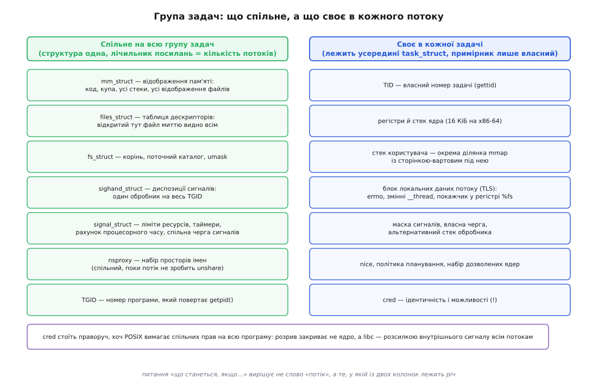
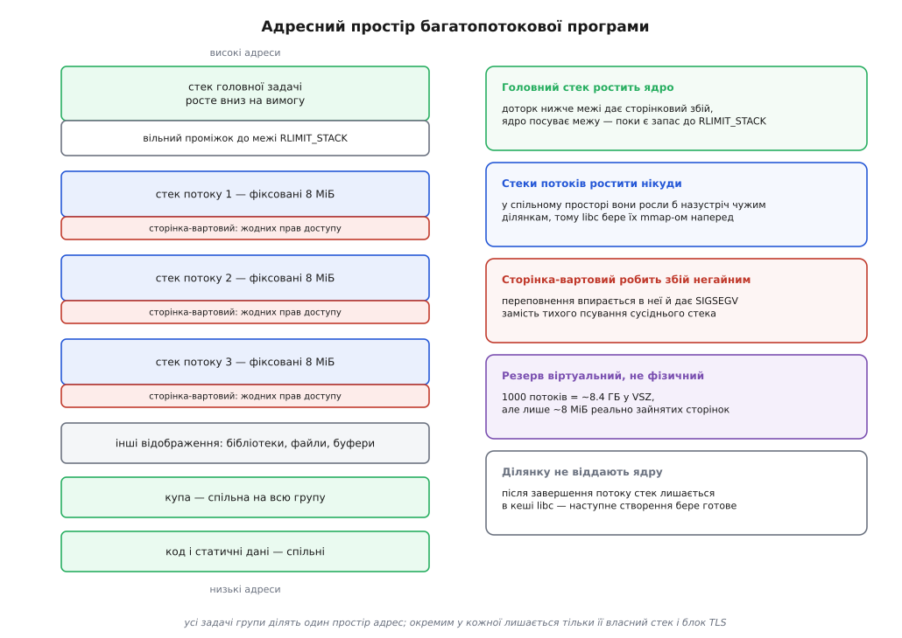
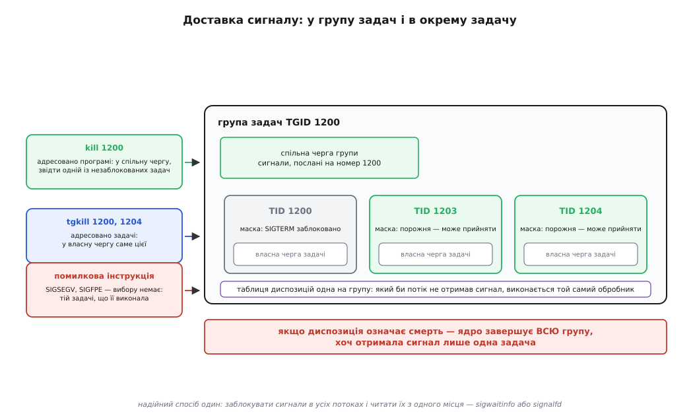

# Потоки в Linux: задача як одиниця планування

<preknowlist>
- [Віртуальна пам'ять](root:hw-arch/virtual-memory) — адреса в програмі не є адресою в мікросхемі: між ними стоїть таблиця перекладу, яку веде ядро.
- [Перемикання контексту](root:sf-os/context-switch) — щоб спинити виконання й потім продовжити, досить зберегти й відновити регістри процесора.
- [Сигнал: асинхронне сповіщення](root:sys-unix/signal-model) — що таке диспозиція сигналу, маска й доставка.
</preknowlist>

## Хто саме стоїть у черзі на процесор

Запустіть багатопотокову програму й подивіться на неї кількома командами. `ps -p 1200` покаже один рядок. `ps -p 1200 -L` покаже вісім рядків з тим самим номером 1200 у першій колонці й вісьмома різними номерами в другій. `kill 1200` завершить усі вісім разом. А `taskset -p -c 2 1203` прив'яже до ядра номер 2 рівно одну з них, не зачепивши решти.

Отже, вісім чогось усередині одного чогось: одні дії стосуються всієї купи, інші — окремої одиниці. Питання не в тому, як це називати, а в тому, **що з цих двох ядро вважає справжнім**. Бо ставити на процесор можна лише щось одне.

Відповідь видно з того самого досліду: прив'язати до ядра процесора можна окрему одиницю, а не купу. Планувальник тримає список **задач** (`task_struct`) — кожна зі своїм лічильником команд, своїм станом і своїм місцем у черзі. Купи в цьому списку немає взагалі. Купа існує в іншому місці: це набір задач, які домовилися вважатися одним цілим для решти системи.

Звідси й уся конструкція потоків у Linux. **Потік — це не половина процесу й не полегшена його версія. Потік — це звичайна задача, яку зв'язали з іншими задачами спільною ідентичністю.** Слово «потік» (англ. *thread* — нитка) описує саме нитку виконання; ядро цю нитку й планує, а те, що ми звемо процесом, — це вузол, у якому кілька ниток зв'язано докупи.

Далі все цікаве починається з питання, що саме означає «зв'язано» — бо перше очевидне припущення виявляється хибним.

## Спільна пам'ять — це ще не потік

Природно припустити, що потоки робить потоками спільна пам'ять. Перевірмо це припущення прямо.

Виклик `clone()` дозволяє створити задачу, яка користується тим самим відображенням пам'яті, що й батько — для цього є прапорець `CLONE_VM`. Нова задача бачить ті самі глобальні змінні за тими самими адресами; запис однієї миттю видно другій. Здавалося б, потік.

Але подивіться, що ця задача має, крім спільної пам'яті:

```
клон із CLONE_VM (і без інших прапорців):
  свій PID, окремий рядок у ps
  свого батька, якому при смерті прийде SIGCHLD
  його ж треба зібрати через wait() — інакше лишиться зомбі
  свої ліміти ресурсів і свій рахунок процесорного часу
  своя таблиця дескрипторів (файл, відкритий тут, там не видно)
```

Тобто пам'ять спільна, а **ідентичність окрема**. Для всієї решти системи це два різні процеси, які просто дивно поводяться з пам'яттю. Жоден інструмент не покаже їх як одну програму, `kill` по одному номеру не зачепить другого, а рахунок процесорного часу вестимуть окремо.

Отже, спільна пам'ять — необхідна властивість потоку, але не достатня. Бракує чогось іншого, і це інше не має жодного стосунку до того, хто які байти бачить.

## Що додає CLONE_THREAD

Бракує спільної **ідентичності** — і в ядрі за неї відповідає окремий прапорець, `CLONE_THREAD` (з ядра 2.4). Він не робить спільним ані байта пам'яті. Він робить дещо інше: заносить нову задачу в **групу задач** тієї, яка її створила.

Група задач — це і є те, що ззовні зветься процесом. У неї є номер — **TGID** (англ. *thread group identifier*, ідентифікатор групи задач). Саме його повертає `getpid()`, і саме він однаковий у всіх потоків; власний номер задачі видає `gettid()` (системний виклик існує з ядра 2.4.11, а обгортку в glibc додали аж у версії 2.30 — до того його викликали через `syscall()` вручну). У `/proc/<pid>/status` обидва номери стоять поруч: рядок `Tgid` — номер групи, рядок `Pid` — номер цієї задачі, рядок `Threads` — скільки їх у групі.

:::tabs
```c
#define _GNU_SOURCE
#include <pthread.h>
#include <stdio.h>
#include <unistd.h>
#include <sys/syscall.h>

static void *worker(void *arg)
{
    (void)arg;
    printf("потік:   getpid()=%d  gettid()=%ld\n",
           getpid(), (long)syscall(SYS_gettid));
    return NULL;
}

int main(void)
{
    pthread_t t;
    printf("головний: getpid()=%d  gettid()=%ld\n",
           getpid(), (long)syscall(SYS_gettid));
    pthread_create(&t, NULL, worker, NULL);
    pthread_join(t, NULL);
    return 0;
}
```
```cpp
#include <iostream>
#include <thread>
#include <unistd.h>
#include <sys/syscall.h>

int main()
{
    auto print_ids = [](const char *label) {
        std::cout << label << ": getpid()=" << getpid()
                  << "  gettid()=" << syscall(SYS_gettid) << '\n';
    };

    print_ids("головний");
    std::thread t([print_ids] { print_ids("потік"); });
    t.join();
}
```
:::

```
головний: getpid()=1200  gettid()=1200
потік:    getpid()=1200  gettid()=1203
```

Номер групи збігається з номером задачі, яка групу почала, — її звуть **лідером групи**. Ця збіжність не випадкова й не декоративна: саме тому в однопотоковій програмі `getpid()` і `gettid()` дають те саме число, і саме тому весь старий код, написаний до появи потоків, працює далі без жодної правки.

Разом зі спільним номером `CLONE_THREAD` приносить чотири наслідки, і кожен із них випливає з одного й того самого: **зовні група мусить виглядати як один суб'єкт**.

**Про кінець задачі нікому не повідомляють.** Коли задача з `CLONE_THREAD` завершується, тому, хто її створив, не приходить `SIGCHLD`, і зібрати її через `wait()` неможливо — з погляду батьківського процесу нічого не сталося, бо всередині чужої програми немає нічого, що його стосується. Батько дізнається про смерть лише тоді, коли піде остання задача групи.

**Рахунки спільні.** Ліміти ресурсів, лічильники спожитого процесорного часу, інтервальні таймери й черга нерозданих сигналів, адресованих програмі, лежать в одній структурі `signal_struct` на всю групу. Тому `ulimit` міняє межу для всієї програми, а не для потоку, і тому час у `times()` — сума по всіх задачах.

**Смерть спільна.** Системний виклик `exit` завершує одну задачу; щоб завершилася вся група, є окремий виклик — `exit_group` (з'явився в 2.5.35). Бібліотечні `exit()` і `_exit()` викликають саме його: коли програма каже «я закінчила», закінчують усі. Смертельний сигнал ядро теж перетворює на груповий вихід.

**Група не може розшаруватися по правах видимості.** `CLONE_THREAD` заборонено поєднувати з `CLONE_NEWPID` і `CLONE_NEWUSER`: новий потік не має права піти у власний простір номерів процесів чи власний простір користувачів. Інакше одна група задач опинилася б у двох різних світах — і питання «який номер у цієї програми» перестало б мати відповідь ([простори імен](root:sys-unix/namespaces)).

І ще одна вимога ядра, у якій видно всю логіку моделі: `CLONE_THREAD` можна вживати лише разом із `CLONE_SIGHAND` (з 2.5.35), а `CLONE_SIGHAND` — лише разом із `CLONE_VM` (з 2.6.0). Ланцюг тут строго причинний. Диспозиція сигналу — це або типова дія, або **адреса функції-обробника**. Адреса має сенс лише в конкретному відображенні пам'яті. Тож спільна таблиця обробників при різних відображеннях означала б стрибок за адресою, якої в цьому адресному просторі немає. А без спільної таблиці обробників група не може реагувати на сигнал як одне ціле — бо той самий `SIGTERM` викликав би різний код залежно від того, якій задачі його доправили. Тому три прапорці не є трьома незалежними опціями: два з них тримає перший.

> 🔧 **Навіщо це.** Розділення «пам'ять окремо, ідентичність окремо» — це не тонкість для читачів коду ядра, а те, що щодня видно в роботі. Витік в одному потоці з'їдає пам'ять усієї програми, бо `mm_struct` одна. `kill -9` по номеру програми вбиває всі потоки, бо смертельний сигнал завершує групу. Обмеження на кількість відкритих файлів вичерпується на всю програму, а не на потік, бо ліміти в `signal_struct`. І навпаки: підвищити пріоритет одному потоку можна, бо пріоритет живе в задачі. Кожне з цих правил не треба запам'ятовувати окремо — досить пам'ятати, у якій структурі річ лежить.



*Ліворуч — структури з лічильником посилань, на які вказують усі задачі групи: одна пам'ять, одна таблиця дескрипторів, одні обробники сигналів, один рахунок. Праворуч — те, що фізично лежить усередині `task_struct` і не існує в жодному примірнику, крім власного. Ідентичність (`cred`) стоїть праворуч, хоч POSIX вимагає лівої колонки, — саме тут модель ядра й прикладний стандарт розходяться.*

## Що в потоку лишається своїм

Перелік своїх речей задачі виводиться не з домовленості, а з питання «що зламається, якщо це стане спільним».

**Регістри й стек ядра.** Дві задачі виконують різні інструкції одночасно — отже, кожна мусить мати власний лічильник команд і власний набір регістрів. Плюс окремий стек усередині ядра (16 КіБ на x86-64), бо кожна задача може зайти в системний виклик і заснути там незалежно від сусідів.

**Стек користувача.** Тут ховається найбільша практична відмінність потоку від процесу. Стек головної задачі ядро вміє нарощувати на вимогу: доторкнулися нижче — стався сторінковий збій, ядро посунуло межу вниз, і так доти, доки не впреться в `RLIMIT_STACK`. Ростити в такий спосіб вісім стеків в одному адресному просторі неможливо: вони росли б назустріч чужим ділянкам. Тому стеки потоків нарощує не ядро — їх **виділяє бібліотека потоків** звичайним `mmap()`, наперед і фіксованого розміру ([mmap: файл і пам'ять як одне](root:sys-unix/mmap-model)).

Розмір за замовчуванням glibc бере з м'якого обмеження `RLIMIT_STACK`, яке діяло на момент запуску програми (типово 8 МіБ); якщо обмеження знято, береться архітектурний типовий розмір — 2 МіБ на більшості платформ, 4 МіБ на POWER і Sparc-64. Одразу під ділянкою кожного стека бібліотека лишає **сторінку-вартового** без жодних прав доступу. Це не деталь реалізації, а єдине, що відділяє переповнення стека від тихого псування сусідніх даних.

**Скільки віртуальної пам'яті займають самі лише стеки тисячі потоків:**

```
м'який RLIMIT_STACK        = 8 МіБ = 8 388 608 байтів
сторінка-вартовий          = 4 КіБ (одна сторінка)
на один потік              = 8 МіБ + 4 КіБ = 8 392 704 байтів

1000 потоків:
  віртуально зарезервовано = 1000 · 8 392 704 ≈ 8.39 ГБ
  реально зайнято          = сторінки, яких торкнулися:
                             ~2 сторінки на потік = 1000 · 8 КіБ ≈ 8 МіБ
```

Вісім гігабайтів у колонці VSZ і вісім мегабайтів у RSS — це той самий пул стеків, порахований двома різними способами ([як міряти пам'ять процесу](root:sys-unix/memory-accounting)). На 64-бітній машині адрес вистачає, і зарезервоване нічого не коштує; на 32-бітній ті самі вісім гігабайтів просто не вміщаються в адресний простір — звідси відома межа в кількасот потоків, яку знімали зменшенням розміру стека, а не додаванням пам'яті.



*Купа й код спільні на всю групу; стек головної задачі росте вниз на вимогу до межі RLIMIT_STACK, а стеки потоків виділені наперед серед відображень, кожен зі своєю сторінкою без прав доступу знизу. Переповнення стека потоку впирається в цю сторінку й дає негайний збій замість мовчазного псування чужих даних.*

**Власні глобальні змінні.** Пам'ять спільна, а `errno` в кожного потоку мусить бути своя — інакше два одночасні системні виклики затирали б код помилки один одному. Розв'язок: у процесора виділено регістр, який указує на **блок локальних даних потоку** (на x86-64 це `%fs`), а змінні, оголошені з `__thread` або `thread_local`, компілятор адресує не абсолютно, а як зсув від цього блоку. Виставляє регістр саме ядро при створенні задачі — за це відповідає прапорець `CLONE_SETTLS`. Тому `errno` в сучасній libc — не змінна, а макрос, що розкривається у виклик функції, яка бере адресу з блоку поточного потоку ([TLS в ELF: як потік дістає власні глобальні змінні](root:sys-unix/elf-tls)).

**Маска сигналів і власна черга.** Диспозиція спільна, а те, які сигнали зараз заблоковано, — властивість задачі. Так само окремі: черга сигналів, адресованих саме цій задачі, і альтернативний стек для обробника. Новий потік успадковує копію маски того, хто його створив, але не успадковує ані нерозданих сигналів, ані альтернативного стека.

**Пріоритет, політика й спорідненість із ядрами.** Тут Linux свідомо розходиться з POSIX. За стандартом значення `nice` — властивість процесу; у Linux це властивість задачі, і різні потоки однієї програми можуть мати різні `nice`, різні політики планування й різні маски дозволених ядер процесора ([пріоритети, nice і реальночасові класи](root:sys-unix/priority-nice-realtime)). Розходження не випадкове: одиницею планування є задача, тож усе, що описує «як саме планувати», мусить лежати там, де ця одиниця.

**Ідентичність.** А ось цей пункт — найцікавіший, бо тут модель ядра просвічує назовні як явна незручність. Структура `cred` з номерами користувача, груп і набором можливостей належить **задачі**, а не групі. Отже, `setuid()` на рівні ядра міняє права одного потоку. POSIX же вимагає, щоб права були спільні на всю програму — інакше половина уявлень про безпеку розсипається.

Розрив закриває не ядро, а бібліотека. glibc веде власний список створених нею потоків і тримає в кожному зарезервований обробник сигналу, який прикладний код не може ані перехопити, ані заблокувати. Коли програма кличе `setuid()`, glibc складає опис потрібної зміни й розсилає цей внутрішній сигнал (`SIGSETXID`) усім потокам списку; кожен у своєму обробнику робить справжній системний виклик для себе. Тобто звична однорядкова зміна прав насправді є маленькою розсилкою з очікуванням підтверджень ([setuid, setgid і підвищення прав](root:sys-unix/setuid-and-privilege)).

Наслідок для того, хто пише код у обхід libc: створивши задачу прямим викликом `clone()`, ви лишаєте її поза цим списком — і зміна прав її просто не зачепить.

Повний перелік того, що якому системному викликові підпорядковано — задача це чи вся група, — зібрано окремо: [що діє на потік, а що на всю програму](root:sys-unix/threads-as-tasks/api-per-thread-scope.md). Там же видно найпідступніші пари, де назва виклику натякає на процес, а діє він на задачу.

## Сигнали: одна диспозиція, багато масок

Розділення «диспозиція спільна, маска своя» задає всю механіку доставки, і без неї сигнали в багатопотоковій програмі виглядають випадковими.

Сигнал буває **адресований програмі** або **адресований задачі**. `kill(1200, SIGTERM)` адресує програмі; `pthread_kill()` і його системна основа `tgkill()` адресують конкретній задачі всередині названої групи.

Сигнал, адресований задачі, лягає в її власну чергу й чекає, поки саме вона його розмаскує. Сигнал, адресований програмі, лягає в спільну чергу групи — і ядро доправляє його **будь-якій одній задачі, яка цей сигнал не заблокувала**. Не всім і не наперед визначеній — одній із тих, хто готовий прийняти. Порядок вибору ядро визначає саме, це деталь реалізації, і покладатися на неї не можна.

Звідси єдиний надійний спосіб працювати з сигналами в багатопотоковій програмі: заблокувати потрібні сигнали в кожному потоці ще до створення робочих потоків (маска успадковується), а потім читати їх з одного місця — виділеною задачею через `sigwaitinfo()` або дескриптором `signalfd` ([маскування сигналів і signalfd](root:sys-unix/signal-mask-signalfd)). Тоді питання «кому дістанеться» не виникає взагалі: нема кому, крім одного читача.

Окремо стоять сигнали, породжені самою інструкцією: `SIGSEGV` від звертання за невідображеною адресою, `SIGFPE` від ділення на нуль. Їх ядро доправляє **тій задачі, яка виконала інструкцію**, — вибору тут немає. Але якщо диспозиція типова, а типова дія — завершення, гине вся група: смертельний сигнал завжди означає груповий вихід. Ось чому падіння одного потоку валить усю програму, хоч зачепив помилковий покажчик лише його.



*Сигнал, посланий на номер програми, потрапляє в спільну чергу — ядро віддає його одній із задач, що не тримають його заблокованим. Сигнал від `pthread_kill` чи від помилкової інструкції потрапляє в чергу конкретної задачі. Обробник в обох випадках той самий, бо таблиця диспозицій одна; а якщо диспозиція означає смерть — завершується вся група незалежно від того, хто отримав.*

## Народження, приєднання і смерть

Тепер, коли видно, що саме робить кожен прапорець, `pthread_create()` перестає бути магією. Це виклик `clone3()` (раніше `clone()`) з набором бітів: `CLONE_VM | CLONE_FS | CLONE_FILES | CLONE_SIGHAND | CLONE_THREAD | CLONE_SETTLS | CLONE_PARENT_SETTID | CLONE_CHILD_CLEARTID | CLONE_SYSVSEM`. Ядро не має окремого виклику «створи потік» — і не потребує його.

Але робота бібліотеки цим не вичерпується, і решта пояснює, у чому саме створення потоку дешевше за створення процесу. Перед викликом бібліотека `mmap()`-ом бере ділянку під стек, закриває нижню сторінку від доступу, розкладає на вершині ділянки блок локальних даних потоку разом зі службовою структурою — і саме її адресу потім повертає `pthread_self()`. Після завершення потоку ділянку не віддають ядру, а кладуть у власний кеш стеків: наступне створення бере готове.

Дорога частина створення процесу — побудова нового відображення пам'яті: скопіювати таблиці сторінок батька, розставити позначки «тільки для читання» для копіювання при записі ([копіювання при записі](root:sf-os/copy-on-write)). При `CLONE_VM` цієї роботи немає взагалі: нова задача бере вказівник на наявну `mm_struct` і збільшує лічильник посилань. Лишається виділити `task_struct`, стек ядра й номер. Тому різниця в ціні росте разом із розміром адресного простору батька: чим більша програма, тим дорожче їй розгалузитися через `fork()` — а ціна ще однієї нитки не міняється взагалі.

**Приєднання** зроблено так само поза ядром. `wait()` для потоку не існує — ми бачили чому: батькові ніхто не сповіщає про смерть задачі всередині групи. Замість цього працює пара прапорців. `CLONE_CHILD_CLEARTID` каже ядру: коли задача помре, обнули ось це слово в пам'яті й розбуди всіх, хто на ньому чекає. Бібліотека кладе туди номер задачі, а `pthread_join()` просто чекає на цій адресі механізмом дешевого очікування — futex (від англ. *fast userspace mutex*, швидкий м'ютекс простору користувача), який дозволяє чекати на слові в пам'яті, не заходячи в ядро, поки нема потреби ([eventfd і futex](root:sys-unix/eventfd-and-futex)). Так само працюють і м'ютекси з умовними змінними: у безконфліктному випадку жодного системного виклику взагалі не відбувається.

Відокремлений (`detached`) потік відрізняється лише тим, що на його слово-номер ніхто не чекає, а стек повертається в кеш одразу після завершення.

**Смерть** має два різні виклики, і плутати їх дорого. `pthread_exit()` веде до системного виклику `exit` — гине одна задача. Повернення з `main()` чи виклик `exit()` веде до `exit_group` — гине вся група. Через це існує зовні дивна ситуація: якщо головна задача викличе `pthread_exit()`, програма далі житиме на решті потоків, а лідер групи лишиться **порожнім записом у стані зомбі**. Ядро свідомо не прибирає лідера, поки жива хоч одна задача групи: його номер є номером усієї програми, і віддати цей номер на перевикористання, поки програма працює, було б катастрофою. Тому в `ps` така програма показує стан `Z`, хоч сама жива й цілком працездатна ([завершення, wait і зомбі](root:sys-unix/exit-wait-zombies)).

Ще один випадок із тієї ж логіки: `execve()` в багатопотоковій програмі. Заміна образу лишає ідентичність на місці, тож група мусить пережити її як ціле — і ядро завершує всі задачі, крім тієї, що викликала; вона ж стає лідером групи й дістає її номер, навіть якщо доти лідером не була ([exec: заміна образу](root:sys-unix/exec-semantics)).

Історія того, як усе це складалося, варта окремої розповіді: до 2003 року Linux мав зовсім іншу реалізацію потоків, де кожен потік був повноцінним процесом з окремим номером, а всередині програми жив службовий потік-керівник, і саме її незручності змусили переробити ядро — [від LinuxThreads до NPTL](root:sys-unix/threads-as-tasks/hist-linuxthreads-to-nptl.md).

## fork у багатопотоковій програмі

З того, що `fork()` копіює **задачу**, а не групу, випливає найгостріша пастка всієї моделі.

Дитина дістає копію всього адресного простору — з усіма даними всіх потоків. Але задача в ній одна: та, що викликала `fork()`. Решта потоків у дитині не існує.

Тепер уявіть, що в мить виклику інший потік тримав захоплений м'ютекс усередині алокатора пам'яті. У дитині цей м'ютекс скопіювався **захопленим**, а задачі, яка мала його відпустити, у дитини немає. Перший же `malloc()` у дитині повисне назавжди, і жодна діагностика не покаже причини: замок цілий, власник — номер задачі, якої нема.

Тому POSIX дозволяє дитині багатопотокової програми лише те, що дозволено робити в обробнику сигналу, — виклики з переліку асинхронно-сигнально-безпечних, — і робити це рівно до `execve()` ([що взагалі можна робити в обробнику сигналу](root:sys-unix/async-signal-safety)). Схема «розгалузився — переставив дескриптори — замінив образ» цієї вимоги не порушує, бо між двома викликами не робиться нічого складнішого за `dup2()`. Схема «розгалузився й далі спокійно працюю копією» в багатопотоковій програмі не працює.

Часткову латку дає `pthread_atfork()`: він реєструє три дії — перед розгалуженням захопити відомі бібліотеці замки, після нього відпустити їх у батька й у дитини. Латка часткова, бо охоплює лише ті замки, про які їй сказали; замки чужих бібліотек лишаються в тому стані, у якому їх застали. Саме тому в багатопотоковій програмі надійніший `posix_spawn()`, який не пропонує проміжку між розгалуженням і заміною образу ([vfork, posix_spawn і clone](root:sys-unix/spawn-alternatives)).

## Чому перемикання дешевше, а потік не «легший»

Фраза «потоки легші за процеси» правдива в наслідку й хибна в поясненні. `task_struct` у потоку й у процесу однакова, стек ядра однаковий, місце в черзі планувальника однакове. Легшого виду істот у ядрі не існує.

Дешевшою є конкретна операція — **перемикання між двома задачами, що ділять `mm_struct`**. Коли планувальник переходить від задачі до задачі, він завжди зберігає й відновлює регістри. Але якщо наступна задача має інше відображення пам'яті, доводиться додатково перемкнути регістр таблиці сторінок, а це знецінює накопичений апаратний переклад адрес у кеші перекладів (TLB). Якщо ж відображення те саме, цього кроку просто немає: переклад лишається чинним, і жоден рядок кешу перекладів не пропадає марно. Сучасні процесори пом'якшують і перший випадок, позначаючи записи кешу номером адресного простору, тож повного скидання зазвичай не відбувається — але робота з перемикання таблиць лишається.

Друга половина «легкості» — створення, і про неї сказано вище: без копіювання таблиць сторінок.

А от у чому потік не легший узагалі — це в плануванні. Планувальник бачить стільки претендентів, скільки є задач. Програма з вісьмома потоками змагається за процесор увісьмеро наполегливіше за однопотокову — не тому, що вона важливіша, а тому, що чесність планувальника означає чесність щодо задач ([планувальник: як ядро ділить час](root:sys-unix/scheduler-model)). Щоб чесність стосувалася програм чи користувачів, задачі треба зібрати в групи — цим займаються [cgroups](root:sys-unix/cgroups-resource-model) і ввімкнене типово автогрупування за сеансами терміналу.

З тієї самої причини облік процесорного часу дає числа, які лякають при першій зустрічі.

**Вісім потоків працюють десять секунд реального часу на чотириядерній машині, завантажуючи всі ядра:**

```
реальний час               = 10 с
доступний процесорний час  = 10 с · 4 ядра = 40 с
спожито (сума по задачах)  ≈ 40 с

top показує завантаження   = 40 с / 10 с = 400 %
кожна з 8 задач отримала   ≈ 40 с / 8 = 5 с ⇒ по 50 % одного ядра
```

Число понад 100 % тут не помилка й не «перевантаження»: це сума по восьми одиницях, поділена на реальний час ([облік процесорного часу](root:sys-unix/cpu-time-accounting)). А `top -H` розкладе ті самі 400 % на вісім рядків по 50 %.

## Де фікція протікає назовні

Група задач — домовленість, і кожен інструмент вирішує, показувати домовленість чи те, що під нею.

Показують домовленість: `ps` без ключів, `top` без ключів, `kill`, `/proc/<pid>/` верхнього рівня. Показують задачі: `ps -eLf`, `top -H`, `htop` з увімкненим показом потоків і, найчесніше, каталог `/proc/<pid>/task/` — у ньому підкаталог на кожну задачу групи, і в кожному свій `status`, свій `stat`, своя маска дозволених ядер, свій стан ([/proc: процеси як файли](root:sys-unix/proc-reading-process-and-kernel-state)). Питання «у якому стані процес» коректної відповіді не має: один потік може годинами висіти в непереривному сні на пристрої, поки решта рахують ([стани процесу](root:sys-unix/process-states)).

Ту саму подвійність видно й в інтерфейсах нижчого рівня. `getrusage()` бере аргумент `RUSAGE_SELF` — сума по всій групі — або `RUSAGE_THREAD` (з ядра 2.6.26) — рахунок однієї задачі. У cgroups другої версії задачі приписуються до груп **процесами**: усі потоки програми потрапляють в одну групу, і це свідоме рішення, бо інакше обмеження пам'яті довелося б ділити всередині спільного адресного простору. Але для тих контролерів, де поділ на потоки має сенс (процесорний час, набір ядер), передбачено окремий «нитковий» режим піддерева, у якому в групу приписують уже окремі задачі.

Практичний висновок з усього цього один, і він не про назви. Коли постає питання «а що станеться, якщо…», відповідь шукають не в тому, потік це чи процес, а в тому, **де лежить те, про що йдеться**: у структурі зі спільним лічильником посилань чи всередині самої задачі. Спільна структура — річ спільна на всю програму. Поле в `task_struct` — річ окрема в кожної нитки. Усе інше, включно з назвами, — наслідки.

Розібрати це на дотик — прочитати номери, знайти власні стеки й блоки локальних даних, подивитися, кому дістався сигнал, — можна на невеликій програмі, зібраній саме для такого досліду: [анатомія потоку зсередини](root:sys-unix/threads-as-tasks/proj-thread-anatomy.md).
