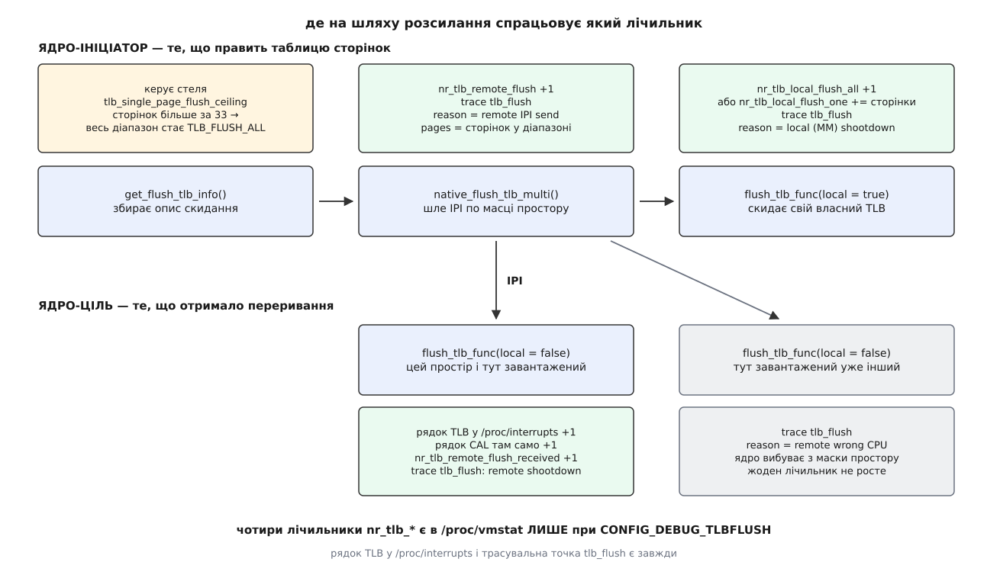

# 📋 Чим міряють і чим керують розсилання скидань TLB

Це повний перелік місць, де Linux **показує** розсилання скидань TLB і де дозволяє на них **вплинути**: кожен лічильник — із точною назвою, точкою на шляху розсилання, одиницею виміру й умовою збірки, без якої його просто немає. Числа, назви й межі звірено з чинним деревом ядра (`arch/x86/mm/tlb.c`, `arch/x86/kernel/irq.c`, `arch/x86/kernel/kvm.c`, `arch/x86/kernel/cpu/common.c`, `arch/x86/Kconfig.cpu`, `include/trace/events/tlb.h`, `include/linux/vm_event_item.h`, `mm/vmstat.c`).

Найдорожча помилка в читанні цих чисел одна: вирішити, що всі вони міряють ту саму подію. Не міряють. Одні рахують операції, інші — сторінки; одні ростуть на тому ядрі процесора, яке **послало** скидання, інші — лише на тих, що його **отримали**. Тому кожне число тут спершу прив'язане до точки на шляху, і аж потім витлумачене.

## Де на шляху що спрацьовує



*Функція `flush_tlb_func` та сама на обох боках; розводить їх ознака `local`, яку вона обчислює як «чи я те ядро, що почало розсилання». Уся асиметрія лічильників — наслідок однієї цієї перевірки.*

| Точка шляху | Що росте | Одиниця |
|---|---|---|
| збирання опису скидання, `get_flush_tlb_info()` | нічого; тут діє **стеля** `tlb_single_page_flush_ceiling` | — |
| надсилання, `native_flush_tlb_multi()` | `nr_tlb_remote_flush`; трасування з причиною «remote IPI send» | одне розсилання |
| локальна частина, `flush_tlb_func(local = true)` | `nr_tlb_local_flush_all` **або** `nr_tlb_local_flush_one` | операція / **сторінки** |
| прибуття на ціль, `flush_tlb_func(local = false)` | рядок `TLB` у `/proc/interrupts`, `nr_tlb_remote_flush_received` | одне прибуття |
| ціль із чужим простором | лише трасування «remote wrong CPU» | — |

Найпідступніший рядок тут третій: **на цілі локальні лічильники не ростуть узагалі**. Робота, яку зробило чуже ядро процесора, у `nr_tlb_local_flush_*` не потрапляє — там лише те, що ініціатор зробив зі своїм власним TLB.

## /proc/interrupts: рядок TLB

| Властивість | Значення |
|---|---|
| шлях | `/proc/interrupts` (усі колонки — ядра процесора) |
| позначка | `TLB`, підпис `TLB shootdowns` |
| що рахує | скільки разів це ядро **отримало** чуже розсилання й зайшло в обробник |
| де рахується | `inc_irq_stat(TLB)` усередині `flush_tlb_func` під умовою `if (!local)` |
| доступ | читає будь-хто |

Головне про цей рядок: він **не є лічильником окремого вектора переривання**. Це програмний лічильник, який збільшує сама функція скидання. Апаратно розсилання їде звичайним вектором [міжпроцесорного переривання](root:sys-unix/inter-processor-interrupts) для виклику функцій — тим, яким одне ядро процесора змушує інше негайно виконати вказаний код, і який рахує сусідній рядок `CAL` (`Function call interrupts`). Тому одне прибуле скидання додає одиницю **обом** рядкам одразу.

```sh
$ grep -E '^ *(CAL|TLB):' /proc/interrupts
CAL:  1837262  1792044  1811930  1798118   Function call interrupts
TLB:   273905   271118   274612   269553   TLB shootdowns
```

Дві прості речі, які видно тільки звідси. Перша — **розподіл по ядрах**: якщо одна колонка втричі більша за сусідні, то саме той процесор тримає простір, який хтось безперервно перебудовує. Друга — **різниця `CAL − TLB`**: це решта користувачів того самого механізму виклику функцій між ядрами — злив посторінкових кешів під тиском на пам'ять, узгодження стану в підсистемах ядра. Коли `TLB` становить більшу частину `CAL`, міжпроцесорний трафік машини — це переважно скидання.

Абсолютні числа тут ні про що не говорять, бо лічильник росте від завантаження. Міряти треба швидкість:

```sh
# приріст за 10 секунд по всіх ядрах
a=$(awk '/^ *TLB:/{for(i=2;i<=NF-2;i++)s+=$i}END{print s+0}' /proc/interrupts)
sleep 10
b=$(awk '/^ *TLB:/{for(i=2;i<=NF-2;i++)s+=$i}END{print s+0}' /proc/interrupts)
echo "$(( (b-a)/10 )) прибулих скидань за секунду"
```

> 🔧 **Навіщо це.** Рядок `TLB` — єдиний з усіх лічильників тут, який є на **будь-якому** ядрі x86 без спеціальної збірки. Якщо треба швидко відповісти «чи взагалі ця машина страждає від розсилань», починають саме з нього: усе інше може бути вимкнене на етапі збірки, а цей рядок є завжди.

## /proc/vmstat: чотири лічильники

Це системні суми, які показує [псевдофайлова система](root:sys-unix/pseudo-filesystems), де ядро віддає свої числа під виглядом звичайних файлів.

| Назва в `/proc/vmstat` | Де росте | Що рахує | Одиниця |
|---|---|---|---|
| `nr_tlb_remote_flush` | ініціатор, `native_flush_tlb_multi()` | розсилання, які це ядро **почало** | операція |
| `nr_tlb_remote_flush_received` | кожна ціль, `flush_tlb_func(!local)` | скидання, які **прибули** | прибуття |
| `nr_tlb_local_flush_all` | лише ініціатор | повних скидань свого TLB | операція |
| `nr_tlb_local_flush_one` | лише ініціатор | точкових знеправлень | **сторінки** |

⚠️ **Цих рядків у `/proc/vmstat` типово немає.** Усі чотири оголошені в `include/linux/vm_event_item.h` під `#ifdef CONFIG_DEBUG_TLBFLUSH`, а цей символ залежить від `CONFIG_DEBUG_KERNEL` і має підказку «якщо сумніваєтесь — N». Дистрибутивні ядра його не вмикають. Такий символ вирішується під час [збірки ядра](root:sys-unix/kernel-config-and-build), і жодним записом у файл його вже не додати — тож перевіряти треба перше, ще до того, як шукати самі рядки:

```sh
grep -E 'CONFIG_DEBUG_TLBFLUSH' /boot/config-"$(uname -r)" || zcat /proc/config.gz | grep DEBUG_TLBFLUSH
grep -c nr_tlb_ /proc/vmstat     # 0 → ядро зібране без цієї опції
```

Довідка самого `CONFIG_DEBUG_TLBFLUSH` у `arch/x86/Kconfig.debug` застаріла: вона й досі описує ручку `tlb_flushall_shift` із формулою на степенях двійки, якої в чинному ядрі немає. Читати її як опис поведінки не варто — опція нині лише додає лічильники.

### Як читати їх парами

```
цілей на одне розсилання:
    nr_tlb_remote_flush_received ÷ nr_tlb_remote_flush

  1638442 ÷ 284119 = 5.77

розсилань і прибуттів за секунду (приріст за 60 с):
    284119 ÷ 60 =   4 735 розсилань/с
   1638442 ÷ 60 =  27 307 прибуттів/с
```

Перше відношення — те саме число, яке визначає ціну: **скільки чужих ядер процесора в середньому чекає ініціатор**. Воно зростає не від навантаження на пам'ять, а від того, по скількох ядрах розкидані потоки одного простору. Тому саме його дивляться після [прив'язки задач до ядер](root:sys-unix/cpu-affinity), яка звужує маску простору: відношення мусить впасти.

Друга пара — `nr_tlb_local_flush_all` проти `nr_tlb_local_flush_one` — читається обережніше, бо **числа в них різних одиниць**. Перший додає одиницю за операцію повного скидання; другий додає **стільки, скільки сторінок** щойно знеправив (`count_vm_tlb_events(NR_TLB_LOCAL_FLUSH_ONE, nr_invalidate)`). Ділити одне на одне безглуздо. Що з них справді видно:

```
сторінок, знеправлених точково:      nr_tlb_local_flush_one
повних скидань:                      nr_tlb_local_flush_all
сумарна ціна точкових знеправлень ≈  nr_tlb_local_flush_one · 100 нс
```

Скільки було **операцій** із діапазоном, `/proc/vmstat` не каже взагалі — такого лічильника немає. Середній розмір діапазону дістають лише з трасувальної точки, у якої є поле `pages`.

Ще одне співвідношення варто тримати в голові: кожне розсилання скидає й TLB самого ініціатора, і ця локальна частина йде саме в локальні лічильники. Тому `nr_tlb_local_flush_all` уже містить у собі частину того, що порахував `nr_tlb_remote_flush`, — це не два незалежні числа.

## Трасувальна точка tlb:tlb_flush

| Властивість | Значення |
|---|---|
| повна назва | `tlb:tlb_flush` |
| оголошення | `include/trace/events/tlb.h` |
| поля | `reason` (`int`), `pages` (`unsigned long`) |
| формат друку | `pages:%ld reason:%s (%d)` |
| умова | тільки `CONFIG_TRACEPOINTS` — **не** потребує `DEBUG_TLBFLUSH` |

Це найточніший з усіх інструментів тут: він єдиний дає **причину** кожного скидання й **розмір** діапазону, а працює на звичайному дистрибутивному ядрі. Значення `pages` для повного скидання — `TLB_FLUSH_ALL`, тобто `-1UL`, і друкується воно як `pages:-1`.

| `reason` | Назва в ядрі | Рядок у трасі | Коли |
|---|---|---|---|
| 0 | `TLB_FLUSH_ON_TASK_SWITCH` | `flush on task switch` | перемикання на інший простір |
| 1 | `TLB_REMOTE_SHOOTDOWN` | `remote shootdown` | **на цілі**: прибуле чуже скидання |
| 2 | `TLB_LOCAL_SHOOTDOWN` | `local shootdown` | на ініціаторі, без прив'язки до простору |
| 3 | `TLB_LOCAL_MM_SHOOTDOWN` | `local MM shootdown` | на ініціаторі, для конкретного простору |
| 4 | `TLB_REMOTE_SEND_IPI` | `remote IPI send` | **на ініціаторі**: розсилання щойно пішло |
| 5 | `TLB_REMOTE_WRONG_CPU` | `remote wrong CPU` | ціль уже перемкнулася, скидати нічого |

Число в дужках — це позиція в `enum tlb_flush_reason`, тож фільтрувати можна й за ним. Пара, яку дивляться найчастіше, — 4 і 1: перша каже, скільки розсилань пішло й якого розміру, друга — скільки прибуло. Причина 5 варта окремої уваги: коли її багато, маска простору не встигає звужуватися, і ядро витрачає переривання даремно.

Керують точкою через [ftrace і трасувальні точки](root:sys-unix/ftrace-kernel-tracing) — вбудовані місця зачеплення в коді ядра, які вмикають і фільтрують записом у файли:

```sh
cd /sys/kernel/tracing            # на старих системах /sys/kernel/debug/tracing

# 1. Увімкнути точку й подивитися потік
echo 1 > events/tlb/tlb_flush/enable
cat trace_pipe
#  munmap-4821  [017] .... 91231.442: tlb_flush: pages:33 reason:remote IPI send (4)
#  <idle>-0     [042] d.h. 91231.442: tlb_flush: pages:33 reason:remote shootdown (1)

# 2. Лише розсилання (обидва боки), решту відсіяти
echo 'reason == 1 || reason == 4' > events/tlb/tlb_flush/filter

# 3. Гістограма розмірів діапазону — ось звідки видно, чи впирається він у стелю
echo 'hist:key=pages.log2:val=hitcount' > events/tlb/tlb_flush/trigger
cat events/tlb/tlb_flush/hist

# 4. Прибрати за собою
echo 0 > events/tlb/tlb_flush/enable
echo '!hist:key=pages.log2' > events/tlb/tlb_flush/trigger
echo 0 > events/tlb/tlb_flush/filter
```

Те саме через [підсистему perf](root:sys-unix/perf-events), яка вміє рахувати ті самі події й зшивати їх зі стеками:

```sh
perf stat -a -e tlb:tlb_flush -- sleep 10          # скільки їх усього
perf record -a -g -e tlb:tlb_flush -- sleep 10     # хто саме розсилає
perf report --sort comm,sym

# хто чекає — уже не подія, а профіль гарячих функцій
perf record -a -g -e cycles -- sleep 10
perf report | grep -E 'flush_tlb_mm_range|smp_call_function_many|__tlbsync'
```

## Стеля: /sys/kernel/debug/x86/tlb_single_page_flush_ceiling

| Властивість | Значення |
|---|---|
| шлях | `/sys/kernel/debug/x86/tlb_single_page_flush_ceiling` |
| режим доступу | `0600` — читати й писати лише root |
| типове значення | `33` |
| розбір запису | `kstrtoint_from_user(..., 0, ...)` — база визначається сама, тож `0x21` теж пройде |
| від'ємне | `-EINVAL`, тихого обрізання немає |
| архітектура | лише x86; на інших архітектурах файла немає |
| потрібно | `CONFIG_DEBUG_FS` і змонтований debugfs |

Правило, за яким ядро вибирає між точковим знеправленням і повним скиданням, — один рядок у `get_flush_tlb_info()`, і читати його треба буквально:

```
(end − start) >> stride_shift > tlb_single_page_flush_ceiling
    → start = 0; end = TLB_FLUSH_ALL
```

Три висновки з цього рядка, які легко проґавити.

**Порівняння строге.** Рівно 33 одиниці ще йдуть точково; 34 вже перетворюються на повне скидання.

**Одиниця — крок, а не сторінка.** Зсув `stride_shift` для звичайних сторінок дорівнює 12, а для [великих сторінок](root:sys-unix/huge-pages-tlb-reach) — 21. Тобто на діапазоні з великих сторінок стеля рахує саме великі сторінки, і 33 з них — це 66 МіБ, а не 132 КіБ.

**Рішення ухвалює ініціатор, і воно вже вшите в опис скидання.** Ціль отримує готове `TLB_FLUSH_ALL` і не переграє його: стеля цільового ядра ні на що не впливає.

| Значення | Поведінка |
|---|---|
| `0` | будь-який діапазон (навіть в одну сторінку) стає повним скиданням |
| `1` | точково знеправляється лише діапазон рівно в одну одиницю |
| `33` | типове |
| велике число | точкове знеправлення завжди, повного скидання за розміром не буде ніколи |

```sh
mountpoint -q /sys/kernel/debug || sudo mount -t debugfs none /sys/kernel/debug
sudo cat /sys/kernel/debug/x86/tlb_single_page_flush_ceiling      # 33
echo 1 | sudo tee /sys/kernel/debug/x86/tlb_single_page_flush_ceiling
```

Значення не переживає перезавантаження й не має ні сисктла, ні параметра завантаження — це ручка для вимірювання, а не для налаштування. Крайні значення саме тому й корисні: `0` і величезне число дають дві протилежні межі, між якими лежить справжня ціна на вашому навантаженні.

## Ознаки процесора й параметри завантаження

Мітки контексту (PCID) — те, що дозволяє ядру не скидати TLB при кожному перемиканні простору. Питає про них [CPUID](root:hw-arch/cpuid) — інструкція, якою програма з'ясовує можливості процесора; ядро вже перепитало на старті й виклало відповідь у `/proc/cpuinfo`.

| Прапорець у `/proc/cpuinfo` | Що означає | Звідки |
|---|---|---|
| `pcid` | процесор уміє мітки контексту | CPUID листок 1, ECX біт 17 |
| `invpcid` | є `INVPCID` — знеправлення за міткою, у тому числі чужою | CPUID листок 7, EBX біт 10 |
| `pti` | увімкнено [ізоляцію таблиць ядра](root:sys-unix/kernel-page-table-isolation), яка забирає собі один біт із простору міток | синтетичний прапорець ядра |
| **немає** | `INVLPGB` (апаратне розсилання від AMD) у `/proc/cpuinfo` **не показується**: `X86_FEATURE_INVLPGB` оголошений без рядкової назви | CPUID листок `0x8000_0008`, EBX біт 3 |

```sh
grep -o -E '\b(pcid|invpcid|pti)\b' /proc/cpuinfo | sort -u
```

Параметри командного рядка ядра — про те, як [завантажувач](root:sys-unix/bootloader-and-cmdline) передає ядру рядок налаштувань на старті:

| Параметр | Дія | Що друкує в `dmesg` |
|---|---|---|
| `nopcid` | знімає `X86_FEATURE_PCID`; **лише 64-бітне x86** | `nopcid: PCID feature disabled` |
| `noinvpcid` | знімає `X86_FEATURE_INVPCID`, `PCID` лишається | `noinvpcid: INVPCID feature disabled` |
| `nopti`, `pti=off` | вимикає ізоляцію таблиць — звільняє біт у просторі міток | рядок про стан пом'якшення |
| `clearcpuid=<номер>` | загальний молот: зняти будь-який прапорець за номером | попередження про непідтримуваний режим |

Обидва перші — `early_param` **без аргументу**. Написати `nopcid=1` не вийде: обробник повертає `-EINVAL`. І обидва мовчать, якщо самої можливості на процесорі немає, — відсутність рядка в `dmesg` не означає, що параметр не спрацював.

Ефект від `nopcid` різкий і легко неправильно витлумачений. Без міток кожне перемикання на інший простір стає повним скиданням TLB, і на ядрі з увімкненою ізоляцією таблиць таким стає ще й кожен вхід у ядро. Кількість **розсилань** при цьому не зміниться — зміниться ціна всього іншого. Тому `nopcid` придатний тільки як контрольний вимір, і ніколи як налаштування.

## Апаратне розсилання: INVLPGB і глобальні мітки

| Властивість | Значення |
|---|---|
| символ збірки | `CONFIG_BROADCAST_TLB_FLUSH` |
| оголошення | `arch/x86/Kconfig.cpu`: `def_bool y`, `depends on CPU_SUP_AMD && 64BIT` |
| умова роботи | процесор має `X86_FEATURE_INVLPGB` |
| поріг видачі мітки | простір активний **на 4 і більше ядрах одночасно** (`mm_active_cpus_exceeds(mm, 3)`) |
| частота перевірки | рідко: `(current->pid & 0x1f) != (jiffies & 0x1f)` — приблизно раз на 32 нагоди |
| скільки міток | уся місткість PCID мінус шість динамічних (`TLB_NR_DYN_ASIDS`) і одна службова |

Механіка проста на вигляд і вимоглива по суті. Щоб розсилати знеправлення за міткою, простір мусить мати мітку, **однакову на всіх ядрах машини**, — а звичайні мітки кожне ядро процесора роздає свої власні, по шість (`TLB_NR_DYN_ASIDS`), і той самий простір має на різних ядрах різні номери. Тому глобальна мітка — дефіцит, і видають її лише тим процесам, які того варті: багатопотоковим і справді розкиданим. Решта й далі платить перериваннями.

Прямої ознаки «цей процес дістав глобальну мітку» назовні немає, тож судять за формою потоку подій:

```sh
# 1. Чи є взагалі підтримка в ядрі й у процесорі
grep BROADCAST_TLB /boot/config-"$(uname -r)"
grep -m1 vendor_id /proc/cpuinfo         # має бути AuthenticAMD

# 2. Ознака в дії: навантаження безперервно править таблиці,
#    а подій і переривань при цьому майже немає
perf stat -a -e tlb:tlb_flush -- sleep 10
grep -E '^ *TLB:' /proc/interrupts       # два знімки з інтервалом
```

Річ у тім, що гілка `broadcast_tlb_flush()` не проходить через `native_flush_tlb_multi()` зовсім — а всі лічильники й обидві трасувальні причини розсилання живуть саме там. Коли простір перейшов на апаратне розсилання, для нього замовкає все одразу: і `TLB_REMOTE_SEND_IPI`, і `TLB_REMOTE_SHOOTDOWN`, і рядок `TLB`, і всі чотири `nr_tlb_*`. Порожні лічильники при живому навантаженні на AMD — це не «розсилань немає», а «розсилання пішли повз переривання».

Ще одна ручка з тієї ж механіки, але без файла: маска простору звужується не безперервно, а **не частіше ніж раз на секунду** на кожен простір (`should_trim_cpumask()` порівнює `jiffies` з позначкою `next_trim_cpumask`, крок — `HZ`). Тому після того, як потоки перестали блукати по машині, кількість цілей падає не миттєво.

## Гість під KVM: паравіртуальне скидання

Домовленість гостя з гіпервізором про те, щоб не чекати на віртуальні процесори, які зараз усе одно не виконуються. Що при цьому робить [апаратна віртуалізація](root:hw-arch/hardware-virtualization) з таблицями другого рівня — окрема тема; тут лише сам протокол.

| Властивість | Значення |
|---|---|
| ознака | `KVM_FEATURE_PV_TLB_FLUSH`, **біт 9** у EAX листка CPUID `0x40000001` |
| підпис гіпервізора | листок `0x40000000`, EBX+ECX+EDX = `KVMKVMKVM` |
| канал | байт `preempted` у спільній структурі `kvm_steal_time` |
| прапорці в ньому | `KVM_VCPU_PREEMPTED = 1`, `KVM_VCPU_FLUSH_TLB = 2` |
| рядок у `dmesg` гостя | `KVM setup pv remote TLB flush` |

Гість вмикає це **не тільки** за наявністю ознаки. Умова в `pv_tlb_flush_supported()` — кон'юнкція з п'яти частин, і кожна відсіює свій випадок:

```
PV-скидання вмикається ⟺ є KVM_FEATURE_PV_TLB_FLUSH
                       ∧ є KVM_FEATURE_STEAL_TIME       (потрібен той самий спільний блок)
                       ∧ НЕМА підказки KVM_HINTS_REALTIME (EDX біт 0)
                       ∧ немає X86_FEATURE_MWAIT
                       ∧ num_possible_cpus() ≠ 1
```

Підказка `KVM_HINTS_REALTIME` означає «цей гість іде без витіснення: його віртуальні процесори надовго з виконання не знімають» — при ній домовленість зайва, бо чекати нема на кого. Наявність `MWAIT` у гостя означає, що гіпервізор віддав керування простоєм самому гостю, і байт `preempted` перестає бути правдою.

Сам обмін виглядає так: перед розсиланням гість проходить по масці цілей, читає `preempted` у кожної й, побачивши `KVM_VCPU_PREEMPTED`, атомарно (`try_cmpxchg`) дописує туди `KVM_VCPU_FLUSH_TLB` і **викидає ту ціль із маски**. Гіпервізор скине TLB того віртуального процесора сам, коли повертатиме його до роботи. Ініціатор чекає лише на тих, хто справді працює.

Перевірка з гостя, без покладання на назви властивостей гіпервізора:

```c
/* Чи оголосив гіпервізор паравіртуальне скидання TLB.
   Збірка: cc -O2 -o pvtlb pvtlb.c    Запуск: усередині гостя, прав не потрібно. */
#include <cpuid.h>
#include <stdio.h>
#include <string.h>

#define KVM_FEATURE_STEAL_TIME    5
#define KVM_FEATURE_PV_TLB_FLUSH  9
#define KVM_HINTS_REALTIME        0

int main(void)
{
    unsigned int eax, ebx, ecx, edx;
    char sig[13] = { 0 };

    /* Біт «виконуюся під гіпервізором» — листок 1, ECX біт 31. Без нього
       листків 0x4000_xxxx не існує, і прочитане з них буде сміттям. */
    __cpuid(1, eax, ebx, ecx, edx);
    if (!(ecx & (1u << 31))) {
        printf("гіпервізора немає — машина фізична\n");
        return 1;
    }

    /* 0x40000000 — корінь гіпервізорного простору листків: підпис і межа. */
    __cpuid(0x40000000, eax, ebx, ecx, edx);
    memcpy(sig + 0, &ebx, 4);
    memcpy(sig + 4, &ecx, 4);
    memcpy(sig + 8, &edx, 4);

    if (strcmp(sig, "KVMKVMKVM") != 0) {
        printf("не KVM (підпис «%s») — питання не має сенсу\n", sig);
        return 1;
    }
    if (eax < 0x40000001) {
        printf("гіпервізор не віддає листка можливостей\n");
        return 1;
    }

    __cpuid(0x40000001, eax, ebx, ecx, edx);
    printf("PV_TLB_FLUSH   : %s\n", (eax >> KVM_FEATURE_PV_TLB_FLUSH) & 1 ? "є" : "нема");
    printf("STEAL_TIME     : %s\n", (eax >> KVM_FEATURE_STEAL_TIME)   & 1 ? "є" : "нема");
    printf("HINTS_REALTIME : %s\n", (edx >> KVM_HINTS_REALTIME)       & 1
                                    ? "є — PV-скидання буде вимкнено" : "нема");
    return 0;
}
```

```sh
dmesg | grep -i 'pv remote TLB'        # ядро гостя сказало це один раз на старті
cpuid -1 -l 0x40000001                 # те саме готовим інструментом, пакет cpuid
```

## Пакетне скидання при витісненні

| Властивість | Значення |
|---|---|
| символ | `CONFIG_ARCH_WANT_BATCHED_UNMAP_TLB_FLUSH` |
| хто обирає | `config X86` — беззастережно, окремо вмикати нічого |
| що вмикає | відкладене розсилання при знятті відображень під час [витіснення](root:sys-unix/swap-and-reclaim) |
| ручок | немає жодної: ні сисктла, ні debugfs, ні параметра завантаження |

Прийом полягає в тому, що ядро стирає записи багатьох сторінок, розсилання **не робить**, а натомість тримає кадри в себе, доки не розрахується одним розсиланням наприкінці. Спостерігати його доводиться непрямо — за формою потоку подій:

```sh
# скільки циклів витіснення й скільки розсилань за той самий проміжок
perf stat -a -e tlb:tlb_flush,vmscan:mm_vmscan_lru_shrink_inactive -- sleep 10
```

Ознака працюючого пакетування — розсилань помітно менше, ніж циклів витіснення: одне розсилання наприкінці закриває борг за багато сторінок одразу. Без цього символа кожне зняття відображення тягне власне розсилання, і числа йдуть нога в ногу.

## Зведення: що звідки видно

| Що треба дізнатися | Джерело | Умова збірки |
|---|---|---|
| чи страждає машина взагалі | рядок `TLB` у `/proc/interrupts` | не потрібна, є завжди |
| скільки цілей на розсилання | `nr_tlb_remote_flush_received ÷ nr_tlb_remote_flush` | `CONFIG_DEBUG_TLBFLUSH` |
| **чому** відбувається скидання | `tlb:tlb_flush`, поле `reason` | `CONFIG_TRACEPOINTS` |
| **який завбільшки** діапазон | `tlb:tlb_flush`, поле `pages` | `CONFIG_TRACEPOINTS` |
| хто саме розсилає | `perf record -g -e tlb:tlb_flush` | `CONFIG_TRACEPOINTS` |
| чи впирається діапазон у стелю | гістограма `pages.log2` | `CONFIG_TRACEPOINTS` |
| скільки часу з'їдає очікування | профіль `cycles` на `flush_tlb_mm_range` | `CONFIG_PERF_EVENTS` |
| чи задіяне апаратне розсилання | правки таблиць є, а подій `tlb:tlb_flush` немає | `CONFIG_BROADCAST_TLB_FLUSH` |
| чи домовився гість із гіпервізором | `dmesg`, CPUID `0x40000001` біт 9 | — |

## Комбінації, які нічого не дадуть

- **Шукати `nr_tlb_*` у `/proc/vmstat` на дистрибутивному ядрі.** Їх там немає й не буде без `CONFIG_DEBUG_TLBFLUSH`, а порожній вивід `grep` легко прийняти за нуль подій.
- **Ділити `nr_tlb_local_flush_one` на `nr_tlb_local_flush_all`.** Перший рахує сторінки, другий — операції. Відношення не означає нічого.
- **Шукати роботу цільових ядер у локальних лічильниках.** Ті ростуть лише на ініціаторі; на цілі росте `nr_tlb_remote_flush_received` і рядок `TLB`.
- **Вважати рядок `TLB` лічильником окремого вектора.** Це програмний лічильник обробника; апаратно скидання їде вектором виклику функцій і додає одиницю ще й рядкові `CAL`.
- **Ставити стелю в `0`, щоб «прибрати дрібні знеправлення».** Кожна правка стане повним скиданням, і програма піде суцільними промахами TLB. Це вимір крайньої межі, а не оптимізація.
- **Крутити `tlb_single_page_flush_ceiling` на цільовому ядрі.** Рішення ухвалює ініціатор, і в описі скидання воно вже прийняте.
- **Шукати той файл поза x86.** Ручку створює `arch/x86/mm/tlb.c`, і за межами цієї архітектури її не існує — там і сам вибір між точковим знеправленням і повним скиданням влаштований інакше.
- **Грепати `/proc/cpuinfo` на `invlpgb`.** Прапорець оголошений без рядкової назви й назовні не виходить — питати треба CPUID `0x8000_0008`.
- **Вимикати PCID параметром `nopcid`, щоб «зменшити розсилання».** Кількість розсилань не зміниться; подорожчає кожне перемикання простору, а на ядрі з ізоляцією таблиць — і кожен вхід у ядро.
- **Писати `nopcid=1` чи `noinvpcid=off`.** Обидва параметри аргументів не беруть і при аргументі повертають `-EINVAL`.
- **Чекати паравіртуального скидання на гості з одним віртуальним процесором або з підказкою `KVM_HINTS_REALTIME`.** Умова вмикання — кон'юнкція, і кожен із цих випадків її ламає.
- **Шукати сисктл для пакетного скидання при витісненні.** Його немає: `CONFIG_ARCH_WANT_BATCHED_UNMAP_TLB_FLUSH` вирішується під час збірки й ніяк не регулюється на живій системі.
