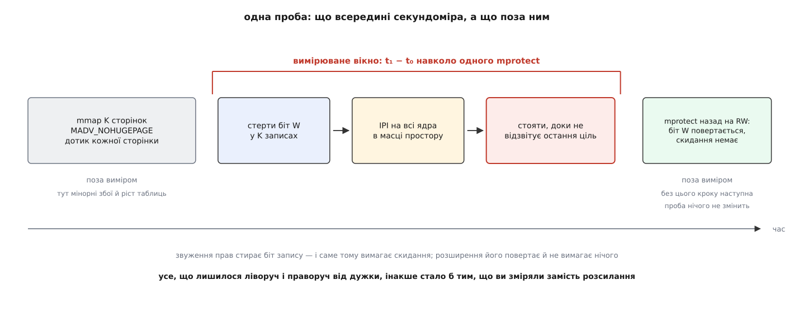
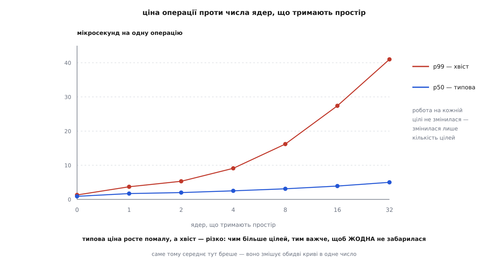
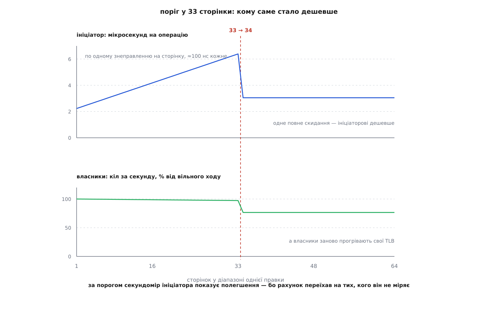

# ⚙️ Скільки коштує одне розсилання: програма, що міряє ціну на вашій машині

Ціни розсилання скидань немає в жодній документації: вона залежить від того, скільки ядер тримають простір, скільки сторінок у діапазоні однієї правки, чи машина віртуальна й що на ній крутиться поруч. Тому її міряють. Ця програма ставить дослід так, щоб у секундомір потрапило саме розсилання й нічого більше: кілька потоків прив'язані кожен до свого ядра й безперервно ходять по власній пам'яті, а окремий потік на окремому ядрі раз за разом звужує права на маленькій ділянці й засікає, скільки триває один такий виклик.

## Чому перша спроба дає рівну лінію

Наївний дослід — цикл із `mmap` і `munmap`, секундомір навколо, графік — майже завжди показує горизонталь. Так стається не тому, що розсилання дешеве, а тому, що його в тому досліді немає. Три речі мусять збігтися одночасно, і кожну легко втратити поодинці.

**Ціль має бути справжньою.** Ядро системи не шле переривання ядру процесора тільки за те, що воно колись мало переклади цього простору. Перед надсиланням воно перевіряє для кожного кандидата, чи завантажений на ньому цей простір **зараз** і чи не перебуває те ядро в лінивому режимі. Потік, який спить, не рахується: його ядро вже перемкнулося на щось інше. Отже, потоки-власники мусять крутитися по-справжньому, без жодного блокувального виклику всередині петлі — один `sleep`, один захоплений м'ютекс, один `printf`, і ціль випаровується разом із сигналом, який ви шукаєте.

**Проба має справді щось стирати.** Ядро вирішує потребу в скиданні окремо для кожного запису, і правило несиметричне: скидання потрібне, коли біт **знімають**, і не потрібне, коли його ставлять. Звуження прав до «тільки читання» знімає біт запису — розсилання буде. Розширення назад до «читання й запис» той біт повертає, до того ж ядро ставить його одразу, не чекаючи на збій, — і не розсилає нічого. Так поводяться ядра приблизно від 6.0; на старіших розширення прав біта одразу не ставило й тягло власне розсилання, тож там `IPI/оп` вийде вдвічі більший за кількість власників. Звідси пара «звузити — розширити» в петлі. Забудьте розширення — і з другого кола `mprotect` проситиме ті самі права, які ділянка вже має; такий виклик ядро відкидає одразу, ще на рівні опису ділянки, не доходячи до записів, — тож переривання не піде взагалі. Секундомір тоді міряє порожній системний виклик, і лінія виходить рівна й красива.

**У вікні не має бути нічого зайвого.** `mmap` вирощує дерево ділянок, перший дотик до кожної сторінки — це [сторінковий збій](topic:sf-os/page-fault), який ядро обробляє мікросекунди й без жодного розсилання. Якщо все це лишити всередині виміру, воно й буде тим, що ви зміряли.

Тому пробою вибрано не `munmap`, а звуження прав. `munmap` крім скидання ще звільняє кадри — а це робота, що росте з розміром ділянки, — і перебудовує дерево ділянок; розсилання в його рахунку меншина. `madvise` з `MADV_DONTNEED` стирає записи чисто, але після нього сторінки треба чіпати заново, а це знову збої. Звуження прав не звільняє нічого й не ділить ділянку навпіл, якщо брати її цілком: змінюються самі лише біти в записах, і діапазон дорівнює рівно тому, що ви задали.



*Секундомір охоплює один системний виклик, у якому нема нічого, крім правки записів і розсилання. Усе інше винесено назовні — саме тому воно й не потрапляє у відповідь.*

## Програма

```c
/* tlbcost.c — ціна одного розсилання скидань TLB, зміряна зсередини.
 * збірка:  cc -O2 -pthread -o tlbcost tlbcost.c
 * запуск:  ./tlbcost cores [пауза_нс]   — розгортка по ядрах-власниках
 *          ./tlbcost pages [пауза_нс]   — розгортка по сторінках у діапазоні
 */
#define _GNU_SOURCE
#include <pthread.h>
#include <sched.h>
#include <stdatomic.h>
#include <stdint.h>
#include <stdio.h>
#include <stdlib.h>
#include <string.h>
#include <sys/mman.h>
#include <time.h>

#define PAGE        4096UL
#define HOLD_PAGES  1024    /* робоча множина власника: 4 МіБ — щоб повне
                               скидання справді коштувало йому прогріву */
#define WARMUP      3000
#define ITERS       20000
#define MAX_CPU     512

static uint64_t gap_ns = 50000;   /* пауза між пробами: не насичувати цілі */

static void die(const char *w) { perror(w); exit(1); }

static uint64_t now_ns(void)
{
    struct timespec ts;
    clock_gettime(CLOCK_MONOTONIC, &ts);
    return (uint64_t)ts.tv_sec * 1000000000ull + (uint64_t)ts.tv_nsec;
}

static void spin(uint64_t ns)          /* саме крутитися, а не спати: сон
                                          вертає ядро холодним і з планувальником
                                          у сліді */
{
    uint64_t until = now_ns() + ns;
    while (now_ns() < until) { }
}

static void pin(int cpu)
{
    cpu_set_t set;
    CPU_ZERO(&set);
    CPU_SET(cpu, &set);
    if (sched_setaffinity(0, sizeof set, &set) != 0) die("sched_setaffinity");
}

/* по одному логічному процесору на фізичне ядро: у thread_siblings_list
   першим стоїть представник ядра, решта — його брати по гіперпотоку */
static int list_cores(int *out)
{
    int n = 0;
    for (int cpu = 0; cpu < MAX_CPU; cpu++) {
        char path[128], buf[256];
        snprintf(path, sizeof path,
                 "/sys/devices/system/cpu/cpu%d/topology/thread_siblings_list", cpu);
        FILE *f = fopen(path, "r");
        if (!f) continue;
        char *got = fgets(buf, sizeof buf, f);
        fclose(f);
        if (got && atoi(buf) == cpu) out[n++] = cpu;
    }
    return n;
}

/* рядок «TLB:» з /proc/interrupts — скільки розсилань ПРИЙНЯЛИ всі ядра разом */
static unsigned long long tlb_received(void)
{
    FILE *f = fopen("/proc/interrupts", "r");
    if (!f) return 0;
    char line[16384];
    unsigned long long sum = 0;
    while (fgets(line, sizeof line, f)) {
        char *p = line + strspn(line, " \t");
        if (strncmp(p, "TLB:", 4) != 0) continue;
        for (char *t = strtok(p + 4, " \t\n"); t; t = strtok(NULL, " \t\n")) {
            if (*t < '0' || *t > '9') break;    /* далі пішов словесний опис */
            sum += strtoull(t, NULL, 10);
        }
        break;
    }
    fclose(f);
    return sum;
}

static char *fresh_area(size_t pages)
{
    size_t len = pages * PAGE;
    char *a = mmap(NULL, len, PROT_READ | PROT_WRITE,
                   MAP_PRIVATE | MAP_ANONYMOUS, -1, 0);
    if (a == MAP_FAILED) die("mmap");
    madvise(a, len, MADV_NOHUGEPAGE);   /* інакше прозорі великі сторінки
                                           зліплять тисячу записів у два */
    for (size_t off = 0; off < len; off += PAGE) a[off] = 1;   /* збої — тут */
    return a;
}

/* ── власники простору ──────────────────────────────────────────────────── */

struct holder {
    pthread_t        th;
    int              cpu;
    char            *area;
    _Atomic uint64_t rounds;
};

static _Atomic int stop_flag;

static void *holder_main(void *arg)
{
    struct holder *h = arg;
    pin(h->cpu);
    uint64_t r = 0;
    while (!atomic_load_explicit(&stop_flag, memory_order_relaxed)) {
        /* обхід власної робочої множини: тримає простір завантаженим на цьому
           ядрі й наповнює його TLB тисячею справжніх перекладів */
        for (size_t off = 0; off < HOLD_PAGES * PAGE; off += PAGE)
            h->area[off]++;
        atomic_store_explicit(&h->rounds, ++r, memory_order_relaxed);
    }
    return NULL;
}

static int grow_holders(struct holder *hs, int have, int want, const int *cores)
{
    while (have < want) {
        hs[have].cpu  = cores[have + 1];    /* cores[0] лишається ініціаторові */
        hs[have].area = fresh_area(HOLD_PAGES);
        if (pthread_create(&hs[have].th, NULL, holder_main, &hs[have]) != 0)
            die("pthread_create");
        have++;
    }
    return have;
}

/* ── проба: одне звуження прав на K сторінках ───────────────────────────── */

static char  *probe;
static size_t probe_len;

static uint64_t one_probe(void)
{
    uint64_t t0 = now_ns();
    if (mprotect(probe, probe_len, PROT_READ) != 0) die("mprotect ro");
    uint64_t t1 = now_ns();
    /* розширення прав назад: ядро одразу повертає біт запису в записи
       й нічого не розсилає — тож наступна проба знову матиме що стирати */
    if (mprotect(probe, probe_len, PROT_READ | PROT_WRITE) != 0) die("mprotect rw");
    return t1 - t0;
}

static int cmp_u64(const void *a, const void *b)
{
    uint64_t x = *(const uint64_t *)a, y = *(const uint64_t *)b;
    return (x > y) - (x < y);
}

struct result { double p50, p99, mean, ipi, hold; };

static struct result measure(struct holder *hs, int nh)
{
    static uint64_t t[ITERS];
    struct result r;
    uint64_t rounds0 = 0, rounds1 = 0;

    for (int i = 0; i < WARMUP; i++) { one_probe(); spin(gap_ns); }

    unsigned long long ipi0 = tlb_received();      /* читання /proc — до вікна */
    for (int i = 0; i < nh; i++) rounds0 += atomic_load(&hs[i].rounds);
    uint64_t wall0 = now_ns();

    for (int i = 0; i < ITERS; i++) { t[i] = one_probe(); spin(gap_ns); }

    uint64_t wall1 = now_ns();
    for (int i = 0; i < nh; i++) rounds1 += atomic_load(&hs[i].rounds);
    unsigned long long ipi1 = tlb_received();

    double sum = 0;
    for (int i = 0; i < ITERS; i++) sum += (double)t[i];
    qsort(t, ITERS, sizeof t[0], cmp_u64);

    r.p50  = t[ITERS / 2]        / 1000.0;
    r.p99  = t[ITERS * 99 / 100] / 1000.0;
    r.mean = sum / ITERS / 1000.0;
    r.ipi  = (double)(ipi1 - ipi0) / ITERS;
    r.hold = nh ? (double)(rounds1 - rounds0) * 1e9 / (wall1 - wall0) / nh : 0.0;
    return r;
}

static double idle_rate(struct holder *hs, int nh)   /* вільний хід власників */
{
    uint64_t r0 = 0, r1 = 0;
    struct timespec nap = { 0, 200000000L };
    for (int i = 0; i < nh; i++) r0 += atomic_load(&hs[i].rounds);
    uint64_t w0 = now_ns();
    nanosleep(&nap, NULL);
    uint64_t w1 = now_ns();
    for (int i = 0; i < nh; i++) r1 += atomic_load(&hs[i].rounds);
    return (double)(r1 - r0) * 1e9 / (w1 - w0) / nh;
}

int main(int argc, char **argv)
{
    const char *sweep = argc > 1 ? argv[1] : "cores";
    static int cores[MAX_CPU];
    static struct holder hs[MAX_CPU];
    int ncore = list_cores(cores), nh = 0;

    if (argc > 2) gap_ns = strtoull(argv[2], NULL, 10);
    if (ncore < 2) { fputs("треба щонайменше два ядра\n", stderr); return 1; }
    pin(cores[0]);                   /* ініціатор сидить окремо від власників */

    if (strcmp(sweep, "cores") == 0) {
        probe_len = 8 * PAGE;        /* завідомо нижче порога в 33 сторінки */
        probe = fresh_area(8);
        puts("власників    p50    p99  серед.  IPI/оп  кіл/с власника");
        for (int want = 0; ; ) {
            nh = grow_holders(hs, nh, want, cores);
            struct result r = measure(hs, nh);
            printf("%9d %6.2f %6.2f %7.2f %7.2f %15.0f\n",
                   nh, r.p50, r.p99, r.mean, r.ipi, r.hold);
            if (want == ncore - 1) break;
            want = want ? want * 2 : 1;
            if (want > ncore - 1) want = ncore - 1;
        }
    } else {
        static const int ks[] = { 1, 4, 8, 16, 24, 32, 33, 34, 40, 48, 64, 0 };
        nh = grow_holders(hs, 0, ncore - 1 < 8 ? ncore - 1 : 8, cores);
        printf("власників: %d, вільний хід: %.0f кіл/с\n", nh, idle_rate(hs, nh));
        puts("сторінок    p50    p99  IPI/оп  кіл/с власника");
        for (int i = 0; ks[i]; i++) {
            if (probe) munmap(probe, probe_len);
            probe_len = (size_t)ks[i] * PAGE;
            probe = fresh_area((size_t)ks[i]);
            struct result r = measure(hs, nh);
            printf("%8d %6.2f %6.2f %7.2f %15.0f\n",
                   ks[i], r.p50, r.p99, r.ipi, r.hold);
        }
    }

    atomic_store(&stop_flag, 1);
    for (int i = 0; i < nh; i++) pthread_join(hs[i].th, NULL);
    return 0;
}
```

## Що читати у виводі

Перше, на що дивляться, — не час, а стовпчик `IPI/оп`. Він мусить дорівнювати кількості власників. Менше — значить, хтось із них насправді не тримає простір: у петлі є блокувальний виклик, або два потоки сіли на гіперпотоки одного фізичного ядра, або ядро системи їх кудись перенесло. Більше — значить, машина не порожня: хтось поруч теж розсилає, і його переривання потрапили у вашу різницю. Доки це число не збігається з очікуваним, решта стовпчиків не означає нічого.

Далі — два числа замість одного: `p50` каже, скільки коштує звичайна операція, `p99` — скільки коштує невдала. Приблизно так виглядає розгортка по ядрах на машині з тридцяти трьох фізичних ядер:

```
власників    p50    p99  серед.  IPI/оп  кіл/с власника
        0   0.91   1.28    0.94    0.00               0
        1   1.68   3.71    1.79    1.00          199400
        2   2.03   5.34    2.24    2.00          199100
        4   2.51   9.08    2.94    4.00          198600
        8   3.14  16.20    4.02    8.00          198100
       16   3.88  27.40    5.71   16.00          197300
       32   5.02  41.00    8.03   32.00          196400
```



*Одні й ті самі проби дають дві різні криві, бо описують різні речі: одна — вартість надсилання плюс чекання на звичайну ціль, друга — ймовірність, що бодай одна ціль забарилася.*

Рядок із нулем власників — це вартість чистого локального скидання без жодного переривання; від нього й слід відлічувати все інше. Далі типова ціна росте помалу: робота на кожній цілі не змінилася, змінилася лише їхня кількість, а виконують вони її паралельно. Зате хвіст росте круто, і причина суто ймовірнісна: щоб операція минула швидко, мусить не забаритися **жодна** ціль, а таких «жодних» стає дедалі більше. Середнє між цими двома кривими не описує нічого: воно завелике для типової операції й замале для тієї, через яку ви й прийшли міряти. Про те, чому [квантилі кажуть правду там, де середнє її ховає](topic:math-probability/percentiles-quantiles), і чому [мікробенчмарк так легко бреше вимірювачеві](topic:sf-release/microbenchmarking), варто прочитати окремо — обидві пастки тут спрацьовують у повний зріст.

## Поріг у тридцять три сторінки

Друга розгортка ставить інше питання: як ціна залежить від того, скільки сторінок зачепила одна правка. Ядро на x86 порівнює довжину діапазону з налаштовуваним порогом, і порівняння **строге**: тридцять три сторінки ще йдуть по одній, тридцять чотири вже перекидають операцію на повне скидання простору. Число не з формули — воно з міри марної роботи, і коментар у самому ядрі це пояснює: одне знеправлення коштує близько ста наносекунд, тож поріг у тридцять три обмежує найгіршу марну витрату приблизно трьома мікросекундами, покриваючи при цьому переважну більшість реальних правок.

```
сторінок    p50    p99  IPI/оп  кіл/с власника
       1   2.23  14.90    8.00          199400
       4   2.62  15.40    8.00          199000
       8   3.14  16.20    8.00          198100
      16   4.18  17.20    8.00          196900
      24   5.22  18.30    8.00          195600
      32   6.26  19.30    8.00          194300
      33   6.39  19.50    8.00          194100
      34   3.05  16.00    8.00          152700
      40   3.06  15.80    8.00          152500
      48   3.07  16.10    8.00          152400
      64   3.08  15.90    8.00          152300
```



*Одна межа — два протилежні наслідки. Ініціатор бачить полегшення, власники — провал, і жоден із них не бачить обох чисел одночасно.*

Ось найцікавіше, що дає цей дослід. На тридцять четвертій сторінці час ініціатора **падає** — з шести з половиною мікросекунд до трьох. Операція начебто подешевшала. Але хід власників тієї самої миті просідає майже на чверть: замість вибіркового знеправлення восьми чи тридцяти чужих сторінок кожен із них отримав повне скидання своєї мітки й тепер заново прогріває тисячу перекладів. Рахунок не зник — він переїхав на тих, кого секундомір ініціатора не міряє. Саме тому в програмі є стовпчик `кіл/с власника`: без нього поріг виглядав би як безкоштовна оптимізація.

Що поріг справді той самий, перевіряють просто — його видно й можна крутити:

```sh
# зсунути межу вниз і перезапустити розгортку
$ echo 4 | sudo tee /sys/kernel/debug/x86/tlb_single_page_flush_ceiling
$ ./tlbcost pages
```

Якщо сходинка у виводі переїхала з тридцять третьої сторінки на четверту — ви міряєте те, що думаєте, а не щось інше, що просто корелює.

> 🔧 **Навіщо це.** Дві розгортки дають два різні важелі, і плутати їх не варто. Крива по ядрах каже, скільки ви платите за **ширину** простору — скільки ядер його тримають; на неї впливає прив'язка потоків, а не код роботи з пам'яттю. Крива по сторінках каже, скільки ви платите за **розмір** однієї правки; на неї впливає алокатор і те, якими шматками він повертає пам'ять системі. Служба, у якої погано з першою, лікується розкладкою потоків; служба, у якої погано з другою, — налаштуванням алокатора. Один графік не відрізнить ці два випадки.

## Де вимір бреше

**Прогрів.** Перші сотні проб міряють не те: ростуть таблиці сторінок під нову ділянку, розганяються частоти, наповнюється маска ядер простору, прогріваються самі кеші ядра системи. Тому перед кожною точкою розгортки йдуть три тисячі викинутих проб — і саме перед кожною, а не один раз на весь прогін: додали власника — умови змінилися.

**Гіперпотоки.** Два логічні процесори одного фізичного ядра — це дві окремі позначки в масці простору й два окремі переривання, але не два ядра. Якщо про це не знати, графік «ядер → мікросекунд» на половині шляху зламається без видимої причини. Тому програма читає `thread_siblings_list` і бере лише представників. Загалом про [прив'язку задач до ядер](topic:sys-unix/cpu-affinity) варто знати більше, ніж один системний виклик: без неї планувальник переселятиме потоки посеред виміру, і маска простору дихатиме разом із ними.

**Прозорі великі сторінки.** Це найтихіша пастка. Якщо ділянка проби чи робоча множина власника дістануться [великій сторінці](topic:sys-unix/huge-pages-tlb-reach), тисяча записів стане двома, крок діапазону — двома мегабайтами замість чотирьох кілобайтів, арифметика порога перестане мати сенс, а прогрів після повного скидання зникне разом із сигналом. Звідси `MADV_NOHUGEPAGE` на кожне відображення; загальний стан варто заодно глянути в `/sys/kernel/mm/transparent_hugepage/enabled`.

**Джерело часу.** `clock_gettime` із монотонним годинником іде через [vDSO](topic:sys-unix/vdso) і коштує десятки наносекунд — але тільки доки джерелом часу лишається лічильник тактів процесора. На `hpet` чи на паравіртуальному джерелі той самий виклик стає справжнім системним викликом на мікросекунду, а їх у пробі два, і вони з'їдають половину того, що ви міряєте. Одна перевірка: `cat /sys/devices/system/clocksource/clocksource0/current_clocksource`.

**Насичення.** Без паузи між пробами петля розсилає швидше, ніж цілі встигають обслуговувати, — і тоді число, яке ви отримаєте, буде вартістю черги, а не однієї операції. Перевірка проста: змініть паузу вдвічі. Якщо `p50` при цьому поїхав — ви ще в насиченні; якщо стоїть — міряєте одну операцію.

**Напрямок розгортки.** Власників треба тільки додавати. Ядро, яке перестало тримати простір, вибуває з маски не миттєво, а на найближчому розсиланні, і поки воно там висить, `IPI/оп` показує вчорашню картину.

**Лічильники, яких немає.** Значення `nr_tlb_remote_flush` і сусідні з `/proc/vmstat` зібрані під `CONFIG_DEBUG_TLBFLUSH`, а в дистрибутивних ядрах цей параметр вимкнено — тож найчастіше цих рядків у вас просто не буде. Рядок `TLB` у `/proc/interrupts` є завжди, тому програма спирається на нього. Якщо потрібен розклад за причинами скидання, а не сума, його дає трасувальна точка `tlb_flush` — але це вже [ftrace і трасувальні точки ядра](topic:sys-unix/ftrace-kernel-tracing).

**Чужа робота.** Рядок `TLB` рахує розсилання всієї системи, а не вашого процесу. Порожня машина — найдешевший спосіб це виправити; надійніший — винести обрані ядра з-під планувальника параметрами завантаження `isolcpus` і `nohz_full`. І в будь-якому разі варто раз зміряти фон: скільки той рядок набирає за секунду, коли ваша програма мовчить.

**Віртуальна машина.** Там `p99` злітає в десятки разів, і це не похибка виміру. Віртуальний процесор, знятий із виконання гіпервізором, підтвердить скидання не раніше, ніж його повернуть до роботи, — тож на віртуалці ви міряєте не свою машину, а чужий планувальник. Це чесна ціна саме того середовища, і саме її треба знати.

## Від чисел до бюджету

Дві цифри з прогону перетворюються на третю — частку машини, яку розсилання з'їдає мовчки. Ціна на боці цілі не вимірюється прямо, але виводиться з просідання власників:

```
вільний хід власника:                  R₀ = 199 400 кіл/с
під розсиланнями (8 сторінок, 8 цілей): R₁ = 198 100 кіл/с
проб за секунду у прогоні:             F  = 1 / (3.14 мкс + 50 мкс) ≈ 18 800 /с

втрачена частка часу власника:  1 − R₁/R₀ = 1 − 0.99348 = 0.65 %
ціна одного розсилання на цілі: 0.0065 / 18 800 = 0.35 мкс
```

Тепер той самий рахунок для справжньої служби — сорок потоків в одному просторі, вісім тисяч розсилань за секунду:

```
простій ініціатора:  8 000 · 5.02 мкс         = 40 мс/с ≈ 4.0 % одного ядра
простій цілей:       8 000 · 32 · 0.35 мкс    = 90 мс/с ≈ 9.0 % одного ядра
                     (розмазані по 32 ядрах — по 0.28 % на кожне)
```

Ці дві величини мають різні наслідки, і плутати їх не можна. Простій ініціатора виходить у затримку: він стоїть усередині системного виклику, і той виклик у профілі видно. Простій цілей виходить у пропускну здатність і не видно ніде: кожне ядро втрачає по три десятих відсотка в обробнику переривання, який жоден профіль не припише тому `munmap`, що його спричинив. Перше помічають і лікують. Друге списують на «машина чомусь не масштабується».
