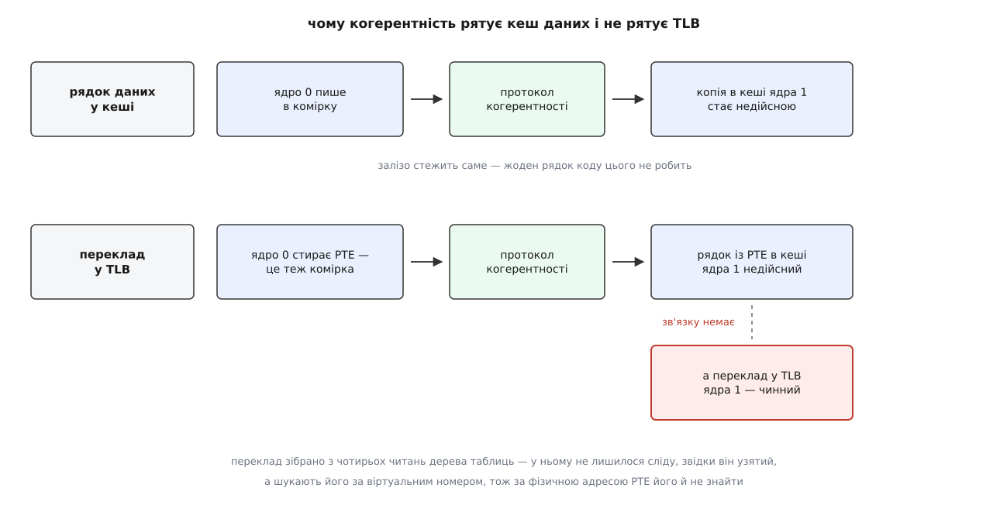
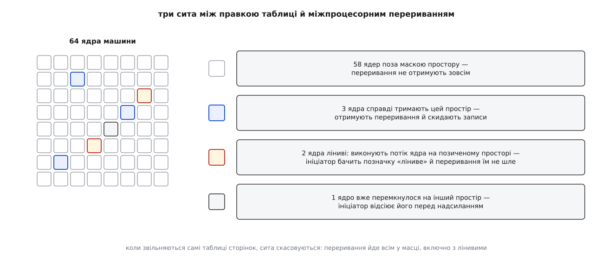
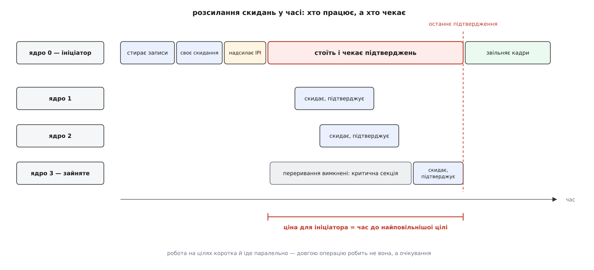
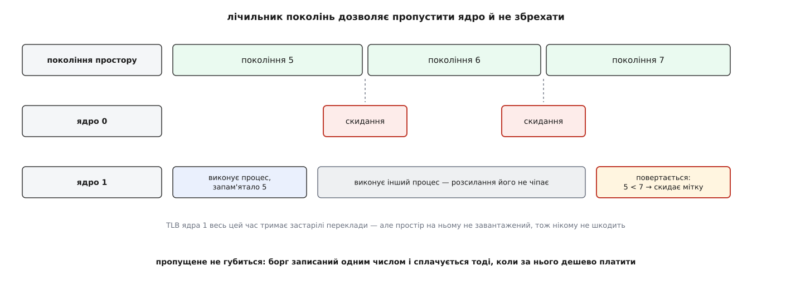

# Розсилання скидань TLB: чому правка таблиці сторінок коштує міжпроцесорних переривань

<preknowlist>
- [Сторінки, таблиці сторінок і MMU](root:sf-os/paging-and-mmu) — адреса розпадається на індекси рівнів дерева й зміщення; запис таблиці містить номер кадру й прапорці.
- [TLB](root:hw-arch/tlb) — маленький кеш готових перекладів усередині процесора; шукають у ньому за віртуальним номером сторінки, а мітка ASID каже, чиєму простору належить запис.
- [Когерентність кешів](root:hw-arch/cache-coherence) — протокол, яким ядра самі стежать, щоб копії того самого рядка пам'яті не розходилися.
- [Сторінковий збій](root:sf-os/page-fault) — на відсутньому записі апаратура спиняється й кличе ядро, а те підставляє сторінку.
- [Віртуальний адресний простір процесу](root:sf-os/virtual-address-space) — простір складається з ділянок, а весь опис простору в ядрі — одна спільна структура для всіх потоків процесу.
- [Контролер і вектор переривання](root:hw-arch/interrupt-vector) — як зовнішня подія змушує ядро процесора кинути поточну роботу й піти в обробник.
</preknowlist>

Служба на шістдесятичотириядерній машині тримає сорок робочих потоків в одному адресному просторі. Раз на кілька секунд допоміжний потік звільняє великий буфер — звичайний `munmap` на двісті мегабайтів. І щоразу в цю мить псується затримка **всіх** сорока потоків, хоча жоден із них того буфера не торкався. Профіль самої служби мовчить: час іде не в її код. Зате рядок `TLB` у `/proc/interrupts` за ту саму мить набирає сотні тисяч.

Виходить, що звільнити пам'ять в одному потоці — це зупинити всі інші. Щоб зрозуміти, звідки береться такий зв'язок, треба помітити одну незручну властивість перекладу адрес: переклади цього процесу фізично лежать копіями всередині кожного ядра, яке його виконувало, і жоден механізм не стирає ті копії сам.

## Кеш, за яким ніхто не стежить

Кеш даних цієї проблеми не має. Коли одне ядро пише в комірку, копії того самого рядка в кешах усіх інших ядер стають недійсними автоматично — так працює протокол когерентності. Ніхто цього не програмує: залізо саме стежить, щоб два ядра не бачили різних значень за однією фізичною адресою.

TLB — теж кеш, і теж тримає копії того, що лежить у пам'яті. Але його ніхто не стереже. Запис у таблиці сторінок можна змінити на одному ядрі, і TLB усіх інших ядер про це не дізнається ніколи. Копія лишиться жити й перекладатиме адресу так, як було до правки.

Причина не в лінощах архітекторів, а в тому, що запис TLB **не є копією рядка пам'яті**. Він — результат обчислення: щоб його зробити, MMU прочитав по одному запису з чотирьох рівнів дерева таблиць, і в готовому записі не лишилося сліду, з яких саме комірок він зібраний. Щоб TLB реагував на записи в пам'ять, кожне ядро мусило б пам'ятати для кожного свого запису чотири фізичні адреси, з яких той походить, і звіряти з ними кожне повідомлення протоколу когерентності.

Далі — гірше. TLB шукають **за віртуальним номером сторінки**: тег запису — це віртуальна адреса, а повідомлення когерентності приходить із фізичною. Знайти в TLB усіх, кого зачепив запис за такою фізичною адресою, звичайним пошуком неможливо — потрібна друга асоціативна пам'ять, індексована навпаки. І все це на найгарячішому шляху машини, де TLB опитують паралельно з першим рівнем кеша, і зайвий такт додається до **кожного** звернення до пам'яті.



*Правка запису таблиці — звичайний запис у пам'ять, і рядок із цим записом протокол когерентності знеправляє на всіх ядрах справно. А переклад, зроблений із того запису раніше, до цього рядка більше не прив'язаний, тож лишається жити.*

Тому в жодній поширеній архітектурі TLB не підслуховує записи в пам'ять. Натомість набір команд дає засоби скинути переклади **вручну**: на x86 це `INVLPG` для однієї адреси, перезапис `CR3` для всього простору й `INVPCID` для простору із заданою міткою. Спільне в них те, що всі вони діють **тільки на тому ядрі, яке їх виконало**. Команди «скинь переклад на всіх ядрах» у наборі просто немає.

З цього виходить головне, і виходить неминуче. Якщо дотягтися до TLB чужого ядра можна лише кодом, який виконується на тому ядрі, а те ядро зараз зайняте своєю роботою, то єдиний спосіб — **змусити його перерватися**. Механізм, яким одне ядро змушує інше негайно виконати код, називають [міжпроцесорним перериванням](root:sys-unix/inter-processor-interrupts) (англ. *inter-processor interrupt*, IPI): ядро-ініціатор просить свій контролер переривань доставити вектор на вказані ядра, ті кидають поточну роботу й заходять в обробник.

Уся процедура — стерти запис, розіслати переривання, дочекатися, поки всі цілі відзвітують, — має власну назву ще з 1989 року: **розсилання скидань**, англ. *TLB shootdown*. [Звідки взялося слово «відстріл» і як виглядав перший алгоритм](root:sys-unix/tlb-shootdown/hist-shootdown-name.md) — окрема історія.

## Коли скидати обов'язково, а коли можна змовчати

Розсилання дороге, тож варто точно знати, коли без нього не обійтися. Правила два, і вони несиметричні.

Коли правка робить переклад **дозволенішим** — запис зʼявився там, де його не було, права розширилися з «тільки читання» на «читання й запис», — скидати не треба. Найгірше, що станеться: якесь ядро спіткнеться об застарілий заборонний стан, візьме сторінковий збій, ядро системи перечитає запис, побачить, що все вже гаразд, і поверне керування. Такий «порожній» збій ядро вміє поглинати мовчки. Саме тому обробка сторінкового збою — підставити кадр і записати PTE — не коштує жодних переривань, хоча відбувається мільйони разів на секунду.

Коли правка робить переклад **суворішим** або скасовує його зовсім — скидання обов'язкове, і обов'язкове **до** того, як фізичний кадр піде в діло комусь іншому. Бо застарілий запис у чужому TLB — це готовий, робочий шлях до кадру, який уже не належить цьому процесові. Ядро віддало кадр іншій програмі, а ядро процесора, що зберегло переклад, і далі пише туди повним ходом, оминаючи будь-які перевірки прав: перевірка прав живе в самому записі TLB.

Список того, що потрапляє в другу категорію, набагато довший, ніж здається спочатку: `munmap` і завершення процесу, `mprotect` на звуження прав, зняття права запису при [копіюванні при записі](root:sf-os/copy-on-write), витіснення сторінки в підкачку, [злиття однакових сторінок](root:sys-unix/ksm-page-merging), перенесення сторінки при ущільненні пам'яті чи між вузлами NUMA, розбиття [великої сторінки](root:sys-unix/huge-pages-tlb-reach). У кожному з цих випадків між «запис у таблиці вже не такий» і «кадр уже чужий» мусить вміститися повне розсилання.

Тому порядок дій у ядрі жорсткий, і переставити в ньому нічого не можна:

```c
/* спрощений кістяк того, як ядро знімає відображення сторінки */

pte_t old = ptep_get_and_clear(mm, addr, ptep);  /* 1. запис зникає з таблиці */
flush_tlb_range(vma, addr, addr + PAGE_SIZE);    /* 2. і з усіх TLB, що його бачили */
put_page(page);                                  /* 3. лише тепер кадр можна віддати */
```

Поміняти місцями другий і третій крок — це не «трохи повільніше», це готова вразливість: вікно, у якому чужий процес отримав кадр, а старий власник іще має до нього доступ. Знайти всіх, хто відображає сторінку, ядру допомагає [зворотне відображення](root:sys-unix/reverse-mapping) — від кадру до всіх записів таблиць, що на нього вказують.

> 🔧 **Навіщо це.** Та сама несиметрія пояснює, чому `mprotect` із розширенням прав дешевий, а зі звуженням — дорогий, хоча виклик той самий. Код, що знімає захист із ділянки на час роботи й повертає його назад, платить не двічі, а один раз — і платить саме на поверненні захисту. Якщо такий цикл крутиться в гарячій петлі на багатоядерній машині, дешевше поміняти схему: тримати дві ділянки з різними правами на ті самі сторінки, ніж перемикати права туди-сюди.

## Кому саме йде переривання

Найпростіша відповідь — «усім ядрам» — і найгірша: на машині з сотнею ядер вона перетворює кожен `munmap` на сотню переривань. Тому ядро звужує коло як може.

Простір пам'яті процесу описує одна структура, і в ній є маска ядер, що колись завантажували цей простір. Ядро процесора потрапляє в маску тоді, коли перемикається на цей простір, і вибуває з неї згодом, коли обробник скидання помічає, що воно давно виконує щось інше. Переривання йде **лише за цією маскою**, і для процесу, що живе на трьох ядрах шістдесятичотириядерної машини, це три переривання замість шістдесяти трьох.

Друге сито — уже на боці ініціатора, перед самим надсиланням: він перевіряє, який простір **зараз завантажений** на кожному кандидаті, і пропускає ті, що встигли перемкнутися. Третє сито — лінивий режим, і воно теж на боці ініціатора. Ядро процесора, яке виконує потік самого ядра системи, власного адресного простору не має й позичає той, що вже завантажений. Скидати йому нічого: воно все одно не звертається до сторінок процесу, а свій TLB узгодить при найближчому перемиканні на справжній простір. Побачивши позначку «ліниве», ініціатор такому ядру переривання просто не шле.



*Кожне сито відрізає частину адресатів, але жодне не відрізає їх усіх: доки хоч одне чуже ядро тримає цей простір, розсилання лишається розсиланням.*

Є один випадок, коли всі сита скасовуються: коли звільняються не сторінки, а самі **таблиці сторінок**. Тут переривання йде всім у масці, включно з лінивими, і причина тонка. Ядро процесора має право читати таблиці сторінок наперед, здогадно — воно робить це, щоб заповнити TLB завчасно. Якщо сторінку з таблицею звільнити й віддати комусь під дані, здогадне читання піде вже по чужому вмісту й побудує з нього переклад невідомо куди.

Із цього виходить друге, несподіване призначення переривання. Ядро Linux на x86 обходить таблиці сторінок без замків — швидкий шлях `get_user_pages_fast` робить це з **вимкненими перериваннями**. Вимкнені переривання означають, що доставити такому ядру IPI неможливо, доки воно не закінчить обхід. А отже, якщо розсилання завершилося й усі цілі відзвітували, це доводить, що жодне ядро зараз не сидить усередині обходу — і таблицю можна звільняти. Переривання тут працює не лише як команда «скинь», а й як доказ «усі вийшли». Архітектури, де скидання розсилає саме залізо, цього доказу не отримують, тож мусять звільняти таблиці окремим механізмом відкладеного звільнення — через [RCU](root:sys-unix/rcu-read-copy-update).

## Платить той, хто чекає

Досі виглядало, ніби ціна розсилання — це вартість самих переривань. Насправді головна її частина інша.

Ініціатор **не може піти далі**, поки не переконається, що всі цілі скинули свої записи: тільки з цієї миті кадр безпечно віддавати. Тобто він надсилає переривання й крутиться в очікуванні підтверджень. Ціна для нього — не сума робіт на цілях, а **максимум** із часів, за які кожна ціль зволила взятися до справи.

А цей час на цілі від ініціатора не залежить зовсім. Ядро процесора може сидіти в критичній секції з вимкненими перериваннями. Може виходити з глибокого енергетичного стану. Може бути віртуальним процесором, який господар машини щойно зняв із виконання, — тоді підтвердження прийде не раніше, ніж планувальник господаря дасть тому процесорові попрацювати знову.



*Робота на цілях коротка й іде паралельно, тож сума їхніх зусиль мала. Час ініціатора визначає не вона, а те, коли до справи візьметься найповільніший.*

**Скільки коштує хвіст.** Візьмімо для рахунку, що звичайне розсилання забирає близько двох мікросекунд, а раз на сотню разів ціль забарюється на п'ятдесят мікросекунд — довга критична секція чи знята з виконання віртуальна машина:

```
одна ціль забарилася:            p = 0.01
7 цілей, жодна не забарилася:    0.99⁷  = 0.932
                    забарилася:  1 − 0.932 = 6.8 %
63 цілі, жодна не забарилася:    0.99⁶³ = 0.531
                    забарилася:  1 − 0.531 = 46.9 %

середня ціна при 7 цілях:   2 + 0.068 · 50 ≈  5.4 мкс
середня ціна при 63 цілях:  2 + 0.469 · 50 ≈ 25.5 мкс
```

Цілей стало вдев'ятеро більше, робота на кожній не змінилася — а операція подорожчала майже вп'ятеро. Причина суто ймовірнісна: чим більше цілей, тим важче, щоб **жодна** не забарилася.

Саме тому проблема помітна не там, де багато скидань, а там, де багато ядер тримають один простір. І саме тому вона так боляче б'є у віртуальних машинах, де забарювання не рідкісне, а звичайне. Проти цього гіпервізор має окрему домовленість із гостем: KVM від версії 4.16 дає гостьовому ядру змогу дізнатися, що якийсь віртуальний процесор зараз не виконується, пропустити його при розсиланні й покластися на те, що гіпервізор скине TLB сам, коли той процесор повернеться до роботи. Ініціатор тоді чекає лише на тих, хто справді працює. Що при цьому робить [апаратна віртуалізація](root:hw-arch/hardware-virtualization) з таблицями другого рівня — розмова окрема, але напрямок той самий: не чекати на того, кого зараз усе одно немає.

## Три способи платити менше

Позбутися розсилання не можна — можна лише робити його рідше й дешевше. Ядро тисне на це на трьох різних рівнях, і рівні ці незалежні.

**Скидати діапазон чи все.** Коли правка зачепила кілька сторінок, обробник може викинути з TLB кожну окремо або скинути весь простір одним махом. Кожне окреме знеправлення на x86 коштує близько ста наносекунд, і при великому діапазоні їхня сума перевищує ціну повного скидання. Але повне скидання має власну ціну — після нього TLB порожній, і програма якийсь час іде суцільними промахами. Тому поріг обрано не з формули, а з міри марної роботи:

```
ціна одного знеправлення        ≈ 100 нс
поріг у Linux на x86            = 33 сторінки
марна робота при найгіршому виборі = 33 · 100 нс ≈ 3300 нс
```

Число 33 покриває переважну більшість реальних правок, а понад ним ядро йде на повне скидання, обмежуючи так марно витрачений час трьома мікросекундами. Поріг видно й можна крутити: `/sys/kernel/debug/x86/tlb_single_page_flush_ceiling`.

**Складати правки в один пакет.** Розібрати ділянку на двісті мегабайтів — це п'ятдесят тисяч записів у таблицях. Розсилати скидання після кожного було б божевіллям, тож ядро збирає всю операцію в один «кошик»: стирає записи, складає туди звільнені кадри й посилає **одне** розсилання на весь діапазон наприкінці, і аж потім віддає кадри. Звідси й спостережене на початку: `munmap` на двісті мегабайтів — це одне розсилання, а не п'ятдесят тисяч. Дорого воно не кількістю переривань, а тим, що після повного скидання сорок робочих потоків заново прогрівають свої TLB.

**Відкладати скидання, тримаючи кадр заручником.** Найцікавіший прийом працює при витісненні пам'яті. Коли ядро забирає сторінки під тиском, воно стирає їхні записи, але розсилання **не робить** — натомість запам'ятовує, що воно винне, і не відпускає кадри доти, доки не розрахується. Стара копія в чужому TLB лишається чинною й далі вказує на кадр, який іще нікому не відданий, тож нічия безпека не порушена. Одне розсилання наприкінці закриває борг за тисячі сторінок одразу. Коли цей прийом додали, потік переривань на характерному навантаженні впав із трьохсот сорока п'яти тисяч на секунду до тринадцяти тисяч — у двадцять шість разів.

## Як ядро дозволяє собі пропускати ядра

Лишається діра в міркуванні. Ядро процесора може мати переклади процесу в TLB, але не виконувати його зараз — і тоді розсилання його пропускає. Що станеться, коли воно повернеться до цього процесу й побачить старі записи?

Відповідь — лічильник поколінь. Опис простору тримає число, яке зростає на одиницю при кожному скиданні. Кожне ядро процесора пам'ятає для кожної своєї мітки ASID, при якому поколінні вона востаннє була узгоджена. Перемикаючись на простір, ядро порівнює запам'ятоване число з поточним: рівні — переклади чинні, можна працювати з теплим TLB; своє менше — щось пропущено, і треба скинути записи цієї мітки, перш ніж ними користуватися.



*Лічильник перетворює «пропустити ядро зараз» на «змусити його скинути потім». Пропущене не губиться — воно відкладається на момент, коли за нього дешево платити.*

Саме цей лічильник робить безпечним усе, що описано вище. Без нього маску довелося б тримати повною, а мітки ASID — скидати при кожному перемиканні. З ним ядро процесора може роками зберігати переклади кількох процесів одночасно й перемикатися між ними без жодного скидання — а борги наздоганяти по одному числу. У Linux ця схема прийшла на x86 разом із підтримкою міток PCID у версії 4.14; кожне ядро процесора тримає шість активних міток, і на цій самій механіці стоїть [ізоляція таблиць ядра](root:sys-unix/kernel-page-table-isolation), якій потрібні окремі мітки для простору користувача й простору ядра.

## Чи можна перекласти це на залізо

Питання «а чому просто не зробити розсилання апаратним» має різні відповіді на різних архітектурах — і всі вони повчальні.

ARM64 має його від початку. Команда `TLBI` з ознакою внутрішньої спільної області розсилає знеправлення всім ядрам домену повідомленнями по самій міжз'єднувальній шині, а `DSB` чекає, поки вони відпрацюють. Жодних переривань, жодних обробників, жодного очікування на зайняту ціль. Але задарма це не дається: розсилання отримують **усі** ядра домену без розбору, бо адресувати їх вибірково команда не вміє. На великих серверних кристалах саме це стає новою стіною — шина захлинається знеправленнями, і ядра, які до того процесу не мають жодного стосунку, все одно змушені їх перетравлювати. Ще один наслідок уже згадано: доказу «всі вийшли з обходу таблиць» тут немає, тож таблиці доводиться звільняти через відкладений механізм.

RISC-V вибрав інакше: `SFENCE.VMA` діє тільки локально, а для чужих ядер стандарт пропонує виклик до прошивки, який під сподом усе одно перетворюється на переривання. Тобто та сама схема, що на x86, лише схована на щабель нижче.

На x86 апаратне розсилання зʼявилося пізно й з боку AMD: команда `INVLPGB` розсилає знеправлення всім ядрам, а `TLBSYNC` чекає на завершення. Підтримку в Linux написав Рік ван Ріл із Meta, і вона ввійшла у версію 6.15 (2025). Механіка цікава тим, як вона обходить головне обмеження: щоб розсилати за міткою, простір процесу має дістати мітку, спільну для всієї машини, — і ядро видає такі глобальні мітки саме тим процесам, які того варті, тобто багатопотоковим і розкиданим по багатьох ядрах. Для решти лишається звичне розсилання перериваннями.

Спільне в усіх трьох відповідях те, що жодна з них не скасовує самої вимоги. Хтось мусить знеправити чужі копії перекладу, перш ніж кадр перейде в інші руки. Мандрує між програмою та залізом тільки виконавець — а разом із ним і форма, у якій приходить рахунок: очікування на найповільнішу ціль в одному разі, навантаження на шину в іншому.

## Як побачити свій рахунок

Дивитися варто з трьох боків, бо кожен показує своє.

Скільки скидань прийшло на кожне ядро — `/proc/interrupts`, рядок `TLB`. Це кількість разів, коли ядро процесора **отримало** чуже розсилання й пішло в обробник; вектор при цьому спільний із рештою міжпроцесорних викликів, а окремий лічильник ведеться саме для скидань.

Скільки їх послано й скільки отримано по системі — `/proc/vmstat`; ці чотири рядки є лише в ядрі, зібраному з `CONFIG_DEBUG_TLBFLUSH`, а дистрибутивні ядра його не вмикають:

```sh
$ grep -E 'nr_tlb_(remote|local)_flush' /proc/vmstat
nr_tlb_remote_flush              284119
nr_tlb_remote_flush_received    1638442
nr_tlb_local_flush_all           902311
nr_tlb_local_flush_one         12044190
```

Розклад читається просто: майже шість отримань на одне надсилання означає, що процеси розкидані по шести ядрах у середньому, і кожна правка таблиці б'є по всіх шести. Число `flush_all` проти `flush_one` каже, як часто діапазон переростав поріг у 33 сторінки.

Хто саме розсилає — трасувальна точка `tlb_flush`: вона дає причину кожного скидання (розбирання ділянки, зміна прав, витіснення, перенесення) і кількість сторінок у діапазоні. Далі — звична пара `perf record` на `flush_tlb_mm_range` і `smp_call_function_many`.

Повний перелік того, що тут можна прочитати й покрутити — лічильники, трасувальні точки, поріг у debugfs, параметри завантаження й ознаки процесора — зібраний окремо: [чим міряють і чим керують розсиланням скидань](root:sys-unix/tlb-shootdown/api-tlb-flush-controls.md). А [маленька програма, що прив'язує потоки до ядер і показує, як ціна одного `munmap` росте з кількістю ядер, які тримають простір](root:sys-unix/tlb-shootdown/proj-shootdown-cost.md), дає відчути залежність руками.

## Що з цим робити в чужому коді

Знання це має прикладне вістря, і воно не в налаштуваннях, а в тому, як написана програма.

Розсилання породжує зміна відображень, а не робота з пам'яттю. Отже, програма, яка виділяє й повертає пам'ять системі в гарячій петлі, купує собі розсилання на кожному колі — і тим дорожче, чим більше в неї потоків. Той самий алокатор, налаштований не віддавати звільнене ядру одразу, розсилань не породжує зовсім: пам'ять лишається за процесом, таблиці не змінюються, чужі TLB нікого не обходять. Звідси й типовий діагноз для служби, яка добре працює на восьми ядрах і погано на шістдесяти чотирьох: винен не планувальник і не замки, а те, що зростання числа ядер множить ціну кожної правки таблиці.

Другий бік — розмір робочої множини. Кожне повне скидання коштує не лише самої операції, а й прогріву TLB після неї, а прогрів тим довший, чим більше сторінок треба перекладати. Тому [великі сторінки](root:sys-unix/huge-pages-tlb-reach) б'ють по цій біді двічі: і записів у таблицях менше, тож правки рідші, і після скидання прогрів коротший у сотні разів.

І третій, найпростіший: тримати процес там, де він працює. Прив'язка потоків до кількох ядер замість блукання по всій машині звужує маску розсилання, а звужена маска — це менше цілей, а менше цілей — це менший шанс, що якась із них забариться саме тоді, коли ви на неї чекаєте.
