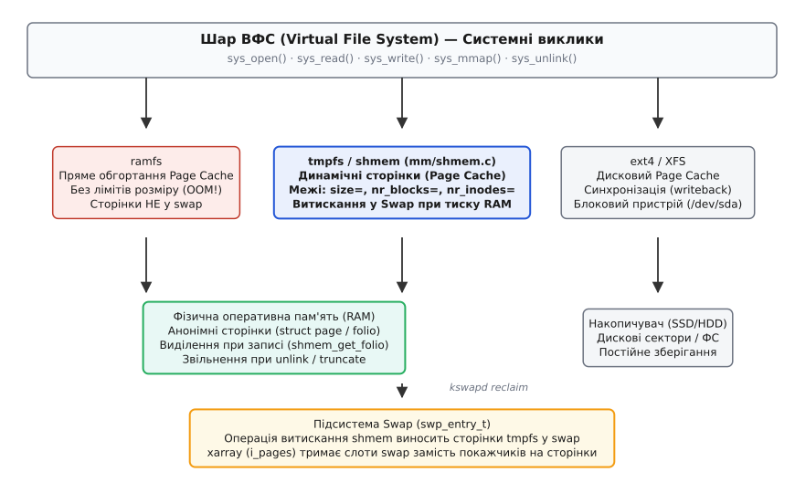
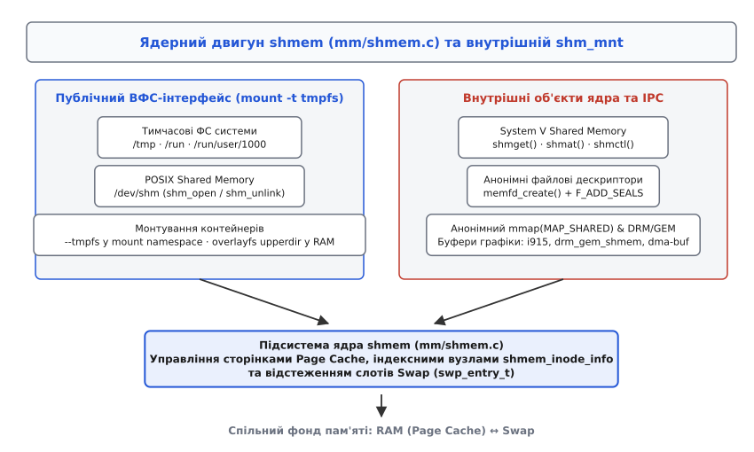

# Тимчасова ВФС tmpfs та підсистема shmem: дисковий кеш у RAM

<preknowlist>
- [Віртуальна файлова система VFS](topic:sys-unix/vfs-layer) — абстракція індексних вузлів inode, записів каталогу dentry та операцій файлової системи.
- [Кеш сторінок та журналювання](topic:sys-unix/page-cache-durability) — механізми буферизованого вводу-виводу, брудні сторінки та витискання даних у RAM.
- [Витискання сторінок та swap](topic:sys-unix/swap-and-reclaim) — робота демона `kswapd`, тиск на пам'ять і винесення сторінок у swap-простір.
</preknowlist>

Виконання високочастотних операцій запису тимчасових файлів — компіляція проміжних об'єктних файлів, обробка потокових буферів компресії або створення блокувальних записів системних служб — на класичних дискових файлових системах (ext4, XFS, Btrfs) призводить до значних втрат продуктивності. Кожна файлова операція вимагає виділення дискових блоків, заповнення журналу транзакцій, генерації переривань накопичувача та додаткового зносу флеш-пам'яті SSD. Перші спроби винести тимчасові файли в оперативну пам'ять за допомогою блокових RAM-дисків (`/dev/ram`) призвели до марнотратства RAM через подвійне кешування даних шаром VFS та статичне резервування ємності. Потреба надати швидке середовище для тимчасових файлів із динамічним виділенням пам'яті та можливістю витискання даних при дефіциті RAM привела до створення віртуальної файлової системи `tmpfs` (англ. *temporary file system*) та її ядерного двигуна `shmem` (англ. *shared memory*).

## Межа між нелімітованим кешем ramfs та файловою системою tmpfs

Уніфікований шар віртуальної файлової системи (VFS) ядра Linux маскує внутрішню реалізацію накопичувача за спільним набором системних викликів `open()`, `read()`, `write()`. Завдяки цьому файлова система взагалі може не мати фізичного блокового пристрою, а існувати виключно у виділеній оперативній пам'яті.

Першою реалізацією файлової системи в RAM без використання блокового пристрою була `ramfs`. Вона являє собою мінімальну обгортку навколо підсистеми [кешу сторінок Page Cache](topic:sys-unix/page-cache-durability). Коли процес створює файл у `ramfs` і виконує запис, ядро виділяє фізичні сторінки пам'яті (`struct page` або `struct folio`), асоціює їх із дескриптором `struct inode` і залишає в оперативній пам'яті.

Однак `ramfs` має дві критичні особливості, які роблять її непридатною для загальносистемного використання:

1. **Відсутність будь-яких обмежень на обсяг:** `ramfs` розростається необмежено у міру надходження нових даних. Звичайний користувач без привілеїв суперкористувача може записати у `ramfs` файл розміром у весь доступний обсяг RAM, викликавши катастрофічну нестачу пам'яті та запуск механізму аварійного завершення процесів OOM-killer (англ. *Out-Of-Memory killer*).
2. **Неможливість витискання сторінок:** сторінки `ramfs` назавжди лишаються позначеними як брудні, і записати їх нема куди — ні блокового пристрою, ні слота swap за ними не стоїть. Демон очищення пам'яті `kswapd` принципово не може звільнити ці сторінки, тож виділена пам'ять залишається заблокованою до повного видалення файла.

На відміну від `ramfs`, файлова система `tmpfs` виступає повноцінною кешованою ВФС із суворим контролем ресурсів та підтримкою витискання в swap. Детальний аналіз переходу від перших RAM-дисків до `tmpfs` наведено в історичному екскурсі [Еволюція RAM-дисків у Linux: від /dev/ram до tmpfs](topic:sys-unix/tmpfs-shmem-ram-filesystem/hist-ramdisk-to-tmpfs.md).


*Взаємодія VFS, підсистеми shmem, Page Cache та підсистеми витискання у swap*

Основні архітектурні відмінності між `ramfs`, `tmpfs` та дисковою ФС ext4 зведено у порівняльну таблицю:

| Властивість / Механізм | ramfs | tmpfs / shmem | ext4 / XFS |
| :--- | :--- | :--- | :--- |
| **Фізичний носій** | Відсутній (тільки RAM) | Відсутній (RAM + Swap) | Блоковий пристрій (HDD/SSD) |
| **Обмеження за розміром** | Відсутні (ризик OOM) | Задаються при монтуванні (`size=`, `nr_blocks=`, `nr_inodes=`) | Обмежені ємністю розділу диска |
| **Витискання у Swap** | Неможливе | **Підтримується** (через таблицю `shmem_aops`) | Замість swap — скидання брудних сторінок на диск |
| **Динамічне виділення пам'яті** | Так (на вимогу) | Так (на вимогу) | Виділення сторінок кешу та блоків на диску |
| **Поведінка при перезавантаженні** | Втрата всіх даних | Втрата всіх даних | Повна збереженість метаданих та вмісту |

Під час запису у `tmpfs` ядро не виділяє пам'ять наперед під усю оголошену ємність монтування. Виділення фізичних сторінок відбувається динамічно на вимогу (англ. *allocate-on-demand*) за допомогою внутрішньої функції `shmem_get_folio()`. Якщо `tmpfs` змонтовано з `size=16G`, але записано файл розміром 10 МБ, система витратить з фізичної RAM рівно 10 МБ (плюс кілька кілобайтів на метадані `struct inode` та `struct dentry`).

Як тільки файл у `tmpfs` видаляється викликом `unlink()` або урізається викликом `truncate()`, ядро негайно повертає звільнені сторінки пам'яті у загальний фонд системи (англ. *page allocator*).

Контроль за дотриманням встановлених меж здійснюється у внутрішній структурі суперблока `struct shmem_sb_info`. Під час кожного розширення файла обліковий помічник `shmem_inode_acct_blocks()` перевіряє поточну кількість зайнятих блоків `sbinfo->used_blocks` проти `sbinfo->max_blocks` (до ядра 6.6 включно ця функція звалася в однині — `shmem_inode_acct_block()`, від 6.7 — у множині; робота її не змінилася). Якщо ліміт перевищено, ядро відмовляє у виділенні сторінки і повертає системному виклику `write()` помилку `-ENOSPC` (англ. *No space left on device*). Аналогічна перевірка виконується для ліміту індексних вузлів `sbinfo->max_inodes`.

### Динамічне створення інодів та об'єктів каталогу dentry у tmpfs

Кожен об'єкт (файл, каталог, символьне посилання) у `tmpfs` створюється динамічно за допомогою внутрішньої функції ядра `shmem_get_inode()`. Оскільки дискового носія не існує, метадані файла зберігаються у виділеному об'єкті пам'яті `struct shmem_inode_info`, який розширює стандартний VFS `struct inode`:

:::tabs
```c
/* Внутрішня структура індексного вузла shmem у ядрі Linux (mm/shmem.c) */
struct shmem_inode_info {
    spinlock_t          lock;
    unsigned int        seals;          /* Прапорці опечатування (memfd seals) */
    struct inode        vfs_inode;      /* Стандартний індексний вузол VFS */
    struct list_head    swaplist;       /* Список інодів із витиснутими сторінками */
    struct shared_policy policy;        /* Політика пам'яті NUMA */
};
```
```cpp
// Концептуальний обгортковий тип для представлення метаданих shmem у C++
struct ShmemInodeInfo {
    std::mutex                lock;
    std::uint32_t             seals{0};
    VfsInode                  vfs_inode;
    std::vector<SwappedPage>  swaplist;
    NumaPolicy                policy;
};
```
:::

Операції створення об'єктів каталогу (`shmem_mknod`, `shmem_mkdir`, `shmem_symlink`) виділяють об'єкти `struct dentry` у пам'яті ядра через `d_alloc()`. Права доступу, атрибути власника (`uid`, `gid`) та розширені атрибути `xattr` зберігаються у внутрішніх списках пам'яті інода.

## Підсистема shmem як універсальний двигун пам'яті ядра

Файлова система `tmpfs` не є самостійним ізольованим драйвером. Вона побудована поверх універсальної підсистеми ядра Linux — `shmem` (розташована у сирцевому коді ядра `mm/shmem.c`).

Підсистема `shmem` має двоїсту природу в операційній системі. Вона одночасно обслуговує публічні файлові монтування для користувацького простору та забезпечує внутрішні механізми обміну пам'яттю самого ядра.


*Зовнішні файлові монтування tmpfs та внутрішні механізми ядра на базі shmem*

З точки зору архітектури ядра підсистема `shmem` об'єднує такі інтерфейси:

1. **Публічні монтування tmpfs:** Тимчасові файлові системи користувача (`/tmp`, `/run`, `/dev/shm`), змонтовані за допомогою команди `mount -t tmpfs`.
2. **POSIX Shared Memory:** Об'єкти розділюваної пам'яті, створені викликами `shm_open()` у просторі користувача. У Linux вони є звичайними файлами на окремому монтуванні `tmpfs` у каталозі `/dev/shm`.
3. **System V Shared Memory:** Класичні сегменти розділюваної пам'яті (`shmget()`, `shmat()`). Для кожного сегмента System V IPC ядро Linux внутрішньо створює прихований файл у підсистемі `shmem`.
4. **Анонімні дескриптори memfd:** Файлові дескриптори, створені викликом `memfd_create()`, які не мають імені в файловому дереві, але спираються на індексні вузли `shmem`.
5. **Анонімне спільне відображення mmap:** Коли процес викликає `mmap(..., MAP_SHARED | MAP_ANONYMOUS, -1, 0)`, ядро підкладає під це відображення анонімний файл із внутрішнього ядерного монтування `shm_mnt`.
6. **Буфери графічних драйверів (DRM/GEM):** частина драйверів тримає об'єкти GEM просто у файлах `shmem` — так працює `i915` (виклик `shmem_file_setup()` у `drivers/gpu/drm/i915/gem/i915_gem_shmem.c`) і драйвери, побудовані на спільних хелперах `drm_gem_shmem` (virtio-gpu, panfrost, lima); такий об'єкт експортують іншим підсистемам через `dma-buf`. Драйвери на базі TTM (amdgpu, nouveau, radeon) ведуть системну пам'ять власним пулом сторінок, а до `shmem` звертаються лише під час витискання: `ttm_tt_swapout()` заводить окремий файл `shmem_file_setup("ttm swap", …)` і зливає туди сторінки об'єкта.

> 🔧 **Навіщо це.** Тримаючи `/run` та `/tmp` на `tmpfs`, сучасні дистрибутиви прибирають з накопичувача весь потік тимчасових файлів — службові сокети й PID-файли, проміжні об'єктні файли складання, розпаковані архіви. Сміття тимчасових файлів автоматично зникає при знеструмленні або перезавантаженні системи, а оперативна пам'ять виділяється лише на фактичний обсяг створених файлів.

Для підтримки внутрішніх викликів під час завантаження операційної системи ядро Linux монтує прихований внутрішній екземпляр `shmem` (у сирцях ядра — статичний `shm_mnt`), який невидимий через команду `df` чи псевдофайл `/proc/mounts`, але дає змогу викликам `shmget` та `memfd_create` отримувати повноцінні `inode` без наявності змонтованого `/tmp` чи `/dev/shm`.

Усі файли та об'єкти підсистеми `shmem` всередині ядра представлені розширеною структурою індексного вузла `struct shmem_inode_info`. Ця структура містить списки прив'язаних сторінок, маску печаток безпеки (seals) та покажчик на масив операцій `shmem_aops`.

## Управління сторінковим кешем, swap та простеження через sysfs/procfs

Головна відмінність підсистеми `shmem` від класичних дискових файлових систем полягає у таблиці операцій адресного простору `address_space_operations` (`aops`).

Дискова ФС має куди подіти брудну сторінку: фоновий потік `flusher` віддає її в блоки на накопичувачі звичайним зворотним записом (`writeback`). У `shmem` накопичувача немає, тому єдиний «низ» для сторінки — swap, і саме туди веде відповідна операція в таблиці `shmem_aops`. Її ім'я з часом змінилося: до ядра 6.15 включно це було поле `.writepage` з функцією `shmem_writepage()`, від 6.16 — окрема `shmem_writeout()`. Плутати ці два шляхи не варто: дисковий `writeback` пише туди, де файл і живе, а `shmem` пише туди, де файла ніколи не було.

Коли в операційній системі виникає дефіцит вільної оперативної пам'яті (англ. *memory pressure*), фоновий ядерний демон `kswapd` розпочинає витискання сторінок (англ. *page reclaim*). Звичайні анонімні сторінки процесів виносяться у swap. Оскільки сторінки `tmpfs` також є анонімними сторінками Page Cache, `kswapd` викликає цю саму операцію `shmem`.

Механізм витискання сторінки `tmpfs` у swap виконується за такими кроками:

```
Сторінка tmpfs у RAM (struct page / folio)
  → kswapd фіксує дефіцит RAM
  → операція витискання shmem виділяє вільний слот у swap (swp_entry_t)
  → Запис вмісту сторінки на swap-пристрій (диск)
  → Заміна покажчика у радикс-дереві / xarray (i_pages) індексного вузла tmpfs:
    замість покажчика на struct page записується номер слота swp_entry_t
  → Звільнення фізичної сторінки RAM
```

Якщо процес знову звертається до файла в `tmpfs`, вміст якого було витиснуто у swap, підсистема пам'яті перехоплює промах сторінки (англ. *page fault*) обробником `shmem_fault()`, той викликає `shmem_swapin_folio()`, зчитує номер `swp_entry_t` з дерева `i_pages` індексного вузла `shmem_inode_info`, виділяє нову сторінку RAM і зчитує туди байти зі swap-накопичувача.

### Простеження стану пам'яті через procfs та sysfs

Моніторинг використання оперативної пам'яті підсистемою `shmem` здійснюється через системні псевдофайли `/proc/meminfo` та псевдофайлову систему sysfs.

Повний перелік параметрів монтування та системних лічильників міститься у специфікації [Довідник опцій монтування tmpfs, лічильників /proc/meminfo та sysctl](topic:sys-unix/tmpfs-shmem-ram-filesystem/api-tmpfs-mount-and-shmem-sysctl.md).

У псевдофайлі `/proc/meminfo` пам'ять `tmpfs` та `shmem` відображається у декількох полях:

```
MemTotal:       16300120 kB
MemFree:         4120300 kB
MemAvailable:    9800450 kB
Cached:          3200100 kB
SwapCached:        12050 kB
Shmem:           1450200 kB
ShmemHugePages:   409600 kB
ShmemPmdMapped:   348160 kB
```

Розбіжність двох останніх полів у цьому зразку не є похибкою виміру: `ShmemHugePages` рахує всі великі сторінки, що лежать у кеші `shmem`, а `ShmemPmdMapped` — лише ту їх частину, яку процеси справді відобразили в себе цілим записом рівня PMD. Велика сторінка, яку ніхто не відобразив або відобразив дрібними записами PTE, потрапляє в перше поле й не потрапляє в друге, тож `ShmemPmdMapped` ніколи не перевищує `ShmemHugePages`.

Важливо враховувати, що поле `Shmem` показує сумарний обсяг пам'яті, виділений під файли `tmpfs`, POSIX shm, System V IPC та `memfd`. При цьому значення `Shmem` повністю включено до загального поля `Cached`. Тому для розрахунку чистого файлового кешу дискового вводу-виводу використовують формулу:

```
File_Cache = Cached - Shmem
```

Крім того, на відміну від звичайного файлового кешу диска, який ядро може легко скинути у разі потреби (наприклад записом `echo 3 > /proc/sys/vm/drop_caches`), пам'ять у `Shmem` вважається анонімною. Виклик `drop_caches` **не вивільняє** пам'ять `tmpfs`, оскільки ці сторінки не мають підкладки на диску і не можуть бути просто викинуті без втрати даних.

### Прозорі великі сторінки Transparent Huge Pages (THP) у tmpfs

У сучасних ядрах Linux (починаючи з версії 4.8) підсистема `shmem` має підтримку великих сторінок пам'яті Transparent Huge Pages (THP) розміром 2 МБ (на архітектурі x86_64).

Виграш дають ті навантаження, які тримають у `shmem` великий суцільний масив і ходять по ньому врозкид: гіпервізор QEMU/KVM, коли пам'ять гостя підперта файлом у `tmpfs` чи дескриптором `memfd`, або СУБД на кшталт PostgreSQL, чий спільний буферний пул — це анонімне спільне відображення, тобто той самий `shmem`. Одна 2-мегабайтна сторінка замість 512 чотирикілобайтних покриває той самий обсяг одним записом у буфері асоціативної трансляції TLB (англ. *Translation Lookaside Buffer*) і на один рівень коротшим обходом таблиць сторінок.

Ім'я функції виділення залежить від покоління ядра: у 6.1–6.10 великий і звичайний шляхи були розведені (`shmem_alloc_hugefolio()` окремо), від 6.11 обидва звів докупи `shmem_alloc_folio()` з параметром порядку. Фоновий потік ядра `khugepaged` сканує відображення `shmem` і згортає (collapse) послідовності з 512 звичайних сторінок по 4 КБ у єдину суцільну велику сторінку 2 МБ.

Режим використання THP регулюється через опцію монтування `huge=` або через глобальний псевдофайл ядра:

```bash
cat /sys/kernel/mm/transparent_hugepage/shmem_enabled
```

При встановленні значення `huge=within_size` ядро виділяє 2-мегабайтну сторінку для `tmpfs` лише тоді, коли поточний розмір файла або його майбутнє розширення гарантовано покривають межу в 2 МБ. Це запобігає фрагментації та марнотратству пам'яті, коли під файл розміром 4 КБ виділяється суцільний блок у 2 МБ.

## Практика розділюваної пам'яті: IPC, POSIX shm та опечатані анонімні файли memfd

Історично міжпроцесна взаємодія (IPC) через розділювану пам'ять у UNIX-системах реалізовувалася за допомогою трьох концептуальних підходів:

1. **System V IPC (`shmget`, `shmat`, `shmdt`):** Найстаріший механізм. Для ідентифікації використовує числові ключі `key_t`. Складний у керуванні через відсутність автоматичного очищення ресурсу після завершення процесів (потребує явного `shmctl(..., IPC_RMID)` або утиліти `ipcrm`).
2. **POSIX Shared Memory (`shm_open`, `shm_unlink`):** Сучасніший стандарт POSIX. Розділювана пам'ять створюється у вигляді імені файла (наприклад `/my_shm_area`) у псевдофайловій системі `/dev/shm`. Отриманий дескриптор відображається у простір адресації через `mmap()`.
3. **Анонімні опечатані файли `memfd_create`:** Найсучасніший механізм Linux (введений у ядрі 3.17). Створює анонімний дескриптор без запису в файлову систему і підтримує опечатування метаданих та вмісту.

Технічні деталі створення опечатаних дескрипторів та двомовні реалізації C/C++ наведено в проєкті [Практика розділюваної пам'яті: POSIX shm_open та memfd_create з опечатуванням](topic:sys-unix/tmpfs-shmem-ram-filesystem/proj-posix-shm-and-memfd.md).

### Печатки як властивість інода shmem

Спільний буфер через `/dev/shm` має слабке місце, добре знайоме розробникам графічних серверів: файл видно всім процесам того самого користувача, а будь-хто з учасників обміну може викликати на ньому `ftruncate(fd, 0)`. Сторінки за новим кінцем файла зникають, і читач, який саме в цю мить бере байти зі свого відображення, дістає `SIGBUS`. Саме через це Wayland, PipeWire та контейнерні середовища перейшли на `memfd_create()` з опечатуванням (англ. *file sealing*).

Для будови ядра тут важливе одне: опечатування — не властивість шару VFS, а поле інода `shmem`. Маска печаток лежить у полі `seals` тієї самої `struct shmem_inode_info`, і перевіряють її точки входу `shmem`: скорочення й дописування опечатаного файла відсікає `shmem_setattr()`, запис — шлях `shmem_write_begin()`, нове відображення з правом запису — `shmem_mmap()`. Тому печаток немає й не може бути на ext4 чи XFS, і немає їх навіть на звичайному файлі в `tmpfs`: такий інод народжується з уже виставленим `F_SEAL_SEAL`, тобто із забороною міняти набір печаток. Знімає цей біт рівно один шлях — `memfd_create()` із прапорцем `MFD_ALLOW_SEALING`.

Наслідок для помилок: спроба урізати або дописати опечатаний файл повертає `EPERM`, спроба додати печатку до файла з `F_SEAL_SEAL` — теж `EPERM`, а спроба накласти `F_SEAL_WRITE`, доки живе спільне відображення з правом запису, — `EBUSY`.

## Взаємодія tmpfs з підсистемою контролерів ресурсів cgroups v2

У сучасних контейнеризованих середовищах (Docker, Podman, Kubernetes) файлові системи `tmpfs` монтуються всередині ізольованих просторів імен монтування (mount namespaces). Облік пам'яті `tmpfs` суворо контролюється підсистемою контролерів ресурсів cgroups v2.

Усі сторінки `tmpfs`, виділені процесами всередині контейнера, зараховуються до лічильника `memory.current` відповідної cgroup у категорії `shmem`. Якщо контейнер наближається до встановленого ліміту `memory.max`, ядро виконує такі дії:

1. Спочатку ядро намагається витиснути сторінки `tmpfs` у swap-простір (якщо для цієї cgroup дозволено swap через `memory.swap.max`).
2. Якщо swap відсутній або вичерпаний, ядро ініціює OOM-killer усередині контрольної групи, завершуючи процеси з найбільшим споживанням пам'яті.

Вказувати `size=` при монтуванні `tmpfs` у контейнері варто навіть тоді, коли для групи вже виставлено `memory.max`. Два ліміти спрацьовують по-різному: переповнення `tmpfs` із власним `size=` повертає процесу-писачу чесний `-ENOSPC` у точці запису, а вичерпання пам'яті групи запускає OOM-killer, який завершує процес із найбільшим споживанням — не обов'язково той, що записував. Якщо ж ліміту пам'яті на групу немає взагалі, монтування без `size=` типово бере стелю в половину RAM усього вузла.

## Підсумок: роль tmpfs у сучасній архітектурі Linux

Віртуальна файлова система `tmpfs` та підсистема `shmem` об'єднали файлові абстракції VFS із гнучким управлінням оперативною пам'яттю. Завдяки динамічному виділенню сторінок на вимогу, суворому контролю меж розміру та інтеграції з фоновим витисканням у swap через `kswapd`, `tmpfs` позбавлена недоліків як застарілих блокових RAM-дисків, так і неконтрольованого `ramfs`. Підсистема `shmem` виступає єдиним фундаментом для тимчасових монтувань операційної системи, систем міжпроцесної взаємодії (POSIX shm, System V IPC, `memfd_create`) та буферів обміну даними у графічних і мультимедійних підсистемах Linux.
