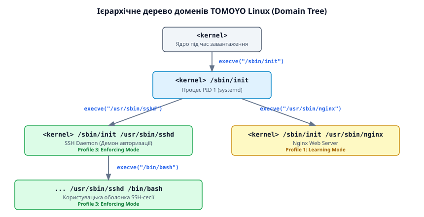
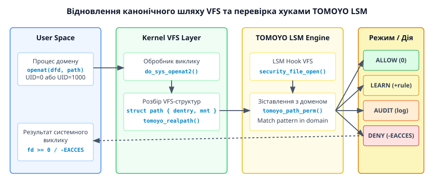

# Політики безпеки TOMOYO Linux: LSM на основі шляхів

<preknowlist>
- [Каркас LSM та хуки ядра](topic:sys-unix/lsm-framework) — перехоплення системних викликів та контрольні точки безпеки у VFS.
- [AppArmor: правила доступу на основі шляхів](topic:sys-unix/apparmor-path-rules) — концепція pathname-based контролю доступу у порівнянні з inode-based.
- [POSIX Capabilities](topic:sys-unix/capabilities) — модель розділення привілеїв суперкористувача у ядрі Linux.
</preknowlist>

У звичайних операційних системах Linux класичний дискреційний контроль доступу (Discretionary Access Control, DAC) спирається на три класи суб'єктів, визначені для кожного об'єкта, — власника (`UID`), групу (`GID`) та решту користувачів, а також на біти прав доступу (`rwx`). Якщо серверний процес Nginx запускається з привілеями суперкористувача (`UID 0`, `root`) для прив'язки до привілейованого 80-го мережевого порту, будь-яка компрометація цього веб-сервера через вразливість виходу за межі каталогу (Directory Traversal) надає зловмиснику необмежений доступ до читання суворо конфіденційного файлу `/etc/shadow`, перезапису конфігурацій системних служб або встановлення шкідливих модулів ядра. Для запобігання цьому у ядро Linux впроваджують системи примусового контролю доступу (Mandatory Access Control, MAC). TOMOYO Linux реалізує модель MAC, яка аналізує не приховані числові мітки дискових об'єктів, а канонічні абсолютні шляхи файлової системи VFS та повну історію запусків процесів.

---

## 1. Архітектурний парадокс примусового контролю доступу

Системи примусового контролю доступу (MAC) у ядрі Linux діляться на дві фундаментальні категорії за способом ідентифікації об'єктів файлової системи: **Inode-based MAC** (яку уособлює підсистема SELinux та Smack) та **Pathname-based MAC** (представлена TOMOYO Linux та AppArmor).

При підході Inode-based мітка безпеки (наприклад, `system_u:object_r:shadow_t:s0`) записується безпосередньо у розширені атрибути файлу (`xattr`) на файловій системі ext4, xfs або btrfs. Коли процес намагається відкрити файл, ядро зчитує мітку безпеки з дискового inode і порівнює її з контекстом процесу. 

Цей підхід має суттєву практичну проблему у реальному системному адмініструванні: первинне розгортання системи вимагає тривалого та трудомісткого ініціалізаційного перемаркування (*relabeling*) мільйонів файлів на блоковому пристрої. Якщо системний адміністратор скопіює файл `/etc/shadow` утилітою `cp` у тимчасовий каталог `/tmp/shadow`, нове створення файлу надасть йому стандартний контекст каталогу призначення `tmp_t`. Після цього традиційні правила SELinux перестануть блокувати доступ до цього файлу для багатьох процесів, хоча його вміст залишається критичним для безпеки всієї операційної системи.

```text
Традиційний Inode-based MAC (SELinux):
[Процес] ───> [VFS Lookup] ───> [Зчитування xattr з Inode] ───> [Перевірка політики]
                                 (Контекст: system_u:object_r:etc_t)

Pathname-based MAC (TOMOYO Linux):
[Процес] ───> [VFS Lookup] ───> [d_path(): канонічний шлях] ───> [Зіставлення з доменом]
                                 (Шлях: /etc/shadow)
```

TOMOYO Linux оперує безпосередньо канонічним абсолютним шляхом до файлу у віртуальній файловій системі VFS (`Virtual File System`). Політика захисту не вимагає модифікації структур файлової системи на диску або запису атрибутів `xattr`. Якщо в домені немає правила `file read /etc/shadow`, доступ буде заблоковано незалежно від того, як файл опинився за цим шляхом, який дисковий inode йому відповідає або яка саме файлова система підмонтована у каталог `/etc`.

---

## 2. Концепція ієрархічного дерева доменів (Domain Tree)

Ключовою архітектурною відмінністю TOMOYO від AppArmor є спосіб визначення контексту безпеки процесу. В AppArmor профіль прив'язується виключно до бінарного файлу: запуск `/usr/sbin/nginx` завжди застосовує профіль Nginx, незалежно від того, яким чином і ким він був запущений.

У TOMOYO Linux контекст безпеки називається **доменом** (Domain). Домен визначається не поодиноким виконуваним файлом, а **повною послідовністю системних викликів `execve()`**, які призвели до запуску даного процесу від моменту старту ядра.


*Ієрархічна структура доменів TOMOYO: від кореневого домену ядра до процесу в сесії користувача.*

Під час завантаження системи перший процес створюється в кореневому домені `<kernel>`. Далі при кожному виконанні виклику `execve()` ядро створює новий піддомен, додаючи абсолютний шлях запущеного бінарного файлу до імені батьківського домену.

Розглянемо ланцюжок створення доменів:
1. Ініціалізація ядра створює процес PID 1:
   `Домен: <kernel> /sbin/init`
2. Системний менеджер `init` (або `systemd`) запускає службу захищеного shell-демона:
   `Домен: <kernel> /sbin/init /usr/sbin/sshd`
3. Авторизований користувач входить через SSH та отримує командну оболонку:
   `Домен: <kernel> /sbin/init /usr/sbin/sshd /bin/bash`
4. Якщо той самий бінарний файл `/bin/bash` буде запущений не користувачем через SSH, а фоновим завданням періодичного планувальника `cron`, його домен матиме абсолютно інший ланцюжок:
   `Домен: <kernel> /sbin/init /usr/sbin/cron /bin/sh /bin/bash`

Цей механізм забезпечує **ізоляцію з урахуванням контексту виклику** (Context-sensitive isolation). Користувацький `bash` у сесії SSH може мати право запускати розробницькі утиліти (`gcc`, `gdb`, `make`), тоді як `bash`, запущений із демона `cron`, позбавлений цих привілеїв і обмежений лише виконанням конкретного скрипта ротації логів чи резервного копіювання.

Внутрішня структура даних ядра описується концепцією `struct tomoyo_domain_info`, яка містить вказівники на батьківський домен, список активних правил доступу (`struct tomoyo_acl_info`) та прив'язаний профіль безпеки.

Розгортання та аргументи щодо прийнятності такої архітектури в основній гілці ядра Linux детально висвітлено у матеріалі [Історія створення TOMOYO та дискусія про path-based MAC](topic:sys-unix/tomoyo-linux-path-based-lsm/hist-tomoyo-pathname-mac.md).

---

## 3. Механізм перехоплення LSM та відновлення канонічних шляхів у VFS

Для перехоплення системних викликів TOMOYO інтегрується в підсистему Linux Security Modules (LSM), реєструючи власні зворотні виклики (hooks) на контрольних точках VFS.


*Послідовність перетворення VFS-структури path у канонічний рядок та проходження перевірки LSM-хуками TOMOYO.*

Коли процес виконує системний виклик (наприклад, `openat(AT_FDCWD, "config.json", O_RDONLY)`), ядро спочатку виконує трансляцію відносного шляху у внутрішню структуру `struct path`, яка складається з посилання на елемент dentry-кешу (`struct dentry`) та зріз підмонтованої файлової системи (`struct vfsmount`).

Перед тим як віддати процесу відкритий файл, VFS викликає LSM-хук `security_file_open()` — окремого хука `security_path_open()` у ядрі немає, відкриття перехоплюється вже на рівні готової `struct file`. У цей момент підсистема TOMOYO виконує такі етапи:

1. **Отримання поточного домену:** Ядро зчитує вказівник `struct tomoyo_domain_info` зі структури опису завдання `task_struct` процесу, який зробив виклик.
2. **Канонізація шляху (Path Normalization):** Викликається внутрішня функція `tomoyo_realpath()`, яка за допомогою системного механізму `d_path()` піднімається вгору по дереву dentry до кореня поточного простору імен монтування (`mount namespace`). На цьому етапі:
   - Шлях будується для вже розв'язаного об'єкта: символьні посилання VFS розкрив ще під час пошуку, тож у рядку їх не лишається.
   - Видаляються відносні елементи `.` та `..`.
   - Додається символ `/` у разі перевірки каталогу.
3. **Зіставлення з правилами домену (Pattern Matching):** Згенерований канонічний рядок (наприклад, `/etc/nginx/nginx.conf`) зіставляється зі списком правил, зареєстрованих у даному домені.
4. **Прийняття рішення відповідно до режиму профілю (Mode Evaluation):** Ядро перевіряє активний режим безпеки домену і повертає `0` для дозволу операції або від'ємний код помилки `-EACCES` (`Permission denied`) для блокування.

Окрім файлових хуків `security_file_open`, `security_path_mkdir`, `security_path_unlink` та `security_path_rename`, TOMOYO контролює мережеві виклики через хуки `security_socket_bind`, `security_socket_listen`, `security_socket_connect`, а також системні привілеї через `security_capable`.

---

## 4. Режими виконання та техніка навчання (Learning Engine)

Однією з найскладніших проблем під час впровадження систем MAC є ручне складання політик. SELinux вимагає написання тисяч рядків складних декларативних правил до запуску системи. TOMOYO Linux вирішує цю проблему за допомогою вбудованого у ядро механізму автоматичного навчання (Learning Engine).

Кожен домен у TOMOYO прив'язується до одного з 256 профілів безпеки. Профіль визначає один із чотирьох режимів виконання:

| Код | Назва режиму | Поведінка ядра при спробі несанкціонованого доступу | Режим запису логів та правил |
| :---: | :--- | :--- | :--- |
| **0** | **Disabled** | Перевірки повністю вимкнено. Запит дозволяється без аналізу. | Правила не записуються. |
| **1** | **Learning** | Запит дозволяється. Ядро **автоматично додає нове правило** у політику домену. | Нові дозволи миттєво з'являються у `domain_policy`. |
| **2** | **Permissive** | Запит дозволяється, але дія вважається порушенням. | Викликається генерація аудит-логу з деталями порушення. |
| **3** | **Enforcing** | Запит **блокується**. Ядро повертає помилку `-EACCES` / `-EPERM`. | Спроба порушення записується в аудит-лог блокувань. |

### Покроковий алгоритм розгортання захисту за допомогою навчання:

1. **Ініціалізація у режимі Learning:** Системний адміністратор переводить кореневий домен `<kernel>` або конкретний піддомен у Профіль 1 (Learning).
2. **Проходження сценаріїв використання (Profiling Pass):** Сервіс або система піддається повноцінному функціональному тестуванню. Запускаються всі легітимні команди, обробляються мережеві запити, виконується ротація логів. Під час кожної дії ядро Linux самостійно розширює політики у пам'яті:
   ```text
   # Автоматично згенеровані ядром правила у домені <kernel> /usr/sbin/nginx:
   file read /etc/nginx/nginx.conf
   file read /etc/ssl/certs/ssl-cert-snakeoil.pem
   file read /var/www/html/index.html
   network inet stream bind 0.0.0.0 80
   network inet stream accept 192.168.1.10 51234
   ```
3. **Оптимізація та узагальнення (Rule Compaction):** Адміністратор переглядає згенерований список правил і замінює тисячі поодиноких файлових операцій шаблонами за допомогою узагальнюючих масок:
   ```text
   # Заміна поодиноких файлів масками: перший рядок — файли самого каталогу,
   # другий — усе вкладене (\{ мусить стояти після «/», а \} — перед «/»):
   file read /var/www/html/\*
   file read /var/www/html/\{\*\}/\*
   ```
4. **Тестування у режимі Permissive:** Профіль переводиться у режим 2. Якщо під час роботи виникають незадокументовані операції, ядро сповіщає про це у логах, але не зупиняє сервіс.
5. **Фіксація у режимі Enforcing:** Після підтвердження повноти політики домен переводиться у режим 3 (Enforcing). Будь-яка спроба виконання чужорідного коду або зчитування неавторизованих файлів блокується ядром на межі LSM-хуків.

Для запобігання атакам типу "виснаження пам'яті ядра" (Kernel OOM Exhaustion) у режимі навчання, профіль містить ліміт на кількість вивчених записів — `PREFERENCE::learning={ max_entry=2048 }` (типово 2048 записів на домен). При досягненні ліміту ядро виставляє в домені прапорець `quota_exceeded` і припиняє накопичення нових правил.

---

## 5. Структура політик та анатомія SecurityFS

Управління підсистемою TOMOYO здійснюється через віртуальну файлову систему SecurityFS, яка зазвичай монтується за шляхом `/sys/kernel/security/tomoyo/`. На відміну від SELinux, де політики компілюються у бінарні файли (`.pp`), TOMOYO використовує повністю текстовий формат, доступний для читання та запису безпосередньо з консолі або системних скриптів.

```text
/sys/kernel/security/tomoyo/
├── domain_policy      # Політики доменів та їхні індивідуальні правила
├── exception_policy   # Глобальні винятки, псевдоніми та групи
├── profile            # Конфігурація 256 профілів безпеки
├── manager            # Список доменів із правами модифікації політик
├── stat               # Статистика використання пам'яті та лічильники
└── audit              # Інтерфейс потокового аудит-логу
```

### Формат правил у domain_policy

Файл `domain_policy` розбитий на блоки, кожен з яких вказує на конкретну позицію у дереві доменів:

```text
<kernel> /usr/sbin/sshd /bin/bash
use_profile 3

file read /etc/passwd
file read /etc/environment
file execute /usr/bin/git
file execute /usr/bin/vim
network inet stream connect 192.168.1.1 22
```

Глобальні винятки та агреговані групи шляхів (`path_group`) оголошуються у файлі `exception_policy`. Це дозволяє об'єднувати типові ресурси (оголошення `path_group EXECUTABLES /bin/\*`, а в самому правилі — `file execute @EXECUTABLES`) і посилатися на них у правилах багатьох доменів одночасно.

Повний синтаксичний перелік операторів, масок та параметрів умов наведено у файлі [Повний синтаксичний довідник правил та файлів SecurityFS TOMOYO](topic:sys-unix/tomoyo-linux-path-based-lsm/api-tomoyo-policy-syntax.md).

---

## 6. Практичний життєвий цикл розгортання та конфігурація (Workflow)

Для демонстрації повного циклу захисту системи налаштуємо примусове обмеження для ізольованого демона бази даних або веб-сервера.

```
+-------------------------------------------------------------------+
|  1. Активація параметра ядра: security=tomoyo                      |
+-------------------------------------------------------------------+
                                  │
                                  ▼
+-------------------------------------------------------------------+
|  2. Завантаження базових винятків через tomoyo-init                |
+-------------------------------------------------------------------+
                                  │
                                  ▼
+-------------------------------------------------------------------+
|  3. Включення режиму Навчання (Learning Mode, Profile 1)           |
+-------------------------------------------------------------------+
                                  │
                                  ▼
+-------------------------------------------------------------------+
|  4. Виконання тестового навантаження сервісу                       |
+-------------------------------------------------------------------+
                                  │
                                  ▼
+-------------------------------------------------------------------+
|  5. Перевірка та узагальнення правил через tomoyo-editpolicy       |
+-------------------------------------------------------------------+
                                  │
                                  ▼
+-------------------------------------------------------------------+
|  6. Активація режиму Блокування (Enforcing Mode, Profile 3)        |
+-------------------------------------------------------------------+
```

### Крок 1: Конфігурація параметрів завантаження ядра

Для активації TOMOYO під час старту операційної системи у завантажувач GRUB (файл `/etc/default/grub`) додаються параметри ядра:

```text
GRUB_CMDLINE_LINUX_DEFAULT="security=tomoyo TOMOYO_trigger=/sbin/init"
```

Параметр `TOMOYO_trigger` називає програму, запуск якої вмикає завантаження політики: щойно ядро збирається виконати `/sbin/init`, воно спершу запускає завантажувач `/sbin/tomoyo-init` (шлях до нього змінює окремий параметр `TOMOYO_loader=`), і той переносить початкові файли конфігурації з `/etc/tomoyo/` в оперативну пам'ять ядра до старту користувацьких процесів.

### Крок 2: Управління політиками через tomoyo-editpolicy

Пакет утиліт `tomoyo-tools` надає консольний ncurses-інтерфейс `tomoyo-editpolicy`, який дозволяє у реальному часі навігувати по дереву доменів, перемикати профілі та редагувати правила доступу.

Для програмної взаємодії із SecurityFS у власних сервісах та автоматизованих скриптах використовується низькорівневий C/C++ API. Практичну програму моніторингу та запису правил наведено у матеріалі [Програмна взаємодія із SecurityFS TOMOYO мовами C та C++](topic:sys-unix/tomoyo-linux-path-based-lsm/proj-tomoyo-policy-editor.md).

---

## 7. Механізми самозахисту системи та перекриття векторів обходу

При використанні системи захисту на основі шляхів VFS виникає природне питання: чи може зловмисник, що отримав привілеї користувача `root` (UID 0), обійти правила TOMOYO за допомогою системних викликів `mount`, `chroot` або створення жорстких посилань?

TOMOYO Linux містить комплекс вбудованих ядерних механізмів самозахисту:

### 1. Захист інтерфейсу SecurityFS через `manager.conf`
Навіть якщо зловмисник отримує права `root`, він не зможе відредагувати вміст `/sys/kernel/security/tomoyo/domain_policy` або вимкнути профіль безпеки. Зміна політик дозволена **виключно тим доменам, які явно внесені до файлу `manager.conf`**:

```text
# Вміст /etc/tomoyo/manager.conf:
<kernel> /sbin/tomoyo-init
<kernel> /usr/sbin/tomoyo-editpolicy
<kernel> /usr/sbin/tomoyo-loadpolicy
```

Якщо домен зловмисника (`<kernel> /sbin/init /usr/sbin/nginx /bin/sh`) виконає спробу запису в `domain_policy`, ядро відхилить її з помилкою `EPERM`.

### 2. Контроль операцій створення посилань (`file link` та `file rename`)
Для запобігання атакам через жорсткі посилання (`hardlinks`), коли зловмисник створює нове ім'я для критичного файлу (наприклад, `ln /etc/shadow /tmp/link_shadow`), TOMOYO перехоплює виклик `link()` і перевіряє дозволи за обома шляхами:
```text
file link /etc/shadow /tmp/link_shadow
```
Якщо в політиці домену відсутнє явне правило створення посилання між цими двома шляхами, операцію буде заблоковано.

### 3. Захист від маніпуляцій з VFS (`mount`, `pivot_root`, `chroot`)
Переміщення файлових систем дозволяє змінити канонічний шлях об'єкта. TOMOYO вимагає явного дозволу на будь-які моунт-операції:
```text
file mount /dev/sdb1 /mnt/data ext4 0
file chroot /var/empty
```
Без наявності правил `file chroot` процес не зможе змінити свій кореневий каталог для приховування справжніх шляхів VFS.

### 4. Межа моделі: виконання через пам'ять
Зловмисник може спробувати обійти заборону `file execute`, відкривши бінарний файл як звичайні дані й передавши керування на сторінку, змаповану через `mmap()` з прапорцем `PROT_EXEC`. Окремого правила на цей сценарій TOMOYO 2.x не має: хуків на `mmap()` та `mprotect()` модуль не реєструє. Єдина перешкода тут — правило `file read`: щоб змапувати файл, процес мусить спершу його відкрити, а це відкриття вже проходить через `security_file_open`. Тому вектор закривається побічно — забороною читати ті каталоги, куди домен може писати; повного контролю над `PROT_EXEC` path-based модель не дає.

---

## 8. Порівняльний аналіз: TOMOYO проти SELinux, AppArmor та Landlock

Для вибору оптимальної системи примусового контролю доступу необхідно зіставити їхні архітектурні характеристики:

| Критерій порівняння | TOMOYO Linux | SELinux | AppArmor | Landlock LSM |
| :--- | :--- | :--- | :--- | :--- |
| **Базовий об'єкт** | Канонічний шлях VFS + Історія викликів | Inode + Розширені атрибути (`xattr`) | Шлях файлу (Pathname) | Правила на процес у просторі користувача |
| **Контекст процесу** | Дерево доменів (`<kernel> ...`) | Контекст безпеки (`user:role:type`) | Профіль бінарного файлу | Набір правил (ruleset), який процес накладає на себе сам і передає нащадкам |
| **Автоматичне навчання** | **Вбудоване у ядро в реальному часі** | Зовнішній аналіз логів (`audit2allow`) | Зовнішній аналіз логів (`aa-logprof`) | Відсутнє (програмний API) |
| **Складність розгортання** | **Низька** (прості текстові конфігурації) | Дуже висока (потрібні спеціальні знання) | Середня | Низька (для розробників ПЗ) |
| **Потреба змінювати дані на диску** | Не потрібна | Потрібне первинне розмічування файлів | Не потрібна | Не потрібна |
| **Обсяг коду в ядрі** | Порядок десяти тисяч рядків C — найменший серед повноцінних MAC | Найбільший із чотирьох: у кілька разів більший за TOMOYO | Того ж порядку, що TOMOYO | Найменший загалом — вужча задача |

### Сфера застосування TOMOYO Linux:

- **Вбудовані системи (Embedded Linux):** Завдяки мінімальному розміру ядерного коду та відсутності потреби зберігати `xattr` на файловій системі, TOMOYO є ідеальним вибором для роутерів, IoT-пристроїв та медичного обладнання.
- **Швидке захищення легасі-серверів:** Коли необхідно терміново захистити критичний веб-сервер або базу даних без зупинки виробничого середовища та розгортання масштабної інфраструктури SELinux.
- **Строгий контроль ланцюжків виконання:** Коли бінарний файл повинен мати різні права доступу залежно від того, яка саме служба або скрипт його викликали.

---

## 9. Підсумок

TOMOYO Linux пропонує елегантну та прагматичну модель примусового контролю доступу, яка усуває головний недолік класичних систем MAC — надмірну складність налаштування та адміністрування. Завдяки ієрархічній структурі доменів на основі історії системних викликів `execve()` та вбудованому механізму автоматичного навчання у реальному часі, TOMOYO дозволяє створити надійне та прозоре безпекове середовище для критичних служб Linux із мінімальними накладними витратами.
