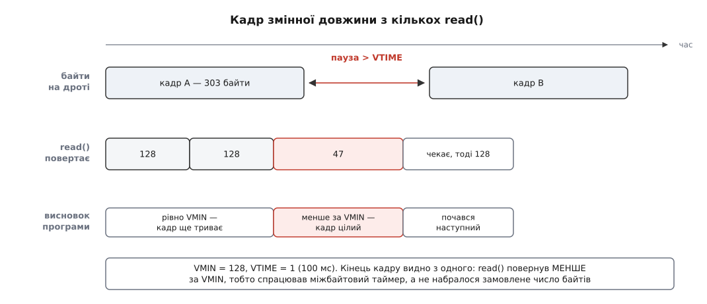

# ⚙️ Розмова з платою: від open() до цілого кадру

Робоча програма мовою C, яка відкриває `/dev/ttyUSB0`, ставить сирий режим 115200 8N1, збирає кадр змінної довжини за паузою на лінії й повертає порт у застаний стан на кожному шляху виходу — зокрема з-під `Ctrl+C`. Далі — три помилки, зроблені навмисно, бо кожна дає симптом, за яким її з першого разу не впізнаєш.

## Що треба зробити

Плата шле кадри від десятка байтів до кількох сотень. Дані двійкові: законний будь-який байт від `0x00` до `0xFF`. Поля довжини немає, роздільника немає — між кадрами плата просто мовчить.

Вимоги до читача звідси випливають самі. Віддавати нагору цілі кадри й не склеювати сусідні. Не зависати навіки, коли на лінії загубився байт. Не лишити порт зіпсованим, коли програму зупинять з клавіатури.

## Три рішення

**Де кінець кадру.** Роздільника немає, отже, єдина межа — тиша, і ловити її вміє саме ядро. При `VMIN` > 0 і `VTIME` > 0 таймер `VTIME` запускається після першого прийнятого байта й скидається кожним наступним; `read` повертається тоді, коли або назбиралося `VMIN` байтів, або таймер догорів. Звідси ознака, на якій тримається вся програма: **`read` повернув менше за `VMIN` — була пауза, кадр цілий**. Повернув рівно `VMIN` — просто скінчилося замовлене місце, читаємо далі.

**Скільки замовляти.** `VMIN` лежить у масиві `c_cc`, а елемент того масиву має тип `cc_t`, тобто байт: більше за 255 туди не поставити. Беремо 128 і **рівно стільки** просимо в кожного `read`. Це не косметика: попросимо менше — і `read` поверне, щойно набереться замовлене, а ознака «менше за замовлене» перестане означати «була пауза».



*Перший `read` спить, доки плата не заговорить: міжбайтовий таймер не починає відлік, поки не прийшов перший байт.*

**Як не зіпсувати порт.** Налаштування належать пристроєві, а не процесові, тож із програми має бути один вихід — і одне відновлення. Обробник `SIGINT` не робить нічого, крім прапорця, бо звідти дозволено викликати лише функції з вузького переліку ([безпечність у обробнику сигналу](topic:sys-unix/async-signal-safety) — код, що виконується посеред будь-якого рядка головної програми, не має права чіпати те, що та могла лишити в напівстані). `tcsetattr`, до речі, у тому переліку є, тож відновити стан просто з обробника було б законно — але тоді відновлення жило б у двох місцях, а дескриптор довелося б виносити в глобальні.

Лишається пояснити, як сплячий `read` дізнається про прапорець. Обробник ставимо **без** `SA_RESTART`: тоді сигнал вириває виклик з очікування помилкою `EINTR`, керування само повертається в цикл, і умова циклу бачить прапорець ([EINTR і перезапуск викликів](topic:sys-unix/eintr-and-restart) — перерваний сигналом повільний виклик або повертає помилку, або мовчки починається наново, і що саме — вирішує прапорець при встановленні обробника).

## Програма

```c
/* serial.c — кадри змінної довжини з послідовного порту.
 * gcc -O2 -Wall -o serial serial.c        запуск: ./serial /dev/ttyUSB0
 */
#define _DEFAULT_SOURCE          /* cfmakeraw і CRTSCTS — розширення поза POSIX */
#include <termios.h>
#include <fcntl.h>
#include <unistd.h>
#include <signal.h>
#include <errno.h>
#include <time.h>
#include <stdio.h>
#include <string.h>

#define CHUNK     128            /* = VMIN; c_cc — масив cc_t, стеля 255 */
#define FRAME_MAX 4096

static volatile sig_atomic_t stop = 0;

static void on_stop(int sig)
{
    (void) sig;
    stop = 1;                    /* більше нічого: решту зробить головний цикл */
}

/* Сирий 8N1 на заданій швидкості; вихідний стан лягає в *saved. */
static int port_setup(int fd, speed_t baud, struct termios *saved)
{
    const tcflag_t want_c = CLOCAL | CREAD;
    struct termios tio, back;

    if (tcgetattr(fd, saved) < 0)          /* знімок ДО будь-яких змін */
        return -1;
    tio = *saved;

    cfmakeraw(&tio);                       /* ICANON, ECHO, ISIG, OPOST, IXON — геть */
    cfsetispeed(&tio, baud);
    cfsetospeed(&tio, baud);

    tio.c_cflag |=  want_c;                /* саме цих двох cfmakeraw НЕ чіпає */
    tio.c_cflag &= ~(CSTOPB | CRTSCTS);    /* один стоповий біт, без RTS/CTS   */
    tio.c_cc[VMIN]  = CHUNK;               /* стільки ж просимо в read()       */
    tio.c_cc[VTIME] = 1;                   /* пауза 100 мс = кінець кадру      */

    if (tcsetattr(fd, TCSAFLUSH, &tio) < 0)
        return -1;

    /* tcsetattr каже «успіх», застосувавши ХОЧ ЩОСЬ. Звіряємо саме замовлене. */
    if (tcgetattr(fd, &back) < 0)
        return -1;
    if ((back.c_lflag & (ICANON | ECHO | ISIG))          != 0      ||
        (back.c_iflag & (IXON | ICRNL | INLCR | ISTRIP)) != 0      ||
        (back.c_oflag &  OPOST)                          != 0      ||
        (back.c_cflag & (PARENB | CSTOPB | CRTSCTS))     != 0      ||
        (back.c_cflag &  CSIZE)                          != CS8    ||
        (back.c_cflag &  want_c)                         != want_c ||
        back.c_cc[VMIN] != CHUNK || back.c_cc[VTIME] != 1          ||
        cfgetospeed(&back) != baud) {
        errno = EINVAL;                    /* драйвер узяв не все */
        return -1;
    }
    return 0;
}

/* Один кадр: діждатися початку й добирати, доки не буде паузи.
 * > 0 — довжина, 0 — пристрій зник, -1 — помилка в errno. */
static ssize_t read_frame(int fd, unsigned char *buf, size_t cap)
{
    size_t len = 0;

    for (;;) {
        ssize_t n;

        if (cap - len < CHUNK) {           /* коротший запит зіпсував би ознаку */
            errno = EMSGSIZE;
            return -1;
        }
        n = read(fd, buf + len, CHUNK);
        if (n < 0)
            return -1;                     /* зокрема EINTR — розбереться той, хто кликав */
        if (n == 0)                        /* перехідник від'єднали */
            return (ssize_t) len;
        len += (size_t) n;
        if (n < CHUNK)                     /* спрацював міжбайтовий таймер */
            return (ssize_t) len;
    }
}

int main(int argc, char **argv)
{
    const char *dev = (argc > 1) ? argv[1] : "/dev/ttyUSB0";
    struct timespec settle = { 1, 500L * 1000 * 1000 };   /* 1.5 с */
    unsigned char frame[FRAME_MAX];
    struct termios saved;
    struct sigaction sa;
    int fd, rc = 0;

    fd = open(dev, O_RDWR | O_NOCTTY);     /* порт не стає керуючим терміналом */
    if (fd < 0) {
        perror(dev);
        return 1;
    }
    if (port_setup(fd, B115200, &saved) < 0) {
        perror("port_setup");
        close(fd);
        return 1;
    }

    memset(&sa, 0, sizeof sa);
    sa.sa_handler = on_stop;
    sigemptyset(&sa.sa_mask);
    sa.sa_flags = 0;                       /* без SA_RESTART: хай read() вертає EINTR */
    sigaction(SIGINT,  &sa, NULL);
    sigaction(SIGTERM, &sa, NULL);

    nanosleep(&settle, NULL);              /* DTR на відкритті міг перезапустити плату */
    tcflush(fd, TCIFLUSH);                 /* усе, що встигло прийти дорогою, — геть */

    while (!stop) {
        ssize_t len = read_frame(fd, frame, sizeof frame);
        ssize_t i;

        if (len < 0) {
            if (errno == EINTR)
                continue;                  /* прапорець перевірить умова циклу */
            perror("read");
            rc = 1;
            break;
        }
        if (len == 0) {
            fprintf(stderr, "%s: пристрій зник\n", dev);
            rc = 1;
            break;
        }
        printf("кадр %4zd Б:", len);
        for (i = 0; i < len && i < 8; i++)
            printf(" %02X", frame[i]);
        printf("%s\n", len > 8 ? " …" : "");
    }

    tcsetattr(fd, TCSANOW, &saved);        /* один вихід — одне відновлення */
    close(fd);
    return rc;
}
```

Два місця тут варті окремого слова.

**`cfmakeraw` не ставить `CLOCAL` і `CREAD`.** Перелік того, що ця функція чіпає, скінченний і короткий: вхідні перетворення, `OPOST`, локальні прапорці й розмір символу. Модемні лінії та дозвіл приймачеві приймати — не її справа, і саме на цьому будується друга з навмисних помилок нижче.

**Звірка після запису — не паранойя, а угода виклику.** В описі виклику це сказано буквально: `tcsetattr` повертає успіх, якщо вдалося застосувати **бодай одну** із запитаних змін, тому після кількох змін варто перевірити результат окремим `tcgetattr`. Звіряти треба саме замовлені біти, а не всю структуру побайтово: у `struct termios` є вирівнювальні проміжки й поля, яких ви не торкалися, а швидкість драйвер має право нормалізувати по-своєму. Порівняння всієї структури дасть хибну тривогу, порівняння масок дасть відповідь.

## Три навмисні помилки

### `VTIME` = 0: вічне чекання на загубленому байті

Змінюємо один рядок:

```c
tio.c_cc[VTIME] = 0;                       /* було 1 */
```

Підступ у тому, що спочатку симптому немає. `VMIN`=128 з `VTIME`=0 означає «спати, доки не набереться рівно 128 байтів, скільки б це не тривало». Поки плата шле щільно, лічильник рухається, `read` повертається, програма щось друкує. Але межі кадрів зникли: сто двадцять вісім байтів набираються з двох сусідніх кадрів, тож кожен «кадр» на виході — зсунутий шматок чужих даних, і контрольна сума не сходиться то на кожному, то через раз.

А коли плата замовкла, віддавши 47 байтів, програма стає намертво: умова «ще 81 байт» більше ніколи не справдиться. Ззовні це — зависання без причини; всередину заглядають так:

```
$ strace -p 12345
read(3,                                    ← увійшло й не вийшло
$ cat /proc/12345/wchan
n_tty_read
```

Процес спить не у вашому коді й не в драйвері, а в лінійній дисципліні, чекаючи на умову, яку сам собі й задав.

### Забутий `CLOCAL`: зависання в самому `open`

```c
tio.c_cflag |= CREAD;                      /* було CLOCAL | CREAD */
```

Цей симптом іншого жанру: програма не друкує **нічого** — навіть повідомлення про помилку, — бо вона й не почала виконуватися. Вона стоїть в `open`.

Стандарт каже прямо: відкриття термінального пристрою зі знятим `O_NONBLOCK` блокує потік, доки пристрій не стане готовим, а при знятому `CLOCAL` «готовий» означає «поки не встановиться з'єднання» — тобто поки на лінії `DCD` не з'явиться несуча. Модема на іншому кінці немає й не буде, отже, чекання вічне.

Найгірше тут те, що помилка ховається за порядком викликів: `CLOCAL` ставить `port_setup`, а `port_setup` кличуть **після** `open` — коли зависання вже сталося. Додайте сюди звичку багатьох USB-перехідників тримати `DCD` піднятим постійно: на вашому столі все працює, а на іншому перехіднику програма мовчить.

Коли порт мусить відкриватися негайно, обхід стандартний:

```c
fd = open(dev, O_RDWR | O_NOCTTY | O_NONBLOCK);          /* не чекати несучої */
port_setup(fd, B115200, &saved);                         /* тут з'явиться CLOCAL */
fcntl(fd, F_SETFL, fcntl(fd, F_GETFL) & ~O_NONBLOCK);    /* тепер можна спати */
```

Останній рядок обов'язковий: `VMIN` і `VTIME` діють лише в блокуючому режимі, а з `O_NONBLOCK` `read` повертається негайно з тим, що встигло накопичитися ([блокуючий і неблокуючий режим](topic:sys-unix/blocking-and-nonblocking) — один прапорець вирішує, чекає виклик на дані чи одразу зізнається, що їх немає).

### Лишений `IXON`: дані, що зникають

Ця помилка приходить до того, хто збирає прапорці руками замість `cfmakeraw`:

```c
tio.c_iflag &= ~(ICRNL | INLCR | ISTRIP);  /* про IXON забули */
```

Симптомів два, і обидва залежать від даних, тобто виглядають як несправність заліза.

Перший: із прийнятого потоку зникають байти `0x11` і `0x13`. Це коди `DC1` і `DC3`, вони ж `Ctrl+Q` і `Ctrl+S`, вони ж START і STOP програмного керування потоком. При ввімкненому `IXON` лінійна дисципліна тлумачить їх як команди й до програми не пропускає. У двійкових даних кожен трапляється приблизно раз на 256 байтів — тож частина кадрів приходить на байт коротшою, і контрольна сума падає на одних кадрах, а на інших сходиться.

Другий гірший: `0x13` не просто зникає, а **зупиняє вашу передачу**. Це і є його робота — сказати «замовкни». Відновить її лише `0x11`, якого плата, звісно, не пошле, бо вона нічого не зупиняла. Ваш `write` заповнить вихідну чергу й засне назавжди.

Перевіряють це не в коді, а ззовні:

```
$ stty -F /dev/ttyUSB0 -a
...
-ignbrk -brkint -ignpar -parmrk -inpck -istrip -inlcr -igncr -icrnl ixon
-ixoff -iuclc -ixany -imaxbel -iutf8
...
```

Мінус перед назвою означає «вимкнено»; `ixon` без мінуса — знайшли. Чесна заміна програмному керуванню потоком — апаратне, `CRTSCTS`: воно бере окремі дроти, а не два коди з двохсот п'ятдесяти шести ([керування потоком](topic:com-transport/flow-control) — навіщо приймачеві взагалі спиняти передавача і які є способи це сказати).

## Ціна й пастки

**Відкриття перезапускає плату.** Більшість драйверів піднімає `DTR` одразу на `open`, а на платах, де `DTR` (а часом і `RTS`) заведено на скидання чи на вибір режиму завантаження, це буквально перезапуск. Espressif описує таку схему для ESP32 прямо: `DTR` і `RTS` перехідника йдуть на `GPIO0` та `EN`, і деякі системи чи драйвери піднімають ці лінії самі при відкритті порту. Звідси півторасекундна пауза й `tcflush` у коді. Радикальніші ліки — `stty -F /dev/ttyUSB0 -hupcl`, щоб лінії не опускалися ще й на закритті (це другий перезапуск), або перехідник без цього кола.

**Кадр рівно на 128·k байтів.** Останній `read` поверне повні 128, ознака паузи не спрацює, цикл попросить ще — і засне до наступного кадру, склеївши два. Всередині `termios` ліків немає: пауза як межа не вміє відрізнити «кадр скінчився рівно» від «кадр триває». Ліки — у протоколі: поле довжини або роздільник з екрануванням. Взяти `VMIN` = 255 (число, на яке довжини діляться рідше) — це не розв'язок, а зсув шансів.

**Найдрібніший `VTIME` — 0.1 с.** Ось що це означає на 115200 бод:

```
байт 8N1     = 10 бітів ÷ 115200          ≈ 86.8 мкс
найменший VTIME = 1 ÷ 10 с                 = 100 мс
байтів у ньому  = 0.1 ÷ 86.8·10⁻⁶         ≈ 1152
```

Найкоротша пауза, яку `termios` узагалі здатен назвати, — це тиша завдовжки з тисячу з гаком байтів. Протоколи, де міжкадровий проміжок задано в символах, ця межа відрізає геть: [Modbus RTU](topic:com-protocol/modbus) вимагає 3.5 символьних інтервалів, а це на 115200 близько 304 мкс — більш ніж на два порядки менше за найменше, що тут узагалі можна виразити. Там кадрування або переносять у сам протокол, або міряють час самі навколо `poll` на порту з `VMIN`=0 і `VTIME`=0 ([select, poll, epoll](topic:sys-unix/select-poll-epoll) — способи спитати ядро, на якому з дескрипторів уже є дані, і скільки чекати). З одним чесним застереженням: звичайний планувальник не гарантує точності в сотні мікросекунд, тож надійно виходить лише там, де межі кадрів позначає залізо або драйвер.

**`EINTR` посеред кадру коштує кадру.** Накопичене живе в локальній змінній `read_frame`, тож повторний виклик після перерваного `read` починає з нуля. Поки встановлено лише `SIGINT` і `SIGTERM`, після яких ми й так виходимо, це нічого не важить; щойно з'явиться періодичний сигнал — таймер, `SIGCHLD` від нащадка — буфер і довжину доведеться винести назовні.

**Відновлення не переживе `SIGKILL` чи падіння.** Обробника для `SIGKILL` не буває, а після `SIGSEGV` виконувати вже нічого. Порт лишиться сирим — платі байдуже, а от якщо тим самим кодом відкрили справжній термінал, наступна програма застане його без відлуння й без збирання рядків. Зсередини процесу цьому не зарадиш: рятує лише зовнішня обгортка, яка тримає збережений стан і повертає його після того, як нащадок помер.
