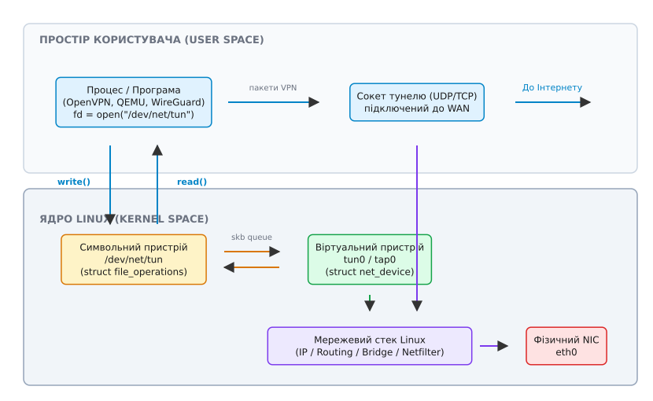
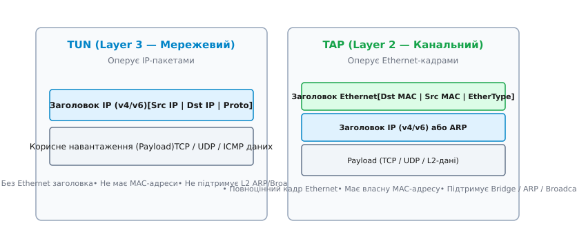
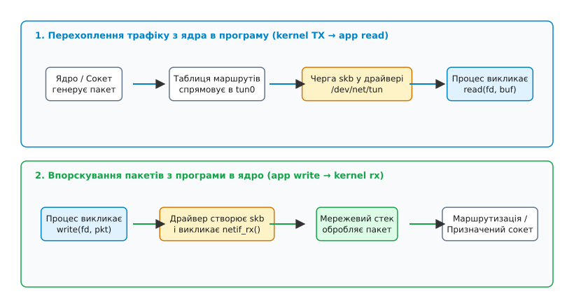

# TUN/TAP: віртуальні інтерфейси

<preknowlist>
- [Ядро й простір користувача](topic:sys-unix/kernel-and-userspace) — взаємодія користувацьких процесів із ядром через системні виклики та VFS.
- [Мережеві інтерфейси та адреси](topic:sys-unix/interfaces-and-addresses) — пакети, кадри, мережеві пристрої та маршрутизація в ядрі.
</preknowlist>

Уявімо розробку демона VPN-тунелювання або гіпервізора віртуальних машин (на кшталт QEMU чи Firecracker), якому необхідно перехоплювати мережеві пакети, згенеровані іншими процесами в системі, шифрувати їх і відправляти через зовнішній сокет — або ж впорскувати довільні кадри в мережевий стек ядра так, ніби вони фізично надійшли з мережевого кабелю. Звичайний мережевий сокет (`AF_INET`, `SOCK_STREAM` чи `SOCK_DGRAM`) прив'язується до конкретної комбінації IP-адреси та порту й працює на верхніх рівнях стеку; він не здатний пред'явити ядру новий мережевий пристрій, з яким система оперувала б через таблицю маршрутизації (`ip route`). Спроба реалізувати подібну ізоляцію чи тунелювання без спеціального механізму змусила б розробника писати власні модулі ядра для кожної зміни мережевої топології. Віртуальні мережеві інтерфейси **TUN** (Network TUNnel) та **TAP** (Network TAP) вирішують цю проблему, надаючи гібридний зв'язок між файловими дескрипторами простору користувача та мережевою підсистемою ядра Linux через символьний пристрій `/dev/net/tun`.

## Внутрішня анатомія мережевого пристрою в Linux

Щоб зрозуміти принцип роботи TUN/TAP, необхідно зіставити його з традиційною мережевою картою (Physical NIC). У класичному фізичному пристрої (наприклад, `eth0`) обробка трафіку спирається на апаратні переривання та кільцеві буфери прямого доступу до пам'яті (DMA RX/TX ring buffers). Коли з дроту надходить пакет, фізичний контролер записує його в оперативну пам'ять хоста, генерує переривання IRQ, а драйвер ядра викликає функцію `netif_rx()` або використовує підсистему NAPI (New API), передаючи пакет у вигляді структури сокетного буфера `sk_buff` у мережевий стек ядра. Відправка пакета відбувається у зворотному порядку: ядро викликає метод драйвера `dev_start_xmit()`, який програмує регістри NIC на передачу даних по фізичному каналу.

TUN/TAP змінює джерело та приймач даних. Для підсистеми VFS (Virtual File System) цей пристрій виглядає як звичайний символьний файл `/dev/net/tun`, з яким програма взаємодіє за допомогою стандартних викликів `read()` та `write()`. Водночас для мережевої підсистеми ядра (Network Subsystem) той самий об'єкт реєструється як повноцінний мережевий інтерфейс зі власною структурою `struct net_device` (`tun0`, `tap0` тощо).


*_Двояка природа TUN/TAP: символьний пристрій для простору користувача та мережевий інтерфейс для ядра._*

Коли програма в просторі користувача відкриває файл `/dev/net/tun` і виконує спеціальний виклик `ioctl` із командою `TUNSETIFF`, ядро створює прив'язку між повернутим файловим дескриптором `fd` та новим мережевим інтерфейсом. Відтепер будь-яка операція запису `write(fd, ...)` сприймається ядром як надходження кадру з мережі (RX path), а будь-який пакет, спрямований ядром у цей інтерфейс згідно з таблицею маршрутизації, очікуватиме у черзі на читання викликом `read(fd, ...)` (TX path).

Двояка природа TUN/TAP виявляється у тому, що один і той самий об'єкт ядра оперує двома таблицями операцій:
- **Операції VFS (`struct file_operations`):** Обслуговують системні виклики `tun_chr_read()`, `tun_chr_write()`, `tun_chr_poll()`, `tun_chr_ioctl()`, дозволяючи процесу простору користувача працювати з мережевим трафіком як з потоком байтів.
- **Операції мережевого пристрою (`struct net_device_ops`):** Обслуговують внутрішні ядерні функції `tun_net_xmit()`, `tun_net_open()`, `tun_net_close()`, інтегруючи віртуальний пристрій у плани підсистеми маршрутизації та фільтрації.

Детальніше про походження універсального драйвера та розробку проєкту VTun дивіться у вставці [📜 Історія універсального драйвера TUN/TAP](topic:sys-unix/tun-tap/hist-universal-tun-tap.md).

## TUN проти TAP: розділення на L3 та L2

Незважаючи на те, що обидва типи інтерфейсів створюються через один і той самий пристрій `/dev/net/tun` і використовують спільний API системних викликів, вони працюють на різних рівнях мережевої моделі OSI. Це фундаментально визначає формат даних у буфері та сфери застосування.


*_Структурна відмінність між пакетами TUN (L3) та кадрами TAP (L2)._*

### Інтерфейс TUN (Layer 3 — Мережевий рівень)

Пристрій TUN (Network TUNnel) працює на мережевому рівні L3 і оперує чистими **IP-пакетами** (IPv4 або IPv6).

- **Формат даних:** Буфер, зчитаний з дескриптора TUN, починається безпосередньо із заголовка IP-пакета (або з 4-байтового метазаголовка `struct tun_pi`, якщо не вказано прапорець `IFF_NO_PI`). У ньому відсутній заголовок Ethernet.
- **Відсутність MAC-адреси:** Інтерфейс TUN не має апаратної адреси (MAC). Системна утиліта `ip link show tun0` відображає прапор `NOARP`, а тип пристрою позначається як `POINTOPOINT` або `UNSPEC`.
- **Маршрутизація та ARP:** Оскільки на L3 відсутнє поняття кадру Ethernet, інтерфейс TUN не підтримує протокол розпізнавання адрес ARP (Address Resolution Protocol) та широкомовні запити канального рівня (L2 Broadcast/Multicast). Маршрутизація трафіку в TUN відбуваються виключно на основі таблиці IP-маршрутів ядра.
- **Ефективність:** Відсутність 14-байтового заголовка Ethernet зменшує накладні витрати на передачу трафіку (overhead) та усуває потребу обробляти широкомовний «сміттєвий» трафік локальної мережі.

Основне застосування TUN — маршрутизовані VPN-тунелі (OpenVPN у режимі `dev tun`, WireGuard-go, Tailscale, IP-in-IP тунелі).

### Інтерфейс TAP (Layer 2 — Канальний рівень)

Пристрій TAP (Network TAP) працює на канальному рівні L2 і оперує повноцінними **кадрами Ethernet** (Ethernet frames).

- **Формат даних:** Буфер містить повний 14-байтовий заголовок Ethernet (MAC-адреса призначення, MAC-адреса відправника, поле EtherType), за яким слідує корисне навантаження (IP-пакет, ARP-запит, PPPoE тощо).
- **Наявність MAC-адреси:** Ядро призначає інтерфейсу `tap0` віртуальну MAC-адресу (яку можна змінити вручну).
- **Підтримка L2-протоколів:** TAP повністю підтримує широкомовні (Broadcast) та багатоадресні (Multicast) кадри, ARP-запити, а також не-IP протоколи (IPX, NetBEUI, AppleTalk).
- **Об'єднання у міст (Bridging):** Інтерфейс TAP можна додавати до мережевого мосту Linux (Linux Bridge) за допомогою команди `ip link set tap0 master br0`. Це дозволяє об'єднувати віртуальний пристрій з фізичною мережевою картою `eth0` на канальному рівні, роблячи його повноцінним портом віртуального комутатора.

Основне застосування TAP — системи віртуалізації (QEMU/KVM, VirtualBox, Cloud Hypervisor) для надання гостьовим віртуальним машинам емуляції фізичної мережевої карти, а також мостові VPN (OpenVPN у режимі `dev tap`).

## Механіка передачі пакетів та життєвий цикл в ядрі

Щоб простежити шлях пакета через TUN/TAP, розглянемо два зустрічних напрямки руху: відправка з ядра в програму користувача та впорскування з програми користувача в ядро.


*_Послідовність викликів при зчитуванні та впорскуванні пакетів через `/dev/net/tun`._*

### 1. Шлях TX: Перехоплення трафіку (Ядро → Програма)

1. Локальний процес створює звичайний сокет або приймає транзитний пакет з іншого мережевого інтерфейсу.
2. Мережевий стек ядра виконує пошук у таблиці маршрутизації (`fib_lookup`). Якщо цільова IP-адреса відповідає маршруту, що вказує на `tun0`, ядро обирає `tun0` як вихідний пристрій (`egress dev`).
3. Ядро формує сокетний буфер `sk_buff` і викликає драйверну функцію передачі `tun_net_xmit()`.
4. Драйвер TUN не відправляє дані на фізичний трансивер. Замість цього він розміщує `sk_buff` у внутрішній приймальній черзі дескриптора пристрою (`tun_file->tx_array`) та пробуджує потоки користувача, які очікують на події через `select()`, `poll()` або `epoll`.
5. Програма користувача викликає `read(tun_fd, buf, count)`. Драйвер виконує виклик `copy_to_user()`, копіюючи вміст пакета з пам'яті ядра в буфер користувача, після чого звільняє `sk_buff`.

### 2. Шлях RX: Впорскування трафіку (Програма → Ядро)

1. Програма користувача (наприклад, VPN-клієнт, який розшифрував UDP-пакет з Інтернету) отримує «сирий» IP-пакет або Ethernet-кадр.
2. Програма викликає `write(tun_fd, buf, length)`.
3. Системний виклик переходить у функцію драйвера ядра `tun_chr_write()`. Драйвер виділяє новий сокетний буфер `sk_buff` у пам'яті ядра та копіює туди дані з буфера користувача за допомогою `copy_from_user()`.
4. Драйвер аналізує заголовок: перевіряє протокол (IPv4/IPv6 для TUN або EtherType для TAP) і призначає вказаний мережевий пристрій `skb->dev = tun_dev`.
5. Драйвер викликає функцію ядра `netif_rx()` або `netif_receive_skb()`. З цього моменту ядро обробляє пакет так, ніби він фізично надійшов із зовнішнього мережевого кабелю: передає його у фільтри `nftables`/`iptables`, перевіряє таблицю маршрутизації та доставляє призначеному локальному сокету.

Також при впорскуванні трафіку ядро задіює хуки Netfilter. Вхідний пакет від `write(tun_fd)` послідовно проходить хуки `NF_INET_PRE_ROUTING`, `NF_INET_LOCAL_IN` або `NF_INET_FORWARD`. Завдяки цьому адміністратор може застосовувати до віртуального трафіку правила шейпінгу (Traffic Control `tc`), фільтрацію `nftables` та механізми трансляції адрес (NAT/Masquerade).

Зверніть увагу на параметр зворотного фільтраційного маршруту `rp_filter` (Reverse Path Filtering). Якщо у вашій системі увімкнено суворий режим `sysctl net.ipv4.conf.all.rp_filter=1`, ядро може безшумно відкидати вхідні пакети від `write(tun_fd)`, якщо IP-адреса відправника у пакеті недосяжна через інтерфейс `tun0` згідно з таблицею зворотного маршруту.

Точну специфікацію системних викликів, команд `ioctl` та структур даних описано у вставці [📋 Довідник системних викликів та ioctl для TUN/TAP](topic:sys-unix/tun-tap/api-tuntap-ioctl.md).

## Програмування та створення пристрою

Створення віртуального інтерфейсу з коду програмування вимагає взаємодії з викликом `ioctl(TUNSETIFF)`. Нижче наведено порівняльні приклади створення та конфігурації пристрою TUN мовами C та C++.

:::tabs
```c
/* Приклад C: Створення TUN-інтерфейсу */
#include <fcntl.h>
#include <string.h>
#include <unistd.h>
#include <sys/ioctl.h>
#include <linux/if.h>
#include <linux/if_tun.h>
#include <stdio.h>

int create_tun(char *dev_name) {
    struct ifreq ifr;
    int fd = open("/dev/net/tun", O_RDWR);
    if (fd < 0) return -1;

    memset(&ifr, 0, sizeof(ifr));
    ifr.ifr_flags = IFF_TUN | IFF_NO_PI; /* L3 пристрій без додаткового заголовка */
    if (dev_name && *dev_name) {
        strncpy(ifr.ifr_name, dev_name, IFNAMSIZ - 1);
    }

    if (ioctl(fd, TUNSETIFF, (void *)&ifr) < 0) {
        close(fd);
        return -1;
    }
    strcpy(dev_name, ifr.ifr_name);
    return fd;
}
```
```cpp
// Приклад C++: RAII-клас керування TUN-пристроєм
#include <string>
#include <string_view>
#include <system_error>
#include <cstring>
#include <fcntl.h>
#include <unistd.h>
#include <sys/ioctl.h>
#include <linux/if.h>
#include <linux/if_tun.h>

class ScopedTun {
private:
    int fd_{-1};
    std::string name_;

public:
    explicit ScopedTun(std::string_view requested_name) {
        fd_ = ::open("/dev/net/tun", O_RDWR);
        if (fd_ < 0) {
            throw std::system_error(errno, std::generic_category(), "Cannot open /dev/net/tun");
        }

        struct ifreq ifr{};
        ifr.ifr_flags = IFF_TUN | IFF_NO_PI;
        if (!requested_name.empty()) {
            std::strncpy(ifr.ifr_name, requested_name.data(), IFNAMSIZ - 1);
        }

        if (::ioctl(fd_, TUNSETIFF, reinterpret_cast<void*>(&ifr)) < 0) {
            ::close(fd_);
            throw std::system_error(errno, std::generic_category(), "ioctl(TUNSETIFF) failed");
        }
        name_ = ifr.ifr_name;
    }

    ~ScopedTun() noexcept {
        if (fd_ >= 0) ::close(fd_);
    }

    [[nodiscard]] int get_fd() const noexcept { return fd_; }
    [[nodiscard]] const std::string& get_name() const noexcept { return name_; }
};
```
:::

Повноцінну реалізацію неблокуючого тунельного маршрутизатора з обробкою ICMP-пакетів та описом запуску наведено у практичній вставці [⚙️ Реалізація користувацького мережевого інтерфейсу та тунелю](topic:sys-unix/tun-tap/proj-user-space-router.md).

## Багаточерговий режим, VirtIO та розвантаження

Із підвищенням швидкостей мережевих каналів до 10G+ та ростом кількості ядер процесора класичний драйвер TUN/TAP з однією чергою став вузьким місцем (bottleneck). Однопотокова обробка єдиного файлового дескриптора спричиняла конфлікти блокувань (lock contention) у ядрі.

### 1. Multi-Queue TUN/TAP (`IFF_MULTI_QUEUE`)

Починаючи з ядра Linux 3.8, з'явилася підтримка багаточергового режиму. Програма може відкрити пристрій `/dev/net/tun` кілька разів і викликати `ioctl(TUNSETIFF)` з однаковим ім'ям пристрою та прапорцем `IFF_MULTI_QUEUE`.

Це дозволяє прив'язати окремий файловий дескриптор до кожної черги TX/RX мережевого пристрою. Кожен потік обробки (worker thread) у просторі користувача паралельно зчитує та записує кадри зі свого дескриптора, мінімізуючи міжядерні блокування.

Багаточерговий режим працює в сукупності з ядерними механізмами розсіювання пакетів XPS (Transmit Packet Steering) та RSS (Receive Side Scaling). Коли ядро готує пакет до передачі в `tun0`, воно обирає конкретну TX-чергу на основі хешу заголовків сокета (Flow Hash), забезпечуючи прикріплення трафіку конкретного TCP-з'єднання до одного ядра ЦП.

### 2. VirtIO Net Header (`IFF_VNET_HDR`)

Системи віртуалізації (QEMU/KVM) вимагають високої швидкості передачі даних між гостьовою ОС та хостом. Якщо гостьова ОС генерує великі пакети TCP (наприклад, 64 КБ завдяки TSO — TCP Segmentation Offload), запекле фрагментування їх на стандартні кадри MTU (1500 байт) перед записом у TAP-пристрій призводить до величезного падіння продуктивності.

Прапорець `IFF_VNET_HDR` вмикає додавання заголовка `struct virtio_net_hdr` до кожного кадру. Це дозволяє передавати метадані розвантаження (Checksum Offload, GSO/TSO) безпосередньо через `/dev/net/tun`. Ядро Linux та QEMU обмінюються 64-кілобайтними пакетами в один прохід, делегуючи фрагментацію фізичній мережевій карті хоста.

Завдяки VirtIO Net Header гіпервізори уникають виконання контрольних сум (Checksum Computation) для внутрішнього трафіку між гостьовою системою та хостом: поле `csum_start` та `csum_offset` у `virtio_net_hdr` сигналізують ядру, що контрольна сума вже є коректною чи відкладеною до виходу на фізичний порт.

### 3. Прискорення vhost-net у KVM

Для досягнення ще вищої продуктивності у гіпервізорах KVM розробники винесли обробку дескрипторів TAP безпосередньо в простір ядра за допомогою модуля `vhost-net` (`/dev/vhost-net`).

При використанні `vhost-net` процес QEMU відкриває TAP-пристрій і передає його файловий дескриптор ядерному потоку-керувальнику vhost. Обмін кільцевими буферами VirtIO (virtqueues) між гостьовою пам'яттю та TAP-пристроєм відбувається усередині ядра без переходу в простір користувача QEMU. Це знижує затримки I/O майже до рівня фізичних пристроїв SR-IOV.

### 4. Ціна продуктивності: User Space vs Kernel Space

Хоча TUN/TAP забезпечує повну гнучкість, він вимагає переключення контексту процесора (context switch) та подвійного копіювання даних (`copy_to_user` / `copy_from_user`) для кожного пакета. На високонавантажених серверах це створює помітний накладний витрат CPU.

Аналіз продуктивності показує, що при швидкості потоку 10 Gbps і стандартному розмірі кадру MTU 1500 байт пристрій TUN змушений обробляти понад 800 000 пакетів на секунду (800 kPPS). У цьому режимі більшість часу ЦП витрачається не на корисну обробку даних, а на виконання викликів `read()`/`write()`, перемикання таблиць сторінок пам'яті MMU та оновлення сокетних буферів `sk_buff`.

Саме з цієї причини сучасні тунельні протоколи, такі як WireGuard або VXLAN, реалізуються безпосередньо у вигляді модулів ядра Linux (Kernel Space), усуваючи потребу у файлових дескрипторах `/dev/net/tun`. Для випадків, де потрібна обробка у просторі користувача з низькою затримкою, застосовують новітні технології **AF_XDP** (eBPF Express Data Path) або DPDK, які обходять класичний мережевий стек ядра.

## Взаємодія з мережевою інфраструктурою Linux

Віртуальні інтерфейси TUN/TAP прозоро інтегруються у всі наявні підсистеми ядра Linux:

- **Мережеві простори імен (Network Namespaces):** Інтерфейс `tun0`, створений у головному просторі імен, можна перемістити в ізольований контейнер за допомогою команди `ip link set tun0 netns ns_app`. Це дає змогу спрямувати весь мережевий трафік окремого контейнера через VPN-демон.
- **Фільтрація та NAT:** Трафік з пристроїв TUN/TAP підпадає під загальні правила `iptables` та `nftables`. Для надання доступності Інтернету через TUN-тунель зазвичай застосовують трансляцію адрес:
  ```bash
  sysctl -w net.ipv4.ip_forward=1
  iptables -t nat -A POSTROUTING -o eth0 -j MASQUERADE
  ```
- **Мережеві мости (Linux Bridge):** Пристрій TAP легко об'єднується з фізичними інтерфейсами або іншими TAP-пристроями віртуальних машин:
  ```bash
  ip link add name br0 type bridge
  ip link set dev tap0 master br0
  ip link set dev eth0 master br0
  ip link set dev br0 up
  ```

> 🔧 **Навіщо це.**
> Віртуальні інтерфейси TUN/TAP є фундаментальним фундаментом сучасних мережевих інфраструктур: від захищених корпоративних VPN-тунелів (OpenVPN, WireGuard-go, Tailscale) та систем віртуалізації (QEMU, KVM, Firecracker) до емуляторів мережевих топологій (GNS3, Mininet) та тестбуків мережевого стеку.
