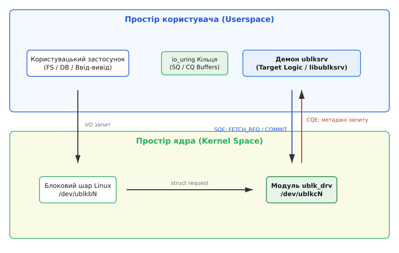
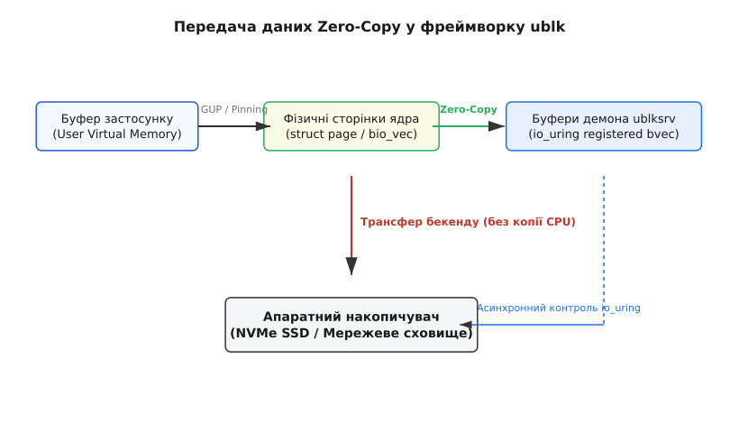

# Фреймворк ublk: блокові драйвери у просторі користувача

<preknowlist>
- [Концепції ядра Linux](root:sys-unix/kernel-and-userspace) — межа між ядром та простором користувача, системні виклики та VFS.
- [Механізм io_uring](root:sys-unix/io-uring-rings-model) — асинхронне кільце операцій вводу-виводу без перемикання контексту.
- [Команди passthrough у io_uring](root:sys-unix/io-uring-cmd-passthrough) — прямий обмін викликами IORING_OP_URING_CMD між пристроєм і демоном.
</preknowlist>

Блокова підсистема ядра Linux історично побудована за монолітною схемою: будь-який драйвер накопичувача — від традиційного SATA/AHCI до сучасних масивів NVMe — функціонує безпосередньо у просторі ядра (`kernel space`). Прямий доступ до внутрішнього шару `blk-mq` (Multi-Queue Block Layer), підсистеми управління пам'яттю, механізмів DMA (Direct Memory Access) та керування апаратними перериваннями забезпечував максимальну продуктивність і мінімальні затримки обробки запитів.

Проте ціною такої архітектури є повна вразливість системи перед помилками в коді драйвера. Розіменування нульового вказівника, вихід за межі масиву чи стан гонитви (`race condition`) у модулі ядра негайно спричиняють аварійну зупинку системи (`kernel panic`). У високонавантажених серверних середовищах це означає раптовий збій, втрату незбережених даних та вимушений тривалий процес перезавантаження вузла.

Бажання винести логіку блокових накопичувачів у простір користувача (`userspace`) виникло понад два десятиліття тому. Це дає розробникам серйозні переваги: можливість використовувати мови високого рівня (C++, Rust, Go), повноцінні інструменти зневадження (GDB, Valgrind, профайлери), вільно підключати сторонні бібліотеки та гарантувати, що збій демона у просторі користувача не обвалить операційну систему.

Історичні рішення — Network Block Device (NBD), BUSE та TCMU (часто відомий як LIO TCM Userspace) — не змогли стати повноцінною заміною нативним драйверам ядра. Кожен запит у цих системах супроводжувався численними перемиканнями контексту процесора, копіюванням байтів у пам'яті та синхронними системними викликами, що створювало вузьке місце, неприпустиме для швидкісних SSD. Детальний шлях розвитку цих рішень висвітлює [історія блокових драйверів простору користувача](root:sys-unix/ublk-userspace-block-driver/hist-userspace-block-devs.md).

З появою у ядрі Linux 6.0 фреймворку **ublk** (від англ. *Userspace Block Device*), створеного розробником Мін Леєм (Ming Lei), підхід до розробки блокових драйверів кардинально змінився. ublk поєднав асинхронний інтерфейс `io_uring` зі спеціалізованим механізмом **io_uring command passthrough** (`IORING_OP_URING_CMD`), а згодом дістав і передачу даних без копіювання (**Zero-Copy** — у ядрі від версії 6.15), забезпечивши продуктивність, порівнянну з модулями ядра Linux.

> 🔧 **Навіщо це.** ublk дозволяє створювати програмно-визначені сховища даних (software-defined storage), сервіси дедуплікації, клієнти розподілених дисків (Ceph RBD) та драйвери складних форматів (qcow2) повністю у просторі користувача з майже нативною швидкістю дискового вводу-виводу.

## Еволюційний стрибок: Чому ublk швидший за NBD та BUSE

Щоб зрозуміти архітектурний прорив ublk, варто порівняти його з попередніми підходами. Головною проблемою традиційних користувацьких драйверів були високі накладні витрати на передачу одного I/O-запиту:

1. **NBD (Network Block Device)**: обмінюється даними через сокетний стек ядра. Кожен запит вимагає проходження шарів TCP/IP або UNIX domain sockets, виконання системних викликів `recv()`/`send()`, перемикання контексту та подвійного копіювання даних (з буфера застосунку у сокет ядра, а звідти у буфер демона).
2. **BUSE (Block Device in Userspace)**: власного коду в ядрі не мав узагалі — це бібліотека простору користувача поверх того самого модуля `nbd.ko`, яка ховає протокол NBD за простими колбеками. Розробку вона спростила, а накладні витрати лишила ті самі: сокет, синхронні `read()`/`write()` і копіювання буферів.
3. **TCMU (Target Core Module in Userspace)**: спробував застосувати спільно використовувану пам'ять `mmap()`, але був жорстко прив'язаний до важкого стеку SCSI. Кожен запит вимагав кодування та декодування командних блоків SCSI (CDB), що створювало затримки на шарах абстракції.

ublk усунув усі три проблеми одразу:

- Замість системних викликів `read()`/`write()` використовується асинхронне кільце `io_uring`.
- Замість важких сокетів або SCSI використовується прямий легковаговий командний passthrough `IORING_OP_URING_CMD`.
- Замість копіювання даних у пам'яті — реєстрація сторінок самого запиту (`bio_vec`) у таблиці фіксованих буферів демона, тобто справжній Zero-Copy (у ядрі від 6.15).

## Двокомпонентна архітектура ublk

Фреймворк ublk розділяє обов'язки між ядром Linux та таргет-демоном у просторі користувача.


*Архітектура ublk: взаємодія модуля ublk_drv та таргет-демона у просторі користувача через io_uring passthrough.*

### Модуль ядра `ublk_drv`

Модуль `ublk_drv` реєструється в операційній системі як стандартний блоковий драйвер. При створенні нового віртуального пристрою у системі з'являються дві сутності:

- **Керуючий символьний пристрій `/dev/ublkcN`**: призначений виключно для обміну командами між демоном `ublksrv` та ядром через `io_uring`.
- **Блоковий пристрій `/dev/ublkbN`**: стандартний блоковий вузол, який бачать файлові системи (EXT4, XFS, Btrfs), класичні застосунки чи контейнери.

Драйвер `ublk_drv` реалізує інтерфейси підсистеми `blk-mq` (Multi-Queue Block Layer). Він створює апаратні черги запитів (hardware queues), але замість передачі їх апаратному контролеру перенаправляє метадані в `io_uring`.

### Таргет-демон `ublksrv`

Таргет-демон `ublksrv` — це звичайний процес у просторі користувача. Він відкриває пристрій `/dev/ublkc0`, ініціалізує екземпляр `io_uring` і керує логікою обробки I/O. Демон може бути реалізований будь-якою мовою програмування (C, C++, Rust, Go). 

Офіційна еталонна бібліотека `libublksrv` приховує низку низькорівневих деталей `io_uring`, надаючи розробнику високорівневі колбеки ініціалізації пристрою та обробки кожної I/O-операції.

## Механізм io_uring Passthrough (`IORING_OP_URING_CMD`)

Серцем ublk є функція `IORING_OP_URING_CMD`, додана в `io_uring`. У класичному `io_uring` кожен елемент Submission Queue (SQE) описує стандартний системний виклик (наприклад, `IORING_OP_READV` або `IORING_OP_ACCEPT`). Проте `IORING_OP_URING_CMD` дозволяє виставити в SQE невідому ядру команду, яка передається напряму у функцію `f_op->uring_cmd()` відповідного символьного пристрою (у нашому випадку `/dev/ublkc*`).

Завдяки цьому ublk визначає власний протокол взаємодії через три ключові команди:

1. **`UBLK_U_IO_FETCH_REQ`** ("Дай новий запит"): Демон виставляє цю команду в Submission Queue (SQ) io_uring. Модуль ядра `ublk_drv` не завершує її одразу, а утримує всередині ядра. Як тільки на пристрій `/dev/ublkb0` надходить блоковий запит від операційної системи, ядро заповнює цей виклик метаданими запиту і поміщає його в Completion Queue (CQ).
2. **`UBLK_U_IO_COMMIT_AND_FETCH_REQ`** ("Ось результат попереднього запиту, дай наступний"): Це головна оптимізація гарячого шляху (hot path). Демон в одній операції повертає ядру результат виконання попереднього запиту (наприклад, прочитано 4096 байтів) і одночасно виставляє нову заявку на наступний I/O. Це зменшує кількість операцій у кільці `io_uring` вдвічі.
3. **`UBLK_U_IO_NEED_GET_DATA`**: вживається лише в режимі з копіюванням, лише для запису й лише тоді, коли пристрій створено з прапорцем `UBLK_F_NEED_GET_DATA`. Разом із метаданими запиту WRITE даних ще немає, тому демон відповідає цією командою, повідомляючи адресу свого буфера; ядро копіює туди дані запису й повертає запит демону вдруге — уже з наповненим буфером.

## Покроковий життєвий цикл I/O-запиту

Щоб простежити шлях даних, розглянемо кроки обробки операції читання (READ) з диска `/dev/ublkb0`:

1. **Ініціалізація кільця**: Демон `ublksrv` відкриває символьний пристрій `/dev/ublkc0`, формує екземпляр `io_uring` і заповнює Submission Queue серією команд `UBLK_U_IO_FETCH_REQ`.
2. **Надходження запиту від ОС**: База даних або файлова система викликає `read()` на пристрої `/dev/ublkb0`. Блокова підсистема ядра формує структуру `struct request` і передає її в `ublk_drv`.
3. **Передача метаданих у userspace**: Драйвер `ublk_drv` бере одну з очікуючих команд `UBLK_U_IO_FETCH_REQ`, записує в елемент Completion Queue (CQE) метадані запиту (номер сектора, довжину в байтах, ідентифікатор запиту `tag` та тип операції READ) і робить запис у CQ.
4. **Обробка в демоні**: Демон `ublksrv` читає CQE з `io_uring`. Він зчитує метадані: "Потрібно прочитати 8 секторів за зсувом LBA 2048". Демон виконує логіку — наприклад, зчитує дані з локального файлу-образу `qcow2` чи з мережевого сокета Ceph.
5. **Фіналізація запиту**: Демон викликає `UBLK_U_IO_COMMIT_AND_FETCH_REQ`, передаючи статус успіху. `ublk_drv` фіналізує `struct request` у блоковому шарі Linux, і база даних отримує свої дані.

На жоден із цих кроків не припадає окремого системного виклику на кожен запит: команди подаються й забираються через спільні кільця `io_uring`, а в режимі `SQPOLL` демон не робить системних викликів узагалі.

## Передача даних без копіювання (Zero-Copy)

Найважливішою рисою ublk є підтримка режиму **Zero-Copy**. У звичайних системах дані копіюються з буфера застосунку у буфер ядра, а з ядра — у буфер демона, що створює подвійні накладні витрати на копіювання пам'яті.


*Схема Zero-Copy: сторінки `bio_vec` самого запиту стають фіксованим буфером `io_uring` демона ublksrv — без проміжного копіювання.*

У блоковому шарі Linux дані описуються масивом структур `bio_vec`: кожен елемент указує на фізичну сторінку `struct page`, зсув у ній і довжину шматка. ublk забезпечує доступ до цих сторінок без копіювання за допомогою кількох технічних підходів:

- **Відображення буферів через `mmap()`** (режим із копіюванням, наявний від самого початку): демон відображає область буферів символьного пристрою `/dev/ublkc*` і працює з нею як зі звичайною памʼяттю. Копіювання між сторінками запиту й цим буфером усе одно робить ядро — тут економляться системні виклики, а не пропускна здатність памʼяті.
- **Реєстрація `bio_vec` у таблиці буферів io_uring** (`UBLK_U_IO_REGISTER_IO_BUF`, прапорці `UBLK_F_SUPPORT_ZERO_COPY` та `UBLK_F_AUTO_BUF_REG`; у ядрі від 6.15) — справжній zero-copy: ядро закріплює сторінки самого блокового запиту й вкладає їхній `bio_vec` у таблицю фіксованих буферів `io_uring` демона. Демон не бачить цих сторінок як свою памʼять — він лише посилається на них за індексом у власних операціях `READ_FIXED`/`WRITE_FIXED` до бекенду.

У результаті сторінки, які подав початковий застосунок, доходять до бекенду демона незміненими, і копіювання байтів процесором зникає з гарячого шляху. Сам ublk при цьому із залізом не працює: трансфер виконує той драйвер — файлової системи, NVMe чи мережі, — якому демон адресує свою фіксовану операцію.

## Архітектура без блокувань (Lockless) та продуктивність

Парадоксально, але ublk у багатьох тестах демонструє продуктивність, вищу за деякі класичні модулі ядра. Причина полягає у використанні **архітектури без блокувань (lockless design)**.

Класичний одночерговий блоковий шар (`blk-sq`, прибраний з ядра у версії 5.0) захищав спільну чергу запитів спінлоком (`spinlock`): на багатоядерній машині при мільйонах IOPS ядра витрачали на очікування блокування більше часу, ніж на корисну роботу. `blk-mq` розвів черги по ядрах і зняв найгостріше, але спільні структури всередині самих драйверів — теги, лічильники, черги завершень — лишилися, а з ними й конкуренція за них (`lock contention`).

`io_uring` та ublk використовують модель **thread-per-core**:

- Кількість черг `ublk_drv` задають при створенні пристрою; заради максимальної пропускної здатності її беруть рівною кількості ядер CPU.
- Кожен потік демона `ublksrv` прив'язується до конкретного ядра процесора (CPU affinity).
- За потреби вмикають режим поллінгу `SQPOLL` (`Submission Queue Polling`), де окремий потік ядра постійно опитує кільце подачі, а демон не робить системних викликів узагалі.
- Синхронізація між ядром та демоном виконується через атомарні операції та бар'єри пам'яті (`smp_load_acquire` / `smp_store_release`).

Завдяки цьому кеші процесора L1/L2 залишаються "гарячими", перемикань контексту на кожен запит немає, а спільних блокувань між чергами — теж. На опублікованих вимірах порожнього таргета ublk тримає порядок мільйона IOPS на чергу при затримках у десятки мікросекунд; конкретні числа сильно залежать від версії ядра, бекенду й машини.

## Практичний приклад реалізації ublk-таргета

Приклад нижче демонструє створення мінімального RAM-диска обсягом 64 МіБ за допомогою бібліотеки `libublksrv`. Таблиця вкладок містить C-реалізацію та ідіоматичний C++ варіант.

:::tabs
```c
#include <ublksrv.h>
#include <stdio.h>
#include <stdlib.h>
#include <string.h>
#include <errno.h>

#define RAMDISK_SIZE (64 * 1024 * 1024)

struct ramdisk_ctx {
    char *data;
};

static int ramdisk_handle_io(const struct ublksrv_queue *q,
                             const struct ublk_io_data *data)
{
    struct ramdisk_ctx *ctx = (struct ramdisk_ctx *)ublksrv_get_queue_app_data(q);
    const struct ublksrv_io_desc *desc = data->desc;

    uint32_t op = ublksrv_get_op(desc);
    uint64_t sector = ublksrv_get_sector(desc);
    uint32_t nr_bytes = ublksrv_get_nr_bytes(desc);
    uint64_t offset = sector << 9;

    void *buf = ublksrv_get_io_buf(q, data);

    if (offset + nr_bytes > RAMDISK_SIZE) {
        ublksrv_complete_io(q, data, -EIO);
        return 0;
    }

    if (op == UBLK_IO_OP_READ) {
        memcpy(buf, ctx->data + offset, nr_bytes);
    } else if (op == UBLK_IO_OP_WRITE) {
        memcpy(ctx->data + offset, buf, nr_bytes);
    }

    ublksrv_complete_io(q, data, nr_bytes);
    return 0;
}

int main(int argc, char *argv[])
{
    struct ramdisk_ctx ctx;
    ctx.data = (char *)calloc(1, RAMDISK_SIZE);
    if (!ctx.data) return 1;

    struct ublksrv_dev *dev = ublksrv_dev_init(0, ramdisk_handle_io, &ctx);
    if (!dev) {
        free(ctx.data);
        return 1;
    }

    ublksrv_start_dev(dev);
    ublksrv_dev_deinit(dev);
    free(ctx.data);
    return 0;
}
```
```cpp
#include <ublksrv.h>
#include <algorithm>
#include <cerrno>
#include <iostream>
#include <vector>
#include <memory>
#include <span>
#include <cstdint>

class UblkRamdiskTarget {
public:
    explicit UblkRamdiskTarget(std::size_t size_bytes)
        : storage_(size_bytes, 0) {}

    int handle_io(const struct ublksrv_queue* q, const struct ublk_io_data* data) noexcept {
        const auto* desc = data->desc;
        const uint32_t op = ublksrv_get_op(desc);
        const uint64_t offset = ublksrv_get_sector(desc) << 9;
        const uint32_t nr_bytes = ublksrv_get_nr_bytes(desc);

        if (offset + nr_bytes > storage_.size()) {
            ublksrv_complete_io(q, data, -EIO);
            return 0;
        }

        auto* io_buf = static_cast<std::byte*>(ublksrv_get_io_buf(q, data));
        std::span<std::byte> buffer(io_buf, nr_bytes);
        std::span<std::byte> storage_span(reinterpret_cast<std::byte*>(storage_.data()) + offset, nr_bytes);

        if (op == UBLK_IO_OP_READ) {
            std::copy(storage_span.begin(), storage_span.end(), buffer.begin());
        } else if (op == UBLK_IO_OP_WRITE) {
            std::copy(buffer.begin(), buffer.end(), storage_span.begin());
        }

        ublksrv_complete_io(q, data, nr_bytes);
        return 0;
    }

private:
    std::vector<uint8_t> storage_;
};

int main() {
    constexpr std::size_t disk_size = 64 * 1024 * 1024;
    auto target = std::make_unique<UblkRamdiskTarget>(disk_size);

    auto io_callback = [](const struct ublksrv_queue* q, const struct ublk_io_data* data) -> int {
        auto* instance = static_cast<UblkRamdiskTarget*>(ublksrv_get_queue_app_data(q));
        return instance->handle_io(q, data);
    };

    struct ublksrv_dev* dev = ublksrv_dev_init(0, io_callback, target.get());
    if (!dev) return 1;

    ublksrv_start_dev(dev);
    ublksrv_dev_deinit(dev);
    return 0;
}
```
:::

Повний приклад обробки та розширеної конфігурації розглядає [практична реалізація ublk-таргета](root:sys-unix/ublk-userspace-block-driver/proj-ublk-target.md).

## Сценарії використання та стійкість до збоїв

Фреймворк ublk активно інтегрується у ключові інфраструктурні рішення:

1. **Монтування образів `qcow2`**: Демон `ublk-qcow2` дозволяє монтувати віртуальні диски QEMU безпосередньо у хост-систему у рази швидше за NBD — конкретна перевага залежить від навантаження й бекенду.
2. **Розподілені сховища (Ceph RBD)**: Проєкт `ublk-rbd` виносить розбір протоколів Ceph у userspace через бібліотеку `librbd`, забезпечуючи високу швидкість без потреби модифікувати ядро.
3. **Накопичувачі SMR/ZNS (Zoned Block Devices)**: ublk дозволяє реалізувати складні алгоритми трансляції зон (ZTL) та збору сміття у просторі користувача.

### Механізм відновлення після збоїв (Crash Recovery)

Якщо таргет-демон `ublksrv` завершується з помилкою (наприклад, `SIGSEGV`), операційна система не падає. Коли пристрій створено з прапорцем `UBLK_F_USER_RECOVERY`, драйвер `ublk_drv` переводить його в режим очікування відновлення й тримає наявні I/O-запити в черзі протягом настроюваного тайм-ауту. Без цього прапорця відновлювати нічого: пристрій зупиняють, а незавершені запити повертаються з помилкою.

Контейнерний оркестратор чи `systemd` миттєво перезапускає процес `ublksrv`. Новий демон підключається до символьного пристрою `/dev/ublkc0`, відновлює сесію і продовжує обробку запитів без видачі помилок `EIO` користувацьким застосункам.
