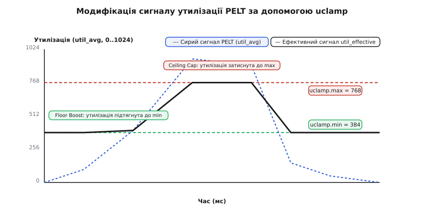
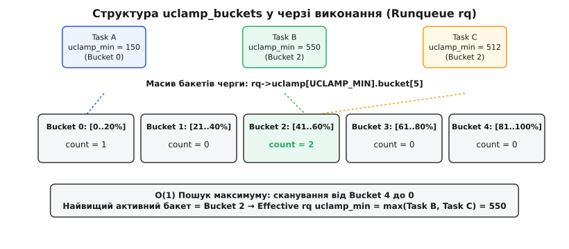
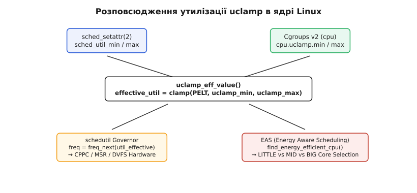

# Обмеження утилізації CPU: uclamp (sched_setattr uclamp_min/uclamp_max)

<preknowlist>
- [Планувальник CFS](topic:sys-unix/scheduler-model) — принципи розподілу процесорного часу та механізм вимірювання навантаження PELT.
- [Cgroups v2](topic:sys-unix/cgroups-v2-unified-hierarchy) — уніфікована ієрархія контролерів ресурсів та обмеження CPU.
- [Енергозбереження та EAS](topic:sys-unix/sched-energy-aware-eas) — планування задач на гетерогенних процесорних архітектурах big.LITTLE та DynamIQ.
</preknowlist>

Коли потоку обробки 120 FPS графічного інтерфейсу в Android потрібно відмалювати новий кадр за 8.3 мс, планувальник CFS оцінює його поточне навантаження за допомогою механізму PELT (Per-Entity Load Tracking). Оскільки PELT використовує експоненційне згладжування з періодом напіврозпаду 32 мс, прокинутий зі стану сну потік оцінюється з низькою утилізацією (близько 0–50 з 1024), через що регулятор частоти `schedutil` залишає CPU на мінімальній частоті 300 МГц. Поки PELT розігріється до необхідних 800+ одиниць утилізації, минає понад 40 мс — це призводить до пропуску 5 послідовних кадрів (jank) та відчутного гальмування інтерфейсу. З іншого боку, фоновий процес індексації фотографій, пропрацювавши 100 мс на 100% навантаження, піднімає частоту ядра до 3.0 ГГц, помітно розряджаючи акумулятор, хоча міг би завершитися на проміжній частоті 1.2 ГГц без потреби в максимальній швидкодії.

Механізм **Utilization Clamping (uclamp)** розв'язує цю фундаментальну суперечність, дозволяючи користувацькому простору накладати двосторонні обмеження (гарантований мінімум та жорсткий максимум) на сигнал утилізації, який бачать підсистеми масштабування частоти та розміщення задач у ядрі Linux.

## Проблема реактивності PELT та Dynamic Voltage and Frequency Scaling (DVFS)

У сучасних ядрах Linux планувальник задач не вимірює миттєве використання CPU за короткий квант часу, а формує так званий "сигнал утилізації" (utilization signal) `util_avg` для кожної задачі та черги виконання. Підсистема PELT ділить час виконання на інтервали по 1024 мікросекунди і обчислює експоненційне ковзне середнє за такою рекурентною формулою:

```
util_avg(t) = util_avg(t−1) · y + d(t)
```
[де y = 0.5^(1/32) ≈ 0.978572 — коефіцієнт згасання за один інтервал, тобто період напіврозпаду 32 інтервали ≈ 32 мс; d(t) — час активності у поточному інтервалі 1024 мкс]

Динаміка наростання сигналу PELT під час безперервного обчислювального навантаження описується наступною математичною послідовністю:

- **0 мс:** `util_avg = 0` (потік прокинувся зі сну)
- **10 мс:** `util_avg ≈ 198` (лише 19% від максимальної швидкості)
- **32 мс:** `util_avg ≈ 512` (50% після одного періоду напіврозпаду)
- **64 мс:** `util_avg ≈ 768` (75% після двох періодів)
- **128 мс:** `util_avg ≈ 960` (93.7% після чотирьох періодів)
- **250 мс:** `util_avg ≈ 1020` (досягнення стаціонарного максимуму 1024)

Утилізація вимірюється у нормалізованих одиницях від 0 до 1024, де 1024 відповідає 100% обчислювальної спроможності найпотужнішого ядра системи. У коді ядра (`kernel/sched/pelt.c`) оновлення сигналу виконується функцією `accumulate_sum()`, яка накопичує дискретні кванти активності та застосовує таблицю наперед обчислених коефіцієнтів згасання `runnable_avg_yN_inv`.

На основі отриманого значення `util_avg` регулятор частоти `schedutil` приймає рішення про масштабування тактової частоти та напруги процесора (DVFS — Dynamic Voltage and Frequency Scaling):

```
next_freq = 1.25 · max_freq · (util_avg / 1024)
```
[де 1.25 — запас продуктивності (headroom 25%), 1024 — максимальна ємність найпотужнішого ядра системи]

Енергоспоживання процесорного ядра `P` під час зміни частоти та напруги описується фізичною формулою:

```
P = C · V^2 · f + P_leakage
```
[де C — динамічна ємність затворів транзисторів, V — робоча напруга живлення, f — тактова частота, P_leakage — струми витоку]

Оскільки напруга `V` лінійно залежить від тактової частоти `f`, енергоспоживання процесора зростає кубічно від частоти (`P ~ f³`). Це пояснює, чому затискання утилізації фонових задач до 50% знижує спожиту ними енергію приблизно втричі-вчетверо: миттєва потужність падає майже увосьмеро, але та сама робота розтягується вдвічі, а струми витоку з'їдають частину виграшу.

Ця математична модель чудово працює для стаціонарних обчислювальних навантажень (наприклад, наукових розрахунків або компіляції коду), але створює дві протилежні проблеми у мультимедійних, інтерактивних та мобільних системах:

1. **Затримка розігріву (Ramp-up Latency):** Короткі пачки обчислень (bursty workloads) — такі як обробка дотиків до сенсорного екрана, рендеринг кадрів у графічному процесі або обробка пакетів аудіо — вимагають максимальної частоти процесора *негайно*. Оскільки PELT потребує ~100 мс постійного навантаження для досягнення 90% значення утилізації, система працює на понижених частотах саме тоді, коли затримка є критичною.
2. **Перевитрата енергії фоновими задачами (Over-provisioning):** Фоновий потік синхронізації бази даних або завантаження файлу виконує обчислення у суцільному циклі. PELT швидко піднімає `util_avg` до 1024, змушуючи регулятор `schedutil` перемикати CPU на найвищу частоту. На пікових частотах енергоспоживання процесора зростає кубічно від частоти, хоча фоновій задачі цілком достатньо працювати на енергоефективній частоті у фоновому режимі.

Для вирішення цих обмежень у ядрі Linux 5.3 було реалізовано двостороннє обмеження сигналу утилізації [історію створення uclamp та еволюцію від sched-tune](topic:sys-unix/uclamp-utilization-clamping/hist-uclamp-and-pelt.md).

## Анатомія uclamp: Двостороннє обмеження утилізації

Utilization Clamping не змінює фізичний розрахунок PELT і не впливає на чесність розподілу процесорного часу Fair Scheduler (CFS). Натомість uclamp діє як проміжний фільтр (clamp), який модифікує значення утилізації *на етапі прийняття рішень* регулятором частоти та планувальником розміщення задач.

uclamp оперує двома параметрами для кожної задачі або групи задач:

- **`uclamp_min` (Utilization Floor / Boost):** Нижня межа утилізації (шкала 0–1024). Якщо поточне значення PELT `util_avg` менше за `uclamp_min`, планувальник штучно вважає утилізацію такою, що дорівнює `uclamp_min`. Це змушує регулятор `schedutil` негайно встановити частоту CPU не нижче за `freq_for(uclamp_min)`, а планувальник EAS — розмістити задачу на ядрі з відповідною обчислювальною ємністю.
- **`uclamp_max` (Utilization Ceiling / Cap):** Верхня межа утилізації (шкала 0–1024). Навіть якщо задача завантажує процесор на 100% і `util_avg = 1024`, регулятор частоти та планувальник бачать утилізацію, що не перевищує `uclamp_max`. Це забороняє `schedutil` піднімати частоту вище `freq_for(uclamp_max)` і утримує задачу на енергоефективних ядрах.

Обчислення ефективного сигналу утилізації виконання здійснюється за формулою:

```
util_effective = min(max(util_avg, uclamp_min), uclamp_max)
```
[де util_avg — фізичний сигнал PELT, uclamp_min — нижній поріг, uclamp_max — верхній поріг]


*Принцип затискання сирого сигналу PELT за допомогою нижньої (uclamp.min) та верхньої (uclamp.max) меж утилізації.*

Графік демонструє, що під час раптового пробудження (ліва частина) ефективний сигнал `util_effective` миттєво піднімається до `uclamp_min = 384`, позбавляючи систему від затримки розігріву PELT. Під час пікового обчислювального сплеску (центральна частина) `util_effective` обмежується стелею `uclamp_max = 768`, захищаючи процесор від перегріву та перевитрати енергії.

## Порівняльний аналіз: uclamp проти Nice, CPU Affinity та CPU Quota

У традиційному адмініструванні Linux для управління ресурсами процесів використовувалися три основні механізми: значення пріоритету `nice`, прив'язка до ядер `sched_setaffinity(2)` та квоти процесорного часу `cgroup.cpu.max`. Проте кожен із цих підходів розв'язує зовсім іншу задачу і не здатен управляти частотою CPU та вибором ядер для коротких сплесків обчислень.

| Механізм | Що контролює | Вплив на частоту CPU (DVFS) | Вплив на вибір ядра (EAS) | Побічні ефекти та обмеження |
|---|---|---|---|---|
| **Nice / Priority** | Пропорцію часу CFS (`cpu.weight`) | Непрямий і непередбачуваний | Мінімальний | Не може примусити `schedutil` підняти частоту при низькому PELT |
| **CPU Affinity** | Маску дозволених CPU-ядер | Відсутній | Жорстке обмеження | Позбавляє планувальник гнучкості балансування навантаження |
| **CPU Quota (`cpu.max`)** | Квоту часу за період (мс) | Відсутній | Відсутній | Викликає примусову заморозку процесу (throttling) після вичерпання квоти |
| **uclamp (Utilization Clamp)** | Сигнал утилізації PELT (0..1024) | Прямий (негайний підйом або cap) | Прямий (вибір LITTLE/BIG) | Не обмежує час виконання, не викликає throttling |

З таблиці видно, що uclamp є єдиним механізмом у Linux, який керує *швидкістю виконання та енергоспоживанням*, а не просто відбирає час процесора.

## Системний виклик `sched_setattr(2)` та ABI ядра

Для встановлення параметрів uclamp з простору користувача на рівні окремих потоків (TID) використовується системний виклик `sched_setattr(2)`. Він приймає вказівник на структуру `struct sched_attr`, яка розширює стандартні атрибути планування.

Параметри uclamp контролюються полями `sched_util_min` та `sched_util_max`, а також прапорами в полі `sched_flags`:

- `SCHED_FLAG_UTIL_CLAMP_MIN`: Застосувати нове значення з поля `sched_util_min`.
- `SCHED_FLAG_UTIL_CLAMP_MAX`: Застосувати нове значення з поля `sched_util_max`.
- `SCHED_FLAG_UTIL_CLAMP`: Комбінація обох прапорів для одночасного оновлення мінімуму та максимуму.

### Читання та безпечне оновлення через `sched_getattr(2)`

Оскільки виклик `sched_setattr(2)` вимагає передачі всієї структури `sched_attr`, перед зміною uclamp рекомендується прочитати поточні налаштування за допомогою `sched_getattr(2)`, щоб випадково не скинути значення `sched_nice` або пріоритет RT.

Перевірка параметрів у ядрі виконується у функції `__sched_setscheduler()` у файлі `kernel/sched/core.c`. Якщо значення `sched_util_min` перевищує 1024 або `sched_util_min > sched_util_max`, ядро повертає помилку `-EINVAL`.

Приклад повноцінної програми для налаштування профілю утилізації потоку наводиться нижче.

:::tabs
```c
#define _GNU_SOURCE
#include <stdio.h>
#include <stdlib.h>
#include <unistd.h>
#include <errno.h>
#include <string.h>
#include <sys/syscall.h>
#include <linux/sched/types.h>

#ifndef SYS_sched_setattr
#define SYS_sched_setattr 314
#endif

#ifndef SCHED_FLAG_UTIL_CLAMP_MIN
#define SCHED_FLAG_UTIL_CLAMP_MIN 0x20
#endif

#ifndef SCHED_FLAG_UTIL_CLAMP_MAX
#define SCHED_FLAG_UTIL_CLAMP_MAX 0x40
#endif

static int set_uclamp(pid_t tid, unsigned int min_val, unsigned int max_val) {
    struct sched_attr attr;
    memset(&attr, 0, sizeof(attr));
    attr.size = sizeof(attr);
    attr.sched_policy = SCHED_OTHER;

    attr.sched_flags = SCHED_FLAG_UTIL_CLAMP_MIN | SCHED_FLAG_UTIL_CLAMP_MAX;
    attr.sched_util_min = min_val; /* Шкала 0 .. 1024 */
    attr.sched_util_max = max_val;

    if (syscall(SYS_sched_setattr, tid, &attr, 0) < 0) {
        perror("sched_setattr failed");
        return -1;
    }
    return 0;
}

int main(void) {
    pid_t tid = gettid();
    
    if (set_uclamp(tid, 512, 768) == 0) {
        printf("uclamp успішно застосовано для TID %d: min=512, max=768\n", tid);
    }
    
    return 0;
}
```
```cpp
#include <iostream>
#include <system_error>
#include <cstdint>
#include <cstring>
#include <cerrno>
#include <unistd.h>
#include <sys/syscall.h>
#include <linux/sched/types.h>

namespace sys {
    #ifndef SYS_sched_setattr
    #define SYS_sched_setattr 314
    #endif

    #ifndef SCHED_FLAG_UTIL_CLAMP_MIN
    #define SCHED_FLAG_UTIL_CLAMP_MIN 0x20
    #endif

    #ifndef SCHED_FLAG_UTIL_CLAMP_MAX
    #define SCHED_FLAG_UTIL_CLAMP_MAX 0x40
    #endif
}

class TaskUtilization {
public:
    static bool setClamp(pid_t tid, uint32_t minUtil, uint32_t maxUtil) noexcept {
        struct sched_attr attr{};
        attr.size = sizeof(attr);
        attr.sched_policy = SCHED_OTHER;

        attr.sched_flags = SCHED_FLAG_UTIL_CLAMP_MIN | SCHED_FLAG_UTIL_CLAMP_MAX;
        attr.sched_util_min = minUtil;
        attr.sched_util_max = maxUtil;

        long res = ::syscall(SYS_sched_setattr, tid, &attr, 0);
        if (res < 0) {
            std::cerr << "Помилка sched_setattr: " << std::strerror(errno) << '\n';
            return false;
        }
        return true;
    }
};

int main() {
    pid_t tid = ::gettid();
    if (TaskUtilization::setClamp(tid, 512, 768)) {
        std::cout << "[C++] uclamp встановлено для TID " << tid << ": min=512, max=768\n";
    }
    return 0;
}
```
:::

Виклик `sched_setattr` зберігає запитані значення у самій структурі задачі — `task_struct->uclamp_req[]`; окремий масив `task_struct->uclamp[]` тримає вже ефективні значення, обмежені cgroup і системними ручками.

## Інтеграція з Cgroups v2 та ієрархія обмежень

Крім системного виклику для окремих потоків, uclamp повністю інтегрований у контролер `cpu` ієрархії Cgroups v2. Це дозволяє системним сервісам (наприклад, `systemd` або Android Framework) обмежувати ресурси цілих груп процесів без модифікації вихідного коду додатків.

У контролері `cpu` існують два файли управління:

- `cpu.uclamp.min`: Нижня межа утилізації cgroup (значення від `0.00` до `100.00`).
- `cpu.uclamp.max`: Верхня межа утилізації cgroup (значення від `0.00` до `100.00` або `max`).

Наприклад, для обмеження фонового контейнера утилізацією не більше 20%:

```bash
mkdir /sys/fs/cgroup/background
echo "20.00" > /sys/fs/cgroup/background/cpu.uclamp.max
echo 1420 > /sys/fs/cgroup/background/cgroup.procs
```

### Налаштування uclamp для сервісів systemd

Власних директив для uclamp `systemd` не має: запити на них висять відкритими з 2023 року, тож ніяких `CPUUtilMin`/`CPUUtilMax` у юніті не існує. Межі виставляють самотужки — або запускають процес під `uclampset(1)` з `util-linux` (значення на шкалі 0–1024), або пишуть у файл cgroup самого юніта:

```ini
[Service]
Type=simple
ExecStart=/usr/bin/uclampset -M 307 -- /usr/bin/my_background_service
ExecStartPost=/bin/sh -c 'echo 30.00 > /sys/fs/cgroup/system.slice/%n/cpu.uclamp.max'
```

Перший рядок обмежує сам процес і його нащадків, другий — усю cgroup юніта, тобто й ті потоки, що встигли виставити собі власні значення.

### Правила обчислення ефективних значень (Effective Values)

Коли процес має власні налаштування uclamp (через `sched_setattr`) і одночасно перебуває у cgroup з обмеженнями, ядро обчислює *ефективне значення* `effective_uclamp` за наступними правилами:

1. **Оцінка максимуму:** Ефективний `uclamp_max` задачі є мінімумом між її власним `uclamp_max` та значеннями `cpu.uclamp.max` усіх її батьківських cgroups в ієрархії:
   ```
   effective_max = min(task.uclamp_max, cgroup.uclamp_max)
   ```
2. **Оцінка мінімуму:** Ефективний `uclamp_min` задачі обмежується зверху її ж ефективним максимумом, а також значенням `cpu.uclamp.min` її cgroup:
   ```
   effective_min = clamp(task.uclamp_min, cgroup.uclamp_min, effective_max)
   ```

Детальніше про внутрішню організацію полів ядра та системні ручки читайте в додатку [структуру uclamp у ядрі та інтерфейс sysctl/cgroup](topic:sys-unix/uclamp-utilization-clamping/api-uclamp-kernel-structures.md).

## Внутрішня архітектура ядра: O(1) бакети у черзі виконання (Runqueue `rq`)

Головним викликом під час проектування uclamp була обчислювальна складність на гарячому шляху планувальника. Кожного разу, коли ядро обирає наступну задачу для виконання (`pick_next_task`) або регулятор `schedutil` переобчислює частоту CPU, ядру потрібно знайти *найвище значення `uclamp_min` серед усіх runnable-задач у черзі виконання `rq` цього ядра*.

Якби ядро виконувало лінійний обхід списку з 100 активних задач на кожному такті, це призвело б до неприпустимих втрат продуктивності O(N).

Інженери ARM реалізували елегантний механізм **uclamp_buckets**:

1. Шкала утилізації 0–1024 розбивається на 5 фіксованих бакетів (buckets):
   - **Bucket 0:** 0 .. 204 (0% – 20%)
   - **Bucket 1:** 205 .. 409 (20% – 40%)
   - **Bucket 2:** 410 .. 614 (40% – 60%)
   - **Bucket 3:** 615 .. 819 (60% – 80%)
   - **Bucket 4:** 820 .. 1024 (80% – 100%)
2. Кожна черга виконання `rq` містить масив лічильників `rq->uclamp[UCLAMP_MIN].bucket[5]`.
3. Коли задача додається у чергу (`enqueue_task`), ядро обчислює індекс бакета для її `uclamp_min` і інкрементує лічильник задач у відповідному бакеті через `uclamp_rq_inc()`. При вилученні задачі (`dequeue_task`) викликається `uclamp_rq_dec()`, яка декрементує лічильник `tasks`.
4. Обчислення максимального `uclamp_min` черги виконується функцією `uclamp_rq_max_value()` (`kernel/sched/core.c`), яка сканує 5 бакетів від 4 до 0. Перший бакет із лічильником `tasks > 0` дає максимальне значення. Оскільки кількість бакетів фіксована і дорівнює 5, складність пошуку становить строго O(1).


*Структура бакетів uclamp у черзі виконання (Runqueue rq) та O(1) обчислення максимального uclamp.min.*

Як видно з діаграми, хоча дві задачі (Task B та Task C) мають різні значення `uclamp_min` (550 та 512), вони потрапляють у один і той самий Bucket 2. Черга `rq` зберігає точне максимальне значення 550 всередині бакета і миттєво віддає його регулятору частоти.

### Ліниве оновлення бакетів (Lazy Bucket Updates)

Вибір розділення шкали утилізації саме на 5 бакетів (по 20% кожен) був обумовлений жорстким компромісом між розміром структури `struct rq` у кеші CPU та деталізацією оцінки навантаження. Кожен бакет ядро пакує у 32 біти (`value` і `tasks` — бітові поля), тож п'ять бакетів на один напрямок clamp займають лише 20 байт і вкладаються у кілька рядків L1 Data Cache.

Для прискорення роботи ядро реалізує ліниве оновлення максимуму: під час вилучення задачі з бакета (`uclamp_rq_dec_id`), якщо лічильник задач у бакеті `tasks` залишається більше нуля, ядро не переобчислює точне максимальне значення бакета. Переобчислення відбувається лише тоді, коли лічильник бакета досягає нуля, що робить операції видалення задач практично безкоштовними.

## Розповсюдження сигналу до schedutil, EAS та апаратних контролерів (CPPC/HWP)

Модифікований сигнал утилізації від uclamp використовується двома ключовими підсистемами ядра: регулятором частоти та планувальником енергоефективності.


*Шлях розповсюдження обмеженого сигналу утилізації до регулятора частоти schedutil та планувальника EAS.*

### 1. Інтеграція з `schedutil` та CPPC/HWP

При кожній зміні стану черги виконання `schedutil` викликає внутрішню функцію ядра `uclamp_rq_util_with()`. Отримане значення `util_effective` передається в драйвер CPUFreq (наприклад, `cpufreq-dt` або `intel_pstate`).

У коді регулятора `schedutil` (`kernel/sched/cpufreq_schedutil.c`) цільова частота рахується на шляху `sugov_get_util()` → `get_next_freq()`; у ядрах 5.x затискання стояло окремим викликом, у 6.x його згорнуто всередину `effective_cpu_util()`:

```c
util = sugov_get_util(sg_cpu);
util = uclamp_rq_util_with(rq, util, p);
freq = get_next_freq(sg_cpu, util, max_cap);
```

На процесорах x86 із HWP (Intel Speed Shift) або CPPC (AMD) усе залежить від режиму драйвера. У пасивному режимі (`intel_cpufreq`, `amd_pstate` як звичайний cpufreq-драйвер) цільову частоту рахує саме `schedutil` — уже із затиснутої утилізації, — а драйвер виражає її як підказку в полях `Minimum_Performance` і `Maximum_Performance` регістра `IA32_HWP_REQUEST`. В активному режимі HWP (типовий стан `intel_pstate` на десктопах) частоту обирає сам процесор автономно, сигнал планувальника до нього не доходить — там uclamp на частоту не впливає взагалі й лишається тільки його вплив на вибір ядра.

### 2. Інтеграція з Energy Aware Scheduling (EAS)

На мобільних SoC з архітектурою ARM DynamIQ (поєднання ядер LITTLE, MID та BIG) планувальник EAS викликає функцію `find_energy_efficient_cpu()`.

Під час аналізу енергетичної моделі (`struct em_perf_domain`) EAS обчислює прогнозоване споживання енергії системи `compute_energy()` для кожного кандидатного ядра. Якщо потік обробки UI має значення `uclamp_min = 600`, EAS аналізує обчислювальну здатність ядер:
- LITTLE-ядро має максимальну ємність 300.
- MID-ядро має максимальну ємність 600.
- BIG-ядро має максимальну ємність 1024.

Завдяки uclamp планувальник відразу відкидає LITTLE-ядра і розміщує потік на MID або BIG ядрі ще до того, як PELT встигне вирости. Навпаки, фонова задача з `uclamp_max = 200` буде примусово ізольована на LITTLE-ядрі, навіть якщо вона працює на 100% утилізації.

## Крайові випадки, пастки та взаємодія з іншими механізмами ядра

Під час використання uclamp у реальних системних середовищах розробники та системні адміністратори можуть зіштовхнутися із кількома важливими специфічними поведінками та обмеженнями.

### 1. Взаємодія з ізоляцією ядер (`isolcpus` / `nohz_full`)

Якщо ядро процесора було виділене під ексклюзивну задачу через системні параметри `isolcpus=2,3` або `nohz_full=2,3`, стандартні виклики регулятора `schedutil` на цих ядрах можуть бути деактивовані, або ядро переводиться у статичний режим роботи на фіксованій частоті. У такому разі налаштування `uclamp_min` не матимуть динамічного ефекту на зміну тактової частоти, оскільки регулятор `schedutil` зупиняє періодичне переобчислення.

### 2. Апаратне термальне обмеження (Thermal Throttling)

Якщо процесор досягає критичної температури (наприклад, 95°C), механізм теплового захисту ядра (`cpufreq_cooling`) примусово знижує максимальну дозволену частоту ядра на апаратному рівні. Запити `uclamp_min` не мають пріоритету над термальним захистом кристала: якщо апаратне забезпечення обмежене стелею 1.0 ГГц, виклик `uclamp_min = 1024` не зможе підняти частоту вище термального ліміту.

### 3. Взаємодія з `SCHED_DEADLINE`

Потоки з політикою планування `SCHED_DEADLINE` мають власну модель резервування обчислювальної смуги (`runtime` / `period`). Планувальник `SCHED_DEADLINE` гарантує ресурси на основі теорем реально-часового аналізу, тому uclamp-обмеження не застосовуються до задач `SCHED_DEADLINE` — їхня частота розраховується на основі сумарної зарезервованої смуги bandwidth.

## Простеження та діагностика uclamp через sysfs, procfs та ftrace

Для оцінки ефективності налаштувань uclamp у реальних умовах інженер має декілька інструментів спостереження у ядрі Linux.

### 1. Перевірка параметрів через `/proc/<PID>/sched`

Кожен потік розкриває свій поточний стан uclamp через файл статусу планувальника в procfs:

```bash
cat /proc/1420/sched | grep uclamp
```

Вивід містить запитані значення `uclamp.min` та `uclamp.max`, а поруч — ефективні, тобто вже обмежені cgroup і системними ручками:

```
uclamp.min                   :                  512
uclamp.max                   :                  768
effective uclamp.min         :                  512
effective uclamp.max         :                  768
```

### 2. Трейсинг подій через ftrace та bpftrace

Звичайної ftrace-події для uclamp у родині `sched:` немає — шукати її в `/sys/kernel/tracing/events/sched/` марно. Ядро оголошує два *голі* трейспоінти (bare tracepoints) у `kernel/sched/core.c` під `CONFIG_UCLAMP_TASK`: `uclamp_util_se_tp` (затиснута утилізація окремої задачі) та `uclamp_util_cfs_tp` (те саме для черги CFS). Голі трейспоінти не мають файлів `enable` і видні лише BPF-інструментам як raw tracepoints:

```bash
bpftrace -e 'rawtracepoint:uclamp_util_se_tp { @ = count(); }'
```

Практичніший шлях без BPF — увімкнути звичайну подію зміни частоти й звіряти її з `/proc/<PID>/sched`:

```bash
echo 1 > /sys/kernel/tracing/events/power/cpu_frequency/enable
cat /sys/kernel/tracing/trace_pipe
```

Якщо частота ядра підскакує до рівня, що відповідає `uclamp_min`, ще до того, як PELT задачі встиг вирости, — затискання працює.

## Практичні сценарії в Android/Linux, вимірювання продуктивності та ціна

У системі Android починаючи з Android 11 uclamp є основним інструментом розподілу ресурсів між процесами. Системна бібліотека `libprocessgroup` розподіляє потоки за cgroup-профілями (`task_profiles.json`); конкретні числа різняться від пристрою до пристрою, а типовий набір виглядає так:

- **`top-app` (активний додаток на екрані):** `cpu.uclamp.min = 20.00`, `cpu.uclamp.max = max`. Забезпечує миттєвий відгук UI.
- **`foreground` (видимі сервіси):** `cpu.uclamp.min = 0.00`, `cpu.uclamp.max = max`. Стандартне планування.
- **`background` (фонові задачі):** `cpu.uclamp.min = 0.00`, `cpu.uclamp.max = 50.00`. Економія батареї.
- **`system-background` (системні демони):** `cpu.uclamp.min = 0.00`, `cpu.uclamp.max = 40.00`.

### Оптимізація RT-потоків

За замовчуванням у Linux потоки реального часу (`SCHED_FIFO` / `SCHED_RR`) змушують регулятор `schedutil` виставляти максимальну частоту CPU. У мобільних пристроях це призводило до перегріву під час відтворення аудіо.

Зміна sysctl-параметра:

```bash
sysctl -w kernel.sched_util_clamp_min_rt_default=512
```

дозволяє RT-потокам працювати на помірних частотах, помітно знижуючи споживання енергії аудіо-сервером — доки обраної частоти вистачає, щоб не з'являлися провали буфера (underruns).

Переглянути практичний код розробки власного менеджера утилізації можна у додатку [приклад менеджера профілів продуктивності](topic:sys-unix/uclamp-utilization-clamping/proj-uclamp-manager.md).

> 🔧 **Навіщо це.**
> Застосування uclamp є критично важливим під час розробки високозавантажених систем із суворими вимогами до затримок (Real-Time Audio, 120Hz UI, Game Engines, HFT-трейдинг). Замість використання застарілих патчів ядра або постійного утримання CPU на максимальній частоті через CPUAffinity та Governor Performance, розробник може явно повідомити ядру про мінімально необхідний рівень продуктивності потоку. Це дозволяє досягти нульових затримок розігріву при збереженні енергоефективності всієї системи.
