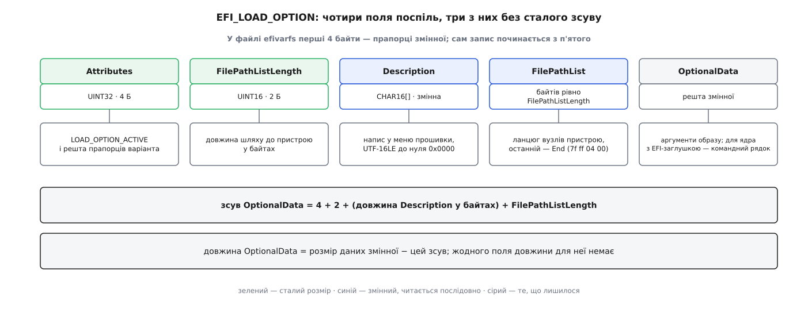

# 📋 Змінні UEFI та записи завантаження: інтерфейс

Прошивка тримає невелику базу даних, яка переживає вимкнення живлення, і саме в ній записано, що ця машина вміє завантажувати. Нижче — контракт до цієї бази: як влаштоване ім'я змінної, що означає кожен прапорець, якими викликами змінну читають і пишуть, у якому вигляді лежить варіант завантаження і як усе це виглядає з боку Linux.

## Ім'я — це пара

Змінна адресується не рядком, а парою «ім'я + GUID постачальника». Однакові імена в різних GUID — різні змінні, і саме так уникають зіткнень: кожен, хто додає своє, бере власне 128-бітне число й не питає нікого.

| Простір | GUID | Що там лежить |
|---|---|---|
| `EFI_GLOBAL_VARIABLE` | `8be4df61-93ca-11d2-aa0d-00e098032b8c` | усе, що описано специфікацією: `BootOrder`, `Boot####`, `Timeout`, `PlatformLang`… |
| база підписів образів | `d719b2cb-3d3a-4596-a3bc-dad00e67656f` | `db`, `dbx`, `dbt` — [Secure Boot](topic:sys-unix/secure-boot) звіряє підпис завантажуваного образу саме з ними |
| вендорний | власний GUID виробника | налаштування прошивки, серійні номери, дані самоперевірки плати |

У Linux ця пара склеєна в ім'я файлу через дефіс: `BootOrder-8be4df61-93ca-11d2-aa0d-00e098032b8c`.

## Прапорці змінної

| Константа | Значення | Що означає |
|---|---|---|
| `EFI_VARIABLE_NON_VOLATILE` | `0x00000001` | лягає в незалежну пам'ять і переживає вимкнення; без нього — тільки в оперативній до перезавантаження |
| `EFI_VARIABLE_BOOTSERVICE_ACCESS` | `0x00000002` | видима, поки живуть послуги завантаження |
| `EFI_VARIABLE_RUNTIME_ACCESS` | `0x00000004` | видима й після виходу з них, тобто з-під працюючої ОС |
| `EFI_VARIABLE_HARDWARE_ERROR_RECORD` | `0x00000008` | запис про апаратну помилку; таким змінним прошивка відводить окрему квоту |
| `EFI_VARIABLE_AUTHENTICATED_WRITE_ACCESS` | `0x00000010` | застаріле, вважається зарезервованим |
| `EFI_VARIABLE_TIME_BASED_AUTHENTICATED_WRITE_ACCESS` | `0x00000020` | дані мусять нести підпис із міткою часу; так захищені бази ключів |
| `EFI_VARIABLE_APPEND_WRITE` | `0x00000040` | не замінити вміст, а дописати до наявного |

Три правила, на яких найчастіше спотикаються. `RUNTIME_ACCESS` без `BOOTSERVICE_ACCESS` — недійсне поєднання. Перезапис наявної змінної з іншим набором прапорців — не зміна режиму, а помилка `EFI_INVALID_PARAMETER`: щоб змінити прапорці, змінну видаляють і створюють наново. І видалення — це не окремий виклик, а запис нульової довжини.

Два останні прапорці існують заради баз ключів. Дописування потрібне тому, що `dbx` — перелік заборонених підписів, який лише росте: замінювати його цілим блоком означало б щоразу пересилати весь список і ризикувати відкотом до старішої, коротшої версії. А підпис із міткою часу робить запис таким, що його не може підробити ані ОС, ані той, хто дістався до `efivarfs` з правами кореня: прошивка звіряє підпис із ключем, який лежить у ній самій.

## Виклики

Усі чотири живуть у таблиці послуг виконання, тобто доступні й після того, як прошивка звузилася до жменьки функцій усередині ядра.

```c
EFI_STATUS GetVariable(CHAR16 *VariableName, EFI_GUID *VendorGuid,
                       UINT32 *Attributes OPTIONAL, UINTN *DataSize, VOID *Data);

EFI_STATUS GetNextVariableName(UINTN *VariableNameSize, CHAR16 *VariableName,
                               EFI_GUID *VendorGuid);

EFI_STATUS SetVariable(CHAR16 *VariableName, EFI_GUID *VendorGuid,
                       UINT32 Attributes, UINTN DataSize, VOID *Data);

EFI_STATUS QueryVariableInfo(UINT32 Attributes, UINT64 *MaximumVariableStorageSize,
                             UINT64 *RemainingVariableStorageSize,
                             UINT64 *MaximumVariableSize);
```

`DataSize` у `GetVariable` — двобічний: на вході розмір вашого буфера, на виході справжній розмір даних. Звідси звичка викликати двічі:

```c
UINTN size = 0;
EFI_STATUS st = RT->GetVariable(L"BootOrder", &gEfiGlobalVariableGuid, NULL, &size, NULL);
if (st == EFI_BUFFER_TOO_SMALL) {           // size тепер справжній
    UINT16 *order = AllocatePool(size);
    st = RT->GetVariable(L"BootOrder", &gEfiGlobalVariableGuid, NULL, &size, order);
}
```

| Код | Коли повертається |
|---|---|
| `EFI_NOT_FOUND` | такої пари «ім'я + GUID» немає (для `GetNextVariableName` — перелік скінчився) |
| `EFI_BUFFER_TOO_SMALL` | буфер замалий; потрібний розмір уже лежить у `DataSize` |
| `EFI_INVALID_PARAMETER` | зокрема: неприпустимий набір прапорців або спроба перезапису з іншим набором |
| `EFI_OUT_OF_RESOURCES` | у незалежній пам'яті бракує місця |
| `EFI_WRITE_PROTECTED` | змінна лише для читання |
| `EFI_SECURITY_VIOLATION` | підпис не пройшов перевірки |
| `EFI_DEVICE_ERROR` | збій самої мікросхеми пам'яті |

`GetNextVariableName` обходить увесь простір імен разом, не розділяючи його на GUID: перший виклик робиться з порожнім ім'ям, кожен наступний — з тими ім'ям і GUID, які повернув попередній. Перелік не має обіцяного порядку, а додавання чи видалення змінної посеред обходу робить його подальші наслідки невизначеними — тоді обхід починають спочатку.

`QueryVariableInfo` питають **перед** записом: вона каже, скільки всього місця відведено під змінні з такими прапорцями, скільки лишилося і який найбільший розмір однієї змінної дозволено. Три числа, а не одне, бо квоти для сталих і тимчасових змінних окремі, і найбільша змінна майже завжди менша за весь залишок.

## Змінні менеджера завантаження

`####` — рівно чотири шістнадцяткові цифри у верхньому регістрі: `Boot0000`, `Boot000A`. Номер — лише ідентифікатор; порядок перебору задає `BootOrder`, а не арифметика номерів.

| Змінна | Тип даних | Прапорці | Призначення |
|---|---|---|---|
| `Boot####` | `EFI_LOAD_OPTION` | NV+BS+RT | один варіант завантаження: напис, звідки й що запускати |
| `BootOrder` | `UINT16[]` | NV+BS+RT | номери `####` у порядку спроб; перший, що завантажився, виграв |
| `BootNext` | `UINT16` | NV+BS+RT | завантажитися **наступного разу** саме з нього; прошивка стирає змінну перед спробою, тож дія одноразова навіть при невдачі |
| `BootCurrent` | `UINT16` | BS+RT | звідки завантажилися **цього** разу; створює прошивка, у незалежну пам'ять не лягає |
| `Timeout` | `UINT16` | NV+BS+RT | скільки секунд показувати меню; `0` — не показувати |
| `OsIndications` | `UINT64` | NV+BS+RT | прохання до прошивки; біт `0x1` — «наступного разу відкрий налаштування», те, що робить `systemctl reboot --firmware-setup` |

Так само влаштовані `Driver####`/`DriverOrder` (драйвери, які прошивка вантажить у себе перед меню) і `SysPrep####`/`SysPrepOrder`.

`BootCurrent` варта окремої уваги: це єдиний спосіб для вже запущеної системи дізнатися, яким саме записом її підняли. Тому інсталятори й засоби на кшталт `bootctl` читають її, щоб не гадати, з якого розділу і яким завантажувачем усе почалося, а на машині з кількома системами вона одразу каже, чий запис цього разу спрацював.

## EFI_LOAD_OPTION

```c
#pragma pack(1)
typedef struct {
  UINT32  Attributes;
  UINT16  FilePathListLength;
  // CHAR16 Description[];               — до нуля 0x0000
  // EFI_DEVICE_PATH_PROTOCOL FilePathList[];   — рівно FilePathListLength байтів
  // UINT8  OptionalData[];              — усе, що лишилося
} EFI_LOAD_OPTION;
#pragma pack()
```

Полів чотири, сталий зсув має лише перше й друге. Розбирають запис послідовно: пропустити шість байтів, дочитати `Description` до нульового символу, відлічити `FilePathListLength` байтів шляху — те, що лишилося від розміру змінної, і є `OptionalData`.



*Довжини `OptionalData` не зберігає ніхто: її рахують відніманням.*

| Прапорець варіанта | Значення | Дія |
|---|---|---|
| `LOAD_OPTION_ACTIVE` | `0x00000001` | без нього прошивка пропускає запис, хоч він і в `BootOrder` |
| `LOAD_OPTION_FORCE_RECONNECT` | `0x00000002` | перед запуском перепідключити всі драйвери |
| `LOAD_OPTION_HIDDEN` | `0x00000008` | не показувати в меню, але пробувати |
| `LOAD_OPTION_CATEGORY` | `0x00001F00` | маска категорії; `0x0` — завантаження, `0x100` — застосунок з окремого переліку |

Ось справжній запис `Boot0003` із написом «Ubuntu», розібраний по байтах:

```
зсув   байти                          поле
0x00   01 00 00 00                    Attributes = LOAD_OPTION_ACTIVE
0x04   62 00                          FilePathListLength = 0x0062 = 98 байтів
0x06   55 00 62 00 75 00 6e 00        Description = "Ubuntu"
       74 00 75 00 00 00                UTF-16LE, останні два байти — нуль
0x14   04 01 2a 00 …                  вузол Media/Hard Drive, 42 Б
0x3e   04 04 34 00 5c 00 45 00 …      вузол Media/File Path, 52 Б: "\EFI\ubuntu\shimx64.efi"
0x72   7f ff 04 00                    вузол End: шлях скінчився
0x76   …                              OptionalData
```

Шлях до пристрою — ланцюг вузлів, у кожного заголовок «тип, підтип, довжина (2 Б)». Вузол `Hard Drive` називає розділ не буквою й не номером диска, а його GUID із таблиці розділів разом із початком і довжиною, — тому запис не ламається від перестановки дисків, зате його вбиває переформатування розділу. Вузол `File Path` дає шлях усередині файлової системи того розділу, зі зворотними скісними рисками. Для ядра, зібраного з EFI-заглушкою і запущеного прошивкою напряму, `OptionalData` — це [командний рядок ядра](topic:sys-unix/bootloader-and-cmdline).

## Погляд Linux: efivarfs

Змінні видно як [псевдо-файлову систему](topic:sys-unix/pseudo-filesystems), змонтовану окремо від решти `/sys`:

```sh
mount -t efivarfs none /sys/firmware/efi/efivars
```

Кожна змінна — файл, **перші чотири байти якого не дані, а прапорці** (`UINT32`, молодшим байтом уперед). Тому читання завжди зі зсувом:

```sh
# BootCurrent — одне 16-бітне число після чотирибайтових прапорців
od -An -t x2 -j 4 -N 2 \
   /sys/firmware/efi/efivars/BootCurrent-8be4df61-93ca-11d2-aa0d-00e098032b8c
```

Запис теж особливий: увесь буфер — прапорці плюс дані — має піти **одним** викликом `write()`; дописування шматками й обрізання файлу не підтримуються. Запис самих лише чотирьох байтів, без даних, означає нульову довжину, тобто видалення змінної — те саме робить `rm`.

Саме тому ядро створює файли змінних із [прапорцем незмінності inode](topic:sys-unix/inode-flags-chattr): рекурсивне видалення каталогу не сміє стерти те, без чого частина плат не проходить самоперевірку. Виняток — короткий білий список тих змінних, які й задумані змінними:

> `BootOrder`, `BootNext`, `Boot####`, `DriverOrder`, `Driver####`, `Timeout`, `ConIn`, `ConOut`, `ErrOut` (і їхні `…Dev`), `Lang`, `PlatformLang`, `OsIndications`

Усе інше вимагає свідомого `chattr -i` перед записом. Друга сторожа — місце: перед кожним записом ядро питає прошивку `QueryVariableInfo` і відмовляє, якщо після запису вільного лишиться менше за `EFI_MIN_RESERVE` = 5120 байтів. Цифру взято зі скарги виробника: на частині плат переповнення сховища змінних теж закінчується машиною, яка не вмикається. Вимикач для тих, хто знає свою плату, — параметр ядра `efi_no_storage_paranoia`.

Обережність тут не зайва ще з однієї причини. Незалежна пам'ять — це ділянка тієї самої мікросхеми флеш-пам'яті, у якій лежить сама прошивка, а флеш має скінченну кількість циклів стирання. Прибирання стертих змінних робить прошивка, і робить його не одразу, а коли назбирається. Тому сценарій, що переписує змінну в циклі, — не безневинне навантаження: він і зношує мікросхему, і тримає сховище повним сміттям, яке ще не прибрали.

> 🔧 **Навіщо це.** Коли `efibootmgr` каже «No space left on device», диск ні до чого: це впертий у 5 КБ залишок незалежної пам'яті. Дієвий крок — прибрати мотлох старих записів (`-b XXXX -B`) або оновити прошивку, у якій полагодили прибирання стертих змінних, а не додавати місця на диску.

## efibootmgr

Проміжна ланка між викликами й людиною: читає й пише ті самі змінні через `efivarfs`, сам збирає `EFI_LOAD_OPTION` і сам знімає прапорець незмінності.

```sh
efibootmgr -v                                   # усі записи, з розібраними шляхами
efibootmgr -c -d /dev/nvme0n1 -p 1 \
           -L "Ubuntu" -l '\EFI\ubuntu\shimx64.efi'   # створити й поставити першим у BootOrder
efibootmgr -o 0003,0001,0000                    # задати порядок повністю
efibootmgr -n 0003                              # BootNext: один раз наступного разу
efibootmgr -N                                   # передумали: стерти BootNext
efibootmgr -b 0003 -A                           # зняти LOAD_OPTION_ACTIVE
efibootmgr -b 0003 -B                           # видалити запис
efibootmgr -t 5                                 # Timeout = 5 секунд
```

Дрібниці, що коштують часу: без `-d` береться `/dev/sda`, без `-p` — перший розділ, тож на машині з NVMe обидва ключі обов'язкові; шлях у `-l` пишуть зі зворотними скісними рисками й в одинарних лапках, інакше оболонка з'їсть їх як екранування; аргументи для `OptionalData` дописують у кінці рядка, а ключ `-u` (`--unicode`) каже записати їх двобайтовими символами замість ASCII — саме цього чекає ядро з EFI-заглушкою від свого командного рядка.

## Коли записів немає взагалі

Змінна `Boot####` описує конкретний розділ конкретного диска — про щойно встромлену флешку в незалежній пам'яті запису бути не може. Для цього існує запасний шлях: якщо жоден варіант не спрацював, прошивка шукає на службовому розділі файл із наперед відомим іменем.

| Архітектура | Файл |
|---|---|
| x86-64 | `\EFI\BOOT\BOOTX64.EFI` |
| x86 (32-біт) | `\EFI\BOOT\BOOTIA32.EFI` |
| AArch64 | `\EFI\BOOT\BOOTAA64.EFI` |
| ARM (32-біт) | `\EFI\BOOT\BOOTARM.EFI` |
| RISC-V 64 | `\EFI\BOOT\BOOTRISCV64.EFI` |
| LoongArch64 | `\EFI\BOOT\BOOTLOONGARCH64.EFI` |

Звідси й вигляд будь-якого інсталяційного образу: він кладе завантажувач саме за цією адресою — і тому вантажиться на машині, яка про нього нічого не знає.
