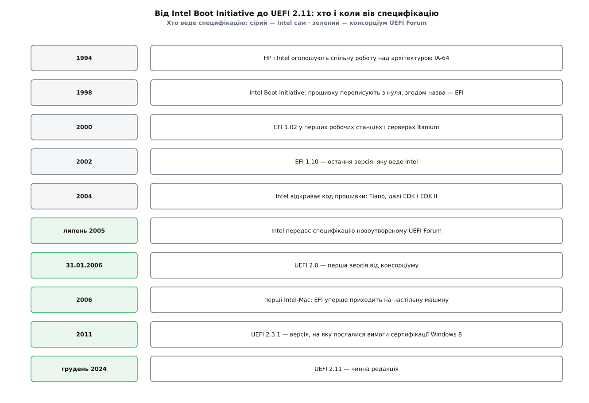

# 📜 Від Itanium до UEFI: як прошивку переписали з нуля

UEFI народився не на персональному комп'ютері й не як задум «замінити BIOS»: його зробили тому, що нову серверну архітектуру просто не було на чому запустити — і саме тому він має ту форму, яку має.

## Стеля, у яку впиралися не персоналки

У листопаді 1993 року HP звернулася до Intel із пропозицією спільно збудувати нову процесорну архітектуру, а в червні 1994-го компанії оголосили про спільну роботу. З цього виросла IA-64 — Itanium, машина, задумана як розрив із сумісністю: не розширення x86, а окрема система команд для великих серверів.

Розрив із сумісністю має ціну, яку помічають не одразу. Прошивка персонального комп'ютера роздавала свої послуги через програмні переривання шістнадцятибітного реального режиму: покласти номер функції в регістр і виконати `int 13h`. Ця схема — не інтерфейс, а спосіб виконання коду: вона потребує саме того режиму процесора, у якому стартувала машина 1981 року. Перенести її на архітектуру, спроєктовану з нуля, означало б спершу вбудувати в неї той стародавній режим, а потім ще й змушувати шістдесятичотирибітний завантажувач пірнати в нього перед кожним читанням сектора.

Але справа не лише в режимі. Серверна машина, заради якої все це затівалося, впиралася в BIOS з іншого боку — з боку розміру. Головний завантажувальний запис відводить під номер початкового сектора й довжину розділу по чотири байти:

```
2³² секторів × 512 Б = 4294967296 × 512 = 2 199 023 255 552 Б ≈ 2 ТіБ
```

Диск більший за два тебібайти в такій таблиці описати нічим, а первинних розділів у ній усього чотири. Для настільної машини 1998 року це була абстрактна межа, для дискового масиву — робоча. Тому разом з EFI придумали й нову [таблицю розділів](root:sys-unix/disk-partitions) з восьмибайтовими номерами секторів: GPT — не сусідній винахід, а частина тієї самої роботи.

Отже, першою в стелю BIOS уперлася не персоналка. У персоналки все працювало; у сервера на новій архітектурі не працювало нічого.

## Boot Initiative, який став EFI

Роботу почали 1998 року під назвою Intel Boot Initiative, і згодом вона дістала ім'я EFI (англ. Extensible Firmware Interface — розширюваний інтерфейс прошивки). Ключове слово тут «інтерфейс»: домовлялися не про те, як прошивка влаштована всередині, а про те, як до неї звертатися ззовні.

Перші робочі станції й сервери Itanium, випущені 2000 року, вже несли EFI 1.02 — тобто прошивка нового типу з'явилася в залізі раніше, ніж сам процесор дійшов до широкого продажу: Merced офіційно вийшов 29 травня 2001-го.

Остання версія, яку вів Intel одноосібно, — EFI 1.10. З її датуванням варто бути обережним: текст специфікації походить із 2002 року, а англомовні довідники часом ставлять їй 2005-й — рік, коли Intel остаточно зупинив власний розвиток EFI. Безсумнівне тут інше й важливіше: на 1.10 історія однієї компанії закінчилася.



*Двадцять шість років, і найважливіша подія в цьому переліку — не версія, а зміна власника специфікації.*

## Липень 2005: специфікація змінює власника

У липні 2005 року Intel припинив розвиток EFI на версії 1.10 і передав специфікацію новоутвореному консорціуму — UEFI Forum. Серед засновників були і виробники процесорів (Intel, AMD), і автори самих прошивок (AMI, Phoenix, Insyde), і виробники машин (HP, IBM, Dell, Lenovo, Apple), і Microsoft.

Ця передача — не формальність і не жест доброї волі, а умова життєздатності. Прошивка стоїть на перетині інтересів кількох галузей одразу: її пише один, ставить у машину другий, завантажується з неї третій. Специфікація, яку одноосібно веде виробник процесорів, для конкурента того виробника завжди лишається чужою територією. Ім'я змінилося рівно на одне слово — Unified, «уніфікований», — і саме воно позначає зміну по суті.

Далі версії йшли вже від консорціуму: UEFI 2.0 — 31 січня 2006 року, UEFI 2.1 — 7 січня 2007-го, UEFI 2.3.1 — 6 квітня 2011-го, чинна редакція 2.11 — грудень 2024-го. Саме на 2.3.1 послалися вимоги сертифікації Windows 8 (2012), і через них [перевірка підпису завантажувача](root:sys-unix/secure-boot) з рідкісної опції стала типовим станом машини з магазину.

Консорціум зробив і другий поділ, менш помітний ззовні. Крім самого UEFI — того, що прошивка показує назовні тому, кого запускає, — під його опікою з'явився окремий стандарт на внутрішню будову прошивки: як вона проходить етапи від першої інструкції після ввімкнення живлення до готового середовища, як усередині неї співіснують шматки коду від різних постачальників. Розділ тут проходить рівно по межі інтересів: назовні потрібна єдина домовленість, бо з нею говорять чужі завантажувачі; усередину зазирає лише той, хто прошивку збирає, і йому потрібне не те саме.

Тут добре видно, чим у цій історії була специфікація, а чим — ринок. Механізм перевірки підписів описали в тексті стандарту; масовим його зробило не це, а рядок у документі про сертифікацію, підписаний однією компанією.

## Папір без реалізації нічого не важить

Паралельно з цим сталася річ, яку в переліку версій не видно. 2004 року Intel відкрив вихідний код своєї прошивки — так званий Foundation Code. З нього виріс проєкт Tiano, далі EDK (англ. EFI Development Kit), а 2006-го — EDK II, що й став де-факто основою, з якої виробники плат збирають свої прошивки. Нині код розповсюджують під ліцензією BSD-2-Clause-Patent.

Без цього кроку решта історії була б інакшою. Специфікація UEFI — кількатисячосторінковий документ; писати його з нуля власними силами не став би майже ніхто, а якби взялися десятеро — дістали б десять несумісних прочитань. Спільна реалізація перетворила текст на щось, у чому «сумісність» перевіряється не тлумаченням, а компіляцією. Прикметно, що консорціум цей код не благословляв: реалізація здобула свою вагу практикою, а не постановою.

## Як воно дійшло до звичайних машин

На настільний комп'ютер EFI потрапив несподіваним шляхом. У січні 2006 року Apple випустила перші Macintosh на процесорах Intel — і поставила в них EFI, а не BIOS персоналки. Вийшло показово: машина була цілком робоча, але тогочасна Windows завантажитися з неї не могла, і Apple довелося окремо додавати емуляцію старої прошивки, щоб дати їй звичне середовище.

Далі підтягнулися операційні системи: шістдесятичотирибітна Windows Vista з першим пакетом оновлень (2008) навчилася завантажуватися з UEFI, а сертифікація Windows 8 зробила UEFI обов'язковим для нових машин. Linux ішов тим самим шляхом самотужки — від окремого завантажувача, що вмів говорити з прошивкою, до ядра, яке саме є застосунком UEFI.

## Що з цього легенда

Найпоширеніша розповідь звучить так: «UEFI прийшов і замінив BIOS». У ній неправильні всі три частини.

По-перше, це не заміна одного одним, а два різні задуми, які довго жили в одній мікросхемі: майже кожна прошивка десятиліттями несла в собі модуль сумісності (CSM), який відтворював старі переривання для тих, хто без них не міг. Intel оголосив намір прибрати цей модуль зі своїх платформ 2017 року, назвавши орієнтиром 2020-й, — тобто «заміна» тривала близько двадцяти років і на багатьох живих машинах ще не завершилася.

По-друге, це не прихід ззовні. UEFI виріс із конкретної інженерної біди конкретної архітектури, а на персональні комп'ютери потрапив пізніше й радше збоку.

По-третє, це не було рішення однієї компанії. Найважливіша подія тут — не поява версії, а момент, коли специфікація перестала комусь належати.

І остання дрібниця, яку варто розрізняти: графічне меню з мишкою, яке люди називають «UEFI», — це не UEFI. Специфікація описує послуги, протоколи й формат образу; на що схожа сторінка налаштувань і чи є вона взагалі — рішення виробника плати.
