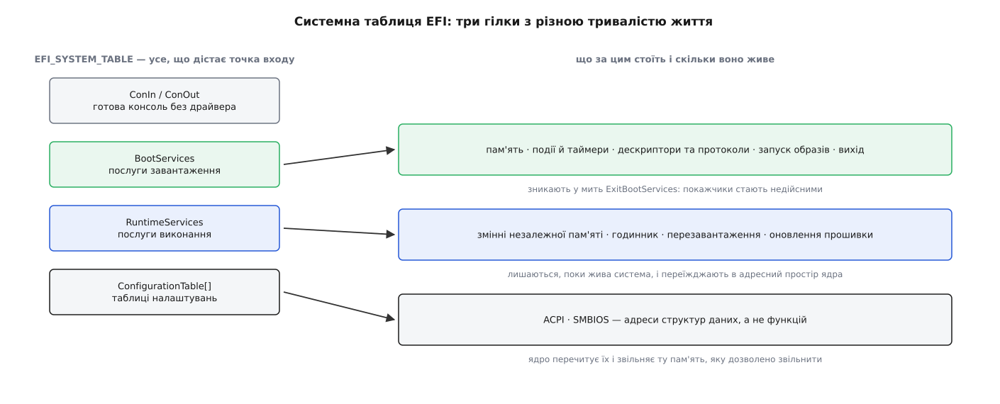
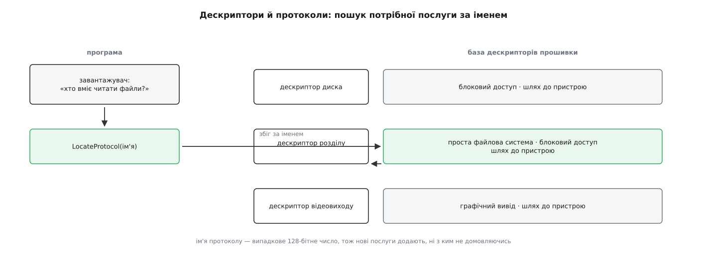
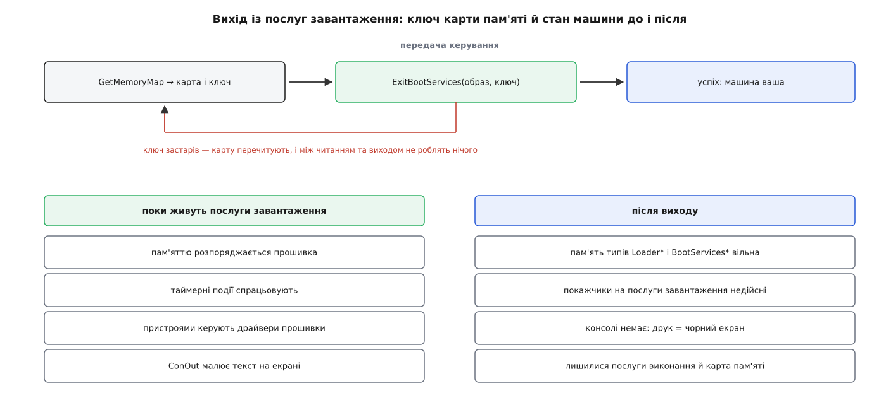

# UEFI: прошивка як середовище виконання

<preknowlist>
- [Ядро й простір користувача](topic:sys-unix/kernel-and-userspace) — код виконується в різних режимах процесора, і межу між ними перетинають лише в оголошених місцях.
- [Ланцюг завантаження](topic:sys-unix/boot-chain) — керування передають по черзі: прошивка, завантажувач, ядро, перший процес.
- [Завантажувач і командний рядок ядра](topic:sys-unix/bootloader-and-cmdline) — між прошивкою й ядром зазвичай стоїть окрема програма, і те, що вона передає ядру, вирішує все подальше.
- [ELF: сегменти, секції, точка входу](topic:sys-unix/elf-structure) — виконуваний файл є не купою байтів, а заголовком, секціями й адресою, з якої починають виконання.
- [Сторінки, таблиці сторінок і MMU](topic:sf-os/paging-and-mmu) — процесор бачить віртуальні адреси, а таблиці сторінок перекладають їх у фізичні.
- [Розділи диска](topic:sys-unix/disk-partitions) — носій ділять таблицею розділів, і розділ може мати оголошене службове призначення.
- [Псевдо-ФС: procfs, sysfs, tmpfs, devtmpfs](topic:sys-unix/pseudo-filesystems) — каталог у дереві може бути не файлами на диску, а вікном у щось зовсім інше.
</preknowlist>

Програма, яку прошивка бере з диска й запускає, потрапляє в дивне становище. У пам'яті машини більше нічого немає — ані ядра, ані бібліотек, ані іншого процесу. А зробити вона мусить чимало: показати на екрані список варіантів, дочекатися натиску клавіші, знайти й прочитати з диска файл на кількадесят мегабайтів, дізнатися, скільки в машині пам'яті й де саме вона лежить.

При цьому в самій програмі немає ні драйвера відеокарти, ні драйвера контролера диска, ні коду файлової системи. Їх там і не могло бути: цю програму зібрали й підписали задовго до того, як цю конкретну машину зібрали на заводі.

Отже, вона все це не робить сама — вона просить. І є кого просити: запустивши її, прошивка нікуди не зникла. Вона лишилася в пам'яті готовим набором послуг, які можна викликати як звичайні функції. Тобто ще до того, як у машині з'явилася бодай одна операційна система, там уже працює щось із власним розподільником пам'яті, власними драйверами, власною моделлю пристроїв і власним форматом виконуваних файлів. **UEFI** (англ. Unified Extensible Firmware Interface — уніфікований розширюваний інтерфейс прошивки) — це домовленість про те, як цим користуватися і як потім із цього вийти.

## Чому послуги мусили змінити форму

Ідея «прошивка надає послуги» не нова: BIOS робив те саме. Програма клала номер операції в регістр і виконувала програмне переривання — `int 13h` прочитати сектор, `int 10h` вивести символ. Схема пропрацювала два десятиліття, і зламали її дві речі.

Перша — режим процесора. Ті обробники написані для шістнадцятибітного реального режиму, у якому процесор стартує заради сумісності. Завантажувач, що хоче адресувати гігабайти й виконуватися в довгому режимі, мусить перед кожним викликом повернути процесор назад у реальний режим, а після виклику знову вибудувати весь стан. Це не просто незручно — це означає, що сучасна програма не може скористатися послугою прошивки, не поставивши машину в становище тридцятирічної давнини.

Друга — жорсткий набір. Номери переривань і номери функцій усередині них роздали ще на початку 1980-х. Виробник, який хоче додати послугу, якої в тому переліку немає — доступ до мережевої карти, до тому на кількох дисках, до нового класу носіїв, — мусить або зайняти чийсь номер, або домовитися з усіма іншими. Централізованого реєстру немає, тож розширення завжди означало конфлікт.

З цих двох болів прямо випливають два рішення. Послуга має бути **звичайним викликом функції** в рідному режимі процесора — тобто прошивка мусить віддати програмі не номери, а адреси функцій. І кожна нова послуга має отримувати ім'я, **унікальне без домовленостей**, — тобто не номер із загального переліку, а випадкове 128-бітне число. На цих двох рішеннях і стоїть усе інше. Звідки взявся сам задум і чому першими його побачили не персональні комп'ютери, а сервери на Itanium — [окрема історія](topic:sys-unix/uefi-firmware/hist-efi-to-uefi.md).

## Точка входу і корінь усього

Прошивка знаходить на службовому розділі файл і запускає його. Файл цей — не ELF, а PE (англ. Portable Executable — переносний виконуваний), формат зі світу Windows: у нього є заголовок, секції, таблиця переміщень і поле `AddressOfEntryPoint`. У заголовку стоїть підсистема з номером 10 — «застосунок UEFI»; сусідні номери 11 і 12 позначають драйвери, які прошивка вантажить у себе. Формат обрали не з любові до Windows, а з практичного розрахунку: у PE вже був описаний механізм переміщень, а образ треба вміти покласти за будь-якою вільною адресою.

Прошивка розкладає секції в пам'яті, лагодить переміщення й викликає точку входу. Підпис цієї функції — найважливіші два аргументи в усьому завантаженні:

```c
EFI_STATUS EFIAPI efi_main(EFI_HANDLE image, EFI_SYSTEM_TABLE *st);
```

Перший аргумент — сама програма як об'єкт у світі прошивки: за цим дескриптором можна спитати, з якого пристрою й файлу її взяли та який рядок аргументів їй передали. Другий — покажчик на **системну таблицю**, корінь, з якого доступне геть усе.



*Одна гілка помирає в мить передачі керування, друга живе, поки жива система, третя перетворюється на покажчики, які ядро перечитує.*

У таблиці лежать три речі. Перша — консоль: поля `ConIn` і `ConOut` дають готові об'єкти для читання клавіатури й виводу тексту, тож `st->ConOut->OutputString(st->ConOut, L"hello")` працює без жодного драйвера. Друга — два набори послуг, про які далі. Третя — масив **таблиць налаштувань**: пари «унікальне ім'я — адреса», якими прошивка віддає структури даних, а не функції; саме тут ядро потім знайде опис заліза.

```c
EFI_STATUS EFIAPI efi_main(EFI_HANDLE image, EFI_SYSTEM_TABLE *st)
{
        EFI_GUID gop_guid = EFI_GRAPHICS_OUTPUT_PROTOCOL_GUID;
        EFI_GRAPHICS_OUTPUT_PROTOCOL *gop;

        st->ConOut->OutputString(st->ConOut, L"жива\r\n");

        /* прошивка завела сторожовий таймер на 5 хвилин, перш ніж нас запустити:
           не вимкнеш — довге читання з повільного диска обірветься перезавантаженням */
        st->BootServices->SetWatchdogTimer(0, 0, 0, NULL);

        if (st->BootServices->LocateProtocol(&gop_guid, NULL, (void **)&gop) == EFI_SUCCESS)
                st->ConOut->OutputString(st->ConOut, L"кадровий буфер є\r\n");

        return EFI_SUCCESS;     /* повернення = вихід із програми */
}
```

Сторожовий таймер тут не дрібниця, а точний портрет усього середовища: прошивка запускає програму так, як операційна система запускає процес, — з обмеженням часу й правом убити. Тільки процесів тут немає, і вбити означає перезавантажити машину.

## Дескриптор і протокол

Тепер про те, що робить прошивку розширюваною. Її внутрішній світ — база **дескрипторів** (англ. handle — держак, ручка). Дескриптор сам по собі порожній: це просто «щось, що існує». Змістом його наповнюють **протоколи**.

Протокол — це пара «унікальне 128-бітне ім'я, структура з покажчиками на функції». Драйвер, який уміє читати диски, встановлює на дескриптор кожного знайденого диска протокол блокового доступу; той, хто розібрав таблицю розділів, чіпляє на дескриптор кожного розділу протокол простої файлової системи; відеодрайвер вішає на свій дескриптор протокол графічного виводу. Ім'я-число генерують випадково, тож два незалежні виробники не зіткнуться іменами, ні з ким не домовляючись. Оце і є «розширюваний» із назви.



*Програма не знає ні виробника, ні моделі — вона питає «хто вміє ось це» і дістає таблицю функцій.*

Звідси й вигляд типового коду завантажувача. Щоб прочитати файл, він не відкриває пристрій, а питає: дай усі дескриптори з протоколом простої файлової системи. Далі бере в потрібного відкриття тому, від тому — відкриття файлу, від файлу — читання. Жодного рядка про SATA, NVMe чи USB у ньому немає.

Але за цю зручність платять, і ціна визначає все, що станеться далі. Тут **немає процесів і немає захисту пам'яті**: усе виконується з найвищими привілеями в одному адресному просторі, де віртуальна адреса дорівнює фізичній. Тут **немає витіснення**: керує той, хто зараз працює, а «переривання» зводяться до подій, обробники яких викликають між справами, коли поточний код це дозволить. Помилка в будь-якій завантаженій програмі — це помилка всієї машини.

> 🔧 **Навіщо це.** Із цього прямо випливає, чому перевірку підпису ставлять саме тут. Код, який прошивка запускає, дістає всю машину без жодних перегородок — отже, єдиний момент, коли ще можна щось вирішити, це мить **перед** запуском. Тому [перевірений ланцюг завантаження](topic:sys-unix/secure-boot) улаштований як перевірка підпису файлу до передачі керування, а не як обмеження вже запущеного коду: обмежувати тут просто нічим.

Найкоротший спосіб відчути це середовище зсередини — написати в ньому програму на пів сторінки: [власний застосунок UEFI](topic:sys-unix/uefi-firmware/proj-hello-uefi.md) показує, як зібрати PE-образ, покласти його на службовий розділ, знайти протокол і прочитати файл — без жодної операційної системи під ним.

## Пам'ять, у якої вже є власник

Власного розподільника пам'яті програма теж не має: вона просить у прошивки — `AllocatePool` для дрібниць, `AllocatePages` для сторінок. І кожне таке прохання не лише віддає шматок, а й **записує, кому він належить**.

Причина цього обліку стає видна аж під час передачі керування ядру. На той момент пам'ять машини — це строката суміш: сама прошивка, її драйвери, буфери, які вона тримає, таблиці опису заліза, код завантажувача, розпакований образ ядра й вільні проміжки між усім цим. Ядро мусить точно знати, що з цього можна затоптати, що звільниться за мить, а що не можна чіпати ніколи. Не знати — означає записати щось поверх чужого й упасти через хвилину в місці, ніяк не пов'язаному з причиною.

Тому прошивка веде **карту пам'яті**: масив описів «тип, фізичний початок, кількість сторінок, властивості». Тип тут — не характеристика заліза, а саме заповіт: що робити з цією ділянкою після того, як прошивка відійде від справ.

**Витяг із карти пам'яті звичайної машини перед передачею керування.**

```
тип                       початок       сторінок   що з цим робить ядро
EfiConventionalMemory     0x00100000     0x0007F0   вільна пам'ять, забирає одразу
EfiLoaderCode             0x0087F000     0x000020   код завантажувача, звільняє
EfiBootServicesData       0x00A00000     0x0012C0   буфери прошивки, звільняє
EfiACPIReclaimMemory      0x7B000000     0x000040   опис заліза: звільняє ПІСЛЯ прочитання
EfiACPIMemoryNVS          0x7B040000     0x000080   не чіпає ніколи
EfiRuntimeServicesCode    0x7B0C0000     0x000030   код, який житиме далі всередині ядра
EfiMemoryMappedIO         0xFED00000     0x000010   не пам'ять узагалі: вікно пристрою
```

Типів багато, а доль лише три: забрати одразу, забрати після того, як прочитав, не забирати ніколи. Останні два рядки — про різні речі: перший позначає пам'ять, у якій і далі виконуватиметься код прошивки, другий — адреси, за якими взагалі немає жодної мікросхеми пам'яті, лише регістри пристрою.

## Вихід: рукостискання, яке може не вдатися

Поки живуть послуги завантаження, машиною порядкує прошивка: вона володіє пам'яттю, вона тримає таймер, її драйвери говорять із пристроями. Ядро так працювати не може — воно збирається завести власні таблиці сторінок, власні обробники переривань і власні драйвери тих самих пристроїв. Двом господарям на одному контролері не розминутися.

Отже, потрібна мить чіткого переходу. Її виконує виклик `ExitBootServices`, і влаштований він хитріше, ніж «вимкнути й піти».

Аргументів у нього два: дескриптор програми, яка забирає машину, і **ключ карти пам'яті** — число, яке прошивка видала разом з останньою прочитаною картою й міняє щоразу, коли пам'ять перерозподіляється. Якщо ключ не збігається з поточним, виклик не вдається.

Сенс цієї перевірки в тому, що карта — це не довідка, а зобов'язання. Ядро збирається діяти за нею як за істиною: тут вільно, тут не можна. Якщо між читанням карти й виходом хтось узяв пам'ять — а взяти може будь-що, навіть виведення рядка на екран, бо прошивка виділить під нього буфер, — то карта в руках ядра вже бреше. Ключ перетворює це з невидимої біди на чесну відмову.

Звідси й обов'язковий вигляд цього місця в будь-якому завантажувачі: цикл, у якому після невдачі карту перечитують, і між читанням та виходом не роблять **нічого**.

```c
static EFI_STATUS take_over(EFI_HANDLE image, EFI_SYSTEM_TABLE *st)
{
        EFI_BOOT_SERVICES *bs = st->BootServices;
        EFI_MEMORY_DESCRIPTOR *map = NULL;
        UINTN size = 0, key = 0, dsz = 0;
        UINT32 dver;
        EFI_STATUS rc;

        for (;;) {
                rc = bs->GetMemoryMap(&size, map, &key, &dsz, &dver);
                if (rc == EFI_BUFFER_TOO_SMALL) {
                        if (map)
                                bs->FreePool(map);
                        /* запас на описи, які додасть саме це виділення */
                        size += 4 * dsz;
                        rc = bs->AllocatePool(EfiLoaderData, size, (void **)&map);
                        if (rc != EFI_SUCCESS)
                                return rc;
                        continue;
                }
                if (rc != EFI_SUCCESS)
                        return rc;

                rc = bs->ExitBootServices(image, key);
                if (rc == EFI_SUCCESS)
                        return EFI_SUCCESS;             /* машина наша */
                if (rc != EFI_INVALID_PARAMETER)
                        return rc;
                /* ключ застарів: карта змінилася. Нічого не друкуємо
                   й нічого не виділяємо — просто перечитуємо її. */
        }
}
```

Після вдалого виклику машина міняється миттєво. Таймерні події більше не спрацьовують. Усі покажчики на послуги завантаження стають недійсними — включно з `ConOut`, тож найпоширеніша помилка тут виглядає як чорний екран без жодного слова: програма спробувала повідомити про свій успіх уже після того, як забрала в себе вивід. Сторожовий таймер вимкнено. Пам'ять типів `EfiBootServices*` і `EfiLoader*` вільна.



*Ключ карти пам'яті робить перехід або цілком успішним, або цілком невдалим: третього стану, у якому ядро діє за застарілою картою, не існує.*

## Те, що не йде

Половина послуг переживає вихід. Це **послуги виконання**: читання й запис змінних у незалежній пам'яті, годинник реального часу, перезавантаження й вимкнення машини, застосування образу оновлення самої прошивки.

Живуть вони не з примхи, а тому, що ці дії неможливо описати переносно. Де на цій платі мікросхема незалежної пам'яті, за якою шиною до неї говорити, у якій послідовності смикнути ніжки, щоб машина вимкнулася без ушкоджень, — усе це знає лише код виробника плати. Прошивка лишає по собі рівно ті функції, які без неї довелося б писати заново для кожної моделі.

Але між ядром і цим кодом стоїть перешкода. Прошивка писалася в світі, де віртуальна адреса дорівнює фізичній, і всередині її коду повно абсолютних покажчиків. Ядро ж вмикає власні таблиці сторінок, у яких за старими адресами вже нічого немає.

Розв'язують це одним викликом — `SetVirtualAddressMap`. Ядро віддає прошивці ту саму карту, але з проставленими новими, віртуальними адресами для кожної ділянки послуг виконання. Прошивка проходить по власних внутрішніх покажчиках і переписує їх на нові адреси. Виклик дозволено зробити **лише один раз за життя машини**: вдруге переписувати вже нічого — старих адрес усередині не лишилося. Саме тому [завантаження нового ядра без перезавантаження машини](topic:sys-unix/kexec-and-kdump) успадковує вже виставлене відображення, а не робить своє: у Linux цей виклик навмисно винесли в ту частину коду, яка при такому переході не виконується.

Наслідок із цього неприємний і важливий: **код прошивки виконується всередині адресного простору ядра, з правами ядра**. Написав його виробник плати, оновлюють його рідко, а помилка в ньому виглядає як помилка ядра. Тому Linux тримає для цих ділянок **окремий набір таблиць сторінок**: коли викликають послугу виконання, перемикаються на них, і код прошивки просто не бачить решти пам'яті ядра. Виклики серіалізують під замком — прошивка не розрахована на те, що до неї звернуться з двох ядер процесора одночасно. А для плат, чия прошивка ламається на новому відображенні, лишили запобіжники в командному рядку: від «не переставляти адреси» до «взагалі не викликати послуги виконання».

> 🔧 **Навіщо це.** Коли машина падає або зависає саме на операціях зі змінними прошивки чи на вимкненні, а стек у журналі веде в `efi_call`, шукати помилку в ядрі марно — виконувався чужий код. Дієві кроки тут інші: оновити прошивку плати й, якщо це не допомогло, вимкнути потрібне параметром командного рядка. Оновлення прошивки, до речі, теж роблять цією ж послугою: [капсули UEFI, таблиця ESRT і fwupd](topic:sys-unix/firmware-capsule-updates) дають спосіб оновити мікрокод плати з-під працюючої системи.

## Що з усього цього дістається Linux

Тепер видно, звідки в системі беруться речі, які здаються даними згори.

**Опис заліза.** У масиві таблиць налаштувань лежать покажчики на ACPI і SMBIOS. Перший — [таблиці й байткод, якими прошивка описує залізо](topic:sf-os/acpi-tables): що є на платі, за якими адресами й перериваннями, як цим керувати. Це відповідь тієї самої задачі, яку на вбудованих платах розв'язує [дерево пристроїв](topic:sys-unix/device-tree), тільки описом справа не обмежується — там є ще й код, який ядро виконує на власному тлумачі.

**Екран до появи драйверів.** Прошивка встановила режим і віддала адресу кадрового буфера — ядро малює текст у нього, поки справжній графічний драйвер ще не завантажився.

**Ідентичність і вибір.** Незалежна пам'ять прошивки тримає змінні, а серед них — записи завантаження: перелік того, що можна запустити, і порядок перебору. Це означає річ, яку легко проґавити: **менеджер завантаження вбудований у прошивку**. Вона не просто «читає перший сектор» — вона зберігає іменовані варіанти, показує їх людині й запускає обраний. Окремий завантажувач у такій машині потрібен уже не для пошуку файлу, а лише там, де потрібен вибір, якого прошивка не вміє. І запасний шлях — файл із наперед відомим іменем на службовому розділі — існує саме для носіїв, про які в незалежній пам'яті жодного запису бути не може. Як улаштовані ці змінні, у якому вигляді записаний варіант завантаження і що з цим робить `efibootmgr` — [окремий розбір інтерфейсу](topic:sys-unix/uefi-firmware/api-efi-variables.md).

З простору користувача все це видно як каталог `/sys/firmware/efi`, а змінні — як окрема файлова система в ньому, змонтована з типом `efivarfs`. Кожна змінна — файл, перші чотири байти якого не дані, а прапорці. І з цим пов'язана історія, яку варто знати кожному, хто пише сценарії з видаленням файлів.

Деякі плати тримають у тих самих змінних дані, без яких вони не проходять самоперевірку при вмиканні. Файлова система показує змінні як звичайні файли, і рекурсивне видалення каталогу стирало їх усі — після чого машина більше не вмикалася взагалі. Голосно це вилізло 2016 року на ноутбуках кількох виробників. Відповідь ядра — позначати всі змінні, крім невеликого білого списку, незмінними, тож звичайне видалення на них не діє, а програма, якій справді треба писати, спершу мусить зняти цей прапорець свідомо. Друга обережність із того самого джерела: перш ніж записати нову змінну, ядро перевіряє, скільки місця лишилося в незалежній пам'яті, і відмовляється писати, коли його замало, — бо на частині плат переповнення цієї пам'яті теж закінчується машиною, яка не стартує.

Ось у чому головна відмінність цієї ланки від усіх сусідніх у ланцюзі завантаження. Завантажувач передав керування — і його більше немає, ядро розпакувалося — і розпаковувача більше немає. Прошивка не зникає: вона **звужується**. Спочатку це ціле середовище виконання з драйверами, файловими системами й розподільником пам'яті; після одного виклику від нього лишається жменя функцій; вони переїжджають у ваш адресний простір і живуть там до вимкнення живлення. Усе, чим ви користуєтеся до цього виклику, — чужий код, якому ви довіряєте цілком; усе, що лишається після нього, — чужий код усередині вашого ядра.
