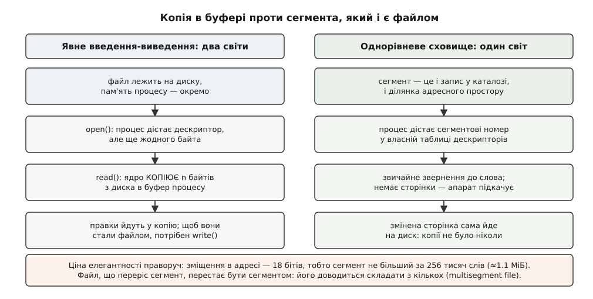

# 📜 Що обіцяв Multics — і чому обіцянка спізнилася

Multics обіцяв не «ще одну операційну систему», а обчислення як комунальну послугу — і майже кожну свою обіцянку зрештою виконав, тільки на кілька років пізніше, ніж це могло вирішити долю проєкту. Розібрати цю історію варто саме як механізм: що конкретно було обіцяно, які інженерні рішення з цього неминуче випливали, чому саме вони коштували стільки часу — і які з них через двадцять років повернулися в системи, що начебто нічого в Multics не позичали.

## Дев'ять обіцянок і що вони означали технічно

Восени 1965-го на Fall Joint Computer Conference команда з трьох організацій — MIT Project MAC, Bell Telephone Laboratories й підрозділу великих машин General Electric — виклала шість статей з описом системи, якої ще не було. Через сім років Фернандо Корбато (Fernando J. Corbató), Чарльз Клінген (Charles T. Clingen) і Джером Солцер (Jerome H. Saltzer) у праці «Multics — The First Seven Years» перерахували цілі, які тоді ставили. Їх було дев'ять, і вони розкладаються на три вимоги, кожна з яких тягла за собою цілком конкретну інженерію.

**Перша вимога — працювати як комунальна мережа.** Доступ із віддалених терміналів як звичайний спосіб роботи; безперервна робота на кшталт електричної чи телефонної служби; здатність нарощувати й зменшувати потужність без переписування системи. Звідси йшла вимога, дивна для 1965 року: додавати й вимикати процесори, пам'ять і диски на ходу, не зупиняючи машину. Система, що торгує обчисленнями, не має права мати планове вимкнення — бо його не має електрика. (Довшу історію самої ідеї «платити за спожите» розказано [окремо](topic:sf-apps/cloud-cost-model/hist-utility-computing.md); тут важлива лише її технічна ціна.)

**Друга вимога — тримати в одній машині чужих одне одному людей.** Надійне зберігання файлів; вибіркове керування тим, хто чим ділиться; ієрархічна структура — і логічна, і адміністративна. Звідси дерево каталогів і список доступу на кожному записі: не «мій — чужий», а іменний перелік, хто саме що саме може. І звідси ж [кільця захисту](topic:hw-arch/protection-rings) — драбина рівнів довіри замість двох станів «наглядач або користувач».

**Третя вимога — пережити власне майбутнє.** Ефективна робота для дуже різних за розміром задач; кілька мов і середовищ програмування в одній системі; і, окремо названим пунктом, така гнучкість будови, щоб система пережила послідовні хвилі технічних змін. Це вже не можливість, а вимога до самої форми коду.

Разом ці дев'ять цілей описують не «що система вміє», а **в якому режимі вона живе**. І саме режим виявився дорогим.

## Сегмент замість файлу

Найглибша з ідей Multics стосувалася того, чого користувач не бачить узагалі, — форми адреси.

У машині середини 1960-х файл і пам'ять — два різні світи з різними правилами. Щоб торкнутися вмісту файлу, програма мусила явно перевезти його з одного світу в інший: попросити ядро прочитати стільки-то байтів у свій буфер, попрацювати з копією, а потім явно відправити копію назад. Кожна програма, що працює з даними, містить цю перевізну логіку, і вона щоразу нова, бо буфери, розміри й моменти запису в кожної свої.

Multics прибрав другий світ. Адреса в ньому — не число, а пара: номер сегмента й зміщення всередині нього. Сегмент — це іменована ділянка, і водночас це запис у файловій системі. «Відкрити файл» означало дати йому номер у власній таблиці дескрипторів процесу; далі програма просто зверталася до слова за адресою, а апарат перекладу — [сегментація](topic:hw-arch/memory-segmentation) поверх сторінкової [віртуальної пам'яті](topic:hw-arch/virtual-memory) — сам підкачував потрібну сторінку з диска, коли до неї доходило звертання. Копії не було ніде: не було моменту «прочитати» і не було моменту «записати».



*Ліворуч — світ, у якому дані треба возити між файлом і пам'яттю власноруч; праворуч — однорівневе сховище, де возити нікуди, бо це те саме. Знизу — межа, об яку модель спотикається.*

> 🔧 **Навіщо це.** Виграш тут не в швидкості, а в тому, що зникає цілий клас коду. У світі однорівневого сховища структура даних, побудована з покажчиків, лишається чинною після завершення програми: покажчик — це адреса в сегменті, а сегмент нікуди не подівся. Не треба ані серіалізації, ані формату файлу, ані розбору цього формату при наступному запуску. Половина того, що ми пишемо навколо даних, існує лише тому, що дані доводиться перекладати між двома поданнями.

Ціна цієї елегантності записана просто в розрядності. Слово машини — 36 бітів, і адреса ділилася на два поля по 18 бітів:

```
Адреса в Multics — пара, а не число

  ⟨ номер сегмента , зміщення в сегменті ⟩
        18 бітів           18 бітів

  межа зміщення:  2¹⁸ = 262144 слова
  у байтах:       262144 · 36 / 8 = 1179648 = 1.125 МіБ

  на практиці системна межа була ще нижча —
  255 сторінок по 1024 слова:
  255 · 1024 = 261120 слів
```

Файл, що переріс цю межу, переставав бути сегментом. Для нього вигадали окремий тип об'єкта — багатосегментний файл: назовні це виглядало як один запис, а насправді був каталог із сегментами на імена «0», «1», «2», і працювала з ним окрема системна підпрограма `msf_manager_`. Тобто сховище, у якому «немає файлів, є тільки пам'ять», мусило завести спеціальний механізм саме для того, що файлом якраз і є, — для великого суцільного потоку даних. Це не дрібниця конструкції: це місце, де ідея впирається в те, що адреса скінченна, а дані — ні.

Варто зняти й поширену помилку: Multics не змушував працювати лише через відображення. Звичайне потокове введення-виведення в ньому теж було, і ним користувалися. Однорівневе сховище було основою моделі, а не єдиним дозволеним способом.

## Код, що доклеюється під час роботи

Друга ідея випливає з першої майже механічно. Якщо процедура — це теж сегмент, то й підключати її можна тоді, коли вона знадобилася.

У Multics програма посилалася на чужу процедуру за **іменем**, а не за адресою. Поки виконання жодного разу не дійшло до цього імені, у процесі не було нічого — ані самої процедури, ані місця під неї. На першому зверненні апарат давав пастку; системний лінкувальник брав ім'я, шукав відповідний сегмент за правилами пошуку (список каталогів, який користувач міг налаштувати сам), додавав знайдене в адресний простір процесу, заміняв посилання справжньою адресою — і виконання продовжувалося з тієї самої команди, наче нічого не сталося. Наступне звертання коштувало вже нуль.

З цього виріс спосіб працювати з машиною, який ми сьогодні вважаємо самоочевидним: **набране в командному рядку слово — це ім'я програми**. Саме Multics зробив таке припущення нормою. Але механізм за ним був інший, ніж той, до якого звикли ми: команда не запускала окремої програми, вона доклеювала процедуру у ваш власний процес і викликала її. Один процес на весь сеанс роботи, який поступово обростає кодом.

Тут добре видно, чому дві системи з однієї ідеї виходять різними. Той самий задум — «команда це ім'я процедури» — Unix реалізував протилежним способом: породити окремий процес і замістити його вмістом програми, злінкованої наперед. Multics платив за свій варіант складністю захисту: якщо чужий код опиняється у вашому адресному просторі, потрібні і кільця, і ворота, і перевірка аргументів на кожному переході. Unix платив накладними витратами на створення процесу — але діставав ізоляцію задарма, бо збій чужої команди не міг зачепити нічого вашого. Ця розвилка — приклад того, що [різниця систем](topic:sys-unix/unix-philosophy) рідко буває різницею ідей; частіше це різниця в тому, чим саме за ідею платять.

## Кільця — коротко

Ієрархія рівнів привілеїв теж родом звідси: замість двійкового поділу «наглядач або користувач» Multics будував концентричні рівні довіри, з дужками доступу на кожному сегменті й воротами як єдиними дозволеними входами всередину. У задумі їх було шістдесят чотири, зроблених програмою на GE-645; у кремнії Honeywell 6180 — вісім. [Як саме вони влаштовані й чому їх стало вісім](topic:hw-arch/protection-rings/hist-rings-multics.md) — окрема розмова, бо це найдетальніше опрацьована частина всієї конструкції.

## Механізм затримки: три невідомі поспіль

Тепер про те, чому це все вийшло пізно. Пояснення на кшталт «замахнулися на забагато» правдиве, але нічого не пояснює. Механізм конкретніший, і він складається з трьох невідомих, які довелося розв'язувати одну за одною, а не паралельно.

**Невідома перша — залізо.** Систему проєктували під машину, якої ще не було: GE-645 із сегментацією й сторінковою пам'яттю, доробленою з серійної 635-ї. Вона приїхала в MIT у січні 1967-го, із суттєвим запізненням проти планів 1965 року. До того моменту не існувало нічого, на чому можна було б перевірити, чи припущення проєктувальників хоч приблизно правильні.

**Невідома друга — мова.** З самого початку вирішили писати системний код мовою високого рівня, і 1965-го обрали PL/I. Компілятора PL/I тоді не було ні в кого. Розробку віддали фірмі Digitek, і за рік вона придатного компілятора не зробила. У середині 1966-го Боб Морріс (Robert Morris) і Даг Макілрой (Douglas McIlroy) з Bell Labs власноруч написали компілятор для підмножини мови — Early PL/I, EPL — мовою TMG, під CTSS. Він працював, але був повільний і на частині конструкцій давав неефективний код, тож писати доводилося у ще вужчій підмножині. Створення цього компілятора й навчання роботи з ним самі стали окремим джерелом затримки.

**Невідома третя — мірило.** Поки залізо й компілятор не зійшлися разом, проєкт не мав як дізнатися, наскільки він помиляється. Коли на початку 1967-го почалося зведення частин докупи, виявилися, за словами самих авторів, разючі розбіжності між дійсною і очікуваною швидкодією. Не помилки — саме розбіжності: код був функціонально правильний і при цьому непридатно повільний.

Ось де історія стає повчальною по-справжньому. Корбато, Клінген і Солцер, розбираючи причини, назвали три явища, які повторювалися раз за разом. Перше: більшу частину складності приносили не головні можливості, а другорядні. Друге: обраний поділ на модулі й межі між ними час від часу виявлялися незручними. Третє, найважливіше: щоразу наново з'ясовувалося, що найцінніша властивість алгоритму — простота, а не спеціальні механізми для рідкісних випадків. Найяскравіший приклад — сама віртуальна пам'ять: спершу вона керувала блоками змінного розміру, «щоб було гнучко»; перехід на прості блоки сталого розміру дав виграш понад порядок величини.

Тобто система гальмувала не тому, що робила щось складне, а тому, що робила складно те, що можна було зробити просто, — і дізнавалася про це лише під час вимірювання, тобто через два роки після проєктування.

**А тепер гроші.** Bell Labs орендувала власну GE-645 і тримала на проєкті близько двадцяти п'яти інженерів. 1968 року ARPA розглядала припинення фінансування, що поховало б проєкт узагалі; у переговорах команда дістала жорсткий строк — восени 1969-го відкрити справжню службу. Bell Labs вийшла з проєкту у квітні 1969-го, за пів року до цього строку. Причина, названа без прикрас: строки розтягувалися, а дати завершення ніхто не міг назвати переконливо — при тому, що оренда й зарплати платилися далі.

Механізм тут загальний і не має нічого спільного з чиєюсь недбалістю. Проєкт із трьома послідовними невідомими не здатен назвати дату — не з упертості, а тому, що дату нема з чого вивести. Учасник, який платить погодинно й не дістає проміжного результату, виходить першим. Це не вирок системі — це властивість такої форми фінансування.

## Чого в цій історії немає

Легенда про те, що Multics помер 1969-го, поширена й хибна: вийшла Bell Labs, а не проєкт. У жовтні 1969-го MIT відкрила службу для звичайних користувачів. Навесні 1970-го, за пів року після відкриття, система задовільно обслуговувала близько тридцяти п'яти одночасних користувачів. Січень 1973-го приніс Honeywell 6180 з апаратними кільцями — і питання швидкодії закрилося; у 1970–80-х Multics вигравав порівняльні випробування проти рівних собі систем. Отже, репутація «великий і повільний» правдива для часів до випуску й хибна для всього подальшого життя системи.

Життя ж було довге. На початку 1980-х працювало приблизно двадцять п'ять — тридцять майданчиків. Honeywell припинила розробку в липні 1985-го. Остання жива система — у Департаменті національної оборони Канади в Галіфаксі — вимкнулася 30 жовтня 2000 року, через тридцять один рік після своєї «смерті».

Ще одна легенда, яку варто зняти при нагоді: Кен Томпсон не «писав Multics». Він був одним із приблизно двадцяти п'яти інженерів Bell Labs, що працювали в проєкті між 1965 і 1969 роками, і зробив у ньому свою частину, не більшу за інші.

## Що повернулося — і яким шляхом

Кільця повернулися 1982 року: Intel 80286 приніс чотири рівні привілеїв просто в кремнії, і відтоді вони є в кожному персональному комп'ютері. Але повернувся механізм, а не задум: із чотирьох рівнів у справжніх системах живуть два — нульовий для ядра й третій для програм. Середні, заради яких драбину й будували, стоять порожні.

Відображення файлів у пам'ять повернулося ще пізніше й в іншій ролі. Виклик `mmap` описали в документації 4.2BSD (1983), але не реалізували — сили пішли на мережу, і опис лишився описом із неузгодженою семантикою. Першу справжню працюючу реалізацію дала SunOS 4.0 у 1988-му. Тобто ідея прожила двадцять років у чужих системах як окрема можливість, яку програма вмикає свідомо, — а не як загальна модель, у якій живе все. [Що саме дає таке відображення сьогодні](topic:sys-unix/mmap-model) — уже питання не історії, а щоденної роботи.

Динамічне під'єднання коду повернулося тим самим випуском: SunOS 4.0 приніс схему з позиційно-незалежним кодом і окремим лінкувальником `ld.so`, який відображає бібліотеки в адресний простір саме через `mmap`. Звідти вона розійшлася в BSD, Linux і macOS і стала загальноприйнятою. Ідея дослівно та сама, що в Multics, — але одну її половину пізніші системи навмисно приморозили. Пошук потрібного коду за іменем у момент першого звертання, з налаштовуваними правилами пошуку, у Multics був зручністю для користувача. У світі, де бібліотеки постачають чужі люди, «знайди щось із цим іменем» — це вже не зручність, а спосіб підсунути програмі не той код. Тому [сучасний порядок пошуку](topic:sys-unix/library-search-order) жорсткий, а бібліотеки носять версійні імена й версії символів. Механізм [динамічного лінкування](topic:sf-lang/dynamic-linking) вижив; свобода вибору, що саме він знайде, — ні.

Дві речі зайшли в загальний ужиток настільки глибоко, що про їхнє походження ніхто не питає. Ієрархічна файлова система — дерево каталогів довільної глибини — описана в статті Роберта Дейлі (Robert C. Daley) з MIT і Пітера Ноймана (Peter G. Neumann) з Bell Labs 1965 року, тобто до появи Unix; учасники проєкту вважають Multics першою системою, що її мала. Списки доступу на кожному записі файлової системи — теж перші саме там. Сьогодні і [дерево каталогів](topic:sys-unix/directory-as-mapping), і [ACL](topic:sys-unix/acl-and-xattr) є всюди, і жодне з них не сприймається як чиясь вигадка.

Окремо варто назвати те, що зазвичай приписують Unix: **ядро мовою високого рівня**. У Multics машинною мовою лишилася приблизно шоста частина з півтори тисячі модулів — переважно робота з базами даних і привілейовані команди. Решта була PL/I. Unix повторив цей хід на C через кілька років, і саме повторення, а не винахід, зробило його переносним.

І окремо — про те, чого повторювати не варто. Однорівневе сховище справді з'явилося в комерційній машині — IBM System/38 1978 року, а звідти в AS/400. Але спокуслива лінія «Multics → System/38» доказами не підтверджена: конструкція System/38 виводиться з внутрішнього проєкту IBM Future Systems, і прямого успадкування джерела не показують. Тут чесніше говорити про повторний винахід ідеї, ніж про родовід.

## Що так і не повернулося

Однорівневе сховище як **модель системи** не повернулося ніде. `mmap` є в кожній системі, але типовий світ і далі розділений надвоє: файл окремо, пам'ять окремо, копіювання явне. Причина не в консерватизмі. Коли адреса — це і є файл, збій програми стає збоєм сховища: немає моменту, у який ви вирішуєте «ось тепер записати», а отже немає й моменту, до якого можна відкотитися. Плюс межа сегмента, порахована вище, повертається на кожній новій розрядності — і щоразу її доводиться обходити спеціальним механізмом.

Не повернулися й **нижні кільця**. Задум був не тільки в тому, щоб відгородити ядро від користувача, а й у тому, щоб користувач міг запустити чуже приладдя з меншими правами, ніж має сам. Задачу зрештою розв'язали — але зовсім іншими засобами: окремими процесами, [дрібними повноваженнями](topic:sys-unix/capabilities), [просторами імен](topic:sys-unix/namespaces), пісочницею браузера. Апаратна драбина рівнів для цього не знадобилася.

Були й обіцянки, які лишилися на папері всередині самого проєкту. Кілька процесів на одного користувача й зневаджувач, що працює з окремого процесу, — спроєктовані, але так і не реалізовані. Виконана обіцянка майже ніколи не буває виконана повністю, і Multics тут не виняток.

Найцікавіше ж — доля головної обіцянки. Безперервна робота таки настала, і сьогодні служба, яка не має планового вимкнення, — норма. Тільки досягли її не тим шляхом: не машиною, яку можна переконфігурувати на ходу, не зупиняючи, а тим, що машин стало багато й будь-яку з них можна вимкнути, бо решта підхоплять. Обіцянку виконали, замінивши надійність окремої машини на надлишок дешевих. Це, мабуть, найточніша ілюстрація того, як обчислення відповідають на старі задачі: не розв'язують їх у поставлених рамках, а міняють рамки настільки, що задача зникає.
