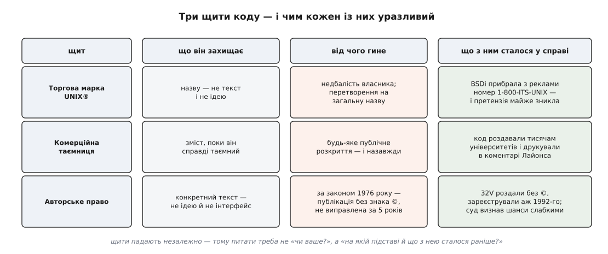
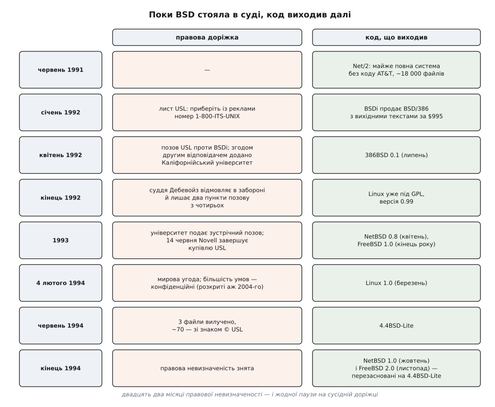

# ⚖️ Позов USL проти BSDi: як суд мало не вирішив, чиєю буде вільна Unix

З весни 1992-го до 4 лютого 1994 року доля вільної Unix залежала не від якості коду, а від того, чи має AT&T узагалі право на текст, який вона двадцять років роздавала університетам майже задарма. Розбір цієї справи вартий уваги, бо він показує рідкісно чисту причинність: відсутній значок `©` на стрічці 1978 року через п'ятнадцять років перекроїв технічний ландшафт сильніше, ніж будь-яке інженерне рішення тих років.

## Networking Release 2: скільки коштує вирізати чужий код

Берклійська Computer Systems Research Group опинилася в дивному становищі. Її система містила величезну кількість власного коду — мережевий стек, файлову систему, керування пам'яттю, десятки утиліт, — але кожен, хто хотів її отримати, мусив спершу купити джерельну ліцензію AT&T. Ліцензія коштувала десятки тисяч доларів і не давала права нічого нікому передавати. Виходило, що Берклі роздавав своє надбання лише тому вузькому колу, яке вже заплатило AT&T.

Вихід був арифметичний: якщо викинути з дистрибутива все, що походить від AT&T, і дописати замість викинутого своє — залишок можна віддавати вільно. Перша спроба, Networking Release 1 (1989), охоплювала тільки мережеву частину. Друга виявилася куди амбітнішою: у червні 1991-го вийшов **Networking Release 2** — майже повна система, з якої, за оцінкою університету, код AT&T було вичищено. «Майже» означало приблизно шість відсутніх файлів ядра; решта — близько вісімнадцяти тисяч файлів — вважалася берклійською.

Це «майже» й стало предметом справи. Улітку 1991-го дірку почав закривати Білл Джоліц: він дописав відсутні частини під процесор 386 і в липні 1992-го випустив 386BSD. Паралельно ту саму дірку закрила комерційна компанія.

## Телефонний номер за $995

BSDi (Berkeley Software Design, Inc.) — невелика фірма, заснована 1991 року людьми з берклійського кола, — узяла Net/2, дописала бракуюче й із січня 1992-го почала продавати систему BSD/386 з вихідними текстами за $995. Реклама била точно в больове місце ринку: майже те саме, що джерельна ліцензія System V, тільки, як обіцяв рекламний текст, приблизно на 99% дешевше.

І в тій рекламі стояв телефон замовлення: **1-800-ITS-UNIX**. На американській телефонній клавіатурі літери лягають на цифри (`I`→4, `T`→8, `S`→7, `U`→8, `N`→6, `X`→9), тож насправді це був звичайний номер 1-800-487-8649 — але око читало слово. Юристи UNIX System Laboratories, дочірньої компанії AT&T, яка на той час володіла Unix, надіслали листа: приберіть номер і перестаньте називати свій продукт словом Unix. BSDi рекламу змінила.

Позову це не відвернуло. Навесні 1992 року USL подала до федерального суду Нью-Джерсі позов, у якому претензій було чотири, і всі різного ґатунку: порушення умов ліцензії, порушення авторського права, розмивання торгової марки та привласнення комерційної таємниці.

## Три щити, які захищають код по-різному

Тут корисно спинитися, бо саме на цьому розрізненні тримається все подальше. Програму можна прикрити трьома різними правовими щитами, і кожен захищає інше й гине від іншого.

**Торгова марка** захищає *назву*, а не текст. Вона не забороняє написати систему, схожу на Unix; вона забороняє продавати чуже під цим словом. Убиває її або відмова власника стежити за вжитком, або те, що марка стала загальною назвою. Проти BSDi ця претензія працювала рівно доти, доки в рекламі стояв номер зі словом `UNIX`; щойно номер прибрали, вона майже зникла.

**Комерційна таємниця** захищає *зміст*, поки той зміст справді таємний. Її не реєструють — її оберігають. І вона гине миттєво й безповоротно від будь-якого публічного розкриття. Це найслабший щит для Unix, і слабкий саме через історію: код Unix двадцять років роздавали за ліцензіями тисячам університетів, друкували в підручниках, розбирали рядок за рядком у коментарі Джона Лайонса, який ходив по світу самвидавними фотокопіями. Твердити, що вміст `kern_exec.c` — таємниця, коли на ньому виросло два покоління програмістів, було важко.

**Авторське право** захищає *конкретний текст* — не ідею, не інтерфейс, не спосіб зробити щось, а саме послідовність рядків. Це найсильніший щит: він виникає сам, від факту створення, і його не вбиває публічність. Але на нього накладалися формальності — і саме на формальності справа й розсипалася.

> 🔧 **Навіщо це.** Коли компанія каже «цей код наш», відповідь залежить від того, який зі щитів вона піднімає. Таємницю знищує будь-яка попередня публікація. Марку рятує перейменування. Авторське право живе попри публікацію — але за часів, коли писався Unix, лише якщо власник дотримав формальностей. Тому питання «чи є в цьому коді ваше?» майже завжди хибне; правильне — «на якій саме підставі й що з нею сталося раніше?».



*Три щити діють одночасно, але падають незалежно — і в цій справі впали майже всі.*

## Знак ©, якого не поставили 1978 року

Перше слухання USL програла ще до розгляду по суті. BSDi заявила просту річ: ми роздаємо вільно доступні джерела Каліфорнійського університету плюс шість власних файлів; якщо у вас претензія — вона може стосуватися лише цих шести. Суддя погодився й запропонував USL або переформулювати позов навколо шести файлів, або втратити його. USL пішла іншим шляхом: переписала позов і додала другим відповідачем Каліфорнійський університет — тобто перенесла бій із дописаних BSDi файлів на весь Net/2.

Тоді й з'ясувалося, що фундамент хиткий. Ланцюжок, який Берклі й BSDi вибудували проти USL, виглядав так.

Права USL на BSD виводилися з прав на ранній Unix — зокрема на **32V**, версію для машин VAX, випущену 1978 року. За чинним тоді законом США (Copyright Act 1976) авторське право на *опубліковану* працю трималося на видимому знаку охорони: якщо копії розходилися публічно без нього, право слабшало й могло згаснути, якщо власник не виправить це протягом п'яти років — реєстрацією й розумними зусиллями проставити знак на розповсюджених копіях (17 U.S.C. §405(a)). А AT&T роздала тисячі стрічок 32V саме так: без знака охорони. Причина була не в недбальстві юристів, а в тому, що за мировою угодою 1956 року AT&T не мала права торгувати нічим поза телефонією — тож Unix десятиліттями був не товаром, а неформальним подарунком університетам, і формальностей ніхто не тримав. Зареєструвала AT&T авторське право на 32V аж 1992 року — тобто вже під позов, через чотирнадцять років.

USL відповідала доктриною **обмеженої публікації** (*limited publication*): мовляв, стрічки йшли не в широкий світ, а визначеному колу ліцензіатів на визначених умовах, а це юридично не публікація, і знак не був потрібен. Аргумент не безглуздий, але масштаб роздачі грав проти нього.

Наприкінці 1992 року суддя Дікінсон Дебевойз відмовив USL у попередній забороні й відкинув усе, крім двох пунктів позову. Його письмовий висновок надруковано як `Unix System Laboratories, Inc. v. Berkeley Software Design, Inc., 832 F. Supp. 790 (D.N.J. 1993)`; суть — USL навряд чи доведе свою правоту по суті: авторське право на 32V ймовірно втрачено через публікацію без знака охорони, а таємниця ймовірно втрачена через десятиліття ліцензування й публічних розборів. *(Дати рулінгу в джерелах різняться: Кірк Мак-К'юзік, безпосередній учасник подій, називає грудень 1992-го, а опублікований висновок датують березнем 1993-го — ідеться, найпевніше, про усне рішення й пізніший письмовий текст.)*

Це ще не був вирок. Попередня заборона — не рішення по суті, і в квітні 1993-го USL публічно просила суддю переглянути свій висновок, готуючись до апеляції та наполягаючи, що «обмежену публікацію» він зрозумів неправильно. Але сигнал ринок прочитав однозначно: щит, на якому трималися всі права AT&T на Unix, суд уважає ймовірно недійсним.

## Зустрічний позов: ліцензія BSD обертається проти AT&T

Далі сталося те, що надає справі гіркої симетрії. Каліфорнійський університет подав зустрічний позов — і підставою була його власна ліцензія.

Берклійська ліцензія тих років дозволяла майже все, але вимагала небагатого: зберігати повідомлення про авторство університету й згадувати його. AT&T же роками брала берклійський код — мережевий стек, утиліти, частини ядра — і вбудовувала його в System V. Університет заявив: ви користувалися нашим на наших умовах і умов не виконали. Вимоги були відповідні: перевидати документацію з належними згадками, повідомити всіх ліцензіатів System V і надрукувати спростування у великій пресі, зокрема в *The Wall Street Journal*.

Юридична вага цього кроку більша, ніж здається. USL прийшла до суду з тезою «ви взяли наш код і не дотримали умов». Університет відповів дзеркально тією самою тезою — і його версія спиралася на щит, у чинності якого суд не сумнівався. Це рідкісний, але показовий випадок: те, що пізніше стане звичним у світі відкритого коду — [ліцензія, яка дає свободу в обмін на виконання умов](root:sys-notary/open-source-licenses), — тут уперше спрацювало як зброя проти найбільшого власника коду в галузі.

## Норда, який волів воювати з Microsoft

Далі справу вирішила не юриспруденція, а зміна власника.

14 червня 1993 року Novell завершила купівлю USL в AT&T, обмінявши 11.1 мільйона своїх акцій. Голова Novell Рей Норда бачив головним ворогом Microsoft, а не Каліфорнійський університет; тягнути позов, у якому суддя вже засумнівався в самій основі прав, не мало для нього комерційного сенсу — це витрачало роки й репутацію на здобуток, вартий небагато.

**4 лютого 1994 року** сторони оголосили мирову угоду. Формулювання Норди в заяві було дипломатичним: угода дає університетові досягти своїх цілей, зберігаючи законний інтерес USL у захисті інтелектуальної власності. Публічно назвали лише кілька умов; решту оголосили конфіденційними — і вони лишалися під печаттю більш ніж десять років. Текст угоди між USL і Радою регентів університету розсекретили в листопаді 2004 року на запит за каліфорнійським законом про доступ до публічних документів; тоді ж його оприлюднив юридичний сайт Groklaw. Іронія тут повна: мирна угода, яка відкрила світові вільну BSD, сама була таємницею довше, ніж тривала війна.



*Дві доріжки йшли поруч: поки одна стояла в суді, друга виходила щокілька місяців.*

## Ціна двадцяти двох місяців: три файли з вісімнадцяти тисяч

Найкраще про справу говорить її результат у числах.

```
дистрибутив Net/2:      ~18 000 файлів
вилучити довелося:            3 файли
додати знак © USL:           ~70 файлів

частка вилученого:   3 / 18 000  ≈ 0.017 %
частка зачепленого: 73 / 18 000  ≈ 0.41 %
тривалість справи:  квітень 1992 → 4 лютого 1994 ≈ 22 місяці
```

Тобто за майже два роки судового протистояння з'ясувалося, що спірного в дистрибутиві — одна частка з шести тисяч. Ще близько сімдесяти файлів лишилися на місці й у вільній роздачі, просто з доданим повідомленням про авторство USL поряд із берклійським. Угода також дала користувачам спірних файлів тримісячний перехідний період і зобов'язала USL не позиватися до тих, хто поширюватиме очищений випуск.

Цей очищений випуск вийшов у червні 1994 року під назвою **4.4BSD-Lite**; доповнений 4.4BSD-Lite Release 2 з'явився 1995-го й став останнім, що зробила CSRG. Від них ведуть свій код FreeBSD й NetBSD, а через NetBSD — і OpenBSD, тобто вся сучасна лінія BSD. Обидва проєкти, які до того будувалися на Net/2, наприкінці 1994-го перезаснували себе на Lite: NetBSD 1.0 у жовтні, FreeBSD 2.0 у листопаді. Ця перебудова коштувала їм місяців роботи, викинутої не через технічну помилку.

## Чи справді позов подарував Linux його шанс

Це найпоширеніший висновок зі справи — і тут варто розділити те, що встановлено, і те, про що досі сперечаються.

**Встановлений факт — збіг у часі.** Позов висів над BSD рівно з квітня 1992-го до лютого 1994-го. У ці самі місяці Linux пройшов шлях від іграшки до системи: ядро вийшло під GPL ще на версії 0.12 (січень 1992), у 1993-му з'явилися перші повноцінні дистрибутиви, у березні 1994-го — Linux 1.0. Жодного правового питання над ним не висіло: код писався з нуля, у ньому не було рядків AT&T, і подавати позов не було до чого.

**Встановлений факт — стримувальний вплив.** Юридична невизначеність — це не порожній звук для того, хто вирішує, на чому будувати продукт. Компанія, яка обирала між системою під позовом і системою без позову, обирала другу навіть за гірших технічних якостей, бо ризик виміряти неможливо, а судові витрати вимірюються добре. Учасники BSD-проєктів того часу описують ці роки як провал керівництва й невизначеності.

**Предмет суперечок — причинна вага.** Твердження «якби не позов, світ сидів би на BSD» лишається **непідтвердженим**, і ось чому обережність тут доречна.

По-перше, у Linux були переваги, які з правом ніяк не пов'язані: модель розробки, відкрита для випадкового учасника з єдиним патчем, швидка підтримка дешевого споживчого заліза й короткий цикл випусків. BSD-проєкти тих років працювали інакше — довшими циклами й вужчим колом.

По-друге, BSD мала й власні, суто організаційні негаразди. 386BSD від Джоліца гальмував на інтеграції надісланих виправлень настільки, що спільнота розкололася на NetBSD і FreeBSD — і сталося це 1993 року, тобто не через суд, а через модель розробки.

По-третє — і це найцікавіше — аргумент, яким найчастіше доводять «BSD програла через суд», насправді доводить інше. Лінуса Торвальдса в листопаді 1993-го запитали про 386BSD, і він відповів, що якби 386BSD була доступна, коли він починав, Linux, найпевніше, ніколи б не з'явився. Цитату наводять як доказ про позов — але Лінус говорить про середину 1991-го, коли 386BSD ще не існувало, а позову не було й у планах. Отже, вона свідчить про **пізній вихід** вільної BSD, а не про суд. Причина, на яку вказує сам Торвальдс, старша за справу USL на рік.

Чесне формулювання виходить таким: позов не створив переваг Linux, але забрав у BSD ті двадцять два місяці, коли ці переваги ще можна було перекрити. Наскільки вирішальними були саме ці місяці — питання, на яке немає способу відповісти строго, бо контрольного світу без позову ми не маємо.

Що справа показує напевно — це інше й важливіше. Технічна історія обчислень зазвичай пишеться як історія ідей: сторінкова пам'ять, сокети, потоки. Але два з трьох найбільших родоводів вільних систем розійшлися остаточно не через ідею, а через те, що 1978 року на магнітну стрічку не наклеїли рядок із знаком `©`.
