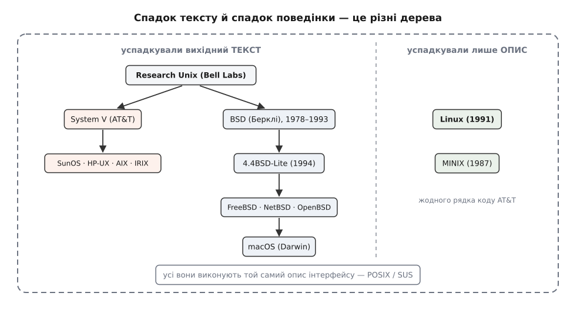

# Родовід Unix: AT&T, BSD і поява Linux

<preknowlist>
- [Ядро й простір користувача](root:sys-unix/kernel-and-userspace) — ядро як окрема привілейована частина системи і чим воно відрізняється від звичайних програм.
- [Системний виклик](root:hw-arch/system-call) — як програма просить ядро зробити щось за неї; набір цих викликів і є обличчям системи.
- [Пермісивні й копілефтні ліцензії](root:sys-notary/permissive-vs-copyleft) — різниця між «роби що хочеш» і «похідне лишається на тих самих умовах».
</preknowlist>

## Дивна сім'я

macOS має офіційний сертифікат UNIX®. Linux його не має й ніколи не мав, FreeBSD теж. Але програма, написана під Linux, майже завжди збирається і працює на FreeBSD та macOS. При цьому в Linux і FreeBSD немає спільного коду: це два незалежні тексти, які писали різні люди. І все ж `open()` в обох повертає ціле число, `fork()` в обох роздвоює процес, а `/dev/null` в обох поглинає все, що туди напишуть.

Отже, у спадок передається щось, що не є кодом. Історія Unix — це історія того, як розійшлися дві спадщини: **сам текст програми** і **опис того, як система має поводитися**. А розводив їх щоразу не технічний поворот, а правовий: кому й на яких умовах дозволялося передавати цей текст далі.

## Система стає текстом

Unix почався 1969 року в Bell Labs. Компанія щойно вийшла з великого спільного проєкту Multics, і Кен Томпсон лишився без машини, на якій було цікаво працювати. Він знайшов у кутку майже покинутий PDP-7 і за кілька тижнів написав під нього файлову систему, планувальник і оболонку. Вийшла не «бідна» версія Multics, а інша ставка: замість однієї системи, що вміє все, — маленьке ядро й набір дрібних програм, які складаються між собою. Згодом це назвуть [філософією Unix](root:sys-unix/unix-philosophy).

Писали цю систему асемблером — мовою команд конкретного процесора. Звідси випливає неприємне: вона існувала тільки на тій машині й мала померти разом із нею, бо на іншому процесорі від асемблерної програми не лишається нічого.

Тому 1973 року Томпсон і Денніс Рітчі зробили те, що тоді виглядало марнотратством: **переписали ядро Unix мовою C**, яку Рітчі саме для цього й доростив із простішої мови B. Ядро мовою високого рівня працює повільніше за старанно виписаний асемблер і займає більше пам'яті — на машині з 64 кілобайтами це відчутна втрата.

Виграш був не в швидкості, а в тому, що змінилося саме поняття «система». Доти системою був набір машинних команд у пам'яті конкретної моделі комп'ютера. Після переписування **системою став вихідний текст**, а те, що виконується на залізі, — лише один із його перекладів. Щоб отримати Unix на новому процесорі, досить було зробити компілятор C під цей процесор і замінити невелику частину, яка справді залежить від заліза. Це перша ланка спадку: далі все передавалося як текст, який можна прочитати, змінити, перенести — і, що виявиться не менш важливим, скопіювати й віддати комусь ще.

> 🔧 **Навіщо це.** З рішення 1973 року росте звичка постачати програму вихідним текстом, а не двійковим файлом під кожну машину, — звідси й обряд `./configure && make`. Звідти ж крос-компіляція: текст можна зібрати під плату, на якій сам компілятор не помістився б.

## Чому цей текст роздали

Переносність сама собою нічого не розсіює: компанія може мати ідеально переносну систему й не показувати її нікому. Unix розійшовся через обмеження, накладене на AT&T задовго до нього.

1956 року AT&T підписала з міністерством юстиції США мирову угоду в антимонопольній справі: компанія лишалася регульованою монополією на телефонний зв'язок, але втрачала право вести будь-який бізнес поза послугами зв'язку. Комп'ютери під це підпадали: **продавати Unix як продукт AT&T не могла**.

Неможливість торгувати обернулася політикою роздачі. Bell Labs почала ліцензувати Unix університетам за символічні гроші — фактично за вартість стрічки й пересилки — і разом із вихідним кодом, бо без коду система на чужій машині все одно не запрацювала б. Це не була ідеологія відкритості, це був єдиний спосіб віддати те, чого не можна продати. Наслідок вийшов несподівано великий: виросло покоління, яке вивчило працюючу операційну систему зсередини, за її ж кодом, і розійшлося з цим знанням по компаніях і кафедрах.

## Берклі: гілка всередині чужої ліцензії

У Каліфорнійському університеті в Берклі за привезену Томпсоном шосту редакцію взялися студенти, насамперед Білл Джой. Перший випуск 1BSD (1978) був не системою, а стрічкою з доповненнями до чужої — що видно з самої назви Berkeley Software Distribution. Потім Берклі дійшов і до ядра: 4.2BSD (1983) приніс реалізацію TCP/IP і [сокети](root:sys-unix/socket-api-linux) — модель, яку згодом успадкували всі.

Зверніть увагу на правову конструкцію. BSD був гілкою всередині чужої ліцензії: код Берклі належав університету, код під ним — AT&T, і користувач мусив мати обидві. Поки Unix коштував символічні гроші, це нікому не заважало.

## 1984: текст стає товаром

1 січня 1984 року Bell System розпалася: AT&T віддала регіональні телефонні компанії в обмін на право входити в інші галузі. Угода 1956 року перестала діяти, і AT&T зробила з Unix продукт — System V — за ринкові гроші там, де раніше платили за стрічку. Одночасно виробники комп'ютерів зрозуміли, що переносна система дозволяє продавати залізо, не пишучи власної ОС із нуля: Sun зробила SunOS, IBM — AIX, DEC — Ultrix, SGI — IRIX. Усі на спільному предку, усі закриті, усі трохи різні.

Розходилися вони й технічно. Берклі та AT&T роками правили той самий код у різні боки, не звіряючись між собою, і до середини вісімдесятих різниця стала предметною — інша поведінка сигналів, інші файлові системи, інші ключі тих самих команд. Тут родовід ударив сам по собі: програма під SunOS уже не збиралася під AIX. **Переносність, заради якої все затівалося, зникала саме тому, що система розмножилася.**

Звідси рішення, яке визначило все подальше. Якщо неможливо мати один код — треба записати не код, а поведінку: які виклики існують, що беруть, що повертають, як поводяться в крайніх випадках. Тоді сумісними будуть не тексти, а системи, що виконують один опис. 1988 року вийшов стандарт IEEE 1003.1; назву POSIX запропонував Річард Столмен. [Що саме туди потрапило, а що свідомо лишили поза ним](root:sys-unix/posix-standard) — окрема тема. З цієї миті родовід має дві незалежні лінії: лінію тексту й лінію поведінки.

## Порожнє місце 1990 року

Річард Столмен ще 1983 року оголосив проєкт GNU — вільну систему, сумісну з Unix за інтерфейсом, але без жодного рядка чужого коду. До 1990-го проєкт мав компілятор, оболонку й базові утиліти, тобто майже весь [інструментарій простору користувача](root:sys-unix/gnu-userland), і все це під GPL — ліцензією, яка дозволяє все, крім одного: закрити похідне. Не було ядра: власне ядро GNU проєктували складніше, і робота йшла повільно.

І з'явилося залізо. Процесор Intel 80386 приніс на звичайний персональний комп'ютер 32-бітовий захищений режим і сторінковий блок керування пам'яттю — усе, щоб надійно розділити ядро й процеси. Машина стояла в студентів на столі, а система для неї коштувала як сам комп'ютер. Отже: стандарт є, інструментарій є, залізо є. Немає вільного ядра.

## Гельсінкі, 1991

Лінус Торвальдс, студент Гельсінського університету, купив 386-й і почав писати під нього дрібні програми, кожна з яких тягла за собою наступну. 25 серпня 1991 року він написав у групу `comp.os.minix`, що робить вільну операційну систему, «просто хобі», і питав, які можливості люди хотіли б бачити. У вересні вийшла версія 0.01.

Спершу ядро виходило під власною ліцензією Торвальдса, яка забороняла брати за нього гроші. У січні 1992-го, з версією 0.12, ліцензією стала GNU GPL. Технічно в коді не змінилося нічого, зате змінилося, чи безпечно вкладати в цей код чужу працю: GPL гарантує кожному, хто надіслав виправлення, що спільний результат ніхто не забере й не закриє.

І тут головна особливість Linux у цьому родоводі. **Linux не успадкував від Unix жодного рядка тексту.** Це нова реалізація, написана з нуля під інтерфейс, який на той момент уже було описано окремо. Родовід коду проходить повз Linux; родовід поведінки веде прямо до нього.

*Суцільні лінії — успадкування вихідного тексту, пунктир — відповідність описаному інтерфейсу. Linux і MINIX висять поза деревом коду, але всередині кола сумісності; macOS потрапляє в обидва.*

## Гілка, що спіткнулася

Берклі йшов до вільної системи раніше: чужий код роками витісняли з BSD, і 1991 року вийшов випуск, у якому, за оцінкою університету, коду AT&T уже не було. Але 1992 року тодішній власник Unix подав позов проти фірми BSDi, а потім і проти університету, і справу владнали аж на початку 1994-го — з приблизно 18 000 файлів вилучити довелося три. Майже безпідставний позов тримав вільний BSD у правовій невизначеності рівно тоді, коли Linux ріс без жодних юридичних питань; чи вирішив цей збіг долю обох гілок — **непідтверджено**.

## Третій спадок: право на назву

Торгова марка UNIX від AT&T перейшла до консорціуму The Open Group, і там її остаточно відірвали від коду. Нині «UNIX» — це **сертифікація**, а не кодова база: система має право так називатися, якщо пройшла перевірку на відповідність Single UNIX Specification і власник заплатив за випробування.

Звідси й парадокс із початку. macOS сертифікована — Apple пройшла перевірку й заплатила. Linux не сертифікований, бо немає «власника продукту», який подав би його на випробування. На фактичну сумісність це не впливає.

Родовід видно навіть у ключах команди `ps`: `ps aux` — по-берклійськи, `ps -ef` — по-систем-п'ятому.

І головне. Не пережили десятиліть саме реалізації: System V, SunOS, Ultrix, IRIX — кожна свого часу була великим комерційним продуктом; не пережила й компанія, що все почала. Пережили дві речі: **опис поведінки, записаний окремо від коду**, і **правовий режим, за якого код можна передавати далі**. Перше дало Linux можливість з'явитися, друге — можливість вирости.
