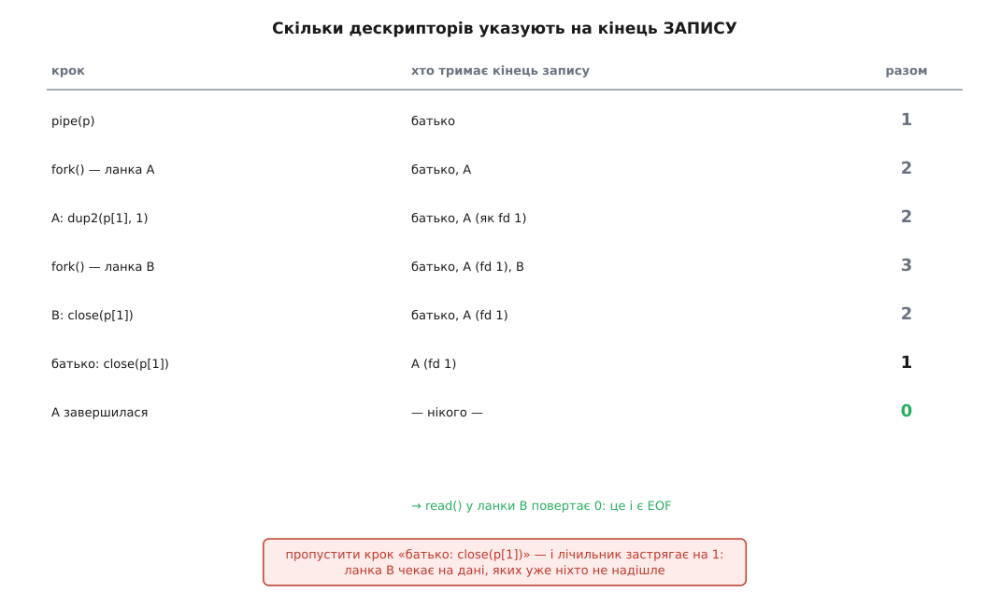
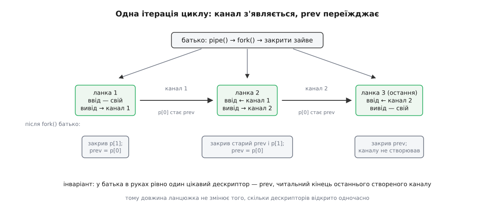

# ⚙️ Конвеєр своїми руками: `A | B` без оболонки

Вертикальна риска в `tr … | sort` — це п'ять системних викликів (`pipe`, `fork`, `dup2`, `close`, `execvp`) і одне правило про закривання дескрипторів, яке легко порушити, а потім півдня шукати, чому програма мовчки висить. Зберемо той самий конвеєр на C, без оболонки: кожна деталь, яку риска ховає, стане видимою — зокрема та, через яку читач ніколи не дочекається кінця даних.

## Задача

Дві програми. Перша, `pipe2`, робить рівно те, що рядок `tr -cs A-Za-z '\n' | sort`, але сама створює канал і запускає обидві ланки. Друга, `pipeN`, — той самий механізм, розгорнутий у цикл на ланцюжок довільної довжини, зі списками аргументів через двокрапку:

```sh
./pipeN tr -cs A-Za-z '\n' : tr A-Z a-z : sort : uniq -c : sort -rn : sed 10q
```

До механіки додаються дві вимоги, які й роблять задачу вартою уваги. Обидві програми мусять правильно збирати код виходу — і той, що оболонка віддає за замовчуванням, і той, що вона віддає з `set -o pipefail`. І обидві мусять самі згортатися, коли остання ланка вийшла раніше за першу: `./pipeN yes : head -1` має надрукувати один рядок і зупинитися, а не крутити `yes` довіку.

## Задум: канал — це пара дескрипторів, а fork їх розмножує

Виклик `pipe(p)` створює в ядрі буфер і повертає **два** [файлові дескриптори](root:sys-unix/file-descriptor) — маленькі числа, за якими ядро тримає справжні об'єкти: `p[0]`, з якого читають, і `p[1]`, у який пишуть. Байти, записані в `p[1]`, виходять із `p[0]` у тому самому порядку. Більше канал не вміє нічого: ні позиціонування, ні зворотного напрямку, ні імені у файловій системі.

Далі потрібні дві речі, яких у самого каналу немає.

По-перше, обидві програми мають отримати свої кінці, не знаючи про це. `sort` читає з дескриптора 0, бо так написано в його коді, і ніяк інакше читати не вміє. Отже, кінець каналу треба **покласти під номер 0** ще до того, як почне виконуватися `sort`. Це робить `dup2(from, to)`: він закриває дескриптор `to`, якщо той був відкритий, і робить `to` другим іменем того самого об'єкта, на який дивиться `from`. Після `dup2(p[0], 0)` нульовий дескриптор — це читальний кінець каналу.

По-друге, підміну треба зробити в **чужому** процесі. Тому [створюємо копію процесу](root:sys-unix/fork-semantics) через `fork()`, у копії міняємо дескриптори — і аж тоді [замінюємо образ](root:sys-unix/exec-semantics) через `execvp`. Порядок тут не декоративний: `exec` замінює код і пам'ять, але **таблицю дескрипторів лишає** такою, якою вона була. Саме ця асиметрія — нова програма зі старими дескрипторами — і є весь фокус конвеєра.

Тепер найважливіше, з чого потім виростуть усі помилки. `fork()` копіює таблицю дескрипторів. Після нього кінець каналу тримають **двоє**. Після другого `fork()` — троє. А ядро дивиться не на процеси, а на кількість дескрипторів, які на цей кінець посилаються, і два його правила звучать буквально так:

```
читач бачить EOF  ⟺  закрито ВСІ дескриптори, що вказують на кінець ЗАПИСУ
той, хто пише, ловить SIGPIPE  ⟺  закрито ВСІ дескриптори, що вказують на кінець ЧИТАННЯ
```

Слово «всі» тут — не формальність, а вся суть роботи. Один-єдиний забутий дескриптор у батьківському процесі тримає лічильник на одиниці, а лічильник на одиниці означає, що для ядра кінець запису ще живий і дані ще можуть надійти. `sort` чекатиме на дані, яких ніхто вже не надішле, — і ніхто в системі не вважатиме це помилкою.

## Дві ланки: увесь механізм на одному екрані

```c
/* pipe2.c — «tr -cs A-Za-z '\n' | sort» вручну, без оболонки.
   збірка: cc -std=c11 -Wall -Wextra -o pipe2 pipe2.c            */
#define _POSIX_C_SOURCE 200809L
#include <errno.h>
#include <signal.h>
#include <stdio.h>
#include <stdlib.h>
#include <unistd.h>
#include <sys/wait.h>

/* "\\n" — це ДВА символи, зворотна скісна й n: саме їх дає оболонка,
   коли пишуть '\n', а розкриває їх сам tr.                        */
static char *A[] = { "tr", "-cs", "A-Za-z", "\\n", NULL };
static char *B[] = { "sort", NULL };

static void die(const char *what) { perror(what); _exit(1); }

/* Код виходу так, як його рахує оболонка: 128 + номер сигналу,
   коли процес не вийшов сам, а був убитий.                        */
static int code_of(int st)
{
    if (WIFEXITED(st))   return WEXITSTATUS(st);
    if (WIFSIGNALED(st)) return 128 + WTERMSIG(st);
    return 1;
}

int main(void)
{
    int p[2];                              /* p[0] — читати, p[1] — писати */
    if (pipe(p) < 0) die("pipe");

    pid_t a = fork();
    if (a < 0) die("fork");
    if (a == 0) {                          /* ліва ланка: вивід — у канал */
        if (dup2(p[1], STDOUT_FILENO) < 0) die("dup2");
        close(p[0]);                       /* читальний кінець їй не потрібен */
        close(p[1]);                       /* оригінал теж: копія вже під №1  */
        signal(SIGPIPE, SIG_DFL);          /* не успадкувати чуже ігнорування */
        execvp(A[0], A);
        perror(A[0]);
        _exit(127);                        /* угода оболонок: 127 — не знайдено */
    }

    pid_t b = fork();
    if (b < 0) die("fork");
    if (b == 0) {                          /* права ланка: ввід — із каналу */
        if (dup2(p[0], STDIN_FILENO) < 0) die("dup2");
        close(p[0]);
        close(p[1]);
        signal(SIGPIPE, SIG_DFL);
        execvp(B[0], B);
        perror(B[0]);
        _exit(127);
    }

    close(p[0]);                           /* батько не бере участі в передачі */
    close(p[1]);                           /* ← найважливіші два рядки файлу   */

    int sa = 0, sb = 0;
    while (waitpid(a, &sa, 0) < 0) if (errno != EINTR) die("waitpid");
    while (waitpid(b, &sb, 0) < 0) if (errno != EINTR) die("waitpid");

    int ca = code_of(sa), cb = code_of(sb);
    fprintf(stderr, "ланки: %d %d | без pipefail: %d | з pipefail: %d\n",
            ca, cb, cb, cb ? cb : ca);
    return cb ? cb : ca;
}
```

Кілька рядків тут неочевидні, і кожен неочевидний через щось конкретне.

**`_exit`, а не `exit`, у дитині.** Дитина успадкувала не лише дескриптори, а й **буфери** бібліотеки C з усім, що батько встиг у них накопичити. `exit()` ці буфери дописує — тож кожна дитина видала б копію батькового недописаного виводу. `_exit()` завершує процес одразу, не чіпаючи буферів. Правило просте: після `fork()` до `exec()` дитина живе в чужому домі й нічого в ньому не прибирає.

**`_exit(127)` після `execvp`.** Якщо `execvp` повернувся, значить, він не спрацював — образ не замінено, і далі виконується той самий код. Число 127 не випадкове: оболонки віддають саме його, коли команду не знайдено, і 126 — коли файл знайдено, але він не виконуваний. Отже, зовнішній скрипт відрізнить «немає такої програми» від «програма впала».

**`dup2` перед `close`, і закривати обидва кінці.** Порядок обов'язковий: спершу зробити копію під потрібним номером, потім прибрати оригінал. Дитина закриває **обидва** кінці оригінального каналу, бо після `dup2` потрібний кінець уже живе під номером 0 або 1, а непотрібний узагалі не її справа.

**`signal(SIGPIPE, SIG_DFL)`.** Диспозиція сигналу переживає `exec` в одному-єдиному випадку — коли сигнал **ігнорують**: обробники скидаються на типову дію, а `SIG_IGN` лишається. Тому програма, яка сама ігнорує `SIGPIPE` (а так робить майже кожен мережевий застосунок), передасть це ігнорування всім ланкам свого конвеєра, і жодна з них уже не помре від закритого читача. Справжні оболонки скидають диспозиції явно; скидаємо і ми.

Тут же — місце для чесного попередження. Пара `dup2(p[1], 1); close(p[1]);` правильна доти, доки `p[1]` не дорівнює одиниці. Коли це станеться і чому воно псує все, розберемо разом із рештою пасток.

## Реєстр кінців: чому закриття не можна пропустити

Найкраще правило «закрито всі» видно, якщо просто вести облік — скільки дескрипторів у системі зараз указують на кінець запису.



*Поки лічильник не впаде до нуля, читач не побачить кінця даних — і жодна з програм не вважатиме це помилкою.*

Зверніть увагу на четвертий рядок реєстру. Після другого `fork()` кінець запису тримають троє, і двоє з них — не ті, кому він потрібен. Дитина `B` закриває свою копію сама. А от копію батька закрити нікому, крім батька, і саме тому два рядки `close(p[0]); close(p[1]);` у `main` — не прибирання, а частина механізму.

Приберіть із коду `close(p[1])` у батька й запустіть — програма зависне назавжди. `tr` дочитає вхід, закриє свій вивід і завершиться; `sort` прочитає все, що надійшло, — і чекатиме далі, бо лічильник кінця запису дорівнює одиниці: батьків дескриптор досі відкритий. Віддати перший рядок `sort` не має права, доки не знає, що більших уже не буде, а знання це дає тільки EOF. Процес нікуди не подінеться, у навантаженні його не видно, у журналі порожньо.

Приберіть натомість `close(p[0])` — і зламається протилежне. Поставте на місце `tr` щось нескінченне, як `yes`, а на місце `sort` — `head -1`: `head` надрукує рядок і вийде, але `yes` не отримає `SIGPIPE`, бо читальний кінець досі тримає батько. `yes` заповнить буфер каналу й застрягне у виклику `write`, який ніколи не поверне керування. Одна забута лінія — і машина тихо крутить процес, що пише в порожнечу.

> 🔧 **Навіщо це.** Той самий облік працює скрізь, де дескриптор перетинає межу процесу. Служба, яка тримає в собі підпроцес і не закрила свій кінець його каналу, ніколи не дочекається його завершення; демон, що не закрив успадкований дескриптор перед `exec`, лишає його відкритим у програмі, яка про нього не знає, — а разом із ним і сокет, порт чи файл, який мав би вже зникнути. Питання завжди одне: **скільки дескрипторів у системі зараз указують на цей кінець і хто закриє останній**.

## Коди виходу: як відтворити pipefail

Конвеєр — це кілька процесів, а результат назовні один. Оболонка мусить якось звести кілька кодів до одного, і вона це робить за двома різними правилами.

Типове правило: код конвеєра — це код **останньої** ланки. Тому `grep шаблон файл | head -3` віддає нуль навіть тоді, коли `grep` нічого не знайшов або не зміг відкрити файл: `head` спрацював, а більше нікого не питали. Правило з `set -o pipefail`: код конвеєра — це код **останньої за порядком ланки, що завершилася ненульовим кодом**, або нуль, якщо всі вийшли успішно. Формулювання посібника bash саме таке — «остання (найправіша) ланка з ненульовим кодом», і це важлива дрібниця: рахують за **місцем у ланцюжку**, а не за тим, хто помер останнім у часі.

Обидва правила — це кілька рядків над зібраними статусами:

```c
int pipefail = 0, last = 0;
for (int i = 0; i < n; i++) {
    int st;
    while (waitpid(pids[i], &st, 0) < 0)
        if (errno != EINTR) die("waitpid");
    int c = code_of(st);          /* 128 + сигнал, якщо ланку вбили */
    if (c) pipefail = c;          /* остання ненульова за ПОРЯДКОМ у ланцюжку */
    if (i == n - 1) last = c;     /* типова поведінка оболонки */
}
```

Цикл іде за порядком ланок, а не за порядком завершень, тому `pipefail` виходить сам собою: кожен наступний ненульовий код перезаписує попередній, і в змінній лишається код найправішої невдалої ланки. У bash увесь набір доступний масивом `PIPESTATUS`: `${PIPESTATUS[0]}` — код першої ланки, `${PIPESTATUS[1]}` — другої, і так далі. Наш цикл друкує рівно те саме.

Перетворення «сигнал → число» в `code_of` теж не наша вигадка: коли команда гине від сигналу з номером N, оболонка віддає `128 + N`. Оскільки `SIGPIPE` має номер 13, ланка, убита закритим читачем, дає **141** — число, яке варто впізнавати з першого погляду.

Тут ховається наслідок, на якому спотикаються скрипти. Рядок `set -euo pipefail` — типовий рецепт «строгого режиму» — разом із `... | head -1` дає падіння скрипта на рівному місці: перша ланка законно вмирає від `SIGPIPE`, `pipefail` бачить 141, `set -e` завершує все. Помилки немає, поведінка правильна, скрипт мертвий.

## SIGPIPE: чому ланцюжок згортається сам

Запустимо саме той випадок:

```sh
$ ./pipeN yes : head -1
y
  ланка 1 (yes): 141
  ланка 2 (head): 0
код конвеєра: 0 (без pipefail) / 141 (з pipefail)
```

`yes` друкує «y» нескінченно. `head -1` бере перший рядок, друкує його й виходить. Коли він вийшов, ядро закрило його дескриптори, лічильник читального кінця впав до нуля — і наступний `write` у `yes` спричинив `SIGPIPE`, [типова дія](root:sys-unix/signal-disposition) якого — завершити процес. Нескінченна програма зупинилася, і нікому не довелося її зупиняти.

Чому вбивство, а не звичайна помилка? Уявіть протилежне: `write` просто повертає −1 з `EPIPE`. Тоді кожен фільтр у світі мусив би перевіряти результат кожного запису й самотужки вирішувати, що це кінець роботи. Фільтри, написані без такої перевірки, — а це майже всі — крутилися б у порожнечу, поки хтось не помітить. Типова дія «померти» переносить цю відповідальність із кожного автора на ядро, і в обмін кожен, кому смерть не годиться, каже це явно: ігнорує `SIGPIPE` і сам розбирає `EPIPE`. Так роблять сервери, для яких зникнення одного клієнта не привід гинути.

Це та сама угода, що й у решті Unix: типова поведінка обслуговує звичайний випадок безкоштовно, а незвичайний вимагає одного явного рядка.

## N ланок в одному циклі

Двоє — окремий випадок. Механізм узагальнюється, щойно помітити, що на кожному кроці циклу батько має в руках рівно **один** цікавий дескриптор: читальний кінець каналу, з якого має читати **наступна** ланка. Назвемо його `prev`.



*Незалежно від довжини ланцюжка, у батька одночасно відкрито не більше трьох дескрипторів.*

```c
/* pipeN.c — «A : B : C : …» вручну.
   збірка: cc -std=c11 -Wall -Wextra -o pipeN pipeN.c
   запуск: ./pipeN tr -cs A-Za-z '\n' : tr A-Z a-z : sort : uniq -c : sort -rn : sed 10q */
#define _POSIX_C_SOURCE 200809L
#include <errno.h>
#include <fcntl.h>
#include <signal.h>
#include <stdio.h>
#include <stdlib.h>
#include <string.h>
#include <unistd.h>
#include <sys/wait.h>

#define MAXN 64

static void die(const char *what) { perror(what); _exit(1); }

static int code_of(int st)
{
    if (WIFEXITED(st))   return WEXITSTATUS(st);
    if (WIFSIGNALED(st)) return 128 + WTERMSIG(st);
    return 1;
}

/* Покласти дескриптор from під номер to. Окремий випадок from == to
   безпечним НЕ є: dup2 у ньому нічого не робить і, зокрема, НЕ знімає
   позначку «закрити при exec» — тож знімаємо її самі.               */
static void move_fd(int from, int to)
{
    if (from == to) {
        int fl = fcntl(from, F_GETFD);
        if (fl < 0 || fcntl(from, F_SETFD, fl & ~FD_CLOEXEC) < 0) die("fcntl");
        return;
    }
    if (dup2(from, to) < 0) die("dup2");
    close(from);
}

int main(int argc, char **argv)
{
    char **cmd[MAXN];
    pid_t pids[MAXN];
    int n = 0;

    if (argc < 2) { fprintf(stderr, "як: %s КОМАНДА [АРГ…] [: КОМАНДА …]\n", argv[0]); return 2; }

    /* Ріжемо argv по ":" просто на місці: argv[argc] уже NULL за стандартом C,
       тож кожен відрізок стає готовим NULL-завершеним списком аргументів. */
    cmd[n++] = &argv[1];
    for (int i = 1; i < argc; i++)
        if (strcmp(argv[i], ":") == 0) {
            argv[i] = NULL;
            if (i + 1 < argc) {
                if (n == MAXN) { fprintf(stderr, "забагато ланок\n"); return 2; }
                cmd[n++] = &argv[i + 1];
            }
        }
    for (int i = 0; i < n; i++)
        if (cmd[i][0] == NULL) { fprintf(stderr, "порожня ланка %d\n", i + 1); return 2; }

    int prev = -1;                       /* звідки читає поточна ланка */
    for (int i = 0; i < n; i++) {
        int p[2] = { -1, -1 };
        int last = (i == n - 1);
        if (!last && pipe(p) < 0) die("pipe");

        pid_t pid = fork();
        if (pid < 0) die("fork");
        if (pid == 0) {
            if (prev != -1) move_fd(prev, STDIN_FILENO);   /* перша ланка лишає свій stdin */
            if (!last) {
                close(p[0]);                               /* читальний кінець — не наш */
                move_fd(p[1], STDOUT_FILENO);
            }
            signal(SIGPIPE, SIG_DFL);
            execvp(cmd[i][0], cmd[i]);
            perror(cmd[i][0]);
            _exit(127);
        }

        pids[i] = pid;
        if (prev != -1) close(prev);      /* дитина його вже успадкувала */
        if (!last) { close(p[1]); prev = p[0]; }
    }

    int pipefail = 0, lastcode = 0;
    for (int i = 0; i < n; i++) {
        int st;
        while (waitpid(pids[i], &st, 0) < 0)
            if (errno != EINTR) die("waitpid");
        int c = code_of(st);
        if (c) pipefail = c;
        if (i == n - 1) lastcode = c;
        fprintf(stderr, "  ланка %d (%s): %d\n", i + 1, cmd[i][0], c);
    }
    fprintf(stderr, "код конвеєра: %d (без pipefail) / %d (з pipefail)\n", lastcode, pipefail);
    return pipefail;
}
```

Цикл варто прочитати очима лічильника з реєстру. На кожній ітерації кінець запису `p[1]` тримають двоє — батько й щойно народжена дитина; дитина кладе його під номер 1, батько закриває свою копію негайно, і лишається один тримач, той самий, кому він потрібен. Кінець читання `p[0]` батько **не** закриває — він стає `prev` і доживе до наступної ітерації, де його успадкує наступна дитина, а батько закриє після її народження. Так дескриптор передається з рук у руки й ніде не накопичується.

Остання ланка каналу не створює — вона пише туди ж, куди писав би сам `pipeN`, тобто в успадкований стандартний вивід. Перша ланка нічого не міняє на вході: `prev` іще дорівнює −1, тож `./pipeN sort < файл` працює саме так, як очікуєш.

## Скільки це коштує і де ще ями

```
ланцюжок із n ланок:
    каналів                          n − 1
    процесів                         n
    системних викликів у батька      ≈ 4n   (pipe, fork, два close на ітерацію)
    відкритих дескрипторів у батька  ≤ 3    (не залежить від n)
    пам'яті в ядрі                   (n − 1) × 64 КіБ
```

Останній рядок — головна цифра всієї моделі: розмір буфера каналу в Linux типово 64 КіБ (16 сторінок по 4 КіБ, налаштовується через `fcntl(F_SETPIPE_SZ)` у межах `/proc/sys/fs/pipe-max-size`, типово 1 МіБ), і він **не залежить від обсягу даних**. Межа тут за версією ядра: до 2.6.11 канал тримав одну сторінку, тобто 4 КіБ, з 2.6.11 місткість стала 64 КіБ, а міняти її дозволили ще пізніше — `F_SETPIPE_SZ` з'явився у 2.6.35. Крізь шестиланковий ланцюжок — п'ять каналів — можна прогнати терабайт, витративши 320 КіБ пам'яті.

Тепер про ями, які ця програма або обходить, або показує.

**`p[1]` може дорівнювати одиниці.** Ядро видає два найменші вільні номери, і менший із них дістається читальному кінцю. Тож щоб кінцем **запису** став номер 1, вільними мусять бути обидва — нульовий і перший: `./pipeN … 0<&- 1>&-`, а так буває не лише в експерименті, а й у демонів та раннерів, які позакривали успадковані потоки. Тоді `pipe()` поверне `p[0] = 0`, `p[1] = 1`. Наївна пара `dup2(p[1], 1); close(p[1]);` тоді перетворюється на «нічого не зробити, а потім закрити те, що мало лишитися»: за стандартом `dup2` із однаковими аргументами повертає дескриптор, **не закриваючи його** й нічого не копіюючи. Далі `exec`, і програма стартує без стандартного виводу. Функція `move_fd` цей випадок називає окремо — і заразом знімає позначку «закрити при `exec`», якої `dup2` у цьому випадку не зніме, бо не виконується взагалі.

Дзеркальний випадок трапляється частіше: закрито лише стандартний вивід, і тоді номер 1 дістається **читальному** кінцю. Порядок дій у дитині стає обов'язковим: спершу закрити чужий кінець, потім `dup2`. Саме так написано в циклі `pipeN` (`close(p[0])` стоїть перед `move_fd`), а от у навчальному `pipe2.c` порядок зворотний — і під `1>&-` він закриє щойно встановлений стандартний вивід замість зайвого дескриптора. Для розбору механізму це не заважає; для програми, яку запускають у невідомому оточенні, порядок вирішує.

**Звідси ж — акуратніший спосіб.** Якщо створювати канал як `pipe2(p, O_CLOEXEC)`, обидва кінці зникнуть самі під час `exec`, і закривати їх у дитині вручну не треба: `dup2` знімає цю позначку з **нового** дескриптора, тож переміщений кінець виживе, а решта — ні. Батькові це не допомагає нічим: його копії закриває тільки він.

**`waitpid` може перерватися.** Якщо в процесі є обробник сигналу, виклик поверне −1 з `EINTR` замість результату — і код, написаний без циклу, вирішить, що дитина зникла. Це загальна властивість блокувальних викликів, а не особливість очікування ([перервані виклики й перезапуск](root:sys-unix/eintr-and-restart)).

**Чекати можна по порядку — але лише тому, що батько порожній.** Ми чекаємо на першу ланку, хоч вона цілком може завершитися останньою. Це безпечно винятково через те, що батько не тримає жодного кінця каналу: усі ланки рано чи пізно доходять кінця, кожна своїм шляхом. Якби батько лишив собі хоч один дескриптор, `waitpid` на першій ланці міг би не повернутися ніколи. Зібрати статуси все одно обов'язково — інакше завершені діти лишаться [зомбі](root:sys-unix/exit-wait-zombies).

**Запис у канал атомарний лише до 4 КіБ.** POSIX гарантує, що запис не довший за `PIPE_BUF` (у Linux — 4096 байтів) ляже в канал суцільним шматком. Довший може перемежуватися із записами інших процесів. Коли пише один процес, це байдуже, а для кількох, що пишуть в один канал (класична схема «багато робітників — один журнал»), це межа, за якою рядки почнуть рватися навпіл.

**Бібліотека C міняє поведінку залежно від того, куди дивиться вивід.** Коли стандартний вивід — термінал, буфер скидається на кожному рядку; коли канал — повними блоками. Тому програма, вставлена в конвеєр, може мовчати хвилинами, хоча в терміналі друкувала одразу. Це не властивість каналу, а рішення бібліотеки, і знімається воно явним `setvbuf` або `fflush` ([бібліотека C як шлюз](root:sys-unix/libc-as-gateway)).

**Чого ми свідомо не зробили.** Справжня оболонка додає до цього ще один шар: збирає всі ланки в одну **групу процесів**, щоб `Ctrl-C` дійшов до всього ланцюжка одразу, а не до однієї ланки; відв'язує групу від термінала, коли конвеєр іде у фон; переносить її назад, коли його повертають. Ця частина роботи не про передачу даних узагалі — вона про те, кому належить термінал ([керування завданнями](root:sys-unix/job-control)). Без неї `pipeN` цілком робочий; помітно це стане першого ж разу, коли захочеться перервати довгий ланцюжок із клавіатури.
