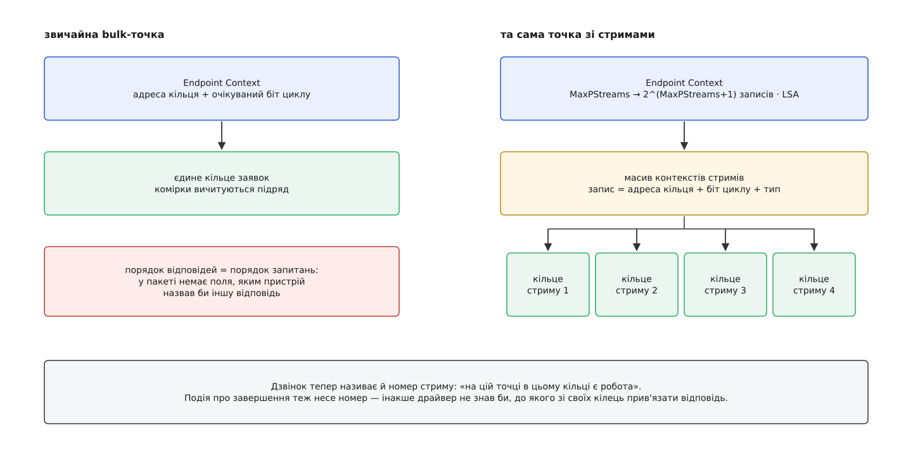
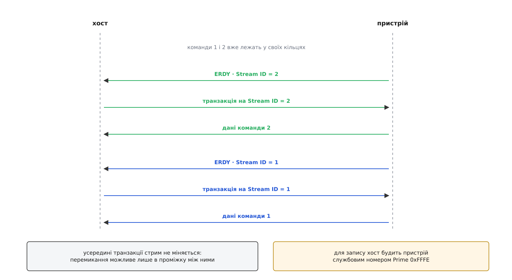
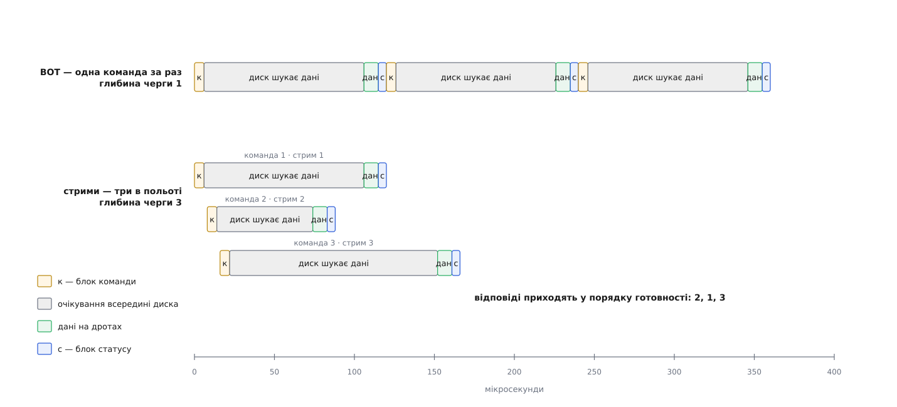

# Bulk-стрими USB 3: кілька кілець на одну кінцеву точку

<preknowlist>
- [Драйвер контролера хоста USB](topic:sys-unix/usb-host-controller) — кільце TRB на кінцеву точку, контекст кінцевої точки, регістр-дзвінок і кільце подій.
- [USB у Linux](topic:sys-unix/usb-in-linux) — `usbcore`, заявка на передачу (URB) і прив'язка драйвера до інтерфейсу.
- [Кінцеві точки USB](topic:com-devices/usb-endpoints) — односторонній канал, типи передач; bulk не має жодних обіцянок щодо часу.
- [Кільцевий буфер](topic:sf-algorithms/ring-buffer) — виробник і споживач ідуть по одному масиву по колу.
- [Підсистема SCSI](topic:sys-unix/scsi-subsystem) — команда, її тег і черга команд до пристрою.
- [Блоковий пристрій](topic:sys-unix/block-device-model) — черга запитів і що означає її глибина.
</preknowlist>

Той самий твердотільний диск усередині машини й він же у зовнішній коробочці з USB 3 поводяться по-різному, і різниця не там, де її чекають. Великий файл копіюється майже однаково швидко. А дрібні запити врозкид зовнішній варіант обслуговує в рази гірше — при тому, що дріт має величезний запас смуги й здебільшого простоює.

Причина всередині диска. Флеш у ньому — не одна мікросхема, а десятки кристалів, і кожен живе своїм темпом: запит, що влучив у кристал, зайнятий зараз стиранням, чекає сотні мікросекунд; сусідній лягає на вільний кристал і готовий майже одразу. Диск уміє тримати в роботі десятки запитів і віддавати відповіді тоді, коли вони визріли, а не в порядку, у якому їх спитали. Через внутрішній роз'єм він так і робить. Через USB — не може, і заборона зашита в саму форму передачі.

## Один канал — один порядок

З боку хоста кінцевій точці відповідає одне кільце заявок: драйвер дописує комірки з одного кінця, контролер вичитує їх з іншого. Вичитує **підряд** — у цьому й уся справа. Комірка, що стоїть першою, тримає канал, поки не завершиться.

Тепер подивімося на дроти. Пакет даних SuperSpeed несе заголовок, де є адреса пристрою, номер кінцевої точки, напрям, лічильники — але немає нічого, що сказало б «ці байти належать третьому із замовлених читань». Єдине, про що обидва боки домовлені без слів, — що йдеться про передачу, яка стоїть у черзі першою. Звідси й береться порядок: пристроєві **нічим назвати** відповідь, тож він мусить відповідати в порядку запитань.

Це не недогляд, а найдешевша можлива домовленість. Немає тега в пакеті — немає й потреби тримати на хості окремий підготовлений буфер під кожен незавершений запит: буфер завжди один, той, що зараз попереду черги.

Клас накопичувачів побудували прямо на цьому обмеженні. Класичний транспорт [USB mass storage](topic:sys-unix/usb-mass-storage) — BOT, Bulk-Only Transport — має три фази: хост шле 31-байтовий блок команди на bulk-OUT, далі йде обмін даними, далі пристрій віддає 13-байтовий блок статусу на bulk-IN. Наступна команда починається лише після статусу попередньої, бо інакше жоден із двох боків не знатиме, чиї байти зараз на дротах. Глибина черги до пристрою тут дорівнює одиниці за побудовою.

**Скільки віддає диск, поки в роботі рівно одна команда.**

```
запит                     = 4 КіБ = 4096 байтів
SuperSpeed Gen 1          = 5 Гбіт/с; після коду 8b/10b ≈ 4 Гбіт/с корисних
час 4 КіБ на дротах       = 4096 · 8 / 4e9        ≈ 8.2 мкс
внутрішня затримка SSD    ≈ 100 мкс
такт команди BOT          ≈ 100 + 8.2 + службові  ≈ 120 мкс
команд за секунду         = 1 / 120e-6            ≈ 8300
пропускна здатність       = 8300 · 4096           ≈ 34 МБ/с
```

Тридцять чотири мегабайти на секунду там, де дріт тягне п'ятсот. Причому втрачено не смугу, а перекриття: усі 100 мкс, поки диск шукає дані, канал мовчить, хоча в черзі операційної системи вже чекають десятки готових запитів.

Порахуймо, чого варта сама лише можливість чекати одночасно. Якщо в роботі тримати N запитів, кожен зі своєю затримкою T, то за [законом Літтла](topic:math-probability/littles-law) потік завершень дорівнює N/T:

```
N = 32, T = 120 мкс
завершень за секунду = 32 / 120e-6   ≈ 267000
у байтах             = 267000 · 4096 ≈ 1.09 ГБ/с
стеля дроту          = 500 МБ/с      →  тепер вузьке місце — дріт, а не диск
```

Мета, отже, не в тому, щоб пришвидшити окрему команду — її час визначає фізика флешу. Мета в тому, щоб дозволити багатьом командам чекати разом. А для цього пристрій мусить дістати право відповісти не по порядку — тобто мусить з'явитися спосіб **назвати**, на що саме він відповідає.

## Чому ім'я не можна дати кінцевою точкою

Найпростіше рішення напрошується саме: дати кожній одночасній команді власну кінцеву точку. Тоді номер точки і є ім'ям, і нічого міняти не треба.

Воно не працює з двох причин, і обидві варто побачити, бо саме вони визначають форму справжнього розв'язку. По-перше, номерів мало: у пристрою їх п'ятнадцять на напрям, і всі точки описані в дескрипторах, які пристрій віддає під час енумерації. По-друге — і це важливіше — набір кінцевих точок фіксується конфігурацією пристрою, а кількість команд у польоті є властивістю навантаження в цю секунду. Опис пристрою не має права залежати від того, скільки програм зараз читають з диска.

Отже, ім'я мусить жити не в дескрипторі, а в самому пакеті, і роздаватися на ходу. Так у заголовку пакета SuperSpeed з'явилося 16-бітове поле **Stream ID** — номер стриму (англ. *stream* — потік). Для звичайної bulk-точки воно нульове; для точки зі стримами воно каже, до котрої з паралельних розмов належать байти.

Але одного поля мало. Якщо пристрій має право віддати відповідь на п'яту команду раніше за першу, то хост мусить **наперед** мати місце, куди ці байти покласти: підготовлений буфер і власну позицію в черзі для кожної незавершеної команди. Одне кільце такого не вміє — воно й є втіленням єдиного порядку. Тому стрим — це не просто тег у пакеті, а **окреме кільце заявок на тій самій кінцевій точці**, і номер у заголовку пакета обирає, котре з кілець зараз рухається.

Це працює лише для bulk-передач і лише починаючи з [SuperSpeed](topic:com-devices/usb3-physical): у протоколі USB 2.0 поля для номера стриму немає й дописати його нікуди, тож пристрій, увімкнений у порт USB 2, залишається зі старим правилом «відповідай по порядку».

## Масив кілець замість вказівника

Тепер подивімося, як це виглядає в пам'яті хоста.

Звичайна кінцева точка описана контекстом, у якому серед іншого лежить адреса її кільця й очікуваний біт циклу. Коли для точки ввімкнено стрими, те саме поле вказує вже не на кільце, а на **масив контекстів стримів**. Кожен запис масиву — це шістнадцять байтів із адресою свого кільця, своїм бітом циклу й типом запису. Скільки записів у масиві, каже поле MaxPStreams у контексті точки: розмір задано степенем двійки, 2^(MaxPStreams+1). Нульовий запис не використовують — номер стриму 0 зарезервований і означає «без стриму».

Далі все як було, з однією поправкою на адресацію. Регістр-дзвінок тепер несе не лише номер кінцевої точки, а й номер стриму: «на точці такій-то в кільці такому-то є робота». А подія про завершення передачі, яку контролер пише в кільце подій, теж містить номер стриму — інакше драйвер не знав би, до якого зі своїх кілець прив'язати завершення.



*Поле контексту те саме — міняється лише те, що на іншому кінці вказівника: одне кільце чи таблиця кілець.*

Є ще одна деталь, яка спершу здається зайвим ускладненням, а насправді має ту саму природу, що й багаторівневі таблиці сторінок. Номерів стримів може бути до 65533. Плаский масив на всі номери — це 65536 записів по шістнадцять байтів, тобто мегабайт суцільної пам'яті під DMA, витрачений на самі лише вказівники, ще й для драйвера, якому треба тридцять два кільця. Тому xHCI дозволяє двоповерхову адресацію: запис первинного масиву може вести не на кільце, а на вторинний масив, і тоді номер стриму ділиться на старшу й молодшу частини. Що саме лежить за записом, каже поле типу в самому записі, а біт LSA (Linear Stream Array) у контексті точки повідомляє контролерові, який спосіб обрано на цій точці.

Linux завжди ставить LSA і працює лише з одноповерховим масивом. Причина проста: справжні споживачі стримів просять десятки кілець, а не десятки тисяч, тож другий поверх коштував би зайвого читання з пам'яті на кожен пошук і не давав би нічого. Точні розкладки полів — контекст стриму, кодування типу запису, формат дзвінка й події — зібрано окремо: [контексти стримів у xHCI та API ядра](topic:sys-unix/usb-bulk-streams/api-stream-contexts.md).

## Хто вирішує, чий стрим рухається

Кільця розставлено, номери роздано. Лишилося головне питання: хто в кожен момент обирає, котре кільце зараз обслуговують?

Якби обирав хост, ми б не зрушили з місця. Хост саме тому й не може вгадати правильний порядок, що не знає, який кристал флешу зараз вільний. Тому право першого слова віддали пристроєві.

Пристрій сигналить пакетом **ERDY** (endpoint ready) з номером стриму: «я готовий рухати п'яту розмову». Хост відповідає транзакцією саме на цьому номері — для читання це підтвердження, у якому він просить дані, для запису це пакет даних, — і номер стає поточним для обох боків. Усередині транзакції стрим не міняється: перемикання можливе лише в проміжку між транзакціями. Тому кожне перемикання коштує паузи на розворот каналу, і для двох-трьох одночасних розмов дешевше було б мати справді дві-три кінцеві точки; стрими виправдовуються там, де розмов десятки.

За хостом лишається останнє слово: він має право почати рух на будь-якому стримі самотужки, не чекаючи ERDY. Цю самодіяльність можна заборонити прапорцем HID (Host Initiate Disable) у контексті кінцевої точки, і тоді хостові лишається один спосіб достукатися — **Prime**. Номер 0xFFFE не адресує жодного кільця: це службова адреса, якою хост каже «у мене з'явилася робота для тебе». Пристрій відповідає на неї «не готовий» і повертається зі своїм ERDY тоді, коли справді буде готовий, — уже з номером потрібного йому стриму. Номер 0xFFFF не означає жодного стриму, нуль зарезервовано, тож для роботи лишаються номери від 1 до 65533.



*Дві команди в польоті, відповідь приходить на ту, що визріла раніше; кільце другої команди чекає далі.*

## Як це виглядає з драйвера

`usbcore` ховає всю цю механіку за двома викликами. Драйвер просить стрими на **наборі** кінцевих точок і дістає число — скільки їх насправді дали:

```c
struct usb_host_endpoint *eps[3] = { ep_status, ep_in, ep_out };
int n;

n = usb_alloc_streams(intf, eps, 3, MAX_TAGS, GFP_NOIO);
if (n < 2)
        return work_without_streams(dev);   /* одна команда за раз */

/* кожна команда бере свій тег і кладе заявку у СВОЄ кільце */
urb->stream_id = tag;                       /* 1 … n */
usb_submit_urb(urb, GFP_NOIO);
```

Набір точок тут не випадковий. Номер стриму має означати те саме на всіх точках одного протоколу: дані сьомої команди йдуть кільцем сім точки читання, а її статус — кільцем сім точки статусу. Тому простір номерів заводять на всі ці точки разом, одним викликом.

Число, яке повертається, майже ніколи не дорівнює запитаному — це найменше з трьох: скільки просив драйвер, скільки стримів заявив пристрій у своєму дескрипторі кінцевої точки SuperSpeed, і скільки записів первинного масиву витягує контролер. Драйвер, який припускає, що дістав рівно стільки, скільки просив, зламається на першому ж дешевому контролері.

Решта правил — з тієї самої природи: просити стрими можна лише тоді, коли на точках немає жодної живої заявки (контролер перебудовує контекст точки, а робити це під навантаженням нікому не можна); просити менше двох немає сенсу; двічі поспіль на ту саму точку не можна — спершу звільнити. Робочий кістяк драйвера з розподілом тегів, скасуванням і відновленням після помилки розібрано окремо: [драйвер на стримах від початку до кінця](topic:sys-unix/usb-bulk-streams/proj-streams-driver.md).

> 🔧 **Навіщо це.** Побачити, чи дісталися стрими вашому накопичувачу, можна двома командами. `lsusb -t` показує, який драйвер прив'язався: `uas` означає, що стрими є, `usb-storage` — що ні. А `cat /sys/block/sdX/device/queue_depth` показує вже наслідок: скільки команд система дозволяє тримати в польоті. Одиниця там — це рівно та арифметика на 34 МБ/с, з якої ми почали.

## UAS: заради чого це робилося

Стрими — механізм без власного застосування; сенсу їм надає протокол, який ними користується. Головний такий протокол — UAS (USB Attached SCSI): спосіб возити [SCSI-команди](topic:sys-unix/scsi-subsystem) по USB так, щоб їх можна було ставити в чергу.

UAS має чотири bulk-точки: команди назовні, статуси всередину, дані в обидва боки. Команда їде в структурі, де серед іншого є її тег. І тег цей — не абстракція: він і є номером стриму, під яким поїдуть дані цієї команди й прийде її статус. Тому стрими просять на трьох точках із чотирьох. Точці команд вони не потрібні: команда сама себе називає — тег лежить усередині її ж корисного навантаження. Плутанина можлива лише там, де по дротах ідуть сирі байти без жодної обгортки, а це якраз дані й статуси.

Драйвер `uas` у Linux просить до 256 стримів і бере, скільки дали; це число стає глибиною черги SCSI для диска. На швидкості, нижчій за SuperSpeed, стримів немає взагалі — тоді драйвер усе одно тримає в польоті багато команд, бо теги всередині структур нікуди не поділися, але порядок фаз даних на дротах лишається за хостом, і головний виграш — перевпорядкування відповідей — зникає.



*Дріт зайнятий однаково мало в обох випадках; різниця в тому, чи чекають затримки диска по черзі, чи разом.*

Історія тут довша, ніж здається з опису: між появою стримів у стандарті й моментом, коли зовнішній диск у Linux нарешті став швидким, минуло п'ять із половиною років, а сама підтримка UAS в ядрі встигла побути непрацездатною. Як це відбувалося й чому так затягнулося — [як з'явилися стрими й UAS](topic:sys-unix/usb-bulk-streams/hist-streams-and-uasp.md).

## Де це ламається

Стрими — найскладніша частина мікропрограми будь-якого моста USB-SATA, і саме тут дешеві мости програють. Симптоми впізнавані: під навантаженням пристрій замовкає, ядро скидає його, файлова система їде в режим «лише читання». Ядро тримає на такі мости чорний список за парою «виробник-виріб», а вручну UAS вимикають параметром `usb-storage.quirks=152d:0578:u` — після цього до пристрою прив'язується старий `usb-storage` з його однією командою за раз, повільно, зате без падінь.

Буває й дзеркальна біда з боку хоста: контролер заявляє підтримку стримів у своїх параметрах, а насправді або не вміє, або заявляє неправдивий розмір масиву. На такі контролери в драйвері xHCI є прапорець `XHCI_BROKEN_STREAMS`; тоді `usb_alloc_streams()` повертає помилку, і драйвер зобов'язаний мати шлях відступу — той самий, що й для USB 2.0.

Окремо варто розуміти, що ламається не одне кільце, а вся точка. Коли пристрій застряг (STALL), контролер зупиняє кінцеву точку цілком, разом з усіма стримами; відновлення — це скидання точки й пересування вказівника прочитаного **того** кільця, на якому сталася біда, після чого решта кілець працює далі зі своїх позицій. А якщо пристрій назве в ERDY номер стриму, якого хост йому не заводив, контролер відповість кодом Invalid Stream ID Error — майже завжди це помилка мікропрограми, яка не забула тег скасованої команди.

Виходить, що стрими зробили з USB те саме, що [NVMe](topic:hw-arch/nvme-protocol) зробив з інтерфейсом до диска: перенесли вибір порядку з хоста на пристрій, бо тільки пристрій знає, що в нього готове. Різниця в ціні цього кроку. NVMe міг перебудувати топологію й дати кожному ядру процесора власну пару черг — це його архітектура. USB топології змінити не міг: у нього одна пара дротів і фіксований набір кінцевих точок у дескрипторі. Тож він розмножив кільця під однією точкою й дописав шістнадцять бітів у заголовок пакета — те саме за суттю, але прищеплене збоку. Саме тому воно й залежить від того, наскільки сумлінно написана мікропрограма чергового моста за двадцять доларів.
