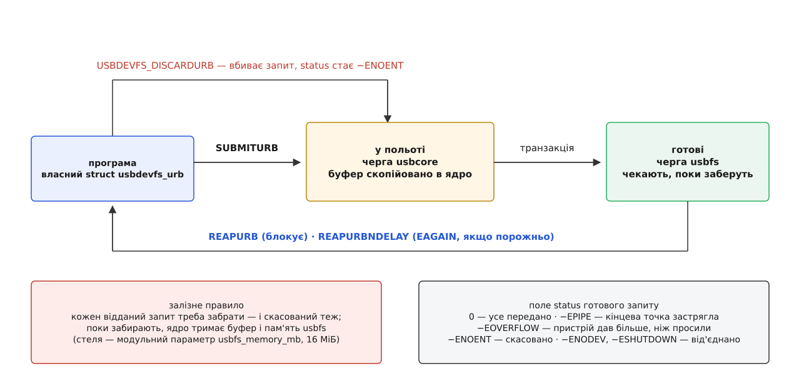

# 📋 Контракт usbfs: команди ioctl, структури, коди помилок

Повний перелік того, що ядро виставляє в простір користувача через файл `/dev/bus/usb/BBB/DDD`: номери команд, розкладка структур, семантика кожного поля, межі розмірів і коди помилок. Це той рівень, на якому працює `libusb` зсередини, — і той, до якого доводиться спускатися, коли бібліотека повертає незрозумілу відмову й треба знати, звідки саме вона взялася. Звірено з `include/uapi/linux/usbdevice_fs.h` і `drivers/usb/core/devio.c` чинного ядра.

## Що взагалі можна робити з цим файлом

Дескриптор один на **весь пристрій**, не на інтерфейс. Відкривати треба з `O_RDWR`: будь-яка передача — навіть читання з пристрою — з погляду ядра є записом у файл, тож на `O_RDONLY` перша ж команда впаде.

`read()` на цьому дескрипторі повертає сирі дескриптори пристрою — спершу дескриптор самого пристрою, далі всі конфігурації підряд; саме звідси їх бере `lsusb -v`. Усе інше — виключно через [ioctl](root:sys-unix/ioctl-interface).

Окреме застереження стосується самих номерів команд. Літери напряму в макросах usbfs історично **не збігаються** з тим, куди насправді течуть дані: `USBDEVFS_SUBMITURB` оголошено як `_IOR`, хоча ядро з цієї структури читає, а `USBDEVFS_REAPURB` — як `_IOW`, хоча воно туди пише. Номери зафіксовані назавжди й міняти їх не можна, тож напрям з макроса не виводять — його беруть із таблиці нижче.

```c
#define USBDEVFS_CONTROL           _IOWR('U',  0, struct usbdevfs_ctrltransfer)
#define USBDEVFS_BULK              _IOWR('U',  2, struct usbdevfs_bulktransfer)
#define USBDEVFS_RESETEP           _IOR ('U',  3, unsigned int)
#define USBDEVFS_SETINTERFACE      _IOR ('U',  4, struct usbdevfs_setinterface)
#define USBDEVFS_SETCONFIGURATION  _IOR ('U',  5, unsigned int)
#define USBDEVFS_GETDRIVER         _IOW ('U',  8, struct usbdevfs_getdriver)
#define USBDEVFS_SUBMITURB         _IOR ('U', 10, struct usbdevfs_urb)
#define USBDEVFS_DISCARDURB        _IO  ('U', 11)
#define USBDEVFS_REAPURB           _IOW ('U', 12, void *)
#define USBDEVFS_REAPURBNDELAY     _IOW ('U', 13, void *)
#define USBDEVFS_CLAIMINTERFACE    _IOR ('U', 15, unsigned int)
#define USBDEVFS_RELEASEINTERFACE  _IOR ('U', 16, unsigned int)
#define USBDEVFS_CONNECTINFO       _IOW ('U', 17, struct usbdevfs_connectinfo)
#define USBDEVFS_IOCTL             _IOWR('U', 18, struct usbdevfs_ioctl)
#define USBDEVFS_RESET             _IO  ('U', 20)
#define USBDEVFS_CLEAR_HALT        _IOR ('U', 21, unsigned int)
#define USBDEVFS_DISCONNECT        _IO  ('U', 22)   /* лише всередині USBDEVFS_IOCTL */
#define USBDEVFS_CONNECT           _IO  ('U', 23)   /* лише всередині USBDEVFS_IOCTL */
#define USBDEVFS_GET_CAPABILITIES  _IOR ('U', 26, __u32)
#define USBDEVFS_DISCONNECT_CLAIM  _IOR ('U', 27, struct usbdevfs_disconnect_claim)
```

## Володіння інтерфейсом і стан пристрою

| команда | третій аргумент `ioctl()` | що робить | типові помилки |
| --- | --- | --- | --- |
| `CLAIMINTERFACE` | `unsigned int *` — номер інтерфейсу | закріплює інтерфейс за цим дескриптором; знімається сам під час `close()` | `EBUSY` — тримає драйвер ядра · `ENOENT` — такого інтерфейсу немає · `EACCES` — привілеї вже скинуто |
| `RELEASEINTERFACE` | `unsigned int *` — номер | звільняє інтерфейс достроково | `EINVAL` — номер поза межами · `ENOENT` — не був закріплений |
| `GETDRIVER` | `struct usbdevfs_getdriver *` | вписує ім'я драйвера ядра, прив'язаного до інтерфейсу | `ENODATA` — драйвера немає |
| `IOCTL` | `struct usbdevfs_ioctl *` | обгортка: передає вкладену команду драйверові інтерфейсу | залежить від вкладеної |
| `DISCONNECT_CLAIM` | `struct usbdevfs_disconnect_claim *` | відчіплює драйвер і закріплює інтерфейс **однією** операцією, без вікна між ними | `EBUSY` — драйвер не той, що дозволено прапорцями |
| `SETINTERFACE` | `struct usbdevfs_setinterface *` | вмикає альтернативне налаштування інтерфейсу | `ENOSPC` — на шині забракло смуги · `EINVAL` — немає такого altsetting |
| `SETCONFIGURATION` | `unsigned int *` — `bConfigurationValue` | перевмикає конфігурацію: ядро розбирає всі інтерфейси й збирає нові | `EBUSY` — якийсь інтерфейс закріплено |
| `CLEAR_HALT` | `unsigned int *` — адреса кінцевої точки | знімає stall і скидає лічильник DATA0/DATA1 | `EINVAL` — немає такої кінцевої точки |
| `RESETEP` | `unsigned int *` — адреса кінцевої точки | скидає лише лічильник DATA0/DATA1, stall не чіпає (застаріле — вживають `CLEAR_HALT`) | `EINVAL` |
| `RESET` | — | скидання пристрою на рівні порту з наступним переприв'язуванням драйверів | `ENODEV` |
| `GET_CAPABILITIES` | `__u32 *` | віддає бітову маску можливостей цього ядра | `ENOTTY` на ядрах, давніших за 3.6 |
| `CONNECTINFO` | `struct usbdevfs_connectinfo *` | номер пристрою на шині й прапорець «низька швидкість» | — |

Дві дрібниці, на яких спотикаються найчастіше. Перша: **адреса кінцевої точки скрізь подається повністю, разом із бітом напряму** — `0x81` це вхід №1, `0x01` це вихід №1, і це різні кінцеві точки. Друга: якщо програма шле передачу на інтерфейс, якого не закріпила, ядро не відмовляє — воно закріплює інтерфейс само, лише пишучи попередження в журнал. Тож мовчазний журнал ще не означає, що код правильний.

## Синхронні передачі

```c
struct usbdevfs_ctrltransfer {
	__u8  bRequestType;   /* напрям + тип + отримувач, як у SETUP-пакеті */
	__u8  bRequest;
	__u16 wValue;
	__u16 wIndex;
	__u16 wLength;        /* скільки байтів у data */
	__u32 timeout;        /* мілісекунди; 0 — чекати вічно */
	void *data;           /* буфер у просторі користувача */
};

struct usbdevfs_bulktransfer {
	unsigned int ep;      /* адреса кінцевої точки з бітом напряму */
	unsigned int len;
	unsigned int timeout; /* мілісекунди; 0 — чекати вічно */
	void *data;
};
```

Перші п'ять полів `ctrltransfer` — це просто 8 байтів [SETUP-пакета](root:com-devices/usb-protocol-layer), як їх описує стандарт. Ядро зазирає в них рівно настільки, щоб зрозуміти, якого інтерфейсу стосується запит і чи має право процес його слати; далі кладе на дріт майже незмінними. Напрям передачі береться з верхнього біта `bRequestType`, а для bulk — з верхнього біта `ep`.

Обидві команди на успіху повертають **кількість фактично переданих байтів**, а не нуль. Для входу це може бути менше, ніж просили: пристрій має право закінчити передачу коротким пакетом, і це не помилка.

Поля `wValue`, `wIndex` і `wLength` тут — у порядку байтів вашої машини; на дріт їх перекладає в little-endian саме ядро. Пастка в тому, що для **асинхронного** контрольного запиту це не так: там перші 8 байтів буфера є готовим SETUP-пакетом, який ядро бере як є, тож little-endian треба скласти власноруч. Одне й те саме поле, два різні контракти — і на машині з x86 різниці не видно взагалі, а на big-endian код мовчки ламається.

> 🔧 **Навіщо це.** `timeout = 0` виглядає зручно — «просто чекай», — але очікування всередині ядра тут **не переривається сигналом**. Процес, що завис на такій передачі до пристрою, який перестав відповідати, не вб'є ані `Ctrl-C`, ані `SIGKILL`; він лишиться в стані `D` до перезавантаження або до фізичного висмикування кабелю. Ставте кінцевий час завжди.

## Асинхронна дорога: URB

```c
struct usbdevfs_iso_packet_desc {
	unsigned int length;         /* заповнює програма: скільки просимо */
	unsigned int actual_length;  /* заповнює ядро: скільки прийшло */
	unsigned int status;         /* заповнює ядро: код для цього пакета */
};

struct usbdevfs_urb {
	unsigned char type;          /* USBDEVFS_URB_TYPE_* */
	unsigned char endpoint;      /* адреса з бітом напряму */
	int           status;        /* ← ядро: результат */
	unsigned int  flags;         /* USBDEVFS_URB_* */
	void         *buffer;
	int           buffer_length;
	int           actual_length; /* ← ядро: скільки байтів реально пройшло */
	int           start_frame;   /* iso: номер кадру */
	union {
		int          number_of_packets;  /* лише iso */
		unsigned int stream_id;          /* лише bulk streams */
	};
	int           error_count;   /* ← ядро: скільки iso-пакетів провалилося */
	unsigned int  signr;         /* сигнал по завершенні; 0 — не слати */
	void         *usercontext;   /* ядро не чіпає — це поле програми */
	struct usbdevfs_iso_packet_desc iso_frame_desc[];
};
```

| константа | значення | де вживається |
| --- | --- | --- |
| `USBDEVFS_URB_TYPE_ISO` | 0 | лише на isochronous-точках; вимагає `number_of_packets` |
| `USBDEVFS_URB_TYPE_INTERRUPT` | 1 | interrupt-точки |
| `USBDEVFS_URB_TYPE_CONTROL` | 2 | буфер починається з 8 байтів SETUP, дані йдуть далі |
| `USBDEVFS_URB_TYPE_BULK` | 3 | bulk; на interrupt-точці ядро мовчки перетлумачить тип на `INTERRUPT` |
| `USBDEVFS_URB_SHORT_NOT_OK` | 0x01 | короткий вхідний пакет вважати помилкою (`-EREMOTEIO`) |
| `USBDEVFS_URB_ISO_ASAP` | 0x02 | почати з найближчого вільного кадру, а не з `start_frame` |
| `USBDEVFS_URB_BULK_CONTINUATION` | 0x04 | запит — продовження попереднього; збій попереднього скасує і цей |
| `USBDEVFS_URB_ZERO_PACKET` | 0x40 | дописати порожній пакет у кінці вихідної передачі, кратної розміру пакета |
| `USBDEVFS_URB_NO_INTERRUPT` | 0x80 | підказка контролеру не переривати процесор саме через цей запит |

`SUBMITURB` повертає керування негайно: ядро копіює вашу структуру собі, для вихідної передачі копіює й буфер, ставить запит у чергу — і все. Далі працює цикл із трьох команд.



*Скасований запит не зникає — він теж лягає в чергу готових зі своїм кодом і теж чекає, поки його заберуть.*

| команда | аргумент | поведінка |
| --- | --- | --- |
| `SUBMITURB` | `struct usbdevfs_urb *` | ставить запит у чергу; структура має **лишатися живою** до збирання, бо саме її адресу поверне `REAPURB` |
| `REAPURB` | `void **` | блокує, доки хоч один запит не завершиться; кладе за вказівником адресу вашої структури. `EINTR` — прийшов сигнал |
| `REAPURBNDELAY` | `void **` | те саме без очікування. `EAGAIN` — готових немає, `ENODEV` — пристрій зник |
| `DISCARDURB` | адреса структури **як значення** аргументу | скасовує запит. `EINVAL` — такого запиту в черзі немає |

Три наслідки, які видно прямо з цієї таблиці.

**Полів часу в асинхронній дорозі немає взагалі.** Обмеження часу програма робить сама: заводить власний таймер і на його спрацювання шле `DISCARDURB`. Саме так це робить `libusb`.

**Забрати треба кожен відданий запит, зокрема скасований.** `DISCARDURB` не звільняє нічого — він лише переводить запит у стан завершеного з кодом `-ENOENT`. Поки його не забрали, ядро тримає копію буфера, а вся пам'ять usbfs обмежена модульним параметром `usbfs_memory_mb` (16 МіБ за замовчуванням); вичерпаєте — наступний `SUBMITURB` поверне `ENOMEM`.

**Буфер програми має пережити політ.** Для вхідної передачі ядро копіює дані назад у ваш `buffer` у момент збирання, а не завершення. Звільнили буфер одразу після `SUBMITURB` — отримали запис у чужу пам'ять.

## Обгортка для команд драйверові

```c
struct usbdevfs_ioctl {
	int   ifno;        /* номер інтерфейсу */
	int   ioctl_code;  /* що саме зробити */
	void *data;        /* буфер параметрів вкладеної команди */
};
```

| `ioctl_code` | що робить | помилки |
| --- | --- | --- |
| `USBDEVFS_DISCONNECT` | відчіплює драйвер ядра від інтерфейсу; діє до перевтикання | `ENODATA` — драйвера й не було |
| `USBDEVFS_CONNECT` | дає ядру знову спробувати прив'язати драйвер | `EBUSY` — інтерфейс уже комусь належить |
| будь-який інший | передається у власний обробник `ioctl` того драйвера, що тримає інтерфейс | `ENOTTY` — драйвер такого не вміє |

Пара «відчепити → закріпити» має вікно, у яке між двома викликами може встигнути втрутитися хтось третій. Хто цього боїться — вживає `USBDEVFS_DISCONNECT_CLAIM`: та сама робота однією неподільною командою, ще й із прапорцем «відчіплюй, тільки якщо там саме цей драйвер».

```c
struct usbdevfs_setinterface {
	unsigned int interface;
	unsigned int altsetting;
};

struct usbdevfs_getdriver {
	unsigned int interface;
	char driver[256];      /* ← ядро вписує ім'я, наприклад "uvcvideo" */
};

struct usbdevfs_disconnect_claim {
	unsigned int interface;
	unsigned int flags;    /* 0 — відчіплюй будь-кого */
	char driver[256];      /* ім'я для порівняння, якщо flags не 0 */
};

#define USBDEVFS_DISCONNECT_CLAIM_IF_DRIVER      0x01  /* лише якщо драйвер — саме driver */
#define USBDEVFS_DISCONNECT_CLAIM_EXCEPT_DRIVER  0x02  /* лише якщо драйвер — НЕ driver */
```

## Що вміє це конкретне ядро

Частина поведінки usbfs з'являлася поступово, і за версією ядра її не вгадати: дистрибутиви переносять латки назад. Тому питають прямо — `GET_CAPABILITIES` віддає бітову маску. Сама відмова теж є відповіддю: `ENOTTY` означає ядро, давніше за 3.6, — там про можливості ще не було в кого спитати.

| біт | значення | що дозволяє |
| --- | --- | --- |
| `CAP_ZERO_PACKET` | 0x01 | прапорець `URB_ZERO_PACKET` справді працює |
| `CAP_BULK_CONTINUATION` | 0x02 | `URB_BULK_CONTINUATION` — зв'язування запитів у ланцюг |
| `CAP_NO_PACKET_SIZE_LIM` | 0x04 | буфер URB не обмежено розміром пакета кінцевої точки |
| `CAP_BULK_SCATTER_GATHER` | 0x08 | великий bulk-буфер ядро розкладає на розсіяний список замість суцільного шматка |
| `CAP_REAP_AFTER_DISCONNECT` | 0x10 | завершені запити можна забирати навіть після від'єднання пристрою |
| `CAP_MMAP` | 0x20 | буфер можна відобразити через `mmap()` і уникнути копіювання |
| `CAP_DROP_PRIVILEGES` | 0x40 | є `USBDEVFS_DROP_PRIVILEGES` — звузити дескриптор до переліку дозволених інтерфейсів |
| `CAP_CONNINFO_EX` | 0x80 | є розширений опис під'єднання: шина, швидкість, повний шлях портами |
| `CAP_SUSPEND` | 0x100 | програма може забороняти й дозволяти присипляння пристрою |

Практичний висновок один: перевіряти маску треба **до** того, як покластися на прапорець. Невідомий біт `flags` у `SUBMITURB` старе ядро просто зігнорує — передача піде, але поведеться не так, як задумано, і жодної помилки при цьому не буде.

## Межі, за які не пускають

| що | межа | наслідок перевищення |
| --- | --- | --- |
| `wLength` у `USBDEVFS_CONTROL` | `PAGE_SIZE` (зазвичай 4096 байтів) | `EINVAL` |
| `buffer_length` будь-якого URB | `USBFS_XFER_MAX` = `UINT_MAX/2 − 1000000` | `EINVAL` |
| `buffer_length` контрольного URB | не менше 8 і не менше за `wLength + 8` | `EINVAL` |
| `number_of_packets` для iso | від 1 до 128 | `EINVAL` |
| `length` одного iso-пакета | 98304 байти | `EINVAL` |
| уся пам'ять під буфери usbfs | `usbfs_memory_mb`, 16 МіБ | `ENOMEM` |
| номер інтерфейсу | менший за 8·`sizeof(unsigned long)` | `EINVAL` |

Для isochronous-запиту поле `buffer_length` заповнювати марно: ядро перерахує його як суму `length` усіх пакетів.

## Коди помилок і що вони насправді кажуть

| код | звідки береться | що робити |
| --- | --- | --- |
| `EACCES` | прав на файл `/dev/bus/usb/…` не вистачило; або привілеї дескриптора вже скинуто | правило udev (нижче), не `sudo` |
| `EBUSY` | інтерфейс тримає драйвер ядра або інший процес | відчепити драйвер через обгортку `USBDEVFS_IOCTL` |
| `ENODEV` | пристрій від'єднано; дескриптор чинний, пристрою за ним уже немає | закрити дескриптор і шукати пристрій наново |
| `EPIPE` | у полі `status` — кінцева точка застрягла (stall) | `CLEAR_HALT` на цю точку, і лише тоді продовжувати |
| `ETIMEDOUT` | вичерпався `timeout` синхронної передачі; запит уже вбито | переслати або перевірити, чи пристрій узагалі відповідає |
| `ENOSPC` | `SETINTERFACE` чи iso-запит не вмістився у вільну смугу шини | взяти легше альтернативне налаштування або звільнити шину |
| `EOVERFLOW` | пристрій надіслав більше, ніж уміщає кінцева точка | помилка в самому пристрої або невідповідний altsetting |
| `EREMOTEIO` | прийшло менше, ніж просили, при заданому `SHORT_NOT_OK` | зазвичай прибрати цей прапорець |
| `EHOSTUNREACH` | URB відхилено, бо пристрій присиплений | розбудити пристрій зверненням до нього або зняти автоприсипляння через `power/control` |

## Мінімальний робочий виклик

```c
#include <errno.h>
#include <fcntl.h>
#include <stdio.h>
#include <sys/ioctl.h>
#include <unistd.h>
#include <linux/usbdevice_fs.h>
#include <linux/usb/ch9.h>

int main(void)
{
	int fd = open("/dev/bus/usb/001/007", O_RDWR);   /* саме RDWR */
	if (fd < 0) { perror("open"); return 1; }        /* EACCES → правило udev */

	__u32 caps = 0;
	ioctl(fd, USBDEVFS_GET_CAPABILITIES, &caps);

	unsigned int ifnum = 0;
	if (ioctl(fd, USBDEVFS_CLAIMINTERFACE, &ifnum) < 0 && errno == EBUSY) {
		struct usbdevfs_ioctl cmd = {
			.ifno       = ifnum,
			.ioctl_code = USBDEVFS_DISCONNECT,
			.data       = NULL,
		};
		ioctl(fd, USBDEVFS_IOCTL, &cmd);             /* відчепити драйвер ядра */
		ioctl(fd, USBDEVFS_CLAIMINTERFACE, &ifnum);  /* і взяти ще раз */
	}

	unsigned char buf[18];
	struct usbdevfs_ctrltransfer ctrl = {
		.bRequestType = USB_DIR_IN | USB_TYPE_STANDARD | USB_RECIP_DEVICE,
		.bRequest     = USB_REQ_GET_DESCRIPTOR,
		.wValue       = (USB_DT_DEVICE << 8) | 0,
		.wIndex       = 0,
		.wLength      = 18,          /* дескриптор пристрою — рівно 18 байтів */
		.timeout      = 1000,        /* мілісекунди, і ніколи не 0 */
		.data         = buf,
	};

	int n = ioctl(fd, USBDEVFS_CONTROL, &ctrl);      /* n — скільки байтів прийшло */
	if (n < 0)
		perror("USBDEVFS_CONTROL");
	else
		printf("VID:PID = %04x:%04x, отримано %d байтів\n",
		       buf[8] | (buf[9] << 8), buf[10] | (buf[11] << 8), n);

	ioctl(fd, USBDEVFS_RELEASEINTERFACE, &ifnum);
	close(fd);
	return 0;
}
```

## Чим пристрій упізнають: атрибути sysfs

Шлях `/dev/bus/usb/001/007` живе не довше за одне під'єднання, тож правила пишуть не на нього, а на те, що пристрій сам про себе розповів. Ці поля [ядро виставляє в sysfs](root:sys-unix/sysfs-device-model) — на самому пристрої (`1-1`) або на його інтерфейсі (`1-1:1.0`).

| атрибут | де живе | вигляд | що це |
| --- | --- | --- | --- |
| `idVendor` | пристрій | `0483` | код виробника, 4 шістнадцяткові цифри |
| `idProduct` | пристрій | `374b` | код продукту |
| `serial` | пристрій | `066BFF…` | серійний номер із дескриптора; у дешевих пристроїв часто відсутній або однаковий |
| `manufacturer`, `product` | пристрій | текст | рядки, які пристрій назвав сам |
| `bcdDevice` | пристрій | `0100` | версія самого виробу — єдине, чим часом різняться дві ревізії з однаковим VID:PID |
| `busnum`, `devnum` | пристрій | `1`, `7` | ті самі числа, що в шляху `/dev/bus/usb/001/007` |
| `devpath` | пристрій | `2.4.1` | дорога портами через хаби; тримається, поки кабель у тому самому гнізді |
| `speed` | пристрій | `480` | швидкість у Мбіт/с рядком |
| `bInterfaceClass` | інтерфейс | `0e` | клас функції; `ff` означає власний протокол виробника |
| `bInterfaceNumber` | інтерфейс | `00` | номер, який передають у `CLAIMINTERFACE` |

Шістнадцяткові значення пишуться **малими літерами, з провідними нулями й без `0x`**. Правило udev порівнює рядки посимвольно, тож `"0E"`, `"e"` чи `"0x0e"` не збігуться з `0e` ніколи, і помилка ця тиха: правило просто не спрацює.

Ці ж атрибути дають єдиний надійний спосіб дійти від «мені потрібен ось цей пристрій» до імені файлу, який відкривати. Шукають за парою кодів, а шлях складають із двох сусідніх чисел:

```
$ grep -l 374b /sys/bus/usb/devices/*/idProduct
/sys/bus/usb/devices/1-4/idProduct

$ cat /sys/bus/usb/devices/1-4/busnum /sys/bus/usb/devices/1-4/devnum
1
7
```

```
шлях = /dev/bus/usb/BBB/DDD, обидва числа доповнені нулями до трьох цифр
busnum 1, devnum 7  →  /dev/bus/usb/001/007
```

Робити цей обхід доводиться щоразу наново: `devnum` видає наростаючий лічильник, тож після кожного перевтикання число інше. Те саме, тільки приховано, робить усередині й `libusb_get_device_list()`.

## Правила udev для USB

Що саме [udev](root:sys-unix/udev-rules) робить із подією, задають ключами; для USB достатньо кількох.

| ключ | значення |
| --- | --- |
| `SUBSYSTEM=="usb"` | подія з шини USB |
| `ENV{DEVTYPE}=="usb_device"` | подія про **весь пристрій** (саме він має вузол у `/dev/bus/usb`), а не про інтерфейс |
| `ATTR{…}` | атрибут того пристрою, що породив подію |
| `ATTRS{…}` | атрибут його самого **або будь-якого предка**; усі `ATTRS` одного правила мусять збігтися на одному предкові |
| `MODE`, `GROUP`, `OWNER` | права на вузол |
| `TAG+="uaccess"` | віддати пристрій тому, хто зараз за локальним сеансом |
| `SYMLINK+="…"` | стале ім'я в `/dev` на додачу до основного |

```
# /etc/udev/rules.d/70-probes.rules

# весь пристрій за VID:PID — доступ тому, хто сидить за машиною
SUBSYSTEM=="usb", ENV{DEVTYPE}=="usb_device", \
  ATTR{idVendor}=="0483", ATTR{idProduct}=="374b", TAG+="uaccess"

# два однакові програматори — розрізняємо серійним номером
SUBSYSTEM=="usb", ENV{DEVTYPE}=="usb_device", \
  ATTR{idVendor}=="0483", ATTR{serial}=="066BFF534955877567143427", \
  SYMLINK+="probe-left"

# за класом інтерфейсу: клас — на інтерфейсі (ATTR), VID — на предкові (ATTRS)
SUBSYSTEM=="usb", ENV{DEVTYPE}=="usb_interface", \
  ATTR{bInterfaceClass}=="ff", ATTRS{idVendor}=="0483", \
  GROUP="plugdev", MODE="0660"
```

Номер у назві файлу не косметичний. Мітку `uaccess` перетворює на справжній список доступу правило systemd `73-seat-late.rules`, тож ваш файл мусить сортуватися **раніше** — звідси й звичне `70-`. І остання деталь: правила застосовуються під час події від ядра, а не постфактум. Після редагування — `udevadm control --reload` і перевтикання кабелю; перевірити, що саме бачить udev, дає `udevadm info --attribute-walk --name=/dev/bus/usb/001/007`.
