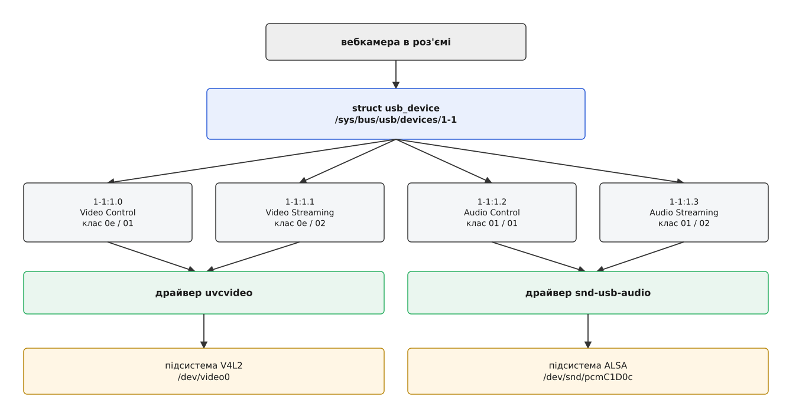
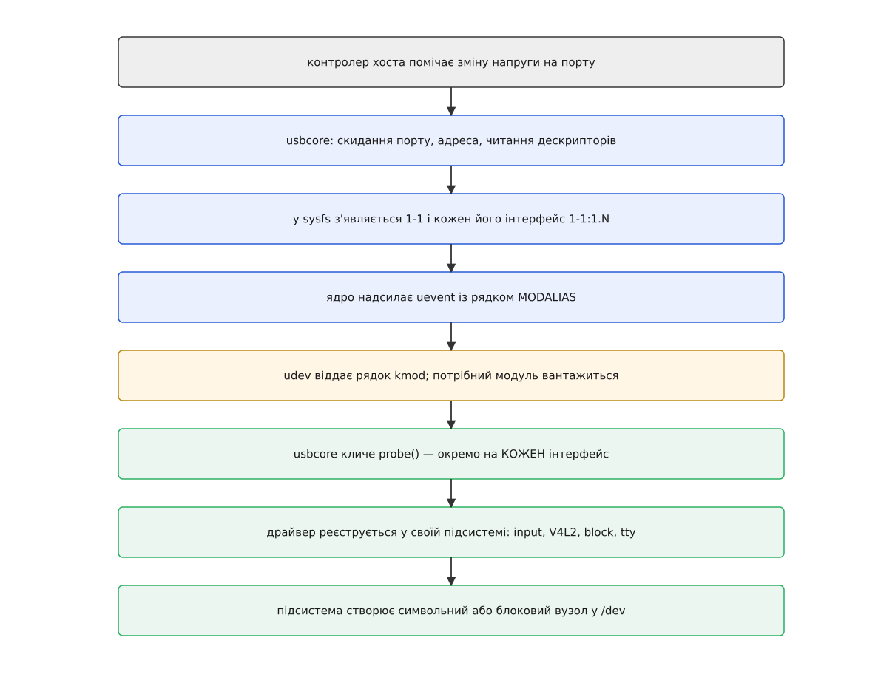
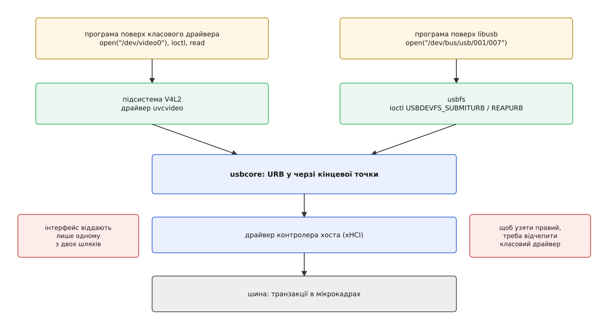

# USB у Linux: шина, класи, доступ із простору користувача

<preknowlist>
- [Ядро й простір користувача](topic:sys-unix/kernel-and-userspace) — межа, через яку програма нічого не робить із залізом напряму, а лише просить ядро.
- [«Усе є файлом»](topic:sys-unix/everything-is-a-file) — доступ до пристрою виглядає як відкритий файл із `read`, `write` і `ioctl`.
- [Файл пристрою: символьний і блоковий](topic:sys-unix/device-file-model) — вузол у `/dev` не містить даних, а лише адресує драйвер у ядрі.
- [Модель пристроїв у sysfs](topic:sys-unix/sysfs-device-model) — ядро показує своє дерево пристроїв, шин і драйверів як каталоги з атрибутами.
- [udev: іменування пристроїв і правила](topic:sys-unix/udev-rules) — служба в просторі користувача, що реагує на події ядра й створює та іменує вузли в `/dev`.
- [Модулі ядра: завантаження, параметри, залежності](topic:sys-unix/kernel-modules) — драйвер довантажують у працююче ядро на ходу.
- [Керуючий канал до драйвера: ioctl](topic:sys-unix/ioctl-interface) — усе, що не вкладається в потік байтів, передають окремим викликом із номером команди.
- [Енумерація USB](topic:com-devices/usb-enumeration) — що саме хост робить із щойно під'єднаним пристроєм: скидання, адреса, читання дескрипторів.
- [Кінцеві точки USB](topic:com-devices/usb-endpoints) — чотири типи передач (control, bulk, interrupt, isochronous) і роль нульової кінцевої точки.
- [Класи USB](topic:com-devices/usb-device-classes) — трійка байтів класу в дескрипторі й те, як за нею впізнають функцію пристрою.
</preknowlist>

Устромляєш вебкамеру — і в системі з'являються одразу два нові пристрої: камера й мікрофон. Устромляєш телефон — не з'являється нічого, тільки кілька рядків у журналі ядра. Устромляєш флешку — з'являється диск, який можна змонтувати. Роз'єм той самий, кабель той самий, електрика та сама, а наслідки геть різні.

Різницю робить не залізо. Її робить те, що ядро встигає з'ясувати про під'єднану річ за першу півсекунду, і те, чи знайшовся в системі код, який зголоситься цю річ обслуговувати. Щоб побачити механізм, треба спершу відповісти на просте питання: у якому вигляді USB-пристрій узагалі існує всередині ядра. Виявиться, що «пристрою» там, по суті, немає.

## Ядро бачить не пристрій, а набір інтерфейсів

USB-пристрій сам себе описує. Усередині нього лежить дерево описів: сам пристрій, його конфігурації, у кожній конфігурації — інтерфейси, у кожному інтерфейсі — кінцеві точки. Одночасно активна рівно одна конфігурація, тож практично дерево має три поверхи: пристрій → інтерфейси → кінцеві точки.

Ключовий поверх — середній. **Інтерфейс — це одна самостійна функція пристрою.** Не роз'єм, не кабель, не мікросхема, а саме функція: «я — клавіатура», «я — потік відео», «я — звуковий вхід». Одна фізична річ вільно несе кілька таких функцій одночасно, і кожна з них має власну трійку байтів класу й власний набір кінцевих точок.

Вебкамера — типовий приклад. У неї щонайменше чотири інтерфейси: керування відео, потік відео, керування звуком, потік звуку. Перші два несуть клас `0e` (Video), другі два — клас `01` (Audio). Це не хитрощі конкретного виробника, а те, як стандарт вимагає описувати таку річ.

Звідси випливає рішення, на якому тримається вся підсистема USB в Linux: **драйвер прив'язують не до пристрою, а до інтерфейсу**. Інакше довелося б писати один драйвер, який уміє і відео, і звук, — і другий такий для наступної комбінації функцій, і третій. Замість цього кожен інтерфейс дістає свого драйвера незалежно від сусідів, і всі комбінації складаються самі. Далося це рішення не одразу: перші спроби підтримати USB в Linux будували стек інакше, і як саме він переріс у нинішній поділ на `usbcore`, драйвери контролерів і драйвери інтерфейсів — розібрано у вставці [як Linux навчився USB](topic:sys-unix/usb-in-linux/hist-linux-usb-stack.md).



*Один роз'єм, один `usb_device` — і чотири інтерфейси, розібрані двома різними драйверами двох різних підсистем. Тому одне під'єднання дає два не пов'язані між собою вузли в `/dev`.*

Це дерево видно очима — воно виставлене в sysfs:

```
$ ls /sys/bus/usb/devices/
1-0:1.0  1-1  1-1:1.0  1-1:1.1  1-1:1.2  1-1:1.3  usb1

$ cat /sys/bus/usb/devices/1-1:1.0/bInterfaceClass
0e
```

Іменування тут не випадкове й читається як адреса. `usb1` — кореневий хаб шини номер один, тобто окремого контролера хоста. `1-1` — пристрій на порту 1 цієї шини; глибше в дереві хабів було б `1-2.4.1`, і кожне число — це номер порту на наступному хабі. Двокрапка відділяє інтерфейс: `1-1:1.0` — конфігурація 1, інтерфейс 0. Каталог `1-0:1.0` — це інтерфейс того самого кореневого хаба: хаб з погляду ядра є звичайним USB-пристроєм і теж має свій набір інтерфейсів.

Одиниця одразу після двокрапки — не прикраса. Пристрій має право оголосити кілька конфігурацій — різні набори інтерфейсів на різні режими роботи, — але активна завжди рівно одна, і поки вона не вибрана, пристрій нічого не вміє. Linux у переважній більшості випадків просто бере першу. Перемкнути її можна вручну, записом у sysfs, — і тоді ядро розбирає весь набір інтерфейсів і збирає новий:

```
$ echo 2 > /sys/bus/usb/devices/1-1/bConfigurationValue
```

Практично це знадобиться рідко: майже всі сучасні пристрої обходяться однією конфігурацією, а різні режими роблять інакше — окремою командою через власний протокол.

> 🔧 **Навіщо це.** Коли пристрій «не працює», перше корисне спостереження — чи є в каталозі інтерфейсу символьне посилання `driver`. Є — драйвер прив'язався, шукати проблему треба вище, у підсистемі чи в правах. Немає — жоден драйвер не зголосився, і жодні права вже не допоможуть.

## Як залізо стає файлом

Між зміною напруги на порту й появою вузла в `/dev` лежить ланцюг, половина якого проходить уже поза ядром.

Контролер хоста помічає, що на порту з'явився пристрій, і повідомляє про це драйвер контролера. Далі працює `usbcore` — спільне ядро всієї підсистеми: скидає порт, дає пристроєві адресу, вичитує дескриптори, вмикає конфігурацію. На цьому місці ядро вже знає про річ усе, що вона про себе розповіла, і будує з цього об'єкти: один `struct usb_device` і по одному `struct usb_interface` на кожен інтерфейс. Саме вони й з'являються каталогами в sysfs.

Далі — пошук драйвера, і тут ядро діє несподівано ощадливо. Воно **не перебирає** завантажені модулі й не сканує диск. Воно робить дві дешеві дії: складає рядок-опис пристрою і надсилає подію в простір користувача.

Рядок-опис — це `modalias`, той самий, що лежить атрибутом у sysfs:

```
$ cat /sys/bus/usb/devices/1-0:1.0/modalias
usb:v1D6Bp0002d0612dc09dsc00dp01ic09isc00ip00in00
```

Читається він як послідовність полів: `v` — ідентифікатор виробника, `p` — продукту, `d` — версія пристрою, `dc`/`dsc`/`dp` — трійка класу пристрою, `ic`/`isc`/`ip` — трійка класу інтерфейсу, `in` — номер інтерфейсу. Наведений приклад — кореневий хаб (клас `09`, хаб).

З іншого боку цієї механіки стоїть драйвер. У своєму коді він оголошує таблицю того, що згоден обслуговувати:

```c
static const struct usb_device_id id_table[] = {
	/* будь-який інтерфейс класу Video, підклас 1 (Video Control) */
	{ USB_INTERFACE_INFO(USB_CLASS_VIDEO, 1, 0) },
	{ }   /* порожній запис — обмежувач таблиці */
};
MODULE_DEVICE_TABLE(usb, id_table);

static struct usb_driver uvc_driver = {
	.name       = "uvcvideo",
	.id_table   = id_table,
	.probe      = uvc_probe,
	.disconnect = uvc_disconnect,
};
```

Макрос `MODULE_DEVICE_TABLE` не робить нічого під час роботи. Він кладе таблицю в окрему секцію модуля, звідки її при встановленні модулів у систему вичитує `depmod` і виписує у файл `modules.alias` шаблони на кшталт `usb:v*p*d*dc*dsc*dp*ic0Eisc01ip00in*`. Тобто відповідність «пристрій → модуль» обчислена заздалегідь і лежить звичайним текстовим списком.

Далі все складається просто. Ядро надсилає uevent із полем `MODALIAS`, udev його ловить, `kmod` порівнює рядок із шаблонами в `modules.alias` і кличе завантаження потрібного модуля. Модуль реєструє свій `usb_driver` в `usbcore`, і `usbcore` викликає `probe()` — **окремо на кожен інтерфейс**, що підійшов під таблицю. Усередині `probe()` драйвер робить головне: реєструється у своїй підсистемі — у V4L2, ALSA, input, блоковому шарі, tty. І вже підсистема створює символьний чи блоковий пристрій, а udev за подією від нього виставляє вузол у `/dev`.



*Половина шляху проходить у ядрі, половина — у просторі користувача. Ядро не шукає драйвера саме: воно лише називає пристрій рядком і чекає, поки udev знайде відповідність і завантажить модуль.*

Ось і відповідь на початкове питання. Флешка дає диск, бо її єдиний інтерфейс класу `08` підхоплює `usb-storage`, який реєструє блоковий пристрій. Вебкамера дає два вузли, бо в неї два різні класи інтерфейсів і два різні драйвери в двох різних підсистемах. А телефон не дає нічого, бо його інтерфейс має клас `ff` — «власний протокол виробника», — і на такий рядок у `modules.alias` немає жодного шаблону.

## Що драйвер робить далі: URB

USB — шина з одним господарем. Пристрій ніколи не заговорить сам: усі транзакції починає хост. З цього випливає наслідок, який визначає весь вигляд драйверів: **драйвер не може «чекати переривання від пристрою»**, бо переривання звідти не буде. Єдиний спосіб щось отримати — заздалегідь покласти в чергу запит і залишити його там висіти.

Такий запит називається URB — USB Request Block. Драйвер виділяє його, наповнює (кінцева точка, буфер, довжина, функція-завершувач), віддає `usbcore` і повертається до своїх справ. Коли транзакція відбудеться, `usbcore` викличе завершувач і покаже в полі `status`, чим усе скінчилося:

```c
urb = usb_alloc_urb(0, GFP_KERNEL);
usb_fill_bulk_urb(urb, dev, usb_rcvbulkpipe(dev, 0x81),
                  buf, len, my_complete, ctx);
ret = usb_submit_urb(urb, GFP_KERNEL);   /* повертається негайно */
```

Тип кінцевої точки визначає, як `usbcore` цей запит планує. Bulk віддають вільну смугу — коли шина не зайнята важливішим. Interrupt насправді не переривання, а опитування: хост сам питає пристрій із періодом, який той назвав у полі `bInterval`, і саме тому клавіатура з інтервалом 8 мс має затримку 8 мс і жодним налаштуванням у драйвері її не зменшити. Isochronous дістає гарантовану частку смуги в кожному кадрі, але без повторів: загублене загублено назавжди — саме те, що треба звуку й відео.

Гарантія смуги має ціну, і саме тут спливає остання деталь дескрипторів — **альтернативні налаштування** інтерфейсу. Той самий інтерфейс описує кілька варіантів своїх кінцевих точок: нульовий зазвичай не просить нічого, решта просять дедалі більший пакет у кожному кадрі. Драйвер вибирає варіант під потрібну якість потоку, і `usbcore` перед перемиканням рахує, чи лишилося на шині стільки вільної смуги. Не лишилося — виклик повертає `-ENOSPC`, а програма бачить це як відмову ввімкнути камеру. Звідси добре знайомий симптом: дві вебкамери в одному хабі працюють поодинці й відмовляються разом на високій роздільності. Це не збій драйвера, а арифметика поділу кадру, зроблена наперед.

Самих дротів `usbcore` не торкається. Готовий URB він передає драйверові контролера хоста — це він володіє апаратними чергами й розкладає транзакції по мікрокадрах; про його внутрішню кухню — [окрема тема](topic:sys-unix/usb-host-controller). Зворотний бік медалі — коли машина під Linux сама вдає пристрій, а не хоста — теж живе окремо, у [підсистемі gadget](topic:sys-unix/usb-gadget).

## Коли класу немає

Інтерфейс класу `ff` — не поламаний і не «неправильний». Стандарт прямо дозволяє виробникові оголосити власний протокол, і цим користуються всі, кому готові класи не підходять: програматори, вимірювальні прилади, приймачі SDR, більшість режимів телефона.

Для ядра це означає рівно одне: інтерфейс лишається вільним. Ніхто його не забрав, `probe()` ніхто не викликав, вузла в `/dev` не з'явилося. І це саме той випадок, коли протокол знає не ядро, а програма, — тож логічно віддати їй сам інтерфейс.

## Другий шлях: usbfs

Для цього існує `usbfs` — файли `/dev/bus/usb/BBB/DDD`, де `BBB` — номер шини, а `DDD` — номер пристрою на ній:

```
$ lsusb
Bus 001 Device 007: ID 0483:374b STMicroelectronics ST-LINK/V2.1
$ ls -l /dev/bus/usb/001/007
crw-rw-r-- 1 root root 189, 6 Aug  8 12:14 /dev/bus/usb/001/007
```

Це символьний файл, і за ним стоїть **весь пристрій**, а не окремий інтерфейс. Читати й писати його марно — уся робота йде через `ioctl`. Програма відкриває файл, заявляє потрібний інтерфейс командою `USBDEVFS_CLAIMINTERFACE`, і далі шле передачі окремими командами. Повний перелік команд, структур і кодів помилок зібрано у вставці [контракт usbfs](topic:sys-unix/usb-in-linux/api-usbfs-ioctl.md) — там-таки й правила щодо часу очікування та розміру буферів.

Важлива деталь: `usbfs` — не якийсь інший, обхідний механізм. Команди `USBDEVFS_SUBMITURB` і `USBDEVFS_REAPURB` віддають той самий URB тій самій черзі, що й драйвер у ядрі; змінилося тільки те, що заповнює структуру не модуль, а програма через дескриптор файлу. Обидві дороги збігаються на одному вузлі.



*Ліворуч звичний шлях через підсистему й вузол класу, праворуч — прямий через usbfs. Нижче за usbcore різниці немає взагалі; уся різниця в тому, хто заповнює URB.*

Писати `ioctl` руками мало хто хоче, тож поверх `usbfs` майже завжди лежить `libusb` — бібліотека, що дає звичні функції на кшталт «зроби контрольну передачу» й приховує розкладку структур. Робочий приклад з обробкою гарячого під'єднання й типовими пастками розібрано у вставці [пристрій без драйвера через libusb](topic:sys-unix/usb-in-linux/proj-libusb-claim.md).

Дві речі на цьому шляху болять найчастіше.

**Перша — конфлікт за інтерфейс.** Якщо драйвер у ядрі вже прив'язався (а він прив'язується завжди, коли клас йому підходить), забрати інтерфейс не вийде: `USBDEVFS_CLAIMINTERFACE` поверне `EBUSY`. Спершу треба відчепити ядерний драйвер командою `USBDEVFS_DISCONNECT` (її передають через обгортку `USBDEVFS_IOCTL`, разом із номером інтерфейсу) — у `libusb` це один виклик `libusb_detach_kernel_driver()`. Відчеплення тимчасове й діє до перевтикання; повертає драйвер назад команда `USBDEVFS_CONNECT`. Саме тому пристрої з подвійною натурою — скажімо, програматор, що заразом є послідовним портом, — можуть по черзі належати то ядру, то програмі, але ніколи обом одночасно.

Той самий розрив можна зробити й зовні, без жодного коду: кожен драйвер виставляє в sysfs два файли, у які пишуть ім'я інтерфейсу.

```
$ echo 1-1:1.0 > /sys/bus/usb/drivers/uvcvideo/unbind
$ echo 1-1:1.0 > /sys/bus/usb/drivers/uvcvideo/bind
```

Це той самий механізм прив'язки, тільки запущений руками замість `probe()`. Зручно, коли треба перевірити здогад «драйвер заважає» — і корисно пам'ятати, що після відв'язки вузол класу зникає так само, як після висмикування кабелю.

**Друга — права.** Типове правило udev дає вузлам `/dev/bus/usb` режим `0664` і власника `root:root`. Читання відкрите всім, а запис — ні; будь-яка передача, що йде на пристрій, вимагає запису, тож `libusb` під звичайним користувачем зупиняється на `LIBUSB_ERROR_ACCESS`. Лікують це не через `sudo`, а правилом udev, що звужує дозвіл до конкретного пристрою:

```
# /etc/udev/rules.d/70-stlink.rules
SUBSYSTEM=="usb", ATTR{idVendor}=="0483", ATTR{idProduct}=="374b", TAG+="uaccess"
```

Мітка `uaccess` віддає пристрій тому, хто зараз сидить за локальним сеансом, — систематичніше, ніж роздавати `MODE="0666"` усім підряд. Спрацьовує правило під час події від ядра, тому після його додавання пристрій треба перевтикнути.

## Коли кабель висмикнули

Гаряче від'єднання в USB — не аварія, а звичайний робочий стан: кабель мають право висмикнути посеред передачі, і вся модель побудована так, щоб це пережити.

Щойно контролер бачить зникнення пристрою на порту, `usbcore` викликає `disconnect()` у кожного драйвера, що тримав інтерфейси. Усі URB, які висіли в чергах, завершуються з помилками `-ENODEV` або `-ESHUTDOWN` — і завершувачі драйверів мусять бути готові побачити це в будь-яку мить, зокрема посеред потоку даних.

У просторі користувача картина інша й вимагає уваги. Вузол `/dev/video0` зникає, але **дескриптор, який програма встигла відкрити, лишається чинним** — файл живе, поки його хтось тримає. Просто кожна операція над ним тепер повертає `ENODEV`. Те саме з `/dev/bus/usb/001/007`: файл відкритий, `ioctl` не працює. Правильна реакція — закрити дескриптор і шукати пристрій наново, а не повторювати спроби.

І остання, найпрактичніша обставина. Номер пристрою на шині видають наростаючим лічильником, і після перевтикання та сама флешка стане `/dev/bus/usb/001/012`, а тоді `013`. Шлях у `/dev` — не ім'я пристрою, а лише поточне місце в дереві; фізично інший роз'єм дасть інший шлях, а те саме гніздо після перезавантаження може дати інший номер. Єдине, що в цій адресації тримається, — шлях портами, `1-2.4.1`: він описує фізичну дорогу через хаби й не міняється, поки кабель у тому самому гнізді. Тому все, що має впізнавати пристрій надійно, спирається або на цей шлях, або — куди частіше — на те, що пристрій сам про себе сказав: виробника, продукт, серійний номер із дескрипторів. Саме з цих полів udev будує стабільні імена в `/dev/serial/by-id/` і в `/dev/disk/by-id/`. Гаряча шина, на якій нумерація живе не довше за один сеанс, іншого способу лишити не могла.
