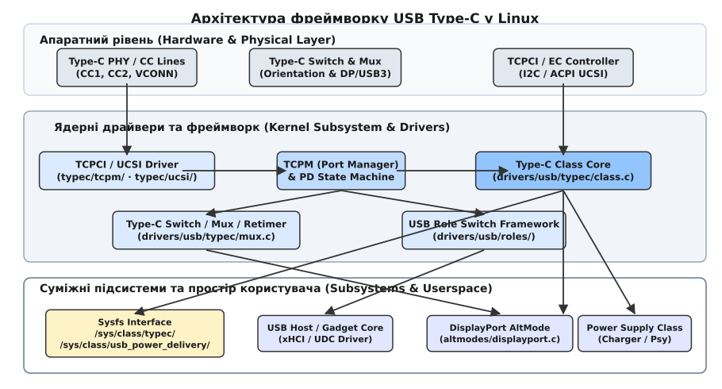
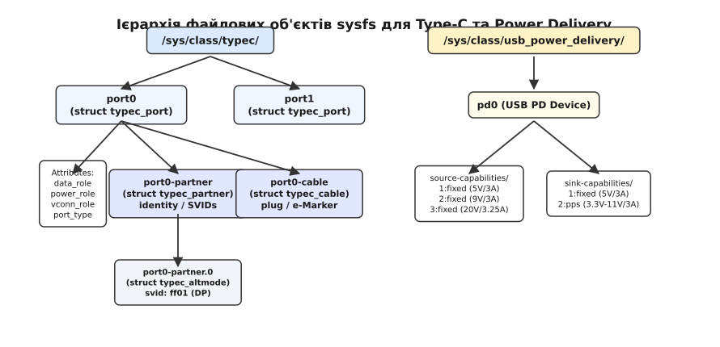
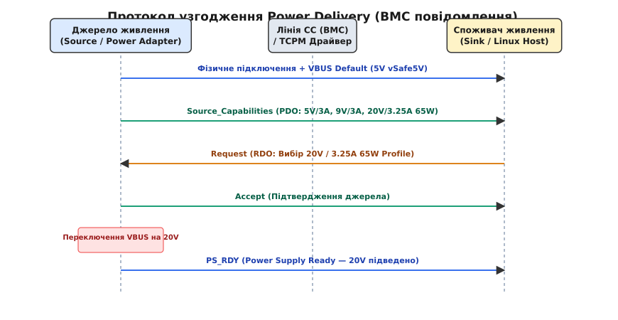
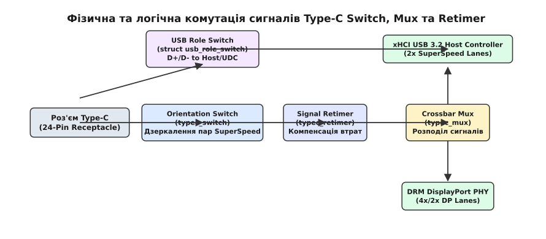

# Фреймворк коннекторів USB Type-C та Power Delivery

<preknowlist>
- [Базова підсистема USB у Linux](root:sys-unix/usbcore-enumeration-and-urb) — концепція USB-контролерів, шин, хостів, пристроїв та драйверів.
- [Опис апаратури через Device Tree](root:sys-unix/device-tree) — вузли пристроїв, дочірні деталі connector та зв'язки port/endpoint.
- [Таблиці ACPI та простір імен](root:sys-unix/acpi-tables-and-namespace) — принципи опису обладнання в ACPI (для платформ x86/UCSI).
</preknowlist>

Сучасний ноутбук підключається до док-станції одним-єдиним кабелем USB Type-C: через цей кабель ноутбук отримує живлення потужністю 65 Вт для заряджання акумулятора (Power Delivery Sink), одночасно виступає хостом для клавіатури й миші, підключених до док-станції (USB Data Host), та передає відеопотік 4K на зовнішній монітор (DisplayPort Alternate Mode). Якщо користувач витягне штекер і вставить його, перевернувши на 180 градусів, відеосигнал не зникає, а живлення не вимикається. Проте для операційної системи за цією зовнішньою простотою ховається плутанина: кабель фізично симетричний, але лінії SuperSpeed усередині асиметричні; роль живлення може відрізнятися від ролі даних, а високошвидкісні лінії шини перемикаються між різними контролерами (xHCI, DRM, Thunderbolt).

Для координації цієї апаратної матриці у ядрі Linux протягом 2017 року (серія 4.1x) з'явилася підсистема **USB Type-C Connector Class Framework** (`drivers/usb/typec/`). Вона надає єдиний об'єктний шар для управління роз'ємами, контролю за узгодженням Power Delivery, комутації мультиплексорів та експорту стану порта у простір користувача.

## Архітектурні виклики Type-C та модель підсистеми

У класичних стандартах USB Type-A та Type-B кожна вилка мала фіксовану роль. Комп'ютер завжди виступав джерелом живлення +5 В та хостом (DFP), а принтер чи флешка — споживачем живлення та периферією (UFP). Роз'єм USB Type-C скасував апаратну жорсткість: 24-контактне гніздо містить дві незалежні лінії конфігурації (CC1 та CC2), дві пари класичних сигналів D+/D-, чотири високошвидкісні диференційні пари SuperSpeed (TX1/RX1, TX2/RX2) та пару службових ліній SBU. Окремого контакту VCONN у гнізді немає: живлення для мікросхеми всередині кабелю (e-Marker) подається на ту з ліній CC, яка не стала активною.


*Архітектура підсистеми Type-C у Linux: зв'язок між апаратними PHY/контролерами (TCPCI/UCSI), менеджером портів TCPM, ядрами USB/DRM та прозорим представленням у sysfs.*

Фізичне підключення кабелю Type-C запускає каскад аналогових та цифрових розпізнавань:
1. **Аналогова детекція орієнтації:** Порт джерела подає підтягуючі резистори Rp на лінії CC1/CC2, а порт споживача стягує ці лінії до землі (GND) резисторами Rd. Та лінія, де напруга падає до проміжного значення (наприклад, 1.6 В або 0.9 В), є активною лінією CC, а друга лінія стає лінією живлення кабелю VCONN.
2. **Визначення початкової потужності:** За значенням напруги на лінії CC споживач визначає доступний струм джерела ще до запуску цифрового протоколу: `Default USB` (500 мА / 900 мА), `1.5 A` або `3.0 A` при 5 В.
3. **Активація цифрового протоколу PD:** Якщо обидва пристрої підтримують Power Delivery, на активній лінії CC вмикається фазоімпульсний трансівер BMC (Biphase Mark Coding) зі швидкістю передавання 300 кбіт/с.

Підсистема ядра Linux розбиває управління цим складним вузлом на три незалежні рівні:
1. **Рівень коннектора (Connector Class Core):** Центральний об'єктний шар (`drivers/usb/typec/class.c`), який створює об'єкти портів, партнерів, кабелів та підтримує їхній життєвий цикл у sysfs.
2. **Рівень менеджера порту (TCPM / UCSI):** Скінченний автомат станів (State Machine), який приймає рішення про підключення, від'єднання, узгодження напруги та перемикання ролей.
3. **Рівень комутації сигналів (Class Mux / Switch / Retimer):** Драйвери фізичних мультиплексорів, які фізично переключають лінії SuperSpeed залежно від орієнтації штекера та активного альтернативного режиму.

Детальний аналіз еволюції стандарту від класичного USB OTG до Type-C та передумов створення фреймворку в ядрі Linux винесено у вставку [історія еволюції USB Type-C та Power Delivery](root:sys-unix/usb-type-c-connector-class-framework/hist-typec-pd-evolution.md).

## Абстракції ядра: порти, партнери, кабелі та режими

Серцем Connector Class є чотири базові ядерні абстракції, кожна з яких описується відповідною структурою у пам'яті ядра:

### 1. Фізичний порт (`struct typec_port`)
Представляє фізичне гніздо Type-C на платі пристрою. При реєстрації порту драйвер вказує його базові можливості:
- **Роль даних (Data Role):** `host` (DFP), `device` (UFP) або `dual` (DRD — Dual-Role Data).
- **Роль живлення (Power Role):** `source` (видає напругу), `sink` (споживає напругу) або `dual` (DRP — Dual-Role Power).
- **Роль VCONN (VCONN Role):** `source` або `sink` (хто живить е-Маркер кабелю).

Драйвер описує порт структурою `struct typec_capability` та викликає `typec_register_port()`. Повернутий покажчик використовується для оновлення стану пристрою при виникненні подій переривання.

### 2. Підключений партнер (`struct typec_partner`)
Створюється динамічно функцією `typec_register_partner()`, коли на лініях CC виявлено присутність протилежного пристрою (наприклад, підключено смартфон чи док-станцію). Об'єкт зберігає ідентифікаційні дані партнера (USB-IF Vendor ID, Product ID), інформацію про підтримку Power Delivery та перелік оголошених альтернативних режимів.

### 3. Кабель та штекер (`struct typec_cable` та `struct typec_plug`)
Описує характеристики кабелю, зчитані з його внутрішньої мікросхеми e-Marker через протокол PD (SOP' / SOP''). Кабель повідомляє вихідному порту свій максимальний допустимий струм (3 А чи 5 А), максимальну робочу напругу та підтримку високошвидкісних протоколів (USB4, Thunderbolt 4).

### 4. Альтернативний режим (`struct typec_altmode`)
Реєструє можливість перемикання ліній роз'єму під сторонні протоколи. Кожен режим ідентифікується 16-бітним кодом SVID (Standard / Vendor ID). Найважливіші стандартизовані SVID:
- `0xFF01` — DisplayPort Alternate Mode (SVID організації VESA; у ядрі — `USB_TYPEC_DP_SID`);
- `0x8087` — Thunderbolt 3 / USB4 (SVID Intel; у ядрі — `USB_TYPEC_TBT_SID`).

При активації альтернативного режиму драйвер `altmodes/displayport.c` або `altmodes/thunderbolt.c` викликає функцію `typec_altmode_update_active()`, що змушує крос-мультиплексор переключити фізичні лінії.

## sysfs-ієрархія та інтерфейси простору користувача

Фреймворк експортує повне дерево об'єктів у системну директорію `/sys/class/typec/`. Простір користувача (`udev`-правила, демони живлення на зразок UPower або Android Hardware Abstraction Layer) використовує цей інтерфейс для моніторингу стану та ініціювання змін ролей.


*Дерево sysfs-атрибутів: розділення на порти Type-C (`/sys/class/typec/portX/`) та абстракцію узгоджених профілів Power Delivery (`/sys/class/usb_power_delivery/pdX/`).*

Кожен порт `portX` містить псевдофайли атрибутів:
- `data_role`: Відображає `host` або `device`. Запис значення `host` у цей файл надсилає в ядро запит на Data Role Swap (`DR_Swap`).
- `power_role`: Відображає `source` або `sink`. Запис викликає процедуру Power Role Swap (`PR_Swap`).
- `port_type`: Дозволяє динамічно переключити пристрій із дворольового режиму (`dual`) у фіксований режим джерела (`source`) чи споживача (`sink`).

Починаючи з ядра Linux 6.0, профілі Power Delivery винесені у сусідній підклас `/sys/class/usb_power_delivery/pdX/`. У ньому зберігаються директорії `source-capabilities` та `sink-capabilities`, де кожен об'єкт PDO (Power Data Object) показує доступні рівні напруги (5 В, 9 В, 15 В, 20 В, PPS) та обмеження струму.

Вичерпний довідник ядерних структур `struct typec_capability`, `struct typec_operations` та всіх системних атрибутів sysfs зібрано у вставці [довідник структур та sysfs-інтерфейсів Type-C](root:sys-unix/usb-type-c-connector-class-framework/api-typec-kernel-sysfs.md).

## Протокол Power Delivery та узгодження контракту

Звичайне підключення Type-C надає базове живлення 5 В із струмом 500 мА, 900 мА, 1.5 А або 3.0 А (рівень струму джерело оголошує номіналом підтягувального резистора Rp). Для отримання вищої напруги (наприклад, 20 В для заряджання ноутбука) запускається цифровий протокол **USB Power Delivery (USB PD)**.


*Послідовність узгодження контракту PD: від фізичного підключення на напрузі 5 В до обміну пакетами Source_Capabilities / Request / Accept та виходу на 20 В.*

Процес узгодження контракту живлення відбувається за наступним алгоритмом:
1. **Визначення підключення:** Порт джерела (Source) подає на лінію VBUS початкову напругу `vSafe5V` (5 В).
2. **Передача можливостей (Source Capabilities):** Джерело надсилає через лінію CC серію BMC-пакетів `Source_Capabilities`, які містять список об'єктів PDO (наприклад, 5 В / 3 А, 9 В / 3 А, 20 В / 3.25 А).
3. **Запит споживача (Request RDO):** Споживач (Sink) аналізує список PDO, обирає оптимальний профіль (наприклад, 20 В / 3.25 А) та надсилає у відповідь пакет `Request` із зазначенням вибраного індексу та бажаного струму (Request Data Object).
4. **Підтвердження (Accept & PS_RDY):** Джерело відповідає пакетом `Accept`, перемикає свій внутрішній DC-DC перетворювач на напругу 20 В і після стабілізації надсилає сигнал `PS_RDY` (Power Supply Ready). Тільки після цього споживач відкриває свої вхідні силові ключі для підвищеної напруги.

Якщо під час роботи ноутбук потребує змінити напрямок струму (наприклад, до ноутбука підключили зовнішній павербанк і користувач хоче заряджати павербанк від ноутбука), ядро надсилає пакет `PR_Swap` (Power Role Swap), який безпечно реверсує ролі без розриву з'єднання даних.

## Апаратні реалізації: TCPM, TCPCI та UCSI

У реальних системах функціонал Type-C розподіляється між ядром Linux та апаратурою за однією з трьох основних моделей:

```
                  +-----------------------------------+
                  |           Ядро Linux              |
                  +-----------------------------------+
                    /               |               \
                   /                |                \
  (I2C / GPIO)    /     (ACPI / EC) |                 \ (I2C State Watch)
                 v                  v                  v
        +----------------+  +---------------+  +-------------------+
        |  TCPM + TCPCI  |  |  UCSI Driver  |  | Standalone PMIC   |
        |  (ARM / Embedded)| | (xHCI Laptop) |  | (TPS6598x / Docks) |
        +----------------+  +---------------+  +-------------------+
```

1. **Модель TCPM + TCPCI (Софтверний автомат у ядрі):** Застосовується в більшості ARM SoC. Фізична мікросхема (TCPC, наприклад FUSB302) містить лише детектори напруги CC та трансівер BMC. Сам скінченний автомат PD (State Machine) виконується у ядрі Linux драйвером `tcpm.c`.
2. **Модель UCSI (USB Type-C System Software Interface):** Використовується в більшості x86-ноутбуків. Фізичне управління роз'ємом повністю покладено на вбудований контролер платформи (Embedded Controller, EC). Ядро Linux спілкується з прошивкою через стандартизований ACPI-інтерфейс UCSI, надсилаючи виклики методів `_DSM`.
3. **Автономні PMIC (Stand-alone PD Controllers):** Мікросхеми на зразок TI TPS6598x працюють повністю автономно зі власною прошивкою у ПЗУ, а драйвер ядра лише зчитує їхній стан для відображення в sysfs.

Детальний порівняльний аналіз архітектур TCPM, TCPCI та UCSI з діаграмами викликів та обмеженнями реального часу винесено у вставку [апаратні архітектури контролерів USB Type-C: TCPM, TCPCI та UCSI](root:sys-unix/usb-type-c-connector-class-framework/comp-tcpm-tcpci-ucsi.md).

## Фізична та логічна комутація: Mux, Switch та Retimer

Фізичне підключення штекера Type-C створює задачу комбінаторної комутації високошвидкісних ліній на друкованій платі.


*Схема проходження високошвидкісних сигналів: перемикач орієнтації (Switch), компенсатори втрат (Retimers), крос-мультиплексор (Mux) та комутатор USB-ролей (USB Role Switch).*

Ядро Linux управляє цим ланцюгом за допомогою трьох допоміжних фреймворків:
- **`typec_switch`:** Відповідає за компенсацію орієнтації штекера. Якщо кабель вставлено перевернутим, перемикач дзеркально міняє місцями сигнальні пари SuperSpeed TX1/RX1 та TX2/RX2.
- **`typec_mux`:** Переключає високошвидкісні лінії між різними контролерами. У режимі USB 3.2 лінії спрямовуються на контролер xHCI; у режимі DisplayPort Alt Mode 4 лінії переключаються на відеовихід DRM/GPU; у режимі USB4/Thunderbolt усі лінії віддаються контролеру PCIe/Thunderbolt.
- **`typec_retimer`:** Керує мікросхемами-ретаймерами, які відновлюють та підсилюють високочастотний сигнал на довгих провідниках плати при швидкостях 10–40 Гбіт/с.
- **`usb_role_switch` (`drivers/usb/roles/`):** Фізично переключає лінії USB 2.0 (D+/D-) між контролером хоста (xHCI) та контролером пристрою (UDC / Gadget).

## Опис апаратури у Device Tree та ACPI

На вбудованих платформах Linux (ARM64/RISC-V) взаємозв'язок між роз'ємом Type-C, контролером I2C, мультиплексором та графічним виходом описується у Device Tree за допомогою графів `port` / `endpoint`:

```dts
i2c0 {
    #address-cells = <1>;
    #size-cells = <0>;

    tcpc: typec-port-controller@50 {
        compatible = "fairchild,fusb302";
        reg = <0x50>;
        interrupt-parent = <&gpio1>;
        interrupts = <15 IRQ_TYPE_LEVEL_LOW>;

        connector {
            compatible = "usb-c-connector";
            label = "USB-C";
            data-role = "dual";
            power-role = "dual";
            try-power-role = "sink";
            source-pdos = <PDO_FIXED(5000, 3000, PDO_FIXED_DUAL_ROLE)>;
            sink-pdos = <PDO_FIXED(5000, 3000, PDO_FIXED_DUAL_ROLE)
                         PDO_FIXED(9000, 3000, 0)
                         PDO_FIXED(20000, 3250, 0)>;

            ports {
                #address-cells = <1>;
                #size-cells = <0>;

                port@0 {
                    reg = <0>;
                    tcpc_to_usb: endpoint {
                        remote-endpoint = <&dwc3_role_switch>;
                    };
                };

                port@1 {
                    reg = <1>;
                    tcpc_to_dp: endpoint {
                        remote-endpoint = <&dp_out>;
                    };
                };

                port@2 {
                    reg = <2>;
                    tcpc_to_switch: endpoint {
                        remote-endpoint = <&typec_mux_in>;
                    };
                };
            };
        };
    };
};
```

У цій конфігурації вузол `connector` прямо визначає підтримувані профілі живлення PDO, а граф `ports` вказує ядру, куди саме спрямовувати сигнали при зміні ролей даних або активації DisplayPort Alt Mode.

Практичний приклад створення системної утиліти на C та C++ для моніторингу портів та програмного перемикання ролей через sysfs наведено у вставці [практичний проект моніторингу та перемикання ролей USB Type-C](root:sys-unix/usb-type-c-connector-class-framework/proj-typec-role-switcher.md).

> 🔧 **Навіщо це.**
> Фреймворк USB Type-C Connector Class прибирає хаос із різноманітних фірмових викликів та приватних системних драйверів, зводячи складну фізику 24-контактного симетричного роз'єму до єдиної системної моделі. Для системного розробника та інженера вбудованих систем це означає можливість створювати універсальні udev-правила, утиліти управління живленням та автоматичні сценарії перемикання ролей даних і відеовиходу, які однаково надійно працюють як на компактному single-board комп'ютері з ARM SoC, так і на потужному сервері чи x86-ноутбуці.
