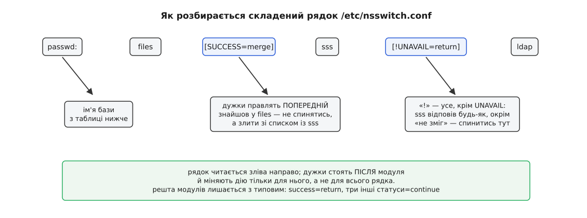

# 📋 nsswitch.conf і getent: перелік баз, синтаксис рядка, перевірка з командного рядка

`/etc/nsswitch.conf` — єдине місце, де записано, кого бібліотека C питатиме про імена, числа, адреси й порти. `getent` — команда, що проходить рівно тим самим шляхом і друкує те, що дістала б програма. Нижче зібрано всі бази, які розуміє перемикач, точну граматику правої частини разом із правилами переходу між джерелами, і виклики `getent`, якими це налаштування перевіряють, не пишучи ні рядка коду.

## Граматика рядка

Файл читають порядково. Ліворуч від двокрапки — ім'я бази, праворуч — послідовність слів, розділених пробілами: імена джерел і, за бажанням, блоки реакцій у квадратних дужках. Решта рядка після `#` — коментар.

```
рядок    ::= <база> ":" { <джерело> | "[" <реакція> { <реакція> } "]" }
реакція  ::= [ "!" ] <статус> "=" <дія>
статус   ::= success | notfound | unavail | tryagain
дія      ::= return | continue | merge

passwd:  files [SUCCESS=merge] sss [!UNAVAIL=return] ldap
```

Три правила, без яких цей рядок читають неправильно.

Перше: **блок дужок стосується джерела перед ним**, а не всього рядка й не наступного джерела. `files [SUCCESS=merge] sss` каже: коли відповість `files`, не спинятись, а долучити ще й відповідь `sss`.

Друге: **знак оклику перевертає умову** — `[!UNAVAIL=return]` означає «на будь-який статус, окрім `UNAVAIL`, спинитись тут». Це звичний спосіб сказати «далі йдемо тільки тоді, коли це джерело взагалі не відповіло».

Третє: джерел у рядку може бути скільки завгодно, і порядок слів — це порядок опитування. Реакції, яких ви не вказали, лишаються типовими.



*Дужки правлять поведінку попереднього модуля; решта рядка лишається з типовими реакціями.*

| статус | що він означає | типова дія |
|---|---|---|
| `success` | джерело віддало запис | `return` — спинитись і віддати |
| `notfound` | джерело відповіло: такого запису нема | `continue` — питати наступне |
| `unavail` | джерело недоступне: модуля нема, сервер мовчить | `continue` |
| `tryagain` | тимчасова відмова: зайнято, замало буфера | `continue` |

Дія `merge` стоїть окремо від двох інших і має вужчі межі, ніж здається з вигляду. Її додали в glibc 2.24, вона законна **тільки в парі `SUCCESS=merge`**, і реалізована вона **лише для бази `group`** — для будь-якої іншої бібліотека поверне `EINVAL`. Зливаються не будь-які записи, а лише такі, у яких збігаються **і назва групи, і GID**: до першого запису дописуються учасники з другого. Перебір усіх груп (`getgrent()`) злиття не робить, а однакові учасники, що трапилися в обох джерелах, у списку лишаться двічі.

Ще одна дрібниця з практичними наслідками: від glibc 2.33 файл **перечитується, коли змінився**, — довгоживучому демонові вже не потрібен перезапуск, щоб побачити нову конфігурацію. Перечитується саме конфігурація; сам модуль, раз завантажений у процес, лишається в ньому назавжди. Звідси вимога до того, хто цей файл править: запис має бути атомарним (написати поруч і перейменувати), інакше чужий процес устигне прочитати половину файлу.

## Бази, які розуміє перемикач

| база | що перекладає | звідки її питають |
|---|---|---|
| `passwd` | ім'я ↔ UID, GECOS, домашній каталог, оболонка | `getpwnam()`, `getpwuid()`, `getpwent()` |
| `group` | назва ↔ GID і список учасників | `getgrnam()`, `getgrgid()` |
| `shadow` | хеш пароля й терміни його життя | `getspnam()` |
| `gshadow` | пароль групи й її адміністратори | `getsgnam()` |
| `initgroups` | усі додаткові групи однієї людини | `getgrouplist()`, `initgroups()` |
| `hosts` | ім'я машини ↔ IP-адреса | `gethostbyname2()`, частково `getaddrinfo()` |
| `networks` | назва мережі ↔ її номер | `getnetbyname()` |
| `services` | назва служби ↔ порт і протокол | `getservbyname()`, `getservbyport()` |
| `protocols` | назва протоколу ↔ його номер | `getprotobyname()` |
| `rpc` | назва програми RPC ↔ її номер | `getrpcbyname()` |
| `ethers` | апаратна адреса ↔ ім'я машини | `ether_hostton()`, `ether_ntohost()` |
| `netgroup` | іменовані трійки «машина, користувач, домен» | `setnetgrent()`, `innetgr()` |
| `aliases` | поштові псевдоніми | `getaliasbyname()`, поштові служби |
| `publickey` | ключі Secure RPC | `getpublickey()` |
| `passwd_compat`<br>`group_compat`<br>`shadow_compat` | звідки джерело `compat` бере дописані записи | не питають напряму |

Дві бази в цій таблиці варті окремого слова.

`initgroups` — єдина, чия відсутність міняє поведінку, а не вимикає її. Немає такого рядка — перемикач бере рядок `group`, але **навмисно нехтує зупинкою на успіху** й опитує всі джерела поспіль, збираючи групи звідусіль. Допишіть рядок `initgroups:` явно — і дії почнуть виконуватися буквально: перше ж джерело, яке щось знайшло, обірве пошук. Саме так найчастіше й губляться локальні групи в людини, чий обліковий запис приїхав із каталогу: рядок додали «для порядку», і тепер `files` спиняє опитування ще до того, як спитають каталог.

`hosts` показує, що перемикач — механізм не про облікові записи, а про будь-який переклад імені. З ним лише одна незручність: сучасне розв'язання імені машини йде через `getaddrinfo()`, у якого поверх цього рядка є ще й власні правила впорядкування адрес — [шлях розв'язання імені](topic:sys-unix/name-resolution-path) розбирають окремо саме через це.

## Чого в файлі немає

Відсутній рядок — це не порожній список джерел, а мовчазне значення за домовленістю. Ті самі значення діють і тоді, коли самого файлу нема на місці.

| рядка нема | що візьме перемикач |
|---|---|
| `shadow:` | усе з рядка `passwd:` |
| `gshadow:` | усе з рядка `group:` |
| `initgroups:` | рядок `group:`, але без зупинки на першому успіху |
| `passwd:`, `group:` | `compat [NOTFOUND=return] files` |
| `hosts:`, `networks:` | `files dns` |

Сам цей типовий рядок — найкращий приклад другого за вживаністю блока реакцій. `[NOTFOUND=return]` після джерела означає «як воно відповіло „такого нема“ — вір і не питай далі»; до `files` черга дійде лише тоді, коли `compat` узагалі не зміг відповісти.

А перший рядок таблиці варто прочитати двічі. Дописали мережеве джерело в `passwd:` і не завели рядка `shadow:` — і запити по хешах паролів мовчки підуть туди ж. Зазвичай цього не хочуть: перевірку пароля мережевому джерелу віддають не через NSS, а окремим модулем у [стеку PAM](topic:sys-unix/pam-stack), тож `shadow: files` пишуть явно, навіть коли рядок виглядає зайвим.

## Імена джерел

Списку дозволених джерел не існує: слово з рядка підставляють у шаблон `libnss_<джерело>.so.2`, і [динамічний завантажувач](topic:sys-unix/dynamic-loader) шукає такий спільний об'єкт звичайним чином. Число `2` — версія інтерфейсу модуля (`1` була в glibc 2.0). Помилилися в слові — дістанете не повідомлення про хибну конфігурацію, а тихий статус `UNAVAIL` від неіснуючого модуля.

| джерело | що це |
|---|---|
| `files` | текстові файли в `/etc` |
| `compat` | те саме, плюс рядки `+ім'я`, `-ім'я`, `+@мережева-група` |
| `db` | ті самі файли, зібрані в індекс `makedb` (швидко на великих) |
| `systemd` | динамічні користувачі служб і записи з `/etc/userdb`, `/run/userdb` |
| `sss` | демон SSSD: власний кеш, а за ним мережевий каталог |
| `ldap` | пряме звертання до [каталогу LDAP](topic:sys-unix/ldap-directory) без кешу |
| `winbind` | облікові записи з домену через Samba |
| `dns`, `resolve`, `mdns4_minimal` | джерела для рядка `hosts` |
| `myhostname`, `mymachines` | власне ім'я машини й контейнери, які веде systemd |
| `nis`, `nisplus` | спадок NIS; із glibc їх прибрали у версії 2.32 |

Джерело `compat` — це `files` із додатковою здатністю: у `/etc/passwd` воно розуміє рядки-вказівки «дотягнути сюди ще й тих». Звідки саме тягнути, каже псевдобаза: типово `nis`, а перевизначається рядком `passwd_compat:`.

## getent: те саме питання з командного рядка

```
getent [ПАРАМЕТР…] <база> [<ключ>…]
```

Без ключа команда **перелічує** базу цілком, з ключем — шукає один запис. Ключ подають у тій формі, у якій його розуміє відповідна функція: для `passwd` це або ім'я, або UID, для `services` — назва або номер порту.

| параметр | дія |
|---|---|
| `-s <джерело>` | замінити джерела **всіх** баз на вказане, обійшовши `nsswitch.conf` |
| `-s <база>:<джерело>` | те саме, але лише для однієї бази |
| `-i` | не кодувати міжнародні доменні імена в `ahosts` |

Крім баз перемикача, `getent` знає три власні імені — `ahosts`, `ahostsv4`, `ahostsv6`. Вони питають не рядок `hosts` напряму, а `getaddrinfo()`, тобто повний сучасний шлях із родинами адрес і їхнім упорядкуванням. Різниця не косметична: `getent hosts` і `getent ahosts` на тій самій машині цілком законно дають різні відповіді.

```sh
getent passwd andrij            # запис за іменем
getent passwd 1000              # той самий запис за числом
getent group dialout            # хто в групі
getent initgroups andrij        # усі GID людини одним рядком
getent shadow andrij            # лише від root — інакше порожньо
getent -s files passwd root     # спитати ТІЛЬКИ файли, обійшовши каталог
getent -s sss passwd andrij     # і ТІЛЬКИ каталог — порівняти відповіді
getent ahosts example.com       # повний шлях розв'язання імені машини
```

Два рядки з `-s` — головна причина, заради якої цю команду згадують у розборах несправностей. Коли `id` показує не ті групи, питання завжди одне: яке джерело відповіло. Пара викликів із `-s` відповідає на нього за секунду, без здогадів про порядок слів у файлі.

[Код виходу](topic:sys-unix/exit-status) тут теж є інтерфейсом, і в скрипті його варто розрізняти.

| код | що означає |
|---|---|
| `0` | знайшов (або успішно перелічив) |
| `1` | бракує аргументів або база невідома |
| `2` | жодного з наведених ключів у базі нема |
| `3` | ця база не вміє перелічувати себе без ключа |

```sh
if getent passwd "$user" >/dev/null; then
    echo "запис є"
else
    case $? in
        2) echo "запису нема — АБО джерело не відповіло" ;;
        1) echo "невідома база чи бракує аргументів" ;;
        3) echo "перебір цієї бази не підтримано" ;;
    esac
fi
```

Коментар у другому рядку `case` — не обережність, а точний опис поведінки. `getent` користується класичними функціями (`getpwnam()` і подібними), а ті повертають просто `NULL`; звідки цей `NULL` узявся — з відповіді «такого нема» чи з мовчання сервера — команді вже не видно, і обидва випадки стають кодом `2`. Тобто саме те розрізнення, заради якого в перемикачі заведено чотири статуси, на межі командного рядка **зникає**. Скрипт, який на код `2` заводить обліковий запис наново або відмовляє людині в доступі, у момент недоступності каталогу зробить це для всіх одразу.

Двох речей від цієї команди чекати не варто. Перебір без ключа чесний лише для локальних файлів: мережеве джерело зазвичай або відмовляється перелічувати себе (SSSD типово має `enumerate = false`), або віддає обрізаний список — тож порожній вивід `getent passwd` не означає порожньої бази. І `getent` не є ні окремим каналом до джерел, ні способом обійти кеш: це звичайний процес, який тим самим `dlopen()` тягне ті самі модулі й бачить рівно те, що бачила б ваша програма — включно з тим, що вже лежить у кеші.
