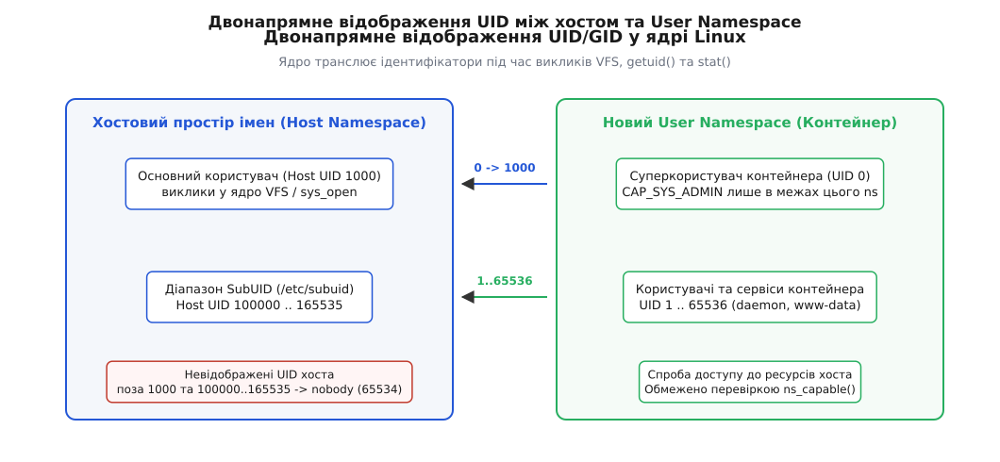
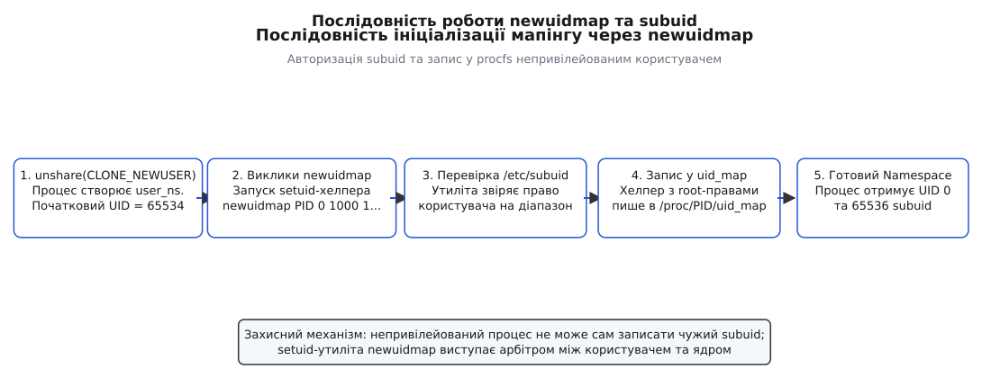
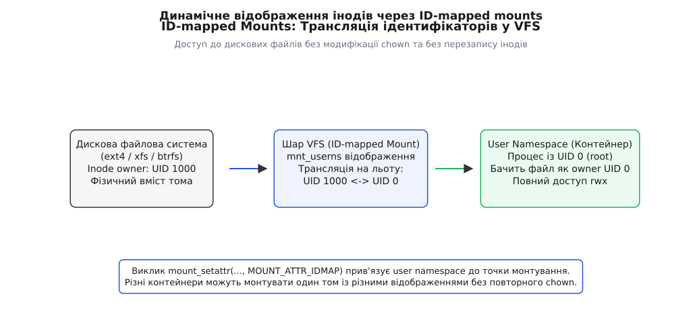

# Юзер-простори імен (User Namespaces)

<preknowlist>
- [Простори імен (Namespaces)](topic:sys-unix/namespaces) — як ядро Linux ізолює системні ресурси (PID, мережа, монтування).
- [Ідентифікатори користувачів і груп](topic:sys-unix/process-credential-checks-and-transitions) — структура `struct cred`, реальний, ефективний, збережений UID/GID та набори привілеїв.
- [Права доступу на класичних бітах](topic:sys-unix/permission-bits) — механізми перевірки прав VFS під час роботи з інодами.
</preknowlist>

До появи просторів імен користувачів (User Namespaces) створення будь-якого ізольованого контейнера в Linux вимагало справжніх прав суперкористувача (`root` з UID 0) на фізичному хості. Усі перші механізми ізоляції — `chroot` (`CAP_SYS_CHROOT`), cgroups та початкові простори імен PID, NET, MNT (`CAP_SYS_ADMIN`) — вимагали привілеїв, які має лише адміністратор: без них не налаштувати мережевий інтерфейс, не зібрати таблицю маршрутизації, не змонтувати файлову систему. Якщо додаток всередині такого контейнера знаходив вразливість у ядрі або сервісі та здійснював втечу з контейнера (container breakout), він опинявся на хості з абсолютними привілеями адміністратора фізичного сервера, отримуючи повний контроль над усіма дисками, пам'яттю та мережевими картами.

User Namespaces розв'язали цю фундаментальну проблему безпеки, створивши абстракцію локальних ідентифікаторів користувачів (UID) та груп (GID). Вони повністю розірвали зв'язок між привілеями всередині ізольованого середовища та привілеями у глобальному контексті ядра. Звичайний непривілейований користувач хоста (наприклад, із UID 1000) отримує можливість стати суперкористувачем (UID 0) усередині власного простору імен, володіти повним набором capabilities для цього простору, але з погляду хостового ядра залишатися обмеженим звичайним обліковим записом. Це механізм, що зробив можливими **rootless** контейнери (Podman, unprivileged Docker, LXC) та ізольовані пісочниці сучасних веб-браузерів.

## Створення та ізоляція привілеїв

Створення нового user namespace виконується за допомогою системних викликів `clone(2)` або `unshare(2)` із прапорцем `CLONE_NEWUSER`. На відміну від усіх інших типів просторів імен (мережевого, процесів, точки монтування, IPC, UTS), створення User Namespace **не вимагає жодних початкових привілеїв** на хості. Будь-який непривілейований процес може викликати `unshare(CLONE_NEWUSER)`.

```
                  [ Root User Namespace (Host) ]
                  /                            \
      (unshare CLONE_NEWUSER)        (unshare CLONE_NEWUSER)
               /                                  \
  [ User Namespace A ]                      [ User Namespace B ]
  - Child UID 0                             - Child UID 0
  - Host UID 1000                           - Host UID 1001
  - Scoped Capabilities                     - Scoped Capabilities
```

Кожен простір імен користувачів утворює ієрархічне дерево, де кожен новий простір має вказівник на свій батьківський простір (`parent`). Ядро описує цю структуру за допомогою об'єкта `struct user_namespace`. Кожен простір імен володіє власником (`owner_uid`), вказівником на творця (`creator_cred`) та лічильником посилань (`count`). 

Під час виклику `unshare(CLONE_NEWUSER)` ядро виділяє новий об'єкт `struct user_namespace`, копіює поточні креденшелі процесу та формує нову структуру `struct cred`. При цьому набори `cap_permitted`, `cap_effective` та `cap_bounding` повністю заповнюються одиницями у новому просторі, а `cap_inheritable` й `cap_ambient` ядро, навпаки, очищає. Зміна привілеїв фіксується внутрішньою функцією ядра `commit_creds()`.

Головний принцип ізоляції полягає у розмежуванні сфер дії привілеїв (capability scoping). Коли процес виконує `unshare(CLONE_NEWUSER)`, ядро створює нову структуру `struct cred` для цього процесу та надає йому **повний набір можливостей** (`CAP_SYS_ADMIN`, `CAP_NET_ADMIN`, `CAP_DAC_OVERRIDE`, `CAP_SETUID` тощо) — але **виключно щодо нового простору імен**.

Ядро Linux суворо розділяє дві внутрішні функції перевірки привілеїв:
1. `capable(cap)` — перевіряє, чи має процес привілей `cap` у початковому (глобальному) user namespace хоста.
2. `ns_capable(ns, cap)` — перевіряє, чи має процес привілей `cap` у конкретному просторі імен `ns` (або в одному з його батьківських просторів).

Якщо процес у новому user namespace намагається змінити мережеві налаштування (наприклад, підняти віртуальний інтерфейс `veth`), ядро перевіряє `ns_capable(net->user_ns, CAP_NET_ADMIN)`. Оскільки мережевий простір належить цьому ж user namespace, перевірка проходить успішно. Проте якщо той самий процес спробує завантажити модуль ядра (`sys_init_module`), ядро виконає перевірку `capable(CAP_SYS_MODULE)` у глобальному контексті хоста, яка миттєво завершиться помилкою `EPERM`.

Важливо зазначити, що володіння простором імен є транзитивним щодо інших namespaces. Якщо процес створює user namespace, а потім усередині нього створює новий мережевий простір (`CLONE_NEWNET`) або простір монтування (`CLONE_NEWNS`), новий простір виділяється з атрибутом `user_ns`, що вказує на поточний user namespace процесу. Це дає процесу повний контроль над цими дочірніми ресурсами без надання доступу до ресурсів хоста.

Детальніше про п'ятирічну боротьбу розробників ядра за безпечне переписання перевірок привілеїв розказано в [історії створення та суперечок щодо User Namespaces](topic:sys-unix/user-namespaces-uid-mapping/hist-rootless-and-userns.md).

## Двонапрямне відображення ідентифікаторів (UID/GID Mapping)

Одразу після створення нового простору імен процес опиняється у стані "безпритульного": його внутрішній UID ще не пов'язаний із жодним хостовим ідентифікатором. Доки мапінг не налаштовано, всі виклики `getuid()` повертають фіктивне значення `65534` (відоме як `overflowuid` або `nobody`), а будь-які спроби створити файл чи звернутися до ресурсів відхиляються ядром із помилкою доступу.

Правила відображення задаються за допомогою текстових записів у псевдофайлах `/proc/[pid]/uid_map` та `/proc/[pid]/gid_map`.


*Схема двонапрямного відображення ідентифікаторів UID/GID між хостовою системою та User Namespace.*

Кожен рядок мапінгу описує неперервний діапазон ідентифікаторів і складається з трьох чисел:

```text
ID_inside   ID_outside   count
```

Приклад мапінгу у `/proc/[pid]/uid_map`:
```text
0       1000        1
1       100000      65536
```

Ці записи означають:
- `0 1000 1`: Внутрішній UID 0 (root контейнера) відповідає реальному хостовому UID 1000.
- `1 100000 65536`: Внутрішні UID від 1 до 65536 послідовно транслюються на зовнішні хостові UID від 100000 до 165535.

Ядро Linux застосовує цей мапінг в обох напрямках при кожному системному виклику:
- **Пряма трансляція (Inside → Outside)**: Коли процес із контейнера створює файл або надсилає сигнал, ядро бере його внутрішній UID (наприклад, `0`), шукає відповідний екстент у `uid_map` і виконує підсумкову перевірку VFS за допомогою зовнішнього хостового UID (`1000`).
- **Обернена трансляція (Outside → Inside)**: Коли процес виконує `stat(2)` для файла, що належить хостовому UID `100500`, ядро шукає `100500` у мапінгу і повертає внутрішнє значення UID `501` — екстент починається з внутрішньої одиниці, тож 1 + (100500 − 100000). Якщо хостовий UID не входить до жодного екстенту `uid_map`, ядро повертає процесу значення `65534` (`nobody`).

Всередині ядра відображення зберігається у структурі `struct uid_gid_map`. Задля оптимізації гарячих шляхів VFS ядро використовує прямий масив із п'яти екстентів `struct uid_gid_extent` (коли самих екстентів не більше п'яти) або відсортовані масиви для двійкового пошуку `O(log K)` (при кількості екстентів до 340).

Під час перевірки прав доступу до інода підсистема VFS оперує внутрішніми структурами `kuid_t` та `kgid_t`: обгортки `i_uid_read(inode)` та `i_gid_read(inode)` розгортають їх через `from_kuid()`, а та вже кличе `map_id_up()`; зворотний шлях — з числа простору імен у `kuid_t` — робить `make_kuid()` через `map_id_down()`. Простежити трасування цих перевірок у реальному часі можна за допомогою інструменту `bpftrace`, відслідковуючи ядерні точки входу `kprobe:map_id_down` та `kprobe:map_id_up`.

Строгий розбір алгоритмів та математичні формули прямого й оберненого мапінгу викладено у вставці [математична модель відображення та пошук у struct uid_gid_map](topic:sys-unix/user-namespaces-uid-mapping/math-uid-translation.md).

## Авторизація підпорядкованих ідентифікаторів (subuid / subgid)

Право запису у файли `/proc/[pid]/uid_map` та `/proc/[pid]/gid_map` обмежене жорсткими правилами безпеки:

1. **Однократність**: Файли мапінгу можна записати **лише один раз**. Після першого вдалого запису вміст файлу стає незмінним (immutable). Це виключає атаки, де процес міг би динамічно міняти свою ідентичність під час виконання.
2. **Права непривілейованого процесу**: Звичайний непривілейований процес, що створив user namespace, має право записати у `uid_map` **тільки свій власний ефективний UID**. Тобто він може самостійно записати рядок `0 1000 1` (стати root-ом у своєму просторі).

Однак одного лише UID 0 недостатньо для повноцінної контейнеризації. Всередині контейнера працюють сервіси `systemd`, `nginx` чи PostgreSQL, які вимагають системних користувачів на кшталт `www-data`, `systemd-resolve` чи `nobody`; конкретні номери таких UID роздає дистрибутив (у Debian `www-data` — 33, `nobody` — традиційно 65534). Якщо записати лише `0 1000 1`, будь-який виклик `setuid(33)` всередині контейнера завершиться помилкою `EINVAL`, оскільки UID 33 відсутній у мапінгу.

Щоб надати звичайним користувачам доступ до тисяч ізольованих UID без надання їм прав хостового root, у системі використовується механізм **підпорядкованих ідентифікаторів** (subordinate UIDs/GIDs).


*Послідовність кроків ініціалізації підпорядкованих ідентифікаторів у rootless-контейнерах за допомогою newuidmap.*

Системний адміністратор виділяє кожному користувачеві персональний блок "віртуальних" UID у файлах `/etc/subuid` та `/etc/subgid`:

```text
# Формат: username:start_id:count
alice:100000:65536
bob:165536:65536
```

Оскільки ядро не дозволяє процесу `bob` самостійно записати діапазон `165536..231071` у `/proc/PID/uid_map`, використовуються привілейовані системні утиліти `newuidmap` та `newgidmap`, що мають встановлений біт `setuid` (`owner root`).

Процес ініціалізації rootless контейнера відбувається за такою послідовністю:
1. Непривілейований процес `bob` викликає `unshare(CLONE_NEWUSER)` і призупиняє своє виконання (через `pipe`).
2. Дочірній або допоміжний процес запускає утиліту `newuidmap <PID> 0 1000 1 1 165536 65536`.
3. Утиліта `newuidmap` читає реальний UID викликаючого процесу (`getuid()`), відкриває `/etc/subuid` і перевіряє, чи дійсно користувачеві `bob` виділено діапазон з початком `165536` та довжиною `65536`.
4. Якщо перевірка успішна, `newuidmap` від імені хостового `root` записує масовий мапінг у `/proc/<PID>/uid_map`.

Сучасні дистрибутиви виділяють діапазони підпорядкованих ідентифікаторів автоматично — під час створення облікового запису: `useradd` бере наступний вільний блок за параметрами `SUB_UID_MIN`, `SUB_UID_MAX` і `SUB_UID_COUNT` із `/etc/login.defs` і дописує рядок у `/etc/subuid`. Для облікових записів, якими керує `systemd-homed`, діапазон зберігається у профілі користувача.

Повний опис структури файлів `procfs` та специфікацію виклику утиліт зібрано у вставці [інтерфейс псевдофайлів procfs та формат subuid](topic:sys-unix/user-namespaces-uid-mapping/api-userns-procfs.md).

## Захисне блокування `setgroups` та атака негативними правами

Під час проєктування безпеки User Namespaces розробники ядра зіткнулися із тонкою вразливістю, пов'язаною з додатковими групами (supplementary groups) та концепцією **негативних прав** (negative permissions).

У стандартній POSIX-моделі файлових прав доступу права можна сформулювати так, що належність до групи позбавляє користувача прав, які мають інші (other). Класичний випадок таких негативних прав — файл із бітами `rwx---r-x`:

```text
-rwx---r-x 1 alice restricted 4096 Aug 12 12:00 /srv/confidential
```

Розберемо ці біти:
- Власник файлу має права `rwx`;
- Група `restricted` має права `---` (абсолютна заборона доступу);
- Усі інші (`other`) мають права `r-x` (дозвіл на читання та виконання).

Якщо користувач `bob` належить до групи `restricted`, VFS під час перевірки прав бачить, що його GID збігається з групою файлу, застосовує права групи (`---`) і відхиляє доступ.

До появи захисту в User Namespaces виникав такий вектор атаки:
1. Користувач `bob` викликає `unshare(CLONE_NEWUSER)`.
2. У новому просторі імен він отримує привілей `CAP_SETGID` щодо цього простору.
3. Користувач здійснює системний виклик `setgroups(0, NULL)`, скидаючи з себе всі додаткові групи (включно з `restricted`).
4. Тепер процес `bob` усередині простору має порожній список груп. Під час доступу до файлу з правами `rwx---r-x` ядро перевіряє групу файлу `restricted` — процес до неї більше не належить! Ядро переходить до перевірки прав `other` (`r-x`) і **дозволяє доступ до захищеного файлу**.

Щоб повністю ліквідувати цей вектор обходу безпеки, у Linux 3.19 було введено обов'язковий файл-запобіжник `/proc/[pid]/setgroups`.

Ядро встановлює непорушне правило: **непривілейований процес не може записати у `/proc/[pid]/gid_map`, доки у файл `/proc/[pid]/setgroups` не буде записано рядок `"deny"`**.

Запис `"deny"` у `/proc/[pid]/setgroups` назавжди забороняє виклик `setgroups(2)` для цього процесу та всіх його дочірніх просторів імен. Таким чином, процес втрачає можливість скинути з себе обмеження негативних груп, що робить створення непривілейованих просторів імен повністю безпечним для хостової файлової системи.

## Файлові системи та революція ID-mapped Mounts

Незважаючи на елегантність відображення UID/GID у пам'яті, довго залишалася фундаментальна проблема: **файли на фізичних дисках**.

Якщо контейнер створює файл, ядро записує на диск його зовнішній хостовий UID (наприклад, `165536`). Якщо той самий образ контейнера або том даних (volume) змонтувати в інший user namespace (де мапінг виділено на діапазон `200000`), усі файли всередині нового контейнера виявляться підпорядкованими ідентифікатору `65534` (`nobody`).


*Архітектура ID-mapped mounts: динамічне перетворення ідентифікаторів володіння файлами на рівні VFS.*

Історично контейнерні рушії вирішували цю проблему двома незадовільними шляхами:
1. Рекурсивне виконання `chown -R` над усім дисковим образом під час запуску (що займало хвилини на великих образах і руйнувало спільне користування шарами: після зміни власника copy-on-write копіював дані замість того, щоб ділити їх між контейнерами).
2. Використання патчів ядра на зразок `shiftfs` (кастомна каскадна файлова система Ubuntu).

У Linux 5.12 розробник Крістіан Браунер (Christian Brauner) реалізував фундаментальне рішення VFS: **ID-mapped Mounts** (системний виклик `mount_setattr(2)` із прапорцем `MOUNT_ATTR_IDMAP`).

ID-mapped mounts дозволяють прив'язати конкретний `struct user_namespace` безпосередньо до **точки монтування** (`struct vfsmount`). 

Механізм працює так:
- Фізичний диск зберігає файли зі стандартними ідентифікаторами (наприклад, UID 1000 або UID 0).
- Під час монтування точки VFS ядро записує у шар монтування атрибут `mnt_userns`.
- Коли процес звертається до інода через цю точку монтування, шар VFS здійснює **динамічну подвійну трансляцію**:
  `UID_inode -> UID_mnt_userns -> UID_process_userns`

Завдяки цьому один і той самий дисковий каталог або підтом можна змонтувати у 10 різних rootless контейнерів із 10 різними subuid діапазонами. Кожен контейнер бачитиме дискові файли як такі, що належать його власному локальному root (UID 0), а фізичні іноди на диску залишатимуться незмінними.

Крім того, коло файлових систем із підтримкою ID-mapped mounts поступово ширшало: у 5.12 це були fat, ext4 та xfs, згодом додалися btrfs, overlayfs і tmpfs — конкретний перелік залежить від версії ядра. Вони дозволяють монтувати базові шари контейнерів у режимі read-only без необхідності копіювання файлів та виконання додаткових операцій із правами доступу.

## Практичне налаштування та програмні виклики

Приклад нижче демонструє створення непривілейованого User Namespace з використанням системних викликів `unshare(2)`, блокуванням `setgroups` та налаштуванням мапінгу ідентифікаторів.

:::tabs
```c
#define _GNU_SOURCE
#include <sched.h>
#include <stdio.h>
#include <stdlib.h>
#include <string.h>
#include <unistd.h>
#include <fcntl.h>
#include <sys/wait.h>

static void write_file(const char *path, const char *text) {
    int fd = open(path, O_WRONLY);
    if (fd < 0) {
        perror("open failed");
        exit(EXIT_FAILURE);
    }
    if (write(fd, text, strlen(text)) != (ssize_t)strlen(text)) {
        perror("write failed");
        close(fd);
        exit(EXIT_FAILURE);
    }
    close(fd);
}

int main(void) {
    uid_t real_uid = getuid();
    gid_t real_gid = getgid();

    // 1. Створюємо новий User Namespace
    if (unshare(CLONE_NEWUSER) < 0) {
        perror("unshare(CLONE_NEWUSER) failed");
        return 1;
    }

    // 2. Блокуємо setgroups перед записом gid_map
    write_file("/proc/self/setgroups", "deny");

    // 3. Записуємо uid_map (відображаємо себе на root UID 0)
    char map_buf[128];
    snprintf(map_buf, sizeof(map_buf), "0 %d 1\n", real_uid);
    write_file("/proc/self/uid_map", map_buf);

    // 4. Записуємо gid_map (відображаємо свою групу на GID 0)
    snprintf(map_buf, sizeof(map_buf), "0 %d 1\n", real_gid);
    write_file("/proc/self/gid_map", map_buf);

    printf("Успішно перейшли у User Namespace:\n");
    printf("  getuid()  = %d\n", getuid());
    printf("  geteuid() = %d\n", geteuid());

    // Перевіряємо привілеї всередині середовища
    system("id");
    return 0;
}
```
```cpp
#include <iostream>
#include <fstream>
#include <string>
#include <format>
#include <system_error>
#include <cerrno>
#include <sched.h>
#include <unistd.h>
#include <sys/wait.h>

namespace sys {

void write_proc_file(const std::string& path, const std::string& content) {
    std::ofstream fs(path);
    if (!fs.is_open()) {
        throw std::system_error(errno, std::generic_category(), "Не вдалося відкрити " + path);
    }
    fs << content;
    if (fs.fail()) {
        throw std::system_error(errno, std::generic_category(), "Помилка запису в " + path);
    }
}

} // namespace sys

int main() {
    try {
        uid_t host_uid = ::getuid();
        gid_t host_gid = ::getgid();

        // 1. Створення ізольованого User Namespace
        if (::unshare(CLONE_NEWUSER) < 0) {
            throw std::system_error(errno, std::generic_category(), "unshare(CLONE_NEWUSER) failed");
        }

        // 2. Блокування setgroups під вимоги безпеки GID
        sys::write_proc_file("/proc/self/setgroups", "deny");

        // 3. Запис прямого мапінгу ідентифікаторів
        sys::write_proc_file("/proc/self/uid_map", std::format("0 {} 1\n", host_uid));
        sys::write_proc_file("/proc/self/gid_map", std::format("0 {} 1\n", host_gid));

        std::cout << "[C++ UserNS] Новий статус ідентичності:\n"
                  << "  UID: " << ::getuid() << " (euid: " << ::geteuid() << ")\n"
                  << "  GID: " << ::getgid() << " (egid: " << ::getegid() << ")\n";

        ::execl("/bin/id", "id", nullptr);

    } catch (const std::exception& e) {
        std::cerr << "Помилка: " << e.what() << "\n";
        return 1;
    }
    return 0;
}
```
:::

Повний приклад із підтримкою міжпроцесної синхронізації `pipe` та міжпроцесного мапінгу розібрано у вставці [практичний приклад низькорівневого налаштування](topic:sys-unix/user-namespaces-uid-mapping/proj-uid-mapping-helper.md).

## Поверхня атак, Kernel Hardening та вартість ізоляції

Дозволяючи непривілейованим користувачам створювати User Namespaces, ядро відкриває для них величезну поверхню коду ядра, яка раніше була доступна лише справжньому `root`.

Коли непривілейований процес виконує `unshare(CLONE_NEWUSER | CLONE_NEWNET)`, він отримує `CAP_NET_ADMIN` у новому мережевому просторі. Це дає йому можливість взаємодіяти зі складними драйверами мережевих протоколів (Netfilter, `AF_PACKET`, `ip_tables`, eBPF socket filters, DCCP, SCTP), код яких історично писався з розрахунком на те, що його викликає довірений адміністратор системи.

Це призвело до цілої серії критичних вразливостей локального підвищення привілеїв (LPE):
- `CVE-2016-8655`: гонка й використання пам'яті після звільнення (use-after-free) у `packet_set_ring()` підсистеми `AF_PACKET`; потрібний для атаки `CAP_NET_RAW` непривілейований користувач діставав саме через user namespace.
- `CVE-2022-0492`: Обхід обмежень cgroups v1 через маніпулювання викликом `release_agent` непривілейованим root-ом у user namespace.
- `CVE-2023-3269` (*StackRot*): Вразливість у менеджері віртуальної пам'яті (VMA tree handling), експлуатація якої полегшувалася завдяки доступу до user namespaces.

Для зміцнення захисту (hardening) дистрибутиви та системні адміністратори застосовують наступні механізми обмеження:

1. **Заборона непривілейованих userns через sysctl**:
   У Debian та Arch тривалий час використовувався патч ядра:
   `sysctl -w kernel.unprivileged_userns_clone=0`
   Це повністю вимикає можливість виклику `unshare(CLONE_NEWUSER)` для непривілейованих процесів. RHEL того самого досягав штатним лімітом `user.max_user_namespaces=0`.

2. **Обмеження через AppArmor (Ubuntu 24.04+)**:
   Сучасне ядро Ubuntu використовує обмежувальні профілі AppArmor (`kernel.apparmor_restrict_unprivileged_userns=1`). Непривілейований запуск userns дозволяється тільки тим двійковим файлам, які мають явний профіль AppArmor (наприклад, Podman, Chrome, Bubblewrap).

3. **Ліміт на кількість просторів імен**:
   Захист від DoS-атак через вичерпання пам'яті ядра здійснюється через обмеження максимальної кількості просторів у `/proc/sys/user/max_user_namespaces`.

Обчислювальна вартість ізоляції User Namespaces є мінімальною: трансляція UID/GID додає лише кілька інструкцій порівняння у гарячих шляхах системних викликів VFS. Основні витрати пам'яті пов'язані з виділенням ядерних структур `struct user_namespace` та `struct cred` — це порядок кількох кілобайтів на простір імен, тож технологія лишається придатною для масового розміщення контейнерів.

## Підсумок

User Namespaces змінили парадигму безпеки в операційній системі Linux. Дозволивши ізолювати привілеї та відображати ідентифікатори користувачів через двонапрямні мапінги `uid_map`/`gid_map` та захисний механізм `setgroups`, ядро надало можливість створювати повністю автономні **rootless** середовища. Поєднання з технологією ID-mapped mounts остаточно усунуло накладні витрати на рівні файлових систем, закріпивши User Namespaces як фундаментальну основу сучасної контейнеризації та пісочниць безпеки.
