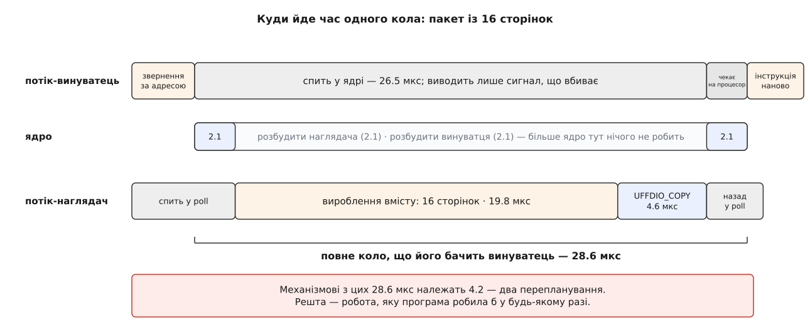

# ⚙️ Ділянка, яку заповнює сама програма

Ця програма відображає 256 МіБ анонімної пам'яті, у якій немає жодного байта, і читає з неї сторінки — а вміст кожної породжує сама, у ту мить, коли до сторінки вперше дотягнулися. Вона друкує, скільки коштує одне таке коло і з чого саме та вартість складається; далі розібрано пастки, на яких така програма ламається, — від наглядача, що заблокував сам себе, до нулів, які тихо стають на місце даних.

## Що саме будуємо

Хай є 256 МіБ даних, у яких кожен байт можна обчислити з номера сторінки. Це навмисне спрощення: у переносника віртуальної машини на цьому місці стоїть запит у мережу, у відновлювача з контрольної точки — читання зі стисненого образу, у розрідженого масиву — свій генератор. Механізмові байдуже, що там стоїть: він знає мить збою, а джерело — справа програми. Отже, від бойового переносника наша програма відрізняється рівно однією функцією.

Умова, заради якої все й затівається, — одна: **ділянка має поводитися як звичайна пам'ять**. Ніякого `get_page(i)`, ніякої обгортки, ніякого «спершу попроси, потім читай». Будь-який чужий код — бібліотека, цикл підсумовування, `memcmp` — читає звідти за адресою й нічого не знає про механізм під сподом. Саме цю умову не виконує жоден варіант із власним API доступу, і саме заради неї варто платити за сторінкові збої.

Перевірити результат теж треба чесно. Програма зробить два досліди: спершу двісті розкиданих дотиків, кожен у власну незайману сторінку, — це вимір одного кола; потім суцільний прохід по чотирьох тисячах сторінок поспіль — це вимір того, що дає пакетне заповнення. Наприкінці вона звірить кілька сторінок із тим, що мав видати генератор, бо нулі замість даних — найтихіша з тутешніх помилок, і впізнати її можна лише порівнянням.

## Шість рішень, ухвалених наперед

**Пам'ять анонімна й приватна.** Режим `MISSING` не реєструють на звичайному відображенні файлу, і заборона тут по суті: для файлу ядро саме знає, звідки взяти байти, тож програма не має жодної інформації, якої б ядру бракувало. [Відображення](root:sys-unix/mmap-model) має бути таким, для якого відповіді на питання «звідки вміст» у ядра немає взагалі.

**`O_NONBLOCK` — не оптимізація, а умова роботи.** Дескриптор без цього прапорця не можна пильнувати через [poll](root:sys-unix/select-poll-epoll): ядро тоді безумовно повертає на ньому `POLLERR`, і наглядач крутиться в порожньому циклі, ні на що не чекаючи. Довідка ядра формулює це прямо, а сам обробник опитування починається з перевірки прапорця. Тож або блокувальний `read` без `poll`, або `O_NONBLOCK` і `poll` — третього немає, а нам потрібен саме `poll`, бо в наборі буде другий дескриптор.

**`UFFD_USER_MODE_ONLY`, інакше `EPERM`.** На сучасному ядрі типове значення `vm.unprivileged_userfaultfd` — нуль, і непривілейований процес дістає об'єкт лише з цим прапорцем (з'явився в 5.11); без нього системний виклик просто не спрацює. Прапорець має ціну: збій, що стався **всередині ядра** — скажімо, поки `read()` переписує дані просто у вашу ділянку, — такому об'єктові не віддають, ядро вважає доступ невдалим, і виклик повертає, як правило, `EFAULT`. Для нашої програми це не втрата, а сторож: ділянку ми ядру як буфер не даємо ніде. Кому потрібні й ядрові збої, той бере [можливість](root:sys-unix/capabilities) `CAP_SYS_PTRACE` або відкриває [файл пристрою](root:sys-unix/device-file-model) `/dev/userfaultfd`.

**Обслуговує окремий [потік](root:sys-unix/threads-as-tasks).** Той, хто спіткнувся, спить у ядрі й зробити нічого не може; заповнити сторінку має хтось інший, і це має бути звичайний потік у звичайному контексті — з правом брати замки, ходити в мережу й виділяти пам'ять.

**У наборі `poll` — другий дескриптор.** Наглядач чекає без кінця; коли робота скінчилася, розбудити його нема чим — нових збоїв не буде ніколи. Тому поруч із `uffd` у наборі стоїть [eventfd](root:sys-unix/eventfd-and-futex), у який головний потік пише одиницю на знак «час додому».

**Заповнюємо пакетом, а джерело тримаємо поза ділянкою.** Довжина в `UFFDIO_COPY` не обмежена сторінкою, а стала вартість кола від довжини не залежить — отже, за один збій вигідно класти шматок. Буфер, з якого ядро копіює, лежить у звичайній пам'яті наглядача: якби він лежав у самій ділянці, наглядач спіткнувся б об власне джерело й заснув би, чекаючи сам на себе.

## Програма

Один файл, жодних залежностей. Збірка для C: `cc -O2 -Wall -Wextra -pthread -o lazyregion lazyregion.c`. Збірка для C++: `g++ -O2 -Wall -Wextra -std=c++20 -pthread -o lazyregion lazyregion.cpp`.

:::tabs
```c
/* lazyregion.c — ділянка анонімної пам'яті, вміст якої програма породжує
   сама, у мить першого дотику до сторінки.

   Вжиток: ./lazyregion [сторінок у пакеті]                                 */

#define _GNU_SOURCE
#include <errno.h>
#include <fcntl.h>
#include <poll.h>
#include <pthread.h>
#include <stdatomic.h>
#include <stdint.h>
#include <stdio.h>
#include <stdlib.h>
#include <string.h>
#include <time.h>
#include <unistd.h>
#include <linux/userfaultfd.h>
#include <sys/eventfd.h>
#include <sys/ioctl.h>
#include <sys/mman.h>
#include <sys/syscall.h>

#ifndef UFFD_USER_MODE_ONLY          /* заголовки старші за ядро 5.11 */
#define UFFD_USER_MODE_ONLY 1
#endif

#define die(what)  do { perror(what); exit(1); } while (0)

#define REGION_PAGES  65536ul        /* 256 МіБ при сторінці 4 КіБ         */
#define SWEEP_PAGES    4096ul        /* нижня частина — суцільний прохід   */
#define TOUCHES          200ul       /* розкиданих дотиків у верхній       */
#define STRIDE           307ul       /* крок — більший за типовий пакет    */

static size_t         page_size;
static unsigned char *region;
static size_t         region_len;
static unsigned long  batch_pages = 16;
static int            uffd   = -1;
static int            stopfd = -1;

static _Atomic long   n_msgs, n_placed, n_exist, ns_produce, ns_copy;
static volatile unsigned char sink;      /* щоб читання не викинув оптимізатор */

static int64_t now_ns(void)
{
    struct timespec t;
    clock_gettime(CLOCK_MONOTONIC, &t);
    return (int64_t)t.tv_sec * 1000000000 + t.tv_nsec;
}

/* Вміст сторінки — детермінована функція її номера: те саме число завжди дає
   ті самі байти. У справжній програмі тут був би запит у мережу або
   розтиснення образу; для механізму це байдуже. */
static void produce(unsigned long index, unsigned char *dst)
{
    uint64_t x = index * 0x9E3779B97F4A7C15ull + 0x243F6A8885A308D3ull;
    for (size_t off = 0; off < page_size; off += 8) {
        uint64_t z = (x += 0x9E3779B97F4A7C15ull);
        z = (z ^ (z >> 30)) * 0xBF58476D1CE4E5B9ull;
        z = (z ^ (z >> 27)) * 0x94D049BB133111EBull;
        z ^= z >> 31;
        memcpy(dst + off, &z, 8);
    }
}

/* Обслужити один збій. buf лежить ПОЗА ділянкою: ядро читає його як звичайну
   пам'ять простору користувача. */
static void serve(unsigned long addr, unsigned char *buf)
{
    /* Адреса збою не зобов'язана бути початком сторінки — вирівнюємо самі. */
    unsigned long start = addr & ~(unsigned long)(page_size - 1);
    unsigned long index = (start - (unsigned long)region) / page_size;

    unsigned long count = batch_pages;
    if (index + count > REGION_PAGES)         /* не вилізти за ділянку */
        count = REGION_PAGES - index;

    int64_t t0 = now_ns();
    for (unsigned long k = 0; k < count; k++)
        produce(index + k, buf + k * page_size);
    int64_t t1 = now_ns();

    size_t want = (size_t)count * page_size, done = 0;
    unsigned long skipped = 0;

    while (done < want) {
        struct uffdio_copy c = {
            .dst  = start + done,
            .src  = (unsigned long)(buf + done),
            .len  = want - done,
            .mode = 0,
        };
        if (ioctl(uffd, UFFDIO_COPY, &c) == 0)
            break;                            /* усе покладено й розбуджено */
        if (errno == EAGAIN && c.copy > 0) {  /* лягла частина — доробляємо */
            done += (size_t)c.copy;
            continue;
        }
        if (errno == EEXIST) {                /* цю сторінку вже хтось поклав */
            done += page_size;
            skipped++;
            continue;
        }
        die("UFFDIO_COPY");
    }
    int64_t t2 = now_ns();

    n_placed   += (long)(count - skipped);
    n_exist    += (long)skipped;
    ns_produce += t1 - t0;
    ns_copy    += t2 - t1;
}

static void *watcher(void *arg)
{
    (void)arg;

    unsigned char *buf = malloc(batch_pages * page_size);
    if (!buf) die("malloc");

    struct pollfd pfd[2] = {
        { .fd = uffd,   .events = POLLIN, .revents = 0 },
        { .fd = stopfd, .events = POLLIN, .revents = 0 },
    };

    for (;;) {
        if (poll(pfd, 2, -1) < 0) {
            if (errno == EINTR) continue;
            die("poll");
        }
        if (pfd[1].revents & POLLIN)          /* «час додому» */
            break;
        if (pfd[0].revents & POLLERR) {       /* немає O_NONBLOCK або UFFDIO_API */
            fprintf(stderr, "uffd не придатний до poll\n");
            exit(1);
        }
        if (!(pfd[0].revents & POLLIN))
            continue;

        struct uffd_msg msg[16];              /* за один read — кілька подій */
        ssize_t got = read(uffd, msg, sizeof msg);
        if (got < 0) {
            if (errno == EAGAIN || errno == EINTR) continue;
            die("read(uffd)");
        }
        for (size_t i = 0; i < (size_t)got / sizeof msg[0]; i++) {
            if (msg[i].event != UFFD_EVENT_PAGEFAULT)
                continue;                     /* fork/remap/unmap ми не замовляли */
            n_msgs++;
            serve((unsigned long)msg[i].arg.pagefault.address, buf);
        }
    }
    free(buf);
    return NULL;
}

static int open_uffd(void)
{
    int fd = (int)syscall(SYS_userfaultfd,
                          O_CLOEXEC | O_NONBLOCK | UFFD_USER_MODE_ONLY);
    if (fd >= 0 || errno != EINVAL)
        return fd;
    return (int)syscall(SYS_userfaultfd, O_CLOEXEC | O_NONBLOCK);
}

static long rss_kib(void)
{
    FILE *f = fopen("/proc/self/status", "r");
    char line[256];
    long kb = -1;
    if (!f) return -1;
    while (fgets(line, sizeof line, f))
        if (sscanf(line, "VmRSS: %ld kB", &kb) == 1) break;
    fclose(f);
    return kb;
}

int main(int argc, char **argv)
{
    if (argc > 1) {
        batch_pages = strtoul(argv[1], NULL, 10);
        if (batch_pages < 1 || batch_pages > 512) {
            fprintf(stderr, "пакет — від 1 до 512 сторінок\n");
            return 1;
        }
    }
    page_size  = (size_t)sysconf(_SC_PAGESIZE);
    region_len = REGION_PAGES * page_size;

    uffd = open_uffd();
    if (uffd < 0) {
        int e = errno;
        fprintf(stderr, "userfaultfd: %s\n", strerror(e));
        if (e == EPERM)
            fprintf(stderr, "потрібен доступ до /dev/userfaultfd, CAP_SYS_PTRACE "
                            "або vm.unprivileged_userfaultfd = 1\n");
        return 1;
    }

    struct uffdio_api api = { .api = UFFD_API, .features = 0 };
    if (ioctl(uffd, UFFDIO_API, &api) < 0) die("UFFDIO_API");

    region = mmap(NULL, region_len, PROT_READ | PROT_WRITE,
                  MAP_PRIVATE | MAP_ANONYMOUS, -1, 0);
    if (region == MAP_FAILED) die("mmap");

    struct uffdio_register reg = {
        .range = { .start = (unsigned long)region, .len = region_len },
        .mode  = UFFDIO_REGISTER_MODE_MISSING,
    };
    if (ioctl(uffd, UFFDIO_REGISTER, &reg) < 0) die("UFFDIO_REGISTER");
    if (!(reg.ioctls & (1ull << _UFFDIO_COPY))) {
        fprintf(stderr, "ядро не дає UFFDIO_COPY на цій ділянці\n");
        return 1;
    }

    stopfd = eventfd(0, EFD_CLOEXEC);
    if (stopfd < 0) die("eventfd");

    pthread_t tid;
    int rc = pthread_create(&tid, NULL, watcher, NULL);
    if (rc) { errno = rc; die("pthread_create"); }

    /* Дослід 1: розкидані дотики — кожен потрапляє у власний збій. */
    long m0 = n_msgs;
    int64_t t0 = now_ns();
    for (unsigned long i = 0; i < TOUCHES; i++)
        sink = region[(SWEEP_PAGES + i * STRIDE) * page_size];
    int64_t scattered_ns = now_ns() - t0;
    long scattered_msgs = n_msgs - m0;

    /* Дослід 2: суцільний прохід — пакет закриває збої наперед. */
    m0 = n_msgs;
    t0 = now_ns();
    for (unsigned long p = 0; p < SWEEP_PAGES; p++)
        sink = region[p * page_size];
    int64_t sweep_ns = now_ns() - t0;
    long sweep_msgs = n_msgs - m0;

    /* Перевірка: у ділянці справді наш вміст, а не тиша. */
    unsigned char *expect = malloc(page_size);
    if (!expect) die("malloc");
    for (unsigned long i = 0; i < TOUCHES; i += 8) {
        unsigned long index = SWEEP_PAGES + i * STRIDE;
        produce(index, expect);
        if (memcmp(region + index * page_size, expect, page_size) != 0) {
            fprintf(stderr, "сторінка %lu прийшла не та\n", index);
            return 1;
        }
    }
    free(expect);

    /* Завершення. Порядок єдино можливий: спершу впевнитися, що ділянки
       більше ніхто не торкнеться, тоді спинити наглядача, аж тоді знімати
       реєстрацію. */
    uint64_t one = 1;
    if (write(stopfd, &one, sizeof one) != (ssize_t)sizeof one)
        die("write(stopfd)");
    pthread_join(tid, NULL);

    struct uffdio_range range = {
        .start = (unsigned long)region, .len = region_len
    };
    if (ioctl(uffd, UFFDIO_UNREGISTER, &range) < 0) die("UFFDIO_UNREGISTER");

    close(uffd);
    close(stopfd);

    long total = n_msgs;
    double round_us = (scattered_ns + sweep_ns) / 1000.0 / (double)total;

    printf("ділянка           : %lu МіБ, %lu сторінок по %zu Б\n",
           (unsigned long)(region_len >> 20), REGION_PAGES, page_size);
    printf("пакет             : %lu сторінок\n\n", batch_pages);
    printf("розкидані дотики  : %lu → %ld збоїв, %.2f мс\n",
           TOUCHES, scattered_msgs, scattered_ns / 1e6);
    printf("суцільний прохід  : %lu сторінок → %ld збоїв, %.2f мс\n",
           SWEEP_PAGES, sweep_msgs, sweep_ns / 1e6);
    printf("покладено         : %ld сторінок, уже було %ld\n\n",
           (long)n_placed, (long)n_exist);
    printf("на один збій      : %.1f мкс\n", round_us);
    printf("  вироблення      : %.1f мкс\n", (double)ns_produce / 1000.0 / total);
    printf("  UFFDIO_COPY     : %.1f мкс\n", (double)ns_copy / 1000.0 / total);
    printf("  решта           : %.1f мкс\n",
           round_us - ((double)ns_produce + ns_copy) / 1000.0 / total);
    printf("VmRSS             : %ld КіБ\n", rss_kib());

    munmap(region, region_len);
    return 0;
}
```
```cpp
// lazyregion.cpp — ділянка анонімної пам'яті, вміст якої програма породжує
// сама у мить першого дотику до сторінки (версія C++20).

#define _GNU_SOURCE
#include <cerrno>
#include <fcntl.h>
#include <poll.h>
#include <cstdint>
#include <cstdio>
#include <cstdlib>
#include <cstring>
#include <atomic>
#include <chrono>
#include <iostream>
#include <memory>
#include <span>
#include <thread>
#include <vector>
#include <unistd.h>
#include <linux/userfaultfd.h>
#include <sys/eventfd.h>
#include <sys/ioctl.h>
#include <sys/mman.h>
#include <sys/syscall.h>

#ifndef UFFD_USER_MODE_ONLY
#define UFFD_USER_MODE_ONLY 1
#endif

namespace {

constexpr std::size_t REGION_PAGES = 65536ul;
constexpr std::size_t SWEEP_PAGES  = 4096ul;
constexpr std::size_t TOUCHES      = 200ul;
constexpr std::size_t STRIDE       = 307ul;

class UniqueFd {
    int fd_ = -1;
public:
    UniqueFd() = default;
    explicit UniqueFd(int fd) : fd_(fd) {}
    ~UniqueFd() { if (fd_ >= 0) ::close(fd_); }
    UniqueFd(const UniqueFd&) = delete;
    UniqueFd& operator=(const UniqueFd&) = delete;
    UniqueFd(UniqueFd&& o) noexcept : fd_(o.fd_) { o.fd_ = -1; }
    UniqueFd& operator=(UniqueFd&& o) noexcept {
        if (this != &o) { reset(); fd_ = o.fd_; o.fd_ = -1; }
        return *this;
    }
    [[nodiscard]] int get() const { return fd_; }
    explicit operator bool() const { return fd_ >= 0; }
    void reset(int fd = -1) { if (fd_ >= 0) ::close(fd_); fd_ = fd; }
    int release() { int tmp = fd_; fd_ = -1; return tmp; }
};

void die(const char* what) {
    std::perror(what);
    std::exit(1);
}

std::size_t page_size = 0;
std::uint8_t* region  = nullptr;
std::size_t region_len = 0;
std::size_t batch_pages = 16;
UniqueFd uffd;
UniqueFd stopfd;

std::atomic<long> n_msgs{0};
std::atomic<long> n_placed{0};
std::atomic<long> n_exist{0};
std::atomic<long> ns_produce{0};
std::atomic<long> ns_copy{0};
volatile std::uint8_t sink = 0;

std::int64_t now_ns() {
    auto now = std::chrono::steady_clock::now();
    return std::chrono::duration_cast<std::chrono::nanoseconds>(now.time_since_epoch()).count();
}

void produce(std::size_t index, std::span<std::uint8_t> dst) {
    std::uint64_t x = index * 0x9E3779B97F4A7C15ull + 0x243F6A8885A308D3ull;
    for (std::size_t off = 0; off < page_size; off += 8) {
        std::uint64_t z = (x += 0x9E3779B97F4A7C15ull);
        z = (z ^ (z >> 30)) * 0xBF58476D1CE4E5B9ull;
        z = (z ^ (z >> 27)) * 0x94D049BB133111EBull;
        z ^= z >> 31;
        std::memcpy(dst.data() + off, &z, 8);
    }
}

void serve(std::uintptr_t addr, std::uint8_t* buf) {
    std::uintptr_t start = addr & ~(page_size - 1);
    std::size_t index = (start - reinterpret_cast<std::uintptr_t>(region)) / page_size;

    std::size_t count = batch_pages;
    if (index + count > REGION_PAGES)
        count = REGION_PAGES - index;

    auto t0 = now_ns();
    for (std::size_t k = 0; k < count; ++k)
        produce(index + k, std::span<std::uint8_t>(buf + k * page_size, page_size));
    auto t1 = now_ns();

    std::size_t want = count * page_size;
    std::size_t done = 0;
    std::size_t skipped = 0;

    while (done < want) {
        ::uffdio_copy c{
            .dst  = start + done,
            .src  = reinterpret_cast<std::uintptr_t>(buf + done),
            .len  = want - done,
            .mode = 0,
        };
        if (::ioctl(uffd.get(), UFFDIO_COPY, &c) == 0)
            break;
        if (errno == EAGAIN && c.copy > 0) {
            done += static_cast<std::size_t>(c.copy);
            continue;
        }
        if (errno == EEXIST) {
            done += page_size;
            skipped++;
            continue;
        }
        die("UFFDIO_COPY");
    }
    auto t2 = now_ns();

    n_placed   += static_cast<long>(count - skipped);
    n_exist    += static_cast<long>(skipped);
    ns_produce += (t1 - t0);
    ns_copy    += (t2 - t1);
}

void watcher() {
    std::vector<std::uint8_t> buf(batch_pages * page_size);

    ::pollfd pfd[2] = {
        { .fd = uffd.get(),   .events = POLLIN, .revents = 0 },
        { .fd = stopfd.get(), .events = POLLIN, .revents = 0 },
    };

    for (;;) {
        if (::poll(pfd, 2, -1) < 0) {
            if (errno == EINTR) continue;
            die("poll");
        }
        if (pfd[1].revents & POLLIN)
            break;
        if (pfd[0].revents & POLLERR) {
            std::cerr << "uffd не придатний до poll\n";
            std::exit(1);
        }
        if (!(pfd[0].revents & POLLIN))
            continue;

        ::uffd_msg msg[16];
        ssize_t got = ::read(uffd.get(), msg, sizeof(msg));
        if (got < 0) {
            if (errno == EAGAIN || errno == EINTR) continue;
            die("read(uffd)");
        }
        for (std::size_t i = 0; i < static_cast<std::size_t>(got) / sizeof(msg[0]); ++i) {
            if (msg[i].event != UFFD_EVENT_PAGEFAULT)
                continue;
            n_msgs++;
            serve(static_cast<std::uintptr_t>(msg[i].arg.pagefault.address), buf.data());
        }
    }
}

int open_uffd() {
    int fd = static_cast<int>(::syscall(SYS_userfaultfd,
                              O_CLOEXEC | O_NONBLOCK | UFFD_USER_MODE_ONLY));
    if (fd >= 0 || errno != EINVAL)
        return fd;
    return static_cast<int>(::syscall(SYS_userfaultfd, O_CLOEXEC | O_NONBLOCK));
}

long rss_kib() {
    FILE* f = std::fopen("/proc/self/status", "r");
    if (!f) return -1;
    char line[256];
    long kb = -1;
    while (std::fgets(line, sizeof(line), f)) {
        if (std::sscanf(line, "VmRSS: %ld kB", &kb) == 1) break;
    }
    std::fclose(f);
    return kb;
}

} // namespace

int main(int argc, char** argv) {
    if (argc > 1) {
        batch_pages = std::strtoul(argv[1], nullptr, 10);
        if (batch_pages < 1 || batch_pages > 512) {
            std::cerr << "пакет — від 1 до 512 сторінок\n";
            return 1;
        }
    }
    page_size  = static_cast<std::size_t>(::sysconf(_SC_PAGESIZE));
    region_len = REGION_PAGES * page_size;

    uffd.reset(open_uffd());
    if (!uffd) {
        int e = errno;
        std::cerr << "userfaultfd: " << std::strerror(e) << "\n";
        if (e == EPERM)
            std::cerr << "потрібен доступ до /dev/userfaultfd, CAP_SYS_PTRACE "
                         "або vm.unprivileged_userfaultfd = 1\n";
        return 1;
    }

    ::uffdio_api api{ .api = UFFD_API, .features = 0 };
    if (::ioctl(uffd.get(), UFFDIO_API, &api) < 0) die("UFFDIO_API");

    void* ptr = ::mmap(nullptr, region_len, PROT_READ | PROT_WRITE,
                       MAP_PRIVATE | MAP_ANONYMOUS, -1, 0);
    if (ptr == MAP_FAILED) die("mmap");
    region = static_cast<std::uint8_t*>(ptr);

    ::uffdio_register reg{
        .range = { .start = reinterpret_cast<std::uintptr_t>(region), .len = region_len },
        .mode  = UFFDIO_REGISTER_MODE_MISSING,
    };
    if (::ioctl(uffd.get(), UFFDIO_REGISTER, &reg) < 0) die("UFFDIO_REGISTER");
    if (!(reg.ioctls & (1ull << _UFFDIO_COPY))) {
        std::cerr << "ядро не дає UFFDIO_COPY на цій ділянці\n";
        return 1;
    }

    stopfd.reset(::eventfd(0, EFD_CLOEXEC));
    if (!stopfd) die("eventfd");

    std::thread worker(watcher);

    // Дослід 1: розкидані дотики — кожен потрапляє у власний збій.
    long m0 = n_msgs.load();
    auto t0 = now_ns();
    for (std::size_t i = 0; i < TOUCHES; ++i)
        sink = region[(SWEEP_PAGES + i * STRIDE) * page_size];
    auto scattered_ns = now_ns() - t0;
    long scattered_msgs = n_msgs.load() - m0;

    // Дослід 2: суцільний прохід — пакет закриває збої наперед.
    m0 = n_msgs.load();
    t0 = now_ns();
    for (std::size_t p = 0; p < SWEEP_PAGES; ++p)
        sink = region[p * page_size];
    auto sweep_ns = now_ns() - t0;
    long sweep_msgs = n_msgs.load() - m0;

    // Перевірка: у ділянці справді наш вміст, а не тиша.
    std::vector<std::uint8_t> expect(page_size);
    for (std::size_t i = 0; i < TOUCHES; i += 8) {
        std::size_t index = SWEEP_PAGES + i * STRIDE;
        produce(index, expect);
        if (std::memcmp(region + index * page_size, expect.data(), page_size) != 0) {
            std::cerr << "сторінка " << index << " прийшла не та\n";
            return 1;
        }
    }

    // Завершення: сигналимо та чекаємо на потік.
    std::uint64_t one = 1;
    if (::write(stopfd.get(), &one, sizeof(one)) != static_cast<ssize_t>(sizeof(one)))
        die("write(stopfd)");
    worker.join();

    ::uffdio_range range{
        .start = reinterpret_cast<std::uintptr_t>(region), .len = region_len
    };
    if (::ioctl(uffd.get(), UFFDIO_UNREGISTER, &range) < 0) die("UFFDIO_UNREGISTER");

    long total = n_msgs.load();
    double round_us = (scattered_ns + sweep_ns) / 1000.0 / static_cast<double>(total);

    std::printf("ділянка           : %lu МіБ, %lu сторінок по %zu Б\n",
                static_cast<unsigned long>(region_len >> 20), REGION_PAGES, page_size);
    std::printf("пакет             : %lu сторінок\n\n", batch_pages);
    std::printf("розкидані дотики  : %lu → %ld збоїв, %.2f мс\n",
                TOUCHES, scattered_msgs, scattered_ns / 1e6);
    std::printf("суцільний прохід  : %lu сторінок → %ld збоїв, %.2f мс\n",
                SWEEP_PAGES, sweep_msgs, sweep_ns / 1e6);
    std::printf("покладено         : %ld сторінок, уже було %ld\n\n",
                n_placed.load(), n_exist.load());
    std::printf("на один збій      : %.1f мкс\n", round_us);
    std::printf("  вироблення      : %.1f мкс\n", static_cast<double>(ns_produce.load()) / 1000.0 / total);
    std::printf("  UFFDIO_COPY     : %.1f мкс\n", static_cast<double>(ns_copy.load()) / 1000.0 / total);
    std::printf("  решта           : %.1f мкс\n",
                round_us - static_cast<double>(ns_produce.load() + ns_copy.load()) / 1000.0 / total);
    std::printf("VmRSS             : %ld КіБ\n", rss_kib());

    ::munmap(region, region_len);
    return 0;
}
```
:::

## Що видно на прогоні

Числа зняті на x86-64, вісім ядер, ядро 6.8, сторінка 4 КіБ. Абсолютні значення в кожного свої; варте уваги співвідношення між ними.

```
$ ./lazyregion
ділянка           : 256 МіБ, 65536 сторінок по 4096 Б
пакет             : 16 сторінок

розкидані дотики  : 200 → 200 збоїв, 5.72 мс
суцільний прохід  : 4096 сторінок → 256 збоїв, 7.31 мс
покладено         : 7296 сторінок, уже було 0

на один збій      : 28.6 мкс
  вироблення      : 19.8 мкс
  UFFDIO_COPY     :  4.6 мкс
  решта           :  4.2 мкс
VmRSS             : 32 104 КіБ
```

Найважливіший рядок — останній. Ділянка має 256 МіБ, а в пам'яті лежить трохи більше за тридцять мебібайтів: сім тисяч сторінок, до яких дотягнулися, і жодної зайвої. Решта ділянки не існує ніде — ні в пам'яті, ні в підкачці, ні у файлі; вона існує лише як правило, за яким її можна виробити. Це видно й ззовні, у [`/proc`](root:sys-unix/proc-reading-process-and-kernel-state), тим самим `VmRSS`, яким міряють будь-який процес.

Далі — розклад одного кола. Із 28.6 мкс левову частку з'їдає власне вироблення вмісту: генератор перемелює шістнадцять сторінок, тобто 64 КіБ. Саме `UFFDIO_COPY` бере 4.6 мкс на ті самі 64 КіБ — це виділення шістнадцяти фізичних кадрів, копіювання й записи в таблицю сторінок. А «решта» — 4.2 мкс, у яких немає жодного корисного байта: це двічі планувальник. Спершу ядро вкладає винуватця спати й будить наглядача, потім будить винуватця й чекає, поки той дістанеться процесора.



*Розклад однієї події. Сірі відтинки — сон; те, що належить механізмові, — лише два вузькі блоки на смузі ядра.*

Звідси випливає правило, яке рятує від зайвої тривоги: вартість `userfaultfd` — це не «стільки-то мікросекунд на сторінку», а **стала плата за коло**, байдужа до того, скільки сторінок це коло закриває. Порівнювати її треба не зі звичайним збоєм, а з роботою, заради якої коло взагалі відбулося. Якщо джерело — мережа, ці 4.2 мкс губляться в шумі; якщо джерело — швидкий генератор, вони помітні.

> 🔧 **Навіщо це.** Стала плата за коло — єдиний важіль, за який тут можна тягнути. Одним викликом 64 КіБ лягають за 4.6 мкс; шістнадцятьма окремими — за 21 мкс, і до них додається п'ятнадцять зайвих перепланувань. Тому вся оптимізація навколо `userfaultfd` зводиться до одного питання: скільки корисної роботи вдалося повісити на одну подію.

## Пакет: те саме коло вчетверо дешевше

Той самий двійковий файл із пакетом в одну сторінку:

```
$ ./lazyregion 1
пакет             : 1 сторінка

розкидані дотики  : 200 → 200 збоїв, 1.47 мс
суцільний прохід  : 4096 сторінок → 4096 збоїв, 30.1 мс
покладено         : 4296 сторінок, уже було 0

на один збій      : 7.35 мкс
  вироблення      : 1.24 мкс
  UFFDIO_COPY     : 1.31 мкс
  решта           : 4.80 мкс
VmRSS             : 20 016 КіБ
```

Суцільний прохід по тих самих 16 МіБ подовшав із 7.31 мс до 30.1 мс — учетверо. Причина вся в одному числі: збоїв стало 4096 замість 256.

```
пакет 16:  456 кіл на 7296 сторінок
           механізм = 456 · 4.2 мкс   ≈ 1.92 мс
           на сторінку                ≈ 0.26 мкс

пакет  1:  4296 кіл на 4296 сторінок
           механізм = 4296 · 4.80 мкс ≈ 20.6 мс
           на сторінку                ≈ 4.80 мкс
```

Механізм подорожчав на сторінку у вісімнадцять разів — попри те, що корисної роботи в обох прогонах однаково.

Але зверніть увагу на рядок «на один збій»: із пакетом 16 він **майже вчетверо гірший** — 28.6 мкс проти 7.35. Це не суперечність, а звичайний обмін: потік, що спіткнувся, тепер чекає, поки виробиться шістнадцять сторінок, а не одна. Пакет купує пропускну здатність коштом затримки окремого доступу. Для перенесення віртуальної машини це вигідний обмін, бо гість однаково не встигає читати швидше, ніж летить мережа. Для програми, у якій помітна кожна окрема затримка, вигідним буде протилежне — і саме тому число сторінок у пакеті мусить бути параметром, а не сталою в коді.

## Пастки

### Наглядач торкнувся ділянки, яку обслуговує

Це блокування, з якого немає виходу: запис наглядача в зареєстрований діапазон — рівно той доступ, який механізм перехоплює. Ядро вкладе наглядача спати й покладе опис його збою в чергу, яку читає він сам.

Прямий випадок очевидний, тому в програмі його й не буває. Ламається на непрямих. Робочий буфер, виділений «зі своєї ж пам'яті», бо шкода зайвого `malloc`. Налагоджувальний друк, що показує вміст сторінки, — і `printf` читає з ділянки. Шматок ділянки, переданий у бібліотеку, яка десь усередині його чіпає. Ознака в усіх однакова: програма перестає рухатися й нічого про це не каже. Розпізнати біду ззовні майже нічим: від ядра 5.7 збій із простору користувача чекає у відривному сні, тож `ps` показує буденне `S`, і намертво заблокований наглядач виглядає точнісінько як наглядач, що просто довго працює.

Є й ядрова версія тієї самої пастки. Якщо передати шматок ділянки системному викликові як буфер — `read(fd, region + off, n)`, — то читає звідти вже ядро, і збій стається в ядровому контексті. З прапорцем `UFFD_USER_MODE_ONLY` такий збій наглядачеві не віддають узагалі: виклик поверне `EFAULT`. Без прапорця його віддадуть — і саме ця можливість спинити ядро посеред копіювання зробила механізм зброєю, через яку його й обмежили.

Правило просте й не має винятків: **усе, чим працює наглядач, живе поза ділянкою.**

### Наглядач, якого нема чим спинити

Робота скінчилася, головний потік хоче завершитися — а наглядач стоїть у `poll` і чекає збою, якого не буде ніколи. Найпоширеніша спроба вилікувати це — закрити `uffd` з іншого потоку. Спроба хибна двічі. По-перше, закриття дескриптора не зобов'язане вивести з `poll` того, хто вже в ньому стоїть. По-друге, і це гірше: щойно номер звільнився, будь-який `open` у будь-якому потоці може дістати саме його, і наглядач далі чекатиме на чужому дескрипторі, ні про що не здогадуючись.

Тому в наборі стоїть другий дескриптор, і в цьому вся роль `eventfd`: він дає подію, якої більше нізвідки взяти. Одиниця, записана в нього, виводить `poll` негайно й однозначно.

Порядок завершення теж не довільний. Спинити наглядача можна лише тоді, коли гарантовано ніхто більше не торкнеться ділянки: поки хтось може спіткнутися, наглядач мусить жити. `UFFDIO_UNREGISTER` іде після того, як наглядача приєднано, — і після нього збої в ділянці йдуть звичайним шляхом ядра, тобто дають чисті нулі.

І ще дрібниця, через яку губляться події: `poll` може [обірватися через сигнал](root:sys-unix/eintr-and-restart), і `EINTR` тут не помилка, а звичайний стан речей. Так само й `read` на дескрипторі з `O_NONBLOCK` може повернути `EAGAIN`, якщо чергу спорожнив хтось інший між `poll` і `read`.

### «Збій завжди на початку сторінки»

Спокуса взяти `msg.arg.pagefault.address` як готову адресу сторінки велика, а розплата тиха. Типово ядро справді затирає зміщення всередині сторінки, але це не гарантія на всі випадки.

По-перше, з можливістю `UFFD_FEATURE_EXACT_ADDRESS` (з ядра 5.18) ядро віддає точну адресу, яку повідомила апаратура, — зі зміщенням. Досить, щоб об'єкт створював не той код, який обслуговує збої, — бібліотека, каркас, чужий модуль, — і ваша арифметика поїде мовчки.

По-друге, на [великих сторінках](root:sys-unix/huge-pages-tlb-reach) «початок» — це початок великої сторінки, а не чотирикілобайтної, і `UFFDIO_COPY` вимагає, щоб `dst` і `len` були вирівняні саме за нею. Невирівняний виклик поверне `EINVAL`, і це ще щастя: `EINVAL` видно. Гірший варіант — коли з невирівняної адреси порахували номер сторінки, поділивши з відкиданням залишку, і поклали за правильною адресою **чужий** вміст. Помилки не буде взагалі — буде тихо неправильна пам'ять.

Вирівнюйте самі, за розміром сторінки тієї ділянки, яку обслуговуєте.

### `EEXIST` — не помилка, а норма

`UFFDIO_COPY` повертає `EEXIST`, коли за цільовою адресою запис у таблиці сторінок уже є. Виглядає як ознака зламаної логіки, а насправді це буденний стан двопотокової програми.

Два потоки спіткнулися об ту саму сторінку — ядро поставило в чергу **два** повідомлення й уклало спати обох. Наглядач обслужив перше; успішний `UFFDIO_COPY` розбудив обох, і другий потік пішов собі далі. Але друге повідомлення нікуди не поділося, наглядач його прочитає — і його `UFFDIO_COPY` натрапить на вже готову сторінку.

З пакетним заповненням це трапляється ще частіше: збій на сторінці 5 закриває сторінки 5–20, а в черзі вже лежить повідомлення про сторінку 9. Коли готова сторінка стоїть посеред пакета, ядро поводиться інакше: воно кладе те, що встигло, і повертає `EAGAIN`, а в полі `copy` — скільки байтів лягло. Тому в програмі два різні продовження: на `EAGAIN` рухаємося вперед на `copy` байтів, на `EEXIST` — на одну сторінку. Наглядач, для якого будь-яка помилка `UFFDIO_COPY` фатальна, помре на цілком справній програмі, щойно ділянку почнуть читати два потоки.

### Мовчазні нулі, коли наглядач помер

Найнебезпечніша властивість механізму в тому, що його відмова не схожа на відмову. Коли закрито останній дескриптор об'єкта, ядро знімає реєстрацію з усіх діапазонів і будить усіх, хто чекав. Їхні інструкції виконуються наново, ідуть звичайним шляхом ядра — і для анонімної пам'яті дістають свіжу нульову сторінку. Програма не зависає й нічого не повідомляє: вона просто починає читати нулі там, де мали бути дані.

Те саме дає й `fork` без домовленості про подію: без `UFFD_FEATURE_EVENT_FORK` дитина успадковує ділянку, але не перехоплення — ядро очищає в її копії посилання на об'єкт, — і в дитині та сама ділянка мовчки віддає нулі. [Розмноження процесу](root:sys-unix/fork-semantics) тут стає джерелом помилки, якої не видно ні в дитині, ні в батькові.

Виходів два, і вони різні за природою.

Перший — дисциплінарний: смерть наглядача має бути смертю процесу. У програмі вище кожна невдача в наглядачі кінчається `exit(1)`, і це не лінощі, а рішення. Наглядач, який спіймав помилку й «пішов далі», лишає по собі ділянку, що тихо бреше.

Другий — вбудований у сам механізм: можливість `UFFD_FEATURE_SIGBUS` (з ядра 4.14). Замовивши її під час `UFFDIO_API`, програма каже ядру не ставити повідомлень у чергу зовсім — замість того потік, що спіткнувся, дістає [`SIGBUS`](root:sys-unix/signal-model). Обслужити збій так уже не можна, зате не можна й прогавити необслужений. Це інша конструкція, не наша: вона годиться там, де сторінки заповнюють **наперед**, а всякий збій означає помилку в розкладі заповнення й має бути гучним негайно.

## Що змінити, щоб це стало справжнім

Замініть `produce` читанням із мережі — і зміняться не рядки, а вимоги. Джерело із затримкою в десятки мікросекунд не можна тримати в тому самому потоці, що читає чергу: поки наглядач чекає на відповідь, черга росте, і кожен наступний винуватець платить не лише за своє коло, а й за все, що стоїть попереду. Отже, наглядач має лише розбирати повідомлення й роздавати їх пулу робітників, а `UFFDIO_COPY` кличе той, у кого байти вже на руках, — дескриптор для цього не потрібно нікому передавати, він один на всіх.

Друга зміна важливіша за першу. Механізм, у якому кожну сторінку приносить її власний збій, непридатний за арифметикою: 8 ГіБ гостьової пам'яті — це понад два мільйони кіл, тобто десяток секунд на самі лише перепланування. Тому справжній переносник **штовхає сторінки наперед**, звичайним фоновим потоком, який кличе `UFFDIO_COPY` для сторінок, яких ніхто не просив. Збої лишаються тільки там, де гість дотягнувся раніше за штовхання, — і це хвіст, а не весь обсяг.

Дві течії, що кладуть сторінки одночасно, неминуче зіткнуться на одній і тій самій — і тут стає в пригоді те, що вже написано: `EEXIST` від ядра і є тим суддею, який їх розводить. Хто прийшов другим, той про це дізнається, і жодного власного замка на сторінку заводити не треба.
