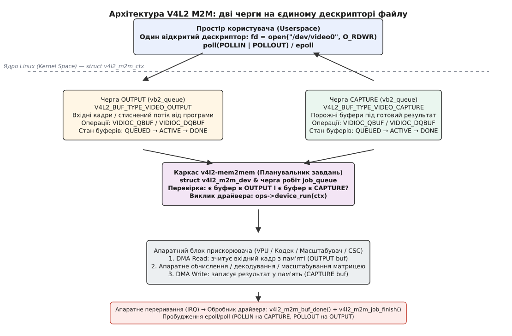
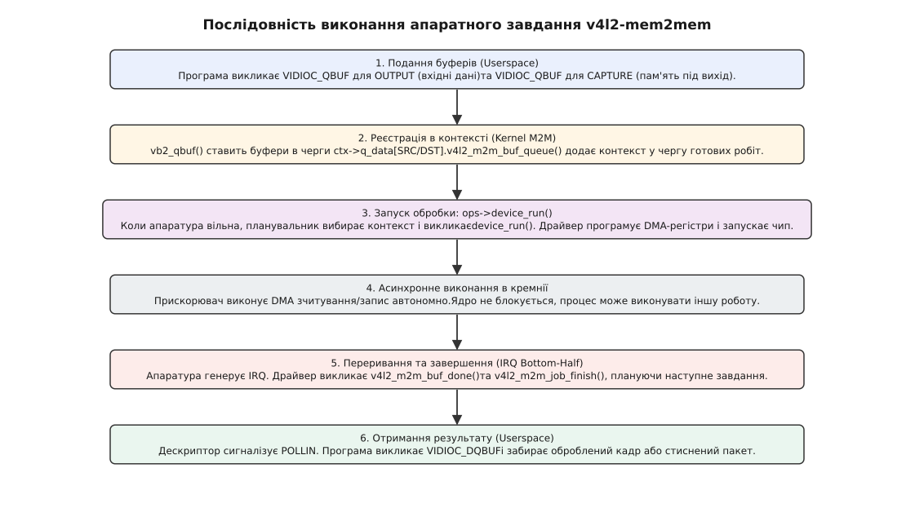
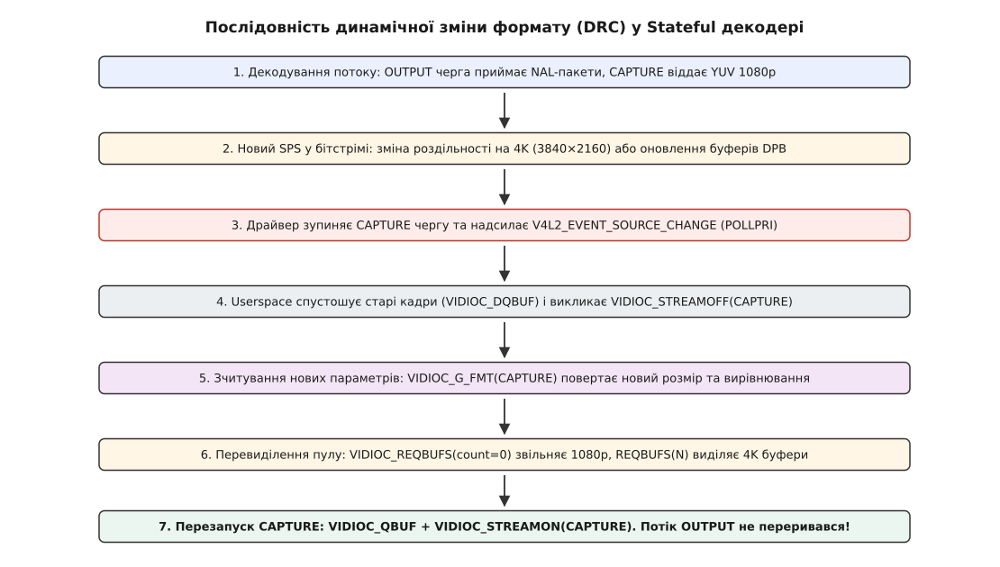
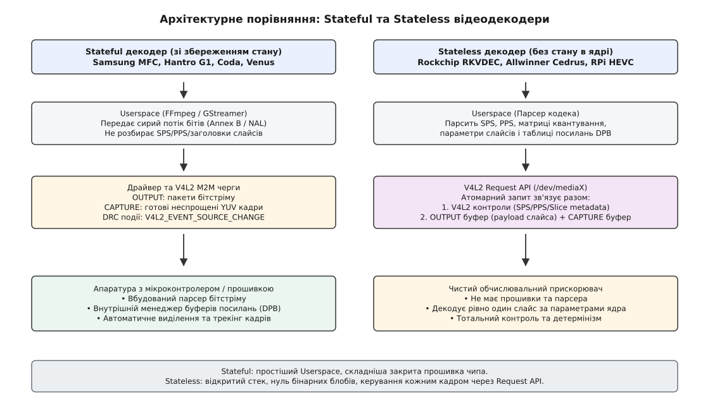

# Пристрої «пам'ять у пам'ять» у V4L2: дві черги на одному вузлі

<preknowlist>
- [V4L2: модель відеопристрою в ядрі](root:sys-unix/v4l2-video-devices) — черга буферів, обмін власністю, `VIDIOC_STREAMON`.
- [dma-buf: спільний буфер між драйверами](root:sys-unix/dma-buf) — буфер як дескриптор, імпорт та експорт між пристроями.
- [DMA і відображення буферів у ядрі](root:sys-unix/dma-and-buffers) — прямий доступ апаратури до фізичної пам'яті.
- [Керівний канал до драйвера: ioctl](root:sys-unix/ioctl-interface) — команди та структури обміну з ядром.
- [select, poll, epoll: чекати на багато джерел](root:sys-unix/select-poll-epoll) — мультиплексування подій на файлових дескрипторах.
- [Формати пікселів і буферів зображення](root:sf-visual/pixel-formats) — площини, кольорові моделі, YUV, NV12.
</preknowlist>

Потік відео у форматі 4K з частотою 60 кадрів на секунду та колірною субдискретизацією 4:2:0 (напівпланарний формат NV12, півтора байта на піксель) вимагає гігантської смуги пропускання оперативної пам'яті:

```
розмір кадру 3840×2160 NV12  = 3840 · 2160 · 1.5 = 12 441 600 Б ≈ 12.44 МБ
потік даних при 60 кадрах/с = 12.44 · 60        ≈ 746.5 МБ/с
стиснений потік H.264 (25 Мбіт/с)                 ≈ 3.125 МБ/с
```

Якщо декодувати такий потік програмно силами центрального процесора, ядра захлинаються в обчисленнях оберненого дискретного косинусного перетворення (IDCT — англ. *Inverse Discrete Cosine Transform*), компенсації руху та фільтрації деблокінгу. Сучасні однокристальні системи містять спеціалізовані апаратні блоки — відеопроцесори (VPU — англ. *Video Processing Unit*), апаратні масштабувачі (2D Scaler), перетворювачі колірного простору (CSC — англ. *Color Space Converter*), деінтерлейсери та кодеки JPEG.

Особливість цих блоків полягає в тому, що до них не під'єднано жодної фізичної телевізійної матриці, HDMI-порту чи оптичного сенсора камери. Вхідні дані для них лежать у системній оперативній пам'яті (стиснений потік 3.125 МБ/с або вхідний кадр 1080p), і результат їхньої роботи записується назад у системну оперативну пам'ять (неспрощені кадри 746.5 МБ/с або масштабоване зображення). Цей клас пристроїв отримав назву «пам'ять у пам'ять» (Memory-to-Memory або M2M).

## Чому два вузли пристрою ламають систему

У класичній підсистемі V4L2 пристрій відеозахоплення (вебкамера) експортує вузол `/dev/video0`, з якого програма забирає кадри за допомогою черги `CAPTURE`. Пристрій відеовиведення (аналоговий ТВ-вихід відеокарти) експортує вузол, у який програма надсилає кадри чергою `OUTPUT`.

Перша інтуїтивна спроба реалізувати M2M-прискорювач полягала у створенні двох незалежних вузлів: наприклад, `/dev/video_in` для завантаження вхідних даних і `/dev/video_out` для отримання результату. На практиці такий підхід миттєво руйнує стабільність ядра та ускладнює користувацькі додатки.

По-перше, зникає атомарність сеансу. Якщо два незалежні процеси одночасно відкриють прискорювач, драйвер не зможе визначити, який саме вихідний кадр належить якому вхідному потоку, без додавання складних міжпроцесних ідентифікаторів у `ioctl`. Якщо один процес аварійно завершиться, відкривши лише `/dev/video_in`, апаратний блок залишиться заблокованим в очікуванні зчитування з `/dev/video_out`.

По-друге, ламається стандартна модель мультиплексування вводу-виводу. Головна перевага файлового дескриптора Linux — можливість передати його в системні виклики `poll()`, `select()` або `epoll()`. Програма для обробки відео повинна прокидатися в двох випадках: коли вхідна черга готова прийняти новий кадр (подія `POLLOUT`), і коли вихідна черга вже містить оброблений результат (подія `POLLIN`). Рознесення операцій на два різні файли вимагає подвійної кількості дескрипторів, подвоює кількість системних викликів на кожен кадр, ускладнює синхронізацію та створює умови для взаємних блокувань (Deadlock).

Виходом із глухого кута стала архітектура, де **один символьний вузол пристрою** об'єднує в собі **дві паралельні та незалежні черги буферів `videobuf2`**, керовані спільним диспетчером завдань.

## Дві черги на одному вузлі: симетрія та термінологія

Коли процес викликає `open("/dev/video0", O_RDWR)`, ядро виділяє єдиний файловий дескриптор, усередині якого функціонують дві черги типу `struct vb2_queue`.

Термінологія черг у V4L2 M2M формулюється **з точки зору програми користувача**, а не з точки зору апаратного кремнію:

1. **Черга `OUTPUT` (`V4L2_BUF_TYPE_VIDEO_OUTPUT` або `_MPLANE`)** — черга виведення даних *з простору користувача в ядро*. Для апаратного блоку це **вхід (Source)**. Сюди програма віддає байти стисненого відеопотоку (у разі декодера) або сирі кадри великої роздільності (у разі масштабувача).
2. **Черга `CAPTURE` (`V4L2_BUF_TYPE_VIDEO_CAPTURE` або `_MPLANE`)** — черга захоплення даних *простором користувача з ядра*. Для апаратного блоку це **вихід (Destination)**. Сюди програма подає порожні буфери, у які апаратура через контролер DMA записує декодовані або оброблені пікселі.



*Архітектура пристрою V4L2 M2M: єдиний файловий дескриптор містить чергу OUTPUT для подачі джерела та чергу CAPTURE для отримання результату, зв'язані планувальником завдань v4l2-mem2mem.*

Обидві черги конфігуруються абсолютно незалежно одна від одної. Кожна черга має власний формат пікселів, власну геометрію та власний тип виділення пам'яті:

```c
/* Налаштування формату вхідного потоку (OUTPUT): сирий YUYV 1920×1080 */
struct v4l2_format fmt_src = {
    .type = V4L2_BUF_TYPE_VIDEO_OUTPUT,
    .fmt.pix.width = 1920,
    .fmt.pix.height = 1080,
    .fmt.pix.pixelformat = V4L2_PIX_FMT_YUYV,
};
ioctl(fd, VIDIOC_S_FMT, &fmt_src);

/* Налаштування формату вихідного потоку (CAPTURE): стиснений H.264 */
struct v4l2_format fmt_dst = {
    .type = V4L2_BUF_TYPE_VIDEO_CAPTURE,
    .fmt.pix.pixelformat = V4L2_PIX_FMT_H264,
    .fmt.pix.sizeimage = 2 * 1024 * 1024, /* 2 МБ буфер під бітстрім */
};
ioctl(fd, VIDIOC_S_FMT, &fmt_dst);
```

Якщо пристрій підтримує зміну розміру або обтинання зображення (Cropping / Composing), використовується V4L2 Selection API:
* `VIDIOC_S_SELECTION` з типом `V4L2_BUF_TYPE_VIDEO_OUTPUT` та мішенню `V4L2_SEL_TGT_CROP` визначає прямокутник вирізання з вхідного кадру.
* `VIDIOC_S_SELECTION` з типом `V4L2_BUF_TYPE_VIDEO_CAPTURE` та мішенню `V4L2_SEL_TGT_COMPOSE` визначає область масштабування та позицію кадру у вихідному буфері.

## Багатоплощинні формати: NV12 проти NV12M

У класичному одноплощинному форматі (Single-Planar, наприклад `V4L2_PIX_FMT_NV12`) яскравість Y та колірні різниці UV розміщуються в єдиному суцільному буфері пам'яті: спершу йдуть рядки Y, а одразу за ними — перемежовані байти UV.

Однак сучасні контролери DMA та апаратні блоки обробки відео вимагають роздільного розміщення площин у пам'яті:
* Площина Y виділяється у власному незалежному буфері або каналі DMA.
* Площина UV виділяється в окремому буфері, який може мати власне вирівнювання, фізичну адресу або навіть перебувати в іншій банці пам'яті.

Для таких конфігурацій V4L2 надає багатоплощинні типи `V4L2_BUF_TYPE_VIDEO_OUTPUT_MPLANE` та `V4L2_BUF_TYPE_VIDEO_CAPTURE_MPLANE` і формат `V4L2_PIX_FMT_NV12M` (суфікс `M` означає Multi-Planar). У цьому режимі кожен виклик `ioctl` оперує структурою `struct v4l2_plane`, передаючи окремий покажчик, розмір та дескриптор `dma-buf` для кожної площини окремо.

## Каркас v4l2-mem2mem: диспетчер апаратних завдань

Управління двома чергами на рівні драйвера ядра забезпечує підсистема `v4l2-mem2mem` (файл ядра `drivers/media/v4l2-core/v4l2-mem2mem.c`).

В основі підсистеми лежить поділ на дві ключові структури:
1. `struct v4l2_m2m_dev` — глобальний екземпляр пристрою (один на весь фізичний чип VPU). Він володіє спільною чергою готових робіт `job_queue`, м'ютексом синхронізації доступу до кремнію та таблицею операцій `struct v4l2_m2m_ops`.
2. `struct v4l2_m2m_ctx` — контекст відкритого файлового дескриптора (створюється на кожен виклик `open()`). Він інкапсулює обидві черги `vb2_queue` та локальний стан сеансу конкретного процесу.

Завдяки цьому драйвер M2M автоматично підтримує віртуалізацію та багатопотоковість: десять різних програм можуть одночасно відкрити `/dev/video0` і паралельно декодувати десять різних відеопотоків. Кожен процес взаємодіє зі своїм локальним `v4l2_m2m_ctx`, а каркас `v4l2-mem2mem` прозоро серіалізує запити до єдиного кремнієвого блоку за принципом черги FIFO.

Повний склад структур, функцій ініціалізації та прапорців ядра задокументовано у вставці про [інтерфейс v4l2-mem2mem: структури, зворотні виклики та операції](root:sys-unix/v4l2-mem2mem-devices/api-v4l2-m2m-framework.md).

### Життєвий цикл завдання: від QBUF до переривання

Апаратний блок не може працювати, якщо є лише вхідний кадр (його нікуди записати) або лише порожній вихідний буфер (немає з чого обчислювати результат). Тому виконання операції починається лише тоді, коли виконано квант умови: **хоча б один буфер готовий у черзі `OUTPUT` І хоча б один буфер готовий у черзі `CAPTURE`**.



*Послідовність виконання апаратного завдання: передача буферів через QBUF, диспетчеризація через device_run, асинхронне виконання DMA, переривання IRQ та повернення буферів.*

Послідовність кроків ядра розгортається таким чином:

1. Програма викликає `ioctl(fd, VIDIOC_QBUF, &buf)` для вхідного буфера (`OUTPUT`) та вихідного буфера (`CAPTURE`).
2. Рівень `videobuf2` перевіряє права доступу, валідує адреси пам'яті та викликає допоміжну функцію `v4l2_m2m_buf_queue(ctx, vbuf)`. Буфери додаються у відповідні внутрішні списки контексту.
3. Диспетчер завдань перевіряє, чи містить контекст повну пару буферів для транзакції. Якщо умова виконується, контекст ставиться в кінець списку `job_queue` пристрою.
4. Коли апаратний блок вільний (попереднє завдання завершилося), планувальник вибирає перший контекст із черги і викликає зворотний виклик драйвера `ops->device_run(priv_ctx)`.
5. Усередині `device_run` драйвер отримує фізичні адреси пам'яті буферів за допомогою макросів `v4l2_m2m_next_src_buf(ctx)` та `v4l2_m2m_next_dst_buf(ctx)`, записує їх у конфігураційні регістри DMA прискорювача та дає команду старту апаратури.
6. Драйвер **негайно повертає керування** з `device_run`. Процесор вільний, ядро не спить у циклічному очікуванні.
7. Апаратний блок самостійно виконує транзакцію по системній шині (зчитує байти з `SRC`, виконує матричні перетворення і записує результат у `DST`).
8. Після завершення обробки апаратний контролер генерує лінійне переривання процесора (IRQ — англ. *Interrupt Request*).
9. Обробник переривання драйвера (ISR / Threaded IRQ) зчитує регістри стану чипа, позначає вхідний і вихідний буфери прапорцем готовності через виклик `v4l2_m2m_buf_done()` і викликає фінальну функцію планувальника:

```c
v4l2_m2m_job_finish(m2m_dev, m2m_ctx);
```

Виклик `v4l2_m2m_job_finish()` миттєво пробуджує потоки користувацького простору, які очікували на подію `POLLIN` через `epoll()`, і одразу перевіряє чергу `job_queue`. Якщо там чекає наступне завдання (цього ж або іншого процесу), планувальник без паузи запускає наступний виклик `device_run`.

> 🔧 **Навіщо це.** Завдяки диспетчеризації через `v4l2-mem2mem` накладні витрати ядра на перемикання контексту між кадрами становлять менше 10–15 мікросекунд. Апаратний блок працює з 98–99% утилізацією без простоїв конвеєра, навіть якщо кадри надходять від різних незалежних процесів операційної системи.

## Буфери, пам'ять DMA та нульове копіювання з dma-buf

Керування пам'яттю в M2M-пристроях має враховувати фізичні обмеження контролерів прямого доступу до пам'яті (DMA). Якщо центральний процесор оперує віртуальними сторінками розміром 4 КБ, то апаратні блоки обробки відео часто вимагають суцільних фізичних областей пам'яті значного розміру.

Розглянемо апаратний декодер 4K HEVC: для підтримки алгоритмів часового передбачення йому потрібен буфер відновлених опорних кадрів (DPB — англ. *Decoded Picture Buffer*), який містить до 16 повнорозмірних кадрів:

```
пам'ять під DPB = 16 · 12.44 МБ ≈ 199 МБ фізичної пам'яті
```

Якщо система не оснащена блоком трансляції адрес системної шини (IOMMU — англ. *Input-Output Memory Management Unit*), ці 199 МБ повинні виділятися як неподільний фізично суцільний шматок адреси. У ядрі Linux для цього використовується спеціалізований алокатор суцільної пам'яті (CMA — англ. *Contiguous Memory Allocator*). Обсяг пулу CMA резервується під час завантаження ядра параметром командного рядка `cma=256M` або вузлом дерева пристроїв `reserved-memory`.

### Моделі виділення пам'яті

Підсистема `videobuf2` у драйверах M2M підтримує два основні механізми виділення буферів:

1. **`V4L2_MEMORY_MMAP`** — пам'ять виділяється драйвером ядра з пулу CMA (через підсистему `vb2_dma_contig`) або через сторінковий алокатор IOMMU (`vb2_dma_sg`). Програма викликає `VIDIOC_QUERYBUF` для отримання зсуву і відображає пам'ять у свій адресний простір через `mmap()`.
2. **`V4L2_MEMORY_DMABUF`** — буфери виділяються зовнішнім драйвером (наприклад, драйвером камери, віртуальним графічним дисплеєм DRM/KMS GEM або фреймбуфером) і передаються в M2M-вузол у вигляді числових файлових дескрипторів `dma_buf_fd`.

### Безкопійний конвеєр обробки

Найефективнішою схемою для вбудованих Linux-систем є побудова наскрізного конвеєра нульового копіювання (Zero-Copy Pipeline), де дані перетікають між незалежними пристроями без залучення процесора:

```
Камера (/dev/video0, CAPTURE) 
       │ (dma-buf fd: сирий кадр 1080p з сенсора)
       ▼
Масштабувач (/dev/video10, OUTPUT) ──[Апаратне стиснення 1080p → 720p]
       │
Масштабувач (/dev/video10, CAPTURE)
       │ (dma-buf fd: зменшений кадр 720p)
       ▼
Кодер H.264 (/dev/video11, OUTPUT) ──[Апаратне кодування у бітстрім]
       │
Кодер H.264 (/dev/video11, CAPTURE) ── (пакети H.264 у сокет)
```

У цьому ланцюжку кадр жодного разу не копіюється процесором:
* Камера записує байти безпосередньо у виділений буфер пам'яті через свій DMA-контролер.
* Дескриптор `dma-buf` передається в чергу `OUTPUT` масштабувача. Драйвер масштабувача імпортує фізичні сторінки через `dma_buf_attach()` та `dma_buf_map_attachment()`, налаштовуючи свій контролер DMA на зчитування тих самих фізичних адрес.
* Результат масштабування записується у вихідний буфер черги `CAPTURE`, який негайно імпортується чергою `OUTPUT` апаратного кодера H.264.

Повна робоча реалізація конфігурації обох черг, керування пам'яттю та мультиплексування подій представлена у практичній вставці про [апаратне масштабування та конвертацію формату на C та C++](root:sys-unix/v4l2-mem2mem-devices/proj-m2m-scaler-transform.md).

### Автоматичне копіювання часових міток (Timestamps)

У мультимедійних конвеєрах критично важливо зберігати синхронізацію аудіо та відео (Lip-Sync). Кожен вхідний кадр супроводжується часовою міткою презентації (PTS — англ. *Presentation Time Stamp*), записаною в структурі `v4l2_buffer.timestamp`.

У класичній моделі двох окремих пристроїв програма змушена була вести складні внутрішні хеш-таблиці або кільцеві буфери для відновлення відповідності міток часу. У каркасі `v4l2-mem2mem` ця логіка реалізована апаратно-програмно на рівні ядра:
* Коли програма подає буфер у чергу `OUTPUT`, вона заповнює поле `timestamp`.
* Каркас `v4l2-mem2mem` автоматично викликає функцію `v4l2_m2m_buf_copy_metadata()`.
* Часова мітка, прапорці поля (`V4L2_FIELD_*`) та порядковий номер кадру (`sequence`) автоматично переносяться у відповідний буфер черги `CAPTURE`.

Програма користувача забирає готовий вихідний кадр із черги `CAPTURE` і одразу отримує оригінальну часову мітку, з якою цей кадр зайшов у конвеєр.

## Кінець потоку та динамічна зміна формату (DRC)

Робота з відеокодеками вносить дві фундаментальні асиметрії, яких немає у звичайних камерах:
1. **Затримка конвеєра (Reordering & B-frames):** один вхідний пакет не обов'язково породжує рівно один вихідний кадр у той самий момент. Відеодекодеру може знадобитися прийняти три чи чотири пакети для накопичення опорних кадрів, перш ніж з'явиться перший готовий кадр у черзі `CAPTURE`.
2. **Динамічна зміна роздільності (DRC — англ. *Dynamic Resolution Change*):** бітстрім може на льоту перемкнути роздільність (наприклад, з реклами 720p на основний фільм 1080p або 4K).

### Протокол вичерпання потоку (Drain / EOS)

Коли відеофайл добігає кінця, у внутрішніх буферах апаратного декодера все ще можуть залишатися B-кадри, які чекають на наступні посилання. Якщо програма просто викличе `STREAMOFF`, ці кадри буде безповоротно втрачено.

Для коректного завершення потоку (Drain) програма викликає спеціальну команду:

```c
struct v4l2_decoder_cmd cmd = {
    .cmd = V4L2_DEC_CMD_STOP,
    .flags = 0,
};
ioctl(fd, VIDIOC_DECODER_CMD, &cmd);
```

Отримавши команду `V4L2_DEC_CMD_STOP`, декодер припиняє очікувати нові дані на черзі `OUTPUT`, декодує всі залишкові кадри у внутрішній пам'яті та передає їх у чергу `CAPTURE`. Останній доступний кадр маркується спеціальним прапорцем:

```c
if (buf_cap.flags & V4L2_BUF_FLAG_LAST) {
    /* Кінець потоку: усі кадри вилучено з декодера */
}
```

Побачивши прапорець `V4L2_BUF_FLAG_LAST`, програма знає, що конвеєр повністю спустошено, і може безпечно зупиняти потік.

### Динамічна зміна роздільності (DRC Flow)

Коли апаратний декодер парсить черговий заголовок послідовності (SPS — англ. *Sequence Parameter Set*) і виявляє зміну розміру кадру або колірного формату, він не може просто записати 4K зображення у старі буфери 1080p — це спричинить переповнення пам'яті (Buffer Overflow).



*Послідовність обробки події V4L2_EVENT_SOURCE_CHANGE при зміні роздільності потоку: зупинка CAPTURE, переналаштування пулу буферів та відновлення декодування.*

Протокол V4L2 DRC регламентує сувору послідовність кроків:

1. Драйвер призупиняє обробку черги `CAPTURE` і генерує системну подію `V4L2_EVENT_SOURCE_CHANGE` з підтипом `V4L2_EVENT_SRC_CH_RESOLUTION`.
2. Файловий дескриптор сигналізує подію високого пріоритету `POLLPRI`. Програма прокидається з `poll()` і зчитує подію за допомогою `ioctl(fd, VIDIOC_DQEVENT, &ev)`.
3. Програма забирає всі залишкові декодовані кадри старого розміру з черги `CAPTURE` через `VIDIOC_DQBUF`, доки черга не спорожніє.
4. Програма зупиняє **лише чергу `CAPTURE`**:
   ```c
   enum v4l2_buf_type type = V4L2_BUF_TYPE_VIDEO_CAPTURE;
   ioctl(fd, VIDIOC_STREAMOFF, &type);
   ```
   *Черга `OUTPUT` залишається активною: вхідний потік бітів не переривається і не скидається!*
5. Програма запитує новий формат у драйвера: `ioctl(fd, VIDIOC_G_FMT, &new_fmt)`. Драйвер повертає оновлені габарити (наприклад, 3840×2160) та новий мінімальний розмір буфера.
6. Програма звільняє старий пул буферів викликом `VIDIOC_REQBUFS` із `count = 0` для черги `CAPTURE`.
7. Програма виділяє новий пул буферів потрібного розміру (`VIDIOC_REQBUFS` із `count = N`), відображає їх через `mmap` (або виділяє нові `dma-buf`) і ставить у чергу через `VIDIOC_QBUF`.
8. Програма відновлює захоплення: `ioctl(fd, VIDIOC_STREAMON, &type)`. Декодер продовжує роботу без перезапуску пристрою.

## Stateful проти Stateless: розкол у світі відеодекодерів

За внутрішньою архітектурою всі M2M-відеодекодери в ядрі Linux поділяються на два класи: **Stateful (зі збереженням стану)** та **Stateless (без збереження стану)**.



*Архітектурне порівняння Stateful та Stateless відеодекодерів: автономна прошивка кодека проти детермінованого керування кожним кадром через V4L2 Request API.*

### Stateful декодери

У Stateful-декодерах (чипи Samsung MFC, Qualcomm Venus, NXP Coda, Hantro G1) кремній містить власний вбудований мікроконтролер, який виконує пропрієтарну мікропрограму (Firmware). 

Простір користувача надсилає в чергу `OUTPUT` сирий потік бітів H.264/HEVC (послідовність NAL-блоків у форматі Annex B). Прошивка всередині чипа самостійно:
* Розбирає заголовки потоку (SPS, PPS, Slice Headers).
* Виділяє та контролює внутрішній буфер посилань (DPB — Decoded Picture Buffer).
* Відстежує порядок виведення кадрів (POC — Picture Order Count).
* Видає повністю сформований YUV-кадр у чергу `CAPTURE`.

**Перевага:** Простий користувацький простір. Програвачу відео достатньо пересилати шматки файлу в чергу `OUTPUT`.
**Недолік:** Повна залежність від бінарної закритої прошивки виробника. Неможливо виправити помилки в парсері бітстріму, складні нестандартні розширення протоколів.

### Stateless декодери та V4L2 Request API

Stateless-декодери (чипи Allwinner Cedrus, Rockchip RKVDEC/RKMPP, Broadcom у Raspberry Pi) не мають внутрішнього мікроконтролера та прошивки. Вони являють собою чисті матричні прискорювачі обчислень, здатні виконати зворотне квантування та компенсацію руху для одного слайса, але не знають, що таке потік H.264 загалом.

У Stateless-архітектурі парсинг бітстріму переноситься у простір користувача (бібліотеки FFmpeg, Chromium або GStreamer). Програма самостійно витягує з бітстріму структури параметрів послідовності та кадру, після чого передає їх у ядро у вигляді типізованих структур V4L2 Controls:
* `V4L2_CID_STATELESS_H264_SPS` — параметри послідовності (профіль, рівень, прапорці прямого перетворення).
* `V4L2_CID_STATELESS_H264_PPS` — параметри кадру (ентропійне кодування CABAC/CAVLC, матриці масштабування).
* `V4L2_CID_STATELESS_H264_SCALING_MATRIX` — коефіцієнти матриць квантування.
* `V4L2_CID_STATELESS_H264_SLICE_PARAMS` — параметри поточного слайса та списки посилань на попередні кадри DPB.

Проте виникає фундаментальна проблема узгодженості: якщо передати елементи керування через `VIDIOC_S_EXT_CTRLS`, а буфер даних — через `VIDIOC_QBUF`, у багатопотоковому середовищі налаштування одного кадру можуть випадково застосуватися до іншого.

Для вирішення цієї проблеми було створено **V4L2 Request API**.

Програма відкриває вузол медіаконтролера `/dev/mediaX` і створює атомарний об'єкт запиту:

```c
int req_fd;
ioctl(media_fd, MEDIA_IOC_REQUEST_ALLOC, &req_fd);
```

Далі всі структури метаданих (V4L2 Controls) і буфер даних у черзі `OUTPUT` прив'язуються до цього конкретного `req_fd`:

```c
/* Прив'язка елементів керування до запиту */
struct v4l2_ext_controls ctrls = {
    .which = V4L2_CTRL_WHICH_REQUEST_VAL,
    .request_fd = req_fd,
    /* список структур SPS, PPS, Slice Params */
};
ioctl(video_fd, VIDIOC_S_EXT_CTRLS, &ctrls);

/* Прив'язка буфера даних слайса до того самого запиту */
struct v4l2_buffer buf = {
    .type = V4L2_BUF_TYPE_VIDEO_OUTPUT,
    .flags = V4L2_BUF_FLAG_REQUEST_FD,
    .request_fd = req_fd,
};
ioctl(video_fd, VIDIOC_QBUF, &buf);

/* Атомарна постановка запиту в чергу виконання */
ioctl(req_fd, MEDIA_REQUEST_IOC_QUEUE, NULL);
```

Ядро гарантує, що апаратний блок Stateless-декодера отримає метадані та байти слайса як єдине неподільне ціле. Після завершення декодування дескриптор `req_fd` стає читним (`POLLPRI`), сигналізуючи про готовність результату.

Історію боротьби від закритих бінарних модулів початку 2000-х до створення повністю відкритого Stateless-стеку викладено у вставці про [еволюцію M2M та появу Stateless-декодерів](root:sys-unix/v4l2-mem2mem-devices/hist-m2m-and-stateless.md).

## Трасування та профілювання M2M-драйверів

Для виявлення джитера затримок, пропущених кадрів і вузьких місць продуктивності M2M-конвеєра ядро Linux надає вбудовані статичні точки трасування підсистеми `videobuf2`:

```
# Активація точок трасування буферизації відео
echo 1 > /sys/kernel/debug/tracing/events/v4l2/v4l2_qbuf/enable
echo 1 > /sys/kernel/debug/tracing/events/v4l2/v4l2_dqbuf/enable
echo 1 > /sys/kernel/debug/tracing/events/vb2/vb2_buf_queue/enable
echo 1 > /sys/kernel/debug/tracing/events/vb2/vb2_buf_done/enable

# Перегляд журналу трасування в реальному часі
cat /sys/kernel/debug/tracing/trace_pipe
```

Кожен запис трасування містить точну наносекундну мітку часу взяття буфера контролером DMA та повернення переривання, що дозволяє виміряти чистий час роботи кремнієвого блоку без накладних витрат простору користувача.

## Синхронізація, блокування та крайові випадки

Реалізація двох черг на одному вузлі вимагає суворої ієрархії синхронізації всередині драйвера, щоб уникнути дедлоків між системними викликами користувача та апаратними перериваннями.

У типовому драйвері M2M діють три рівні блокування:
1. **Глобальний м'ютекс пристрою (`dev->dev_mutex`)** — захищає доступ до апаратних регістрів чипа та черги `job_queue`. Захоплюється диспетчером завдань під час виклику `device_run` і звільняється у `v4l2_m2m_job_finish`.
2. **М'ютекс черг сеансу (`ctx->q_lock`)** — серіалізує виклики `ioctl` на конкретному файловому дескрипторі.
3. **Спінлок переривань (`dev->slock`)** — використовується в обробнику апаратного переривання (ISR) для безпечного оновлення стану завершених буферів.

```
Ієрархія взяття блокувань:
q_lock (простір користувача) → dev_mutex (диспетчер M2M) → slock (обробник IRQ)
```

Взяття блокувань у зворотному порядку суворо заборонено, оскільки це призводить до мертвого блокування ядра (Kernel Hang).

### Голодування черг (Starvation)

Оскільки робота кремнію вимагає наявності буферів у обох чергах, можливі два типи розбалансування конвеєра:
* **Голодування входу (Source Starvation):** програма не встигає зчитувати або генерувати стиснені пакети. Черга `CAPTURE` заповнена порожніми буферами, але прискорювач стоїть, оскільки черга `OUTPUT` порожня.
* **Голодування виходу (Backpressure / Sink Starvation):** програма вчасно завантажує вхідні кадри, але графічний дисплей не встигає відображати вихідні кадри, через що вихідні буфери не повертаються в чергу `CAPTURE`. Черга `OUTPUT` накопичує вхідні кадри, після чого `ioctl(VIDIOC_QBUF)` блокується або повертає помилку через переповнення черги.

### Апаратні тайм-аути та аварійне скидання чипа

Якщо апаратний блок стикається з пошкодженим потоком бітів або збоєм живлення шини, внутрішній матричний процесор може зайти в нескінченний цикл або зупинити тактовий генератор DMA. У такому разі очікуване апаратне переривання ніколи не настане.

Щоб запобігти «зависанню» всієї операційної системи, каркас `v4l2-mem2mem` вимагає від драйверів обов'язкової реєстрації сторожового таймера (Watchdog Timer):
1. Перед стартом чипа в `device_run` драйвер зводить таймер на 100–500 мілісекунд (залежно від профілю кодека та роздільності).
2. Якщо переривання не настало до спрацювання таймера, викликається функція аварійного скидання (Hardware Reset).
3. Драйвер примусово скидає регістри блоку через підсистему скидання (Reset Controller), позначає поточні буфери статусом помилки `VB2_BUF_STATE_ERROR` та викликає `v4l2_m2m_job_finish()`.
4. Програма користувача отримує буфер із прапорцем `V4L2_BUF_FLAG_ERROR` і може продовжити декодування з наступного ключового кадру без паніки ядра та без перезавантаження операційної системи.
