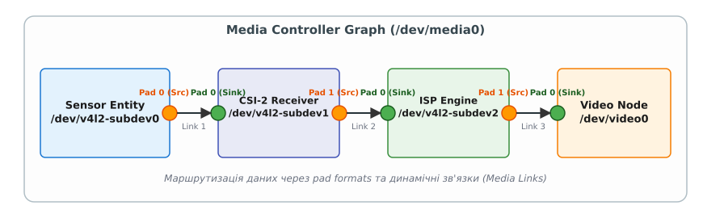
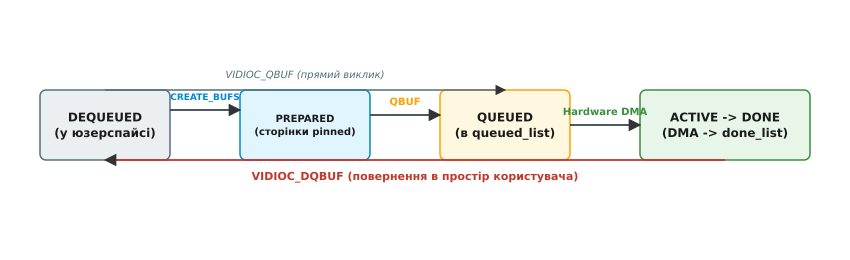
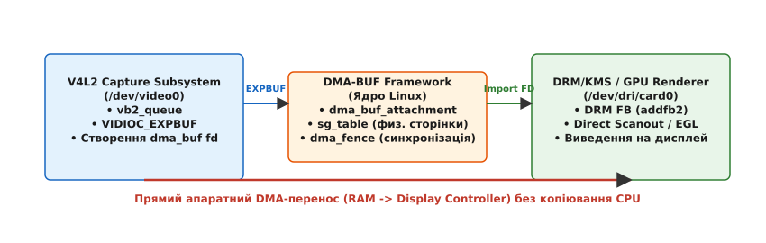

# Відео-підсистема V4L2 та Media Controller API

<preknowlist>
- [Інтерфейс ioctl](topic:sys-unix/ioctl-interface) — керування пристроями через системні команди та файлові дескриптори.
- [Спільні буфери dma-buf](topic:sys-unix/dma-buf) — передача фізичних сторінок пам'яті між драйверами без копіювання.
- [Фреймворк DMA та буфери](topic:sys-unix/dma-and-buffers) — неперервна та Scatter-Gather пам'ять для шинних пристроїв.
- [Модель пристроїв Linux](topic:sys-unix/sysfs-device-model) — ієрархія kobject, драйвери та представлення апаратури у sysfs.
</preknowlist>

Коли сенсор камери Sony IMX219 здатний видавати 1080p-потік на 60 кадрах за секунду в сирому 10-бітному форматі Bayer (RAW10), обсяг шинного трафіку перевищує 2.4 Гбіт/с. Прості ТБ-тюнери 1990-х років мали один апаратний дешифратор та виводили кадр у системну пам'ять через єдину шину PCI. Сучасні ж системи на кристалі (SoC) пропускають цей потік через ланцюжок із кількох незалежних апаратних блоків: фізичний приймач MIPI CSI-2 PHY, блок розпакування пакетів шини, процесор сигналів зображення (ISP) для дебайєризації та автоматичного білого балансу, і лише наприкінці DMA-контролер записує YUV420-кадр в ОЗП. Спроба представити цей багатокомпонентний конвеєр через єдиний файловий дескриптор `/dev/video0` призводить до апаратних блокувань: застосунок не може налаштувати проміжні канали, перенаправити сирий потік до другого обробника або дізнатися, на якому саме етапі виникло розходження роздільної здатності.

Для вирішення цієї архітектурної кризи ядро Linux розділило відеопідсистему на три фундаментальні рівні: класичний **V4L2** для передачі буферів пам'яті, **Media Controller API** для опису та маршрутизації апаратного графа, і **V4L2 Subdevice API** для налаштування внутрішніх блоків.

> 🔧 **Навіщо це.**
> Без розділення на Media Controller та Subdevices розробник мобільного чи автомобільного ПЗ (наприклад, автономного робота або камери смартфона) був би змушений використовувати приватні, нестандартні ioctl від кожного виробника SoC для перемикання між сенсорами або налаштування ISP. Media Controller надає єдиний стандартний граф у просторі користувача, дозволяючи будувати Zero-Copy конвеєри від сенсора до GPU на будь-якому процесорі з ядром Linux.

Детальний перебіг становлення підсистеми від аналогових платок до сучасних SoC розкрито в окремому матеріалі [📜 Історія еволюції Video4Linux](topic:sys-unix/v4l2-subdev-routing-request-and-zero-copy/hist-v4l2-evolution.md).

---

## 1. Еволюція та обмеження монолітного V4L2

У класичній моделі Video4Linux2 пристрій відеозахоплення виступає в ролі "чорного ящика". Простір користувача взаємодіє з файлом пристрою `/dev/video0` за допомогою фіксованої послідовності системних викликів ioctl:

1. `VIDIOC_ENUM_FMT` — опитування списку підтримуваних FourCC-форматів пікселів (наприклад, `V4L2_PIX_FMT_YUYV` або `V4L2_PIX_FMT_MJPEG`).
2. `VIDIOC_S_FMT` — встановлення бажаної роздільної здатності та формату кадрів.
3. `VIDIOC_REQBUFS` — запит на виділення черги буферів у пам'яті ядра.
4. `VIDIOC_QBUF` та `VIDIOC_DQBUF` — циклічний обмін буферами в режимі стримінгу.

Ця схема бездоганно працювала для USB-веб-камер (UVC), оскільки весь ланцюжок від оптичної матриці до USB-контролера інкапсульований у корпусі камери, а драйвер ядра бачить лише готовий цифровий потік пікселів.

### Проблема мобільних SoC та серійних шин MIPI CSI-2

Однак у сучасних вбудованих системах (embedded SoC) топологія камери є розгалуженим графом. Сенсор камери підключено до шини I2C для передачі команд конфігурації та до серійної шини MIPI CSI-2 для передачі високошвидкісних даних через фізичні лінії D-PHY або C-PHY. На фізичному рівні потік передається у вигляді коротких та довгих пакетів із віртуальними каналами (Virtual Channels VC0..VC3).

Всередині SoC цей потік потрапляє в пристрій CSI-2 Receiver, звідти — в ISP (Image Signal Processor), який здійснює апаратне придушення шуму, відновлення недостатніх колірних компонент (дебайєризація Bayer RAW → RGB), корекцію затінення лінзи (Lens Shading Correction), гама-корекцію та масштабування (Resizer). На виході ISP може існувати три паралельні DMA-вузли:
- Вузол основної відеофіксації (`/dev/video0`) для запису 4K-відео.
- Вузол попереднього перегляду (`/dev/video1`) зі зниженою роздільною здатністю 1080p для відображення на екрані.
- Вузол статистики 3A (`/dev/video2`), який повертає не зображення, а математичні гістограми для алгоритмів автоекспозиції, автобалансу білого та автофокусу.

Якщо кожен із цих вузлів намагатиметься незалежно змінювати роздільну здатність сенсора через ioctl `VIDIOC_S_FMT`, в апаратурі виникне конфлікт. Монолітний V4L2 не має засобів для опису того факту, що зміни на одному вузлі впливають на всі інші, або що два вузли ділять спільне джерело тактової частоти.

---

## 2. Media Controller API: Апаратний граф підсистеми

Для відкриття внутрішньої структури мультимедійної апаратури ядро Linux реалізує фреймворк Media Controller. Він представляє всю доступну апаратуру у вигляді орієнтованого графа через спеціальний символьний пристрій `/dev/mediaX`.


*Рис. 1. Граф Media Controller: маршрутизація потоку від сенсора через CSI-2 та ISP до відеовузла.*

### Поняття Entities, Pads та Links

Граф Media Controller складається з трьох базових елементів:

1. **Entity (Сутність):** Абстракція апаратного або програмного блоку обробки. Кожна сутність описується внутрішньоядерною структурою `struct media_entity` і має тип, наприклад `MEDIA_ENT_F_CAM_SENSOR` (сенсор камери), `MEDIA_ENT_F_PROC_VIDEO_ISP` (блок ISP) або `MEDIA_ENT_F_IO_V4L` (вузол DMA захоплення `/dev/videoX`).
2. **Pad (Контактний майданчик):** Точка входу або виходу даних на сутності (`struct media_pad`). Майданчики бувають двох типів:
   - `MEDIA_PAD_FL_SOURCE` — вихідний контакт, з якого дані випромінюються.
   - `MEDIA_PAD_FL_SINK` — вхідний контакт, який приймає потік даних.
3. **Link (Зв'язок):** Орієнтоване з'єднання між Source Pad однієї сутності та Sink Pad іншої (`struct media_link`). Зв'язки мають прапорці стану:
   - `MEDIA_LNK_FL_ENABLED` — зв'язок активовано, потік пікселів передається між майданчиками.
   - `MEDIA_LNK_FL_IMMUTABLE` — зв'язок апаратно розпаяний на кристалі і не може бути вимкнений.
   - `MEDIA_LNK_FL_DYNAMIC` — зв'язок дозволено перемикати без зупинки роботи сусідніх вузлів.

### Дослідження та зміна топології

Застосунок простору користувача відкриває `/dev/media0` і запитує топологію за допомогою ioctl `MEDIA_IOC_G_TOPOLOGY`. Ядро повертає масиви всіх сутностей, майданчиків та зв'язків.

Для конфігурування маршруту потоку програма надсилає ioctl `MEDIA_IOC_SETUP_LINK`. Це дозволяє динамічно змінювати шляхи даних. Наприклад, можна вимкнути зв'язок між ISP та `/dev/video0` і увімкнути прямий зв'язок від CSI-2 Receiver до `/dev/video1`, пустивши сирий кадр Bayer напряму в пам'ять в обхід блока обробки кольору.

### Перевірка зв'язків ядра (Link Validation)

Коли застосунок віддає команду запуску відеопотоку `VIDIOC_STREAMON` на підключеному вузлі DMA `/dev/video0`, ядро не просто вмикає контролер. Підсистема Media Controller виконує процедуру **Link Validation** (внутрішньоядерний виклик `media_pipeline_start()`): вона проходить по всьому активному графу від кінцевого вузла до сенсора камери за допомогою алгоритму обходу в глибину (DFS) та перевіряє сумісність форматів на кожній парі з'єднаних майданчиків (Source Pad → Sink Pad).

Перевіряються такі параметри:
- Збіг коду формату шини (`pad0->format.code == pad1->format.code`).
- Збіг геометрії кадру (`width` та `height`).
- Збіг конфігурації інтерлейсу (`field`).

Якщо роздільна здатність, шинний код пікселів або колірний простір на виході одного субпристрою не збігаються із вхідними параметрами наступного, виклик `VIDIOC_STREAMON` завершується помилкою із кодом `-EPIPE` (Broken pipe). Це гарантує, що апаратура не увійде у стан невизначеності через неузгоджені сигнали синхронізації.

---

## 3. V4L2 Subdevices та формат шини (Media Bus Codes)

Сутності у графі Media Controller, які не є кінцевими DMA-вузлами вхід/виходу пам'яті, називаються субпристроями (subdevices). Для кожного субпристрою створюється власний символьний файл у системі: `/dev/v4l2-subdevX`.

Через це розділення виникло важливе розмежування форматів:
- **Pixel Format (FourCC):** Формат представлення пікселів у системній пам'яті (ОЗП) після роботи DMA. Описується макросами V4L2, такими як `V4L2_PIX_FMT_YUYV` або `V4L2_PIX_FMT_NV12`. Встановлюється через `VIDIOC_S_FMT` на `/dev/videoX`.
- **Media Bus Format (Media Bus Code):** Формат передачі пікселів серійними або паралельними фізичними лініями шини між апаратними блоками. Описується макросами `<linux/media-bus-format.h>`, наприклад `MEDIA_BUS_FMT_SBGGR10_1X10` (10-бітний Bayer з послідовністю B-G-G-R, який передається за один такт шини) або `MEDIA_BUS_FMT_YUYV8_1X16`. Встановлюється через ioctl `VIDIOC_SUBDEV_S_FMT` на `/dev/v4l2-subdevX`.

### Драйверний рівень V4L2 Subdevice (`v4l2_subdev_ops`)

Усередині ядра кожен субпристрій описується структурою `struct v4l2_subdev`, яка реєструється драйвером за допомогою `v4l2_subdev_init()`. Драйвер надає таблицю операцій `struct v4l2_subdev_ops`, поділену на категорії:
- `core`: Загальні операції ініціалізації, керування живленням (`s_power`) та скидання регістрів.
- `video`: Операції керування стримінгом (`s_stream`), перевірки сигналів синхронізації та обробки кадрів.
- `pad`: Операції конфігурування контактних майданчиків, такі як `enum_mbus_code`, `get_fmt`, `set_fmt` та `set_selection`.

Коли користувацький простір викликає ioctl `VIDIOC_SUBDEV_S_FMT` на `/dev/v4l2-subdev0`, ядро транслює цей запит у виклик обраного драйвером методу `ops->pad->set_fmt()`.

### Конфлікт між Try та Active конфігураціями

Зміна параметрів на субпристрої через `VIDIOC_SUBDEV_S_FMT` вимагає вказати контекст виклику у полі `which` структури `struct v4l2_subdev_format`:
- `V4L2_SUBDEV_FORMAT_TRY`: Запит застосовується до тимчасового підготовчого контексту в ядрі. Ядро коригує ширину та висоту до найближчих апаратно підтримуваних значень і повертає їх застосунку, не торкаючись фізичних регістрів обладнання. Це дозволяє розрахувати ланцюжок узгодження без ризику збити поточний відеопотік.
- `V4L2_SUBDEV_FORMAT_ACTIVE`: Запит безпосередньо записує нові значення в апаратні регістри контролера субпристрою.

### Мультиплексовані потоки та Routing API (Linux 6.3+)

У сучасних автомобільних та промислових системах до одного фізичного приймача MIPI CSI-2 може підключатися серіалізатор (FPD-Link чи GMSL), який об'єднує відеопотоки з чотирьох незалежних відеокамер у єдиний фізичний шлейф за допомогою віртуальних каналів (Virtual Channels VC0..VC3).

Для налаштування таких складних мультиканальних пристроїв ядро Linux розширило Subdevice API механізмом **Multiplexed Streams & Routing API** (`VIDIOC_SUBDEV_G_ROUTING` / `VIDIOC_SUBDEV_S_ROUTING`). Кожен pad субпристрою тепер може підтримувати кілька внутрішніх потоків (streams). Застосунок задає таблицю внутрішньої маршрутизації `struct v4l2_subdev_krouting`, яка зв'язує вхідний віртуальний канал `(sink_pad, stream_id)` із вихідним майданчиком `(source_pad, stream_id)`.

### Цільові області вибору (Selection API: Crop та Compose)

Для керування кадруванням та масштабуванням на майданчиках субпристроїв використовується Selection API (`VIDIOC_SUBDEV_S_SELECTION`):
- `V4L2_SEL_TGT_CROP`: Задає прямокутник вирізання пікселів із вхідного матричного масиву на Sink Pad.
- `V4L2_SEL_TGT_COMPOSE`: Задає прямокутник розміщення (вписування) кадрованого зображення на вихідній матриці Source Pad, що призводить до апаратного масштабування (scaling).

Огляд усіх структур та прапорців наведено у [📋 Довідник ioctl-інтерфейсів V4L2 та Media Controller](topic:sys-unix/v4l2-subdev-routing-request-and-zero-copy/api-v4l2-media-ioctls.md).

---

## 4. Фреймворк Videobuf2 (vb2): Управління буферами та Zero-Copy

Після побудови та узгодження апаратного графа виникає задача передачі масивів відеоданих між ядром та простором користувача. Оскільки кадр у роздільності 4K у форматі YUV422 займає близько 16 МБ, використання класичних викликів `read()`/`write()` з копіюванням байтів через ЦП (memcpy) призвело б до падіння швидкодії та вичерпання пропускної здатності пам'яті.

Для забезпечення Zero-Copy обміну ядро Linux використовує фреймворк **Videobuf2 (vb2)**. Він абстрагує складність роботи з DMA-контролерами і керує життєвим циклом буферів.

### Життєвий цикл буфера у Videobuf2

Буфер у Videobuf2 проходить чітко визначений автомат станів, показаний на рисунку нижче:


*Рис. 2. Стан відеобуферів у фреймворку Videobuf2 (vb2) під час обробки DMA-контролером.*

1. **DEQUEUED (Вилучено):** Буфер належить простору користувача. Застосунок може читати або записувати дані в нього.
2. **PREPARED (Підготовлено):** Буфер перевірено ядром, а фізичні сторінки пам'яті зафіксовано в ОЗП (pinned).
3. **QUEUED (У черзі):** Застосунок віддав буфер ядрю через виклик `VIDIOC_QBUF`. Буфер розміщується у внутрішньому списку ядра `queued_list`.
4. **ACTIVE (Активний):** Драйвер пристрою передає фізичну адресу буфера DMA-контролеру. Апаратура записує кадр безпосередньо в ОЗП.
5. **DONE (Завершено):** Після генерування переривання від DMA про закінчення кадру драйвер переміщує буфер до списку `done_list`.
6. **DQBUF (Вилучення):** Застосунок робить виклик `VIDIOC_DQBUF`, забирає готовий буфер зі списку `done_list` і повертає його у стан `DEQUEUED`.

### Модулі виділення пам'яті (Memory Allocators) та підсистема CMA

Videobuf2 відокремлює логіку черги від конкретного способу виділення пам'яті в системі. За це відповідають три апаратні модулі аллокації:

- `vb2-dma-contig`: Використовується пристроями, DMA-контролер яких вимагає строго фізично неперервних блоків ОЗП (Physically Contiguous Memory). Пам'ять виділяється через підсистему **CMA (Contiguous Memory Allocator)**, яка резервує пул неперервних сторінок під час завантаження ядра у дереві пристроїв (`devicetree`).
- `vb2-dma-sg`: Використовується пристроями із підтримкою Scatter-Gather DMA або при наявності системного IOMMU. Буфер може складатися із фрагментованих фізичних сторінок, які об'єднуються таблицею трансляції IOMMU.
- `vb2-vmalloc`: Використовує віртуально неперервну пам'ять `vmalloc()`. Використовується лише для простих USB-камер без апаратного DMA.

---

## 5. DMA-BUF Zero-Copy: Інтеграція захоплення та рендерингу

Найбільша ефективність обробки відео досягається тоді, коли відеокадр, захоплений камерою через V4L2, передається на рендеринг у GPU або для виведення на дисплей через DRM/KMS взагалі без участі ЦП. Для цього використовується фреймворк **DMA-BUF**.


*Рис. 3. Zero-Copy конвеєр: експорт буфера V4L2 в DMA-BUF fd та його прямому рендерингу в DRM/KMS.*

### Механізм `VIDIOC_EXPBUF` та розрахунок навантаження пам'яті

Процес експорту буферів з V4L2 у підсистему DMA-BUF виглядає так:

1. Застосунок ініціалізує буфери у V4L2 за допомогою моделі `V4L2_MEMORY_MMAP` через ioctl `VIDIOC_REQBUFS`.
2. Для кожного виділеного буфера застосунок надсилає ioctl `VIDIOC_EXPBUF`.
3. Фреймворк Videobuf2 створює анонімний об'єкт `struct dma_buf` у ядрі, асоціює його з фізичними сторінками даного відеобуфера і повертає застосунку звичайний файловий дескриптор (`fd`).
4. Застосунок передає цей `fd` у DRM/KMS через ioctl `DRM_IOCTL_MODE_ADDFB2` або в OpenGL/Vulkan через розширення EGL (`EGL_EXT_image_dma_buf_import`).
5. Дисплейний контролер або GPU отримує доступ до тих самих фізичних сторінок пам'яті. Зчитування здійснюється напряму апаратурою.

Математична різниця між копіюванням через ЦП та Zero-Copy проілюстрована нижче. При захопленні 4K60 відео кадру у форматі YUV422 (2 байти на піксель) обсяг одного кадру та необхідна смуга пропускання шини складають:

```
Розмір кадру = 3840 × 2160 × 2 байти = 16 588 800 байт (≈ 16.59 МБ)
Шинний потік = 16.59 МБ × 60 кадрів/с = 995.3 МБ/с
```

Якщо застосунок копіює кадри через ЦП (`memcpy` з V4L2 буфера в буфер GPU чи дисплея), навантаження на шину ОЗП подвоюється і досягає **1.99 ГБ/с**, витрачаючи обчислювальні такти ЦП та виклики інвалідації кешу. При використанні DMA-BUF експорту через `VIDIOC_EXPBUF` шинний трафік лишається строго на рівні **995.3 МБ/с**, а участь ЦП зводиться до передачі файлового дескриптора.

### Апаратна синхронізація через `dma_fence`

Для відстеження готовності кадру без блокування ЦП фреймворк `dma-buf` прив'язує об'єкти апаратної синхронізації **`dma_fence`** до кожного спільного буфера. Коли DMA-контролер V4L2 завершує запис каду в ОЗП, він надсилає сигнальне переривання, яке переводить `dma_fence` у стан "signaled". Дисплейний контролер DRM/KMS чекає цього сигналу на апаратному рівні перед тим, як почати сканування сторінки на монітор (Direct Scanout), що повністю усуває розриви зображення (tearing).

Повний працюючий код створення такого конвеєра мовами C та C++ з використанням RAII-обгорток наведено у матеріалі [⚙️ Практичний Zero-Copy відеоконвеєр на V4L2 та DMA-BUF](topic:sys-unix/v4l2-subdev-routing-request-and-zero-copy/proj-v4l2-zero-copy-pipeline.md).

---

## 6. Сучасний стек: libcamera, PipeWire та Media Request API

Складність Media Controller API призвела до того, що розробка прикладного ПЗ безпосередньо над системними ioctl стала надто трудомісткою. Для налаштування однієї камери потрібно написати сотні рядків коду обоходу графа та узгодження шлейфів.

### Проект libcamera

Для вирішення цієї проблеми спільнота Linux створила проект **libcamera** — відкриту бібліотеку простору користувача, яка виступає медіатором між низькорівневим ABI ядра (V4L2/Media Controller) та прикладним ПЗ.

Бібліотека використовує архітектуру **Pipeline Handlers** — плагінів під конкретні SoC (наприклад `rkisp1` для Rockchip, `bcm2835` для Raspberry Pi, `simple` для простих контролерів). Pipeline Handler самостійно:
- Відкриває `/dev/mediaX` і будує внутрішній граф.
- Автоматично узгоджує Media Bus Codes між субпристроями.
- Завантажує бінарні модулі IPA (Image Processing Algorithm) у пісочниці для апаратного управління 3A (автоекспозиція, баланс білого, фокус).
- Надає застосункам високорівневий C++ API для запиту кадрів.

### PipeWire як мультимедійний сервер

У сучасних дистрибутивах Linux (Ubuntu, Fedora, Arch) бібліотека `libcamera` не відкриває файли `/dev/mediaX` з-під звичайних застосунків. Замість цього центральним мультимедійним сервером виступає демон **PipeWire**. Він відкриває медіа-пристрої під привілейованим користувачем, конфігурує граф через `libcamera` та роздає відеопотоки користувацьким програмам (WebRTC у браузерах, OBS Studio, VLC) через безпечні IPC-сокети із розмежуванням прав через Flatpak/Portal.

### Media Request API: Синхронізація кадр-в-кадр

При кодуванні або декодуванні відео (наприклад H.264/HEVC), а також при роботі з HDR-камерами виникає проблема: налаштування кадру N (параметри квантування, матриці трансформації, час витримки) повинні застосовуватися строго атомарно разом із подачею буфера кадру N. Якщо передати налаштування через звичайні V4L2 controls, через асинхронність ядра вони можуть застосуватися із запізненням на 1–2 кадри, викликаючи мерехтіння або спотворення артефактів.

Для вирішення цього створено **Media Request API**:
1. Застосунок виділяє об'єкт запиту через ioctl `MEDIA_IOC_REQUEST_ALLOC` на `/dev/media0`, отримуючи `request_fd`.
2. Застосунок прив'язує V4L2 controls та виклик `VIDIOC_QBUF` до цього `request_fd`.
3. Застосунок відправляє запит у чергу ядра через `MEDIA_REQUEST_IOC_QUEUE`.
4. Драйвер ядра гарантує, що всі вказані параметри будуть записані у регістри апаратури атомарно перед початком стробування кадру N.

---

## 7. Простеження та діагностика відеопідсистеми

Для моніторингу та налагодження графа Media Controller у системі Linux використовуються такі системні інструменти:

### Структура sysfs

Інформація про зареєстровані медіа-пристрої доступна у системній файловій системі:
- `/sys/class/media/mediaX/` — містить властивості медіа-пристрою, список зв'язаних драйверів та ідентифікатори пристроїв.
- `/sys/class/video4linux/videoX/` — відображає параметри конкретного DMA-вузла V4L2, включаючи назву index-файлів, підтримку capabilities та присвоєні номери major/minor.

### Набір утиліт `v4l-utils`

Пакет `v4l-utils` надає дві ключові консольні утиліти:

1. **`media-ctl`:** Інструмент для виводу та конфігурування графа Media Controller.
   - Друкування повної топології графа у текстовому вигляді:
     ```bash
     media-ctl -p -d /dev/media0
     ```
   - Налаштування формату на конкретному майданчику субпристрою:
     ```bash
     media-ctl -d /dev/media0 -V '"imx219 1-0010":0[fmt:SBGGR10_1X10/1920x1080]'
     ```
   - Активація зв'язку між сутностями:
     ```bash
     media-ctl -d /dev/media0 -l '"imx219 1-0010":0->"csispn 0":0[1]'
     ```

2. **`v4l2-ctl`:** Інструмент для керування вузлами `/dev/videoX`.
   - Перегляд поточного формату пікселів: `v4l2-ctl -d /dev/video0 --get-fmt-video`.
   - Запуск тестового захоплення кадрів у буфер: `v4l2-ctl -d /dev/video0 --stream-mmap --stream-count=100`.

### Точки простеження ядра (Tracepoints) та аналіз затримок

Для глибокої діагностики затримок у чергах Videobuf2 ядро надає вбудовані трасувальні точки Ftrace:
```bash
# Увімкнення простеження системних ioctls V4L2 та Videobuf2
echo 1 > /sys/kernel/tracing/events/v4l2/enable
echo 1 > /sys/kernel/tracing/events/vb2/enable
cat /sys/kernel/tracing/trace_pipe
```

Використовуючи інструмент `bpftrace`, розробник може точно відстежити час перебування буфера у стані `ACTIVE` від виклику `vb2_start_streaming` до переривання кадру:
```bpftrace
tracepoint:vb2:vb2_buf_queue {
    @start[args->buf_index] = nsecs;
}
tracepoint:vb2:vb2_buf_done {
    if (@start[args->buf_index]) {
        $dur = (nsecs - @start[args->buf_index]) / 1000000;
        printf("Buffer %d DMA time: %d ms\n", args->buf_index, $dur);
        delete(@start[args->buf_index]);
    }
}
```
Це дозволяє швидко виявляти пропущені кадри (frame drops) та апаратні затримки шини DMA у високонавантажених вбудованих системах. Також моніторинг `dma_fence_signaled` подій дає можливість отримати повний хронометраж проходження кадру від момента експозиції сенсора до виведення на екран дисплея. Таким чином, аналіз Ftrace-подій у зв'язці із системними журналами `dmesg` надає розробникові повну картину роботи апаратного відеоконвеєра ядра Linux, спрощуючи локалізацію затримок під час обробки системних переривань від шинних контролерів.
