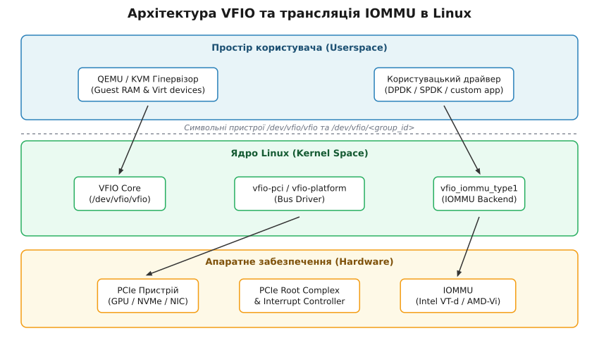
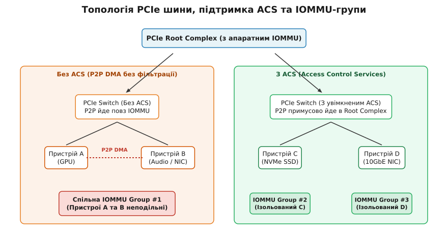

# Парапрохідність пристроїв та IOMMU-групи (VFIO)

<preknowlist>
- [Шина PCIe та підсистема PCI](root:sys-unix/pci-config-space-and-enumeration) — конфігураційний простір PCI, адресні регістри BAR, транзакції TLP та переривання MSI/MSI-X.
- [Підсистема DMA та IOMMU](root:sys-unix/dma-mapping-subsystem-and-iommu) — трансляція фізичних адрес периферійних пристроїв, таблиці сторінок IOMMU та ізоляція прямого доступу до пам'яті.
- [Архітектура KVM та QEMU](root:sys-unix/kvm-and-qemu-architecture) — взаємодія гіпервізора з простором користувача, створення віртуальних машин та механізми трансляції адрес EPT/NPT.
</preknowlist>

Віртуалізація високонавантажених обчислювальних систем (HPC), обробка сигналів на матрицях FPGA, мережеві стеки 100 GbE та навчання великих мовних моделей на кластерах GPU стикаються з нездоланною перепоною при використанні програмної емуляції пристроїв. Спроба обробити трафік 100-гігабітної мережевої карти через емульований у QEMU пристрій `e1000` з'їдає більшу частину ресурсів ЦП на переключення контексту й виходи в гіпервізор (VM-Exit), а затримка обробки пакетів зростає з одиниць мікросекунд до сотень. Прямий доступ до апаратного забезпечення (**Device Passthrough** або парапрохідність) усуває програмний гіпервізор із шляху обміну даними, однак безпечне надання фізичного пристрою під контроль гостьової віртуальної машини вимагає розв'язання фундаментальних проблем ізоляції пам'яті та шини.

У ядрі Linux стандартним, універсальним та апаратно захищеним фреймворком для реалізації парапрохідності є **VFIO (Virtual Function I/O)**.

---

## 1. Фундаментальні проблеми прямого доступу до обладнання

Надання гостьовій віртуальній машині або процесу простору користувача (userspace) безпосереднього доступу до регістрів фізичного пристрою створює дві критичні загрози для стабільності та безпеки всієї хост-системи.

### 1.1. Прямий доступ до пам'яті (DMA) та п'ять адресних просторів

Пристрої PCI Express виконують операції **Direct Memory Access (DMA)** — самостійно читають та записують дані в оперативну пам'ять системи без участі центрального процесора. Драйвер пристрою заповнює кільцеві буфери (ring buffers) адресами пам'яті та відправляє команду пристрою почати передачу через транзакційні пакети TLP (Transaction Layer Packets: `MRd`, `MWr`).

У системі з віртуалізацією одночасно співіснують п'ять різних адресних просторів:

1. **GVA (Guest Virtual Address):** Віртуальна адреса, з якою працює конкретний процес усередині гостьової ОС.
2. **GPA (Guest Physical Address):** "Фізична" адреса пам'яті з точки зору гостьового ядра Linux.
3. **HVA (Host Virtual Address):** Віртуальна адреса в адресній карті процесу QEMU на хості.
4. **IOVA (I/O Virtual Address):** Віртуальна адреса введення-виведення, яку периферійний пристрій виставляє у заголовках пакетів TLP під час DMA.
5. **HPA (Host Physical Address):** Справжня апаратна фізична адреса на материнській платі хоста.

```
ЦП (Гостьовий процес) ──(GVA)──> [Гостьові сторінки] ──(GPA)──> [EPT / NPT] ──(HPA)──> Фізична RAM
                                                                                    ▲
PCIe Пристрій ────────(IOVA)─────────────────────────────────> [Таблиці IOMMU] ──────┘
```

Якщо надати гостьовій ОС прямий доступ до PCIe-пристрою без додаткового апаратного контролю, гостьовий драйвер записатиме GPA в регістри DMA пристрою. Пристрій, відправляючи транзакцію на шину PCIe, використає цю GPA як пряму фізичну адресу хоста HPA. В результаті пристрій прочитає або перезапише довільні ділянки оперативної пам'яті хост-системи, пам'ять ядра Linux або пам'ять інших віртуальних машин. Це повністю руйнує модель ізоляції віртуалізації.

### 1.2. Механізм закріплення сторінок (Page Pinning)

Зазвичай ядро Linux може в будь-який момент перемістити сторінку пам'яті у фізичній RAM (наприклад, під час дефрагментації пам'яті `compaction`, об'єднання однакових сторінок `KSM` або витіснення в підкачку `swap`). Для звичайного процесу ЦП це непомітно, оскільки ядро оновлює записи в таблицях сторінок MMU.

Однак периферійний пристрій не інтегрований у підсистему обробки сторінкових помилок CPU (Page Faults). Якщо ядро перемістить сторінку RAM, а пристрій почне DMA-запис за старою HPA адресою, відбудеться катастрофічне пошкодження пам'яті. Тому підсистема VFIO здійснює **Page Pinning** — жорстке закріплення сторінок пам'яті хоста через `pin_user_pages()`, забороняючи їх переміщення чи витіснення у swap на весь час роботи пристрою.

### 1.3. Ін'єкція переривань (Interrupt Injection) та підробка векторів

Сучасні пристрої PCIe генерують переривання за допомогою механізмів **MSI (Message Signaled Interrupts)** та **MSI-X**. З точки зору апаратного забезпечення, MSI-переривання — це звичайний запис у пам'ять (memory write) 32-бітного слова даних за спеціально відведеною фізичною адресою контролера переривань (адреса при цьому може бути 32- або 64-розрядною) (Local APIC у системі x86, що відповідає діапазону `0xfeeXXXXX`).

Формат даних MSI містить вектор переривання (IRQ Vector), режим доставки (Delivery Mode) та ЦП-призначення (Destination ID). Без перехоплення та валідації таких транзакцій неконтрольований гостьовий драйвер може змусити пристрій відправити MSI-повідомлення з довільним вектором переривання, викликаючи чужі переривання в ядрі хоста або влаштовуючи DoS-атаку на інші процесори шквалом переривань.

---

## 2. IOMMU: Апаратний захист та трансляція адрес

Вирішенням зазначених проблем є апаратний контролер **IOMMU (Input-Output Memory Management Unit)**. Подібно до того, як звичайний MMU транслює віртуальні адреси CPU у фізичні, IOMMU перехоплює транзакції периферійних пристроїв на шині та виконує трансляцію адрес I/O.

Основні реалізації IOMMU в сучасних системних архітектурах:
* **Intel VT-d** (Virtualization Technology for Directed I/O)
* **AMD-Vi** (AMD IOMMU Architecture)
* **ARM SMMU v3** (System MMU Version 3)


*Архітектурні рівні VFIO: взаємодія між простором користувача, модулями ядра та апаратним IOMMU.*

IOMMU забезпечує два ключові механізми:

### 2.1. DMA Remapping (Трансляція DMA)
IOMMU перехоплює кожен TLP-пакет читання/запису на шині PCIe. За допомогою багаторівневих таблиць сторінок IOMMU (IOMMU Page Tables), які налаштовуються ядром хоста, IOMMU транслює віртуальну адресу пристрою (**IOVA — I/O Virtual Address**) у реальну HPA.

На прикладі Intel VT-d трансляція виконується за схемою:
1. **Requestor ID (PCI BDF):** IOMMU бере ідентифікатор Bus:Device:Function пристрою із заголовка PCIe-пакета.
2. **Root Table & Context Table:** За номером шини вибирається запис у кореневій таблиці (Root Table), а за номером пристрою й функції — у контекстній таблиці (Context Table).
3. **Second-Level Page Tables (SLPT):** Контекстна таблиця вказує на початковий рівень сторінкових таблиць IOMMU, які розшифровують IOVA в HPA.

Якщо пристрій намагається виконати доступ за адресою, для якої відсутній дозвіл у таблиці IOMMU, контролер блокує транзакцію та генерує апаратну помилку **DMAR Fault** (DMA Remapping Fault), надсилаючи переривання ядра хоста.

### 2.2. Interrupt Remapping (Перенаправлення переривань)
IOMMU перехоплює всі транзакції MSI/MSI-X. Замість прямого запису в регістри APIC, пакет перевіряється за таблицею перенаправлення переривань (**IRTE — Interrupt Remapping Table Entry**). Ядро хоста програмує IRTE, вказуючи, який саме вектор переривань і якій віртуальній машині дозволено генерувати. Лише явно дозволені векторні повідомлення пропускаються до контролера переривань ЦП.

Детальніше про передісторію виникнення підсистеми можна прочитати у [Історія виникнення VFIO та еволюція від KVM Device Assignment](root:sys-unix/vfio-passthrough/hist-kvm-assign-to-vfio.md) — як проблеми ізоляції застарілого драйвера `pci-assign` змусили переосмислити парапрохідність на користь IOMMU-груп.

---

## 3. IOMMU-групи та апаратні межі ізоляції

Найважливішою концепцією при використанні VFIO є **IOMMU-група (IOMMU Group)**.

IOMMU-група — це найменший набір фізичних пристроїв, який апаратне забезпечення хоста може надійно ізолювати від усіх інших пристроїв у системі.

### 3.1. Причина існування груп: Peer-to-Peer DMA

Усі пристрої PCIe обмінюються даними через шинну топологію, яка складається з Root Complex, PCIe-комутаторів (switches) та мостів. Згідно зі специфікацією PCIe, два пристрої, підключені до одного комутатора, можуть здійснювати обмін даними напряму — цей механізм називається **Peer-to-Peer (P2P) DMA**.

Якщо пристрій A і пристрій B підключені до комутатора, який виконує локальну маршрутизацію P2P-пакетів, їхні транзакції передаються безпосередньо між портами комутатора, **не досягаючи Root Complex**, де розташований апаратний IOMMU.


*Вплив підтримки ACS на комутаторах PCIe на формування ізольованих IOMMU-груп.*

Якщо пристрій A прокинуто у віртуальну машину, а пристрій B залишено під контролем хоста, гостьова система може спровокувати пристрій A виконати P2P DMA-запит до регістрів пристрою B. Оскільки пакет не проходить через IOMMU, IOMMU не зможе його заблокувати. Отже, пристрої A і B **не є ізольованими один від одного**.

### 3.2. Access Control Services (ACS)

Для забезпечення ізоляції специфікація PCIe передбачає функцію **ACS (Access Control Services)**. Структура ACS включає наступні прапорці контролю:
* **ACS Source Validation:** Перевіряє, чи належить ідентифікатор відправника (Requester ID) діапазону номерів шини, закріпленому за цим низхідним портом;
* **ACS Translation Blocking:** Блокує пакети, у яких адресу позначено як уже трансльовану (ненульове поле Address Type), тобто спробу обійти таблиці IOMMU;
* **ACS P2P Request Redirect:** Примусово перенаправляє всі P2P-запити вгору (Upstream) до Root Complex;
* **ACS P2P Completion Redirect:** Примусово перенаправляє відповіді P2P вгору до Root Complex.

Якщо ACS увімкнено на мостах та комутаторах, комутатор блокує пряму локальну маршрутизацію P2P і примусово перенаправляє абсолютно всі транзакції вгору до Root Complex для перевірки IOMMU.

* **Якщо всі мости й комутатори підтримують ACS:** Кожен пристрій отримує власну окрему IOMMU-групу.
* **Якщо у ланцюжку є міст без підтримки ACS:** Ядро Linux змушене об'єднати всі пристрої, що перебувають за цим мостом, в одну спільну IOMMU-групу.

### 3.3. Золоте правило цілісності VFIO

> 🔒 **Золоте правило цілісності IOMMU-груп:**
> VFIO не дозволяє прокинути окремий пристрій, якщо він перебуває у спільній IOMMU-групі з іншими пристроями. Передати віртуальній машині можна **лише всі пристрої групи цілком**, або решта пристроїв групи повинна бути відв'язана від усіх драйверів хоста.

### 3.4. Перевірка IOMMU-груп у sysfs

Ядро експортує топологію IOMMU-груп через віртуальну файлову систему `sysfs` за шляхом `/sys/kernel/iommu_groups/`. Інформацію про пристрої та групи можна отримати скриптом:

```bash
#!/bin/bash
for g in $(find /sys/kernel/iommu_groups/* -maxdepth 0 -type d | sort -V); do
    echo "IOMMU Group ${g##*/}:"
    for d in $g/devices/*; do
        echo -e "\t$(lspci -nns ${d##*/})"
    done
done
```

Приклад виводу на системі з відеокартою:
```
IOMMU Group 15:
	01:00.0 VGA compatible controller [0300]: NVIDIA Corporation AD104 [GeForce RTX 4070] [10de:2786] (rev a1)
	01:00.1 Audio device [0403]: NVIDIA Corporation AD104 HD Audio Controller [10de:22bc] (rev a1)
```
Оскільки відеокарта та її вбудований графічний аудіоконтролер (HDMI/DP Audio) знаходяться в групі 15, драйвер `vfio-pci` повинен бути прив'язаний до обох функцій (`01:00.0` та `01:00.1`).

---

## 4. Архітектура підсистеми VFIO

Фреймворк VFIO надає універсальний простір користувача для безпечного керування пристроями. Він складається з трьох основних компонентів ядра:

1. **Головний модуль (`vfio`):** Створює символьний пристрій `/dev/vfio/vfio`, який слугує точкою входу для створення "контейнерів". Контейнер відповідає одному IOMMU-домену трансляції.
2. **IOMMU Backend (`vfio_iommu_type1`):** Модуль ядра, що програмує апаратний IOMMU (Intel VT-d / AMD-Vi). Він здійснює закріплення сторінок RAM хоста (`page pinning`) та формує таблиці трансляції IOVA.
3. **Драйвер шини (`vfio-pci`):** Захоплює фізичний PCI-пристрій від звичайних драйверів хоста. Надає доступ до BAR-регістрів, PCI Config Space та забезпечує маршрутизацію переривань через `eventfd`.

Докладніше про структури даних та параметри викликів дізнайтеся у розділі [Довідник ioctl та структур даних VFIO](root:sys-unix/vfio-passthrough/api-vfio-ioctl.md) — детальна специфікація команд контейнера, групи та пристрою.

---

## 5. Процес ініціалізації пристрою у просторі користувача

Для того щоб QEMU або користувацький застосунок (DPDK) міг керувати пристроєм, виконується чітка послідовність викликів `ioctl`.

### 5.1. Покроковий алгоритм відкриття пристрою

1. **Створення контейнера:** Процес відкриває `/dev/vfio/vfio`.
2. **Відкриття групи:** Процес відкриває файл відповідної IOMMU-групи `/dev/vfio/<group_id>`. Файл існує для кожної групи, яку виявило ядро, і відкрити його можна завжди; а от **приєднати** групу до контейнера ядро дозволить лише тоді, коли всі її пристрої ізольовані від драйверів хоста — про це й свідчить прапорець `VFIO_GROUP_FLAGS_VIABLE`.
3. **Приєднання групи:** Виклик `VFIO_GROUP_SET_CONTAINER` пов'язує групу з контейнером.
4. **Активація IOMMU:** Виклик `VFIO_SET_IOMMU` з типом `VFIO_TYPE1_IOMMU` ініціалізує апаратний домен.
5. **Отримання Device FD:** Виклик `VFIO_GROUP_GET_DEVICE_FD` повертає файловий дескриптор безпосередньо для пристрою PCI.
6. **DMA-мапінг (`VFIO_IOMMU_MAP_DMA`):** Процес передає в ядро віртуальну адресу пам'яті HVA, бажану IOVA та розмір. Ядро закріплює сторінки в пам'яті (із забороною витіснення у swap) і програмує IOMMU.

### 5.2. Інтеграція KVM irqfd та vfio_virqfd

Для оптимізації сигналізації переривань VFIO інтегрується з KVM за допомогою підсистеми `virqfd`. Коли пристрій генерує переривання MSI-X, ядро викликає обробник переривання VFIO, який прямо у просторі ядра сигналізує в KVM `irqfd`. Гіпервізор KVM робить пряму ін'єкцію вектора у VCPU гостя, не виходячи у простір користувача QEMU, — а саме цей вихід і був головною статтею накладних витрат на переривання.

Демонстрація послідовності викликів мовами C та C++:

:::tabs
```c
int container_fd, group_fd, device_fd;
struct vfio_group_status group_status = { .argsz = sizeof(group_status) };

/* 1. Відкриваємо контейнер */
container_fd = open("/dev/vfio/vfio", O_RDWR);

/* 2. Відкриваємо групу 15 та приєднуємо до контейнера */
group_fd = open("/dev/vfio/15", O_RDWR);
ioctl(group_fd, VFIO_GROUP_GET_STATUS, &group_status);

if (group_status.flags & VFIO_GROUP_FLAGS_VIABLE) {
    ioctl(group_fd, VFIO_GROUP_SET_CONTAINER, &container_fd);
    ioctl(container_fd, VFIO_SET_IOMMU, VFIO_TYPE1_IOMMU);

    /* 3. Отримуємо дескриптор конкретного пристрою PCI */
    device_fd = ioctl(group_fd, VFIO_GROUP_GET_DEVICE_FD, "0000:01:00.0");
}
```
```cpp
#include <fcntl.h>
#include <sys/ioctl.h>
#include <unistd.h>
#include <linux/vfio.h>
#include <string>
#include <utility>
#include <cerrno>
#include <system_error>
#include <expected>

struct VfioHandles {
    int container_fd{-1};
    int group_fd{-1};
    int device_fd{-1};

    VfioHandles() noexcept = default;
    VfioHandles(const VfioHandles&) = delete;
    VfioHandles& operator=(const VfioHandles&) = delete;
    VfioHandles(VfioHandles&& o) noexcept
        : container_fd(std::exchange(o.container_fd, -1)),
          group_fd(std::exchange(o.group_fd, -1)),
          device_fd(std::exchange(o.device_fd, -1)) {}

    ~VfioHandles() {
        if (device_fd >= 0) ::close(device_fd);
        if (group_fd >= 0) ::close(group_fd);
        if (container_fd >= 0) ::close(container_fd);
    }
};

std::expected<VfioHandles, std::error_code> init_vfio_device(int group_id, const char* pci_bdf) {
    VfioHandles h;
    h.container_fd = ::open("/dev/vfio/vfio", O_RDWR);
    if (h.container_fd < 0) return std::unexpected(std::error_code(errno, std::generic_category()));

    std::string group_path = "/dev/vfio/" + std::to_string(group_id);
    h.group_fd = ::open(group_path.c_str(), O_RDWR);
    if (h.group_fd < 0) return std::unexpected(std::error_code(errno, std::generic_category()));

    vfio_group_status status{.argsz = sizeof(status)};
    if (::ioctl(h.group_fd, VFIO_GROUP_GET_STATUS, &status) < 0 || !(status.flags & VFIO_GROUP_FLAGS_VIABLE)) {
        return std::unexpected(std::make_error_code(std::errc::device_or_resource_busy));
    }

    if (::ioctl(h.group_fd, VFIO_GROUP_SET_CONTAINER, &h.container_fd) < 0 ||
        ::ioctl(h.container_fd, VFIO_SET_IOMMU, VFIO_TYPE1_IOMMU) < 0) {
        return std::unexpected(std::error_code(errno, std::generic_category()));
    }

    h.device_fd = ::ioctl(h.group_fd, VFIO_GROUP_GET_DEVICE_FD, pci_bdf);
    if (h.device_fd < 0) return std::unexpected(std::error_code(errno, std::generic_category()));

    return h;
}
```
:::

Повний приклад драйвера з мапінгом BAR та обробкою переривань міститься у [Практичний приклад користувацького драйвера PCI](root:sys-unix/vfio-passthrough/proj-userspace-pci-driver.md) — розібраний проєкт драйвера на C та C++ з мапінгом BAR0 та обробкою переривань.

---

## 6. Практичне налаштування VFIO для QEMU/KVM

Налаштування прокидання пристрою (наприклад, графічного процесора) вимагає конфігурації ядра хоста та ізоляції пристроїв до завантаження графічного середовища.

### Крок 1. Активація IOMMU в параметрах ядра

В UEFI BIOS вмикаються опції `Intel VT-d` / `AMD IOMMU`. У конфігурацію завантажувача (GRUB `/etc/default/grub`) додаються параметри:

* **Для Intel ЦП:** `intel_iommu=on iommu=pt`
* **Для AMD ЦП:** `amd_iommu=on iommu=pt`

Опція `iommu=pt` (Passthrough mode) робить протилежне до того, що часто думають: пристроям, якими далі керує сам хост, вона лишає наскрізне відображення 1:1 — тобто без накладних витрат на трансляцію, — а повна трансляція IOVA→HPA вмикається лише для тих пристроїв, які приєднано до домену VFIO.

### Крок 2. Динамічне розв'язування та прив'язка через `driver_override`

Якщо пристрій необхідно відв'язати динамічно без перезавантаження хоста, використовується механізм `driver_override` у sysfs:

```bash
# Відв'язуємо пристрій від поточного драйвера
echo "0000:01:00.0" > /sys/bus/pci/devices/0000:01:00.0/driver/unbind

# Задаємо примусовий драйвер vfio-pci
echo "vfio-pci" > /sys/bus/pci/devices/0000:01:00.0/driver_override

# Здійснюємо прив'язку до vfio-pci
echo "0000:01:00.0" > /sys/bus/pci/drivers/vfio-pci/bind
```

Для статичної прив'язки під час завантаження у файл `/etc/modprobe.d/vfio.conf` додаються параметри:
```
options vfio-pci ids=10de:2786,10de:22bc
```

Для того щоб `vfio-pci` захопив пристрій раніше за графічні драйвери (`nvidia` або `nouveau`), модуль додається в `initramfs`:
```
# /etc/initramfs-tools/modules
vfio_pci
vfio
vfio_iommu_type1
```
Після виконання `update-initramfs -u` та перезавантаження перевіряється активний драйвер:
```bash
lspci -k -s 01:00.0
	Kernel driver in use: vfio-pci
```

### Крок 3. Обхід обмежень прошивки та NVIDIA Code 43
Історично фірмові драйвери GPU (зокрема NVIDIA) виявляли факт запуску у віртуальній машині й вимикали драйвер із помилкою "Code 43". Від драйверів покоління 465 (2021) NVIDIA офіційно дозволила прокидання GeForce у ВМ, тож на свіжих драйверах наведені нижче обхідні заходи вже не потрібні. Для усунення цієї проблеми в конфігурації QEMU/libvirt додаються специфічні розширення:
* Сховується наявність KVM (`<kvm><hidden state='on'/></kvm>`);
* Підробляється ідентифікатор вендора Hyper-V (`<hyperv><vendor_id value='null'/></hyperv>`);
* Передається дамп прошивки VBIOS пристрою (`rom file=/path/to/gpu.rom`).

---

## 7. Апаратна віртуалізація SR-IOV

Традиційний VFIO передає увесь фізичний пристрій одній віртуальній машині. Якщо виникає потреба розділити мережевий адаптер 40/100 GbE між 32 віртуальними машинами з прямим DMA-доступом, застосовується специфікація **[SR-IOV (Single Root I/O Virtualization)](root:sys-unix/sr-iov-virtual-functions)**.

Пристрій із підтримкою SR-IOV надає два типи PCI-функцій:
1. **Physical Function (PF):** Повнофункціональний PCI-пристрій, що керується драйвером хоста й налаштовує загальні апаратні ресурси.
2. **Virtual Functions (VF):** Полегшені PCI-функції з власними конфігураційними просторами та BAR. Кожна VF має власну IOMMU-групу і може бути передана в окрему ВМ через `vfio-pci`.

Створення віртуальних функцій у sysfs:
```bash
# Вмикаємо 4 віртуальні функції на мережевому адаптері
echo 4 > /sys/bus/pci/devices/0000:03:00.0/sriov_numvfs
```
Апаратний комутатор (eSwitch) всередині мережевої карти самостійно комутує пакети між VF та фізичним портом без участі центрального процесора.

---

## 8. Неофіційний патч ACS Override та його ризики

На десктопних материнських платах споживчого класу виробники часто економлять на підтримці ACS у PCIe-мостах чипсета. Це призводить до того, що відеокарта потрапляє в одну IOMMU-групу з мережевою картою, USB-контролером чи контролером SATA хоста.

У спільноті ентузіастів поширений неофіційний патч ядра **"ACS Override Patch"** (`pcie_acs_override=downstream,multifunction`).

> ⚠️ **Ризики безпеки ACS Override:**
> Патч примусово ігнорує реальні апаратні можливості мостів і штучно розбиває пристрої на окремі IOMMU-групи. Це дозволяє прокинути відеокарту, однак **не усуває можливість P2P DMA атак**. Зламана або помилкова гостьова система може скористатися P2P DMA через міст без ACS для читання чи перезапису пам'яті пристроїв хоста. Використання цього патчу в продакшн- та корпоративних системах суворо заборонено.

---

## 9. Порівняльний аналіз продуктивності та накладних витрат

Порівняння різних підходів до віртуалізації пристроїв введення-виведення наведено у таблиці:

| Критерій | Програмна емуляція (QEMU `e1000`) | Паравіртуалізація (`virtio-net`) | Парапрохідність VFIO | Апаратний SR-IOV |
| :--- | :--- | :--- | :--- | :--- |
| **Шлях обміну даними** | Прямує через емулятор в userspace | Кільцеві буфери vring в ядрі хоста | Прямий доступ до PCIe hardware | Прямий доступ до Virtual Function |
| **Затримка (Latency)** | Дуже висока (~100–500 мкс) | Низька (~15–30 мкс) | Мінімальна bare-metal (~1–3 мкс) | Мінімальна bare-metal (~1–2 мкс) |
| **Навантаження на ЦП хоста** | Максимальне (до 90% CPU) | Середнє (обробка vhost-net) | Майже нульове | Майже нульове |
| **Шерінг ресурсу** | Необмежений | Необмежений | **Неможливий (1:1)** | **Дозволений (1:N VFs)** |
| **Жива міграція (Live Migration)** | Підтримується | Підтримується | Потребує складного dirty tracking | Потребує фазової міграції eSwitch |

---

## Підсумок

Технологія VFIO у поєднанні з апаратним IOMMU забезпечує прямий доступ до периферійних пристроїв із низькими затримками та нульовими накладними витратами гіпервізора. Суворе дотримання меж IOMMU-груп та перенаправлення переривань гарантують ізоляцію оперативної пам'яті хоста, роблячи VFIO фундаментальною технологією для сучасних хмарних обчислень, NFV та високопродуктивних обчислень HPC.
