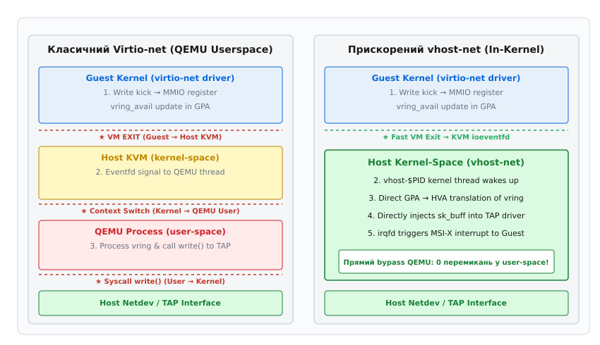
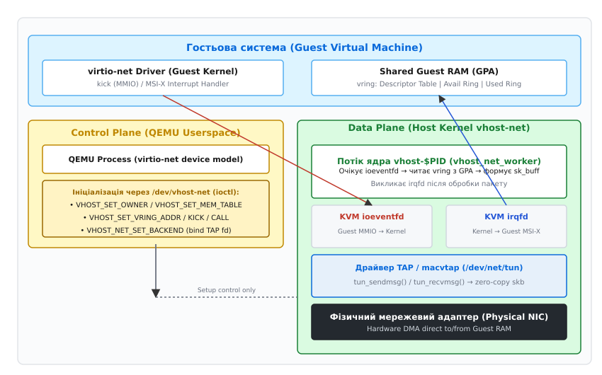
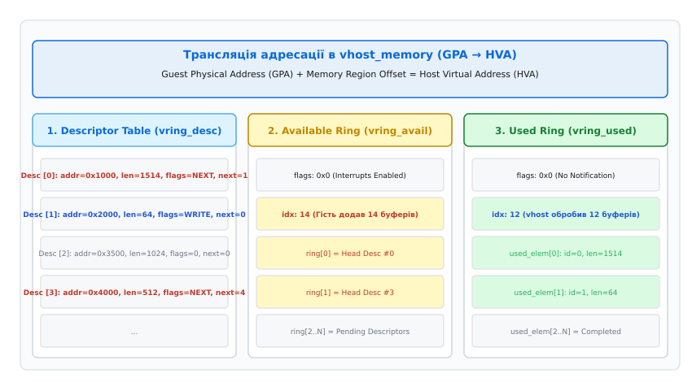

# Прискорення мережі у віртуалізації (vhost-net)

<preknowlist>
- [Мережевий стек Linux](root:sys-unix/network-stack-architecture) — проходження пакетів через ядро, структури sk_buff та події softirq.
- [Інтерфейси TUN та TAP](root:sys-unix/tun-tap) — функціонування віртуальних мережевих адаптерів рівня L2/L3 у просторі користувача.
- [Системний виклик ioctl та VFS](root:sys-unix/socket-api-linux) — взаємодія з символьними пристроями через VFS.
- [Простори імен мережі netns](root:sys-unix/network-namespaces) — ізоляція мережевого стеку у Linux.
</preknowlist>

При передачі трафіку зі швидкістю 10 Гбіт/с паравіртуалізована віртуальна машина з базовим драйвером `virtio-net` генерує понад 800 000 пакетів на секунду. Якщо кожен пакет вимагає перехоплення гіпервізором KVM, виходу з віртуальної машини (VM Exit) та перемикання контексту в процес QEMU у просторі користувача, навантаження на процесор хоста сягає 100%, а затримка обробки пакетів зростає до 15 мікросекунд. Технологія `vhost-net` усуває це вузьке місце за рахунок винесення площини даних (Data Plane) безпосередньо в ядро Linux. Замість перемикання контексту між ядром та користувацьким процесом QEMU, виділений потік ядра `vhost-$PID` напряму обробляє кільцеві буфери у спільній пам'яті гостя та взаємодіє з мережевими пристроями хоста.

## 1. Анатомія затримок віртуалізації: від емуляції до virtio-net у просторі користувача

Для розуміння принципу роботи `vhost-net` необхідно простежити походження продуктивності паравіртуалізованої мережі та фізичні причини, які роблять обробку пакетів у просторі користувача повільною.

У системі віртуалізації KVM гостьова операційна система виконується в ізольованому апаратному режимі процесора (Intel VMX Non-Root Operation або AMD SVM Guest Mode). Коли гостьовий драйвер мережевої карти вирішує відправити пакет, він виконує операцію запису в регістр мережевого адаптера (MMIO — Memory-Mapped I/O або PIO — Port I/O). Оскільки гостьова система не має прямого доступу до фізичного обладнання, ця спроба викликає апаратний вихід процесора — подія **VM Exit**.

З точки зору процесора хоста подія VM Exit означає примусове збереження стану віртуального процесора (VCPU), збереження регістрів у структурі VMCS (Virtual Machine Control Structure) та переключення в режим Host Root Operation. Ціна одного VM Exit на архітектурі x86_64 складає від 1200 до 2000 тактів процесора (на додаток до скидання L1/L2 кешів та інвалідації буфера TLB).

У класичній моделі емуляції мережевих карт (наприклад, Intel e1000 або Realtek RTL8139) кожен мережевий пакет вимагав кількох VM Exit: один для ініціалізації передачі, один для зчитування статусу і один для підтвердження переривання.

З появою стандарту `virtio` (паравіртуалізований драйвер мережі) ситуація покращилася за рахунок впровадження спільної пам'яті між гостем та хостом. Замість емуляції регістрів апаратного забезпечення `virtio` спирається на кільцеві буфери даних — **virtqueue** (або `vring`).

Кільцевий буфер складається з трьох ключових компонентів, розташованих у фізичній пам'яті гостя (GPA — Guest Physical Address):
- **Descriptor Table (Таблиця дескрипторів):** масив структур `vring_desc`, де кожна структура містить фізичну адресу буфера з пакетом у гостьовій пам'яті, довжину даних та прапори (наприклад, прапор ланцюжка `NEXT` або доступності на запис `WRITE`).
- **Available Ring (Кільце доступних буферів):** кільцевий масив індексів із Descriptor Table, які гостьове ядро підготувало для обробки хостом (наприклад, вихідні пакети для відправки).
- **Used Ring (Кільце оброблених буферів):** кільцевий масив індексів та довжин, куди хост записує результати обробки (наприклад, прийняті вхідні пакети або звільнені TX-буфери).

Незважаючи на наявність кільцевих буферів у спільній пам'яті, перші реалізації `virtio-net` у гіпервізорі QEMU здійснювали обробку цих буферів у просторі користувача (userspace). Схема проходження вихідного пакета (TX) виглядала так:

1. Драйвер `virtio-net` у ядрі гостя записує дані пакета в гостьову оперативну пам'ять, формує дескриптори в Descriptor Table та оновлює індекс у `Available Ring`.
2. Драйвер гостя виконує запис у MMIO-регістр сповіщення («kick»), що викликає апаратну подію VM Exit.
3. Модуль ядра KVM перехоплює VM Exit, визначає, що виклик стосується мережевого пристрою QEMU, та надсилає сигнал файловому дескриптору `eventfd`.
4. Потік QEMU у просторі користувача хоста розблоковується (виходить із системного виклику `select()` або `epoll_wait()`).
5. QEMU виконує читання структур `vring` із гостьової пам'яті через віртуальний адресний простір хоста (HVA).
6. QEMU формує пакет і виконує системний виклик `write()` у файловий дескриптор TAP-пристрою (`/dev/net/tun`).
7. Мережевий стек ядра хоста отримує пакет у функції `tun_get_user()`, формує структуру `sk_buff` і направляє пакет далі у віртуальний міст (bridge) або фізичний мережевий адаптер.

Кожен пакет або невелика пачка пакетів проходила шлях із чотирьох перемикань контексту (VM Exit → wakeup QEMU → syscall `write()` → повернення з syscall). Детальний аналіз хронологічного розвитку цих механізмів висвітлено в матеріалі про [історію створення vhost-net](root:sys-unix/vhost-net-acceleration/hist-tap-to-vhost-net.md).

Постійне копіювання даних та переключення між режимами ядра та користувача створювали перешкоду, яку неможливо було подолати шляхом простої оптимізації коду QEMU.

## 2. Архітектура vhost-net: Розділення Control Plane та Data Plane

Технологія `vhost-net` вирішує проблему продуктивності шляхом фундаментального розділення архітектури на дві плоскості: **Control Plane** (Площина управління) та **Data Plane** (Площина даних).


*Порівняння шляху проходження пакета: класичний Virtio-net у просторі користувача QEMU вимагає багаторазових перемикань контексту, тоді як vhost-net обробляє кільця vring безпосередньо всередині ядра.*

У цій архітектурі процес QEMU залишається відповідальним за Control Plane:
- Емуляція PCI-шини віртуальної машини та реєстрація BAR-регістрів.
- Узгодження підтримуваних функцій (Feature Negotiation) між гостевим драйвером та хостом (наприклад, підтримка checksum offload, TSO, multiqueue).
- Налаштування конфігурації MAC-адрес та обробка подій гарячого підключення (hot-plug).

Для обробки Data Plane використовується спеціалізований модуль ядра `vhost_net.ko` та символьний пристрій `/dev/vhost-net`.

Після ініціалізації віртуальної машини QEMU відкриває файл `/dev/vhost-net` і за допомогою серії системних викликів `ioctl()` передає ядру Linux права на обробку кільцевих буферів `virtqueue`. З детальною структурою викликів `ioctl` та полів ядра можна ознайомитися у матеріалі про [інтерфейс системних викликів ioctl та структури ядра /dev/vhost-net](root:sys-unix/vhost-net-acceleration/api-vhost-net-ioctl.md).

Ключовим елементом налаштування `vhost-net` є передача карти пам'яті гостя (`struct vhost_memory`). Оскільки потік ядра `vhost-net` виконується у контексті ядра хоста, він повинен знати, як фізичні адреси гостя (GPA) відображаються на віртуальний адресний простір процесу QEMU (HVA — Host Virtual Address).

Спрощена схема трансляції адрес у ядрі виконується за алгоритмом:

```
HVA = Region.userspace_addr + (GPA - Region.guest_phys_addr)
```

Завдяки переданій таблиці мапування `vhost-net` отримує прямий доступ до пам'яті гостя. У ядрі хоста створюється спеціалізований потік ядра `vhost-$PID` (де `$PID` — PID процесу QEMU). Цей потік виконує функцію `vhost_net_worker()`, яка обробляє кільця `vring` та передає пакети безпосередньо в TAP-пристрій у ядрі, оминаючи процес QEMU.

> 🔧 **Навіщо це.** Розділення Control Plane та Data Plane дозволяє зберегти всі гнучкі можливості управління віртуальною машиною у просторі користувача (QEMU API, libvirt, жива міграція), винесши високочастотну обробку пакетів у ядро для досягнення лінійної швидкості фізичних мережевих адаптерів.

## 3. Механізми безшумного сповіщення: KVM ioeventfd та irqfd

Навіть при винесенні обробки в ядро залишається питання: як ядро KVM та потік `vhost-net` дізнаються про події один одного без залучення гіпервізора QEMU? Відповідь полягає у використанні спеціалізованих системних примітивів ядра Linux: `eventfd`, `ioeventfd` та `irqfd`.


*Взаємодія компонентів vhost-net: QEMU виконує конфігурацію через /dev/vhost-net ioctl, після чого KVM за допомогою ioeventfd та irqfd напряму зв'язує гостьові MMIO/MSI-X події з потоком ядра vhost-$PID та TAP-драйвером.*

### Примітив eventfd

Системний виклик `eventfd()` створює об'єкт сповіщення в ядрі, який представлений у просторі користувача як звичайний файловий дескриптор. Усередині ядра цей об'єкт містить 64-бітний лічильник `uint64_t`. Запис у `eventfd` збільшує лічильник, а читання розблоковує потоки, що очікують на події.

### KVM ioeventfd (Сповіщення від Гостя до vhost-net)

При ініціалізації `vhost-net` процес QEMU створює об'єкт `eventfd` і зв'язує його з адресою MMIO-регістра «kick» пристрою `virtio-net` за допомогою виклику `KVM_IOEVENTFD` до KVM.

Коли гостьовий драйвер виконує запис у регістр `kick`:
1. Процесор виконує VM Exit.
2. Обробник виходів KVM у ядрі (`kvm_x86_ops.handle_exit`) ідентифікує запис у MMIO-адресу, зареєстровану в системі `kvm_io_bus`.
3. Замість повернення управління в простір користувача QEMU, KVM викликає внутрішньоядерну функцію `eventfd_signal()`.
4. Лічильник `eventfd` збільшується, що негайно розблоковує чергу очікування `vhost_poll_wakeup()` потоку ядра `vhost-$PID`.
5. Потік `vhost-$PID` прокидається і починає зчитувати дескриптори з `Available Ring`.

Уся ця послідовність виконується повністю усередині ядра Linux під час обробки VM Exit, усуваючи необхідність відновлення контексту користувацького процесу QEMU.

### KVM irqfd (Сповіщення від vhost-net до Гостя)

Зворотний шлях — сповіщення гостьової операційної системи про прийом нових пакетів або про завершення передачі вихідних буферів — реалізується через **irqfd**.

1. QEMU створює другий `eventfd` і реєструє його в KVM за допомогою виклику `KVM_IRQFD`, вказуючи номер віртуального переривання MSI-X віртуальної машини.
2. Цей самий `eventfd` передається пристрою `vhost-net` через системний виклик `ioctl(VHOST_SET_VRING_CALL)`.
3. Коли потік `vhost-net` закінчує обробку буферів у `vring`, він сигналізує об'єкт `eventfd`.
4. KVM перехоплює сигнал і за допомогою функції `kvm_set_irq_inatomic()` ін'єктує віртуальне переривання MSI-X безпосередньо у віртуальний процесор (VCPU) гостя.

Послідовність викликів при обробці вихідного пакета (TX) виглядає так:

```
Guest virtio-net → MMIO write (kick)
  ↓
KVM VM Exit → kvm_io_bus_write()
  ↓
eventfd_signal() → wakeup vhost-$PID thread
  ↓
vhost_net_handle_tx_kick() → read vring_avail from GPA
  ↓
tun_sendmsg() → sk_buff injected into Host Netdev
  ↓
eventfd_signal(irqfd) → kvm_set_irq_inatomic() → Guest MSI-X Interrupt
```

Завдяки поєднанню `ioeventfd` та `irqfd` обмін сповіщеннями між гостем та бекендом `vhost-net` відбувається через швидкі внутрішньоядерні сигнали.

## 4. Механіка обробки кільцевих буферів vring та Zero-Copy Transmit

У центрі обміну даними між `vhost-net` та гостьовою операційною системою лежать кільцеві буфери `virtqueue`.


*Мапування структур virtqueue у спільній пам'яті: Descriptor Table описує буфери даних, Available Ring містить готові для обробки дескриптори від гостя, а Used Ring повертає результати обробки хостом.*

### Алгоритм обробки вихідних пакетів (TX) та міжпроцесорна синхронізація

Потік ядра `vhost-net` виконує обробку кільця `Available Ring` за наступним алгоритмом:

1. Зчитує поточний індекс `avail->idx` з пам'яті гостя (транслюючи GPA у HVA).
2. Виконує бар'єр зчитування пам'яті `smp_rmb()`. Це гарантує, що процесор хоста прочитає елементи масиву `avail->ring` лише **після** того, як переконається у збільшенні індексу `avail->idx`. Без цього бар'єра позачергове виконання інструкцій (out-of-order execution) у сучасних процесорах x86/ARM могло б призвести до читання застарілих дескрипторів.
3. Витягує номер головного дескриптора `head = avail->ring[last_avail_idx % ring_size]`.
4. Проходить по ланцюжку дескрипторів `vring_desc[head]`, збираючи фрагменти пакета.
5. Транслює GPA кожного дескриптора в HVA адреси хоста.
6. Формує структуру `sk_buff` ядра хоста і передає її в мережевий пристрій TAP через внутрішньоядерний інтерфейс сокетів (`tun_sendmsg()`).
7. Записує номер головного дескриптора `head` та кількість переданих байтів у `used->ring[used->idx % ring_size]`.
8. Виконує бар'єр запису пам'яті `smp_wmb()` перед збільшенням лічильника `used->idx`, щоб гість побачив заповнені дескриптори до виклику переривання.
9. Збільшує `used->idx` і перевіряє, чи вимагає гість переривання (перевірка прапора `avail->flags & VRING_AVAIL_F_NO_INTERRUPT`).
10. Сигналізує `irqfd` для виклику переривання у гості.

### Модель Packed Virtqueues у Virtio 1.1

Починаючи зі специфікації Virtio v1.1, на додаток до класичних Split Virtqueues (де дескриптори, Available та Used rings розміщені в окремих масивах), було впроваджено формат **Packed Virtqueues**.

У форматі Packed Virtqueue:
- Усі три структури об'єднані в єдиний лінійний масив дескрипторів `struct vring_packed_desc`.
- Замість ведення індексів `avail->idx` та `used->idx` застосовуються двофазові прапорці заповнення `AVAIL_FLAG (1 << 7)` та `USED_FLAG (1 << 15)`.
- Гість і хост інвертують значення прапорця на кожному повному оберті кільця.

Завдяки компактному лінійному розташуванню у пам'яті Packed Virtqueues зменшують кількість промахів кешу L1/L2 (cache misses) на 25–30%, що дає суттєвий приріст продуктивності у `vhost-net` при обробці високої щільності дрібних пакетів.

### Механізм Zero-Copy Transmit у vhost-net

У класичній обробці мережевого трафіку при передачі пакета з гостя ядро `vhost-net` виділяє нову структуру `sk_buff` і копіює вміст пам'яті гостя за допомогою функції `copy_from_user()`. При відправці великих пакетів (наприклад, при використанні Jumbo Frames 9000 байт або TSO — TCP Segmentation Offload розвантаженні до 64 КБ) копіювання пам'яті навантажує шину RAM та процесор.

Для усунення цього копіювання в `vhost-net` впроваджено режим **Zero-Copy Transmit**:

1. Замість копіювання байтів потік `vhost-net` викликає функцію ядра `get_user_pages_fast()` або `pin_user_pages()`. Ця функція закріплює (pin) фізичні сторінки оперативної пам'яті гостя в RAM хоста, запобігаючи їх витісненню в swap.
2. Ядро формує структуру `sk_buff`, де заголовок пакета (Ethernet/IP/TCP) копіюється, а тіло пакета прив'язується через масив сторінок у пейджингові дескриптори `skb_fill_page_desc()`.
3. Структура `sk_buff` передається безпосередньо в чергу фізичного мережевого адаптера хоста.
4. Фізичний мережевий адаптер за допомогою свого контролера DMA (Direct Memory Access) вичитує вміст пакета **безпосередньо з фізичних сторінок пам'яті гостя**.
5. Після того, як мережевий адаптер завершує відправку кадру та генерує переривання TX completion, ядро хоста викликає зворотну функцію `vhost_zerocopy_signal()`, яка звільняє закріплені сторінки гостя і сигналізує про завершення в `Used Ring`.

> ⚠️ **Поріг доцільності Zero-Copy.** Закріплення сторінок пам'яті за допомогою `get_user_pages_fast()` та синхронізація DMA вимагають додаткових обчислювальних витрат ядра. Для дрібних пакетів (менше 1024 байтів) витрати на закріплення сторінок перевищують витрати на пряме копіювання пам'яті. Тому в ядрі Linux за замовчуванням Zero-Copy вмикається лише для пакетів, розмір яких перевищує порогове значення (параметр модуля `vhost_net.experimental_zcopytx`).

## 5. Масштабування: Multiqueue vhost-net, NUMA та прив'язка до ядер CPU

Однопоточна обробка мережевого трафіку утворює бар'єр продуктивності на рівні 1,5–2 мільйонів пакетів на секунду (Mpps) для одного процесорного ядра. Сучасні багатоядерні системи вимагають масштабування обробки трафіку по багатьох ядрах CPU.

### Багаточерговий режим (Multiqueue virtio-net / vhost-net)

Технологія **Multiqueue** дозволяє створити кілька пар черг RX/TX для одного паравіртуалізованого мережевого пристрою.

При активації багаточергового режиму (наприклад, 8 черг):
- У гості драйвер `virtio-net` реєструє 8 векторів MSI-X та 8 паралельних черг `virtqueue`.
- У ядрі хоста модуль `vhost-net` створює 8 окремих потоків ядра `vhost-$PID` (по одному потоку на кожну пару черг RX/TX).
- Кожен потік `vhost-$PID` обробляє свою власну чергу `vring` незалежно від інших, усуваючи блокування (spinlocks) між ядрами.

Розподіл вихідного трафіку у гості здійснюється за допомогою хешування потоків (Receive Side Scaling — RSS або Virtio Net-hash), а вхідного трафіку на хості — за допомогою налаштування багаточергового TAP-інтерфейсу (multiqueue TAP).

### Прив'язка до ядер CPU та вплив архітектури NUMA

Двома найпоширенішими причинами падіння продуктивності `vhost-net` у високонавантажених серверах є неузгодженість кешів (Cache Bouncing) та міжвузлові переходи у системі NUMA (Non-Uniform Memory Access).

Якщо потік ядра `vhost-$PID` виконується на процесорному ядрі Node 0, а фізичний мережевий адаптер прив'язаний до PCIe-контролера Node 1:
1. Контролер DMA мережевого адаптера змушений зчитувати пам'ять гостя через міжпроцесорну шину (Intel UPI або AMD Infinity Fabric).
2. Затримка доступу до пам'яті зростає на 30–50%.
3. Кожна операція передачі пакета викликає інвалідацію кешів L3 сусіднього процесорного сокета.

Для досягнення максимальної продуктивності застосовують сувору прив'язку потоків (CPU Affinity):

```bash
# Прив'язка потоку vhost до конкретного фізичного ядра NUMA-вузла
taskset -pc 4 $(pgrep vhost-$PID)
```

Також для кожного потоку `vhost-$PID` налаштовують прив'язку переривань IRQ фізичної мережевої карти до тих самих ядер CPU через `/proc/irq/$IRQ/smp_affinity_list`.

Приклади програмного налаштування бекенду та параметрів ініціалізації наведені у матеріалі про [практичний приклад програмування vhost-net бекенду на C та C++](root:sys-unix/vhost-net-acceleration/proj-vhost-net-setup.md).

## 6. Практичне налаштування, інспекція та діагностика

Для активації прискорення `vhost-net` у середовищі віртуалізації KVM/QEMU використовують спеціальні параметри конфігурації.

### Конфігурація в libvirt (XML)

У маніфесті віртуальної машини libvirt драйвер `vhost` вказується у секції `<interface>`:

```xml
<interface type='bridge'>
  <mac address='52:54:00:12:34:56'/>
  <source bridge='br0'/>
  <model type='virtio'/>
  <driver name='vhost' queues='4' rx_queue_size='1024' tx_queue_size='1024'>
    <host csum='on' gso='on' tso4='on' tso6='on' ecn='on' ufo='on'/>
    <guest csum='on' tso4='on' tso6='on'/>
  </driver>
</interface>
```

Параметр `name='vhost'` підключає бекенд `/dev/vhost-net`, `queues='4'` вмикає багаточерговий режим, а `rx_queue_size='1024'` збільшує розмір кільця для запобігання втратам пакетів при сплесках трафіку.

### Запуск у чистому QEMU

При прямому запуску QEMU з командного рядка використовують параметр `vhost=on`:

```bash
qemu-system-x86_64 \
  -enable-kvm \
  -m 8192 -smp 4 \
  -netdev tap,id=net0,ifname=tap0,vhost=on,queues=4 \
  -device virtio-net-pci,netdev=net0,mac=52:54:00:aa:bb:cc,mq=on,vectors=10 \
  -drive file=guest.qcow2,if=virtio
```

Зверніть увагу на параметр `vectors=10`: кількість MSI-X векторів повинна дорівнювати `2 * queues + 2` (по один вектори на RX та TX для кожної черги плюс вектор конфігурації та резерв).

### Інспекція системного стану vhost-net

Перевірити стан активних потоків `vhost-net` у працюючій системі можна за допомогою команд CLI та файлової системи `/proc`:

```bash
# Перевірка наявності модулів ядра
lsmod | grep vhost

# Пошук потоків ядра vhost
ps aux | grep vhost-

# Перевірка відкритих файлових дескрипторів процесу QEMU
ls -l /proc/$(pgrep qemu)/fd | grep vhost
```

Якщо бекенд працює правильно, у списку відкритих файлів процесу QEMU буде присутній символьний пристрій `/dev/vhost-net`.

### Діагностика через ftrace та eBPF

Для вимірювання затримок обробки пакетів усередині `vhost-net` використовують tracepoints ядра Linux, доступні в підсистемі `/sys/kernel/tracing/events/vhost_net/`:
- `vhost_net:vhost_net_instantiate` — ініціалізація бекенду.
- `vhost_net:vhost_net_vring_accept` — зчитування черги.

Приклад скріпта `bpftrace` для моніторингу затримок обробки вихідних пакетів потоком `vhost`:

```bpftrace
tracepoint:vhost_net:vhost_net_handle_tx_kick
{
    @start[tid] = nsecs;
}

tracepoint:vhost_net:vhost_net_handle_tx_done
/@start[tid]/
{
    $duration = nsecs - @start[tid];
    @tx_latency_us = hist($duration / 1000);
    delete(@start[tid]);
}
```

Цей скрипт будує гістограму часу (в мікросекундах), який потік ядра витрачає на спустошення кільця `Available Ring` після отримання сповіщення `kick`.

## 7. Межі vhost-net та наступний крок: vhost-user (DPDK) і vDPA

Незважаючи на високу ефективність `vhost-net` порівняно з користувацьким бекендом QEMU, на швидкостях 40 Гбіт/с, 100 Гбіт/с та вище технологія `vhost-net` впирається у фундаментальні обмеження самого ядра Linux.

### Межі vhost-net
1. **Накладні витрати мережевого стека ядра:** Формування та обробка об'єктів `sk_buff`, проходження через підсистему Softirq (`net_rx_action`) та обробка правил `iptables`/`nftables` вимагають сотень тактів процесора на кожен пакет.
2. **Переривання та контекстні перемикання:** Навіть із `ioeventfd` подія VM Exit вимагає апаратної зміни режиму процесора. При потоці у 10 мільйонів пакетів на секунду процесор витрачає більшу частину часу на обробку VM Exit.

### vhost-user (DPDK): Повний Kernel Bypass

Для телекомунікаційних систем (5G Core, NFV) та високочастотного трейдингу було розроблено протокол **vhost-user**.

У цій архітектурі Data Plane виноситься з ядра хоста назад у простір користувача, але не в QEMU, а в спеціалізований віртуальний комутатор на базі **DPDK** (наприклад, Open vSwitch з DPDK).

- QEMU та OVS-DPDK спілкуються через UNIX-сокет.
- Пам'ять віртуальної машини виділяється через велетенські сторінки **Hugepages** (2 МБ або 1 ГБ) і мапується безпосередньо у процес OVS-DPDK.
- Драйвер **PMD (Poll Mode Driver)** усередині OVS-DPDK постійно опитує кільця `vring` у нескінченному циклі без використання переривань і без виклику системних функцій ядра.

`vhost-user` дозволяє досягти продуктивності у 20–40 мільйонів пакетів на секунду на одне процесорне ядро з затримками менше 1 мікросекунди.

### vDPA (virtio Data Path Acceleration)

Найновішим етапом еволюції є технологія **vDPA**. Вона об'єднує стандартизований програмний інтерфейс `virtio` з апаратним оминанням ядра за допомогою SmartNIC та DPU (Data Processing Unit).

У схемі vDPA:
- Control Plane залишається в QEMU/libvirt (стандартний PCI-пристрій `virtio-net` для гостя).
- Data Plane оминає не лише QEMU, але й ядро хоста `vhost-net`: апаратний контролер SmartNIC напряму читає та записує кільця `vring` у пам'яті гостя через шину PCIe DMA.

Завдяки цьому віртуальна машина отримує продуктивність фізичного пристрою (SR-IOV Passthrough), зберігаючи при цьому всі переваги паравіртуалізації, включаючи незалежність від апаратних драйверів та підтримку живої міграції (Live Migration).

Зведена таблиця еволюції технологій мережевого прискорення віртуалізації:

| Технологія | Де виконується Data Plane | Затримка (Latency) | Пропускна здатність | Навантаження на CPU |
| :--- | :--- | :--- | :--- | :--- |
| **Емуляція (e1000)** | QEMU Userspace | ~15–20 мкс | < 1 Gbps | Надсоке |
| **Virtio-net (QEMU)** | QEMU Userspace | ~10–12 мкс | ~2–3 Gbps | Високе |
| **vhost-net** | Linux Kernel (`vhost_net.ko`) | ~2–4 мкс | ~10–20 Gbps | Середнє |
| **vhost-user (DPDK)** | Userspace PMD (OVS-DPDK) | < 1 мкс | ~40–100 Gbps | Високе (100% polling core) |
| **vDPA / SmartNIC** | Hardware (ASIC / DPU) | < 0.8 мкс | Hardware Line Rate | Нульовое (Offloaded) |

Мережева підсистема `vhost-net` залишається золотим стандартом для універсальних серверних інфраструктур, забезпечуючи оптимальний баланс між продуктивністю, надійністю та простотою обслуговування у ядрі Linux.
