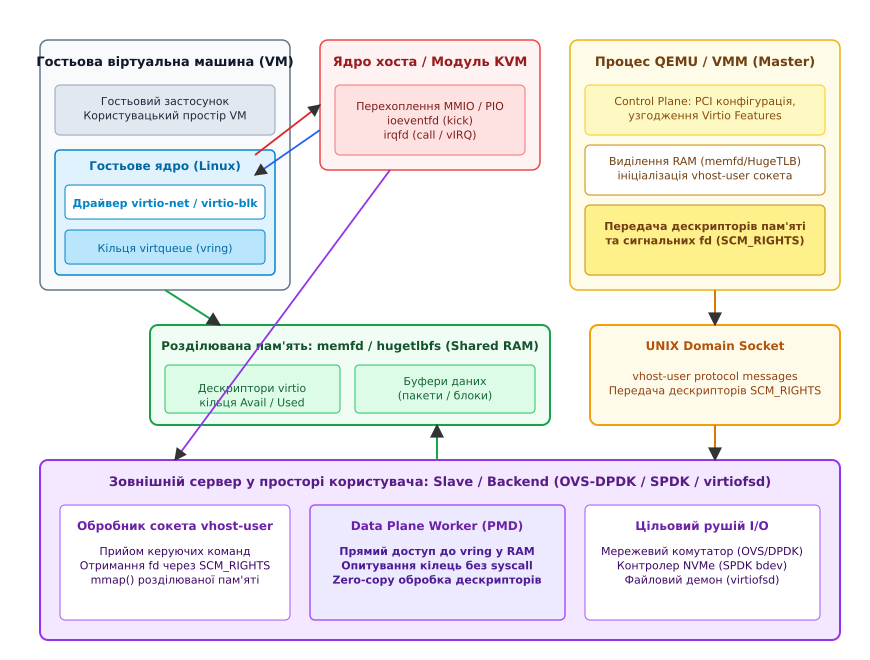
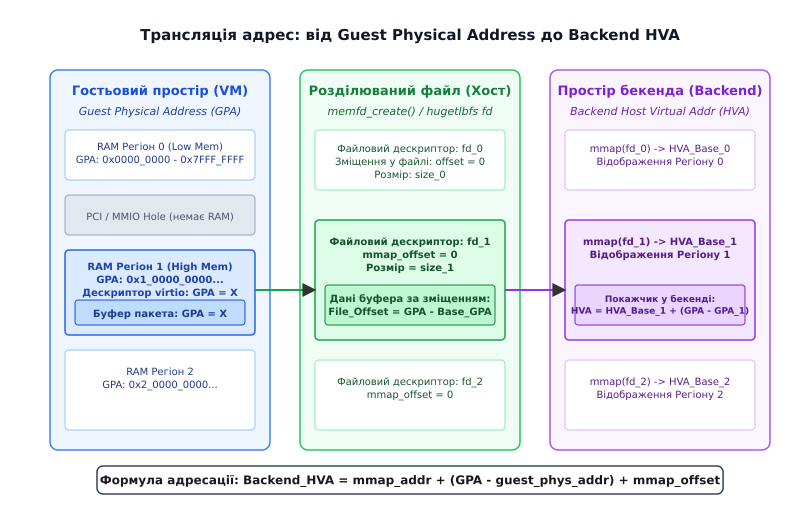
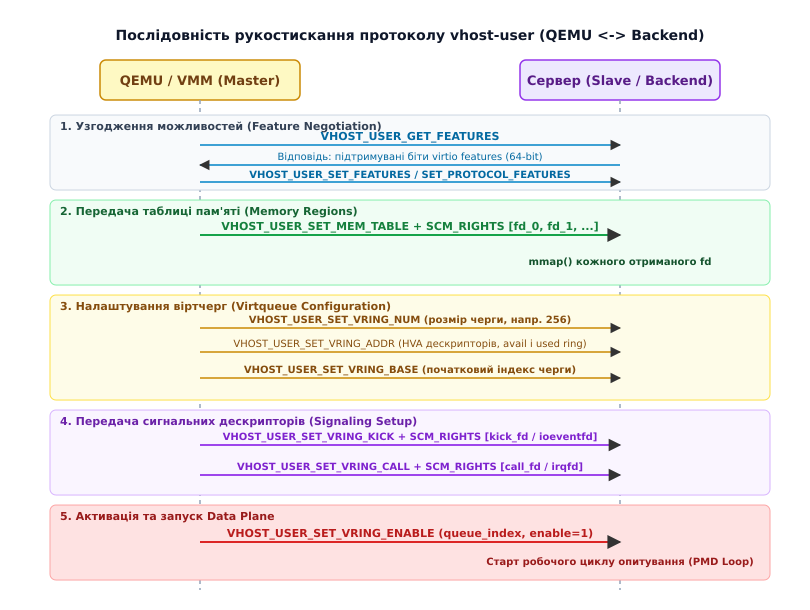

# vhost-user: дата-плейн virtio в чужому процесі простору користувача

<preknowlist>
- [virtio: паравіртуалізована шина й віртчерги](root:sys-unix/virtio-transport) — паравіртуалізований стандарт черг буферів (virtqueue, vring) між гостьовою операційною системою та хостом.
- [vhost і vDPA: хто насправді обслуговує віртчергу](root:sys-unix/vhost-and-vdpa) — винесення обробки кілець virtio з простору емулятора QEMU в ядро Linux або апаратний прискорювач.
- [Архітектура KVM і QEMU](root:sys-unix/kvm-and-qemu-architecture) — взаємодія гіпервізора ядра KVM (процесор і MMU) з емулятором пристроїв простору користувача QEMU.
- [Сокети домену Unix і передача дескрипторів](root:sys-unix/unix-domain-sockets) — міжпроцесна взаємодія через локальні сокети та механізм передачі файлових дескрипторів `SCM_RIGHTS`.
- [memfd_create: безіменний файл у пам'яті й пломби](root:sys-unix/memfd-create) — виділення анонімної оперативної пам'яті у вигляді файлового дескриптора для розділення між процесами.
- [eventfd і futex: сповіщення й дешеве очікування](root:sys-unix/eventfd-and-futex) — дескриптори-лічильники ядра для швидкої сигналізації без створення важких каналів IPC.
- [Файлова система hugetlbfs та великі сторінки](root:sys-unix/hugetlbfs-thp-kernel-interfaces) — виділення неперервної фізичної пам'яті сторінками розміром 2 МБ або 1 ГБ для мінімізації промахів TLB.
</preknowlist>

Коли гостьова операційна система всередині віртуальної машини відправляє мережевий пакет зі швидкістю 100 Гбіт/с або виконує 500 000 випадкових операцій читання з NVMe-накопичувача за секунду, класична модель віртуалізації введення-виведення стає непереборним вузьким місцем. Кожен запис у віртуальний регістр сповіщення черги (doorbell) викликає апаратне переривання віртуального процесора (VM Exit). Модуль KVM у ядрі хоста перехоплює цей вихід, перемикає контекст у процес емулятора QEMU, QEMU зчитує дескриптор із пам'яті гостя, формує системний виклик ядра хоста (наприклад, `write()` у віртуальний TAP-інтерфейс або `pwritev()` у блоковий файл) і повертає керування назад. Цей безперервний міжпроцесний «пінг-понг» створює затримки в десятки мікросекунд і витрачає гігагерци процесорного часу виключно на збереження регістрів та перемикання таблиць сторінок.

Ядерний механізм `vhost-net` частково вирішив цю проблему, перенісши обробку віртчерг у ядерний потік `vhost_worker`. Проте сучасні комутатори (Open vSwitch з DPDK) та рушії сховищ (SPDK) самі функціонують у просторі користувача: вони працюють у режимі неперервного опитування (Poll Mode Driver, PMD) і взагалі не використовують системні виклики ядра. Щоб з'єднати віртуальну машину з таким сервером без проходження трафіку через ядро, знадобився протокол, здатний віддати дата-плейн virtio абсолютно незалежному процесу.

Цим стандартом став **vhost-user** — бінарний протокол міжпроцесної взаємодії (IPC), що дозволяє гіпервізору (Master / Frontend) делегувати пряму роботу з пам'яттю та чергами virtio зовнішньому користувацькому процесу (Slave / Backend) через локальний сокет Unix та розділювану пам'ять (Shared Memory).

[Історичний розвиток шляхів даних та появу стандарту vhost-user](root:sys-unix/vhost-user-protocol/hist-userspace-datapaths.md) детально розібрано в хронологічному огляді еволюції віртуалізації від перших емуляторів до сучасних хмарних систем.

## Архітектурний розподіл: Control Plane проти Data Plane

У моделі vhost-user віртуальний пристрій чітко розпадається на два функціональні рівні:

1. **Рівень керування (Control Plane)**: залишається всередині головного процесу гіпервізора (найчастіше QEMU або Rust-VMM / Cloud-Hypervisor). Гіпервізор емулює шину PCI, показує гостю конфігураційний простір пристрою, обробляє запити ACPI, узгоджує підтримувані функції (virtio feature bits) і виділяє оперативну пам'ять для віртуальної машини.
2. **Рівень даних (Data Plane)**: повністю передається зовнішньому процесу-серверу (наприклад, `ovs-vswitchd` з модулем DPDK для мережі, `spdk_tgt` для блокових пристроїв чи демону `virtiofsd` для файлових систем). Цей процес напряму читає дескриптори virtio з пам'яті VM, забирає або записує корисне навантаження і сигналізує гостю про завершення.


*Архітектурний розподіл vhost-user: QEMU керує конфігурацією через UNIX сокет, тоді як зовнішній сервер DPDK/SPDK напряму працює зі спільною пам'яттю гостя*

Для віртуальної машини ця підміна залишається абсолютно прозорою. Гостьове ядро Linux завантажує стандартний драйвер `virtio-net` або `virtio-blk`, бачить звичайний пристрій на віртуальній шині PCI і наповнює ті самі структури кілець virtqueue. Гостьова ОС не знає і не має знати, хто саме забирає її мережеві пакети: процес QEMU, ядерний потік чи ізольований демон простору користувача.

## Транспортний рівень: сокети домену Unix та SCM_RIGHTS

Зв'язок між гіпервізором та сервером організовується через локальний потоковий сокет домену Unix (`AF_UNIX`, `SOCK_STREAM`). Вибір цього транспорту обумовлений двома ключовими факторами безпеки та функціональності:
- **Ізоляція прав доступу**: сокет представляється файлом у файловій системі (наприклад, `/var/run/openvswitch/vhost-user-net0`). Доступ до нього регулюється стандартними правами доступу Unix (POSIX permissions), списками контролю доступу (ACL) та політиками SELinux/AppArmor. Гіпервізор і сервер можуть працювати від імені різних непривілейованих користувачів у різних просторах імен (namespaces) і cgroups.
- **Передача файлових дескрипторів**: протокол Unix domain sockets підтримує надсилання службових керуючих повідомлень (ancillary data) за допомогою механізму `SCM_RIGHTS` (Socket Control Message / Rights). Це дозволяє ядру продублювати відкритий файловий дескриптор із таблиці дескрипторів одного процесу в таблицю іншого процесу.

Саме через `SCM_RIGHTS` гіпервізор передає серверу дескриптори розділюваної пам'яті віртуальної машини та дескриптори подій `eventfd`. Без цього механізму безпечний zero-copy доступ між двома непов'язаними процесами в Linux був би неможливим без надання серверу небезпечних глобальних привілеїв читання фізичної пам'яті (`/dev/mem` або `CAP_SYS_RAWIO`).

> 🔧 **Навіщо це в реальній розробці:**
> Завдяки передачі дескрипторів через сокет, падіння або аварійна зупинка процесу бекенда (наприклад, аварія комутатора DPDK через помилку в коді обробки пакетів) не призводить до зависання чи краху всієї операційної системи хоста. Ядро хоста залишається неушкодженим, а гіпервізор фіксує закриття сокета, тимчасово призупиняє віртуальну чергу і може автоматично перепідключитися після перезапуску демона.

## Розділювана пам'ять (Shared Memory) та трансляція адрес

Щоб зовнішній процес міг читати й писати в буфери віртуальної машини без участі посередників, уся оперативна пам'ять гостя має бути спільною (shared).

### Виділення пам'яті через memfd та HugeTLB

За замовчуванням QEMU виділяє пам'ять віртуальної машини як приватні анонімні сторінки через `mmap(MAP_ANONYMOUS | MAP_PRIVATE)`. Для vhost-user такий підхід непридатний, оскільки анонімні сторінки не мають файлового дескриптора, який можна було б передати через сокет.

Тому віртуальні машини, що використовують vhost-user, запускаються з бекендом пам'яті на базі файлових дескрипторів:
- **`memfd_create`**: створює безіменний анонімний файл у пам'яті (підсистема `shmem`/`tmpfs`), доступний через числовий дескриптор;
- **`hugetlbfs`**: файли на спеціальній файловій системі великих сторінок (HugePages розміром 2 МБ або 1 ГБ). Використання HugePages є обов'язковим для високопродуктивних мережевих систем (DPDK), оскільки це скорочує кількість записів у буфері трансляції адрес процесора (TLB) у 512 або 262144 разів, усуваючи промахи сторінкового транслятора при інтенсивному ввіді-виводі.

### Передача таблиці пам'яті: `VHOST_USER_SET_MEM_TABLE`

На етапі ініціалізації гіпервізор відправляє серверу повідомлення `VHOST_USER_SET_MEM_TABLE`. Разом із цим повідомленням через масив допоміжних даних `SCM_RIGHTS` передаються файлові дескриптори `fd[0]`, `fd[1]`, ..., що відповідають неперервним областям фізичної пам'яті віртуальної машини.

Структура повідомлення містить масив регіонів `struct vhost_user_memory_region`:
- `guest_phys_addr` (GPA): початкова адреса області у фізичному адресному просторі гостя;
- `memory_size`: розмір області в байтах;
- `userspace_addr` (QEMU HVA): віртуальна адреса цієї області в адресному просторі процесу QEMU;
- `mmap_offset`: зміщення від початку переданого файлу, з якого починається цей регіон.

Отримавши дескриптор `fd[i]`, сервер виконує власний системний виклик `mmap()`:

:::tabs
```c
/* Відображення отриманого дескриптора пам'яті в адресному просторі сервера на мові C */
void *backend_hva_base = mmap(NULL, region->memory_size + region->mmap_offset,
                              PROT_READ | PROT_WRITE, MAP_SHARED,
                              fds[i], 0);
if (backend_hva_base == MAP_FAILED) {
    perror("mmap failed");
    return -1;
}
```
```cpp
#include <sys/mman.h>
#include <system_error>
#include <cstddef>

/* Ідіоматичне відображення регіону пам'яті в C++ з контролем помилок через винятки */
void* map_guest_region(std::size_t size, std::size_t offset, int fd) {
    void* addr = ::mmap(nullptr, size + offset,
                        PROT_READ | PROT_WRITE, MAP_SHARED,
                        fd, 0);
    if (addr == MAP_FAILED) {
        throw std::system_error(errno, std::generic_category(), "Помилка mmap регіону");
    }
    return addr;
}
```
:::

Тепер одна й та сама фізична пам'ять одночасно відображена в три адресні простори:
1. Фізичний адресний простір гостя (GPA — Guest Physical Address);
2. Віртуальний адресний простір процесу QEMU (QEMU HVA — Host Virtual Address);
3. Віртуальний адресний простір зовнішнього сервера (Backend HVA).


*Трансляція адрес: дескриптор virtio містить GPA буфера, який сервер транслює у власний вказівник Backend HVA через таблицю відображень*

### Алгоритм трансляції GPA → Backend HVA

Коли гостьовий драйвер кладе в кільце virtqueue дескриптор, він записує в поле `addr` фізичну адресу буфера в пам'яті гостя (`GPA`). Зовнішній сервер не може звернутися за цією адресою напряму, оскільки вона належить гостю, а не його віртуальному адресному простору.

Сервер знаходить відповідний регіон у своїй локальній таблиці пам'яті та обчислює прямий вказівник:

```
GPA ∈ [guest_phys_addr, guest_phys_addr + memory_size)
Backend_HVA = Backend_Mmap_Base + (GPA - guest_phys_addr) + mmap_offset
```

У високопродуктивних рушіях (DPDK/SPDK) ця трансляція оптимізується за допомогою кешу прямого відображення або таблиць швидкого пошуку, щоб перетворення GPA у вказівник пам'яті займало не більше кількох процесорних тактів без виклику будь-яких функцій ядра.

[Повну специфікацію двійкових структур і кодів команд протоколу](root:sys-unix/vhost-user-protocol/api-protocol-messages.md) наведено в довідковому описі протокольних повідомлень.

## Формати черг: Split Ring проти Packed Ring

Протокол vhost-user підтримує два формати організації кілець virtqueue в спільній пам'яті:

1. **Класичний розділений формат (Split Virtqueue)**: пам'ять черги розбивається на три окремі масиви — таблицю дескрипторів (`Descriptor Table`), кільце доступних індексів (`Available Ring`) та кільце використаних індексів (`Used Ring`). Для передачі одного буфера процесор звертається до трьох різних областей пам'яті, що створює до трьох промахів кешу L1/L2.
2. **Компактний упакований формат (Packed Virtqueue, стандарт virtio 1.1, прапорець `VIRTIO_F_RING_PACKED`)**: усі три структури об'єднуються в єдиний неперервний масив 16-байтових дескрипторів. Стан володіння буфером (чи належить він гостю або хосту) кодується за допомогою одного біта полярності (Wrap Counter) у полі прапорців дескриптора. При використанні Packed Ring потік опитування сервера vhost-user вичитує дескриптор рівно за один доступ до кеш-лінії процесора, що скорочує затримки на 15–25% порівняно зі Split Ring.

## Сигналізація: переривання, ioeventfd та Poll Mode

Будь-який пристрій введення-виведення потребує двостороннього сповіщення:
1. **Гість → Хост (Kick)**: гість повідомляє, що підготував нові дескриптори в кільці Available Ring;
2. **Хост → Гість (Call / Interrupt)**: хост повідомляє, що обробив дескриптори, поклав результат у Used Ring і згенерував переривання.

У класичному QEMU обидві операції проходять через важкі механізми переривань. У vhost-user сигналізація оптимізована через файлові дескриптори подій ядра Linux — `eventfd`.

```
Гість (VM)  ──[MMIO Write]──> KVM (ioeventfd) ──[kick_fd]──> vhost-user Server
Гість (VM)  <──[vIRQ Inject]── KVM (irqfd) <──[call_fd]─── vhost-user Server
```

### Механізм Kick: KVM ioeventfd

1. Гіпервізор реєструє в модулі ядра KVM спеціальний `ioeventfd`, прив'язаний до адреси регістра черги (queue notify register).
2. За допомогою повідомлення `VHOST_USER_SET_VRING_KICK` цей дескриптор передається зовнішньому процесу як `kick_fd`.
3. Коли гостьовий процесор виконує запис у регістр сповіщення, KVM перехоплює запис і замість виходу в простір користувача QEMU миттєво збільшує лічильник у відповідному `eventfd`.
4. Сервер, який слухає `kick_fd` (через `epoll_wait` або опитування), миттєво прокидається й починає обробку дескрипторів.

### Механізм Call: KVM irqfd

1. Гіпервізор створює дескриптор `eventfd` і реєструє його в KVM як джерело ін'єкції переривання (механізм `irqfd`).
2. Повідомленням `VHOST_USER_SET_VRING_CALL` дескриптор передається серверу як `call_fd`.
3. Щойно сервер завершує обробку пакета чи блокового запиту, він викликає звичайний `write(call_fd, &value, sizeof(value))`.
4. KVM миттєво генерує віртуальне переривання (vIRQ) безпосередньо у відповідний vCPU гостьової системи через апаратні механізми Posted Interrupts (APICv / AVIC), повністю минаючи процес QEMU.

### Режим неперервного опитування (Poll Mode Driver)

У сценаріях екстремальної продуктивності (100 Гбіт/с Ethernet або сотні тисяч IOPS на NVMe) навіть виклики `eventfd` та переривання стають занадто повільними. Тому сервер vhost-user активує біти пригнічення сповіщень у структурах virtqueue:
- `VRING_AVAIL_F_NO_INTERRUPT`: гість просить сервер не надсилати переривання через `call_fd`, оскільки гостьовий драйвер сам перевіряє Used Ring;
- `VRING_USED_F_NO_NOTIFY`: сервер виставляє цей прапорець, наказуючи гостю не виконувати VM Exit і не писати в регістр сповіщення при додаванні нових пакетів.

У цьому режимі робочий потік сервера (PMD-потік у DPDK або нитка опитування в SPDK) закріплюється за окремим фізичним ядром процесора (CPU Pinning) і в нескінченному циклі опитує індекси кілець у спільній оперативній пам'яті. Обробка пакетів відбувається з нульовою кількістю системних викликів, нульовою кількістю переривань і нульовою кількістю перемикань контексту.

## Життєвий цикл та послідовність рукостискання (Handshake)

Встановлення з'єднання між гіпервізором та сервером підпорядковане чіткому протоколу ініціалізації. Будь-яке порушення порядку викликів призведе до спроби доступу за некоректними адресами й аварійного завершення процесу.


*Покроковий життєвий цикл з'єднання: від узгодження бітів розширень до активації віртчерги*

Процес ініціалізації розбивається на п'ять послідовних фаз:

### Фаза 1: Узгодження можливостей (Feature Negotiation)
- QEMU надсилає `VHOST_USER_GET_FEATURES`. Сервер повертає бітову маску підтримуваних можливостей virtio (наприклад, підтримка контрольних сум, розріджених буферів, довжини черги).
- QEMU відправляє `VHOST_USER_SET_FEATURES` із фінальним набором узгоджених бітів.
- За наявності біта `VHOST_USER_F_PROTOCOL_FEATURES`, сторони додатково викликають `VHOST_USER_GET_PROTOCOL_FEATURES` та `VHOST_USER_SET_PROTOCOL_FEATURES` для узгодження специфічних розширень самого vhost-user (мультичерговість `MQ`, жива міграція, зворотний канал `SLAVE_REQ`).

### Фаза 2: Налаштування пам'яті (Memory Mapping)
- QEMU відправляє `VHOST_USER_SET_MEM_TABLE` разом із дескрипторами `SCM_RIGHTS`.
- Сервер відображає отримані області пам'яті у свій адресний простір через `mmap()`. З цього моменту сервер має фізичну можливість звертатися до будь-якої точки оперативної пам'яті гостя.

### Фаза 3: Конфігурація віртчерг (Virtqueue Configuration)
- `VHOST_USER_SET_VRING_NUM`: задає кількість елементів у черзі (розмір кільця, наприклад, 256 або 1024 дескриптори).
- `VHOST_USER_SET_VRING_ADDR`: передає віртуальні адреси трьох частин черги (таблиці дескрипторів `desc`, кільця `avail` та кільця `used`). Сервер транслює ці адреси у власні вказівники.
- `VHOST_USER_SET_VRING_BASE`: встановлює початковий індекс черги (зазвичай 0 під час холодного старту або збережене значення під час міграції).

### Фаза 4: Передача сигналізації (Signaling Setup)
- `VHOST_USER_SET_VRING_KICK`: QEMU передає `kick_fd` (ioeventfd від KVM).
- `VHOST_USER_SET_VRING_CALL`: QEMU передає `call_fd` (irqfd до KVM).

### Фаза 5: Активація (Activation)
- QEMU відправляє `VHOST_USER_SET_VRING_ENABLE` із прапорцем `enable = 1`.
- Сервер запускає обробку віртчерги у своєму робочому циклі.

[Практичний приклад створення сервера vhost-user та обробки повідомлень](root:sys-unix/vhost-user-protocol/proj-socket-handshake.md) розглядає повну реалізацію обробника рукостискання мовами C та C++ з вилученням файлових дескрипторів із сокета.

### Зворотний канал запитів: Slave-to-Master Channel

Спочатку vhost-user був односпрямованим протоколом: QEMU відправляв команди, а бекенд лише відповідав на них. Проте для складних пристроїв виникла потреба ініціалізації дій із боку сервера.

Розширення `VHOST_USER_PROTOCOL_F_SLAVE_REQ` створює другий допоміжний канал зв'язку (через окремий сокет або дуплексні повідомлення), за допомогою якого сервер може:
- Надсилати повідомлення IOTLB (`VHOST_USER_SLAVE_IOTLB_MSG`) для динамічного запиту трансляцій адрес при використанні віртуального IOMMU (vIOMMU);
- Повідомляти про зміну конфігурації віртуального пристрою (наприклад, зміну геометрії диска або стану лінку мережевої карти);
- Робити запити на відображення пам'яті для механізму прямого доступу до файлів DAX у `vhost-user-fs`.

## Взаємодія з віртуальним IOMMU (vIOMMU)

Коли у віртуальній машині увімкнено захист пам'яті через віртуальний IOMMU (Intel VT-d або AMD-Vi emulated in QEMU), фізичні адреси гостя (GPA) замінюються на адреси введення-виведення (IOVA — I/O Virtual Address).

Гостьовий драйвер записує в дескриптор virtio не GPA, а IOVA. Сервер не може виконати пряму трансляцію через таблицю пам'яті `SET_MEM_TABLE`, оскільки таблиці сторінок IOMMU знаходяться всередині гостя й керуються гіпервізором.

Для підтримки vIOMMU протокол реалізує механізм **IOTLB (I/O Translation Lookaside Buffer)**:
1. Під час узгодження можливостей активуються біти `VIRTIO_F_ACCESS_PLATFORM` та `VHOST_USER_PROTOCOL_F_SLAVE_REQ`.
2. Коли сервер зустрічає адресу IOVA, якої немає в його локальному кеші IOTLB, він відправляє гіпервізору повідомлення про промах: `VHOST_USER_SLAVE_IOTLB_MSG` з типом `VHOST_IOTLB_MISS`.
3. QEMU звертається до віртуального IOMMU, перевіряє права доступу (читання/запис) і повертає серверу повідомлення `VHOST_USER_IOTLB_UPDATE`, що містить зв'язку `IOVA → GPA`, розмір сторінки та біти захисту.
4. Сервер кешує цей запис і виконує операцію. Коли гість скидає відображення (UNMAP), QEMU відправляє `VHOST_USER_IOTLB_INVALIDATE`, змушуючи сервер очистити кеш.

Це дозволяє використовувати vhost-user у захищених хмарних середовищах із багатокористувацькою ізоляцією та вкладеною віртуалізацією.

## Підтримка живої міграції (Live Migration)

Жива міграція віртуальної машини (перенесення працюючої VM з одного фізичного сервера на інший без зупинки гостьової ОС) базується на постійній передачі змінених сторінок пам'яті (dirty memory pages).

У звичайній віртуалізації модуль ядра KVM фіксує всі зміни пам'яті за допомогою бітової карти запису в сторінки (Page Modification Logging або апаратний Dirty Logging). Проте, коли пам'ять змінює сторонній процес (сервер vhost-user пише мережевий пакет або прочитаний блок з диска безпосередньо через `mmap`), процесор хоста не генерує сторінкових виходів для KVM, і гіпервізор не знає, які саме сторінки було змінено. Без додаткового механізму це призвело б до пошкодження пам'яті після міграції.

### Логування брудних сторінок: Shared Memory Bitmap

Для вирішення цієї проблеми vhost-user реалізує протокол логування змін:

1. Під час старту міграції QEMU виділяє буфер спільної пам'яті під бітову карту (Dirty Bitmap), де кожен біт відповідає сторінці пам'яті гостя (розміром 4 КБ).
2. За допомогою команди `VHOST_USER_SET_LOG_BASE` (разом із розширенням `VHOST_USER_PROTOCOL_F_LOG_SHMFD`) QEMU передає дескриптор цієї бітової карти серверу.
3. Сервер відображає бітову карту у свій простір і перед кожним записом у гостьовий буфер атомарно виставляє відповідний біт:

:::tabs
```c
/* Атомарне виставлення біта зміненої сторінки в мові C */
static inline void vhost_log_page(uint8_t *log_base, uint64_t page_nr) {
    __atomic_fetch_or(&log_base[page_nr / 8], (uint8_t)(1U << (page_nr % 8)), __ATOMIC_RELAXED);
}
```
```cpp
#include <cstdint>
#include <atomic>

/* Атомарне логування зміненої сторінки в C++ */
inline void log_dirty_page(std::atomic<uint8_t>* log_base, uint64_t page_nr) noexcept {
    const uint64_t byte_idx = page_nr / 8;
    const uint8_t bit_mask = static_cast<uint8_t>(1U << (page_nr % 8));
    log_base[byte_idx].fetch_or(bit_mask, std::memory_order_relaxed);
}
```
:::

4. Потік міграції QEMU періодично зчитує цю бітову карту, знаходить змінені сторінки та відправляє їх по мережі на цільовий хост.

### Фіксація стану черги: `VHOST_USER_GET_VRING_BASE`

Коли більшість пам'яті скопійовано, настає фаза остаточної зупинки (stop-and-copy):
1. QEMU призупиняє vCPU гостя;
2. Відправляє серверу команду `VHOST_USER_GET_VRING_BASE`;
3. Сервер зупиняє обробку кілець і повертає поточне значення індексу оброблених дескрипторів (last available index);
4. QEMU передає цей індекс на новий хост;
5. Новий процес vhost-user на цільовому сервері отримує `VHOST_USER_SET_VRING_BASE` і продовжує роботу з того самого місця без втрати або повторної обробки дескрипторів.

### Post-Copy міграція та userfaultfd

Для великих баз даних у пам'яті (in-memory DBs), де швидкість модифікації сторінок перевищує пропускну здатність мережі міграції, застосовується режим **post-copy**. Віртуальна машина запускається на цільовому хості одразу, а сторінки дотягуються по мірі звернення до них через механізм ядра Linux `userfaultfd`.

Протокол vhost-user повністю інтегрований з post-copy за допомогою опкодів `VHOST_USER_POSTCOPY_ADVISE`, `VHOST_USER_POSTCOPY_LISTEN` та `VHOST_USER_POSTCOPY_END`. Сервер отримує від QEMU дескриптор `userfaultfd` і, якщо намагається прочитати сторінку пам'яті гостя, яка ще не надійшла по мережі, потік сервера безпечно блокується ядром Linux до моменту завантаження сторінки гіпервізором.

## Екосистема застосувань: мережа, сховища, файлові системи

Протокол vhost-user став фундаментом для створення модульних серверів віртуалізації в найрізноманітніших сферах інфраструктури:

| Пристрій | Реалізація сервера | Основне призначення | Ключові переваги |
| :--- | :--- | :--- | :--- |
| **`vhost-user-net`** | Open vSwitch-DPDK, Snabb, FD.io VPP | Програмні віртуальні комутатори, телеком-системи (NFV), хмарні оверлейні мережі (VXLAN, Geneve) | Пропускна здатність до десятків мільйонів пакетів/с (Mpps) на одне ядро CPU, мікросекундні затримки |
| **`vhost-user-blk`** | SPDK (`spdk_tgt`), QEMU Storage Daemon | Блокові сховища для баз даних, трансляція virtio-blk у NVMe-oF (RDMA/TCP) | Понад 1 000 000 IOPS без системних викликів, прямий доступ до контролерів NVMe |
| **`vhost-user-scsi`** | SPDK vhost-scsi, LIO userspace | Емуляція складних топологій SCSI, підтримка команд резервації та керування масивами | Підтримка повного набору SCSI-команд для корпоративних систем віртуалізації |
| **`vhost-user-fs`** | `virtiofsd` (C та Rust версії) | Прокидання каталогів хоста всередину мікро-VM і контейнерів (Kata Containers) | Сумісність із POSIX, спільний кеш сторінок хоста через вікно DAX (Direct Access) |
| **`vhost-user-gpu`** | `virglrenderer` | Апаратне 3D-прискорення та рендеринг у просторі користувача без прав root | Ізоляція драйверів відеокарт (Mesa/Vulkan) у пісочниці для захисту хоста |

### virtio-fs та механізм прямого доступу DAX

Окремої уваги заслуговує реалізація `vhost-user-fs` за допомогою демона `virtiofsd`. Традиційні мережеві файлові системи всередині VM (NFS або 9P) створюють величезні накладні витрати на серіалізацію даних та подвійне кешування (сторінки кешуються окремо в ядрі хоста і повторно в ядрі гостя).

У `vhost-user-fs` ця проблема вирішується через спільне вікно пам'яті прямого доступу (DAX Window):
1. Гіпервізор створює віртуальну область фізичної пам'яті PCI BAR (наприклад, розміром 2 ГБ або 16 ГБ), яка ділиться між гостем і процесом `virtiofsd`.
2. Коли гостьовий процес виконує виклик `mmap()` або `read()` для файлу, `virtiofsd` відображає файл хоста безпосередньо у відповідне зміщення цього вікна DAX за допомогою команди `VHOST_USER_SLAVE_FS_MAP`.
3. Гостьова система читає файлові дані безпосередньо зі сторінкового кешу ядра хоста через звичайні інструкції читання пам'яті без жодного копіювання байтів та без витрат оперативної пам'яті всередині VM.

## Відмовостійкість та відновлення: Inflight I/O

Одне з найскладніших питань експлуатації vhost-user — що робити, якщо зовнішній процес аварійно завершується (crash) під час виконання операцій введення-виведення?

Якщо для мережевого адаптера втрата кількох пакетів у черзі є допустимою (їх відновить протокол TCP), то для дискового контролера `vhost-user-blk` втрата дескриптора, на який гостьова файлова система вже отримала підтвердження або очікує запису в журнал метаданих, призведе до миттєвого руйнування файлової системи (filesystem corruption).

Для вирішення цієї проблеми специфікація vhost-user запровадила розширення `VHOST_USER_PROTOCOL_F_INFLIGHT_SHMFD`:
1. QEMU створює спільний файл відстеження операцій у пам'яті (`inflight_fd`) через команду `VHOST_USER_GET_INFLIGHT_FD`.
2. Сервер перед початком обробки дескриптора записує його індекс у спеціальний кільцевий журнал журналування (Inflight Ring Table) у цій спільній пам'яті, а після завершення операції — очищає його.
3. Якщо сервер зазнає аварії, операційна система закриває сокет. QEMU фіксує розрив і чекає на запуск нового екземпляра сервера.
4. Після перепідключення QEMU відправляє новому серверу команду `VHOST_USER_SET_INFLIGHT_FD`.
5. Новий процес зчитує журнал, знаходить операції, які перебували в стані виконання на момент аварії, повторно виконує або коректно завершує їх і повертає відповідні індекси в Used Ring гостя.

## Практична конфігурація та діагностика в Linux

Запуск віртуальної машини з підтримкою vhost-user вимагає узгодженого налаштування пам'яті HugePages та сокета Unix:

```bash
# 1. Виділення пулу великих сторінок (1024 сторінки по 2 МБ = 2 ГБ)
echo 1024 > /sys/kernel/mm/hugepages/hugepages-2048kB/nr_hugepages

# 2. Запуск сервера SPDK з бекендом vhost-user-blk
spdk_tgt &
rpc.py bdev_nvme_attach_controller -b Nvme0 -t PCIe -a 0000:01:00.0
rpc.py vhost_create_blk_controller --cpumask 0x2 vhost.blk0 Nvme0n1

# 3. Запуск QEMU з підключенням до vhost-user сокета
qemu-system-x86_64 \
    -enable-kvm -m 2048 -smp 2 \
    -object memory-backend-file,id=mem,size=2048M,mem-path=/dev/hugepages,share=on \
    -numa node,memdev=mem \
    -chardev socket,id=spdk_vhost,path=/var/tmp/vhost.blk0 \
    -device vhost-user-blk-pci,chardev=spdk_vhost,id=blk0,num-queues=2
```

Для досягнення мінімальних та детермінованих затримок необхідно забезпечити суворе вирівнювання NUMA-топології: оперативна пам'ять віртуальної машини (вузол NUMA у файловій системі `/dev/hugepages`), віртуальні процесори vCPU у QEMU та робочі потоки сервера (PMD у DPDK/SPDK) мають бути жорстко прив'язані до одного й того самого фізичного процесорного сокета (NUMA node pinning). Якщо потік сервера виконує опитування пам'яті через шину QPI/UPI з іншого сокета, затримка доступу зростає на 40–60%, а пропускна здатність падає через конкуренцію на міжсокетних лінках.

Для моніторингу роботи черг та зняття метрик продуктивності використовуються внутрішні інтерфейси телеметрії:

```bash
# Перевірка статусу сокетного з'єднання та відкритих дескрипторів
ss -x -a -p | grep vhost

# Перегляд статистики черг vhost у середовищі Open vSwitch
ovs-appctl dpif-netdev/pmd-stats-show
ovs-appctl vhost-user/dump-stats
```

## Переваги безпеки та архітектурні компроміси

Перенесення дата-плейну virtio в окремий процес простору користувача кардинально змінює профіль безпеки та продуктивності всієї системи віртуалізації:

### Переваги:
- **Принцип найменших привілеїв (Privilege Separation)**: Сервер vhost-user (наприклад, `virtiofsd`) може працювати в обмеженій пісочниці з вимкненими привілеями суперкористувача, ізольований за допомогою `seccomp`-фільтрів системних викликів та у власному просторі імен монтування (mount namespace). Будь-яка вразливість у складному коді парсингу пакетів чи файлових структур не дає зловмиснику доступу до ядра хоста.
- **Модульність та оновлення без зупинки**: Сервери можна оновлювати, перезапускати або переносити між версіями незалежно від гіпервізора QEMU.
- **Екстремальна продуктивність**: Завдяки архітектурі Kernel Bypass та відсутності перемикань контексту vhost-user забезпечує показники пропускної здатності та затримок, що впритул наближаються до апаратного прокидання пристроїв (PCIe Passthrough / SR-IOV), зберігаючи при цьому всі переваги віртуалізації: портативність драйверів та підтримку живої міграції.

### Ціна та компроміси:
- **Споживання процесорних ресурсів**: У режимі опитування (PMD) виділені ядра процесора на 100% завантажені робочими циклами опитування навіть за відсутності корисного трафіку.
- **Конфігурація оперативної пам'яті**: Необхідність обов'язкового виділення пам'яті через спільні файли (HugePages або memfd) вимагає додаткових налаштувань під час створення віртуальних машин.
- **Складність діагностики**: Оскільки трафік оминає мережевий стек ядра Linux, стандартні системні утиліти моніторингу (`tcpdump`, `iptables`, `ip link`) не бачать пакети всередині vhost-user без використання спеціалізованих інструментів діагностики самого сервера (наприклад, `ovs-appctl` чи дзеркалювання трафіку через DPDK).
