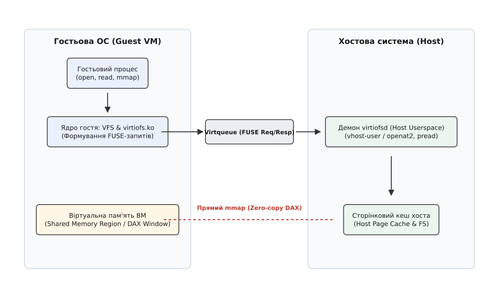
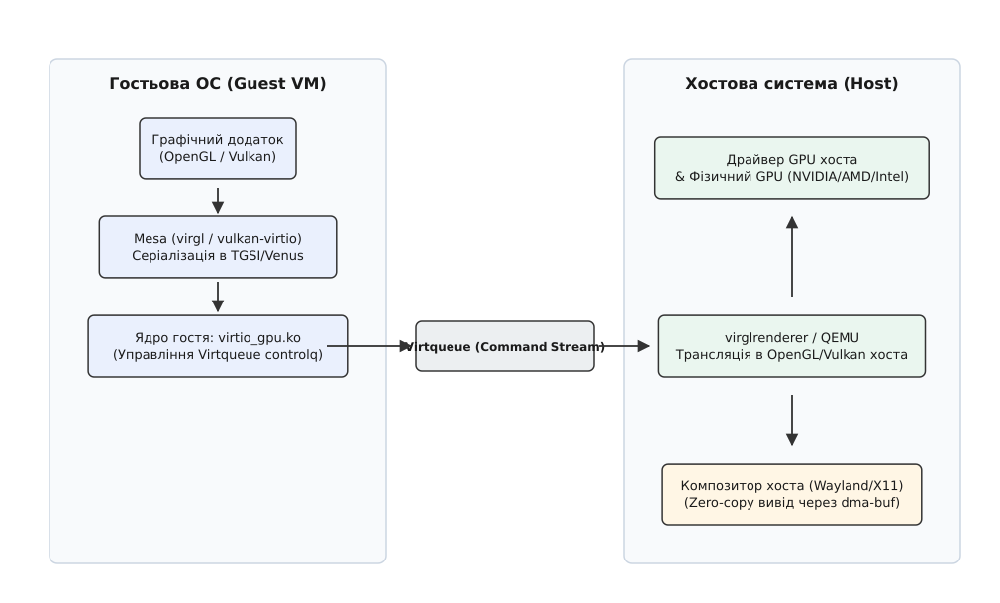

# Спеціалізовані пристрої Virtio: virtio-fs та virtio-gpu

<preknowlist>
- [Транспортний шар Virtio](root:sys-unix/virtio-transport) — механізм кільцевих буферів Virtqueue, розділеної пам'яті та сповіщень між хостом і гостем.
- [Специфікація Virtio PCI](root:sys-unix/virtio-pci-spec) — конфігураційні простори, PCI-capabilities та ініціалізація паравіртуалізованих пристроїв.
- [Модель символьних та блокових пристроїв](root:sys-unix/character-and-block-devices) — взаємодія ядра з пристроями введення-виведення та VFS.
</preknowlist>

Коли системний інженер запускає легковагові віртуальні машини для ізоляції контейнерів (наприклад, Kata Containers чи Firecracker) або будує робочі місця розробників на базі Linux-ВМ, він швидко впирається у дві жорсткі апаратні перепони: обмін файлами з хостом та графічне прискорення. Традиційне монтування каталогів хоста через мережеві файлові системи на кшталт NFS або протокол 9p паралізує компіляцію коду через низьку швидкість метаданих та подвійне кешування у RAM (і на хості, і в гості). У той же час спроба відмалювати сучасний інтерфейс чи запустити 3D-навантаження всередині ВМ за допомогою програмного рендерингу CPU (llvmpipe) перетворює анімацію на слайд-шоу, а виділення цілого фізичного GPU кожній віртуальній машині через PCI passthrough є надто марнотратним. Для розв'язання цих двох проблем специфікація Virtio була розширена спеціалізованими паравіртуалізованими пристроями — `virtio-fs` та `virtio-gpu`, які перевизначають механізми взаємодії підсистем пам'яті та рендерингу між хостом і гостем.

> 🔧 **Навіщо це.** `virtio-fs` дає віртуальним машинам змогу монтувати каталоги хоста із швидкістю та семантикою POSIX локального диска без витрат RAM на сторінковий кеш гостя. `virtio-gpu` дає змогу багатьом ВМ спільно використовувати один фізичний GPU хоста для 2D- і 3D-прискорення (OpenGL/Vulkan) без прокидання реального заліза.

---

## 1. Архітектура та принципи роботи virtio-fs

### 1.1 Чому занепали 9p та NFS у віртуальних машинах

Упродовж багатьох років стандартним способом передачі файлів між гіпервізором та гостьовою ОС був протокол 9p (virtio-9p). Проте 9p створювався для розподілених мережевих систем Plan 9 і мав концептуальні вади при адаптації до внутрішньовіртуального зв'язку Linux:

1. **Неповна семантика POSIX:** Протокол 9p має труднощі із точним прокиданням блокувань файлів (`fcntl`/`flock`), специфічних атрибутів (`xattr`), POSIX-прав та обробкою подій `inotify`.
2. **Продуктивність метаданих:** Будь-який виклик `lookup`, `stat` чи `readdir` генерує окремий синхронний мережевоподібний пакет 9p. При компіляції великого проєкту (де відкриваються тисячі заголовкових файлів) накладні витрати на передачу повідомлень нищать продуктивність.
3. **Проблема подвійного кешування (Double Caching):** Гіпервізор читає файл із диска хоста і зберігає його сторінки у сторінковому кеші (Page Cache) хоста. Коли гостьова ОС читає ці ж дані через virtio-9p, вона створює **другу копію** тих самих сторінок у власному сторінковому кеші. У результаті оперативна пам'ять системи вичерпується вдвічі швидше.

Пристрій `virtio-fs` розробили в компанії Red Hat спеціально для того, щоб усунути цю трійку обмежень за допомогою інкапсуляції протоколу FUSE та прямого відображення пам'яті.

---

### 1.2 Протокол FUSE поверх Virtqueue

Замість винайдення нового файлового протоколу `virtio-fs` повторно використовує випробуваний ядром Linux протокол FUSE (Filesystem in Userspace). У класичному FUSE модуль ядра `fuse.ko` перехоплює VFS-операції і передає їх через символьний пристрій `/dev/fuse` до користувацького демона на тому ж локальному ПК.

У `virtio-fs` цей ланцюг розривається на межі віртуалізації:

```
[Гостьовий процес] 
      │ (open / read / write)
      ▼
[VFS ядра гостя] 
      │ 
      ▼
[virtiofs.ko] ──────(FUSE-пакет)──────► [Virtqueue Request Queue]
                                                 │
                                           (vhost-user)
                                                 ▼
[virtiofsd на хості] ───(openat2 / pread)──► [Файлова система хоста]
```

1. Гостьовий процес виконує системний виклик (наприклад, `read()`).
2. Модуль ядра гостя `virtiofs.ko` упаковує запит у стандартний заголовок FUSE (`fuse_in_header`).
3. Замість символьного пристрою `/dev/fuse` пакет поміщається у кільцевий буфер Virtio (Virtqueue).
4. На стороні хоста демон `virtiofsd` (написаний мовою Rust) вичитує запит із черги за допомогою протоколу `vhost-user`, оминаючи контекстні перемикання самого гіпервізора QEMU.
5. Демон `virtiofsd` виконує системний виклик `pread()` або `mmap()` безпосередньо до локальної файлової системи хоста та повертає результат у Virtqueue.

Завдяки цьому `virtio-fs` одразу успадковує POSIX-семантику, яку ядро вже реалізує для FUSE: блокування, розширені атрибути, права й нотифікації йдуть тим самим шляхом, що й для локальної FUSE-файлової системи.

---

### 1.3 Демон virtiofsd та безпека ізоляції

Демон `virtiofsd` є ключовим вузлом обробки запитів на хості. Оскільки демон приймає команди від потенційно компрометованої віртуальної машини, його реалізація вимагає суворого дотримання принципів безпеки.

Сучасний `virtiofsd` (проект `vhost-user-fs` мовою Rust) ізолює себе на хості за допомогою комплексних системних механізмів Linux:
* **Mount Namespaces та `chroot`:** Демон обмежує свій корінь файлової системи виключно тим каталогом хоста, який експортується гостю.
* **Seccomp-фільтри:** Блокують усі небезпечні системні виклики хоста, лишаючи тільки файлові операції.
* **Відносні виклики (`openat2`, `unlinkat`, `fstatat`):** Для запобігання атакам типу Symlink Race (коли зловмисник у гості підміняє символьне посилання для виходу за межі експортованого каталогу хоста) `virtiofsd` взагалі не оперує абсолютними шляхами у вигляді рядків. Він тримає файловий дескриптор кореневого каталогу та виконує всі операції виключно відносно нього через дескриптори каталогів.
* **Перемапінг UID/GID:** Демон дозволяє налаштовувати трансляцію ідентифікаторів користувачів (User Namespaces). Це означає, що процес `root` усередині віртуальної машини може бути відображений на непривілейованого користувача на хості, що унеможливлює підвищення привілеїв навіть при вразливостях у демоні.

---

### 1.4 Технологія DAX (Direct Access) та усунення подвійного кешування

Передача даних через FUSE-повідомлення у Virtqueue вирішує проблему сумісності, але для великих файлів копіювання байтів між RAM гостя та RAM хоста залишається повільним. Для досягнення нативної швидкості `virtio-fs` задіює технологію **DAX (Direct Access)**.

DAX початково розроблявся для енергонезалежної пам'яті (NVDIMM), щоб читати й писати дані в обхід сторінкового кешу ядра. У `virtio-fs` цей механізм адаптовано для прямого мапінгу пам'яті хоста у фізичний адресний простір гостя.


*Архітектура virtio-fs: передача FUSE-запитів через Virtqueue та прямий доступ до пам'яті через DAX.*

Механізм функціонування DAX у `virtio-fs`:

1. **Експорт Shared Memory Region:** Пристрій `virtio-fs` оголошує через PCI Capability регіон спільної пам'яті (Shared Memory Window) розміром, наприклад, 2–8 ГБ.
2. **Запит Mapping:** Коли гостьовий процес робить `mmap()` або `read()` для файла на `virtiofs`, драйвер `virtiofs.ko` надсилає FUSE-запит `FUSE_SETUPMAPPING` до `virtiofsd`.
3. **Мапінг у вікно:** Саме вікно гіпервізор реєструє в KVM один раз, під час запуску ВМ (`KVM_SET_USER_MEMORY_REGION`). Далі на запит демона гіпервізор робить `mmap(MAP_FIXED)` потрібного діапазону файла всередину цього вікна — і сторінки сторінкового кешу хоста опиняються під адресами, які гість уже бачить.
4. **Обробка Page Fault:** При першому зверненні гостя до ще не відображеної сторінки виникає fault. Обробник у `virtiofs.ko` визначає, якому зсуву у файлі відповідає ця адреса, — саме він і надсилає `FUSE_SETUPMAPPING` із кроку 2.
5. **Zero-copy доступ:** Коли CPU віртуальної машини звертається до цієї адреси, таблиці сторінок MMU (через EPT/NPT розширення апаратної віртуалізації) транслюють адресу гостя безпосередньо у фізичну оперативну пам'ять хоста.

Результат:
* **Нульове копіювання (Zero-copy):** Дані взагалі не копіюються між хостом і гостем через шину Virtio.
* **Відсутність подвійного кешування:** Гостьова ОС не витрачає жодного байта власної оперативної пам'яті на зберігання вмісту файлів — вона використовує сторінковий кеш хоста як свій власний.

---

## 2. Архітектура та принципи роботи virtio-gpu

### 2.1 Еволюція віртуалізації графіки

Забезпечення віртуальних машин графічними можливостями пройшло довгий шлях компромісів:
1. **Емуляція застарілих адаптерів (VGA, Cirrus Logic):** Гіпервізор повністю програмно відтворював регістри стародавніх відеокарт. Це забезпечувало сумісність із будь-якою ОС, але 3D-прискорення було відсутнє, а 2D-вивід працював вкрай повільно.
2. **PCI Passthrough (VFIO):** Фізична відеокарта повністю віддається одній віртуальній машині. Це дає 100% нативну продуктивність, але унеможливлює використання цієї відеокарти хостом або іншими ВМ, а також ламає живу міграцію ВМ.
3. **Паравіртуалізований virtio-gpu:** Створює стандартизований віртуальний GPU, який ділить ресурси фізичного GPU хоста між багатьма ВМ без прив'язки до пропрієтарних драйверів конкретного вендора (NVIDIA/AMD/Intel).

---

### 2.2 Базовий режим 2D (KMS / DRM)

У базовому режимі пристрій `virtio-gpu` надає гостьовій системі стандартний 2D-дисплей через графічний стек ядра Linux (DRM — Direct Rendering Manager та KMS — Kernel Mode Setting).

Драйвер ядра гостя `virtio_gpu.ko` використовує дві основні черги Virtqueue:
* `controlq`: Черга керування для створення ресурсів, налаштування роздільної здатності та пересилання пікселів.
* `cursorq`: Окрема високопріоритетна черга для миттєвого оновлення координат курсора миші без очікування рендерингу основного кадру.

Принцип роботи 2D-виводу:
1. Драйвер гостя виділяє у своїй RAM пам'ять під кадровий буфер (framebuffer).
2. Через `controlq` надсилається команда `VIRTIO_GPU_CMD_RESOURCE_CREATE_2D` для реєстрації ресурсу в гіпервізорі.
3. Командою `VIRTIO_GPU_CMD_SET_SCANOUT` ресурс прив'язується до віртуального монітора.
4. Коли віконний менеджер гостя малює кадр, драйвер надсилає `VIRTIO_GPU_CMD_TRANSFER_TO_HOST_2D` із координатами видозміненого прямокутника — гіпервізор копіює ці пікселі з RAM гостя у свою копію ресурсу.
5. Команда `VIRTIO_GPU_CMD_RESOURCE_FLUSH` над тим самим прямокутником каже хосту показати оновлений вміст у вікні.

Детальні структури даних цих команд описано у вставці [Специфікація протоколу та структур даних Virtio GPU](root:sys-unix/virtio-fs-and-virtio-gpu/api-virtio-gpu-protocol.md).

---

### 2.3 3D-прискорення через VirGL та трансляцію команд

Для забезпечення 3D-прискорення `virtio-gpu` розширюється конвеєром **VirGL (virglrenderer)**. Замість того, щоб емулювати конкретні машинні інструкції відеокарти, VirGL транслює виклики графічних API на рівні командного потоку.


*Архітектура virtio-gpu: конвеєр трансляції графічних команд (VirGL/Venus) та zero-copy вивід через dma-buf.*

Схема роботи VirGL конвеєра:

1. **Mesa Gallium3D (Гість):** У гостьовій ОС працює графічна бібліотека Mesa. Драйвер Gallium3D `virgl` перехоплює виклики OpenGL від додатків.
2. **Трансляція в TGSI:** Драйвер `virgl` перетворює шейдери OpenGL у проміжне представлення **TGSI** (Tungsten Graphics Shader Infrastructure), а самі виклики рендерингу упаковує у бінарний потік команд VirGL.
3. **Передача через Virtqueue:** Потік команд надсилається через чергу `controlq` за допомогою команди `VIRTIO_GPU_CMD_SUBMIT_3D`.
4. **virglrenderer (Хост):** У гіпервізорі бібліотека `virglrenderer` розкодовує потік команд. Вона перекомпілює шейдери TGSI назад у нативний **GLSL** хоста, а команди VirGL перетворює у стандартні виклики OpenGL хостової системи.
5. **Виконання на GPU:** Графічний драйвер хоста виконує ці команди безпосередньо на фізичному GPU.

---

### 2.4 Сучасний 3D-стек: Vulkan та Venus

Хоча VirGL чудово працює для OpenGL, сучасні графічні рушії та ігри орієнтовані на низькорівневе API Vulkan. Трансляція Vulkan -> OpenGL неефективна і втрачає переваги низьких накладних витрат.

Для розв'язання цієї проблеми у `virtio-gpu` додано контекст **Venus**.
* У гості працює драйвер Mesa `vulkan-virtio`.
* Замість конвертації у проміжні шейдери, Venus серіалізує безпосередньо виклики API Vulkan та надсилає їх через Virtqueue.
* На хості `virglrenderer` десеріалізує команди й передає їх нативному драйверу Vulkan хоста.
* Кожна черга Vulkan (Graphics, Compute, Transfer) відображається на відповідний `ring_idx` у заголовку `virtio_gpu_ctrl_hdr`, що дозволяє асинхронно виконувати обчислення на фізичному GPU.

Це дозволяє запускати у віртуальній машині важкі 3D-ігри (через Proton/DXVK) та обчислювальні навантаження Vulkan. Втрати відносно заліза залежать від характеру навантаження: там, де кадр упирається в сам GPU, вони невеликі, а там, де програма робить багато дрібних викликів API, серіалізація й перехід через Virtqueue коштують помітно дорожче.

---

### 2.5 Zero-copy вивід буферів через dma-buf

Навіть якщо GPU хоста відрендерив 3D-кадр для ВМ, виникає проблема: як показати цей кадр на екрані хоста без пересилання гігабайтів піксельних даних через CPU?

Для цього `virtio-gpu` інтегрується з механізмом ядра Linux **dma-buf (DMA Buffer Sharing)**:

1. `virglrenderer` просить графічний драйвер хоста виділити рендер-буфер у відеопам'яті GPU (VRAM).
2. `virglrenderer` експортує цей буфер як файловий дескриптор `dma-buf` у ядрі хоста.
3. Гіпервізор передає цей дескриптор `dma-buf` безпосередньо композитору хоста (Wayland Mutter/Sway або Xorg).
4. Композитор хоста бере текстуру прямо з VRAM та відображає її на моніторі хоста.

Завдяки dma-buf весь цикл від 3D-рендерингу в гості до відображення пікселів на моніторі хоста відбувається **всередині VRAM відеокарти**, без жодного копіювання через оперативну пам'ять чи CPU.

---

## 3. Практичне налаштування та інспектування в Linux

### 3.1 Запуск virtio-fs у QEMU та virtiofsd

Для конфігурування `virtio-fs` на хості спочатку запускається демон `virtiofsd`, а потім гіпервізор QEMU підключається до нього через Unix-сокет `vhost-user`:

```bash
# 1. Запуск демона virtiofsd на хості
virtiofsd --socket-path=/tmp/vfs.sock \
          --shared-dir=/home/user/project \
          --sandbox=namespace

# 2. Запуск QEMU: пам'ять ВМ обов'язково спільна (share=on),
#    інакше демон не зможе звертатися до неї напряму
qemu-system-x86_64 \
    -enable-kvm -m 4G \
    -object memory-backend-file,id=mem,size=4G,mem-path=/dev/shm,share=on \
    -numa node,memdev=mem \
    -chardev socket,id=char0,path=/tmp/vfs.sock \
    -device vhost-user-fs-pci,queue-size=1024,chardev=char0,tag=my_shared_dir
```

Вікно DAX цей рядок не вмикає: його розмір задає окрема властивість пристрою (`cache-size`), і підтримка DAX у `virtio-fs` довго жила поза основною гілкою QEMU — перед використанням перевіряйте свою версію гіпервізора й демона.

Усередині віртуальної машини монтування виконується однією командою:
```bash
mount -t virtiofs my_shared_dir /mnt/project   # -o dax — лише коли гіпервізор дав вікно кешу
```

---

### 3.2 Запуск virtio-gpu 3D у QEMU

Для ввімкнення 3D-прискорення VirGL у QEMU використовується параметр `virgl=on` для пристрою `virtio-vga-gl` або `virtio-gpu-gl-pci`:

```bash
qemu-system-x86_64 \
    -enable-kvm -m 4G \
    -device virtio-gpu-gl-pci,virgl=on \
    -display egl-headless \
    -vnc :0
```

Перевірка статусу 3D-прискорення всередині гостя за допомогою інструментів Mesa:
```bash
# Перевірка використовуваного OpenGL-драйвера в гості
glxinfo | grep -i "OpenGL renderer"
# Очікуваний вивід: OpenGL renderer string: virgl (Intel UHD Graphics ...)
```

---

### 3.3 Програмний інтерфейс інспектування sysfs та procfs

Системний адміністратор або розробник може перевірити роботу пристроїв Virtio безпосередньо у файловій системі `sysfs` гостя.

:::tabs
```c
#include <stdio.h>
#include <stdlib.h>
#include <fcntl.h>
#include <unistd.h>

/* Перевірка стану пристрою virtio_gpu через sysfs */
void check_virtio_gpu_sysfs(void) {
    int fd = open("/sys/class/drm/card0/device/vendor", O_RDONLY);
    if (fd < 0) {
        perror("Не вдалося відкрити sysfs картку DRM");
        return;
    }
    char buf[32] = {0};
    ssize_t n = read(fd, buf, sizeof(buf) - 1);
    close(fd);
    if (n <= 0) {
        fprintf(stderr, "Порожнє або нечитне значення vendor\n");
        return;
    }

    printf("Virtio GPU Vendor ID: %s", buf);
}
```
```cpp
#include <iostream>
#include <fstream>
#include <string>
#include <filesystem>

// Перевірка активності точок монтування virtiofs у procfs
void check_virtiofs_mounts() {
    std::ifstream mounts("/proc/mounts");
    std::string line;
    bool found = false;

    while (std::getline(mounts, line)) {
        if (line.find("virtiofs") != std::string::npos) {
            std::cout << "Знайдено точку монтування Virtio-FS: " << line << '\n';
            found = true;
        }
    }

    if (!found) {
        std::cout << "Точок монтування virtiofs не виявлено.\n";
    }
}
```
:::

Програмне формування команд для керування пристроєм `virtio-gpu` вимагає від драйвера точного дотримання розмітки структур пам'яті. Практичний приклад створення та надсилання команд подано у вставці [Приклад формування та надсилання команд Virtio GPU](root:sys-unix/virtio-fs-and-virtio-gpu/proj-virtio-gpu-cmd.md).

Нижче наведено порівняльний аналіз ключових характеристик розглянутих спеціалізованих пристроїв:

| Параметр | virtio-fs | virtio-gpu |
| :--- | :--- | :--- |
| **Основне призначення** | Високопродуктивний спільний доступ до файлової системи | Паравіртуалізоване 2D/3D графічне прискорення |
| **Ключовий транспорт** | Virtqueue + FUSE протокол + `vhost-user` | Virtqueue (`controlq`, `cursorq`) + VirGL/Venus |
| **Механізм Zero-copy** | DAX (Direct Access) через Shared Memory Region | `dma-buf` між VRAM та композитором хоста |
| **Семантика** | Повна семантика POSIX (права, xattr, lock) | Стандартні KMS/DRM, OpenGL та Vulkan API |
| **Типові споживачі** | Kata Containers, Cloud Hypervisor, ChromeOS Crostini, ВМ під QEMU/libvirt | ChromeOS Crostini, Android Emulator, робочі ВМ із 3D під QEMU |

---

## 4. Підсумки

Пристрої `virtio-fs` та `virtio-gpu` демонструють еволюцію стандарту Virtio від простих абстракцій блокових і мережевих адаптерів до складних, глибоко інтегрованих підсистем.

Завдяки поєднанню протоколу FUSE із прямим мапінгом пам'яті DAX, `virtio-fs` усунув подвійне кешування та забезпечив нативну швидкість роботи з файлами хоста. У той же час `virtio-gpu` через технології VirGL, Venus та dma-buf надав віртуальним машинам доступ до сучасного 3D-прискорення OpenGL та Vulkan без втрати гнучкості віртуалізації. Разом ці пристрої роблять межу між роботою програми на фізичному обладнанні та всередині віртуальної машини практично непомітною.
