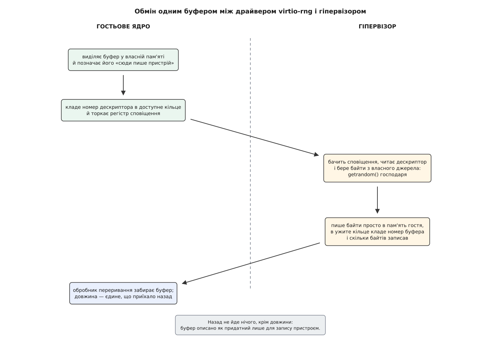
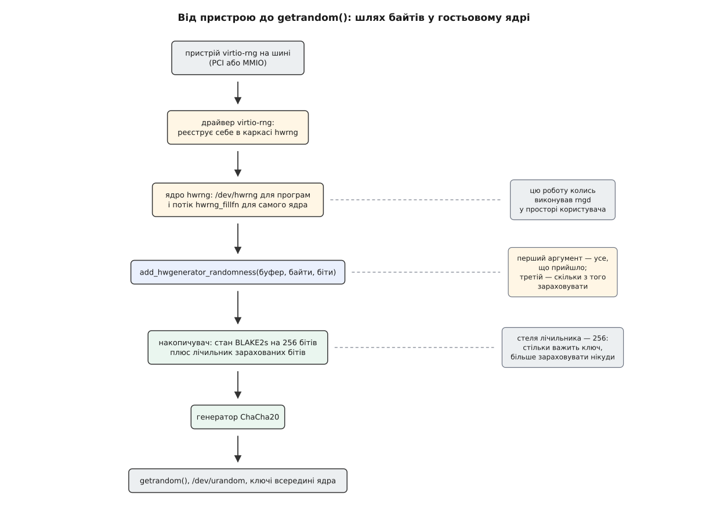
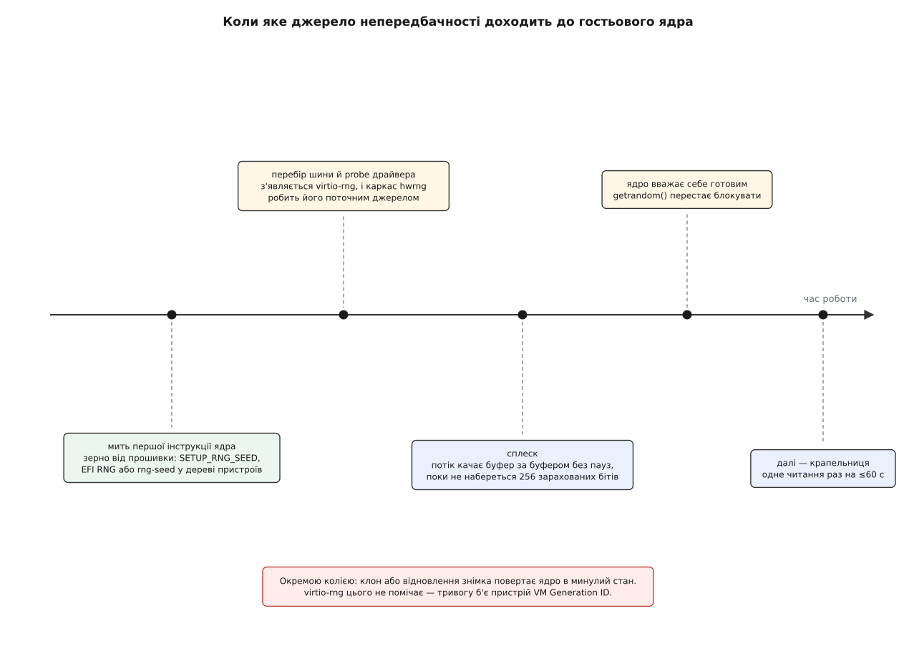

# virtio-rng: непередбачність від гіпервізора до гостьового ядра

<preknowlist>
- [Апаратна віртуалізація](root:hw-arch/hardware-virtualization) — гість виконується на справжньому процесорі, але кожне звертання до «заліза» перехоплює гіпервізор.
- [Джерело випадковості в ядрі](root:sys-unix/random-devices) — накопичувач, генератор, `/dev/urandom` і `getrandom()`: як ядро збирає невідомість і як віддає її програмам.
- [Криптографічний генератор випадкових чисел (CSPRNG)](root:sf-security/csprng) — з короткого таємного стану детерміновано розгортається потік, який без знання стану не відрізнити від шуму.
- [Джерело ентропії (TRNG)](root:sf-security/entropy-source) — фізичний процес, що дає справжню непередбачність, а не обчислення.
- [virtio: паравіртуалізована шина й віртчерги](root:sys-unix/virtio-transport) — гість і гіпервізор обмінюються не регістрами, а кільцями дескрипторів у спільній пам'яті.
- [Файл пристрою: символьний і блоковий](root:sys-unix/device-file-model) — за іменем у `/dev` стоїть драйвер, а не вміст на носії.
- [DMA і відображення буферів](root:sys-unix/dma-and-buffers) — пристрій пише просто в пам'ять, а не віддає байти через регістр.
- [Переривання, softirq і робочі черги](root:sys-unix/interrupts-bottom-halves) — як пристрій повідомляє ядро, що робота скінчена.
</preknowlist>

## Машина, що народжується без минулого

Ви запустили віртуальну машину з готового образу. За кілька секунд після старту вона згенерує собі ключі SSH-сервера, а трохи згодом — сеансові ключі для першого ж захищеного з'єднання. Поруч, із того самого образу, тим самим сценарієм і в ту саму секунду, запускається ще дев'ятнадцять таких самих машин.

Питання просте: звідки кожна з них візьме число, якого не вгадає жодна інша.

На фізичній машині відповідь відома. Ядро сидить у потоці подій і цінує в них не факт, а мить: воно читає лічильник тактів процесора в момент, коли прийшло переривання, і бере молодші розряди. Скільки саме тактів набігло — залежить від стану кешів, від глибини черги в контролері, від того, що робив процесор мілісекундою раніше. Це справжня фізика, і повторити її не вміє ніхто.

Тепер придивімося, що з цього лишається в гостя. Лічильник тактів у нього справжній — процесор той самий, лише зі зсувом. Але події, моменти яких він міряє, породжує вже не залізо, а програма гіпервізора. Їх менше: замість десятка контролерів — кілька віртчерг. Вони рівніші: там, де фізичний диск відповідав із розкидом у мікросекунди, віртуальний відповідає ходом коду. І головне — на самому початку роботи їх майже немає, а саме на початку ключі й народжуються.

До цього додається біда, якої на фізичній машині просто не буває. Образ — копія. Файл із насінням, що його система залишила собі на минулому вимкненні, лежить усередині образу й у всіх двадцятьох машинах однаковий. Послідовність коду до першого ключа однакова. Гість може крутити власний цикл із таймером і міряти розбіг — ядро вміє й так, — але це повільно, а чесно оцінити зібране цим прийомом неможливо.

Отже, всередині гостя надійного джерела немає. Воно є на рівень нижче: у господаря, з його дисками, мережевими картами, інструкцією `RDSEED` і вже дозрілим накопичувачем. Лишається прокласти туди трубу.

## Пристрій, з якого нічого не можна спитати

Яку форму мусить мати ця труба? Подивімося, чого від неї треба, і побачимо, що вимог майже немає. Ні адресації — байти не лежать «за адресою», їх немає до моменту прохання. Ні режимів — випадковість або справжня, або ні, проміжних налаштувань не буває. Ні станів — кожне прохання самодостатнє. Лишається рівно одне: «дай мені стільки-то байтів».

Саме такий пристрій і описано в специфікації virtio під номером 4. У нього одна віртчерга, `requestq`. Своїх можливостей для узгодження він не має, власної області конфігурації — теж. Це найпростіший пристрій усієї специфікації, і простий він не з бідності, а тому що складнішим бути не мусить.

Обмін виглядає так. Драйвер бере буфер у пам'яті гостя й описує його дескриптором з позначкою «сюди пише пристрій» — тобто господар матиме право туди писати, але не читатиме звідти нічого. Номер дескриптора лягає в доступне кільце, після чого драйвер торкає регістр сповіщення; цей запис перехоплює гіпервізор. Той бере байти зі свого джерела, кладе їх просто в пам'ять гостя за вказаною адресою, а в ужите кільце повертає номер буфера й довжину — скільки байтів насправді записав. Далі йде переривання, і драйвер забирає готове.


*Уся розмова вміщається в один буфер. Прохання не несе жодних параметрів, а назад, окрім самих байтів, приїздить тільки їх кількість.*

Довжина тут — не формальність. Господар має право записати менше, ніж просили, і драйвер мусить це витримати: він не вважає прохання невиконаним, а просто працює з тим, що дали. Через це в драйвері з'явився власний невеликий буфер — він роздає байти шматками тим, хто просить, а коли запас вичерпано, одразу ставить у чергу нове прохання. Як із цього складається робочий драйвер на кількох десятках рядків — розібрано окремо: реєстрація в шині, пошук віртчерги, `sg_init_one` на буфер, `virtqueue_add_inbuf`, «кік» і зворотний виклик ([мінімальний драйвер virtio-rng](root:sys-unix/virtio-rng/proj-minimal-rng-driver.md)).

> 🔧 **Навіщо це.** Хмарний образ без virtio-rng — це машина, яка на старті або зависає на `getrandom()`, чекаючи, поки набереться невідомість, або (що гірше) не зависає й видає ключі, схожі на ключі сусідів із того самого образу. Обидві біди зникають від одного рядка в конфігурації віртуальної машини.

## Чому позичати таємне в господаря — не поступка

Тут виникає природний спротив: ми беремо матеріал для ключів у стороннього, та ще й у того, хто цілком міг би запам'ятати, що нам віддав.

Спротив розсипається, щойно чесно назвати, з ким ми маємо справу. Господар володіє пам'яттю гостя цілком: він її й виділив. Він володіє віртуальним процесором: регістри гостя — це поля в його структурі. Позиції «я не довіряю господареві, але виконуюся на ньому» не існує — якщо він ворожий, ключі він прочитає прямо з пам'яті, і жодне джерело випадковості цього не змінить.

Але навіть якби довіри не було, ці байти не здатні нашкодити. Гість ніколи не віддає їх програмам як є: усе, що приходить від будь-якого джерела, спершу вмішується в стан геш-функції накопичувача. Той, хто не знає всієї попередньої суміші, не може підібрати добавку, яка приведе стан туди, куди йому треба ([криптографічні геш-функції](root:sf-security/cryptographic-hash)). Тому найгірше, на що здатне брехливе джерело, — не поліпшити накопичувач; погіршити його воно не може. З цієї ж логіки в Unix і дозволено будь-кому дописувати в `/dev/urandom`.

## Куди байти йдуть далі

Драйвер не заводить власного файла в `/dev`. Було б дивно мати окремий вхід для кожного джерела: система з апаратним генератором на кристалі, з чипом TPM і з virtio-rng одразу мала б три різні імені для однієї потреби. Тому в ядрі є проміжний шар — каркас `hw_random`, у якому джерела реєструються, а назовні виходить один вхід на всіх.

У цього каркаса два споживачі. Перший — символьний пристрій `/dev/hwrng`: сире вікно просто в поточне джерело, без жодного оброблення. Другий, значно важливіший, — потік ядра `hwrng_fillfn`. Він у циклі читає з поточного джерела повний буфер і віддає його головному накопичувачу разом із числом: скільки бітів невідомості в цьому буфері зараховувати.

Ця друга половина колись жила не в ядрі. У перших роках virtio-rng сам по собі майже нічого не давав, і в оголошенні драйвера прямо писали: запустіть у гості `rngd`, щоб він перелив байти з `/dev/hwrng` у пул. Як пристрій із такою підказкою перетворився на щось, що працює само собою, — окрема історія ([звідки взявся virtio-rng](root:sys-unix/virtio-rng/hist-virtio-rng-birth.md)).


*Драйвер віддає байти не програмам, а каркасові; далі вони проходять той самий шлях, що й будь-яка інша сировина ядра.*

Різницю між двома виходами варто затямити. `/dev/hwrng` — це кран у трубу: те, що з нього ллється, ніхто не змішував і не оцінював. `/dev/urandom` і `getrandom()` віддають вихід генератора, у ключі якого вмішано все зібране. Ключі беруть із другого, не з першого.

## Скільки бітів записати в залік

Накопичувач ядра — не бак із рівнем пального, але лічильник у нього все ж є: оцінка, скільки бітів справжньої невідомості туди потрапило. Поки лічильник не дійшов до 256 — стільки важить ключ генератора, — ядро вважає себе неготовим, і `getrandom()` блокує того, хто прийшов зарано.

Джерела різняться тим, наскільки їм вірити, тому каркас має міру якості: скільки бітів невідомості припадає на кожні 1024 біти прочитаних даних. Арифметика в потоці буквально така:

```c
/* drivers/char/hw_random/core.c, потік hwrng_fillfn */
entropy = rc * quality * 8 + entropy_credit;   /* у 1/1024 частках біта */
add_hwgenerator_randomness((void *)rng_fillbuf, rc, entropy >> 10, true);
```

**Умова: щойно завантажена машина x86, каркас уперше прочитав повний буфер із virtio-rng.**

```
RNG_BUFFER_SIZE = max(32, SMP_CACHE_BYTES) = 64 байти
quality         = 1024                       (стеля: біт невідомості на біт даних)

entropy    = rc · quality · 8 + entropy_credit
           = 64 · 1024 · 8 + 0
           = 524288                          (у 1/1024 частках біта)

зараховано = entropy >> 10
           = 524288 / 1024
           = 512 бітів
```

Одне-єдине читання дає вдвічі більше, ніж поріг у 256 бітів. Тобто гість із virtio-rng оголошує генератор готовим уже після першого успішного обміну буфером — не за хвилини й не за десятки секунд.

Число 1024 має свою історію, і вона повчальна. Довгі роки драйвер оголошував собі якість 1000 із 1024 — так званий коефіцієнт зниження, узятий не з розрахунку, а з обережності: «майже повна довіра, але залишмо запас». У Linux 6.2 (лютий 2023) такі самопризначені числа з драйверів прибрали, а `default_quality` у каркасі зробили одночасно і значенням за замовчуванням, і **стелею**: 1024, тобто повний залік, а адміністратор, який чомусь довіряє джерелу менше, може опустити планку параметром `rng_core.default_quality`. Логіка проста: якщо джерело — гіпервізор, то додаткова обережність саме до нього безглузда, бо ми вже довіряємо йому все інше.

## Сплеск, а потім крапельниця

Якщо потік читає в циклі, чому господар не бачить, як гість вичерпує його джерело? Відповідь — в останньому аргументі виклику, тому самому `true`:

```c
/* drivers/char/random.c */
void add_hwgenerator_randomness(const void *buf, size_t len, size_t entropy,
				bool sleep_after)
{
	mix_pool_bytes(buf, len);
	credit_init_bits(entropy);

	if (sleep_after && !kthread_should_stop() && (crng_ready() || !entropy))
		schedule_timeout_interruptible(crng_reseed_interval());
}
```

Умова паузи читається без зусиль: спати, **якщо ядро вже готове** (або якщо цей буфер нічого не додав до заліку). Поки готовності немає, паузи немає теж — потік качає буфер за буфером так швидко, як дозволяє пристрій. Щойно поріг узято, ритм міняється на протилежний: `crng_reseed_interval()` у перші дві хвилини роботи наростає від секунди, а далі стає рівно хвилиною.

Виходить рівно та поведінка, якої й хотілося б: короткий сплеск у момент, коли машина ще не має чим шифрувати, і тонка цівка потім, коли треба тільки освіжати ключ генератора.


*Три різні механізми доставляють непередбачність у трьох різних місцях шкали часу, і жоден не заміняє іншого.*

З боку господаря є й другий обмежувач. QEMU дає пристроєві властивості `max-bytes` і `period`: стільки-то байтів на стільки-то мілісекунд, а лічильник квоти скидає таймер. Сенс у цьому є тоді, коли за пристроєм стоїть справді вичерпне джерело — файл апаратного генератора або зовнішній демон. Коли ж бекенд просто кличе `getrandom()` господаря, обмеження лишається формальністю: типова квота така велика, що на практиці її не видно.

## Пристрій, який приходить запізно

Тепер неприємне. virtio-rng — пристрій на шині, PCI або MMIO. Щоб він з'явився, ядро мусить перебрати шину, знайти його, зіставити з драйвером і викликати `probe`. Усе це відбувається порівняно пізно — а випадковість ядро витрачає з першої ж миті: сторожові значення на стеку, зсув для рандомізації розкладки, насіння для геш-таблиць. Ще до того, як драйвер зареєструється, простір користувача в initramfs може встигнути щось згенерувати.

Тому поруч із пристроєм існує другий канал, і він навмисне **не** пристрій: одноразове зерно, яке передає той, хто завантажив ядро. На платформах із деревом пристроїв це властивість `rng-seed`, яку завантажувач вписує у вузол `/chosen` (з 2019 року). На машинах з UEFI — протокол `EFI_RNG_PROTOCOL`, яким користуються з 2016-го. Для x86 такого шляху довго не було взагалі, бо віртуальні машини рідко стартують через UEFI; у Linux 6.1 (кінець 2022, Джейсон Доненфельд) у протокол завантаження x86 додали запис `SETUP_RNG_SEED`, а QEMU навчився його заповнювати починаючи з версії 7.1. Ядро домішує це зерно й одразу зараховує, а потім затирає його в переданій області.

Різниця між зерном і пристроєм принципова. Зерно — один поштовх у нульовий момент, і повторити його неможливо: воно вже витрачене. virtio-rng — кран, який можна відкрити знову будь-коли. Машина тільки із зерном безборонна перед клонуванням; машина тільки з virtio-rng стартує наосліп.

> 🔧 **Навіщо це.** Складаючи образ для хмари чи стенда, перевіряйте обидва канали окремо: у конфігурації віртуальної машини мусить бути `virtio-rng`, а завантажувач мусить передавати зерно. Наявність одного нічого не каже про інше, і зламаним зазвичай виявляється саме другий.

## Знімок, що скасовує зроблене

Є ситуація, з якою virtio-rng не впорається за жодних налаштувань, і про неї варто знати, бо на вигляд вона схожа саме на брак випадковості.

Гіпервізор уміє зберегти стан машини й повернути її туди пізніше — або взагалі запустити з одного знімка дві копії. Для ядра гостя це означає, що ключ генератора, лічильник і весь накопичувач повертаються до значень, які вже були. Дві копії, які нічого не підозрюють, видадуть однакові байти — а отже, однакові сеансові ключі й однакові одноразові числа, що для більшості шифрів рівносильне видачі ключа.

Потік каркаса цього не рятує: після відновлення він спить, і спатиме ще до хвилини. Та й навіть прокинувшись, він поправить лише накопичувач ядра, а програми в просторі користувача тримають власні генератори з власним станом, скопійованим разом зі знімком.

Розв'язок лежить в іншому пристрої. Гіпервізор виставляє в таблицях ACPI 128-бітний ідентифікатор покоління машини й міняє його щоразу, коли машину роздвоїли чи відкотили — задум родом із Hyper-V, який підтримує й QEMU. У Linux із версії 5.18 (2022) є драйвер `vmgenid`: він отримує сповіщення, домішує новий ідентифікатор, змушує генератор негайно перезарядитися й піднімає номер покоління — те саме число, яке від Linux 6.11 звіряє `getrandom()` у vDSO, перш ніж скористатися своїм закешованим станом. Тож поділ обов'язків такий: virtio-rng — постачання, а [VM Generation ID](root:sys-unix/vm-generation-id) — тривога «ти більше не та сама машина».

## Що з цього видно з середини гостя

Перевірка займає три читання в `sysfs` ([модель пристроїв у sysfs](root:sys-unix/sysfs-device-model)):

```
$ cat /sys/class/misc/hw_random/rng_available
virtio_rng.0
$ cat /sys/class/misc/hw_random/rng_current
virtio_rng.0
$ cat /sys/class/misc/hw_random/rng_quality
1024
```

Перший файл каже, які джерела ядро взагалі знайшло, другий — яке з них зараз годує накопичувач, третій — з якою мірою довіри. Якщо `rng_available` порожній, пристрою в машині немає або драйвер не зібрано; якщо `rng_current` показує інше джерело, каркас віддав перевагу йому. Повний перелік того, що стирчить назовні — від властивостей бекенда в QEMU до параметрів модуля й вузла в дереві пристроїв, — зібрано окремо ([контракт virtio-rng](root:sys-unix/virtio-rng/api-virtio-rng-surface.md)).

Помітно, що найпростіший пристрій усієї специфікації virtio оточений найбільшою кількістю сторонньої механіки. Це не випадковість: передати байти справді нічого не варте, а вся складність зосереджена в трьох питаннях довкола них — скільки цим байтам вірити, чи встигли вони до першого ключа й хто скаже ядру, що машину щойно роздвоїли. Пристрій відповідає лише на перше з них, і саме тому решту довелося винести в окремі механізми.
