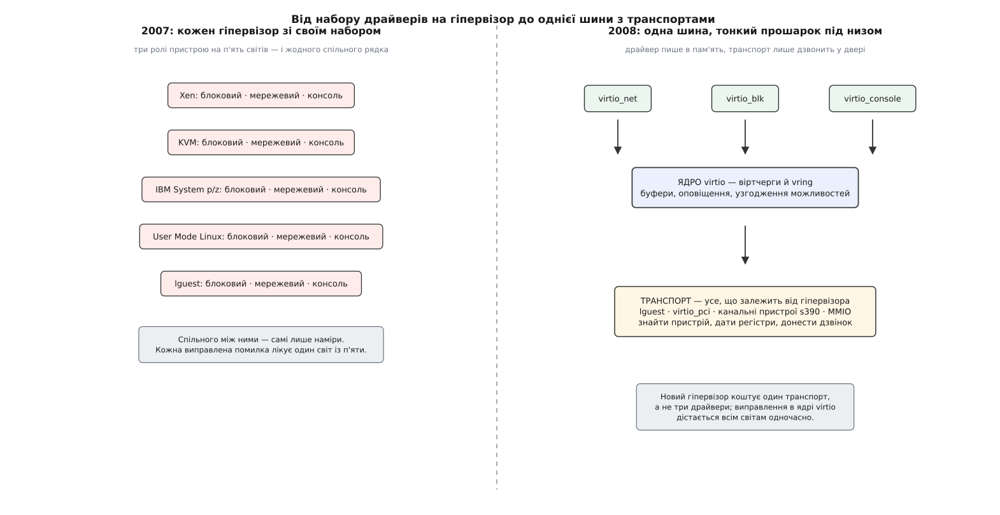

# 📜 Як п'ять віртуальних світів отримали один блоковий драйвер

Влітку 2007 року в ядрі Linux складалася ситуація, яку його розробники бачили на роки вперед: кожен гіпервізор ніс до ядра власний блоковий драйвер, власний мережевий і власну консоль, і жоден рядок цього коду не був спільним. Расті Расселл (Rusty Russell) запропонував не черговий кращий драйвер, а домовленість, яка зробила б наступні драйвери непотрібними, — і далі десять років ця домовленість повільно перетворювалася з коду однієї людини на формальний стандарт із комітетом і редакторами.

## Ядро, у якому диск залежав від гіпервізора

Процесорну частину [апаратної віртуалізації](topic:hw-arch/hardware-virtualization) ядро на той момент уже впорядкувало. У випуску 2.6.20 (лютий 2007) з'явився каркас `paravirt_ops` — таблиця операцій, крізь яку гіпервізор підміняв чутливі процесорні дії гостя; у тому ж випуску прийшов і KVM. Наступний випуск, 2.6.21 (25 квітня 2007), додав до цього каркаса підтримку VMI — інтерфейсу, який просувала VMware. Тобто питання «як гостю виконувати команди» вже мало одну відповідь на всіх.

А питання «як гостю читати диск» — не мало. Xen возив блоки й кадри своїм набором кільцевих буферів. KVM обростав власним паравіртуальним вводом-виводом. У User Mode Linux був свій `ubd`. Віртуальні машини IBM на System p і System z мали свої канали й свої драйвери під них. Расселл тим часом писав lguest — навмисно крихітний гіпервізор, який він почав 2006 року радше як навчальний і випробувальний, ніж як промисловий, — і йому теж потрібні були диск, мережа й консоль.

Ці набори не мали між собою нічого спільного, крім задуму. Виправлена помилка лікувала один світ із п'яти. Нова можливість — скажімо, розвантаження контрольних сум на мережевому шляху — писалася окремо стільки разів, скільки було наборів.

*Що саме звели докупи: не драйвери переписали під один гіпервізор, а вирізали з них спільну частину й лишили внизу тонкий шар відмінностей.*

## Лист, у якому важила не техніка

11 липня 2007 року LWN описав свіжу пропозицію Расселла в списку розсилки з віртуалізації. Показовим у ній був не інтерфейс, а аргумент. Кілька проектів віртуалізації саме тоді або писали, або переписували свій ввід-вивід; ще трохи — і в ядрі осіла б купа драйверів віртуального блокового пристрою, які роблять те саме трохи по-різному, і супроводжувати їх стало б неможливо. Тому Расселл виклав не ідею, а працюючі блоковий і мережевий драйвери на спільному механізмі: аби проекти мали що взяти замість того, щоб робити своє.

Це і є справжня причина, чому virtio виграла. Технічно її кільце не було відкриттям — кільцеві буфери з дескрипторами до того возили дані і в Xen, і в IBM-івських каналах, і в звичайних мережевих картах. Виграла вона тим, що з'явилася в потрібний момент і з готовим кодом на руках.

## Спільною зробили розкладку пам'яті, а не набір функцій

Ключове рішення в конструкції — де саме провести межу спільного. Расселл провів її так, що спільною стала форма даних у пам'яті гостя, а не набір функцій.

Драйвер працює з буферами — масивами пар «адреса, довжина», частину яких пристрій читає, частину пише, — і має до черги коротку жменю дій: `add_buf()`, щоб покласти буфер, `sync()`, щоб сказати «глянь туди», `get_buf()`, щоб забрати оброблене. Усе, що залежить від гіпервізора, спускається нижче цього шару, у транспорт: як знайти пристрій, звідки взяти адресу кільця, чим саме дзвонити на той бік і чим на цей бік приходить відповідь. Кільце, яке цей шар обслуговує, назвали vring.

Наслідок арифметичний. У старій картині ціна нового гіпервізора — три драйвери; у новій — один транспорт. І навпаки: новий клас пристрою пишеться один раз для всіх.

## 2.6.24 як дата народження

Першим тілом для цього коду став саме lguest. Крихітний гіпервізор, який ніхто не збирався ставити в продакшн, виявився ідеальним стендом: він був повністю в руках автора, і нічия чужа сумісність не заважала міняти розкладку кільця.

У випуску Linux 2.6.24 від 24 січня 2008 року ядро virtio ввійшло в дерево — разом із мережевим, блоковим і консольним драйверами, транспортом для файлової системи 9p і підтримкою з боку lguest. Ще однієї деталі в цьому списку немає, і вона важлива: PCI там не було. Транспорт `virtio_pci` — той самий, яким користуються всі хмарні машини, — прийшов наступним випуском, 2.6.25 (квітень 2008), разом із «повітряною кулею» пам'яті. Саме він відкрив virtio дорогу до KVM і QEMU, де віртуальна машина вже мала шину PCI й механізм оповіщення на ній.

## Стаття з програмою в заголовку

У липні 2008 року вийшла стаття Расселла «virtio: towards a de-facto standard for virtual I/O devices» — ACM SIGOPS Operating Systems Review, том 42, випуск 5, сторінки 95–103 (DOI 10.1145/1400097.1400108).

Заголовок варто прочитати буквально: це не звіт про доконаний факт, а програма. На момент публікації virtio була механізмом однієї реалізації в одному ядрі, і слово «стандарт» у назві означало намір, а не статус. Намір справдився: за наступні роки virtio підхопили QEMU, потім гостьові драйвери для Windows, потім FreeBSD і власні реалізації хмарних постачальників.

## Чому «де-факто» виявилося замало

Тут історія робить поворот, який погано пояснюється технікою. У 2009-му Расселл виклав «Virtio PCI Card Specification» — опис того, що вже працювало. Здавалося б, досить: код відкритий, опис є, беріть. Але великі виробники заліза й систем не будують продукт на документі, який одна людина може одноосібно змінити наступного вівторка. Їм потрібен текст із правовим статусом, з описаним порядком змін і з зобов'язаннями щодо патентів.

Тому в червні 2013 року з'явився заклик до участі в технічному комітеті OASIS, а 24 грудня 2013 року вийшов перший чернетковий текст майбутньої версії 1.0. Расселл, за його ж словами, обрав OASIS саме як спосіб зробити корисний стандарт без зайвої бюрократії. Перешкода, яку долала стандартизація, була не технічною, а юридичною й політичною — це той самий сюжет, що й у [POSIX](topic:sys-unix/posix-standard): спершу з'являються реалізації, а потім з'являється потреба на щось посилатися в договорі.

## 1.0: розрив, на який зважилися один раз

Комітет скористався нагодою й полагодив те, що в коді вже затверділо. Версія 1.0 зробила порядок байтів у структурах черги завжди тим самим — прямим (англ. *little-endian*), тоді як спадкова форма вживала порядок гостьового процесора. Вона перестала вимагати, щоб уся черга лежала одним фізично суцільним шматком. Вона додала біт можливості `VIRTIO_F_VERSION_1`, яким пристрій і драйвер підтверджують, що говорять новою мовою, і біт `FEATURES_OK`, який чітко закриває стадію узгодження. Вона викинула невживані біти, а з деяких пристроїв — цілі можливості: у блокового зник «бар'єр» і став обов'язковим «скид», а «повітряну кулю» пам'яті лишили в тексті лише як спадковий пристрій, зарезервувавши під її заміну окремий номер типу.

Стара розкладка нікуди не поділася — її описали окремими врізками як «спадковий інтерфейс», бо в світі вже крутилися мільйони гостей із нею. Ухвалення затягнулося: версія 1.0 отримала статус OASIS Committee Specification 04 аж 3 березня 2016 року — понад два роки після першої чернетки.

Далі темп став рівним, і автор у ньому вже не головний. Версія 1.1 (11 квітня 2019) принесла упаковану чергу — розкладку, у якій дескриптори й відповіді живуть в одній області замість трьох. Версія 1.2 (1 липня 2022) додала нові класи пристроїв. Чернетка 1.3 датована 6 жовтня 2023 року, і в її редакторах стоять Майкл Ціркін (Michael S. Tsirkin) і Корнелія Гук (Cornelia Huck) з Red Hat — прізвища, яких не було в підписі статті 2008 року.

Що пережило всі ці переходи незмінним — це рішення 2007 року про те, де провести межу: спільна форма в пам'яті, тонкий шар відмінностей під нею. Кільце, яке вперше провернулося в іграшковому гіпервізорі на ноутбуці автора, досі возить блоки в кожній другій хмарній машині світу.
