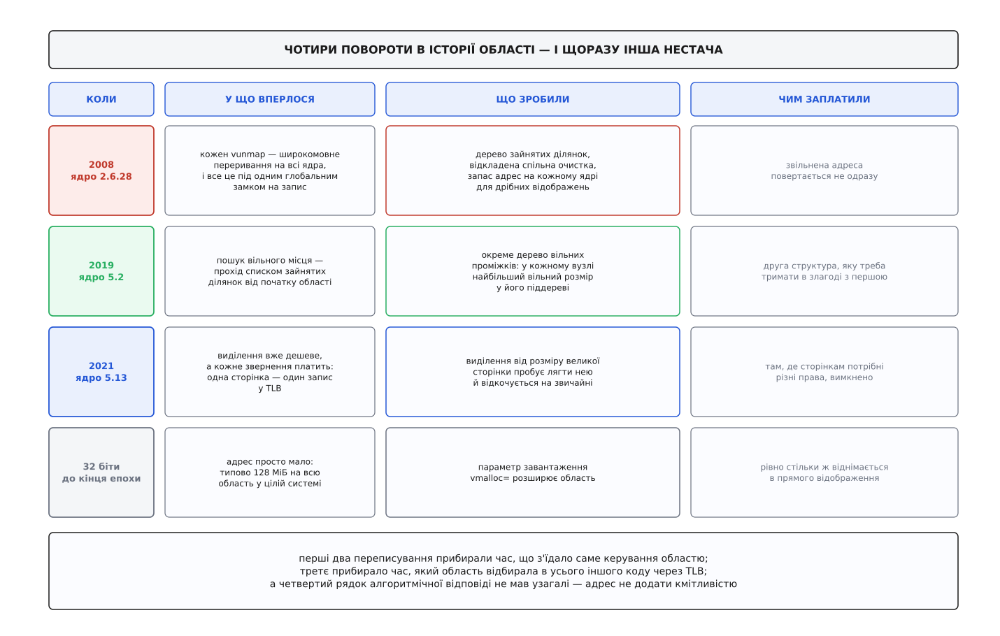

# 📜 Чотири стіни vmalloc: як область двічі переписували з нуля

Область vmalloc за свою історію переписували двічі повністю, а стін на її шляху було чотири: спершу час, який з'їдало саме звільнення, потім час, який з'їдав пошук вільної адреси, всю епоху тридцяти двох бітів — самі адреси, яких не було де взяти, і насамкінець ціна, яку область бере з процесора на кожному зверненні. Ця історія варта того, щоб її знати, бо перші дві стіни лишили по собі структури даних, які ядро тримає й досі: дивлячись у сьогоднішній `mm/vmalloc.c`, ви дивитеся на три відповіді на три різні питання, і без питань той код здається надміру складним.



*Три верхні рядки — зміни в коді, у кожної своя дата й свій коміт; нижній стоїть окремо, бо тягнувся крізь усі три й полагодити його кодом було нічим.*

## Замок, під яким стояла вся машина

До кінця 2008 року облік області виглядав так, як його написали, коли машини були однопроцесорні. Усі зайняті ділянки лежали в **однозв'язному списку**, а список був накритий одним глобальним замком читання-запису — причому в гарячих шляхах його брали **на запис**, тобто нікого поруч не пускали взагалі.

Але справжня ціна ховалася не в замку. Зняти запис із таблиці сторінок ядра — дія не локальна: таблиці верхньої половини спільні для всіх, тож копії перекладу висять у TLB кожного процесорного ядра. Щоб прибрати відображення чесно, треба [розіслати переривання всім ядрам і дочекатися останнього](root:sys-unix/tlb-shootdown) — коротко кажучи, зупинити машину. І робив це **кожен** `vunmap`.

Порахуймо, у що це виливається, коли ядер багато.

```
одне звільнення на машині з N ядрами:
  1 розсилка × (N−1) підтверджень          → вартість ∝ N

усі N ядер звільняють у той самий час:
  N × (N−1) підтверджень                   → сукупна робота ∝ N²

N =  4:     12
N = 64:   4032        ядер більше в 16 разів — роботи більше в 336
```

Квадрат — це і є та стіна. Кожне нове ядро в машині не просто додавало собі роботи, воно додавало роботи всім іншим, і чим більше ядер купував замовник, тим гірше система поводилася на тих самих задачах.

Помітили це не в теорії. Файлова система XFS користується короткочасними відображеннями рясно — вона зшиває сторінки буферів у суцільні адреси постійно, — і саме на ній `vmap` виліз у перші рядки профілю разом із безперервним биттям TLB.

Переписав шар **Nick Piggin**, тоді розробник ядра в SUSE. Чернетки він розіслав у списки розсилки влітку 2008 року («mm: vmap rewrite»), а в дерево Лінуса це ввійшло комітом `db64fe02258f` «mm: rewrite vmap layer» і вийшло у версії 2.6.28 наприкінці того ж року. Рішень там три, і вони незалежні одне від одного.

**Дерево замість списку.** Ділянки переїхали в [червоно-чорне дерево](root:sf-algorithms/red-black-tree), упорядковане за адресою, — збалансоване дерево пошуку, у якому знайти вузол коштує логарифм від кількості вузлів. Питання «чия це адреса» перестало бути проходом списком.

**Лінива очистка.** Головне прозріння: негайність під час звільнення нікому не потрібна. Небезпечно лише те, щоб стара відповідь висіла в чужому TLB тоді, коли адресу вже комусь віддали. Отже, досить не віддавати адресу, доки очистка не сталася, — а самі очистки накопичувати й робити одну спільну на весь набраний діапазон. Ціна розсилки перестала залежати від кількості звільнень.

**Запас на кожному ядрі.** Для дрібних відображень (до шістдесяти чотирьох сторінок) ходити в спільне дерево — чиста витрата: черга на спільний замок з'їла б усю вигоду. Тому ядро стало заздалегідь відрізати шматки адрес і роздавати їх [зі свого запасу на кожному процесорному ядрі окремо](root:sys-unix/per-cpu-data), не торкаючись спільної структури.

Наслідок за вимірами самого автора: `vmap` пішов із перших рядків профілю в «менше за один відсоток часу ядра», штучний тест став швидшим у двадцять п'ять разів, а деякі навантаження XFS — у двадцять, коли їх перевели на нову дрібну дорогу. Числа ці — вимірювання розробника, наведені в описі змін і переказані LWN; незалежних перевірок на іншому залізі в обіг не потрапило, тож порядок величини вважаймо усталеним, а точні кратності — авторськими.

## Друге вузьке місце: знайти дірку

Дерево 2008 року індексувало **зайняті** ділянки за адресою. На питання «чия це адреса» воно відповідало миттєво — і рівно нічого не відповідало на питання, з якого починається кожне виділення: «де тут вільний проміжок на стільки-то сторінок із таким вирівнюванням».

Тому виділення робило те, чого дерево не вміло: йшло списком зайнятих ділянок від початку області й дивилося в щілини між сусідами, доки не трапиться достатня. Прохід лінійний, і платило за нього **кожне** виділення. Поки ділянок сотня, це непомітно. Коли їх тисячі — а вони будуть тисячі на будь-якій машині, що довго працює й багато відображає, — виділення починає коштувати тим більше, чим довше система живе.

Полагодив це **Uladzislau Rezki**, який підписував свої зміни в ядрі як «Uladzislau Rezki (Sony)». Коміт `68ad4a330433` «mm/vmalloc.c: keep track of free blocks for vmap allocation» датований 17 травня 2019 року й вийшов у версії 5.2 того ж літа.

Ідея гарна саме своєю простотою: якщо структура не відповідає на потрібне питання, треба завести структуру, яка відповідає. З'явилося **друге дерево — з вільних проміжків**, теж червоно-чорне й теж за адресою, у парі зі списком вільних ділянок у порядку зростання адрес. А щоб деревом можна було шукати за **розміром**, вузли зробили **доповненими**: кожен вузол додатково зберігає найбільший вільний розмір, що трапляється в його піддереві.

Це і є вся хитрість. Маючи таке число у вузлі, пошук іде згори вниз і відсікає цілу гілку одним порівнянням: якщо найбільший вільний шматок у піддереві менший за потрібний, туди можна не заходити взагалі. Лінійний прохід перетворюється на спуск.

```
до 5.2:   прохід списком зайнятих ділянок       → O(N)
від 5.2:  спуск деревом із відсіканням гілок    → ~O(log N)

N = 4096 ділянок:      ~4096 кроків    →    ~12 кроків
```

Окремо варто відзначити те, що зазвичай лишається за кадром: у тій самій роботі з'явився `lib/test_vmalloc.c` — набір тестів, який навантажує область різними візерунками виділень і міряє час. Спочатку прилад, потім лагодження; інакше «стало швидше» лишається питанням віри. Числа з опису змін такі: на ноутбучному i5-3320M набір відпрацював за 193 мільярди тактів замість 646 (утричі менше), а на платі HiKey960 з вісьмома ядрами arm64 — за 464 мільйони замість 3.48 мільярда, тобто всемеро. Знову-таки: числа авторські, механізм — усталений і живий у коді донині.

## Найстаріша стіна: адрес просто немає

Обидві історії вище — про час. А найдовша й найболючіша скарга на цю область була не про час зовсім.

На тридцяти двох бітах усіх адрес чотири гігабайти, ядру з них при звичному поділі дістається один. І в цей один гігабайт мусять уміститися **всі** його потреби одразу: пряме відображення фізичної пам'яті, область vmalloc з відображеннями пристроїв, ділянка модулів, службові фіксовані відображення. Області vmalloc типово перепадало близько ста двадцяти восьми мегабайтів — не на процес, не на драйвер, а на всю систему.

Далі арифметика робиться сама, і робиться проти вас: що більше в машині фізичної пам'яті, то більше з'їдає пряме відображення, то **менше** лишається на vmalloc. Рядок `VmallocTotal` у `/proc/meminfo` на машині з 768 мегабайтами виходив меншим, ніж на машині з 256; далі, за межею, від якої вся фізична пам'ять у пряме відображення вже не влазила, область упиралася в свої типові сто двадцять вісім мегабайтів і не меншала. Пам'яті додали — адрес поменшало.

Хто з'їдав ці сто двадцять вісім мегабайтів найшвидше — драйвери, яким треба відобразити чужу пам'ять цілим шматком: кадровий буфер відеокарти, буфери тюнерів у машинах для запису телебачення. Звідси й повідомлення, яке ціла епоха системних адміністраторів знала напам'ять: `allocation failed: out of vmalloc space - use vmalloc=<size> to increase size`.

Порада в самому повідомленні була чесна, але лукава. Параметр завантаження `vmalloc=` справді розширював область — тільки не з повітря: кожен доданий мегабайт віднімався в прямого відображення, тобто в тієї пам'яті, з якої ядро роздає все інше. Гра з нульовою сумою, у якій виграш однієї підсистеми оплачувався програшем іншої, а обидві межі знав лише той, хто вручну підбирав число й перезавантажувався.

Ця стіна цікава тим, чим вона відрізняється від двох попередніх: **алгоритмічної відповіді на неї не існувало взагалі**. Дерево можна замінити на краще дерево, розсилку можна відкласти — а адрес кмітливістю не додати. Скінчилася вона не полагодженням, а зміною апаратури: на шістдесяти чотирьох бітах під область відводять тридцять два терабайти, і вичерпати їх стало ділом майже неможливим. У вбудованих системах на тридцяти двох бітах ця арифметика жива й донині, і там її досі рахують руками.

## Четвертий поворот: не швидше виділяти, а дешевше користуватися

Коли обидва вузьких місця в самому розподільнику прибрали, стало видно те, що вони собою затуляли. Виділення тепер дешеве — але дороге кожне **звернення**: у цій області кожна сторінка описана власним записом таблиці, тож і в [TLB](root:hw-arch/tlb) вона займає власний запис, тимчасом як пряме відображення лежить [великими сторінками](root:sys-unix/huge-pages-tlb-reach) і покриває мегабайти одним. Велика хеш-таблиця, покладена через vmalloc, вимиває з TLB роботу всього стороннього коду.

До цієї задачі повернувся той самий чоловік — **Nicholas Piggin**, він же Nick Piggin із 2008 року, уже в IBM і вже здебільшого на архітектурі powerpc. Серія пройшла тринадцять редакцій, перш ніж її взяли: коміт `121e6f3258fe` «mm/vmalloc: hugepage vmalloc mappings» увійшов у версію 5.13 у середині 2021 року. Правило просте: виділення, не менше за розмір великої сторінки, пробує лягти нею, а не вийшло — тихо відкочується на звичайні. Архітектури вмикають це в себе окремим прапорцем, бо не всяка вміє великі сторінки в адресах ядра.

За виміром автора — він наведений у поясненні до сусіднього коміту, яким механізм умикали на powerpc, — на двовузловій машині POWER9 промахи TLB на звичайному `git diff` по дереву ядра впали з 59 800 до 2 100, тобто майже втридцятеро, а процесорних тактів на тій самій роботі стало менше на пів відсотка. Виграш дали не самі буфери, а хеш-таблиці файлової системи, які лягли двомегабайтними сторінками.

І тут же зʼявилося обмеження, яке добре показує, чому «скрізь великими» не буває. Код [завантаженого модуля](root:sys-unix/kernel-modules) теж живе в цій області, і в ньому сторінкам потрібні **різні** права: сторінки з кодом мають бути недоступними для запису, сторінки з даними — невиконуваними. Права видаються на запис таблиці, а велика сторінка — це один запис на два мегабайти; поділити його на частини з різними правами ніяк. Тому такі виділення позначали прапорцем «без великих сторінок» і лишали дрібними свідомо, платячи TLB за безпеку.

Дві перші перебудови прибирали час, який область витрачала на себе. Третя показала, що коли розподільник перестає бути вузьким місцем, вузьким місцем стає процесор — і наступне питання до цієї пам'яті ставить уже не той, хто її виділяє, а той, хто по ній ходить.
