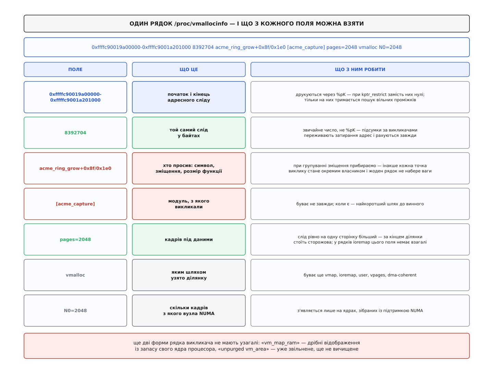
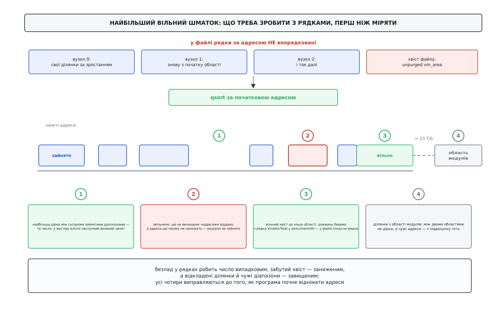

# ⚙️ Хто тримає область vmalloc: програма, що читає `/proc/vmallocinfo`

Робоча програма мовою C, яка розбирає `/proc/vmallocinfo` на діапазони адрес, підсумовує зайняте за викликачами й з проміжків між сусідніми діапазонами рахує найбільший вільний шматок області — три відповіді, яких `/proc/meminfo` не дає й за побудовою дати не може.

## Пам'ять зникає, а винних немає

Машина на 64 ГіБ. За ніч `MemAvailable` просів на три гігабайти й далі повзе вниз рівномірно, по кілька мегабайтів на хвилину. [Сума RSS усіх процесів](root:sys-unix/memory-accounting) — та, що показує, скільки кадрів реально тримає простір користувача, — стоїть на місці. Рядок `Slab` теж стоїть. Кеш сторінок малий і не росте. Жоден процес не товстішає, а пам'ять кудись іде.

Так виглядає витік в області vmalloc — і виглядає він саме так тому, що зведені лічильники про цю область майже нічого не кажуть.

Рядок `VmallocUsed` у `/proc/meminfo` існує й навіть ворушиться, але сказати ним можна тільки «скільки». Історія цього рядка пояснює чому. Восени 2015-го Лінус Торвальдс прибрав обчислення vmalloc-статистики з `meminfo` (коміт `a5ad88ce8c7f`): щоб її отримати, треба було на кожне читання пройти весь список ділянок, а в `/proc/meminfo` заглядає glibc на старті програми — у поясненні до коміту наведено вимір, де на самі ці два рядки йшло близько чотирьох відсотків процесорного часу під час роботи з репозиторієм git. Поля лишили на місці, але друкували в них твердий нуль. У 2019-му Roman Gushchin повернув `VmallocUsed` (коміт `97105f0ab7b8`) — уже не проходом списку, а дешевим атомарним лічильником кадрів. Тому нинішнє число чесне, але вузьке: воно рахує кадри, узяті **саме через `vmalloc`**; ділянки `ioremap` кадрів не мають узагалі й у нього не потрапляють.

А `VmallocChunk` — рядок, який мав відповідати «чи влізе наступний великий запит» — так і лишився нулем, уписаним просто в код `fs/proc/meminfo.c`.

Отже, «скільки» ми знаємо приблизно, «хто» — ніяк, «чи влізе» — ніяк. Усі три відповіді лежать в одному файлі, де область описана не сумою, а поділянково.

## Що саме лежить у файлі

`/proc/vmallocinfo` — не файл на диску, а [текст, який ядро складає в мить читання](root:sys-unix/proc-reading-process-and-kernel-state): у нього нульовий розмір, поки його не відкрили, і кожне читання дає свіжий знімок. Один рядок — одна ділянка області.



*Символ друкується через `%pS`, адреси — через `%pK`; звідси й різна доля полів під `kptr_restrict`.*

Головне, що з цієї анатомії випливає для програми: **адресний слід і пам'ять під ним — різні числа**, і плутати їх не можна. Ділянка `ioremap` займає адреси, але за ними немає жодного кадру — там сидять керуючі регістри пристрою. Ділянка `vmalloc` займає адреси й тримає під ними кадри, але слід у неї рівно на одну сторінку більший за `pages`: за кінцем стоїть сторожова сторінка. Тому «скільки з'їдено пам'яті» й «скільки з'їдено області» доводиться рахувати окремо, і саме розбіжність між цими двома колонками часто й показує, куди дивитися.

> 🔧 **Навіщо це.** Уявіть, що програма склала одну колонку — просто суму розмірів із третього поля. На машині з великою відеокартою в неї потрапить ділянка `ioremap` на 256 МіБ під вікно кадрового буфера. Ці 256 МіБ не є пам'яттю: жодного кадру там не витрачено, за адресами лежить сама плата. Звіт скаже «vmalloc тримає 3.8 ГіБ», і чверть гігабайта в цьому числі буде вигаданою. Найгірше, що вигадка стала: вікна регістрів відображають на завантаженні й більше не чіпають, тож вона не зникне й від другого виміру — просто зсуне всю шкалу й змусить шукати пам'ять там, де її ніколи не було.

Ще одна дрібниця, яка ламає наївний розбір: **не в кожного рядка є викликач**. Форм рядка три. Звичайна ділянка починається з символу функції. Рядок `vm_map_ram` описує дрібне короткочасне відображення, яке ядро роздає [із запасу свого ядра процесора](root:sys-unix/per-cpu-data), не торкаючись спільної структури, — у нього викликача немає взагалі. І рядок `unpurged vm_area` у хвості файлу описує ділянку вже звільнену, але ще не вичищену. Парсер, який упевнено бере четверте поле як ім'я функції, на двох останніх формах змішає різне в одну купу.

## Три підсумки з одного проходу

Задача розкладається на три незалежні згортки над тим самим масивом ділянок.

**Хто тримає.** Групуємо за викликачем і підсумовуємо дві колонки — слід і пам'ять. Ключ групування — не рядок із файлу як є, а **функція без зміщення**: `acme_ring_grow+0x8f/0x1e0` і `acme_ring_grow+0xd4/0x1e0` — це одна й та сама функція, яка просить пам'ять із двох різних місць свого тіла. Лишити зміщення означає розсипати винного на десяток дрібних рядків, жоден з яких не набере ваги. А от назву модуля в квадратних дужках лишаємо обов'язково: коли витікає в модулі, ця дужка і є відповідь.

**Скільки з'їли пристрої.** Рядки з позначкою `ioremap` рахуємо окремою сумою. Вона відповідає на питання «скільки області з'їли вікна регістрів» і водночас пояснює розрив між нашою сумою й рядком `VmallocUsed`.

**Чи влізе наступний.** Найбільший вільний проміжок між зайнятими діапазонами. Згортка над тим самим масивом — але масив перед нею доводиться привести до тями, і саме тут ховається все цікаве.

## Найбільша дірка: чотири пастки перед відніманням

Здається, що тут нема про що говорити: посортувати діапазони й повіднімати кінець попереднього від початку наступного. Насправді перед цим відніманням стоять чотири пастки, і в кожну можна впасти, не помітивши.



*Кожна з чотирьох поправок міняє відповідь на порядки, а не на відсотки.*

**Файл не впорядкований за адресою.** Це не завжди було так, і зламав порядок двічі той самий чоловік — Uladzislau Rezki. Спершу, у ядрі 5.4 (осінь 2019-го), він прибрав звільнені ділянки з дерева зайнятих, і їх довелося друкувати окремим списком у хвіст файлу — а той список не сортований. Потім, у ядрі 6.9, він розібрав саме дерево зайнятих на окремі дерева по вузлах, щоб зняти чергу на спільний замок, — і вивід став склейкою кількох посортованих шматків, по одному на [вузол](root:hw-arch/numa). Усередині шматка порядок є, між шматками — ні. Тому сортування в програмі не оптимізація, а умова правильності.

**Звільнене, але не вичищене — зайняте.** Рядки `unpurged vm_area` описують адреси, які вже нікому не належать, але ще нікому й не роздаються: чекають на спільну розсилку скидань TLB. Викинути їх із підрахунку як вільні — це порахувати дірку, у яку наступний запит не влізе.

**Кінця області у файлі не видно.** Файл перелічує зайняте; де закінчується сама область, у ньому не написано. Довжину беремо з рядка `VmallocTotal` у `/proc/meminfo` — і додаємо до розгляду вільний хвіст від останньої ділянки до кінця. На x86-64 саме хвіст майже завжди і є найбільшим шматком, бо ядро видає адреси з найнижчої придатної дірки й зайняте туляється до початку області.

**Не всі рядки файлу — з цієї області.** [Код завантаженого модуля](root:sys-unix/kernel-modules) на x86-64 кладеться не в область vmalloc, а в окремий діапазон під самим кодом ядра — щоб виклики між модулем і ядром влазили в короткий стрибок. Але виділяється він тим самим механізмом, тому в цьому ж файлі й з'являється. Відстань від верху області vmalloc до низу області модулів — десятки терабайтів, і наївний прохід оголосить цю порожнечу «найбільшою дірою». Відсіюємо просто: усе, що далі за `VmallocTotal` від найнижчої ділянки, лежить в іншому діапазоні.

## Програма

Без залежностей, без `malloc` — масиви статичні. Це не педантизм: інструмент, яким розбирають машину, у якої закінчується пам'ять, не повинен сам просити пам'яті й падати саме тоді, коли він потрібен. Масиви в BSS, тож насправді до них торкнуться лише ті сторінки, у які щось лягло.

```c
/* vminfo.c — хто тримає область vmalloc.
 *   cc -O2 -Wall -Wextra -std=c11 -o vminfo vminfo.c
 *   sudo ./vminfo               # читає /proc/vmallocinfo
 *   sudo ./vminfo знімок.txt    # розбирає збережену копію
 */
#include <stdio.h>
#include <stdlib.h>
#include <string.h>

#define MAXA  (1 << 17)          /* ділянок: з великим запасом */
#define MAXO  4096               /* різних викликачів */
#define WHO   96                 /* довжина ключа «функція [модуль]» */
#define TOPN  ((size_t)10)
#define MIB   1048576.0
#define GIB   1073741824.0

enum { K_AREA, K_MAPRAM, K_UNPURGED };

struct area {
    unsigned long start, end;    /* адреси; під kptr_restrict обидві нулі */
    unsigned long span;          /* слід у байтах — окреме поле, не %pK */
    unsigned long pages;         /* кадрів під даними; 0 — кадрів немає */
    int kind, ioremap;
    char who[WHO];
};

struct owner { char who[WHO]; unsigned long span, mem, n; };

static struct area  A[MAXA];
static struct owner O[MAXO];
static size_t na, no;

/* «tg3_open+0x1c4/0x9f0» + «[tg3]» → «tg3_open [tg3]».
   Зміщення прибираємо навмисно: із ним кожна точка виклику стала б
   окремим власником і жоден рядок не набрав би ваги. */
static void make_key(char *dst, const char *sym, const char *mod)
{
    char base[WHO];
    size_t k = 0;

    if (!sym) sym = "(невідомо)";
    while (sym[k] && sym[k] != '+' && k + 1 < sizeof base) {
        base[k] = sym[k];
        k++;
    }
    base[k] = '\0';
    if (mod) snprintf(dst, WHO, "%s %s", base, mod);
    else     snprintf(dst, WHO, "%s", base);
}

static int is_flag(const char *t)
{
    static const char *f[] = { "vmalloc", "vmap", "user",
                               "vpages", "dma-coherent", NULL };
    int i;

    for (i = 0; f[i]; i++)
        if (!strcmp(t, f[i])) return 1;
    return 0;
}

static void take_line(char *ln)
{
    struct area a;
    char *t, *sym = NULL, *mod = NULL;
    int used = 0;

    memset(&a, 0, sizeof a);
    /* спільний початок усіх трьох форм рядка: «0x…-0x… <байтів>» */
    if (sscanf(ln, "0x%lx-0x%lx %lu%n", &a.start, &a.end, &a.span, &used) != 3)
        return;

    t = strtok(ln + used, " \t\n");
    if (t && !strcmp(t, "unpurged")) {            /* «unpurged vm_area» */
        a.kind = K_UNPURGED;
        snprintf(a.who, WHO, "(звільнене, ще не вичищене)");
    } else if (t && !strcmp(t, "vm_map_ram")) {   /* без викликача */
        a.kind = K_MAPRAM;
        snprintf(a.who, WHO, "(vm_map_ram)");
    } else {
        a.kind = K_AREA;
        for (; t; t = strtok(NULL, " \t\n")) {
            if      (!strncmp(t, "pages=", 6)) a.pages = strtoul(t + 6, NULL, 10);
            else if (strchr(t, '='))           continue;  /* phys=…, N0=… */
            else if (t[0] == '[')              mod = t;   /* [модуль] */
            else if (!strcmp(t, "ioremap"))    a.ioremap = 1;
            else if (is_flag(t))               continue;
            else if (!sym)                     sym = t;   /* перше незнайоме */
        }
        make_key(a.who, sym, mod);
    }
    if (na < MAXA) A[na++] = a;
}

static struct owner *owner_of(const char *who)
{
    size_t i;

    for (i = 0; i < no; i++)
        if (!strcmp(O[i].who, who)) return &O[i];
    if (no + 1 < MAXO) {
        snprintf(O[no].who, WHO, "%s", who);
        return &O[no++];
    }
    snprintf(O[MAXO - 1].who, WHO, "(решта)");    /* кошик на переповнення */
    return &O[MAXO - 1];
}

static int by_span(const void *x, const void *y)  /* власники — за спаданням */
{
    const struct owner *a = x, *b = y;
    return (a->span < b->span) - (a->span > b->span);
}

static int by_start(const void *x, const void *y) /* ділянки — за адресою */
{
    const struct area *a = x, *b = y;
    return (a->start > b->start) - (a->start < b->start);
}

/* Довжина області — з /proc/meminfo: у самому vmallocinfo кінця не видно. */
static unsigned long vmalloc_total(void)
{
    unsigned long kb = 0;
    char ln[256];
    FILE *f = fopen("/proc/meminfo", "r");

    if (!f) return 0;
    while (fgets(ln, sizeof ln, f))
        if (sscanf(ln, "VmallocTotal: %lu kB", &kb) == 1) break;
    fclose(f);
    return kb * 1024UL;
}

int main(int argc, char **argv)
{
    const char *path = argc > 1 ? argv[1] : "/proc/vmallocinfo";
    unsigned long span = 0, mem = 0, io = 0, unp = 0;
    unsigned long region, lo, hi, gap = 0, gap_at = 0, tail = 0;
    size_t i, masked = 0, foreign = 0;
    char ln[512];
    FILE *f = fopen(path, "r");

    if (!f) { perror(path); return 1; }
    while (fgets(ln, sizeof ln, f)) take_line(ln);
    fclose(f);
    if (!na) { fprintf(stderr, "%s: жодного рядка ділянки\n", path); return 1; }

    for (i = 0; i < na; i++) {
        struct owner *o = owner_of(A[i].who);
        unsigned long m = A[i].pages * 4096UL;

        o->span += A[i].span;  o->mem += m;  o->n++;
        span += A[i].span;     mem += m;
        if (A[i].ioremap)            io  += A[i].span;
        if (A[i].kind == K_UNPURGED) unp += A[i].span;
        if (A[i].start == 0)         masked++;
    }

    printf("%s: %zu ділянок, %zu різних викликачів\n\n", path, na, no);
    printf("   адресний слід    пам'ять під ним  ділянок  хто просив\n");
    qsort(O, no, sizeof *O, by_span);
    for (i = 0; i < no && i < TOPN; i++)
        printf("%12.1f МіБ %14.1f МіБ %8lu  %s\n",
               O[i].span / MIB, O[i].mem / MIB, O[i].n, O[i].who);

    printf("\nразом слід %.1f МіБ, під ним кадрів на %.1f МіБ\n"
           "  ioremap (регістри пристроїв, кадрів немає)  %.1f МіБ\n"
           "  звільнене, ще не вичищене                   %.1f МіБ\n",
           span / MIB, mem / MIB, io / MIB, unp / MIB);

    if (masked) {
        printf("\nадреси затерто (kptr_restrict) — проміжки не порахувати\n");
        return 0;
    }

    /* Проміжки — лише серед ділянок самої області. Модулі й інші діапазони
       живуть за терабайти звідси: відстань до них не дірка, а чужі адреси. */
    region = vmalloc_total();
    qsort(A, na, sizeof *A, by_start);
    lo = A[0].start;
    hi = A[0].end;
    for (i = 1; i < na; i++) {
        if (region && A[i].start - lo >= region) { foreign++; continue; }
        if (A[i].start > hi && A[i].start - hi > gap) {
            gap = A[i].start - hi;
            gap_at = hi;
        }
        if (A[i].end > hi) hi = A[i].end;
    }
    if (region && lo + region > hi) tail = lo + region - hi;

    printf("\nобласть за VmallocTotal: %.1f ГіБ\n"
           "поза нею (модулі та інші діапазони): %zu ділянок\n"
           "найбільша дірка між сусідами: %.1f МіБ, від 0x%lx\n"
           "вільний хвіст до кінця області: %.1f ГіБ\n",
           region / GIB, foreign, gap / MIB, gap_at, tail / GIB);
    return 0;
}
```

## Що видно на машині

Той самий десктоп на 64 ГіБ, ядро 6.8, о десятій ранку:

```
/proc/vmallocinfo: 1487 ділянок, 63 різних викликачів

   адресний слід    пам'ять під ним  ділянок  хто просив
      2848.7 МіБ         2848.0 МіБ      178  acme_ring_grow [acme_capture]
       512.0 МіБ          512.0 МіБ        3  alloc_large_system_hash
       264.0 МіБ            0.0 МіБ        6  __devm_ioremap
        78.4 МіБ           78.0 МіБ       96  module_alloc
        46.3 МіБ            0.0 МіБ       88  (звільнене, ще не вичищене)
        33.0 МіБ           32.8 МіБ       41  bpf_jit_binary_pack_alloc
        24.1 МіБ            0.0 МіБ        9  pci_iomap
        16.1 МіБ            0.0 МіБ       17  acpi_os_map_iomem
        12.0 МіБ            9.6 МіБ      612  dup_task_struct
         9.4 МіБ            9.3 МіБ        6  pcpu_get_vm_areas

разом слід 3861.2 МіБ, під ним кадрів на 3492.1 МіБ
  ioremap (регістри пристроїв, кадрів немає)  312.6 МіБ
  звільнене, ще не вичищене                   46.3 МіБ

область за VmallocTotal: 32768.0 ГіБ
поза нею (модулі та інші діапазони): 137 ділянок
найбільша дірка між сусідами: 118.6 МіБ, від 0xffffc9006e400000
вільний хвіст до кінця області: 32763.7 ГіБ
```

Витік видно з першого рядка, але переконує в ньому другий вимір. Годиною раніше той самий рядок був такий:

```
      2560.6 МіБ         2560.0 МіБ      160  acme_ring_grow [acme_capture]
```

Сто шістдесят ділянок стали ста сімдесятьма вісьмома, і жодна не зникла: за годину прибуло вісімнадцять кілець — ті самі кілька мегабайтів на хвилину, з якими за ніч набігли три гігабайти. Модуль бере кільце по шістнадцять мегабайтів на потік і не віддає його, коли потік закривають. Різниця між колонками, до речі, теж читається: 2848.7 проти 2848.0 — це 178 сторожових сторінок, по одній на ділянку.

Решта рядків — здорове тло, і корисно знати, як воно виглядає. `alloc_large_system_hash` — хеш-таблиці, які ядро будує на завантаженні під розмір пам'яті машини й не звільняє ніколи. `dup_task_struct` — стеки задач у ядрі: шістсот дванадцять ділянок на дванадцять мегабайтів, з яких під даними лише 9.6, бо кожен стек на шістнадцять кілобайтів тягне за собою сторожову сторінку на чотири. Три рядки `ioremap` — вікна регістрів: `__devm_ioremap` на 264 МіБ це смуга відеокарти, і жодного кадру пам'яті за нею немає.

А ось останні два рядки на цій машині ні про що не тривожать: сто вісімнадцять мегабайтів найбільшої внутрішньої дірки поряд із тридцятьма двома вільними терабайтами хвоста — це не дефіцит. Ці числа починають означати щось інше на тридцяти двох бітах, де вся область типово має сто двадцять вісім мегабайтів, і на довго працюючих системах, де корисно дивитися не на саме число, а на його рух: якщо найбільша дірка меншає, а сума зайнятого стоїть, область роздрібнюється.

## Складність

Один прохід файлу, `n` ділянок, `k` різних викликачів:

```
розбір рядків          O(n)
групування за викликачем   O(n · k)   пошук власника — лінійний
сортування ділянок     O(n · log n)
прохід за проміжками   O(n)
пам'ять                O(n)          статично, без malloc
```

Лінійний пошук власника виглядає недбало, але `k` — це кількість **різних функцій**, що просили пам'ять, і на реальних машинах вона тримається в межах сотні: тло однакове, а витік — це завжди один рядок, що росте, а не нові рядки. При `n` близько десятків тисяч добуток `n · k` лишається дрібницею проти самого читання файлу. Хеш-таблиця виграла б тут мікросекунди, а коштувала б ще однією структурою в програмі, яку читають очима на чужій машині й поспіхом.

## Пастки

**Читати файл може лише root.** `/proc/vmallocinfo` створено з правами `0400` і власником root: адреси ядра поділянково — це готова карта для того, хто пробує обійти рандомізацію. Без прав отримаєте `EACCES` ще на `fopen`.

**Адреси можуть бути нулями.** Вони друкуються через `%pK`, а не `%p`. При `kernel.kptr_restrict = 1` їх бачить лише той, у кого є [можливість `CAP_SYSLOG`](root:sys-unix/capabilities); при `kptr_restrict = 2` вони затерті завжди й для всіх. У контейнері, де uid нуль є, а можливостей немає, це типовий випадок. Тоді весь файл виглядає як низка діапазонів `0x0…-0x0…`, і важливо, що **розмір при цьому справжній**: він друкується звичайним `%ld`. Підсумки за викликачами лишаються точними, і саме тому програма рахує слід із третього поля, а не відніманням адрес. Гине лише аналіз проміжків — і про це треба сказати вголос, а не видати нуль як відповідь.

**Знімок не миттєвий.** Ядро складає весь текст за один прохід, беручи замок кожного вузла по черзі; якщо буфер замалий, прохід повторюється з більшим. Поки ви читаєте, ділянки з'являються й зникають. Два послідовні читання ніколи не збігаються до байта, тож ганятися за різницею в одиниці мегабайтів безглуздо — сигнал шукайте в тренді за кілька вимірів. І не опитуйте файл у тісному циклі на робочій машині: на системі з десятками тисяч ділянок його складання коштує помітно й на цей час стає на шляху в кожного, хто зараз щось виділяє чи звільняє.

**Сума після звільнення падає не одразу — і не так, як здається.** Тут дві різні затримки, які легко переплутати. Коли `vfree` викликають зі звичайного контексту, ділянка йде з дерева зайнятих негайно: рядок із викликачем зникає, а адреси перетікають у хвіст файлу як `unpurged vm_area` — там уже немає ні імені функції, ні кількості кадрів, тільки діапазон. Тобто підсумок за винним падає, а область ще зайнята. Коли ж `vfree` викликають із контексту, де спати не можна, ядро відкладає всю роботу в чергу — і рядок з іменем функції висить недоторканим доти, доки черга не дійде. Обидва випадки виглядають однаково («звільнили, а не полегшало») і лікуються однаково: другим виміром за хвилину-дві.

**Розмір не ділиться на розмір сторінки так, як хочеться.** Слід ділянки покриває рівно на одну сторінку більше, ніж каже `pages`, — сторожову. Порахувати кількість кадрів як «розмір поділити на 4096» означає щоразу помилитися на одиницю, а на шести сотнях стеків задач це вже кілька мегабайтів вигаданої пам'яті. Кадри беруть із поля `pages=`, і тільки з нього; там, де цього поля немає, кадрів немає теж.
