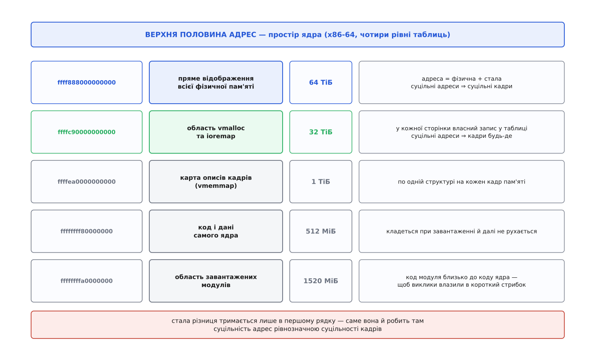
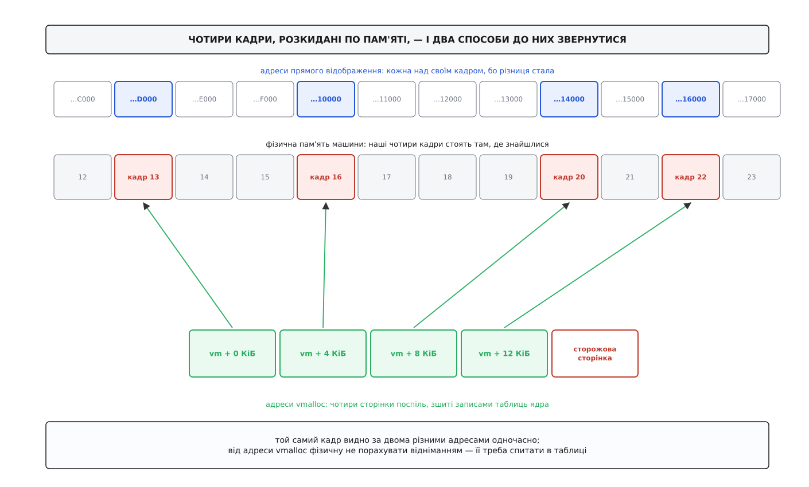
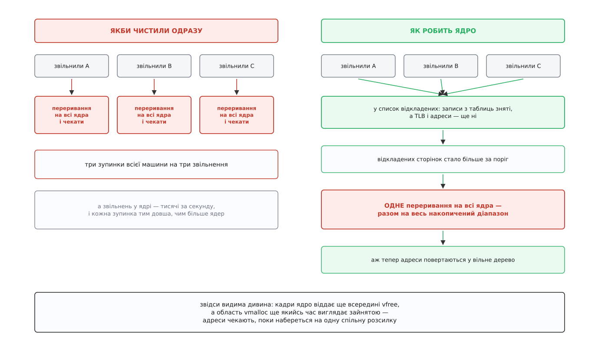

# vmalloc: віртуально суцільна пам'ять ядра

<preknowlist>
- [Сторінки, таблиці сторінок і MMU](root:sf-os/paging-and-mmu) — пам'ять нарізана на сторінки, під ними фізичні кадри, а переклад адреси бере запис таблиці.
- [Віртуальний адресний простір процесу](root:sf-os/virtual-address-space) — адреса сама по собі не значить нічого, значення їй дає таблиця сторінок.
- [Фізичні сторінки в ядрі](root:sys-unix/physical-page-allocator) — кадри роздають блоками за порядками, і великий блок може не знайтися навіть тоді, коли вільної пам'яті вдосталь.
- [Пам'ять ядра: slab](root:sys-unix/kernel-memory-slab) — `kmalloc` нарізає дрібні об'єкти зі слабів, а слаб — це суцільний блок кадрів.
- [Ядро й простір користувача](root:sys-unix/kernel-and-userspace) — код ядра живе у верхній половині тих самих адрес, у яких працює процес.
- [TLB](root:hw-arch/tlb) — маленький кеш готових перекладів у процесорі; його обхват дорівнює кількості записів на розмір сторінки.
</preknowlist>

Виклик `kmalloc(8 << 20, GFP_KERNEL)` на машині з дванадцятьма вільними гігабайтами повертає `NULL`. Наступний рядок, `vmalloc(8 << 20)`, повертає робочий покажчик — за ту саму мить, з тієї самої пам'яті, у тому самому ядрі. Обидві адреси можна розіменувати, обидві ведуть у пам'ять ядра, обидві дають вісім мегабайтів поспіль.

Отже, справа не в тому, скільки пам'яті лишилося. Справа в тому, **якої** пам'яті просять — і в дивній обставині, з якої все випливає: ядро на цій машині єдине, хто майже не користується віртуальною пам'яттю. Воно роздає її всім, а собі майже все відображення жорстко зафіксувало. `vmalloc` — це те місце, де воно робить для себе виняток, і кожна властивість цього виклику, добра чи прикра, є наслідком того винятку.

## Вікно ядра на пам'ять — з нерухомою рамою

Ядру треба звертатися до будь-якого кадру пам'яті будь-якої миті. Воно тримає в кадрах таблиці сторінок усіх процесів, сторінки файлового кеша, власні структури, буфери пристроїв. І звертається до них у контекстах, де перебирати варіанти ніколи: усередині обробника переривання, під замком, на шляху обробки [сторінкового збою](root:sf-os/page-fault).

Звідси перша вимога: кожен кадр мусить бути досяжним **уже**, без жодних дій. Якби ядро відображало собі кадри в міру потреби, то на кожне звернення до нової сторінки треба було б спершу побудувати відображення — а щоб його побудувати, треба звернутися до таблиці, яка теж лежить у кадрі. Замкнене коло.

Друга вимога виникає з протилежного боку. Ядро постійно перекладає адресу назад у фізичну: пристроєві треба сказати фізичну адресу буфера, у запис таблиці сторінок треба покласти номер кадру, апаратура іншого способу не розуміє. Такий переклад робиться мільйони разів за секунду й на найгарячіших шляхах.

Обидві вимоги задовольняє одне рішення. Ядро одноразово, ще на завантаженні, відображає **всю** фізичну пам'ять машини в суцільний шматок своїх адрес — так, щоб адреса відрізнялася від фізичної на сталу. Це його **пряме відображення**. Переклад в один бік — додавання, у другий — віднімання; жодного обходу таблиць, жодної можливості схибити.



*Стала різниця тримається лише в першій смузі — і саме вона робить там суцільність адрес рівнозначною суцільності кадрів.*

А тепер наслідок, заради якого все це й розказано. Якщо різниця між адресою й фізичним номером стала, то дві сусідні адреси в цьому відображенні лежать у двох сусідніх кадрах. **Завжди.** Суцільність адрес тут не окрема властивість, яку можна влаштувати таблицями, — вона тотожна суцільності кадрів.

Тому запит «дай мені вісім мегабайтів пам'яті ядра» через `kmalloc` насправді означає «знайди дві тисячі сорок вісім кадрів, що лежать поспіль». А розподільник кадрів роздає блоки не будь-якого розміру: тільки степенями двійки, і найбільший блок обмежений стелею `MAX_PAGE_ORDER`, яка типово дорівнює десяти, тобто чотирьом мегабайтам. Вісім мегабайтів одним блоком не існує **взагалі**, хоч би пам'ять була порожня. Та й чотири мегабайти на машині, що пропрацювала тиждень, знайдуться далеко не завжди — форма вільної пам'яті псується з часом.

## Що коштує відмовитися від сталого зсуву

Бачимо, звідки взялася відмова: не з браку пам'яті, а з жорсткого правила, яке ядро наклало на себе саме. Питання, отже, ставиться так: чи можна це правило десь послабити, не втративши того, заради чого воно є.

Скасувати його всюди не можна — на ньому тримаються всі гарячі шляхи. Але його можна скасувати **на окремій ділянці адрес**. Ядро відрізає собі шматок віртуальних адрес, у якому стала різниця не діє й діяти не має: кожна сторінка там описана звичайним записом таблиці, тим самим, яким описані сторінки процесів. А запис таблиці може вказувати куди завгодно.

Ділянка ця має початок і кінець (у коді — `VMALLOC_START` і `VMALLOC_END`), і саме тому перевірка «чи ця адреса з тієї ділянки» — просто порівняння двох чисел. Це важливо: код, який отримав покажчик у ядрі, мусить дешево дізнатися, чи можна над ним робити арифметику прямого відображення. Якби «особливі» сторінки були розсипані всередині прямого відображення, довелося б перевіряти кожну адресу обходом таблиць — і дешева арифметика перестала б бути дешевою скрізь. Тому область винесена окремо, і на x86-64 вона займає тридцять два терабайти між прямим відображенням і картою описів кадрів.

Тепер у ядра є два способи назвати ту саму пам'ять — і `vmalloc` користується другим.

## Що робить виклик, крок за кроком

Розберімо по діях те, що відбувається за одним рядком `vmalloc(8 << 20)`.

**Спершу шукають адреси, а не пам'ять.** В області vmalloc треба знайти вільний проміжок на дві тисячі сорок вісім сторінок — і ще на одну зверху. Ця зайва сторінка не відображається нікуди й зветься **сторожовою**: вона стоїть одразу за кінцем ділянки, тож будь-яке звернення на крок далі за межу дає сторінковий збій замість тихого псування сусідньої ділянки. У прямому відображенні такої розкоші немає — там за кінцем вашого буфера одразу починається чужа пам'ять, цілком собі відображена.

**Далі беруть кадри — по одному.** Дві тисячі сорок вісім окремих запитів на один кадр, порядок нуль. Саме тут ховається вся відповідь на початкове питання: запит на один кадр майже ніколи не провалюється, бо кадри порядку нуль є завжди, поки взагалі є вільна пам'ять. Форма вільної пам'яті перестає мати значення, бо форми більше не просять.

**Потім будують таблиці.** Для кожної з двох тисяч сорока восьми адрес у таблицях сторінок ядра з'являється запис, який вказує на щойно взятий кадр. Проміжні рівні дерева, яких ще немає, теж треба створити — а це знову виділення пам'яті.

**І повертають адресу початку.** З погляду коду, що її отримав, це звичайний покажчик на вісім мегабайтів поспіль. Він і є суцільний — з погляду адрес.



*Кадри лежать там, де знайшлися; записи таблиць зшивають їх у рівний діапазон. Той самий кадр при цьому доступний за двома адресами одночасно.*

Із цієї послідовності одразу випливають дві речі, які кусаються на практиці.

Перша: **виклик може заснути**. Він бере кадри, він будує таблиці, він може чекати, поки система звільнить пам'ять. Тому в обробнику переривання, під спін-замком чи будь-де, де [спати не можна](root:sys-unix/kernel-locking), `vmalloc` не викликають — і компілятор про це не попередить, зламається воно вже під навантаженням.

Друга: **у кадра тепер дві адреси**. Він як лежав у прямому відображенні за своєю сталою адресою, так і лежить; додалася ще одна, з області vmalloc. Обидві робочі, обидві ведуть в ті самі байти. І це означає, що звична арифметика на адресі vmalloc дає сміття: відняти сталу можна, тільки результат не має жодного стосунку до фізичного розташування. Щоб дістати справжній кадр, ядро мусить пройти таблицями — для цього є окремий виклик, і про нього, як і про решту дверей у цю область, — [перелік інтерфейсів vmalloc](root:sys-unix/vmalloc-kernel-mappings/api-vmalloc-interfaces.md): що саме викликати, з якими прапорцями, що звідки повертається й чого звідки робити не можна.

> 🔧 **Навіщо це.** Найдорожча помилка з цією пам'яттю виглядає невинно: драйвер бере буфер через `vmalloc`, бо так надійніше виділяється, і віддає його адресу пристроєві для [прямого доступу до пам'яті](root:sys-unix/dma-and-buffers). Пристрій не проходить крізь таблиці сторінок процесора — він виставляє фізичну адресу на шину. Драйвер дасть йому фізичну адресу першого кадру, пристрій напише вісім мегабайтів **поспіль від неї** — і затре все, що трапилося далі в пам'яті. Помилка не проявиться на тесті, бо на щойно завантаженій машині кадри часто справді йдуть підряд. Вона проявиться в полі, через місяці. Або буфер бере [список розкиданих шматків](root:hw-arch/scatter-gather), або перед пристроєм стоїть [IOMMU](root:hw-arch/iommu), або пам'ять мусить бути фізично суцільною.

## Ціна, яку видно в профілі

Записи таблиць дали свободу від форми. Тепер порахуймо, у що ця свобода обходиться під час роботи — не при виділенні, а на кожному зверненні.

Пряме відображення ядро будує не звичайними сторінками. Оскільки воно однорідне й міняється хіба на гарячому обміні пам'яттю, ядро кладе його [великими сторінками](root:sys-unix/huge-pages-tlb-reach) — на x86-64 по два мегабайти, а де можна, то й по гігабайту. Один запис таблиці покриває два мегабайти, один запис у TLB — теж.

Область vmalloc так покласти не можна за побудовою: кожна сторінка вказує на свій кадр, тобто кожна сторінка потребує власного запису.

**Умова: обходимо буфер на 8 МіБ безладно, у другому рівні TLB — 2048 записів.**

```
через пряме відображення:
  8 МіБ / 2 МіБ  =    4 записи TLB       → 0.2 % ємності TLB

через vmalloc:
  8 МіБ / 4 КіБ  = 2048 записів TLB      → 100 % ємності TLB

обхват TLB звичайними сторінками: 2048 · 4 КіБ = 8 МіБ
```

Різниця не в разах, а більш як на два порядки: дві тисячі сорок вісім записів замість чотирьох, у п'ятсот дванадцять разів більше. Той самий буфер, ті самі байти, та сама фізична пам'ять — але через vmalloc він сам по собі витісняє з TLB **усе інше**, чим займався процесор. Тому в профілі це видно не як повільний доступ до буфера, а як загальне сповільнення всього коду навколо: у сусідів раптом почали промахуватися переклади.

Із цією ціною борються так само, як і в просторі процесів. Від версії 5.13 ядро вміє класти й область vmalloc великими сторінками — механізм додав Nick Piggin: виділення, не менше за розмір великої сторінки, пробує лягти нею й відкочується на звичайні, якщо не вийшло. Архітектури вмикають це в себе окремо. Типовою поведінкою воно, щоправда, пробуло рік: від 5.19 великі сторінки тут дістає лише той, хто попросив їх явно. Причина та сама, з якої вони й не всюди помагають: власник ділянки має право поміняти права окремій сторінці всередині неї — а там, де сторінкам потрібні різні права, як у коді модуля, де сторінки з кодом мусять бути недоступними для запису, велику сторінку розділити ніяк.

## Звільнення коштує дорожче за виділення

Тут ховається головна незручність цієї області, і вона не очевидна, поки не подивитися, чим відображення ядра відрізняється від відображення процесу.

Таблиці ядра **спільні для всіх**. Верхня половина адрес однакова, у якому процесі не опинися; на цю однаковість спирається геть усе — код ядра має працювати на будь-якому ядрі процесора, у контексті будь-якої задачі. Тому й копії перекладів для цих адрес лежать у TLB **кожного** процесорного ядра, і жодна мітка адресного простору тут не рятує: адреса не належить якомусь одному простору, вона належить усім.

Виходить, що прибрати один запис із таблиці ядра — це не локальна дія. Треба, щоб про це дізналися всі процесорні ядра: розіслати їм переривання й дочекатися підтвердження від останнього. Це і є [вибивання TLB](root:sys-unix/tlb-shootdown), і воно синхронне — той, хто звільняє, стоїть.

Тепер прикиньте вартість. Кожен `vfree` — зупинка всієї машини на час обходу всіх ядер. Звільнень у ядрі тисячі за секунду, а ціна кожного росте разом із кількістю ядер. Так система не масштабується взагалі.

Вихід знайшовся в тому, що для **звільнення** негайність насправді не потрібна. Небезпечно, коли адреса вже комусь віддана, а в чужому TLB ще висить стара відповідь. Отже, досить не віддавати адресу нікому доти, доки очистка не сталася.

Саме це ядро й робить. Звільнена ділянка йде до списку відкладених: записи з таблиць знімають одразу, а от TLB не чіпають і адреси у вільне дерево не повертають. Коли відкладених сторінок набирається більше за поріг, ядро робить одну спільну очистку: одна розсилка переривань на весь накопичений діапазон — і всі ділянки разом повертаються у вільні.



*Ціна розсилки перестає залежати від кількості звільнень і починає залежати від порога — саме тому адреси й повертаються не одразу.*

Цю схему разом із деревом зайнятих ділянок, упорядкованим за адресою, приніс той самий Nick Piggin у версію 2.6.28 (кінець 2008 року) — доти кожен `vunmap` робив повне глобальне скидання під єдиним глобальним замком, і на машинах із багатьма ядрами витрати росли квадратично. Через десять років область переробили вдруге, уже з іншого боку: [як vmalloc двічі переписували й що саме в ньому щоразу впиралося](root:sys-unix/vmalloc-kernel-mappings/hist-vmalloc-scalability.md) — окрема історія, з іменами, числами й тим, чому «просто пошук вільного місця» виявився вузьким місцем.

Три наслідки відкладеної очистки видно неозброєним оком.

**Адреси** повертаються не одразу. Кадри ядро віддає ще всередині `vfree`, а от адреси лишаються за ділянкою доти, доки не набереться на спільну очистку; весь цей час вони видні в переліку зайнятих окремими рядками «звільнене, ще не вичищене». Виглядає це точнісінько як витік — тільки витоку тут немає.

Область може «скінчитися» тоді, коли вільного в ній вдосталь. Якщо адрес забракло, а купа їх лежить у відкладених, ядро змушене зробити очистку негайно й пошукати ще раз — тобто саме тоді, коли всім найтісніше, воно платить повну ціну розсилки.

І звільняти теж можна не звідусіль: зняття записів — операція, що може заснути. З обробника переривання ядро відкладає роботу в чергу й повертається одразу, а в найжорсткішому контексті, у немаскованому перериванні, звільняти не можна взагалі.

## Скільки там адрес — і чому це колись боліло

На x86-64 з чотирма рівнями таблиць під область відведено тридцять два терабайти, з п'ятьма — дванадцять із половиною петабайтів. Вичерпати таке навряд чи вийде; практичною величиною лишається хіба роздрібненість самої області, коли довгий буфер не влазить між чужими ділянками.

На тридцяти двох бітах усе було навпаки, і саме там ця область стала загальновідомим болем. Усього адрес — чотири гігабайти, ядру з них дістається один, і в цей гігабайт мусять влізти і пряме відображення, і область vmalloc, і ділянки пристроїв, і модулі. Типово область vmalloc отримувала близько ста двадцяти восьми мегабайтів — на всіх одразу. Драйвер відеокарти, який просив відобразити кадровий буфер, міг з'їсти її сам; повідомлення «vmalloc: allocation failure» і «out of vmalloc space» були звичайною справою. Ліки полягали в параметрі завантаження `vmalloc=`, який розширював область, — але не з повітря, а за рахунок пам'яті, доступної в прямому відображенні. Кожен мегабайт, доданий одній стороні, віднімався в іншої.

Це не історична цікавинка: у вбудованих системах на тридцяти двох бітах така арифметика жива й досі, і саме через неї там ретельно рахують, скільки чого відображено.

## Кому це насправді потрібно

Могло б скластися враження, що йдеться про рідкісний запасний шлях для завеликих буферів. Насправді на цій області тримаються речі, які працюють на кожній машині щосекунди.

**Модулі ядра.** Код [завантаженого модуля](root:sys-unix/kernel-modules) мусить лежати за суцільними адресами — переходи всередині нього обчислюються як зміщення. Фізично суцільним він бути не зобов'язаний ніяк. Це рівно та задача, під яку область і придумана: зшити розрізнене в рівний діапазон і роздати сторінкам різні права — код виконуваний, дані ні. На x86-64 модулям при цьому відведено власний діапазон адрес поряд із кодом ядра (щоб виклики між ними влазили в короткий стрибок), але адреси в ньому роздає той самий механізм — тому модулі й видно в спільному переліку ділянок.

**Стеки задач у ядрі.** Кожна задача має власний стек у ядрі, звичайно на шістнадцять кілобайтів. Раніше його брали з прямого відображення, і [переповнення](root:sf-lang/stack-overflow) тихо затирало сусідні структури — а помирала система пізніше й в іншому місці, тому такі збої славилися невловимістю. Від версії 4.9 x86-64 уміє інше: стек беруть з області vmalloc, і за ним стоїть сторожова сторінка. Перший же крок за межу дає збій рівно в тій точці, де стався, зі зрозумілим слідом викликів. Ціна — та сама, що й всюди тут: чотири окремі сторінки в TLB замість шматочка великої сторінки, плюс те, що [адресу такого стека не можна дати пристроєві](root:sf-lang/task-stacks). Механізм увів Andy Lutomirski у 2016 році; згодом його підхопили arm64, powerpc, riscv, s390.

**Регістри пристроїв.** Керуючі регістри контролера — це взагалі не пам'ять: за їхніми фізичними адресами немає жодного кадру, там сидить сам пристрій ([відображення пристрою в адреси](root:hw-arch/memory-mapped-io)). Пряме відображення їх не покриває й покривати не може. Записи в таблицях, які вказують на такі адреси, живуть у тій самій області vmalloc — тому в переліку зайнятих ділянок поряд із буферами видно рядки з позначкою `ioremap`.

**Великі таблиці, що живуть вічно.** Хеш-таблиці, які ядро будує на завантаженні під розмір пам'яті машини, бувають на сотні мегабайтів. Вимагати від системи такий суцільний блок безглуздо, а звільняти їх ніхто ніколи не буде — витрати на TLB окупаються тим, що виділення взагалі стало можливим.

**І компроміс на щодня.** Код, якому потрібен буфер «зазвичай невеликий, але іноді величезний», зазвичай не вибирає між двома викликами вручну: є проміжний, який пробує спершу дешевий шлях і відкочується на vmalloc, коли суцільного блока не знайшлося. Він зручний рівно доти, доки ніхто не забуває, що результат може виявитися фізично розсипаним — і не віддає його пристроєві.

> 🔧 **Навіщо це.** У `/proc/meminfo` для цієї області є рядок `VmallocUsed`, тільки каже він одне-єдине — «скільки», та й то лише про кадри, узяті самим `vmalloc`: ділянки `ioremap` і `vmap` у нього не потрапляють, а рядок `Slab` не враховує їх і поготів. Тому «пам'ять кудись зникає, а винних немає» — типовий симптом витоку саме тут. Розбирають його одним файлом: `/proc/vmallocinfo` показує кожну ділянку з адресою, розміром і **функцією, яка її просила**. Згрупувати рядки за викликачем і подивитися, чия сума росте від години до години, — [маленька програма, що читає `/proc/vmallocinfo` і показує, хто тримає область](root:sys-unix/vmalloc-kernel-mappings/proj-vmallocinfo-reader.md): розбір формату, підсумки за викликачами й пошук найбільшого вільного проміжку, у який мусить влізти наступний запит.

## Як ядро тримає облік самої області

Лишилося питання, яке ми досі обходили: як узагалі шукається «вільний проміжок на 2049 сторінок».

Кожна зайнята ділянка описана структурою з початком і кінцем, і всі вони зібрані в [червоно-чорне дерево](root:sf-algorithms/red-black-tree), упорядковане за адресою. Дерево дає швидку відповідь на питання «чия це адреса» — потрібне при звільненні й при перевірках. А от на питання «де взяти стільки-то вільного місця з таким вирівнюванням» воно прямої відповіді не дає: доводилося йти списком зайнятих ділянок від початку області й дивитися в проміжки між ними. На довгій області з тисячами ділянок це лінійний прохід, і кожне виділення платило за нього.

Полагодили це просто й гарно: завели **друге дерево — з вільних проміжків**, у якому кожен вузол додатково знає найбільший вільний розмір у своєму піддереві. Тоді пошук іде згори вниз, відсікаючи цілі гілки, у яких потрібного шматка свідомо немає, і замість проходу всім списком виходить спуск деревом. Виділення перестало залежати від того, скільки всього ділянок в області.

Окремо живе ще один шар — для дрібних і короткочасних відображень, які ядро робить дуже часто (наприклад, коли треба на мить зшити кілька сторінок разом). Ходити по них у спільне дерево було б безглуздо: черга на спільний замок з'їла б усю вигоду. Тому ядро тримає запас уже виділених шматків адрес [на кожному ядрі процесора окремо](root:sys-unix/per-cpu-data) і роздає дрібні відображення звідти, не торкаючись спільної структури.

## Як обирати

Питання «`kmalloc` чи `vmalloc`» звучить як питання про розмір, а насправді розмір у ньому — останній аргумент. Усе, що ми розібрали, зводиться до трьох питань, і жодне з них не про кількість байтів.

Чи дивитиметься на цю пам'ять хтось, крім процесора цієї машини? Пристрій із прямим доступом, запис у таблиці сторінок, будь-що, що бачить фізичні адреси, — тоді розсипані кадри виключені, і фізична суцільність обов'язкова.

Звідки виділяємо? Якщо з контексту, де не можна спати, — теж виключено: побудова таблиць чекання не терпить.

Що з цією пам'яттю робитимуть далі? Якщо по ній безладно ходитимуть на гарячому шляху, кожна сторінка з'їсть запис TLB, і виграш від легкого виділення обернеться програшем на кожному зверненні.

Три «ні» — і vmalloc стає не запасним шляхом, а правильним вибором: він знімає з системи вимогу, яку та найважче задовольняє, — вимогу до **форми** вільної пам'яті. Три «ні» ще й пояснюють, чому цю область не зробили відповіддю на все: вона не дає пам'яті більше, ніж є. Вона лише міняє дефіцитну властивість на ту, якої вдосталь, і чесно бере за обмін TLB, таблиці й розсилку переривань.
