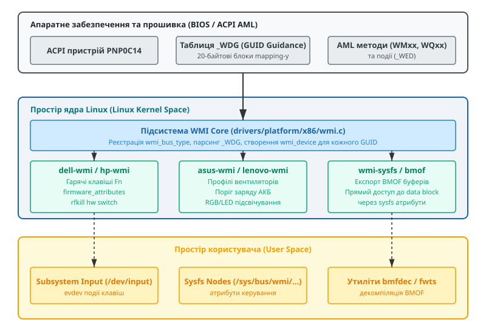
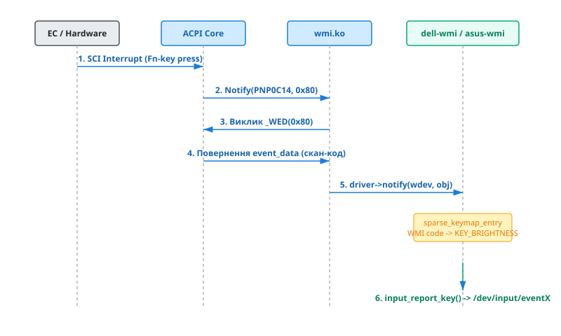

# Інтерфейс WMI (ACPI-WMI) у драйверах Linux

<preknowlist>
- [ACPI таблиці та простір імен](topic:sys-unix/acpi-tables-and-namespace) — принципи побудови таблиць DSDT/SSDT, АМЛ-код та об'єкти в просторі імен ACPI.
- [Модель пристроїв Linux](topic:sys-unix/sysfs-device-model) — концепція пристроїв `struct device`, драйверів та віртуальних шин у sysfs.
- [Прив'язка драйверів у ядрі](topic:sys-unix/driver-probe-and-binding) — механізм `probe`, `remove` та таблиці маппінгу пристроїв.
</preknowlist>

Сучасні ноутбуки, моноблоки та настільні материнські плати містять десятки нестандартних апаратних вузлів: спеціалізовані Fn-клавіші, мультизонове RGB-підсвічування клавіатури, графічні перемикачі MUX Switch для керування дискретною відеокартою, апаратні профілі вентиляторів та специфічні налаштування BIOS. Базовий специфікаційний стандарт ACPI (Advanced Configuration and Power Interface) описує лише уніфіковані класи пристроїв — стандартні батареї, адаптери живлення AC, кнопки живлення та термозони (thermal zones). Він не містить готові інтерфейси для регулювання яскравості світлодіодного підсвічування конкретної моделі ноутбука чи встановлення порогу заряду акумулятора.

Історично кожен OEM-виробник обладнання (Dell, ASUS, HP, Lenovo, Toshiba) розв'язував цю проблему шляхом створення власних ACPI-об'єктів у просторі імен DSDT з довільними текстовими назвами методів та унікальними апаратними ідентифікаторами. Однак така практика змушувала розробників операційних систем тримати окремий унікальний код під кожну ревізію материнської плати. Для усунення цієї фрагментації та створення уніфікованого каналу зв'язку між операційною системою та прошивкою BIOS було розроблено апаратний інтерфейс **ACPI-WMI**.

## Історичний контекст та причинно-наслідковий механізм WMI

До виникнення уніфікованої специфікації WMI to ACPI Mapper керування нестандартними апаратними функціями здійснювалося через виклики System Management Interrupt (SMI). Коли операційній системі потрібно було змінити налаштування BIOS чи зчитати статус апаратного перемикача, драйвер записував дані у спеціальні I/O-порти (наприклад порт `0xb2`), що викликало апаратне переривання SMI# на шині процесора.

При виникненні SMI процесор негайно призупиняв виконання усіх ядер операційної системи, зберігав поточний стан регістрів у виділену область оперативної пам'яті SMRAM і переходив у режим System Management Mode (SMM), де виконувався закритий код прошивки материнської плати.

Режим SMM спричиняв значні затримки (latency spikes), непередбачувані джитери у системах реального часу (зокрема у ядрах із патчами PREEMPT_RT) та був повністю закритим "чорним ящиком" для операційної системи. Операційна система не могла контролювати виконання коду в SMM, а помилки у прошивці материнської плати призводили до повного зависання процесора без можливості зчитати дамп пам'яті. Крім того, прямі виклики SMI не відповідали архітектурі безпеки сучасних систем. Виникла нагальна потреба перенести керування апаратурою у безпечне середовище ACPI AML (ACPI Machine Language), де виконання коду прошивки здійснюється під контролем інтерпретатора ядра операційної системи (ACPICA).

Для розв'язання цієї проблеми корпорація Microsoft спільно з провідними виробниками апаратного забезпечення розробила специфікацію "WMI to ACPI Mapper Specification". Замість створення унікальних імен ACPI-методів для кожного пристрою специфікація інкапсулює вендорські функції в один стандартний ACPI-пристрій із Hardware ID `PNP0C14`. Усі апаратні методи, блоки даних та події прив'язуються до 128-бітних глобально унікальних ідентифікаторів — **GUID** (Globally Unique Identifier).

Детальний опис історичних етапів переходу від SMI/SMM та хаотичних ACPI-розширень до уніфікованої шини описує [історія появи WMI to ACPI Mapper](topic:sys-unix/wmi-windows-management-instrumentation/hist-wmi-to-acpi.md).

Хоча у назві технології присутній абревіатурний елемент "WMI" (Windows Management Instrumentation), сама специфікація мапера є чисто апаратною специфікацією ACPI. Операційна система Linux реалізує підтримку цього стандарту у ядрі через підсистему `wmi.ko` (`drivers/platform/x86/wmi.c`). Драйвер парсить ACPI-пристрій `PNP0C14`, будує внутрішню шину ядра `wmi_bus_type` і транслює абстрактні GUID на стандартні об'єкти Linux Device Model.


*Архітектурні шари підсистеми ACPI-WMI у ядрі Linux: від ACPI-пристроїв до атрибутів sysfs та підсистеми input.*

## Будова ACPI-пристрою PNP0C14 та таблиця _WDG

У таблицях прошивки DSDT (Differentiated System Description Table) або SSDT (Secondary System Description Table) пристрій WMI оголошується у просторі імен ACPI як об'єкт із HID `PNP0C14`:

```asl
Device (WMI1)
{
    Name (_HID, EisaId ("PNP0C14"))
    Name (_UID, 0x01)
    
    // WDG: WMI Data Guidance (масив маппінгу GUID)
    Name (_WDG, Buffer () { ... })
    
    // Методи керування (Control Methods)
    Method (WMAB, 3, NotSerialized) { ... }
    Method (WQAB, 1, NotSerialized) { ... }
    Method (WSAB, 2, NotSerialized) { ... }
    
    // Метод отримання даних події
    Method (_WED, 1, NotSerialized) { ... }
}
```

Ключовим об'єктом пристрою `PNP0C14` є **`_WDG`** (WMI Data Guidance). Це двійковий буфер, що складається з послідовності бінарних записів фіксованої довжини — рівно **20 байт** на кожну функцію, подію або блок даних, який експортує BIOS.

### Анатомія 20-байтового запису _WDG

Кожен 20-байтовий елемент у таблиці `_WDG` має чітку бінарну структуру:

```text
+------------------------------------+------------------+----------------+---------------+
| GUID (16 байт)                     | Object ID (2 б.) | Inst Count (1) | Flags (1 байт)|
+------------------------------------+------------------+----------------+---------------+
| 9DBB5994-A997-11DA-B012-B622A1EF.. | "AB" (ASCII)     | 0x01           | 0x02 (METHOD) |
+------------------------------------+------------------+----------------+---------------+
```

1. **GUID (16 байт):** 128-бітне число, збережене у Little-Endian форматі за правилами бінарного впорядкування UUID. Поля GUID зберігаються у пам'яті так: `Data1` (4 байти, Little-Endian), `Data2` (2 байти, Little-Endian), `Data3` (2 байти, Little-Endian), `Data4` (8 байт, Big-Endian). Під час парсингу `wmi.ko` конвертує ці байти у канонічний рядок GUID (наприклад, `9DBB5994-A997-11DA-B012-B622A1EF5492`, який у ноутбуках Dell використовується для гарячих клавіш).
2. **Object ID (2 байти):** Двосимвольний ASCII-рядок (наприклад `"AB"`, `"00"`, `"BC"`). Оперуючи цим ідентифікатором, ядро будує назву ACPI-методу в АМЛ-коді шляхом додавання двох символів до стандартизованого двосимвольного префікса. Використання ASCII-рядків забезпечує пряму відповідність 4-символьним іменам об'єктів в інструкціях ASL/AML (наприклад `WMAB`).
3. **Instance Count (1 байт):** Кількість екземплярів пристрою чи об'єкта даних (найчастіше дорівнює `1`).
4. **Flags (1 байт):** Бітова маска прапорців, що визначають тип і можливості відповідного GUID:
   - `0x01` (`ACPI_WMI_EXPENSIVE`): Опитування блоку даних є ресурсоємним для системного контролера; ядро не повинно викликати його у фонових циклах.
   - `0x02` (`ACPI_WMI_METHOD`): GUID описує виконуваний метод і підтримує виклики через ACPI-методи `WMxx`.
   - `0x04` (`ACPI_WMI_STRING`): Повернені методом дані є ASCII або Unicode рядком.
   - `0x08` (`ACPI_WMI_EVENT`): GUID асоційований з асинхронним апаратним сповіщенням і підтримує метод `_WED`.

### Формування імен ACPI-методів WMI

Під час виконання операцій з обладнанням ядро Linux комбінує стандартизовані префікси та `Object ID` з `_WDG`:

- **`WQxx` (WMI Query):** Зчитування даних. Якщо `Object ID` дорівнює `"AB"`, ядро викликатиме AML-метод `WQAB(InstanceIndex)`. Метод повертає буфер або пакет `acpi_object`.
- **`WSxx` (WMI Set):** Запис нових конфігураційних даних. Ядро викликає `WSAB(InstanceIndex, DataBuffer)`.
- **`WMxx` (WMI Execute Method):** Виконання дій, якщо у `_WDG` встановлено прапорець `ACPI_WMI_METHOD` (`0x02`). Метод приймає три обов'язкові аргументи: `WMAB(InstanceIndex, MethodID, InputBuffer)`.
- **`_WED` (WMI Event Data):** Отримання деталей апаратної події. Коли пристрій надсилає Notify, ядро викликає `_WED(NotificationCode)` для зчитування зкан-коду або опису події.

При виконанні методів інтерпретатор ACPICA ядра гарантує взаємовиключення через ACPI-м'ютекси, що запобігає стану гонитви (race conditions) при одночасному зверненні кількох драйверів до шини Embedded Controller.

Детальний перелік макросів, системних прапорців та структур даних містить [повний довідник API ядра Linux](topic:sys-unix/wmi-windows-management-instrumentation/api-wmi-kernel-surface.md).

## Архітектура wmi.ko та шина wmi_bus_type

У ранніх версіях ядра Linux (до випуску ядра 4.13) підтримка WMI реалізовувалася як монолітний модуль `wmi.ko`, який експортував глобальні C-функції `wmi_evaluate_method()` та `wmi_install_notify_handler()`. Вендорські драйвери знаходили пристрої за текстовими GUID-рядками у загальному списку.

У сучасному ядрі Linux підсистему WMI повністю інтегровано у загальну концепцію Linux Device Model на основі спеціалізованої віртуальної шини — **`wmi_bus_type`**.

Процес ініціалізації підсистеми під час завантаження ядра відбувається за такою послідовністю дій:

1. Драйвер `wmi.ko` реєструється у ядрі як обробник ACPI-пристроїв з HID `PNP0C14`.
2. Коли підсистема ACPI виявляє пристрій `PNP0C14`, вона викликає функцію `probe` драйвера `wmi.ko`.
3. Драйвер зчитує буфер `_WDG` з DSDT/SSDT, розбиває його на 20-байтові блоки та парсить вміст.
4. Для кожного виявленого GUID розробники ядра створюють внутрішню структуру `struct wmi_block`, яка зберігається у зв'язаному списку `wmi_block_list`. Звільнення пам'яті для цих блоків керується ресурсо-управляючими функціями `devm_kzalloc()`, що унеможливлює витікання пам'яті при деініціалізації ACPI-пристроїв.
5. Для кожного виявленого GUID створюється об'єкт `struct wmi_device`, який реєструється на шині `wmi_bus_type` і з'являється у віртуальній файловій системі sysfs за адресою `/sys/bus/wmi/devices/<GUID>/`.
6. Підсистема генерує для кожного пристрою рядок `modalias` (наприклад, `wmi:9DBB5994-A997-11DA-B012-B622A1EF5492`), що дозволяє менеджеру демонів `udev` автоматично завантажувати відповідний модуль ядра (`dell-wmi`, `asus-wmi` тощо). Демон `udevd` зіставляє рядок modalias із правилами у файлі `/lib/modules/$(uname -r)/modules.alias` і виконує системний виклик `finit_module()`.
7. Драйвери пристроїв реєструють структури `struct wmi_driver`. Функція зіставлення `wmi_bus_match()` порівнює GUID і за умови збігу викликає функцію `.probe()` відповідного вендорського драйвера.

```c
// Спрощена структура об'єкта пристрою WMI у ядрі
struct wmi_device {
    struct device dev;
    char guid_string[37];
    u8 flags;
    u8 instance_count;
    char object_id[2];
};
```

Приклад декларативної реєстрації таблиці ідентифікаторів у вендорському драйвері:

```c
static const struct wmi_device_id asus_wmi_id_table[] = {
    { "97845ED0-4E6D-11DE-8A39-0800200C9A66", NULL },
    { }
};
MODULE_DEVICE_TABLE(wmi, asus_wmi_id_table);
```

## Життєвий цикл обробки апаратних подій WMI

Важливим завданням підсистеми WMI є транслювання натискань гарячих клавіш Fn, сигналів датчиків відкриття кришки чи апаратних перемикачів бездротового зв'язку у стандартні події ядра Linux.

Повний ланцюг обробки апаратної події від фізичного натискання клавіші до простору користувача простежується за такими етапами:


*Послідовність обробки апаратного сповіщення: від апаратного переривання EC SCI до підсистеми evdev.*

1. **Фізичне натискання:** Користувач натискає комбінацію Fn+F5 для збільшення яскравості екрана.
2. **Переривання EC:** Системний мультиконтролер (Embedded Controller, EC) ноутбука фіксує замикання матриці клавіатури і генерує апаратне ACPI-переривання SCI (System Control Interrupt) на лінію переривань чипсета PCH.
3. **Обробка GPE та виконання AML Notify:** Обробник SCI у ядрі Linux запускає диспатчер GPE (General Purpose Event) в ACPI Core, який виконує метод обробника переривання у DSDT. Цей метод викликає інструкцію `Notify(\_SB.WMI1, 0x80)`, де `0x80` — код сповіщення.
4. **Перехоплення wmi.ko:** Модуль `wmi.ko` приймає Notify, переглядає свою внутрішню таблицю `_WDG` та знаходить GUID із прапорцем `ACPI_WMI_EVENT` (`0x08`), чий notification ID дорівнює `0x80`.
5. **Запит даних через _WED:** Для отримання деталей події `wmi.ko` виконує AML-метод `_WED(0x80)`. Метод повертає буфер із даними (наприклад, скан-код `0x85`).
6. **Виклик callback у драйвері:** `wmi.ko` передає отриманий об'єкт у зворотно-викликову функцію `.notify()` прив'язаного драйвера (`asus-wmi` або `dell-wmi`).
7. **Трансляція в input:** Вендорський драйвер шукає скан-код `0x85` у своїй таблиці маппінгу `sparse_keymap` (яка ініціалізується функцією `sparse_keymap_setup()`) і перетворює його на кодовий констант ядра Linux `KEY_BRIGHTNESSUP`.
8. **Генерація події evdev:** Функція `input_report_key()` надсилає подію у підсисту input, звідки вона потрапляє у пристрій `/dev/input/eventX` і далі до графічної оболонки Wayland або X11. Демони керування живленням (наприклад `systemd-logind` чи `power-profiles-daemon`) змінюють яскравість екрана через sysfs-атрибути `/sys/class/backlight/`.

## Синхронізація та управління живленням пристроїв WMI

При виконанні методів WMI в багатозадачному середовищі операційної системи виникає проблема синхронізації доступу до системного контролера. Коли кілька процесів простору користувача паралельно зчитують статуси вентиляторів чи змінюють рівень підсвічування через sysfs, ядро гарантує безпеку через внутрішні м'ютекси підсистеми ACPICA. Інтерпретатор AML виконує операції запису в I/O-порти EC під захистом інструкцій `AcpiAcquireMutex`. Якщо метод BIOS не встигає відповісти за встановлений таймаут, `wmidev_evaluate_method` повертає статус помилки `AE_TIME`, унеможливлюючи нескінченне блокування викликаючого потоку ядра.

Важливим аспектом роботи WMI є збереження стану обладнання при переході системи в режими енергозбереження S3 (Suspend to RAM), S4 (Hibernate) або S0ix (Low Power S0 Idle / Modern Standby). Під час переходу в стан сну підсистема PM (Power Management) ядра викликає процедуру `.suspend()` зареєстрованого `wmi_driver`. Вендорські драйвери зберігають поточні значення налаштувань (такі як поріг заряду акумулятора, рівень підсвічування та режим роботи кулерів) у внутрішніх структурах даних.

При відновленні роботи системи (режим `.resume()`) драйвер повторно виконує WMI-методи `WMxx`, відновлюючи конфігураційні регістри Embedded Controller до стану, який передував переходу в сон. Це запобігає скиданню апаратних профілів вентиляторів та підсвічування до початкових дефолтних значень BIOS після кожного пробудження ноутбука.

## Метадані MOF (Managed Object Format) та BMOF

Специфікація WMI передбачає механізм самоо опису інтерфейсу: операційна система може дізнатися про наявні у BIOS методи, їхні параметри та типи повернених даних без наявності документації від виробника.

Для цього використовується формалізована мова **MOF (Managed Object Format)**, створена на основі стандарту WBEM (Web-Based Enterprise Management). Розробники BIOS компілюють вихідний текст MOF у двійковий буфер **BMOF (Binary MOF)** і вбудовують його в ACPI DSDT.

Буфер BMOF містить сигнатуру заголовка `BMOF`, прапорці стиснення (алгоритмами LZW чи MS-ZIP) та двійковий словник класів, імен методів, параметрів і текстових описів.

Для передачі буфера BMOF у специфікації WMI зарезервовано стандартизований GUID:
`05901221-D566-11D1-B2F0-00A0C9062910`.

Коли модуль `wmi.ko` виявляє цей GUID у таблиці `_WDG`, він експортує у sysfs спеціальний двійковий атрибут:
`/sys/bus/wmi/devices/05901221-D566-11D1-B2F0-00A0C9062910/bmof`.

### Декомпіляція BMOF у просторі користувача

Утиліти простору користувача (такі як `bmfdec` або `wmi-bmof`) зчитують бінарний файл `bmof` із sysfs, декомпресують бінарний потік даних та виконують його зворотну декомпіляцію у людсько-зрозумілі класи MOF:

```text
class ASUS_WMI_Management {
    [WmiMethodId(1), Implemented] 
    uint32 SetDeviceStatus([in] uint32 DeviceID, [in] uint32 ControlValue, [out] uint32 ReturnValue);
};
```

Декомпіляція BMOF є основним методом реверс-інжинірингу апаратних функцій нових ноутбуків, дозволяючи розробникам розширювати підтримку Linux без доступу до закритих специфікацій вендорів.

## Практична взаємодія: Керування порогом заряду акумулятора

Розглянемо практичний приклад встановлення межі заряду акумулятора до 80% у драйвері `asus-wmi.c` для збереження ресурсу батареї.

Коли користувач або утиліта системного адміністрування виконує команду:

```bash
echo 80 > /sys/class/power_supply/BAT0/charge_control_end_threshold
```

У ядрі Linux запускається такий покроковий причинно-наслідковий ланцюг:

1. Драйвер підсистеми power_supply викликає обробник атрибута `charge_control_end_threshold_store()` у модулі `asus-wmi.c`.
2. Драйвер підготовляє вхідні параметри: Method ID (наприклад `0x00120057` для контролера акумулятора) та цілочисельне значення `80`.
3. Викликається функція ядра `wmidev_evaluate_method(wdev, 0, 0x00120057, &input, &output)`.
4. Модуль `wmi.ko` упаковує параметри у `struct acpi_buffer` і викликає інтерпретатор ACPI AML для виконання методу `WMAB(0, 0x00120057, 80)` пристрою `PNP0C14`.
5. Інтерпретатор АМЛ виконує байткод прошивки, який робить запис у регістри Embedded Controller (EC).
6. Мультиконтролер (EC) апаратно змінює поріг відсічки зарядного пристрою на рівні 80%.

Дізнатися, як створити власний модуль ядра для роботи з WMI та написати утиліти аналізу sysfs, можна відкривши [практичний проект драйвера WMI](topic:sys-unix/wmi-windows-management-instrumentation/proj-wmi-driver-skeleton.md).

## Екосистема вендорських драйверів у ядрі Linux

Більшість апаратних функцій сучасних ПК обслуговуються спеціалізованими модулями ядра у каталозі `drivers/platform/x86/`:

- **`asus-wmi` (`asus-nb-wmi`, `asus-wmi-sensors`):** Великий драйвер, що контролює профілі вентиляторів (Quiet/Balanced/Turbo через маппінг до `platform_profile`), обмеження заряду акумулятора, MUX Switch (перемикання дискретної та інтегрованої графіки), режим покращення розгону панелі дисплея (Panel Overdrive), підсвічування ROG / AniMe Matrix та сенсори материнських плат.
- **`dell-wmi` / `dell-wmi-sysman`:** Забезпечують обробку Fn-клавіш Dell, апаратних перемикачів rfkill та викривають повний спектр налаштувань BIOS Dell (паролі системного адміністрування, порядок завантаження, стан Secure Boot) у текстовому інтерфейсі `/sys/class/firmware_attributes/dell-wmi-sysman/attributes/`.
- **`hp-wmi`:** Відповідає за гарячі клавіші HP, перемикання термопрофілів (Cool, Quiet, Performance), датчики падіння жорсткого диска, статус конвертованого планшета та кнопку OMEN.
- **`thinkpad_acpi` / `lenovo-wmi-camera`:** Поєднують класичний інтерфейс ThinkPad ACPI з новітніми розширеннями WMI для керування апаратною шторкою веб-камери та профілями ефективності.
- **`acer-wmi` / `msi-wmi` / `gigabyte-wmi`:** Забезпечують підтримку ігрових лінійок ноутбуків (Predator, Stealth, AORUS), керуючи 4-зоновим підсвічуванням клавіатур через підсистему `led_classdev` та викриваючи кнопки миттєвого розгону турбо-режиму кулерів.

Всі ці вендорські драйвери розширюють базові підсистеми ядра (hwmon, thermal, input, led_classdev, power_supply), роблячи унікальне апаратне забезпечення доступним через стандартні системні інтерфейси Linux.

## Межі безпеки та розмежування прав доступу

Робота з пристроями WMI вимагає дотримання суворих правил безпеки ядра Linux. Оскільки виконання WMI-методів безпосередньо змінює конфігурацію hardware-контролерів та регістрів BIOS, прямий доступ до файлових об'єктів у `/sys/bus/wmi/devices/` обмежено. Запис у файли атрибутів `wmi-sysfs` або параметри `firmware_attributes` дозволено виключно процесам із системним привілеєм `CAP_SYS_ADMIN` (користувачу `root`).

У разі передачі некоректних даних у WMI-метод інтерпретатор ACPICA ядра здійснює попередній аналіз типів та розмірів вхідного буфера. Якщо довжина вхідного `acpi_buffer` не відповідає очікуваній сигнатурі AML-методу, ядро перериває виконання виклику з кодом помилки `AE_BAD_PARAMETER`, запобігаючи переповненню буфера в пам'яті прошивки.

## Реверс-інжиніринг та налагодження WMI

Оскільки OEM-виробники рідко публікують документацію WMI-інтерфейсів для Linux, створення та покращення драйверів базується на методології реверс-інжинірингу:

1. **Дамп ACPI-таблиць:** За допомогою утиліти `acpidump -b -o acpi.dat` зчитують двійкові таблиці прошивки, витягають DSDT командою `acpixtract -a acpi.dat`, після чого декомпілюють DSDT за допомогою комбінації `iasl -d dsdt.dat`.
2. **Аналіз буфера _WDG:** У декомпільованому коді `.dsl` знаходять об'єкт `PNP0C14` і декодують записи `_WDG` для визначення GUID та імен методів.
3. **Динамічне налагодження ядра (dynamic_debug):** Увімкнення виводу усіх викликів WMI у системний журнал виконується командою:
   ```bash
   echo "module wmi +p" > /sys/kernel/debug/dynamic_debug/control
   ```
   Після цього всі виклики `wmidev_evaluate_method`, результати `_WED` та події WMI виводяться у кільцевий буфер `dmesg`.
4. **Трасування в інструменті fwts (Firmware Test Suite):** Тестування коректності реалізації WMI у прошивці виконується утилітою `fwts wmi`, яка перевіряє цілісність таблиці `_WDG`, наявність методів `WQxx`, `WSxx`, `WMxx` та відповідність структури BMOF специфікаціям ACPI-WMI.

## Підсумок

Інтерфейс ACPI-WMI є фундаментальним мостом між прошивкою сучасних комп'ютерів та операційною системою. Вбудована у ядро Linux підсистема `wmi.ko` трансформує бінарний маппінг `_WDG` на стандартну шину `wmi_bus_type`. Завдяки цьому вендорські драйвери (`dell-wmi`, `asus-wmi`, `hp-wmi`) отримують можливість безпечно керувати апаратними функціями ноутбуків, обробляти Fn-клавіші та надавати користувачеві зручний sysfs-інтерфейс для налаштування системи.
