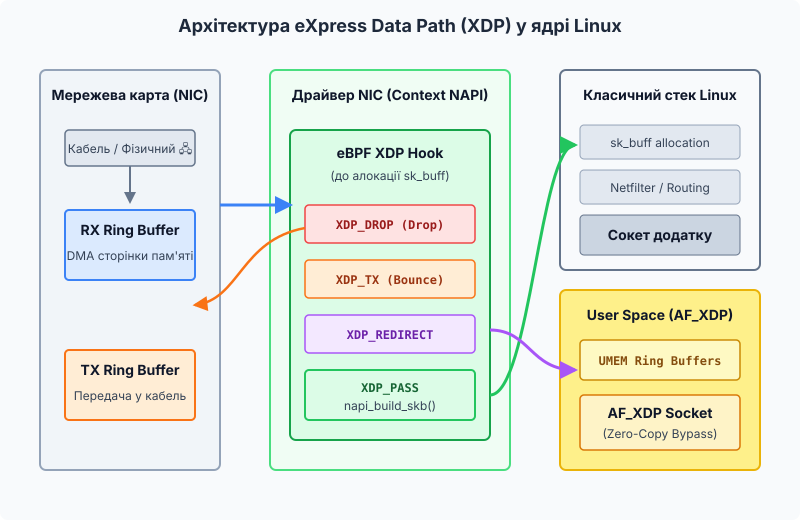
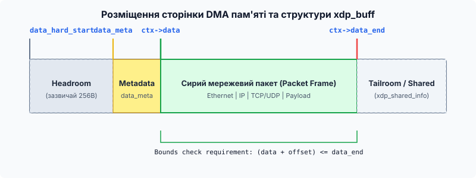

# eXpress Data Path (XDP): обробка пакетів на NIC

<preknowlist>
- [Ядро й простір користувача](topic:sys-unix/kernel-and-userspace) — базові поняття розділення ядерного та користувацького простору і системних викликів.
- [Файлова система bpffs та пінінг об'єктів BPF](topic:sys-unix/bpffs-bpf-filesystem-and-map-pinning) — концепція віртуальної машини eBPF та пінінг BPF-карт.
- [Маршрутизація XDP: BPF_MAP_TYPE_CPUMAP та BPF_MAP_TYPE_DEVMAP](topic:sys-unix/xdp-cpumap-and-devmap) — основи перенаправлення пакетів між мережевими пристроями та ядрами CPU.
</preknowlist>

При надходженні мережевого трафіку зі швидкістю 100 Гігабіт на секунду (Gbps) мережевий адаптер серверу отримує до 148,8 мільйона пакетів щосекунди. За таких умов процесор хоста має у своєму розпорядженні менше ніж 7 наносекунд на обробку одного кадру. Класична архітектура ядра Linux, розроблена для універсального маршрутизованого трафіку, витрачає десятки наносекунд лише на виділення системної пам'яті під об'єкт `sk_buff` (socket buffer) та ініціалізацію його полів. Під час масованих DDoS-атак або при роботі високозавантажених L4-балансувальників це призводить до вичерпання ресурсів CPU: ядро витрачає майже весь свій час на створення та негайне знищення структур даних для пакетів, які взагалі не мали оброблятися.

Технологія **eXpress Data Path (XDP)** вирішує цю проблему шляхом радикального зміщення точки виконання користувацького коду: вона дозволяє запускати JIT-скомпільовані програми eBPF безпосередньо у драйвері мережевої карти на етапі NAPI-опитування, **до того**, як ядро виділить пам'ять під `sk_buff` та передасть пакет у класичний мережевий стек.

---

## 1. Проблема 100-гігабітної мережі: чому ламається класичний стек Linux

Щоб зрозуміти, чому знадобився хук XDP, необхідно детально розглянути математику затримок та анатомію обробки мережевого пакета у традиційному стеку Linux. Коли мережева карта (NIC, лат. *Network Interface Card*) отримує кадр з фізичного кабелю, відбувається така послідовність дій:

1. **DMA Передача:** Мережевий адаптер за допомогою Direct Memory Access (DMA) копіює кадр із внутрішнього буфера карти у фізичну пам'ять RAM хоста, розкладену у кільцевий буфер `RX Ring`.
2. **Апаратне переривання:** NIC надсилає процесору переривання (Hardware IRQ).
3. **Обробник SoftIRQ та NAPI:** Ядро переходить у режим м'яких переривань (`NET_RX_SOFTIRQ`) та запускає підсистему NAPI (New API), яка починає опитувати кільцевий буфер у підключеному циклі.
4. **Алокація `sk_buff`:** Драйвер викликає системний аллокатор пам'яті ядра (`kmem_cache` / slab allocator) та виділяє об'єкт `struct sk_buff`. Це складна структура розміром понад 200 байт, яка містить понад 40 полів (позначки часу, вказівники на заголовки Ethernet/IP/TCP, лічильники посилань, стан сокета, прапорці offloading).
5. **Проходження підсистем:** Пакет передається у підсистему Netfilter (`iptables`/`nftables`), проходиться по таблиці маршрутизації (FIB lookup), підсистемах QoS (qdisc) та відстеженні з'єднань (`conntrack`).

```
[ Кабель ] ──> [ NIC RX Ring ] ──> [ DMA в RAM ] ──> [ IRQ / SoftIRQ ]
                                                            │
                                                            ▼
[ Сокет Додатку ] <── [ Netfilter / Routing ] <── [ ALOC sk_buff ] (Критичний Overhead!)
```

### Математичний бюджет затримок на 100 Gbps

Проведем обчислення доступного часу на один пакет при використанні 100-Гігабітної мережевої карти. Стандартний мінімальний розмір Ethernet-кадру становить 64 байти, до якого додається 7 байт преамбули, 1 байт стартового делімітера (SFD) та 12 байт міжкадрового інтервалу (Interframe Gap). Разом один кадр займає 84 байти (672 біти) на фізичному каналі:

```
Максимальна кількість пакетів в секунду = 100_000_000_000 біт/сек / 672 біт/пакет
                                       = 148 809 523 пакетів/сек (Mpps)
```

Отже, часовий бюджет на один пакет становить:

```
Часовий бюджет = 1 / 148 809 523 сек = 6.72 наносекунди
```

На сучасній процесорній архітектурі з тактовою частотою 3.0 ГГц один такт CPU триває близько 0.33 наносекунди. Отже, на обробку одного пакета на одному ядрі припадає лише **20 тактів CPU**!

Для порівняння:
- Один промах кешу L3 (L3 cache miss) вимагає звернення до DRAM, що триває 50–100 наносекунд (понад 150–300 тактів).
- Виклики системного аллокатора пам'яті ядра (`kmem_cache_alloc`) та ініціалізація полів `sk_buff` займають близько 200–300 тактів процесора.

Якщо сервіс отримує 20 мільйонів шкідливих пакетів на секунду під час DDoS-атаки, ядро виділяє та обнуляє 20 мільйонів структур `sk_buff` на секунду, навіть якщо правила файрволу Netfilter підключаються у кінці й відкидають усі ці пакети. Процесор витрачає сотні мільйонів циклів на непотрібний менеджмент пам'яті.

Тривалий час вирішенням цієї проблеми вважався підхід **Kernel Bypass** (зокрема бібліотека Intel DPDK), у якому мережевий адаптер повністю вимався з-під управління ядра Linux і передавався у User Space. Проте це вимагало виділення 100% ресурсів ядра CPU у постійний polling та позбавляло адмінів усіх стандартних інструментів Linux (`iproute2`, `tcpdump`, `iptables`). Детальний розбір цієї боротьби підходів наведено в матеріалі [Історія створення XDP](topic:sys-unix/xdp-express-data-path/hist-xdp-evolution.md).

---

## 2. Концепція та точка інтеграції XDP

XDP створює "Fast Path" (швидкий шлях) усередині самого ядра Linux. Замість виведення карти з ядра, XDP вбудовує легкий інтерпретатор/JIT eBPF прямо в C-код драйвера мережевої карти.


*Схема обробки пакетів хуком XDP у контексті NAPI драйвера мережевого адаптера.*

Коли пакет прибуває у `RX Ring`, драйвер отримує сторінку DMA пам'яті та **відразу** викликає BPF-програму.

Головні переваги цієї архітектури:

- **Нуль алокацій `sk_buff`:** На момент роботи XDP-програми структури `sk_buff` фізично не існує. Відсутні будь-які виклики аллокатора пам'яті ядра.
- **100% Zero-Copy:** XDP читає та модифікує дані безпосередньо у DMA-буфері сторінки RAM, на яку мережева карта щойно записала кадр.
- **Робота у контексті SoftIRQ NAPI:** Програма викликається у контексті локального ядра CPU з вимкненими перериваннями для цієї черги RX, що виключає гонки за ресурси (race conditions) та блокування (locks).
- **Вибірковий пропуск:** XDP-програма може відкинути 99% атакуючого трафіку з нульовою ціною, а легітимні 1% пакетів повернути у класичний стек ядра за допомогою коду `XDP_PASS`.

---

## 3. Внутрішня будова пам'яті та структура `struct xdp_md`

Усередині eBPF-програми мережевий пакет описується не громіздкою структурою `sk_buff`, а максимально компактним контекстом `struct xdp_md *ctx` (або `struct xdp_buff` у коді ядра).


*Розподіл пам'яті у DMA-сторінці: headroom, зона метаданих, сирий пакет та tailroom.*

### Анатомія сторінки DMA (Page Layout)

Коли драйвер ініціалізує буфер RX, він виділяє фізичну сторінку пам'яті (зазвичай 4096 байт) і розміщує в ній такі області:

1. **Headroom (Початковий запас):** Зарезервований простір на початку сторінки (зазвичай 256 байт). Використовується для додавання нових заголовків пакета (Encapsulation).
2. **Metadata Area (Область метаданих):** Невелика зона безпосередньо перед `data`. Сюди XDP-програма може записати власні дані (наприклад, vlan_id, hash, timestamp) за допомогою хелпера `bpf_xdp_adjust_meta()`.
3. **Packet Data (Сирий пакет):** Починається з вказівника `ctx->data` і закінчується на `ctx->data_end`. Тут лежать сирі байти Ethernet, IP, TCP/UDP.
4. **Tailroom (Хвостовий запас):** Простір після пакета. Використовується для розширення пакета або зберігання структури `xdp_shared_info` у випадку фрагментованих пакетів (Multi-Buffer XDP).

### Опис полів `struct xdp_md`

```c
struct xdp_md {
    __u32 data;           /* Зсув на початок мережевого пакета */
    __u32 data_end;       /* Зсув на кінець мережевого пакета */
    __u32 data_meta;      /* Початок користувацьких метаданих */
    __u32 ingress_ifindex;/* Системний ID вхідного інтерфейсу (ifindex) */
    __u32 rx_queue_index; /* Номер апаратної RX-черги NIC */
    __u32 egress_ifindex; /* Вихідний інтерфейс (для XDP_REDIRECT) */
};
```

Зверніть увагу: поля `data`, `data_end` та `data_meta` мають тип `__u32` у структурі UAPI, але під час JIT-компіляції eBPF верифікатор перетворює їх на 64-бітні вказівники на пам'ять.

Повний системний опис полів структури та прапорців дивіться у розділі [Довідник API та хелперів XDP](topic:sys-unix/xdp-express-data-path/api-xdp-helpers.md).

---

## 4. Три режими виконання XDP (XDP Modes)

XDP підтримує три класи виконання, які відрізняються місцем виконання та вимогами до драйвера:

```
[ Hardware SmartNIC ] ─── (1. XDP_HW: Offloaded)
         │
         ▼
[ Driver NAPI Poll ] ─── (2. XDP_DRV: Native - Основний режим!)
         │
         ▼
[ netif_receive_skb ] ── (3. XDP_SKB: Generic - Fallback/Debug)
```

### 1. `XDP_HW` (Offloaded XDP)
- **Де виконується:** Безпосередньо на процесорі SmartNIC (наприклад, Netronome Agilio або Pensando).
- **Механізм:** eBPF-байткод під час завантаження компілюється в апаратний машинний код мережевої карти.
- **Перевага:** 0% навантаження на CPU хоста. Пакет відкидається ще до потрапляння на шину PCIe.

### 2. `XDP_DRV` (Native XDP)
- **Де виконується:** У найперших рядках драйвера NIC на CPU хоста (у контексті NAPI SoftIRQ).
- **Механізм:** Найпопулярніший режим. Підтримується більшістю сучасних 10/40/100G драйверів (`ixgbe`, `i40e`, `mlx5`, `virtio_net`, `veth`).
- **Перевага:** Максимальна швидкість (до 40 млн пакетів/сек на ядро) без вимог до дорогих SmartNIC.

### 3. `XDP_SKB` (Generic XDP)
- **Де виконується:** У підсистемі ядра `netif_receive_skb_internal()`.
- **Механізм:** Fallback-режим. Виконується **після** того, як ядро виділило `sk_buff`.
- **Застосування:** Використовується виключно для тестування та відлагодження на старого обладнанні чи віртуальних інтерфейсах, драйвери яких не підтримують Native XDP. Продуктивність нижча за класичний стек.

### Порівняльна матриця режимів XDP

| Характеристика | XDP_HW (Offloaded) | XDP_DRV (Native) | XDP_SKB (Generic) |
| :--- | :--- | :--- | :--- |
| **Точка виконання** | NPU SmartNIC | Драйвер NIC (NAPI) | `netif_receive_skb` |
| **Виділення sk_buff** | Ні | Ні | **Так** |
| **Продуктивність (Drop)** | > 100 Mpps (Апаратура) | 20–40 Mpps / ядро | 2–4 Mpps / ядро |
| **Навантаження на CPU** | 0% | Низьке (SoftIRQ) | Високе (Slab + SoftIRQ) |
| **Підтримка обладнання** | Спеціалізовані SmartNIC | Усі сучасні 10G+ NIC | Усі мережеві пристрої |

---

## 5. Вердикти XDP (Action Codes): Управління долею пакета

Обробка пакета у XDP закінчується поверненням 32-бітного коду дії (Action Code):

| Код повернення | Значення | Дія драйвера NIC | Основні застосування |
| :--- | :--- | :--- | :--- |
| `XDP_DROP` | `1` | Негайно відкинути пакет. DMA-сторінка повертається в RX ring. | Захист від DDoS, Blackholing, фільтрація сміття. |
| `XDP_PASS` | `2` | Передати пакет далі у ядро Linux (`napi_build_skb()`). | Легітимний трафік файрволу, стандартні сокети. |
| `XDP_TX` | `3` | Відправити пакет назад у кабель через той самий NIC (Hairpinning). | ICMP Echo responder, ARP proxy, DSR load balancers. |
| `XDP_REDIRECT` | `4` | Перенаправити пакет на інший NIC, CPU або AF_XDP сокет. | Маршрутизація, BPF CPUMAP, Zero-Copy User Space. |
| `XDP_ABORTED` | `0` | Помилка в eBPF програмі (Drop + tracepoint `xdp_exception`). | Обробка виключних ситуацій та збоїв. |

---

## 6. Модифікація пакетів на льоту: Headroom, Resizing та Multi-Buffer XDP

XDP дозволяє не лише аналізувати, але й модифікувати байти пакета "на льоту" зі зміною його розміру.

### Зміна заголовків через `bpf_xdp_adjust_head`

Функція `bpf_xdp_adjust_head(ctx, delta)` зміщує вказівник `ctx->data`:

- **Деінкапсуляція (`delta > 0`):** Зміщує `data` вправо (до `data_end`). Це зрізає зовнішні заголовки. Наприклад, видалення VLAN 802.1Q заголовка (`delta = 4`) або зняття тунелів VXLAN / GRE / IPIP.
- **Інкапсуляція (`delta < 0`):** Зміщує `data` вліво в область **Headroom**. Це виділяє місце для додавання нових зовнішніх заголовків (наприклад, додавання VXLAN заголовка при маршрутизації у Kubernetes).

```c
/* Приклад додавання заголовка: delta < 0 */
int res = bpf_xdp_adjust_head(ctx, -((int)sizeof(struct iphdr)));
if (res < 0) {
    return XDP_DROP; /* Недостатньо headroom у сторінці */
}

/* ⚠️ КРИТИЧНО: Усі старі вказівники інвалідовано! */
data = (void *)(long)ctx->data;
data_end = (void *)(long)ctx->data_end;
```

### Multi-Buffer XDP (MB-XDP, Linux 5.14+)

Історично XDP працював виключно з пакетами, які повністю вміщувалися в одну сторінку пам'яті (зазвичай 4096 байт мінус headroom). Якщо мережева карта отримувала великий кадр (Jumbo Frame розміром 9000 байт), драйвер змушений був відключати Native XDP або переходити у сповільнений режим.

Починаючи з ядра Linux 5.14, було впроваджено підтримку **Multi-Buffer XDP** (MB-XDP):

1. Перша сторінка пам'яті (буфер) містить початкові заголовки пакета та описується структурою `xdp_buff`.
2. Наприкінці першої сторінки розміщується структура `struct xdp_shared_info`, яка містить масив вказівників на наступні фрагменти сторінок (frags).
3. eBPF-програма може перевірити наявність додаткових фрагментів за допомогою прапорця `ctx->flags & XDP_FLAGS_MB` та обробити весь Jumbo Frame.

---

## 7. BPF Verifier та правила безпечного розбору

Оскільки XDP працює з сирими байтами в пам'яті ядра, верифікатор eBPF (BPF Verifier) застосовує надзвичайно суворі правила перевірки безпеки.

### Правило Bounds Check (Перевірка меж)

Перед **будь-яким** зверненням до полів заголовка eBPF-програма зобов'язана доказати верифікатору, що адреса пам'яті не виходить за межі `ctx->data_end`.

```c
/* ❌ НЕКОРЕКТНО (Верифікатор відхилить програму під час завантаження) */
struct iphdr *iph = (void *)(eth + 1);
if (iph->protocol == IPPROTO_TCP) { ... }

/* ✅ КОРЕКТНО (Bounds Check перед розімкнутим вказівника) */
struct iphdr *iph = (void *)(eth + 1);
if ((void *)(iph + 1) > data_end) {
    return XDP_PASS; /* Пакет занадто короткий */
}
if (iph->protocol == IPPROTO_TCP) { ... }
```

Правило інвалідації вказівників: Після будь-якого виклику хелперів змінення розміру (`bpf_xdp_adjust_head`, `bpf_xdp_adjust_tail`) верифікатор **анулює** всі раніше перевірені вказівники. Програміст зобов'язаний заново перечитати `ctx->data` та `ctx->data_end` й повторити `bounds check`.

Повний приклад компільованої XDP-програми з розбором ICMP/UDP та завантажувачем наведено у практичному документі [Практичний проект XDP-фільтра](topic:sys-unix/xdp-express-data-path/proj-xdp-pass-drop-router.md).

---

## 8. Взаємодія з User Space: AF_XDP (XSK)

Одним з найпотужніших застосувань коду дій `XDP_REDIRECT` є спрямування трафіку у сокети **AF_XDP** (Address Family eXpress Data Path).

AF_XDP надає можливість додатку у просторі користувача отримати доступ до сирих пакетів із DMA-буфера **без копіювання (Zero-Copy)** та без участі мережевого стеку ядра.

```
[ NIC RX ] ──> [ XDP Program ] ── (XDP_REDIRECT) ──> [ BPF XSKMAP ]
                                                            │
                                                            ▼
[ User Space Application ] <── [ Lockless Ring Buffers ] <── [ UMEM Memory ]
```

### Механізм UMEM та Ring Buffers

1. **UMEM (User Memory):** Додаток виділяє область пам'яті у HugePages і реєструє її у ядрі.
2. **Безблокувальні кільця (Lockless Rings):** Обмін дескрипторами пакетів між ядром та користувачем відбувається через 4 кільцевих буфери без виклику системних блокувань (mutex):
   - `Fill Ring`: Користувач передає ядру вільні чанки UMEM.
   - `Rx Ring`: Ядро передає користувачу чанки з прийнятими пакетами.
   - `Tx Ring`: Користувач передає ядру чанки для відправки.
   - `Completion Ring`: Ядро повідомляє користувача про успішне відправлення кадру в мережу.

Це робить AF_XDP повноцінною та безпечною заміною DPDK.

---

## 9. Діагностика, простеження та моніторинг XDP у системі

Для управління та моніторингу завантажених програм XDP використовуються стандартні системні інструменти Linux:

### Перевірка завантажених програм через `iproute2` та `bpftool`

```bash
# Перегляд XDP програм на інтерфейсі eth0
ip link show dev eth0

# Інспекція всіх BPF програм у ядрі
sudo bpftool prog list

# Інспекція прив'язаних мережевих хуків
sudo bpftool net list
```

### Моніторинг продуктивності та виключень

Ядро Linux надає розширений набір `tracepoints` для відстеження роботи XDP:

- `xdp:xdp_exception`: Фіксує повернення коду `XDP_ABORTED` або помилки у `bpf_redirect`.
- `xdp:xdp_bulk_tx`: Відстежує пакетну відправку кадрів при `XDP_TX`.
- `xdp:xdp_cpumap_kthread`: Трасує обробку пакетів при перенаправленні через BPF CPUMAP.

```bash
# Трасування помилок XDP в реальному часі
sudo perf trace -e xdp:xdp_exception
```

---

> 🔧 **Навіщо це.**
>
> 1. **Anti-DDoS Захист:** XDP є головним інструментом боротьби з масованими SYN-flood, UDP-amplification та ICMP-flood атаками. Завдяки `XDP_DROP` сервера здатні витримувати атаки інтенсивністю 50–100+ Mpps на стандартному сервному обладнанні.
> 2. **L4 Балансування навантаження:** Проєкти на кшталт Facebook Katran обробляють мільйони запитів на секунду, розподіляючи трафік між серверами за допомогою `XDP_TX` та DSR (Direct Server Return).
> 3. **High-Performance CNI у Kubernetes:** Проєкт Cilium використовує XDP для швидкої інкапсуляції, підміни IP-адрес (eBPF NAT) та наскрізного шифрування WireGuard на рівні драйвера NIC.

---

## Висновки

eXpress Data Path (XDP) кардинально змінив архітектуру мережевої підсистеми Linux, надавши розробникам можливість виконувати програмовану обробку пакетів зі швидкістю апаратного забезпечення без втрати безпеки та системного контролю ядра.

Поєднуючи в собі безпеку eBPF, відсутність витрат на `sk_buff`, багатий набір кодів дій (`XDP_DROP`, `XDP_TX`, `XDP_REDIRECT`) та підтримку Zero-Copy передачі через AF_XDP, XDP став фундаментальним стандартом для побудови сучасних хмарних інфраструктур, файрволів та балансувальних систем.
