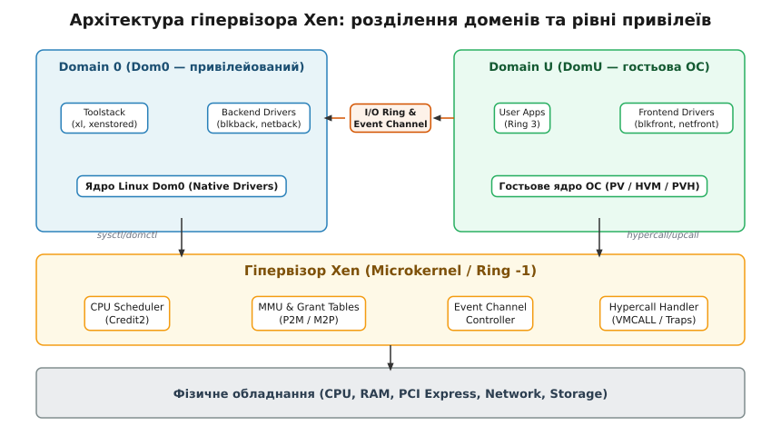
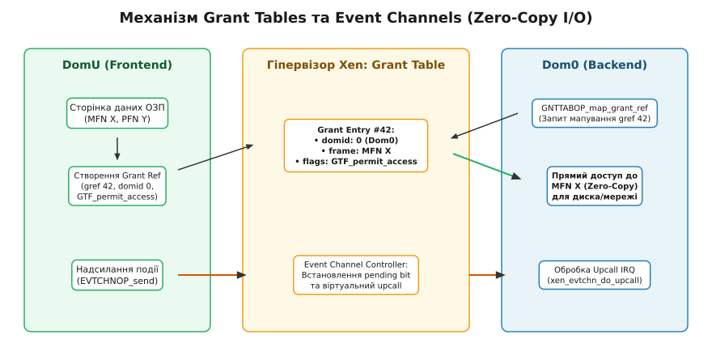

# Гіпервізор Xen: Dom0, DomU та grant tables

<preknowlist>
- [Модель пристроїв Linux](root:sys-unix/sysfs-device-model) — відображення шин, драйверів та пристроїв у ядрі.
- [Прямий доступ до пам'яті (DMA)](root:sys-unix/dma-and-buffers) — принципи фізичної адресації та обміну даними без участі ЦП.
- [Обробка переривань](root:sys-unix/interrupts-bottom-halves) — асинхронні сповіщення ядра та верхні/нижні напівобробники.
</preknowlist>

При обробці високонавантажених блокових операцій зчитування або передачі мережевих пакетів у віртуалізованому середовищі передача даних між ізольованими адресними просторами гостьової операційної системи та системи управління шляхом послідовного копіювання байтів через центральний процесор створює неприйнятні затримки та виснажує обчислювальні ресурси. Гіпервізор Xen вирішує цю проблему за допомогою розділення системи на мікроядро з найвищим рівнем привілеїв, привілейований домен управління (Dom0) та непривілейовані гостьові домени (DomU), поєднуючи їх механізмами безкопіювального (zero-copy) обміну пам'яттю через таблиці грантів (Grant Tables) та асинхронними віртуальними перериваннями (Event Channels).

## 1. Архітектура Xen: Принцип деагрегації та домени

На відміну від гіпервізорів другого типу (Type-2 / hosted), які працюють як звичайні процеси всередині монолітної операційної системи хоста, гіпервізор Xen є мікроядром першого типу (Type-1 / bare-metal). Він завантажується безпосередньо на апаратному забезпеченні комп'ютера і виконується на найвищому рівні привілеїв процесора (Ring 0 у x86 або VMX Root).

Головний архітектурний принцип Xen — це мінімізація довіреної обчислювальної бази (Trusted Computing Base, TCB). Сам гіпервізор відповідає лише за суворо обмежений набір базових задач:
- **Планування процесорного часу**: розподіл фізичних ядер CPU між віртуальними процесорами (VCPU) за допомогою алгоритмів Credit або Credit2.
- **Управління пам'яттю**: виділення фізичних сторінок ОЗП, первинна ізоляція та захист адресних просторів.
- **Диспетчеризація переривань**: маршрутизація апаратних переривань від фізичних пристроїв та обробка гіпервикликів (hypercalls).

Усі інші традиційні функції операційної системи — драйвери реальних пристроїв, файлові системи, мережеві стеки, утиліти управління та інтерфейс користувача — винесені за межі гіпервізора в окремі віртуальні машини, які в термінології Xen називаються **доменами** (*domain*, від латинського *dominium* — володіння).


*Архітектура гіпервізора Xen: розділення на мікроядро (Ring -1), привілейований Dom0 та непривілейовані домени DomU.*

### Domain 0 (Dom0) — привілейований домен управління

Під час ініціалізації системи гіпервізор автоматично створює перший домен — **Domain 0** (або Dom0). Це унікальна віртуальна машина, яка володіє спеціальними привілеями:

1. **Прямий доступ до обладнання**: За замовчуванням гіпервізор передає Dom0 право прямого управління більшістю фізичних пристроїв хоста (PCI Express шини, SATA/NVMe дискові контролери, мережеві карти). У Dom0 працює повноцінне ядро (зазвичай Linux — підтримка Dom0 давно в основній гілці й окремих латок не потребує, — рідше FreeBSD чи NetBSD) з оригінальними драйверами обладнання.
2. **Управління життєвим циклом доменів**: Тільки Dom0 має доступ до спеціальних привілейованих гіпервикликів (`domctl` та `sysctl`), що дозволяють створювати, конфігурувати, призупиняти, мігрувати або знищувати непривілейовані домени DomU.
3. **Утиліти управління (Toolstack)**: У просторі користувача Dom0 виконуються інструменти управління віртуалізацією (`xl`, `libxl`, утиліти XCP-ng/XenServer) та центральний демон опису конфігурації `xenstored`.
4. **Хостинг бекенд-драйверів**: Dom0 виконує роль сервера введення-виведення для решти віртуальних машин. Він містить *backend*-драйвери, які приймають запити на читання/запис від гостьових систем і транслюють їх у реальні операції над фізичними накопичувачами або мережевими адаптерами.

### Domain U (DomU) — непривілейовані гості

Усі наступні створені віртуальні машини називаються **Domain U** (де "U" означає *Unprivileged*). Вони призначені для виконання прикладного навантаження користувачів.

DomU повністю ізольовані від фізичного обладнання і не мають привілеїв надсилати команди іншим доменам чи гіпервізору. Замість прямого звернення до контролерів диска або мережі, ядро DomU використовує паравіртуалізовані *frontend*-драйвери (`xen-blkfront`, `xen-netfront`). Ці драйвери взаємодіють із відповідними *backend*-драйверами у Dom0 через механізми спільної пам'яті.

### Driver Domains (DomD) та деагрегація

Поміщення всіх бекенд-драйверів у Dom0 створює ризик: вразливість у складному мережевому драйвері або накопичувачі може призвести до компрометації всього Dom0 і гіпервізора. 

Для вирішення цієї проблеми Xen підтримує **Driver Domains** (або деагреговану архітектуру): доступ до конкретного PCI-пристрою (наприклад, вторинної мережевої карти) за допомогою PCI Passthrough передається окремому ізольованому домену DomD. Бекенд-драйвер мережі працює у DomD, і навіть при його збої або злому решта системи та Dom0 залишаються неушкодженими. Подробиці виникнення цих механізмів висвітлено у вставці [Історія паравіртуалізації Xen](root:sys-unix/xen-dom0-domu/hist-xen-paravirtualization.md).

## 2. Еволюція режимів виконання гостьових ОС

За понад два десятиліття еволюції Xen пройшов декілька етапів розвитку методів виконання гостьових операційних систем, зумовлених розвитком процесорних архітектур.

### Paravirtualization (PV)

Початковий режим Xen, створений у часи, коли процесори x86 не мали апаратної підтримки віртуалізації. Оскільки класичний x86 не дозволяв виконати безпечне перехоплення деяких чутливих інструкцій (проблема теореми Попека-Голдберга), Xen застосував модифікацію вихідного коду гостьового ядра Linux або BSD.

У режимі PV:
- Замість привілейованих інструкцій маскування переривань чи оновлення таблиць сторінок ядро ОС викликає гіпервізор через **Hypercalls**.
- Реалізована схема зміщення кілець (Ring Deprivileging): на x86_32 Xen працює в Ring 0, ядро PV-гостя — в Ring 1, а користувацькі застосунки — в Ring 3. На x86_64 кілець для цієї схеми не вистачило: там і ядро гостя, і його застосунки виконуються в Ring 3, а розділяє їх перемикання таблиць сторінок.
- Управління пам'яттю спирається на пряму роботу з фізичними сторінками ОЗП через таблиці трансляції P2M (*Physical-to-Machine*) та M2P (*Machine-to-Physical*).

Недоліком PV є неможливість запуску операційних систем із закритим вихідним кодом (наприклад, Microsoft Windows) без їх кардинальної модифікації.

### Hardware Virtual Machine (HVM)

З появою в процесорах апаратних розширень Intel VT-x та AMD-V гіпервізор Xen отримав режим HVM. Гостьова ОС працює повністю немодифікованою у спеціальному режимі ЦП (VMX Non-Root).

У чистому режимі HVM для емуляції материнської плати, контролерів переривань, BIOS та PCI-пристроїв використовується процес-емулятор **QEMU**, який працює у просторі користувача Dom0. Однак повна емуляція I/O через QEMU створює великі накладні витрати: кожна операція диск/мережа вимагає множинних перемикань контексту між гостем, гіпервізором та QEMU.

### PV-on-HVM

Для усунення вузьких місць продуктивності HVM було створено гібридний режим PV-on-HVM. Процесор та пам'ять віртуалізуються апаратно за допомогою інструкцій VT-x/AMD-V та розширених таблиць сторінок EPT/NPT (*Extended Page Tables*), але замість повільних емульованих пристроїв QEMU ядро гостя завантажує паравіртуалізовані драйвери дисків та мережі (`xen-blkfront`, `xen-netfront`), які працюють напряму з бекендами Dom0.

### PVH (PV в HVM-контейнері)

PVH — це сучасний стандарт виконання гостьових систем у Xen. Він поєднує найкращі властивості PV та HVM:
- **ЦП та пам'ять**: завантаження та управління процесором виконуються через апаратні розширення VT-x/AMD-V та апаратну трансляцію сторінок EPT/NPT (як в HVM). Це усуває складні таблиці сторінок Shadow Page Tables і позбавляє потреби у Ring 1 deprivileging.
- **Введення-виведення (I/O)**: повністю паравіртуалізоване (Event Channels, Grant Tables, split drivers) без використання емуляції QEMU.

В результаті PVH-гості не потребують процесу QEMU взагалі, що значно зменшує споживання ОЗП у Dom0 та підвищує безпеку системи.

| Режим | Віртуалізація CPU/MMU | Драйвери I/O | Потреба в QEMU | Модифікація ядра ОС |
| :--- | :--- | :--- | :--- | :--- |
| **PV** | Програмна (Ring 1 hypercalls) | Паравіртуалізовані | Ні | Так (потрібне PV-ядро) |
| **HVM** | Апаратна (VT-x/AMD-V) | Емульовані (QEMU) | Так | Ні (будь-яка ОС) |
| **PV-on-HVM** | Апаратна (VT-x/AMD-V) | Паравіртуалізовані | Так (для boot/emulated) | Ні (потрібні PV-драйвери) |
| **PVH** | Апаратна (VT-x/AMD-V + EPT) | Паравіртуалізовані | Ні | Ні (стандартний Linux) |

## 3. Інтерфейс гіпервикликів (Hypercalls)

Гіпервиклик (*hypercall*) — це механізм програмного переривання, за допомогою якого ядро гостьової ОС запитує виконання послуг у гіпервізора Xen. Гіпервиклик є точним аналогом системного виклику (`syscall`) в операційних системах, але переходить із рівня ядра ОС у рівень гіпервізора (Ring -1 / VMX Root).

На архітектурі x86 гіпервиклики реалізуються залежно від режиму та процесора:
- У **PV-режимі** (x86_32 / x86_64) використовувалося програмне переривання `int 0x82` або інструкція `syscall`.
- У **HVM / PVH-режимах** використовуються апаратні інструкції `VMCALL` (Intel VT-x) або `VMMCALL` (AMD-V).

Для оптимізації викликів Xen під час завантаження гостя відображає у його адресний простір ядра спеціальну **сторінку гіпервикликів** (*hypercall page*). Ця сторінка містить машинні інструкції переходу до гіпервізора. Коли ядро гостя хоче виконати гіпервиклик, воно просто робить виклик функції за відповідним зміщенням у цій сторінці.

Номер гіпервиклику передається у регістрі процесора (наприклад, `RAX`), а аргументи — у регістрах `RDI`, `RSI`, `RDX`, `R10`, `R8`. 

Короткий огляд найважливіших гіпервикликів Xen:
- `HYPERVISOR_sched_op`: управління станом віртуального ЦП (добровільна віддача часу `YIELD`, засинання `BLOCK`, зупинка `SHUTDOWN`).
- `HYPERVISOR_memory_op`: управління виділенням сторінок пам'яті домену, збільшення або зменшення обсягу ОЗП (ballooning).
- `HYPERVISOR_grant_table_op`: операції з реєстрації, відображення та зняття грантів у Grant Tables.
- `HYPERVISOR_event_channel_op`: створення, прив'язка, надсилання сигналів та маскування віртуальних каналів подій.
- `HYPERVISOR_domctl` / `HYPERVISOR_sysctl`: привілейовані виклики управління доменами та гіпервізором (доступні тільки для Dom0).

## 4. Xenstore та шина Xenbus: Інформаційна координація

Конфігурування розділених драйверів та встановлення зв'язку між доменами вимагає точки координації. У Xen цю роль виконує **Xenstore** — централізована база даних типу "ключ-значення" з файловоподібною ієрархічною структурою.

Дерево Xenstore керується демоном `xenstored`, який працює у Dom0. Кожен домен під час створення отримує від гіпервізора виділену спільну сторінку пам'яті для зв'язку з `xenstored` та один канал подій. 

Головні гілки ієрархії Xenstore:
- `/local/domain/<domid>/`: особистий простір домену, де зберігається його ідентифікатор, ім'я, ліміти пам'яті та конфігурація пристроїв.
- `/backend/<type>/<domid>/<devid>/`: конфігурація бекенд-драйверів у Dom0 (шляхи до образів дисків, мережеві мости).
- `/device/<type>/<devid>/`: конфігурація фронтенд-драйверів у гості (номери каналів подій, грант-референси).

Повний опис ієрархії Xenstore та описових структур наведено у вставці [Специфікація Xenstore та Grant Tables](root:sys-unix/xen-dom0-domu/api-xenstore-gnttab.md).

### Підсистема Xenbus та автомат станів

Ядро Linux взаємодіє з Xenstore через підсистему **Xenbus**, яка виступає у ролі віртуальної шини пристроїв. Xenstore підтримує механізм **спостерігачів** (*watches*): процес або ядро ОС може зареєструвати watch на певний шлях. Якщо значення ключа змінюється, Xenstore надсилає сповіщення через Event Channel.

Встановлення зв'язку між фронтендом (DomU) та бекендом (Dom0) виконується через автомат станів (`enum xenbus_state`):

```
DomU (Frontend)                                  Dom0 (Backend)
───────────────                                  ──────────────
XenbusStateInitialising
  │ (Запис gref & event channel у Xenstore)
  ▼
XenbusStateInitialised ────────────────────────► XenbusStateInitialising
                                                   │ (Мапування gref,
                                                   │  налаштування rings)
                                                   ▼
XenbusStateConnected   ◄──────────────────────── XenbusStateConnected
  │                                                │
  └────────────────── Обмін даними ────────────────┘
```

1. **Initialising**: Toolstack створює записи пристрою в Xenstore. Фронтенд і бекенд виявляють пристрій через watches.
2. **InitWait / Initialised**: Фронтенд виділяє сторінку для кільцевого буфера I/O, створює Grant Reference та Event Channel, записує їх номери в Xenstore і переходить у стан `Initialised`.
3. **Connected**: Бекенд читає gref та event channel з Xenstore, відображає сторінку кільця в ОЗП Dom0, змінює свій стан на `Connected`. Побачивши це через watch, фронтенд також переходить у `Connected`. З цього моменту рукостискання завершено, і обмін даними йде напряму в ОЗП без участі Xenstore.

## 5. Event Channels: Віртуальні переривання

Для асинхронного сповіщення про події (наприклад, поява нового запиту в кільці I/O або завершення запису на диск) Xen реалізує механізм **Event Channels** (канали подій), які є віртуалізованим аналогом апаратних переривань (IRQ).

Канал подій — це індексований біт у дворівневому бітовому масиві домену. Кожен VCPU домену має доступ до структури `shared_info_t`, яка відображається гіпервізором.

### Структура обробки подій

Обробка подій оптимізована за допомогою дворівневої маски бітів:
- `evtchn_pending[port]`: бітовий масив (наприклад, 1024 або 4096 портів). Гіпервізор встановлює біт `1`, коли для даного порту є необроблена подія.
- `evtchn_mask[port]`: маска маскування. Якщо біт встановлено в `1`, сповіщення заблоковано.
- `evtchn_pending_sel`: скануючий селектор першого рівня, свій у кожного VCPU (лежить у його `vcpu_info`, а не в спільній частині `shared_info_t`). Кожен біт у `evtchn_pending_sel` відповідає цілому слову (32 або 64 бітам) у масиві `evtchn_pending`.

Завдяки селектору `evtchn_pending_sel` ядро гостя при отриманні переривання виконує сканування бітів за `O(1)` за допомогою процесорної інструкції пошуку першого встановленого біта (`BSF` / `TZCNT`), не перебираючи тисячі портів.

```
evtchn_pending_sel: [ 0 | 1 | 0 | 0 ]   (Біт 1 вказує на 2-у групу портів)
                         │
                         ▼
evtchn_pending[32..63]: [ 0 | 0 | 1 | 0 | ... ]  (Біт 34 активний -> Порт 34)
```

### Типи каналів подій

- **Interdomain**: канал, що з'єднує два конкретні домени (наприклад, Dom0 та DomU). Надсилання сигналу доменом А через `HYPERVISOR_event_channel_op(EVTCHNOP_send)` встановлює pending-біт у домені Б і викликає віртуальне переривання (*upcall*) на VCPU домену Б.
- **VIRQ (Virtual IRQ)**: віртуальні переривання від гіпервізора до домену (наприклад, таймер VCPU, подія архітектурного відлагодження).
- **PIRQ (Physical IRQ)**: прокидання фізичних переривань від обладнання безпосередньо в Dom0 або Driver Domain.
- **IPI (Inter-Processor Interrupt)**: віртуальні міжпроцесорні переривання між VCPU всередині одного домену.

У ядрі Linux обробник `xen_evtchn_do_upcall()` зчитує маски, знаходить активні канали та викликає зареєстровані переривання нижнього рівня (softirq / tasklet).

## 6. Механізм Grant Tables: Безкопіювальний обмін пам'яттю

Найважливішим елементом продуктивності Xen є **Grant Tables** (таблиці грантів). Вони забезпечують безпечний, керований і безкопіювальний (zero-copy) доступ одного домену до сторінок пам'яті іншого домену.

В операційній системі без віртуалізації пристрій використовує DMA для прямого читання ОЗП. У віртуалізованому середовищі Dom0 не повинен мати довільного доступу до всієї пам'яті DomU з міркувань безпеки. Grant Tables виступають як керований гіпервізором шлюз доступу.


*Механізм безкопіювального обміну пам'яттю за допомогою Grant Tables та асинхронних сповіщень через Event Channels між DomU та Dom0.*

### Термінологія адрес пам'яті

Для розуміння грантів важливо розрізняти три типи кадрів пам'яті:
- **PFN (Pseudo-Physical Frame Number)**: номер сторінки в тій «фізичній» пам'яті, яку бачить гостьова ОС: нумерація суцільна від нуля й до розкладки реального заліза стосунку не має. Це термін світу PV.
- **GFN (Guest Frame Number)**: те саме поняття в сучасній термінології Xen, ужитій для HVM- і PVH-гостей. PFN і GFN — дві назви одного рівня адресації, а не два різні рівні.
- **MFN (Machine Frame Number)**: номер справжньої сторінки у фізичній ОЗП хоста. Саме MFN записується в Grant Entry, а перетворення MFN ↔ PFN/GFN тримає гіпервізор у таблицях P2M та M2P.

### Структура та процес роботи гранту

Кожен домен володіє власною таблицею грантів, яка розміщується у пам'яті під управлінням гіпервізора. Елемент цієї таблиці називається **Grant Entry**, а його індекс — **Grant Reference** (або `gref`, наприклад, `gref = 42`).

Покроковий алгоритм безкопіювального обміну:

1. **Надання гранту (Granting)**: DomU виділяє у своєму ОЗП сторінку даних `X` (з номером `MFN_X`). Фронтенд-драйвер записує у вільну комірку `gref = 42` своєї Grant Table:
   - ID цільового домену: `domid = 0` (Dom0).
   - Фізичну адресу: `frame = MFN_X`.
   - Прапорці: `GTF_permit_access` (і `GTF_readonly`, якщо доступ лише на читання). Бітів `GTF_reading`/`GTF_writing` фронтенд не ставить — їх виставляє сам гіпервізор на час, поки сторінка справді відображена в чужому домені.
2. **Передача gref**: DomU передає тільки число `42` до Dom0 через спільне кільце I/O. DomU **не розкриває** фізичну адресу `MFN_X`.
3. **Відображення (Mapping)**: Бекенд-драйвер у Dom0 виконує гіпервиклик `GNTTABOP_map_grant_ref`, передаючи пару `(domid_DomU, gref = 42)`.
4. **Перевірка гіпервізором**: Xen перевіряє таблицю грантів DomU. Якщо запис дійсний і дозволяє доступ для Dom0, гіпервізор оновлює таблиці сторінок ядра Dom0, відображаючи `MFN_X` у його адресний простір.
5. **Zero-Copy I/O**: Dom0 читає або записує дані безпосередньо у фізичну сторінку `MFN_X`. Жодного копіювання через процесор не відбувається.
6. **Розмапування (Unmapping)**: Після завершення I/O Dom0 викликає `GNTTABOP_unmap_grant_ref`. Гіпервізор видаляє сторінку з таблиць Dom0, після чого DomU позначає `gref = 42` як вільний.

Існує також режим **Grant Transfer** (`GTF_accept_transfer`), який дозволяє повністю передати право власності на сторінку пам'яті від одного домену до іншого (використовується при оптимізації мережевого стека для вхідних пакетів).

Практичний приклад програмування мапування грантів на мовах C та C++ подано у вставці [Практичний обмін даними через Grant Tables](root:sys-unix/xen-dom0-domu/proj-grant-table-io.md).

## 7. Розділені драйвери (Split Drivers) та кільцеві буфери I/O

Механізми Event Channels (для сигналів) та Grant Tables (для пам'яті) об'єднуються у високорівневу архітектуру **розділених драйверів** (*Split Driver Model*).

Замість монолітного драйвера пристрою функціональність ділиться на дві частини:
- **Frontend Driver** (у DomU): представляє стандартний пристрій для ядра гостя (наприклад, дисковий пристрій `/dev/xvda` або звичайний мережевий інтерфейс `eth0` усередині гостя).
- **Backend Driver** (у Dom0): взаємодіє з підсистемами ядра Dom0 (Block I/O, NetDev) або фізичним обладнанням.

### Організація I/O Rings

Фронтенд і бекенд спілкуються через безблокувальний кільцевий буфер (**Shared Memory I/O Ring**), розташований на сторінці пам'яті, розшареній через Grant Tables.

Заголовки кільця містять чотири вказівники на елементи:

```
                  ┌────────────────────────────────────────┐
                  ▼                                        │
  [ Entry 0 ] [ Entry 1 ] [ Entry 2 ] [ Entry 3 ] ... [ Entry N ]
                  ▲                       ▲
                  │                       │
              rsp_prod                req_prod
          (заповнено Dom0)        (заповнено DomU)
```

- `req_prod` (Request Producer): просувається DomU при додаванні нових запитів.
- `req_event`: встановлюється Dom0 для вказання порогового значення `req_prod`, при досягненні якого DomU повинен надіслати Event Channel signal.
- `rsp_prod` (Response Producer): просувається Dom0 при поверненні відповідей.
- `rsp_event`: встановлюється DomU для зменшення кількості зворотних переривань від Dom0.

### Пакетна обробка (Batching)

Завдяки розділенню вказівників кільця DomU може покласти у буфер 16 запитів підряд, просунути `req_prod` і лише **один раз** надіслати сигнал через Event Channel (`RING_PUSH_REQUESTS`). Бекенд Dom0 вичищає всі 16 запитів за один прохід. Кількість дорогих гіпервикликів і перемикань контексту ЦП падає рівно в стільки разів, скільки запитів удалося зібрати в пачку, — на порядок і більше при глибокій черзі.

### Інспекція та простеження у sysfs та procfs

Стан підсистеми Xen у ядрі Linux можна досліджувати через системні псевдофайлові системи:

- `/sys/hypervisor/type`: повертає `Xen`.
- `/sys/hypervisor/version/major` та `minor`: версія гіпервізора (наприклад, 4.18).
- `/sys/bus/xen`: шина Xenbus з переліком зареєстрованих фронтенд і бекенд пристроїв.
- `/proc/xen/xenbus`: символьний пристрій прямого доступу до Xenstore для користувацьких утиліт.
- `/proc/xen/capabilities`: відображає привілеї домену (`control_d` означає, що це Dom0).

## 8. Ціна віртуалізації, безпека та крайові випадки

### Продуктивність та накладні витрати

Хоча паравіртуалізований I/O через Grant Tables досягає швидкостей, близьких до нативного DMA (zero-copy), віртуалізація має свою ціну:
- **Перемикання контексту**: обробка upcall та мапування грантів вимагає переходу процесора через Ring -1 / VMX Root. На великих послідовних передачах цієї ціни не видно, але на суцільному потоці дрібних випадкових операцій (512 байтів — 4 КіБ) накладні витрати на гіпервиклики відчутно зрізають IOPS порівняно з bare-metal.
- **TLB Flushes**: розмапування гранту (`GNTTABOP_unmap_grant_ref`) вимагає інвалідації буфера трансляції адрес (TLB) на фізичних ядрах Dom0. Наступні звернення до пам'яті деякий час ідуть довшим шляхом — через таблиці сторінок, — поки TLB не наповниться заново.

### Безпека та ізоляція

Архітектура Xen вважається однією з найзахищеніших у галузі завдяки малому розміру мікроядра (порядку сотні тисяч рядків коду C проти мільйонів рядків у монолітних ядрах).

На цій властивості побудовано систему **Qubes OS** — операційну систему для надбезпечних робочих станцій. У Qubes OS кожна категорія задач (браузер, електронна пошта, робота з документами, мережевий стек, USB-контролери) виконується в окремому ізольованому домені DomU. Навіть якщо шкідливий код повністю компрометує браузер у "red-zone" домені, він не може прочитати пам'ять фінансового домену, оскільки гіпервізор суворо блокує доступ без записів у Grant Table.

Додатково Xen підтримує модуль **XSM** (*Xen Security Modules*) на базі FLASK (Mandatory Access Control), який дозволяє визначати суворі мандатні правила доступу між доменами на рівні гіпервізора.

### Крайові випадки та дефекти

1. **Виснаження Grant References подібне до OOM**:
   Якщо гостьова ОС надсилає тисячі асинхронних запитів I/O, не чекаючи відповідей, вичерпується ліміт сторінок, відведених під її Grant Table: типово це кілька десятків сторінок, а на кожній вміщається 512 записів версії 1 по 8 байтів. Драйвер `xen-blkfront` зупиняє чергу блокового пристрою, а спроба зайняти нові grant reference зазнає невдачі, і запит чекає, доки звільняться гранти вже завершених операцій.

2. **Зависання сторінок при живій міграції (Live Migration)**:
   При міграції DomU на інший хост пам'ять гостя копіюється на льоту. Якщо бекенд Dom0 утримує активний грант на відображення сторінки (`GTF_reading`/`GTF_writing`), гіпервізор відхиляє передачу цієї сторінки. Некоректне розмапування у бекенді призводить до "зависання" процедури міграції.

3. **Перегони при скиданні пристроїв (Device Reset Race)**:
   При раптовій перезавантаженні DomU бекенд у Dom0 може продовжувати спроби запису в кільце I/O за застарілими адресами. Для запобігання цьому підсистема Xenbus вимагає суворого дотримання послідовності відключення станів `Closing` → `Closed` із примусовим анулюванням усіх активних грантів.
