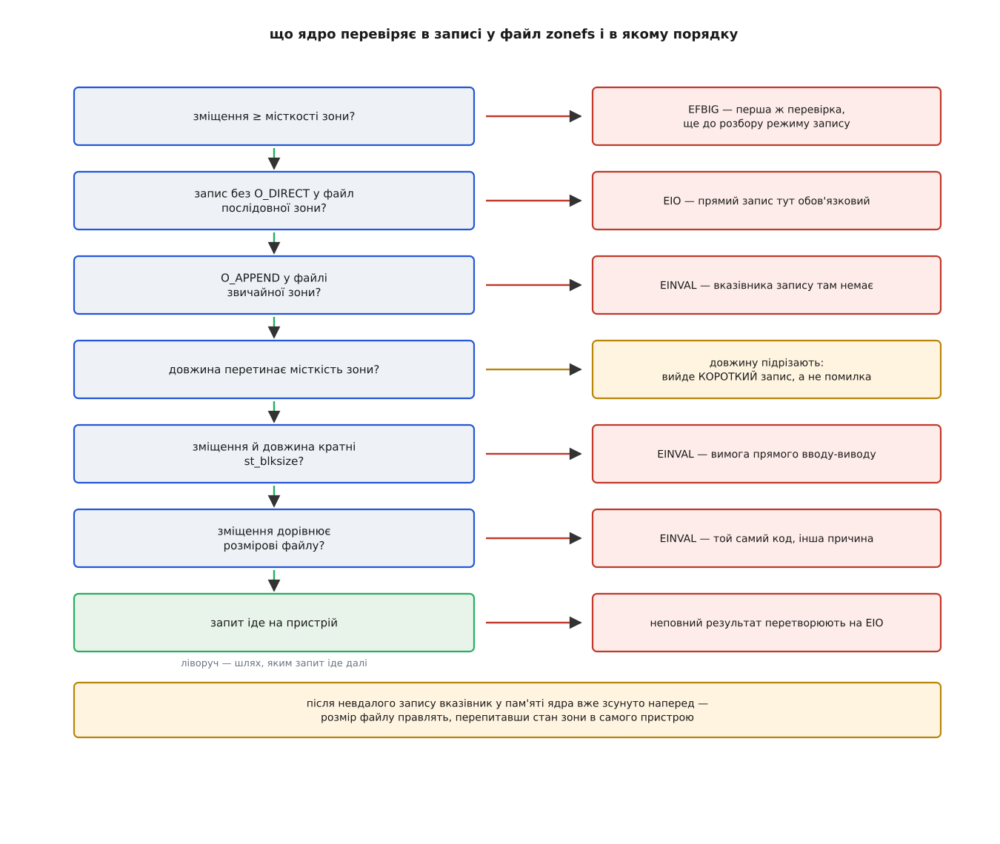

# ⚙️ Дописування в зонний файл: програма, яка навмисно ловить кожну помилку

Це працездатна програма на C, що дописує дані у файл послідовної зони zonefs звичайними `open`, `fstat`, `pwrite` і `ftruncate` — і стенд, на якому її можна прогнати без черепичного диска. Написана вона не заради вдалого випадку: кожну заборону вона переступає зумисне й друкує, що саме повернуло ядро. Помилка, побачена власними очима, лягає в голову інакше, ніж помилка з переліку.

## Стенд, якого не треба купувати

Драйвер `null_blk` уміє прикидатися [зонованим пристроєм](root:sys-unix/zoned-block-devices): він оголошує зони, веде вказівники запису й відхиляє все, що суперечить порядку, — точно як справжній носій, тільки дані тримає в пам'яті. Цього досить: zonefs розмовляє з блоковим шаром, а не з пластинами.

Пристрій зручніше складати через [configfs](root:sys-unix/configfs), бо там кожен параметр — окремий файл, і видно, що саме задано:

```bash
sudo modprobe null_blk nr_devices=0        # модуль без готових пристроїв
D=/sys/kernel/config/nullb/zdev
sudo mkdir $D
echo 4096 | sudo tee $D/blocksize     >/dev/null   # логічний блок 4 КіБ
echo 1    | sudo tee $D/memory_backed >/dev/null   # дані справді зберігаються
echo 1    | sudo tee $D/zoned         >/dev/null
echo 512  | sudo tee $D/size          >/dev/null   # увесь пристрій, МіБ
echo 64   | sudo tee $D/zone_size     >/dev/null   # зона, МіБ → усього 8 зон
echo 2    | sudo tee $D/zone_nr_conv  >/dev/null   # перші дві зони — звичайні
echo 1    | sudo tee $D/power         >/dev/null   # вмикаємо → /dev/nullb0
```

Далі — форматування й монтування. Інструмент `mkzonefs` лежить у пакунку `zonefs-tools`; ключ `-f` дозволяє переписати вміст, який там уже був:

```bash
sudo mkzonefs -f /dev/nullb0
sudo mkdir -p /mnt/z
sudo mount -t zonefs -o explicit-open /dev/nullb0 /mnt/z
ls /mnt/z/seq            # 0 1 2 3 4 5 — шість послідовних зон
sudo blkzone report /dev/nullb0 | head -3
```

Нульова зона пішла під суперблок і назовні не видна, друга звичайна стала `/mnt/z/cnv/0`, решта шість — `/mnt/z/seq/0`…`5`. Права на всі файли приходять із суперблока й на ходу не міняються, тож типово це `root:root` і `0640` — звідси `sudo` в запуску. Кому набридне, той форматує з `mkzonefs -f -o uid=1000,gid=1000 /dev/nullb0`: числа з ключів запікаються в суперблок і роздаються всім файлам при монтуванні.

Одне застереження про ядро. До версії 6.10 порядок записів у зону тримав планувальник `mq-deadline`, і для зонованого пристрою його доводилося ставити руками; у 6.10 з'явилося затикання зон (zone write plugging) на рівні блокового шару, і тепер [планувальник](root:sys-unix/io-schedulers) можна брати будь-який, зокрема `none`. На старішому ядрі перед монтуванням варто зробити `echo mq-deadline | sudo tee /sys/block/nullb0/queue/scheduler`.

## Три числа, і жодного власного стану

Тепер головне рішення в програмі. Спокуса — завести змінну «скільки я вже записав» і додавати до неї довжину кожного успішного запису. Це рівно та помилка, яку такий носій карає найболючіше: вказівник запису живе в пристрої, а не в програмі, і будь-яка невдача — від часткового виконання великого запиту до зони, що злягла, — розводить це число з дійсністю. Далі кожен наступний запис отримує `EINVAL`, а причина лишається за десять кроків позаду.

Тож програма не пам'ятає нічого. Перед кожним записом вона питає `fstat`, і в трьох полях відповіді лежить усе потрібне:

```
st_size    → вказівник запису: єдине зміщення, за яким приймуть запис
st_blocks  → місткість зони в 512-байтових одиницях: найбільший розмір файлу
st_blksize → крок, кратним якому мусять бути й зміщення, і довжина
```

Третє число варте окремої уваги. zonefs ставить розмір свого блока рівним не 512 і не розмірові сторінки, а гранулярності запису в зону, яку оголосив пристрій, — і саме це число повертає `st_blksize`. Здогадуватися не треба й не можна: на одному носії це 512, на іншому 4096.

І ще одна дрібниця, на якій спотикаються першого ж дня. Вимог вирівнювання в [прямого вводу-виводу](root:sys-unix/buffered-and-direct-io) не одна, а три, і жодна не випливає з інших: кратними блокові мусять бути зміщення у файлі, довжина запиту й **адреса буфера в пам'яті**. Останню звичайний `malloc` не гарантує, тож буфер беруть у `posix_memalign`. Зручний хід — вирівнювати не по блоку, а по сторінці пам'яті: вона кратна будь-якому розмірові блока, тож замалою не буває ніколи, і в програмі стає на одне число менше.

## Програма

```c
/* zappend.c — дописування у файл послідовної зони zonefs.
 * збірка: cc -O2 -Wall -Wextra -o zappend zappend.c
 * запуск: sudo ./zappend /mnt/z/seq/0 /mnt/z/cnv/0
 */
#define _GNU_SOURCE
#include <errno.h>
#include <fcntl.h>
#include <stdio.h>
#include <stdlib.h>
#include <string.h>
#include <sys/stat.h>
#include <unistd.h>

#define CHUNK (6u << 20)   /* 6 МіБ: навмисно НЕ дільник 64-мебібайтної зони */

struct zone {
	off_t  wp;    /* st_size:    вказівник запису */
	off_t  cap;   /* st_blocks:  місткість зони, вона ж найбільший розмір */
	size_t blk;   /* st_blksize: крок вирівнювання прямого запису */
};

/* Єдине джерело правди про зону — сам пристрій, перепитаний через fstat. */
static int look(int fd, struct zone *z)
{
	struct stat st;

	if (fstat(fd, &st) < 0)
		return -1;
	z->wp  = st.st_size;
	z->cap = (off_t)st.st_blocks * 512;   /* st_blocks завжди в одиницях по 512 Б */
	z->blk = (size_t)st.st_blksize;
	return 0;
}

static const char *ename(int e)
{
	switch (e) {
	case EINVAL: return "EINVAL";
	case EFBIG:  return "EFBIG";
	case EIO:    return "EIO";
	case EPERM:  return "EPERM";
	default:     return strerror(e);
	}
}

static void say(const char *what, ssize_t r)
{
	if (r < 0)
		printf("  %s → %s\n", what, ename(errno));
	else
		printf("  %s → %zd Б\n", what, r);
}

/* Окреме відкриття потрібне там, де перевіряють саме прапорці відкриття. */
static void try_write(const char *path, int flags, const void *buf, size_t len,
		      const char *what)
{
	int fd = open(path, flags);

	if (fd < 0) {
		printf("  %s → не відкрився: %s\n", what, strerror(errno));
		return;
	}
	say(what, write(fd, buf, len));
	close(fd);
}

int main(int argc, char **argv)
{
	const char *seq = argc > 1 ? argv[1] : "/mnt/z/seq/0";
	const char *cnv = argc > 2 ? argv[2] : "/mnt/z/cnv/0";
	size_t align = (size_t)sysconf(_SC_PAGESIZE);
	struct zone z;
	void *buf;
	int fd;

	/* O_DIRECT обов'язковий: буферизований запис у seq-файл не приймають узагалі. */
	fd = open(seq, O_RDWR | O_DIRECT);
	if (fd < 0 || look(fd, &z) < 0) {
		perror(seq);
		return 1;
	}
	printf("%s: вказівник %lld, місткість %lld, блок %zu\n",
	       seq, (long long)z.wp, (long long)z.cap, z.blk);

	/* Прямий запис вимагає вирівняної адреси буфера. Сторінка кратна будь-якому
	   розмірові блока, тож вирівнювання по ній не буває замалим. */
	if (posix_memalign(&buf, align, CHUNK) != 0) {
		fprintf(stderr, "немає вирівняної пам'яті\n");
		return 1;
	}
	memset(buf, 0xA5, CHUNK);

	/* Чистий старт. Це не правка обліку, а команда скидання до самого носія. */
	if (ftruncate(fd, 0) < 0)
		perror("скидання зони");

	look(fd, &z);
	say("перший дозволений запис — у самий кінець файлу",
	    pwrite(fd, buf, CHUNK, z.wp));

	puts("\nнавмисні порушення контракту:");
	look(fd, &z);
	say("запис на блок назад від кінця",
	    pwrite(fd, buf, z.blk, z.wp - (off_t)z.blk));
	say("запис у кінець, але довжиною 100 Б",
	    pwrite(fd, buf, 100, z.wp));
	say("запис за місткістю зони",
	    pwrite(fd, buf, z.blk, z.cap));
	say("читання за місткістю зони",
	    pread(fd, buf, z.blk, z.cap));
	say("читання за розміром, у межах зони",
	    pread(fd, buf, z.blk, z.wp));

	try_write(seq, O_WRONLY, buf, z.blk,                /* без O_DIRECT */
		  "буферизований запис у seq-файл");
	try_write(cnv, O_WRONLY | O_DIRECT | O_APPEND, buf, z.blk,
		  "O_APPEND у файлі звичайної зони");

	/* O_APPEND у seq-файлі: зміщення підставляє ядро під замком inode,
	   тож між «дізнатися розмір» і «записати» не лишається щілини. */
	try_write(seq, O_WRONLY | O_DIRECT | O_APPEND, buf, CHUNK,
		  "write() з O_APPEND — зміщення вибирає ядро");

	puts("\nскорочення — обидва дозволені значення й одне заборонене:");
	look(fd, &z);
	printf("  ftruncate до половини місткості → %s\n",
	       ftruncate(fd, z.cap / 2) < 0 ? ename(errno) : "прийнято");
	printf("  ftruncate до місткості (завершення зони) → %s\n",
	       ftruncate(fd, z.cap) < 0 ? ename(errno) : "прийнято");
	look(fd, &z);
	printf("  розмір завершеної зони: %lld\n", (long long)z.wp);
	say("запис у завершену зону", pwrite(fd, buf, z.blk, z.wp));
	printf("  ftruncate до нуля (скидання зони) → %s\n",
	       ftruncate(fd, 0) < 0 ? ename(errno) : "прийнято");

	puts("\nзаповнення зони до кінця:");
	while (look(fd, &z) == 0 && z.wp < z.cap) {
		ssize_t r = pwrite(fd, buf, CHUNK, z.wp);

		if (r <= 0) {
			printf("  зупинилися на %lld: %s\n", (long long)z.wp, ename(errno));
			break;
		}
		if ((size_t)r != CHUNK)
			printf("  короткий запис на зміщенні %lld: просили %u, узяли %zd\n",
			       (long long)z.wp, CHUNK, r);
	}
	look(fd, &z);
	printf("розмір наприкінці: %lld\n", (long long)z.wp);

	free(buf);
	close(fd);
	return 0;
}
```

## Що друкує прогін

```
/mnt/z/seq/0: вказівник 0, місткість 67108864, блок 4096
  перший дозволений запис — у самий кінець файлу → 6291456 Б

навмисні порушення контракту:
  запис на блок назад від кінця → EINVAL
  запис у кінець, але довжиною 100 Б → EINVAL
  запис за місткістю зони → EFBIG
  читання за місткістю зони → 0 Б
  читання за розміром, у межах зони → 0 Б
  буферизований запис у seq-файл → EIO
  O_APPEND у файлі звичайної зони → EINVAL
  write() з O_APPEND — зміщення вибирає ядро → 6291456 Б

скорочення — обидва дозволені значення й одне заборонене:
  ftruncate до половини місткості → EPERM
  ftruncate до місткості (завершення зони) → прийнято
  розмір завершеної зони: 67108864
  запис у завершену зону → EFBIG
  ftruncate до нуля (скидання зони) → прийнято

заповнення зони до кінця:
  короткий запис на зміщенні 62914560: просили 6291456, узяли 4194304
розмір наприкінці: 67108864
```

Тепер варто відірватися від файлів і перепитати сам носій: `sudo blkzone report /dev/nullb0` покаже вказівники запису всіх восьми зон. Число навпроти другої послідовної зони збігається з тим, що показав `stat` на `seq/0`, до байта — і збігатиметься завжди, бо це одне число, прочитане двома дорогами. Саме тут тотожність «розмір файлу — це вказівник запису» перестає бути формулюванням і стає тим, що видно.

Два рядки в переліку заслуговують більшого, ніж галочка. `EPERM` на скороченні до половини — не описка: неправильне значення `ftruncate` тут не «недійсний аргумент», а «не дозволено», бо обидва дозволені значення насправді є командами до пристрою, а третьої команди просто немає. І короткий запис наприкінці — теж не помилка: запит, що починається в межах зони, а закінчується за її місткістю, ядро підрізає до місткості й виконує. Цикл, який не перевіряє повернуту довжину, тихо загубить хвіст останнього шматка.

## Ворота, крізь які проходить запис

Дві різні пастки віддали той самий `EINVAL`, а буферизований запис — зовсім інший `EIO`, хоч і він порушує той самий порядок. Пояснює це саме послідовність перевірок: помилка приходить з перших воріт, які не пропустили, і до наступних запит уже не доходить.



*Кожні ворота дивляться на щось одне; помилка приходить з першого, яке не пропустило.*

Перша перевірка стосується не режиму, а зміщення: якщо воно вже за місткістю зони, далі ядро не дивиться взагалі. Друга розводить два режими — буферизований запит у файл послідовної зони обривають одразу, бо фоновий злив кешу переставив би шматки, а порядок тут і є контрактом. І тільки після цього починаються перевірки, властиві прямому вводу-виводу: спершу вирівнювання, потім рівність зміщення вказівникові.

Звідси й практичний висновок про `EINVAL`. Код помилки не каже, котрі ворота спрацювали: невирівняна довжина й правильно вирівняне, але не те зміщення дають однакове число. Розрізнити їх може лише той, хто дивиться на власні аргументи, тож у діагностичне повідомлення варто друкувати обидва — і зміщення, і `st_size`, знятий тієї ж миті.

## Пастки, що видно тільки на бігу

**Місткість зони — не її розмір.** На черепичних дисках вони збігаються, а на носіях NVMe із зонами місткість буває меншою: між нею і кінцем зони лежить хвіст, якого не адресує ніщо. Тому межу беруть із `st_blocks` конкретного файлу, а не з розміру зони, прочитаного один раз десь на старті.

**Вказівник зсувають наперед.** Ядро посуває свій вказівник ще до того, як запис завершився, — інакше довелося б серіалізувати перевірки. Коли запис провалюється, спрацьовує відновлення: стан зони перепитують у пристрою й правлять розмір файлу. Для програми це означає одне правило: після будь-якої помилки — новий `fstat`, і жодних припущень про те, куди сів вказівник.

**Частковий результат перетворюють на помилку.** Великий прямий запис у послідовну зону ядро ділить на частини; якщо на носій пішла тільки частина, системний виклик повертає `EIO`, а не число байтів. Отже, короткий результат тут має рівно одну причину — межу місткості; ніякого «дописати рештку й піти далі» після помилки не буває.

**Асинхронний запис «без очікування» відхиляють.** Прямий запис у файл послідовної зони, поданий асинхронно з проханням не блокуватися (`RWF_NOWAIT`, а з ним і перша, неблокуюча спроба [io_uring](root:sys-unix/io-uring-rings-model)), повертає `EOPNOTSUPP`. Причина в коментарі ядра сформульована прямо: перший запит міг би відскочити на замку inode, другий тим часом пройшов би — і став би записом за неправильним зміщенням. Заборона груба, зате чесна: порядок у зоні не переживає перестановки, тож або запити в один файл серіалізовано, або їх подають так, щоб вони могли зачекати.

**Ліміт відкритих зон приходить у найгіршу мить.** Пристрій обмежує, скільки зон можна тримати відкритими й активними водночас, і без параметра монтування `explicit-open` про це дізнаються з невдалого запису посеред роботи. З ним невдалим стає `open`, коли ще нічого не почалося. Самі числа лежать у `/sys/fs/zonefs/nullb0/` — `max_wro_seq_files` і `max_active_seq_files` разом з поточними значеннями; нуль означає, що обмеження немає. Читати їх варто [звідти ж, звідки й решту атрибутів пристроїв](root:sys-unix/sysfs-device-model).

**Скидання зони незворотне.** `ftruncate(fd, 0)` не повертає блоки в пул і не лишає даних на пластині до перезапису — це фізичне стирання зони. Звична обережність рівня «файл ще можна врятувати» тут не працює зовсім.

**Індексу нема де жити.** Те, яка зона що містить, пам'ятає сама програма, і цю таблицю доводиться правити на місці — чого послідовна зона не вміє в принципі. Для того й лишається `cnv/0`: у ньому індекс живе спокійно, а за потреби там можна створити звичайну файлову систему й підключити її через [петльовий пристрій](root:sys-unix/loop-device).

Прибрати стенд можна так само, як він з'явився: `sudo umount /mnt/z`, далі `echo 0 | sudo tee $D/power` і `sudo rmdir $D`. Пристрій зникає разом із даними — що для стенда, на якому навмисно ламають контракт, радше перевага.
