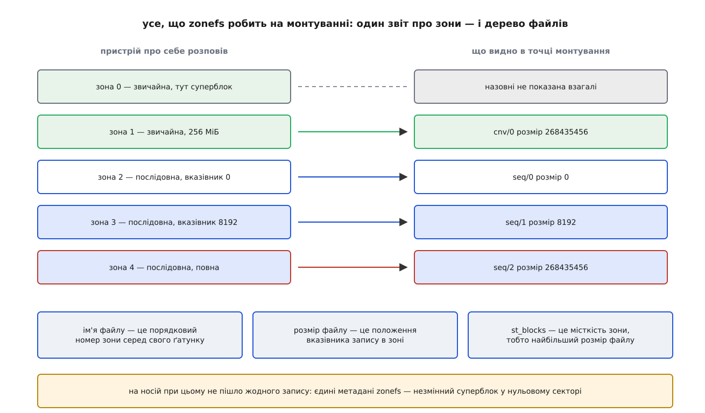
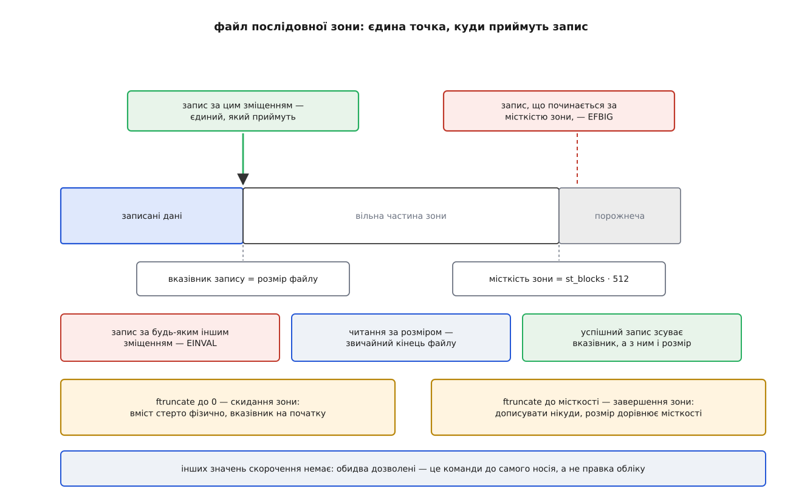

# zonefs: кожна зона носія як звичайний файл

<preknowlist>
- [Зонований блоковий пристрій](root:sys-unix/zoned-block-devices) — носій ділить простір номерів на зони; у послідовну зону приймають запис лише у вказівник запису, а звільнити її можна тільки скиданням цілком.
- [Inode: файл без імені](root:sys-unix/inode-model) — вміст файлу описує окрема структура з розміром і переліком блоків, а ім'я до неї лише прив'язане.
- [Каталог як відображення імен](root:sys-unix/directory-as-mapping) — каталог зберігає пари «ім'я → номер inode» і більше нічого.
- [Буферизований і прямий ввід-вивід](root:sys-unix/buffered-and-direct-io) — звичайний запис лягає в кеш сторінок і потрапляє на носій пізніше, у порядку, який обирає ядро; O_DIRECT везе дані повз кеш.
- [Журналювання й узгодженість після збою](root:sys-unix/journaling-consistency) — файлова система веде власні метадані й окремими зусиллями стежить, щоб після аварії вони лишалися взаємно узгодженими.
</preknowlist>

## Проміжок між двома крайнощами

Рушій сховища, що складає дані великими незмінними шматками, знає про них те, чого не знає ніхто під ним: шматок або перепишуть цілком, або не перепишуть ніколи. Носій, який вимагає заповнювати великі ділянки підряд і звільняти їх повністю, такому рушієві нічим не заважає — його розкладка й так саме така.

Але розмова з таким носієм виглядає не так, як робота з файлами. Треба відкрити пристрій цілком, спитати в нього перелік ділянок [службовим викликом ioctl](root:sys-unix/ioctl-interface), розібрати відповідь у вигляді масиву структур, самому рахувати номери секторів і самому пам'ятати, де в кожній ділянці зупинився запис. Права теж ідуть оптом: доступ до файлу пристрою — це доступ до всього носія, з усіма чужими даними на ньому.

Дві готові відповіді на цю незручність уже існували, і жодна з них не розв'язувала саме її. Файлові системи, що вміють зоновані носії — F2FS, Btrfs, XFS ([огляд родин](root:sys-unix/filesystem-families)), — ховають обмеження під собою: вони самі вирішують, що куди класти. Рушієві, який має власну думку про розміщення, така допомога тільки заважає: він змагатиметься з файловою системою за те саме рішення. З іншого боку — [dm-zoned](root:sys-unix/dm-zoned), що ховає зони ще глибше, показуючи носій звичайним. Посередині не було нічого: або в тебе забирають рішення, або ти говориш ioctl-ами.

**zonefs** заповнює саме цей проміжок. Вона з'явилася в ядрі 5.6 у березні 2020 року; автор — Дам'єн Ле Моаль, тоді інженер Western Digital. Вона нічого не ховає й нічого не міняє в тому, як мусить лягати запис. Вона міняє тільки словник: замість ioctl-ів і арифметики секторів — `open`, `write`, `stat`, `ftruncate` над файлами.

## Файл, якого ніхто не розміщував

Щоб побачити, наскільки мало тут лишається роботи, варто перелічити, з чого складається файл у звичайній файловій системі. Каталог зберігає відповідність імені й номера inode. Inode зберігає розмір і перелік блоків, у яких лежить вміст. Блоки роздає розподільник вільного місця. Усі три ланки файлова система вигадує сама — і саме тому мусить окремо стежити, щоб після раптового вимкнення живлення вони не розійшлися між собою; на це й витрачається журнал.

Тепер порахуймо, що з цього лишається, коли всі три ланки вже визначені пристроєм. Зони задані: їх стільки, скільки є, вони однакового розміру й лежать у незмінному порядку. Розподіляти нічого — кожна зона зайнята сама собою від першої секунди. Ім'ям може бути порядковий номер зони. А розмір даних у зоні пристрій і так рахує сам, бо мусить: це вказівник запису.

Тож на диску від zonefs лишається один суперблок на 4096 байтів у нульовому секторі, і в ньому: магічне число `0x5a4f4653`, контрольна сума, мітка тому, UUID, прапорці можливостей та uid, gid і біти прав, які отримають усі файли. Це все. Суперблок незмінний — його пишуть один раз під час форматування й більше ніколи не переписують.

Монтування зводиться до одного запиту звіту про зони. З відповіді ядро будує дерево файлів у пам'яті. Для типового черепичного диска на 15 ТБ із зонами по 256 МіБ це близько п'ятдесяти п'яти тисяч файлів — і жоден із них не коштує ані байта на носії.



*Ліворуч — те, що розповів про себе пристрій; праворуч — усе, що zonefs із цього робить. Між ними немає жодного запису на носій.*

Зону, у якій лежить суперблок, назовні не показують узагалі. А якщо ця зона послідовна, інструмент форматування `mkzonefs` одразу переводить її в стан «повна»: у повну зону писати нікуди. Єдині метадані цієї файлової системи захищено не замком і не журналом, а станом самої зони.

> 🔧 **Навіщо це.** Питання «що буде з файловою системою, якщо машина вимкнеться посеред запису» тут просто не виникає — не тому, що zonefs надійна, а тому, що їй нічого втрачати. Немає інших метаданих, крім незмінного суперблока, немає розподілу вільного місця, немає й `fsck`: перевіряти нічого, а стан зони по ввімкненні розкаже сам пристрій. Уся вразливість до аварії лишається там, де вона й була, — у даних програми всередині зони.

## Ім'я, яке знову означає місце

У корені змонтованої файлової системи є рівно два каталоги: `cnv` для звичайних зон і `seq` для послідовних. Перший створюють лише тоді, коли звичайні зони справді є й хоч одна з них не з'їдена суперблоком. Файли в кожному з них звуться `0`, `1`, `2` і далі — за зростанням початкового сектора зони. Розмір самого каталогу, який показує `stat`, дорівнює кількості файлів у ньому.

Створити файл не можна. Видалити не можна. Перейменувати не можна. Змінити атрибути — теж не можна: власник і біти прав приходять із суперблока (типово `root:root` і `0640`) і на ходу не міняються.

Це не урізана файлова система, а зумисне зроблена річ. У звичайній файловій системі ім'я навмисно відв'язане від вмісту — саме тому існують перейменування й жорсткі посилання, саме тому один вміст може мати кілька імен або жодного. Тут відв'язування скасовано: ім'я — це адреса. Файл `seq/17` — це вісімнадцята послідовна зона диска, і він буде нею після перезавантаження, після перемонтування, на іншій машині та в будь-якій програмі, що прочитає той самий носій. Програма може покласти число 17 у власний покажчик і поводитися з ним як з адресою, не боячись, що хтось перейменує ціль.

Виграш проти сирого пристрою при цьому лишається, і він не в правах на окремий файл, а в тому, що тепер це точка монтування. Її можна віддати службі як каталог, занести в простір імен контейнера, накрити правилами — і програмі більше не потрібен доступ до всього блокового пристрою заради своїх п'ятдесяти зон.

## Розмір файлу — це вказівник запису

Найважливіше в zonefs — одна тотожність. Розмір файлу послідовної зони не є числом, яке хтось десь записав і підтримує. Це положення вказівника запису, зчитане в пристрою. Поле `st_blocks`, яке зазвичай означає «скільки блоків під файл виділено», тут означає місткість зони, тобто найбільший можливий розмір цього файлу: зону від початку віддано під файл цілком, тож «виділено» й «місткість» — те саме число.

Звідси випливає весь контракт. Запис приймають рівно за зміщенням, що дорівнює поточному розмірові файлу; будь-яке інше зміщення — `EINVAL`. Успішний запис збільшує розмір рівно на свою довжину, бо саме на стільки зсунувся вказівник. Читання за розміром дає те саме, що будь-який файл дає за своїм кінцем, — нічого. Запис за місткістю зони відхиляють з `EFBIG`.

**Файл `/mnt/seq/17` на носії з місткістю зони 256 МіБ, у який уже записали 8 КіБ:**

```
stat: st_blocks = 524288 блоків по 512 Б → місткість = 268435456 Б (256 МіБ)
      st_size   = 8192                   → вказівник стоїть на 8192-му байті

pwrite(fd, buf, 4096,      8192)  → 4096, st_size стає 12288
pwrite(fd, buf, 4096,      4096)  → EINVAL  (зміщення ≠ кінець файлу)
pwrite(fd, buf, 4096, 268435456)  → EFBIG   (за місткістю зони)
pread (fd, buf, 4096,     12288)  → 0       (за кінцем файлу)
```

Скорочення файлу має рівно два дозволені значення, і обидва — це команди до пристрою. `ftruncate(fd, 0)` скидає зону: вміст стирається, вказівник вертається на початок, файл знову порожній. `ftruncate(fd, місткість)` завершує зону: вона переходить у стан «повна», дописувати більше нікуди, а розмір назавжди дорівнює місткості, хоч би скільки байтів у ній справді лежало. Будь-яке інше значення відхиляють.

Варто зупинитися на тому, наскільки це незвично. Скорочення файлу до нуля у звичайній файловій системі — операція над обліком: блоки повертають у пул, вміст лишається на пластині, доки його хтось не перезапише. Тут це фізична дія на носії, яку не можна відкликати. І навпаки: `ftruncate` до місткості не «дописує нулі до кінця», а замикає зону — розмір виріс, а даних не додалося.



*Розмір файлу й вказівник запису — це одне число; за місткістю зони починається порожнеча, крізь яку не проходить ні читання, ні запис.*

Уся ця поведінка означає, що файл не має власного стану. Усе, що каже про нього `stat`, — це перечитаний стан зони.

## Чому писати можна тільки напряму

Звичайний запис лягає в кеш сторінок, а фоновий злив кешу сам вирішує, коли й у якому порядку відправити брудні сторінки на носій: він їх зливає, склеює й переставляє заради швидкості. Для послідовної зони порядок — це і є контракт, тож така свобода вбивча.

Тому zonefs просто не приймає буферизованого запису в файли послідовних зон: така спроба повертає `EIO`. Не приймає вона й записуваних спільних відображень у пам'ять — з тієї самої причини. Лишається `O_DIRECT`, до того ж зі зміщенням і довжиною, кратними блокові пристрою. Читання ж не обмежене нічим: буферизоване, пряме, через `mmap` — як завгодно.

Прапорець `O_APPEND` тут не розкіш, а спосіб уникнути перегонів: ядро саме підставляє в зміщення поточний вказівник, тож між «дізнатися розмір» і «записати за цим розміром» не лишається щілини, куди міг би втиснутися чужий запис. На файлі звичайної зони `O_APPEND` відхиляють з `EINVAL` — там немає вказівника, до якого можна дописувати.

Файли звичайних зон узагалі живуть за старими правилами: розмір у них сталий і дорівнює розмірові зони, скоротити їх не можна, а писати можна куди завгодно й чим завгодно. З цього виходить корисний хід: якщо форматувати з об'єднанням звичайних зон в один файл, `/mnt/cnv/0` стає великим файлом довільного доступу, у якому можна створити звичайну файлову систему й змонтувати її через петльовий пристрій. Індекс програми — те, яка зона що зберігає, — має де жити, і живе він на тій частині диска, яка й призначена для перезапису на місці.

Точний перелік того, що вміє інструмент форматування, які є параметри монтування, що лежить у sysfs і як саме поводиться відновлення після помилок, зібрано окремо: [поверхня zonefs — від суперблока до таблиці політик](root:sys-unix/zonefs/api-zonefs-surface.md). А працездатну програму, яка дописує в зонний файл прямим вводом-виводом і навмисно натикається на кожну з описаних помилок, розібрано [в окремому прикладі](root:sys-unix/zonefs/proj-append-to-zone-file.md) — її можна ганяти на віртуальному зонованому пристрої, без черепичного диска.

## Коротка історія одного відкату

З ядра 5.8, щойно блоковий шар навчився цієї команди, zonefs виконувала синхронний прямий запис не звичайною командою запису, а командою дозапису в зону: пристрій сам обирає місце в межах зони й повертає адресу, за якою поклав. Для zonefs це було безпечно — вона й так пише рівно в кінець файлу, тож повернена адреса передбачувана, — зате знімало обмеження «один запис у польоті на зону», яке інакше накладає блоковий шар заради збереження порядку.

У ядрі 6.5 цю оптимізацію прибрали. Причина суто механічна: після переходу на спільний шар `iomap` великий запит будується як один великий bio, а блоковий шар за потреби ділить його на частини — тоді як bio дозапису ділити заборонено, бо адреса, яку поверне пристрій, одна на всю операцію. Великий запис починав зривати попередження в `bio_split`. Дам'єн Ле Моаль повернув звичайні команди запису з наміром відновити дозапис, коли `iomap` навчиться його підтримувати належно; станом на сьогодні в основній гілці лишаються звичайні записи, а за порядком стежить блоковий шар.

Епізод показує ціну адреси, яку обирає пристрій: така операція неподільна за побудовою, тож її розмір обмежений тим, що носій оголосив, і жоден шар вище не має права порізати її навпіл.

## Скільки файлів можна тримати відкритими на запис

Пристрій має скінченний ресурс на зони, у які зараз пишуть, і оголошує його межі числами. Програма, яка про ці числа не думає, дізнається про них найгіршим способом: черговий запис у черговий файл раптом повертає помилку, і сталося це посеред роботи, у випадковий момент.

Параметр монтування `explicit-open` переносить цю зустріч на вхід. Коли файл послідовної зони вперше відкривають на запис, zonefs надсилає пристроєві команду «відкрити зону»; якщо ліміт вичерпано, невдалим стає `open`, а не запис — і програма дізнається про це там, де ще нічого не почала. На останньому закритті файлу, якщо зона не порожня й не повна, надсилається команда «закрити зону», щоб віддати ресурс назад.

Самі числа лежать у `/sys/fs/zonefs/<пристрій>/`: скільки файлів послідовних зон узагалі можна тримати відкритими на запис і скільки їх відкрито зараз; скільки може бути активних, тобто частково записаних або явно відкритих, і скільки їх зараз. Нуль означає, що пристрій обмежень не має. Без `explicit-open` поточне число відкритих на запис може перевищити межу — тоді відповідальність за наслідки бере на себе програма.

> 🔧 **Навіщо це.** Апаратне обмеження, сформульоване в термінах зон, тут перекладене в термін, яким програми оперують щодня: скільки файлів дозволено тримати відкритими на запис. Питання «скільки паралельних потоків запису тягне це сховище» перестає бути питанням до документації носія й стає числом, яке можна прочитати зі звичайного файлу.

## Коли пристрій розходиться з уявленням

Вказівник запису zonefs тримає в пам'яті й зсуває наперед, ще до того, як операція завершилася, — інакше довелося б серіалізувати перевірки. Якщо запис не вдався, пам'ять бреше, і полагодити її можна лише одним способом: перепитати пристрій.

Розійтися вони можуть у кілька способів, і всі вони справжні. Велика операція, поділена на частини, може провалитися посередині: частина частин пройшла, вказівник зсунувся, а системний виклик повернув помилку. Помилка з відкладеного запису випливає взагалі пізніше — коли скидають кеш пристрою на `fsync`, і тоді вона забирає з собою все, що лежало за зіпсованим сектором ([про довговічність запису й роль fsync](root:sys-unix/page-cache-durability)). А ще зона може змінити стан сама: перейти в «лише для читання» або взагалі у «відключена». Причини стандарти не описують, але типова цілком матеріальна — несправна головка забирає з собою всі зони, які під нею.

Звичайна файлова система в такій ситуації ремонтує власні метадані. Ремонтувати нема чого — тому відновлення в zonefs означає рівно дві дії. Перша: перепитати стан зони й виправити розмір файлу до того, що справді лежить у зоні, — інколи вгору, інколи вниз. Друга: вирішити, наскільки голосно зачинити двері. Зона, що стала доступною лише для читання, робить файл незаписуваним; відключена зона забирає й читання, а розмір файлу стає нулем.

Обсяг цієї другої дії обирає параметр монтування `errors=`. Типове `remount-ro` переводить у режим лише для читання всю файлову систему — найобережніший варіант. `zone-ro` обмежується постраждалим файлом, `zone-offline` глушить його повністю, `repair` виправляє тільки розміри й не чіпає прав у справних зонах. Тонкість, про яку легко забути: зміни прав, спричинені політикою, тимчасові й зникають після перемонтування, а зміни, спричинені справжнім станом зони, постійні — ні перемонтування, ні повторне форматування не повернуть запис у зону, яку пристрій оголосив мертвою.

Окремий випадок доводить головну думку до кінця. Зону, яку застали в стані «лише для читання» вже на монтуванні, zonefs трактує як відключену: усі звертання заборонено, розмір нуль. Причина в тому, що стандарти оголошують вказівник запису такої зони недійсним — дізнатися, скільки в ній насправді записано, неможливо. Файлова система, у якої немає власних метаданих, у цій точці не має чим замінити мовчання пристрою; чесніше зачинити файл, ніж вигадати йому розмір.

## Що лишається програмі

Перелік того, чого zonefs не робить, коротший за перелік того, чого не робить будь-яка інша файлова система, і кожен його рядок навмисний. Вона не веде облік вільного місця. Вона не дає імен: яка зона що зберігає — пам'ятає програма. Вона не прибирає: коли дані в зоні здебільшого померли, хтось мусить переписати рештки живого в іншу зону й скинути цю, і цей «хтось» — теж програма.

Саме через це zonefs і виникла. Рушій на кшталт RocksDB, що складає дані в [структуру на основі журналу злиття](root:sf-data/lsm-tree), кладе один незмінний блок даних в один зонний файл — і його власне прибирання, яке він і так робив, збігається зі скиданням зони до байта. Знання про те, які дані помруть разом, лишається там, де воно є, а ядро дає до нього словник.

І тут видно, чим виявляється файл, коли файлова система під ним не розподіляє місця, не вигадує імен і не веде журналу. Лишаються рівно чотири речі: ім'я в просторі імен, власник і біти прав, довжина та дієслова читання й запису. Цього досить, щоб через ту саму точку монтування працювали `dd`, `stat` і будь-яка бібліотека будь-якою мовою. [Принцип «усе є файлом»](root:sys-unix/everything-is-a-file) виявляється не обіцянкою однакового зберігання, а обіцянкою однакового способу адресувати, роздавати права й викликати дії — настільки незалежною від пристрою під нею, що крізь неї без спотворення проходить навіть носій, який не вміє перезаписувати власні сектори.
